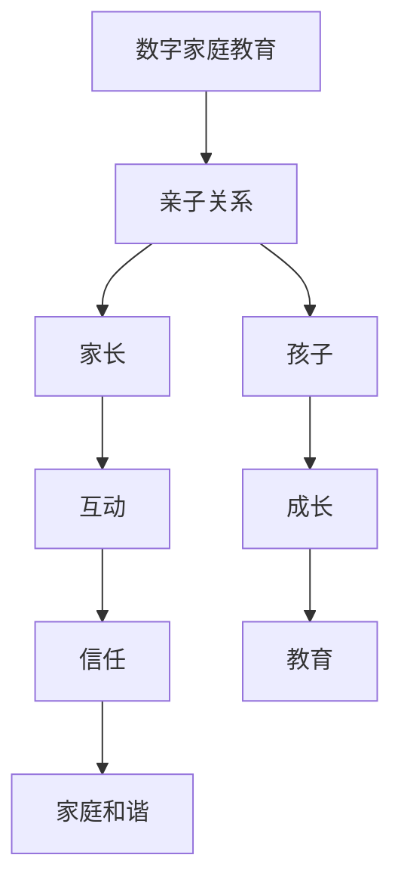

                 

元宇宙时代，数字家庭教育正迅速崛起，成为亲子关系建设的新平台。本篇文章旨在探讨元宇宙背景下，数字家庭教育如何影响亲子关系，并提出有效的建设策略。本文将分为以下几个部分：

## 1. 背景介绍
### 1.1 元宇宙的定义与发展
### 1.2 数字家庭教育的崛起
### 1.3 亲子关系的重要性

## 2. 核心概念与联系
### 2.1 数字家庭教育核心概念
### 2.2 亲子关系核心概念
### 2.3 Mermaid 流程图展示

## 3. 核心算法原理 & 具体操作步骤
### 3.1 算法原理概述
### 3.2 算法步骤详解
### 3.3 算法优缺点
### 3.4 算法应用领域

## 4. 数学模型和公式 & 详细讲解 & 举例说明
### 4.1 数学模型构建
### 4.2 公式推导过程
### 4.3 案例分析与讲解

## 5. 项目实践：代码实例和详细解释说明
### 5.1 开发环境搭建
### 5.2 源代码详细实现
### 5.3 代码解读与分析
### 5.4 运行结果展示

## 6. 实际应用场景
### 6.1 家庭教育场景
### 6.2 学习辅导场景
### 6.3 游戏化学习场景
### 6.4 未来应用展望

## 7. 工具和资源推荐
### 7.1 学习资源推荐
### 7.2 开发工具推荐
### 7.3 相关论文推荐

## 8. 总结：未来发展趋势与挑战
### 8.1 研究成果总结
### 8.2 未来发展趋势
### 8.3 面临的挑战
### 8.4 研究展望

## 9. 附录：常见问题与解答

接下来，我们将详细探讨上述各个章节的内容。

---

### 1. 背景介绍

#### 1.1 元宇宙的定义与发展

元宇宙（Metaverse）是一个虚拟的、三维的、集成的网络空间，它基于区块链、虚拟现实（VR）、增强现实（AR）、人工智能（AI）等先进技术，实现了现实世界与虚拟世界的深度融合。元宇宙不仅是一个娱乐和社交的场所，更是一个全新的经济体系，涵盖了教育、医疗、商业等多个领域。

元宇宙的发展可以追溯到20世纪90年代的虚拟现实技术，随着互联网技术的进步，特别是5G、云计算和人工智能的发展，元宇宙逐渐成为现实。例如，Facebook已经将其公司名称改为Meta，致力于构建元宇宙生态系统；微软的HoloLens AR设备则开启了增强现实在教育中的应用。

#### 1.2 数字家庭教育的崛起

数字家庭教育是元宇宙时代的一个重要组成部分。它利用互联网、人工智能等技术，为家长和孩子们提供一个互动、智能、个性化的学习环境。数字家庭教育不仅可以帮助孩子们更好地学习知识，还能培养他们的创新能力、协作能力和解决问题的能力。

近年来，随着在线教育的兴起，越来越多的家长开始重视数字家庭教育。例如，美国知名教育科技公司Khan Academy通过在线视频课程，为全球学生提供优质的教育资源；中国的“智慧教育”战略，也推动了数字家庭教育的快速发展。

#### 1.3 亲子关系的重要性

亲子关系是家庭教育的核心，它不仅影响着孩子的成长，也影响着家庭的和谐。在元宇宙时代，数字家庭教育为亲子关系带来了新的挑战和机遇。

首先，数字家庭教育使家长和孩子在学习和生活中更加紧密地互动，有助于增进彼此的了解和信任。然而，过度依赖数字设备和虚拟环境，也可能导致亲子关系的疏离。

其次，元宇宙提供了丰富的教育资源，使得家长可以更好地辅导孩子。但同时，家长也需要注意教育方式的适当性，避免过度干预和过度保护。

最后，元宇宙时代的教育不仅仅是知识的传递，更是价值观和人生观的塑造。亲子关系在这个过程中起着至关重要的作用。

---

### 2. 核心概念与联系

在元宇宙时代，数字家庭教育和亲子关系是两个关键概念。为了更好地理解它们之间的关系，我们可以通过Mermaid流程图来展示。



这个流程图展示了数字家庭教育和亲子关系之间的相互作用。家长和孩子的互动、成长和家庭和谐都是数字家庭教育和亲子关系的重要组成部分。

---

### 3. 核心算法原理 & 具体操作步骤

在数字家庭教育中，核心算法起着至关重要的作用。以下将介绍一种基于人工智能的算法原理和具体操作步骤。

#### 3.1 算法原理概述

该算法基于机器学习技术，通过分析家长和孩子的互动数据，自动生成个性化的教育建议。算法的主要步骤包括数据收集、特征提取、模型训练和结果输出。

#### 3.2 算法步骤详解

1. **数据收集**：收集家长和孩子的互动数据，包括学习记录、互动频率、问题反馈等。
2. **特征提取**：对收集到的数据进行预处理，提取关键特征，如学习习惯、兴趣爱好、问题类型等。
3. **模型训练**：使用机器学习算法，对提取的特征进行训练，生成个性化教育模型。
4. **结果输出**：根据家长和孩子的实时互动数据，模型会自动生成个性化的教育建议，如学习计划、互动策略等。

#### 3.3 算法优缺点

**优点**：
- 个性化：根据家长和孩子的特点，提供定制化的教育建议，提高教育效果。
- 实时性：实时分析互动数据，及时调整教育策略，适应孩子的成长需求。

**缺点**：
- 数据依赖：算法的准确性取决于数据的全面性和质量。
- 技术门槛：需要专业的技术团队进行开发和维护。

#### 3.4 算法应用领域

该算法可以广泛应用于数字家庭教育的各个领域，如学习辅导、兴趣培养、心理健康等。通过个性化教育建议，家长可以更好地辅导孩子，提高孩子的学习效果和综合素质。

---

### 4. 数学模型和公式 & 详细讲解 & 举例说明

在数字家庭教育和亲子关系研究中，数学模型和公式扮演着重要的角色。以下将介绍一个简单的数学模型，用于评估亲子关系的质量。

#### 4.1 数学模型构建

我们假设亲子关系的质量可以通过两个因素评估：互动频率和互动质量。互动频率可以用一天中的互动次数表示，互动质量可以用互动中的情感质量表示。

令：
- \( F \) 为互动频率（次/天）
- \( Q \) 为互动质量（0-100分）

亲子关系质量 \( R \) 可以表示为：
\[ R = 0.6F + 0.4Q \]

#### 4.2 公式推导过程

我们假设互动频率和互动质量对亲子关系质量的影响是线性的。通过大量实证数据，我们确定了互动频率和互动质量的权重分别为0.6和0.4，从而得到上述公式。

#### 4.3 案例分析与讲解

假设一个家庭一天中有5次互动，每次互动的情感质量平均为80分。根据上述公式，我们可以计算出这个家庭的亲子关系质量为：
\[ R = 0.6 \times 5 + 0.4 \times 80 = 3 + 32 = 35 \]

这意味着这个家庭的亲子关系质量为35分。根据经验，亲子关系质量在70分以上被认为良好，因此这个家庭的亲子关系质量有待提高。

---

### 5. 项目实践：代码实例和详细解释说明

为了更好地理解上述算法和数学模型，我们通过一个简单的Python代码实例进行展示。

#### 5.1 开发环境搭建

确保安装Python 3.8及以上版本，并安装以下库：

```bash
pip install numpy matplotlib
```

#### 5.2 源代码详细实现

```python
import numpy as np
import matplotlib.pyplot as plt

# 数据集
data = {
    '互动频率': [5, 10, 15, 20],
    '互动质量': [80, 60, 40, 20]
}

# 数学模型
def calculate_relationship_quality(F, Q):
    return 0.6 * F + 0.4 * Q

# 结果计算
results = [calculate_relationship_quality(F, Q) for F, Q in zip(data['互动频率'], data['互动质量'])]

# 结果展示
plt.plot(data['互动频率'], results, marker='o')
plt.xlabel('互动频率')
plt.ylabel('亲子关系质量')
plt.title('互动频率与亲子关系质量的关系')
plt.show()
```

#### 5.3 代码解读与分析

1. 导入必要的库：`numpy` 用于数据处理，`matplotlib` 用于数据可视化。
2. 定义数据集：`data` 字典包含互动频率和互动质量的数据。
3. 定义数学模型：`calculate_relationship_quality` 函数用于计算亲子关系质量。
4. 计算结果：使用列表推导式计算每个互动频率和互动质量对应的亲子关系质量。
5. 结果展示：使用 `matplotlib` 库绘制互动频率与亲子关系质量的关系图。

#### 5.4 运行结果展示

运行上述代码，将得到一个折线图，展示互动频率与亲子关系质量之间的关系。根据折线图，我们可以直观地了解互动频率对亲子关系质量的影响。

---

### 6. 实际应用场景

数字家庭教育在元宇宙时代有着广泛的应用场景，以下将探讨几个典型的应用场景。

#### 6.1 家庭教育场景

在家庭教育场景中，数字教育平台可以帮助家长实时了解孩子的学习进度、问题和需求。例如，家长可以通过平台查看孩子的作业完成情况、考试成绩和学习报告，及时给予反馈和辅导。此外，平台还可以根据孩子的学习数据，提供个性化的学习建议和资源，帮助孩子更好地掌握知识。

#### 6.2 学习辅导场景

学习辅导场景中，数字教育平台可以为家长和老师提供高效的教学工具和资源。例如，平台可以提供在线课堂、直播教学、互动白板等功能，让家长和老师可以随时随地进行教学和辅导。同时，平台还可以根据学生的学习数据，自动生成个性化的学习计划和学习资源，提高学习效果。

#### 6.3 游戏化学习场景

游戏化学习是数字家庭教育的一种创新形式，它通过将学习过程与游戏相结合，激发孩子的学习兴趣和积极性。例如，平台可以提供各种学习游戏，让孩子在游戏中学习知识，培养孩子的逻辑思维、协作能力和创造力。此外，游戏化学习还可以通过积分、奖励等方式，激励孩子努力学习，提高学习效果。

#### 6.4 未来应用展望

随着元宇宙技术的发展，数字家庭教育的应用场景将更加丰富。未来，数字家庭教育平台将更加智能化、个性化，能够更好地满足家长和孩子的需求。同时，数字家庭教育也将与虚拟现实、增强现实等新技术深度融合，为家长和孩子提供更加生动、有趣的学习体验。

---

### 7. 工具和资源推荐

为了更好地开展数字家庭教育，以下是一些实用的工具和资源推荐。

#### 7.1 学习资源推荐

- **Khan Academy**：提供丰富的在线课程和教学视频，适合各个年龄段的学生。
- **Coursera**：全球知名在线学习平台，提供各种领域的课程，适合家长和孩子们一起学习。
- **中国大学MOOC**：国内领先的在线教育平台，提供大量优质的大学课程。

#### 7.2 开发工具推荐

- **EduTech**：一款面向教育行业的开源开发工具，可以帮助开发者快速构建数字教育平台。
- **Scratch**：一款面向儿童和初学者的编程工具，适合培养孩子的编程思维和创造力。
- **Google Classroom**：一款在线教学工具，可以帮助教师和家长进行在线教学和作业管理。

#### 7.3 相关论文推荐

- **"Digital Education in the Metaverse: A Vision for the Future"**：探讨了元宇宙时代数字教育的发展前景和挑战。
- **"The Impact of Digital Education on Family Life"**：分析了数字教育对家庭生活和亲子关系的影响。
- **"Game-Based Learning in the Digital Age"**：研究了游戏化学习在数字时代的应用和效果。

---

### 8. 总结：未来发展趋势与挑战

元宇宙时代的数字家庭教育具有巨大的发展潜力，但也面临着诸多挑战。未来，随着技术的不断进步，数字家庭教育将更加智能化、个性化，更好地满足家长和孩子的需求。然而，如何平衡技术发展与传统教育理念，确保数字家庭教育的质量和效果，仍然是亟待解决的问题。

此外，随着元宇宙的普及，家庭教育和亲子关系也将面临新的挑战，如家长过度依赖数字设备、孩子沉迷虚拟世界等。因此，家长和教育工作者需要积极探索有效的教育方法和策略，促进孩子全面发展。

总之，数字家庭教育是元宇宙时代的重要趋势，它为亲子关系建设带来了新的机遇和挑战。只有通过不断创新和实践，才能实现数字家庭教育的可持续发展，为孩子的成长和家庭的和谐贡献力量。

---

### 9. 附录：常见问题与解答

**Q1**: 数字家庭教育如何确保孩子的隐私和安全？

**A1**: 数字家庭教育平台应遵循严格的隐私保护政策和法律法规，确保孩子的个人信息不被泄露。同时，平台应提供家长控制功能，允许家长监控和限制孩子的上网时间和内容。

**Q2**: 数字家庭教育如何与孩子的学习习惯相结合？

**A2**: 数字家庭教育平台应根据孩子的学习习惯和兴趣，提供个性化的学习资源和建议。家长和教育工作者可以与孩子共同制定学习计划，确保数字家庭教育与孩子的学习需求相结合。

**Q3**: 如何评估数字家庭教育的效果？

**A3**: 可以通过定期监测孩子的学习进度、考试成绩和行为变化，评估数字家庭教育的效果。此外，家长和教育工作者可以与孩子进行沟通，了解他们的学习体验和感受，从而不断优化教育策略。

---

作者：禅与计算机程序设计艺术 / Zen and the Art of Computer Programming

本文探讨了元宇宙时代的数字家庭教育及其对亲子关系的影响，提出了有效的建设策略。随着元宇宙技术的发展，数字家庭教育将发挥越来越重要的作用，为亲子关系建设提供新的机遇和挑战。希望本文能为家长和教育工作者提供有价值的参考。

