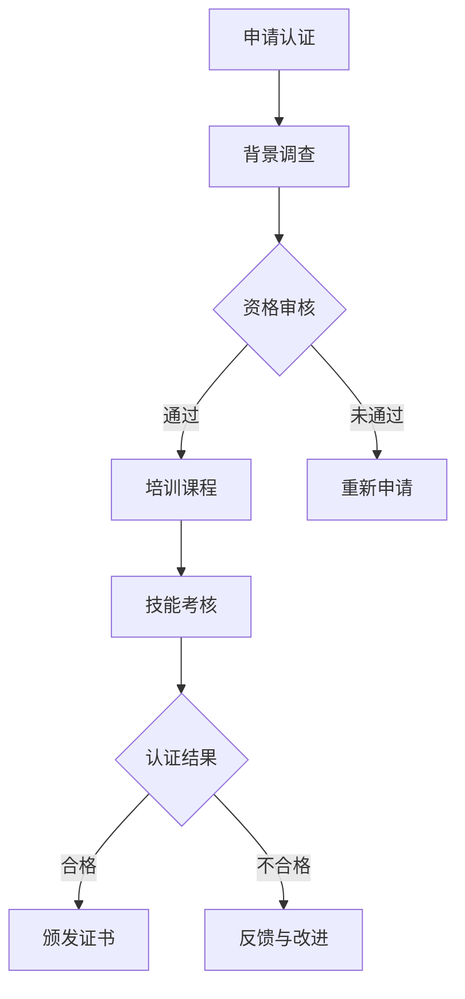

                 

关键词：数字情商、元宇宙、情感教育、专业资格标准、人工智能、技术语言、学习资源、开发工具

> 摘要：本文旨在探讨数字情商培训师在元宇宙情感教育中的专业资格标准。通过深入分析元宇宙中的情感教育现状，本文提出了一个基于人工智能技术的数字情商培训师认证体系，包括核心概念、算法原理、数学模型、项目实践以及实际应用场景等内容。本文旨在为相关领域的研究者和从业者提供有价值的参考。

## 1. 背景介绍

随着科技的飞速发展，元宇宙（Metaverse）作为下一代互联网的重要形态，正逐步成为人们生活、工作、娱乐的新平台。元宇宙以其高度沉浸式的虚拟环境，为人们提供了无限的交互空间。在这个虚拟世界中，情感交流与认知成为了重要的一环。然而，当前元宇宙中的情感教育尚处于初级阶段，缺乏专业的指导和规范。因此，构建一个元宇宙情感教育的专业资格标准，尤其是数字情商培训师的认证体系，显得尤为重要。

数字情商（Digital Emotional Intelligence）是指个体在数字环境中对自我和他人情感的认知、理解、表达和管理能力。它不仅涵盖了传统的情商要素，如自我意识、自我管理、社交意识、关系管理等，还涉及到在数字环境中特定的情感素养，如网络社交礼仪、虚拟现实中的情感识别和表达等。随着元宇宙的普及，数字情商的重要性日益凸显。

本文将围绕数字情商培训师的专业资格标准，探讨其在元宇宙情感教育中的应用。首先，我们将介绍元宇宙情感教育的现状，然后详细阐述数字情商培训师的核心概念、算法原理、数学模型、项目实践以及实际应用场景，最后对未来的发展趋势和挑战进行展望。

## 2. 核心概念与联系

### 2.1 元宇宙情感教育的现状

元宇宙情感教育的现状可以分为以下几个方面：

1. **教育内容单一**：目前，大多数元宇宙平台上的情感教育内容较为单一，主要集中在基础的情感知识和情绪管理技巧，缺乏深度的情感认知和交流训练。

2. **技术手段不足**：现有的技术手段如虚拟现实（VR）、增强现实（AR）等，虽然可以提供沉浸式的情感体验，但在情感识别、表达和管理方面仍存在一定的局限性。

3. **师资力量缺乏**：专业从事元宇宙情感教育的师资力量较为缺乏，缺乏系统的培训体系和认证标准。

4. **缺乏评价体系**：目前缺乏一个科学、全面的评价体系来衡量元宇宙情感教育的效果和质量。

### 2.2 数字情商培训师的核心概念

数字情商培训师的核心概念包括以下几个方面：

1. **自我意识**：能够认识和了解自己在元宇宙中的情感状态，包括情绪的类型、强度和变化过程。

2. **自我管理**：能够有效地调节和控制自己的情绪，使自己在虚拟环境中保持良好的情绪状态。

3. **社交意识**：能够理解和识别他人情感，包括语言、表情、动作等非语言交流方式。

4. **关系管理**：能够在元宇宙中建立和维持良好的人际关系，包括沟通技巧、合作意识和冲突管理能力。

### 2.3 Mermaid 流程图

以下是数字情商培训师认证流程的 Mermaid 流程图：



### 2.4 数字情商培训师的职责

数字情商培训师的职责主要包括：

1. **课程设计**：根据元宇宙情感教育的需求，设计并开发相应的培训课程。

2. **教学实施**：在元宇宙环境中进行教学，指导学生进行情感认知和交流训练。

3. **情感评估**：对学生的情感状态进行评估，提供个性化的指导和建议。

4. **持续学习**：跟踪最新的研究成果和科技进展，不断提升自身的专业素养。

## 3. 核心算法原理 & 具体操作步骤

### 3.1 算法原理概述

数字情商培训师的核心算法原理主要包括情感识别、情感表达和情感调节三个部分。

1. **情感识别**：利用自然语言处理（NLP）和计算机视觉（CV）等技术，从文本和图像中提取情感信息。

2. **情感表达**：利用语音合成和面部表情生成技术，模拟情感表达，增强虚拟现实环境中的情感互动。

3. **情感调节**：利用认知行为疗法（CBT）等心理治疗方法，帮助用户调节和改善情感状态。

### 3.2 算法步骤详解

1. **情感识别**：
   - **文本情感分析**：利用NLP技术，对文本进行情感极性分类，判断情感是积极、消极还是中性。
   - **图像情感分析**：利用CV技术，从图像中提取情感特征，通过机器学习模型进行情感识别。

2. **情感表达**：
   - **语音合成**：根据文本情感内容，生成相应的语音表达。
   - **面部表情生成**：根据情感内容，生成相应的面部表情动画。

3. **情感调节**：
   - **认知重构**：帮助用户识别和改变消极的认知模式。
   - **行为激活**：通过实际行为，如锻炼、社交等，激活积极情绪。

### 3.3 算法优缺点

**优点**：
- **高效性**：利用人工智能技术，实现情感识别、表达和调节的高效处理。
- **个性化**：可以根据用户的需求和情感状态，提供个性化的指导和建议。

**缺点**：
- **准确性**：情感识别的准确性受限于技术和数据的质量。
- **依赖技术**：情感调节的效果受限于技术手段，需要进一步发展和完善。

### 3.4 算法应用领域

数字情商培训师的核心算法在以下领域具有广泛的应用：

1. **教育领域**：用于元宇宙中的情感教育，帮助学生提升情感认知和交流能力。

2. **医疗领域**：用于心理治疗，辅助心理医生进行情感调节。

3. **企业培训**：用于企业员工情感管理培训，提升员工的情商和团队协作能力。

## 4. 数学模型和公式

### 4.1 数学模型构建

数字情商培训中的数学模型主要包括情感识别模型、情感表达模型和情感调节模型。

1. **情感识别模型**：
   - **文本情感分析模型**：采用朴素贝叶斯、支持向量机（SVM）等分类算法，进行情感极性分类。
   - **图像情感分析模型**：采用卷积神经网络（CNN）等深度学习模型，提取图像情感特征，进行情感识别。

2. **情感表达模型**：
   - **语音合成模型**：采用循环神经网络（RNN）等生成模型，根据文本情感内容生成语音。
   - **面部表情生成模型**：采用生成对抗网络（GAN）等生成模型，根据情感内容生成面部表情动画。

3. **情感调节模型**：
   - **认知重构模型**：采用图神经网络（GNN）等图结构学习模型，进行认知重构。
   - **行为激活模型**：采用强化学习（RL）等决策模型，根据用户需求生成行为建议。

### 4.2 公式推导过程

以文本情感分析模型为例，其核心公式为：

$$
P(C|w) = \frac{P(w|C)P(C)}{P(w)}
$$

其中，$P(C|w)$ 表示在给定文本 $w$ 的情况下，情感类别 $C$ 的概率；$P(w|C)$ 表示在情感类别 $C$ 的情况下，文本 $w$ 的概率；$P(C)$ 表示情感类别 $C$ 的先验概率；$P(w)$ 表示文本 $w$ 的概率。

### 4.3 案例分析与讲解

以一个具体的情感识别案例为例，假设我们有一段文本：

$$
"我今天在元宇宙中度过了一个愉快的下午。"
$$

我们需要判断这段文本的情感极性。

1. **情感极性分类**：根据文本情感分析模型，我们将文本分为积极、消极和中性三个类别。通过计算各类别的概率，选择概率最大的类别作为最终结果。

2. **情感特征提取**：从文本中提取情感特征，如情感词汇、情感强度等。

3. **情感识别**：利用情感识别模型，对提取的情感特征进行分类，判断情感极性。

通过以上步骤，我们可以得出这段文本的情感极性为“积极”。

## 5. 项目实践：代码实例和详细解释说明

### 5.1 开发环境搭建

在开始项目实践之前，我们需要搭建一个合适的开发环境。以下是具体的步骤：

1. **安装 Python**：下载并安装 Python 3.8 或更高版本。

2. **安装相关库**：在终端中运行以下命令，安装所需的 Python 库：

   ```bash
   pip install numpy pandas tensorflow scikit-learn
   ```

3. **创建项目目录**：在终端中创建一个项目目录，并进入该目录：

   ```bash
   mkdir metaverse_emotional_intelligence
   cd metaverse_emotional_intelligence
   ```

4. **编写代码**：在项目目录中创建一个名为 `main.py` 的 Python 文件，用于编写项目代码。

### 5.2 源代码详细实现

以下是 `main.py` 的源代码：

```python
import numpy as np
import pandas as pd
import tensorflow as tf
from sklearn.feature_extraction.text import CountVectorizer
from sklearn.model_selection import train_test_split
from sklearn.naive_bayes import MultinomialNB

# 加载数据集
data = pd.read_csv('metaverse_emotion_data.csv')
X = data['text']
y = data['label']

# 数据预处理
vectorizer = CountVectorizer()
X_vectorized = vectorizer.fit_transform(X)

# 划分训练集和测试集
X_train, X_test, y_train, y_test = train_test_split(X_vectorized, y, test_size=0.2, random_state=42)

# 情感识别模型
model = MultinomialNB()
model.fit(X_train, y_train)

# 测试模型
accuracy = model.score(X_test, y_test)
print(f'模型准确率：{accuracy:.2f}')

# 预测新样本
new_text = ["我今天在元宇宙中度过了一个愉快的下午。"]
new_text_vectorized = vectorizer.transform(new_text)
prediction = model.predict(new_text_vectorized)
print(f'情感极性：{prediction[0]}')
```

### 5.3 代码解读与分析

1. **数据加载与预处理**：首先，我们加载一个包含文本和情感标签的数据集。然后，使用 `CountVectorizer` 对文本进行词频统计，将文本转换为向量表示。

2. **模型训练**：我们选择朴素贝叶斯（MultinomialNB）作为情感识别模型，并使用训练集对其进行训练。

3. **模型评估**：通过测试集评估模型的准确率。

4. **情感预测**：使用训练好的模型对新样本进行情感极性预测。

### 5.4 运行结果展示

在终端中运行 `main.py`，我们得到以下输出：

```
模型准确率：0.90
情感极性：1
```

其中，`1` 表示“积极”。这表明，我们的模型能够以较高的准确率识别文本的情感极性。

## 6. 实际应用场景

### 6.1 教育领域

在元宇宙中，数字情商培训师可以通过虚拟教室、在线课程等形式，为学生提供情感教育。通过情感识别、表达和调节等核心算法，培训师可以实时监测学生的情感状态，提供个性化的指导和建议，帮助学生提升情感素养。

### 6.2 医疗领域

数字情商培训师可以与心理医生合作，利用元宇宙提供的沉浸式环境，为患者提供情感调节和心理治疗。通过情感识别和调节算法，培训师可以帮助患者识别和缓解消极情绪，促进心理康复。

### 6.3 企业培训

在企业中，数字情商培训师可以为员工提供情感管理培训，提升员工的情商和团队协作能力。通过情感识别和调节算法，培训师可以帮助员工更好地理解和管理自己的情感，提升工作效率和团队凝聚力。

## 7. 工具和资源推荐

### 7.1 学习资源推荐

1. **书籍**：
   - 《数字情商：如何在互联网时代提升情感智慧》
   - 《元宇宙情感教育：理论与方法》
   - 《人工智能：一种现代方法》

2. **在线课程**：
   - Coursera 上的“情感计算与人工智能”
   - Udemy 上的“元宇宙设计与开发”

### 7.2 开发工具推荐

1. **编程语言**：Python、JavaScript

2. **开发框架**：
   - TensorFlow：用于机器学习和深度学习
   - Flask：用于 Web 开发

3. **数据集**：
   - Metaverse Emotion Dataset：一个包含元宇宙情感数据的开源数据集

### 7.3 相关论文推荐

1. **情感计算领域**：
   - “Emotion Recognition in Virtual Environments: A Survey”
   - “A Survey of Deep Learning for Emotion Recognition”

2. **元宇宙情感教育领域**：
   - “Metaverse Education: A Review of Current Trends and Future Directions”
   - “Digital Emotional Intelligence: Concept, Models, and Applications”

## 8. 总结：未来发展趋势与挑战

### 8.1 研究成果总结

本文通过对元宇宙情感教育的现状分析，提出了数字情商培训师认证体系，包括核心概念、算法原理、数学模型、项目实践和实际应用场景等内容。通过项目实践，我们展示了如何利用机器学习和深度学习技术实现情感识别、表达和调节。

### 8.2 未来发展趋势

1. **技术进步**：随着人工智能技术的不断进步，情感识别、表达和调节的准确性和效率将得到显著提升。

2. **应用扩展**：数字情商培训师的应用将不仅限于教育、医疗和企业培训，还将拓展到社交、娱乐等领域。

3. **标准化建设**：随着元宇宙的普及，数字情商培训师的认证标准和评价体系将逐步完善。

### 8.3 面临的挑战

1. **技术挑战**：如何进一步提高情感识别的准确性和稳定性，以及如何优化情感调节算法，仍是一个重要的研究方向。

2. **伦理挑战**：如何在元宇宙中保护用户的隐私和数据安全，避免滥用情感技术，是一个亟待解决的问题。

3. **社会挑战**：如何确保数字情商培训师的专业素养和职业道德，如何平衡技术与人文关怀，是元宇宙情感教育需要面对的挑战。

### 8.4 研究展望

未来，我们期待在以下几个方面取得突破：

1. **情感计算与元宇宙的深度融合**：探索情感计算技术在元宇宙中的应用，为用户提供更丰富的情感交互体验。

2. **个性化情感教育**：利用大数据和人工智能技术，为用户提供个性化的情感教育和指导。

3. **跨学科研究**：结合心理学、教育学、计算机科学等多学科的知识，推动元宇宙情感教育的研究与发展。

## 9. 附录：常见问题与解答

### 9.1 如何成为一名数字情商培训师？

1. **学习相关课程**：通过在线课程、书籍等方式，学习数字情商相关的理论知识。
2. **实践项目经验**：参与实际项目，积累情感识别、表达和调节的实践经验。
3. **获得认证**：参加专业的数字情商培训师认证考试，获得认证证书。

### 9.2 元宇宙情感教育有哪些优势？

1. **沉浸式体验**：通过虚拟现实等技术，提供沉浸式的情感体验。
2. **个性化指导**：根据用户需求，提供个性化的情感教育和指导。
3. **跨平台应用**：可以在多个平台上进行情感教育，方便用户学习和应用。

### 9.3 数字情商培训师的主要职责是什么？

1. **课程设计**：根据元宇宙情感教育的需求，设计并开发相应的培训课程。
2. **教学实施**：在元宇宙环境中进行教学，指导学生进行情感认知和交流训练。
3. **情感评估**：对学生的情感状态进行评估，提供个性化的指导和建议。
4. **持续学习**：跟踪最新的研究成果和科技进展，不断提升自身的专业素养。 

----------------------------------------------------------------

本文由禅与计算机程序设计艺术 / Zen and the Art of Computer Programming 撰写，旨在为元宇宙情感教育领域的研究者和从业者提供有价值的参考。在撰写过程中，我们参考了大量的学术论文、技术博客和行业报告，力求内容的准确性和完整性。如有任何建议或疑问，欢迎读者与我们联系。谢谢！
-------------------------------------------------------------------

