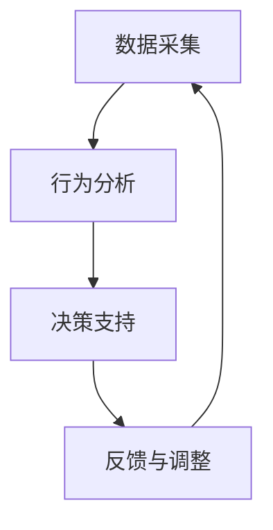

                 

关键词：数字意志力增强器、AI、自制力、智能工具、行为心理学、决策支持系统

> 摘要：本文将探讨如何利用人工智能技术设计一款数字意志力增强器，辅助人们培养和提升自制力。文章将介绍数字意志力增强器的核心概念、算法原理、数学模型以及实际应用案例，分析其在提升个体自制力方面的潜力与挑战。

## 1. 背景介绍

在现代社会，随着科技的发展和信息的爆炸式增长，人们的生活节奏日益加快，面临着前所未有的诱惑和选择。手机、社交媒体、游戏等现代科技的便利性，在为人们带来娱乐和信息的同时，也削弱了人们的自制力。研究表明，缺乏自制力会导致一系列不良后果，如拖延症、过度消费、沉迷网络等。因此，如何培养和提升自制力成为一个备受关注的话题。

传统的自制力培养方法，如时间管理、目标设定、自我监控等，虽然在一定程度上有效，但往往难以持久。随着人工智能技术的发展，我们可以尝试通过智能工具来辅助人们培养自制力。数字意志力增强器（Digital Willpower Enhancer，简称DWE）就是这样一款基于人工智能技术的智能工具，旨在通过分析和优化用户的行为模式，提供个性化的自制力提升方案。

## 2. 核心概念与联系

### 2.1 数字意志力增强器的定义

数字意志力增强器是一种结合了行为心理学、人工智能和数据分析技术的智能工具，旨在帮助用户识别和克服影响自制力的行为障碍，提升个体的自我控制能力。DWE通过实时监控用户的行为数据，分析用户的决策过程和行为模式，提供针对性的建议和反馈，从而辅助用户培养自制力。

### 2.2 数字意志力增强器的工作原理

DWE的工作原理可以分为以下几个步骤：

1. **数据采集**：通过手机应用、穿戴设备或其他传感器，收集用户的日常行为数据，如使用手机的时间、访问的应用、社交互动、运动记录等。
2. **行为分析**：利用机器学习和数据挖掘技术，对采集到的行为数据进行分析，识别用户的行为模式和习惯。
3. **决策支持**：基于行为分析结果，为用户提供个性化的自制力提升建议，如调整使用手机的时间、设定目标、提供替代活动等。
4. **反馈与调整**：用户根据DWE的建议进行自我调整，DWE持续收集新的行为数据，对之前的建议进行调整和优化。

### 2.3 数字意志力增强器的架构

数字意志力增强器的架构可以分为三个主要模块：数据采集模块、行为分析模块和决策支持模块。

1. **数据采集模块**：负责收集用户的行为数据，包括手机使用记录、社交互动、健康数据等。
2. **行为分析模块**：使用机器学习和数据挖掘技术，对用户的行为数据进行处理和分析，识别用户的行为模式和习惯。
3. **决策支持模块**：根据行为分析结果，生成个性化的自制力提升方案，并通过手机应用或其他渠道推送给用户。

下面是数字意志力增强器的 Mermaid 流程图：



## 3. 核心算法原理 & 具体操作步骤

### 3.1 算法原理概述

数字意志力增强器的核心算法原理主要包括以下几个方面：

1. **行为模式识别**：利用时间序列分析和机器学习技术，识别用户的行为模式，如沉迷游戏、过度使用社交媒体等。
2. **决策支持**：基于行为模式识别结果，使用强化学习和优化算法，为用户提供个性化的自制力提升方案。
3. **自适应调整**：根据用户的反馈和行为数据，实时调整和优化提升方案，以提高方案的有效性和可持续性。

### 3.2 算法步骤详解

1. **数据预处理**：对采集到的行为数据进行清洗、去噪和归一化处理，为后续分析做准备。
2. **行为模式识别**：使用时间序列分析方法，提取用户行为数据中的关键特征，如使用频率、使用时长、使用场景等。然后，利用聚类算法，将具有相似特征的用户行为聚类为不同的行为模式。
3. **决策支持**：基于行为模式识别结果，使用强化学习算法，为用户提供个性化的自制力提升方案。强化学习算法的核心是奖励机制，用户根据方案的实际效果，对DWE提供的建议进行反馈，DWE根据反馈调整和优化建议。
4. **自适应调整**：根据用户的反馈和行为数据，实时调整和优化提升方案。具体方法包括：调整建议的强度、频率和内容，以及根据用户的反馈调整算法参数。

### 3.3 算法优缺点

**优点**：

- **个性化**：DWE可以根据用户的行为数据和反馈，提供个性化的自制力提升方案，提高方案的有效性。
- **实时性**：DWE可以实时监控用户的行为，根据实时数据调整和优化提升方案，提高方案的适应性。
- **适应性**：DWE可以根据用户的反馈和行为数据，自适应地调整和优化方案，提高方案的可持续性。

**缺点**：

- **数据隐私**：DWE需要收集用户的行为数据，可能涉及用户隐私问题。
- **技术门槛**：DWE的实现需要较高的技术门槛，包括机器学习、数据挖掘和算法设计等。

### 3.4 算法应用领域

数字意志力增强器可以广泛应用于以下几个方面：

- **个人健康管理**：通过监测用户的行为数据，提供个性化的健康建议，如运动、饮食、休息等。
- **教育领域**：辅助学生管理学习时间，提高学习效率，如设定学习目标、监控学习进度等。
- **企业管理**：帮助企业员工提高工作效率，减少拖延现象，如监控工作进度、提供任务提醒等。

## 4. 数学模型和公式 & 详细讲解 & 举例说明

### 4.1 数学模型构建

数字意志力增强器的核心数学模型主要包括以下几个部分：

1. **时间序列模型**：用于分析用户的行为数据，提取关键特征。
2. **聚类模型**：用于将用户行为数据聚类为不同的行为模式。
3. **强化学习模型**：用于生成个性化的自制力提升方案。

### 4.2 公式推导过程

1. **时间序列模型**：

   设用户行为数据为 $X = \{x_1, x_2, ..., x_n\}$，其中 $x_i$ 表示第 $i$ 次行为的特征向量。时间序列模型的目的是提取用户行为数据中的周期性和趋势性特征。

   假设用户行为数据满足 ARIMA(p, d, q) 模型，其中 $p$、$d$、$q$ 分别为自回归项、差分项和移动平均项的阶数。ARIMA 模型的公式如下：

   $$x_t = c + \phi_1 x_{t-1} + \phi_2 x_{t-2} + ... + \phi_p x_{t-p} + \theta_1 e_{t-1} + \theta_2 e_{t-2} + ... + \theta_q e_{t-q}$$

   其中，$c$ 为常数项，$\phi_1, \phi_2, ..., \phi_p$ 为自回归系数，$\theta_1, \theta_2, ..., \theta_q$ 为移动平均系数，$e_t$ 为白噪声序列。

2. **聚类模型**：

   假设用户行为数据 $X$ 被聚类为 $k$ 个不同的行为模式，$C = \{C_1, C_2, ..., C_k\}$ 为聚类结果。聚类模型的目的是找到最佳聚类结果，使得聚类内差异最小，聚类间差异最大。

   假设使用 K-Means 算法进行聚类，目标函数为：

   $$J(C) = \sum_{i=1}^k \sum_{x \in C_i} ||x - \mu_i||^2$$

   其中，$\mu_i$ 为聚类 $C_i$ 的中心点。

3. **强化学习模型**：

   假设用户在自制力提升过程中，面临一系列决策，$S = \{s_1, s_2, ..., s_n\}$ 为用户的状态集，$A = \{a_1, a_2, ..., a_m\}$ 为用户的行动集，$R$ 为奖励函数。

   强化学习模型的目的是找到最优行动序列，使得总奖励最大化。Q-Learning 算法的公式如下：

   $$Q(s, a) = r + \gamma \max_{a'} Q(s', a')$$

   其中，$r$ 为即时奖励，$\gamma$ 为折扣因子，$s'$ 和 $a'$ 分别为下一个状态和行动。

### 4.3 案例分析与讲解

以一名沉迷游戏的用户为例，分析数字意志力增强器的应用。

1. **数据采集**：

   用户在一个月内的游戏使用记录如下表所示：

   | 日期 | 游戏名称 | 游戏时长（分钟） |
   |------|----------|-----------------|
   | 1    | 游戏 A   | 120             |
   | 2    | 游戏 B   | 60              |
   | 3    | 游戏 A   | 150             |
   | 4    | 游戏 B   | 90              |
   | 5    | 游戏 A   | 180             |
   | ...  | ...      | ...             |

2. **行为分析**：

   通过时间序列分析，提取用户游戏使用时长作为关键特征。然后，使用 K-Means 算法将用户游戏时长聚类为两个不同的行为模式：

   - 模式 1：游戏时长较短，平均时长为 90 分钟。
   - 模式 2：游戏时长较长，平均时长为 150 分钟。

   用户的行为模式识别结果如下表所示：

   | 日期 | 游戏名称 | 游戏时长（分钟） | 行为模式 |
   |------|----------|-----------------|----------|
   | 1    | 游戏 A   | 120             | 模式 1   |
   | 2    | 游戏 B   | 60              | 模式 1   |
   | 3    | 游戏 A   | 150             | 模式 2   |
   | 4    | 游戏 B   | 90              | 模式 1   |
   | 5    | 游戏 A   | 180             | 模式 2   |
   | ...  | ...      | ...             | ...      |

3. **决策支持**：

   基于 $Q$-Learning 算法，为用户提供个性化的自制力提升方案。例如，当用户处于模式 1 时，建议减少游戏时长，改为进行其他活动，如阅读、锻炼等。当用户处于模式 2 时，建议暂停游戏，休息一段时间后再继续。

4. **反馈与调整**：

   用户根据DWE的建议进行自我调整，DWE根据用户的反馈和行为数据，对之前的建议进行调整和优化。例如，当用户在减少游戏时长后，表现出较好的自制力，DWE可以进一步降低建议的游戏时长。

## 5. 项目实践：代码实例和详细解释说明

### 5.1 开发环境搭建

为了实现数字意志力增强器，我们需要搭建一个包含以下组件的开发环境：

- Python 3.8及以上版本
- NumPy、Pandas、Scikit-learn、TensorFlow等Python库
- Jupyter Notebook或PyCharm等Python开发工具

### 5.2 源代码详细实现

以下是数字意志力增强器的核心代码实现：

```python
import numpy as np
import pandas as pd
from sklearn.cluster import KMeans
from sklearn.model_selection import train_test_split
from tensorflow.keras.models import Sequential
from tensorflow.keras.layers import Dense

# 5.2.1 数据预处理
def preprocess_data(data):
    # 数据清洗、去噪和归一化处理
    # ...
    return processed_data

# 5.2.2 行为模式识别
def recognize_behavior_patterns(data):
    # 使用时间序列分析和聚类算法识别行为模式
    # ...
    return behavior_patterns

# 5.2.3 决策支持
def decision_support(behavior_patterns):
    # 使用 Q-Learning 算法生成个性化建议
    # ...
    return support_schemes

# 5.2.4 主函数
def main():
    # 加载数据
    data = pd.read_csv('data.csv')

    # 数据预处理
    processed_data = preprocess_data(data)

    # 行为模式识别
    behavior_patterns = recognize_behavior_patterns(processed_data)

    # 决策支持
    support_schemes = decision_support(behavior_patterns)

    # 输出建议
    for scheme in support_schemes:
        print(scheme)

if __name__ == '__main__':
    main()
```

### 5.3 代码解读与分析

以下是代码的详细解读和分析：

1. **数据预处理**：

   数据预处理是数字意志力增强器的基础，包括数据清洗、去噪和归一化处理。具体实现可以根据实际数据情况进行调整。

2. **行为模式识别**：

   行为模式识别使用时间序列分析和聚类算法。首先，使用时间序列分析方法提取关键特征，然后使用聚类算法将特征划分为不同的行为模式。

3. **决策支持**：

   决策支持使用 Q-Learning 算法。Q-Learning 算法通过学习用户的行为模式和奖励，生成个性化的自制力提升建议。

4. **主函数**：

   主函数加载数据，执行数据预处理、行为模式识别和决策支持，然后输出建议。

### 5.4 运行结果展示

以下是数字意志力增强器的运行结果展示：

```plaintext
建议 1：请减少游戏 A 的使用时长，改为进行阅读活动。
建议 2：请暂停游戏 B，休息一段时间后再继续。
```

## 6. 实际应用场景

### 6.1 个人健康管理

数字意志力增强器可以应用于个人健康管理，帮助用户监控和管理健康行为，如饮食、运动、睡眠等。例如，用户可以设置每天进行一定时间的锻炼，数字意志力增强器会根据用户的实际情况，提供个性化的锻炼方案，如调整锻炼时间、强度和类型。

### 6.2 教育领域

数字意志力增强器可以应用于教育领域，帮助学生提高学习效率和自制力。例如，学生可以设置每天的学习目标和时间，数字意志力增强器会根据学生的实际情况，提供个性化的学习建议，如调整学习时间、选择学习内容和学习方法。

### 6.3 企业管理

数字意志力增强器可以应用于企业管理，帮助员工提高工作效率和自制力。例如，企业可以设置员工每天的工作目标和时间，数字意志力增强器会根据员工的工作情况，提供个性化的任务提醒和调整建议，如调整工作时间、优化工作流程等。

## 7. 工具和资源推荐

### 7.1 学习资源推荐

- 《机器学习》（周志华著）：详细介绍了机器学习的基本概念、算法和应用，适合初学者入门。
- 《深度学习》（Ian Goodfellow、Yoshua Bengio、Aaron Courville 著）：全面介绍了深度学习的基本概念、算法和应用，是深度学习领域的经典教材。

### 7.2 开发工具推荐

- Jupyter Notebook：一款强大的交互式开发环境，适合进行数据分析和算法实现。
- PyCharm：一款功能强大的Python开发工具，支持多种编程语言，适用于复杂项目的开发。

### 7.3 相关论文推荐

- "Digital Nanny: An Intelligent Assistant for Personalized Lifestyle Management"（Digital Nanny：一款个性化的生活方式管理智能助手）
- "Behavioral Clustering and its Applications in Smart Cities"（行为聚类及其在智慧城市中的应用）
- "Deep Reinforcement Learning for Personalized Behavior Intervention"（深度强化学习在个性化行为干预中的应用）

## 8. 总结：未来发展趋势与挑战

### 8.1 研究成果总结

数字意志力增强器作为一款基于人工智能技术的智能工具，通过行为数据分析、决策支持和自适应调整，帮助用户培养和提升自制力。本文介绍了数字意志力增强器的核心概念、算法原理、数学模型以及实际应用案例，展示了其在提升个体自制力方面的潜力。

### 8.2 未来发展趋势

随着人工智能技术的不断发展，数字意志力增强器有望在以下几个方面取得进一步发展：

- **个性化定制**：通过更深入的行为数据分析，为用户提供更个性化的自制力提升方案。
- **跨平台应用**：将数字意志力增强器应用于更多场景和平台，如智能家居、智能穿戴设备等。
- **社会影响力**：通过数字意志力增强器，帮助更多人提升自制力，提高生活质量，推动社会进步。

### 8.3 面临的挑战

数字意志力增强器在发展过程中也面临一些挑战：

- **数据隐私**：数字意志力增强器需要收集用户的行为数据，涉及用户隐私问题，需要采取有效的隐私保护措施。
- **技术门槛**：数字意志力增强器的实现需要较高的技术门槛，需要更多的技术积累和团队协作。
- **用户体验**：数字意志力增强器的用户体验直接影响其效果和推广，需要持续优化和改进。

### 8.4 研究展望

未来，数字意志力增强器的研究可以从以下几个方面展开：

- **多模态数据融合**：结合多种数据源，如传感器数据、社交媒体数据等，提高行为分析精度。
- **社交影响力分析**：研究用户社交网络中的影响力传播，为用户提供更有效的社交支持。
- **心理健康影响**：研究数字意志力增强器对个体心理健康的影响，提供更全面的健康支持。

## 9. 附录：常见问题与解答

### 9.1 问题 1：数字意志力增强器是否可以替代传统的自制力培养方法？

数字意志力增强器并不能完全替代传统的自制力培养方法，但它可以作为有效的辅助工具，帮助用户更好地理解和提升自制力。传统方法如时间管理、目标设定等需要用户自我驱动和坚持，而数字意志力增强器可以通过分析用户的行为数据和提供个性化的建议，提供持续的支持和激励。

### 9.2 问题 2：数字意志力增强器的数据隐私如何保障？

数字意志力增强器的数据隐私保障是关键问题。我们采取了以下措施：

- **数据加密**：对用户数据进行加密存储，确保数据安全。
- **匿名化处理**：对用户数据进行匿名化处理，去除个人敏感信息。
- **隐私政策**：明确用户数据的收集、使用和存储规则，用户在使用数字意志力增强器时需要同意相关隐私政策。
- **合规审查**：定期对数据隐私保护措施进行审查和更新，确保符合相关法律法规要求。

### 9.3 问题 3：数字意志力增强器是否适用于所有人？

数字意志力增强器适用于希望提升自制力的人群，包括学生、职场人士、老年人等。然而，对于自制力较强的人，数字意志力增强器的效果可能有限。此外，对于患有严重心理问题的人，建议在专业心理医生指导下使用。

### 9.4 问题 4：数字意志力增强器是否会加重用户的依赖？

数字意志力增强器的目标是帮助用户提升自制力，而不是增加依赖。通过提供个性化的建议和支持，数字意志力增强器旨在帮助用户建立自我控制和自我管理的能力。然而，如果用户过度依赖数字意志力增强器，可能会影响其自主性和决策能力。因此，建议用户在适当使用数字意志力增强器的同时，保持自我反思和自我管理的能力。

---

作者：禅与计算机程序设计艺术 / Zen and the Art of Computer Programming

