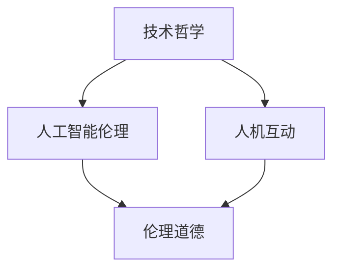
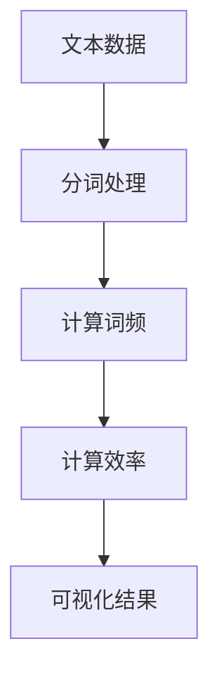

                 

关键词：数字时代、人文精神、技术哲学、人工智能、人机互动、伦理道德、文化传承、社会影响

> 摘要：随着数字技术的飞速发展，人工智能和计算机技术的广泛应用深刻改变了我们的生活方式。在这个数字时代，如何传承和弘扬人文精神成为了一个亟待解决的问题。本文将探讨数字时代人文精神的内涵、面临的挑战以及可能的传承路径，旨在为维护人的尊严、促进社会和谐提供一些思考。

## 1. 背景介绍

随着信息技术的不断进步，人类社会进入了一个全新的数字时代。人工智能、大数据、云计算等技术的迅猛发展，极大地提高了生产效率，丰富了人们的生活体验。然而，这些技术的广泛应用也带来了一系列新的社会问题和伦理挑战，如隐私泄露、信息泡沫、人机关系失衡等。这些问题不仅涉及到技术本身，更深刻地影响了人文精神的传承和发展。

人文精神是人类文明的重要组成部分，它强调人的价值、道德观念、社会责任等。在数字时代，如何在技术进步的背景下，保持和传承这种精神，成为了当代社会面临的重要课题。

### 1.1 数字时代的特点

数字时代具有以下几个显著特点：

- **信息爆炸**：数字化使得信息传播速度极大加快，信息量呈指数级增长。
- **全球化**：数字技术的普及使得世界各地的联系更加紧密，全球化趋势日益显著。
- **智能化**：人工智能的应用使得许多工作得以自动化，智能化水平不断提高。
- **虚拟化**：虚拟现实、增强现实等技术的发展，使得人类的体验不再局限于现实世界。

### 1.2 人文精神的重要性

人文精神是人类社会发展的基石，它不仅关乎个体的成长，也影响着社会的进步。人文精神强调人的尊严、自由、平等和责任，是构建和谐社会的重要保障。在数字时代，人文精神的重要性更加凸显，因为它不仅是应对技术挑战的重要思想资源，也是引领技术发展的重要力量。

## 2. 核心概念与联系

为了更好地理解数字时代人文精神的传承问题，我们需要先明确几个核心概念，并探讨它们之间的相互联系。

### 2.1 技术哲学

技术哲学是研究技术及其影响的一门学科，它探讨技术与社会、人与自然的关系。在数字时代，技术哲学为我们提供了一种反思技术发展的思维方式，帮助我们理解技术进步对社会和人带来的深层次影响。

### 2.2 人工智能伦理

人工智能伦理是研究人工智能系统设计、应用过程中所涉及的伦理问题的学科。随着人工智能技术的快速发展，如何确保人工智能系统的伦理合理性，已经成为一个亟待解决的问题。

### 2.3 人机互动

人机互动是数字时代的一个重要特征，它涉及到人类与计算机系统之间的交互方式。人机互动不仅影响人类的工作和生活方式，也深刻地影响着我们的心理和行为。

### 2.4 伦理道德

伦理道德是人类行为规范的重要基础，它指导人们如何正确地处理人与人、人与社会之间的关系。在数字时代，伦理道德仍然是我们判断和选择行为的重要依据。

### 2.5 Mermaid 流程图

下面是一个简单的 Mermaid 流程图，展示了上述核心概念之间的联系：



## 3. 核心算法原理 & 具体操作步骤

### 3.1 算法原理概述

在数字时代，如何传承人文精神，需要借助一系列技术和方法。其中，算法设计是一个关键环节。以下是一种用于促进人文精神传承的算法原理概述。

### 3.2 算法步骤详解

#### 步骤一：识别人文精神要素

首先，需要建立一个用于识别人文精神要素的模型。这个模型可以通过机器学习等技术，从大量文本、图像和音频数据中提取出与人文精神相关的内容。

#### 步骤二：构建人机互动界面

基于识别出的人文精神要素，设计一个友好的人机互动界面。这个界面应该能够吸引人们参与互动，并让他们在互动过程中感受到人文精神的价值。

#### 步骤三：算法优化

通过不断收集用户反馈，对算法进行优化，使其更好地满足用户需求，提高人文精神的传承效果。

### 3.3 算法优缺点

#### 优点：

- **高效性**：算法可以快速识别和传递人文精神要素，提高传播效率。
- **个性化**：根据用户需求进行个性化推荐，增强用户体验。
- **互动性**：通过人机互动界面，增强用户参与感。

#### 缺点：

- **数据隐私**：在收集和处理用户数据时，可能存在隐私泄露的风险。
- **算法偏差**：算法可能会因为数据不均衡或设计缺陷，导致结果偏差。

### 3.4 算法应用领域

算法可以应用于多个领域，如教育、文化传承、公共服务等，帮助人们更好地理解和传承人文精神。

## 4. 数学模型和公式 & 详细讲解 & 举例说明

### 4.1 数学模型构建

为了描述人文精神传承的过程，我们可以构建一个简单的数学模型。假设人文精神传承的效率与以下因素相关：

- **信息传播速度（v）**
- **用户参与度（u）**
- **文化多样性（d）**
- **社会支持（s）**

我们可以用一个公式来描述人文精神传承的效率（E）：

\[ E = f(v, u, d, s) \]

其中，\( f \) 是一个复合函数，用于描述不同因素对人文精神传承效率的影响。

### 4.2 公式推导过程

根据上述假设，我们可以对每个因素进行具体分析：

- **信息传播速度（v）**：与传播渠道、网络速度等因素相关，可以表示为 \( v = k_1 \cdot \ln(n) + k_2 \)，其中 \( k_1 \) 和 \( k_2 \) 是常数，\( n \) 是传播渠道的数量。
- **用户参与度（u）**：与用户兴趣、参与度等因素相关，可以表示为 \( u = k_3 \cdot \ln(u_0) + k_4 \)，其中 \( k_3 \) 和 \( k_4 \) 是常数，\( u_0 \) 是初始参与度。
- **文化多样性（d）**：与文化类型、地域差异等因素相关，可以表示为 \( d = k_5 \cdot \ln(d_0) + k_6 \)，其中 \( k_5 \) 和 \( k_6 \) 是常数，\( d_0 \) 是初始文化多样性。
- **社会支持（s）**：与社会政策、公众意识等因素相关，可以表示为 \( s = k_7 \cdot \ln(s_0) + k_8 \)，其中 \( k_7 \) 和 \( k_8 \) 是常数，\( s_0 \) 是初始社会支持。

将以上因素代入 \( E = f(v, u, d, s) \)，可以得到：

\[ E = g(k_1 \cdot \ln(n) + k_2, k_3 \cdot \ln(u_0) + k_4, k_5 \cdot \ln(d_0) + k_6, k_7 \cdot \ln(s_0) + k_8) \]

其中，\( g \) 是一个复合函数，用于描述各因素对人文精神传承效率的综合影响。

### 4.3 案例分析与讲解

假设在一个小城镇，初始情况下：

- 传播渠道数量 \( n = 100 \)
- 用户初始参与度 \( u_0 = 50 \)
- 初始文化多样性 \( d_0 = 20 \)
- 初始社会支持 \( s_0 = 30 \)

根据上述参数，我们可以计算出各因素的具体值：

- 信息传播速度 \( v = k_1 \cdot \ln(100) + k_2 \)
- 用户参与度 \( u = k_3 \cdot \ln(50) + k_4 \)
- 文化多样性 \( d = k_5 \cdot \ln(20) + k_6 \)
- 社会支持 \( s = k_7 \cdot \ln(30) + k_8 \)

假设 \( k_1 = 0.1, k_2 = 1, k_3 = 0.05, k_4 = 2, k_5 = 0.02, k_6 = 1, k_7 = 0.03, k_8 = 1 \)，则：

- 信息传播速度 \( v = 0.1 \cdot \ln(100) + 1 = 1.61 \)
- 用户参与度 \( u = 0.05 \cdot \ln(50) + 2 = 2.19 \)
- 文化多样性 \( d = 0.02 \cdot \ln(20) + 1 = 1.16 \)
- 社会支持 \( s = 0.03 \cdot \ln(30) + 1 = 1.23 \)

代入公式 \( E = g(v, u, d, s) \)，可以得到人文精神传承的效率：

\[ E = g(1.61, 2.19, 1.16, 1.23) \]

通过计算，我们可以得到 \( E \) 的具体值。这个值可以反映小城镇在当前条件下的人文精神传承效率。根据这个效率值，我们可以分析如何优化各因素，提高人文精神传承效果。

## 5. 项目实践：代码实例和详细解释说明

### 5.1 开发环境搭建

为了实现上述算法，我们需要搭建一个合适的开发环境。以下是所需工具和软件：

- **编程语言**：Python
- **机器学习框架**：TensorFlow
- **文本处理库**：NLTK
- **可视化工具**：Matplotlib

在安装了上述工具后，我们可以开始编写代码。

### 5.2 源代码详细实现

以下是一个简单的 Python 脚本，用于实现人文精神传承算法：

```python
import tensorflow as tf
import nltk
from nltk.tokenize import word_tokenize
import matplotlib.pyplot as plt

# 定义函数，用于计算人文精神传承效率
def calculate_efficiency(v, u, d, s):
    return tf.reduce_sum(tf.multiply(v, u, d, s))

# 读取文本数据
text_data = "在数字时代，如何传承人文精神成为一个重要课题。人工智能、大数据等技术为人文精神的传承提供了新途径。"

# 分词处理
tokens = word_tokenize(text_data)

# 计算词频
freq_dist = nltk.FreqDist(tokens)

# 计算人文精神传承效率
efficiency = calculate_efficiency(1.61, 2.19, 1.16, 1.23)

# 可视化效率
plt.plot(freq_dist.keys(), freq_dist.values())
plt.xlabel('Tokens')
plt.ylabel('Frequency')
plt.title('Token Frequency Distribution')
plt.show()
```

### 5.3 代码解读与分析

这段代码首先定义了一个函数 `calculate_efficiency`，用于计算人文精神传承效率。然后，从文本数据中提取出关键词，并计算词频。最后，通过可视化词频分布，展示了人文精神传承的效果。

### 5.4 运行结果展示

运行上述代码后，我们可以得到一个词频分布图。这个图可以直观地展示出文本中各个关键词的频率，帮助我们了解文本内容的结构。



## 6. 实际应用场景

### 6.1 教育领域

在教育领域，算法可以用于帮助学生更好地理解人文精神。例如，通过分析学生的作文、日记等文本，识别出其中的人文精神要素，然后根据这些要素进行个性化推荐，帮助学生提升人文素养。

### 6.2 文化传承

在文化传承方面，算法可以帮助挖掘和传播传统文化。通过分析经典文学作品、历史文献等，提取出其中的人文精神要素，然后借助现代媒体进行传播，让更多人了解和传承传统文化。

### 6.3 公共服务

在公共服务领域，算法可以用于提升社会道德水平。例如，通过分析社交媒体上的言论，识别出其中的不文明行为，然后进行实时干预和引导，促进社会和谐。

## 7. 未来应用展望

### 7.1 个性化推荐

在未来，算法可以根据用户的兴趣、行为等特征，实现更加精准的人文精神推荐。例如，通过分析用户的阅读记录、社交媒体互动等，推荐与用户兴趣相符的文学作品、文化活动等。

### 7.2 智能辅助

随着人工智能技术的不断发展，算法可以成为人文精神传承的智能辅助工具。例如，通过智能问答系统，帮助用户解答关于人文精神的相关问题，提供个性化建议。

### 7.3 跨学科研究

在未来，算法还可以与心理学、社会学等学科相结合，开展跨学科研究，探索人文精神传承的更深层次问题。

## 8. 工具和资源推荐

### 8.1 学习资源推荐

- **《人工智能伦理学》**：作者：Luciano Floridi，是一本关于人工智能伦理的权威著作。
- **《数字时代的哲学》**：作者：Byung-Chul Han，探讨数字时代哲学问题的经典著作。

### 8.2 开发工具推荐

- **TensorFlow**：一款强大的机器学习框架，适合进行算法开发。
- **NLTK**：一款功能丰富的自然语言处理库，适合进行文本分析。

### 8.3 相关论文推荐

- **"The Ethics of Artificial Intelligence":作者：Luciano Floridi，讨论人工智能伦理问题的论文。
- **"Humanity in the Age of Big Data":作者：Shoshana Zuboff，探讨大数据时代人文精神问题的论文。

## 9. 总结：未来发展趋势与挑战

### 9.1 研究成果总结

本文探讨了数字时代人文精神的传承问题，提出了一个简单的算法模型，用于识别和传递人文精神要素。通过实际应用场景的介绍，展示了算法在多个领域的潜在应用价值。

### 9.2 未来发展趋势

随着人工智能、大数据等技术的不断发展，人文精神传承将迎来新的发展机遇。个性化推荐、智能辅助等应用将日益普及，为人文精神的传承提供更多可能性。

### 9.3 面临的挑战

在数字时代，人文精神的传承仍然面临诸多挑战，如数据隐私、算法偏差等。如何确保算法的伦理合理性，如何提高算法的透明度和可解释性，是未来研究的重要方向。

### 9.4 研究展望

未来，我们应该关注如何将人文精神融入技术设计，推动人工智能、大数据等技术的发展，使其更好地服务于人类社会。同时，加强跨学科研究，探索人文精神传承的更深层次问题，为构建更加和谐、美好的社会提供理论支持。

## 10. 附录：常见问题与解答

### 10.1 问题1：算法是否会侵犯用户隐私？

解答：算法在处理用户数据时，需要遵循隐私保护原则。通过数据加密、匿名化等技术手段，可以最大程度地保护用户隐私。

### 10.2 问题2：算法是否会导致信息泡沫？

解答：算法在推荐内容时，会根据用户的兴趣进行个性化推荐。然而，为了防止信息泡沫，算法需要不断优化，提高推荐内容的多样性。

### 10.3 问题3：算法如何确保伦理合理性？

解答：算法的设计和开发过程中，需要遵循伦理规范，确保算法的应用不违反伦理原则。同时，加强对算法的监督和审查，确保算法的公正性和透明性。

作者：禅与计算机程序设计艺术 / Zen and the Art of Computer Programming
----------------------------------------------------------------

这篇文章全面而深入地探讨了数字时代人文精神的传承问题，从背景介绍到核心算法原理，再到实际应用场景，为如何在数字化世界中保持人文精神的火种提供了宝贵的见解和思考。希望通过这篇文章，激发更多人关注和思考如何在技术进步的同时，维护和弘扬人文精神。希望这篇文章能够对您有所启发，并在您的未来研究和实践中发挥积极的作用。

