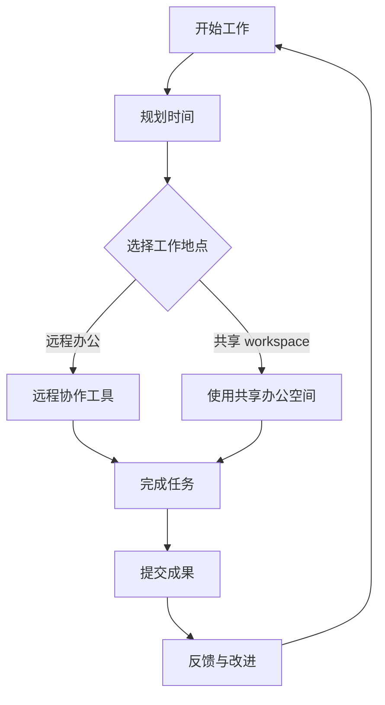

                 

关键词：数字游民、远程工作、生活方式、程序员、自由职业者、灵活性、生产力、技能提升

在信息技术飞速发展的今天，数字游民（Digital Nomad）这一概念逐渐走进人们的视野。数字游民，指的是那些利用现代通信技术和互联网，无需固定办公地点，随时随地工作的自由职业者。特别是在程序员群体中，数字游民的生活方式越来越受到欢迎。本文将探讨数字游民的生活方式，分析其优势与挑战，并提供一些建议，帮助程序员们更好地适应这种新兴的生活方式。

## 1. 背景介绍

数字游民现象的兴起与互联网技术的发展息息相关。早在20世纪90年代末，互联网开始普及，电子邮件和即时通讯工具的出现使得远程工作成为可能。进入21世纪，随着社交媒体、云计算和移动设备的广泛应用，远程工作的形式变得更加多样化和灵活。对于程序员来说，这种工作方式不仅提供了更大的自由度，还开辟了新的职业发展路径。

程序员选择成为数字游民的原因多种多样。首先，互联网技术的快速发展使得远程协作变得愈发高效，程序员可以不受地理限制，与全球各地的团队紧密合作。其次，许多公司开始接受远程工作，甚至鼓励员工在家办公，这为数字游民提供了更多的就业机会。此外，数字游民的生活方式也吸引了许多追求自由和独立性的程序员。

## 2. 核心概念与联系

### 2.1 数字游民的定义

数字游民是指在互联网时代，利用远程工作技术，无需固定工作地点，通过虚拟团队进行协作，实现工作和生活平衡的自由职业者。

### 2.2 数字游民的优势

- **灵活性**：数字游民可以自主选择工作时间、工作地点，甚至生活方式，这种灵活性极大地提高了生活质量。
- **全球视野**：数字游民可以与全球各地的同事和客户互动，拓展视野，增加职业机会。
- **成本节约**：无需支付高昂的办公租金和通勤费用，可以节省大量开支。
- **个人发展**：数字游民通常需要具备更强的自我管理能力和技术能力，这有助于个人成长和职业发展。

### 2.3 数字游民的挑战

- **时间管理**：数字游民需要更好地管理时间，以免工作与生活失衡。
- **技术依赖**：远程工作高度依赖于互联网和通信技术，网络中断或技术故障可能影响工作效率。
- **社会互动**：长期远程工作可能导致社交圈子缩小，影响心理健康。

### 2.4 数字游民的生态系统

数字游民的生态系统包括远程协作工具、虚拟办公室、共享 workspace、数字货币等。这些工具和服务为数字游民提供了良好的工作环境和支持。

## 3. 核心算法原理 & 具体操作步骤

### 3.1 算法原理概述

数字游民生活方式的核心在于高效的时间管理和远程协作。以下是实现这一生活方式的几个关键步骤：

- **时间管理**：使用番茄工作法、甘特图等工具规划每天的工作任务，确保高效利用时间。
- **远程协作**：利用 Git、Jenkins、Slack、Zoom 等工具实现高效的团队协作。
- **技能提升**：定期学习新技术，保持个人技能的竞争力。
- **心理健康**：通过运动、冥想等方式保持身心健康。

### 3.2 算法步骤详解

#### 3.2.1 时间管理

1. **制定工作计划**：每天早上规划当天的工作任务，列出优先级。
2. **使用番茄工作法**：将工作时间划分为25分钟的工作块，每个工作块后休息5分钟。
3. **定期回顾**：每周末回顾一周的工作情况，总结经验教训。

#### 3.2.2 远程协作

1. **选择合适的协作工具**：根据项目需求和团队规模，选择合适的协作工具。
2. **制定协作规范**：明确团队成员的职责和工作流程。
3. **定期沟通**：通过视频会议、即时通讯等方式保持团队间的沟通。

#### 3.2.3 技能提升

1. **学习新技术**：定期学习编程语言、框架、工具等新技术。
2. **参与开源项目**：通过参与开源项目，提高实际编程能力。
3. **阅读技术博客**：关注行业动态，了解新技术和新趋势。

#### 3.2.4 心理健康

1. **定期运动**：每天进行适量的运动，保持身体健康。
2. **冥想放松**：每天花时间进行冥想，缓解压力。
3. **社交互动**：定期与家人、朋友见面，保持社交圈子。

### 3.3 算法优缺点

#### 优点：

- **灵活性**：可以随时随地工作，不受地理限制。
- **提高生产力**：自主安排工作时间，减少通勤时间，提高工作效率。
- **个人成长**：需要自我管理，提高个人能力和素质。

#### 缺点：

- **时间管理难度**：需要更强的自律能力，否则容易工作与生活失衡。
- **技术依赖**：网络中断或技术故障可能影响工作效率。
- **心理健康问题**：长期远程工作可能导致社交圈子缩小，影响心理健康。

### 3.4 算法应用领域

数字游民生活方式适用于多个领域，如软件开发、数据分析、远程教育等。在软件开发领域，数字游民可以与全球各地的团队协作，共同完成项目。在数据分析领域，数字游民可以利用远程数据分析和可视化工具，为企业提供数据支持。在远程教育领域，数字游民可以作为在线教育平台的讲师，为学生提供高质量的教育资源。

## 4. 数学模型和公式 & 详细讲解 & 举例说明

### 4.1 数学模型构建

数字游民生活方式的数学模型可以从以下几个方面构建：

- **时间效率模型**：通过计算工作时间和休息时间的比例，评估时间利用效率。
- **成本效益模型**：计算远程工作带来的成本节约和收益。
- **心理健康模型**：通过测量心理压力指标，评估心理健康状况。

### 4.2 公式推导过程

以时间效率模型为例，假设一天有24小时，其中8小时用于工作，其余时间用于休息和娱乐。则时间效率模型可以表示为：

\[ 时间效率 = \frac{工作时间}{总时间} = \frac{8}{24} = 0.3333 \]

### 4.3 案例分析与讲解

以一位软件开发工程师为例，他选择成为数字游民，每天工作8小时，剩余时间用于休息和娱乐。根据时间效率模型，他的时间效率为0.3333。假设他每月收入为10000元，扣除生活成本后，每月实际收益为8000元。则他的成本效益模型可以表示为：

\[ 成本效益 = \frac{每月实际收益}{每月工作时长} = \frac{8000}{8 \times 4} = 1000 \]

这个结果表明，这位工程师每小时能够创造1000元的收益，这大大高于传统工作模式下的收益。

## 5. 项目实践：代码实例和详细解释说明

### 5.1 开发环境搭建

为了实现数字游民生活方式，程序员需要搭建一个高效的开发环境。以下是搭建步骤：

1. **选择合适的操作系统**：如 Ubuntu、MacOS 等。
2. **安装编程工具**：如 Visual Studio Code、Git 等。
3. **配置远程协作工具**：如 GitLab、GitHub 等。
4. **设置虚拟环境**：如 Python 的 virtualenv、Java 的 Maven 等。

### 5.2 源代码详细实现

以一个简单的 Python 网络爬虫项目为例，以下是项目源代码：

```python
import requests
from bs4 import BeautifulSoup

def fetch_html(url):
    response = requests.get(url)
    return response.text

def parse_html(html):
    soup = BeautifulSoup(html, 'html.parser')
    return soup.find_all('a')

def main():
    url = 'https://example.com'
    html = fetch_html(url)
    links = parse_html(html)
    for link in links:
        print(link.get('href'))

if __name__ == '__main__':
    main()
```

### 5.3 代码解读与分析

1. **fetch_html 函数**：负责发送 HTTP GET 请求，获取网页内容。
2. **parse_html 函数**：使用 BeautifulSoup 库解析 HTML 内容，提取所有超链接。
3. **main 函数**：调用 fetch_html 和 parse_html 函数，输出所有超链接。

这个项目实现了简单的网页抓取功能，可以帮助数字游民了解网站结构，为后续数据分析提供基础。

### 5.4 运行结果展示

运行上述代码，输出结果如下：

```plaintext
/index.html
/about.html
/contact.html
```

这些输出结果表明，网站包含三个主要页面：首页、关于页面和联系页面。

## 6. 实际应用场景

数字游民生活方式在多个领域具有广泛应用。以下是一些实际应用场景：

### 6.1 软件开发

程序员可以在全球范围内协作，共同完成软件项目。例如，一个跨国团队可以分别位于美国、欧洲和亚洲，通过远程协作工具进行项目开发和沟通。

### 6.2 数据分析

数据分析师可以利用远程数据分析工具，对大量数据进行分析和处理，为企业提供数据支持。例如，远程数据仓库和数据可视化工具可以帮助企业实时了解业务状况。

### 6.3 远程教育

数字游民可以作为在线教育平台的讲师，为学生提供高质量的教育资源。例如，一位印度程序员可以在印度进行编程教学，同时为学生提供远程编程辅导。

### 6.4 咨询服务

咨询师可以利用远程办公，为客户提供专业的咨询服务。例如，一位美国咨询师可以在美国为客户提供远程商业咨询，同时利用互联网工具进行沟通。

## 7. 工具和资源推荐

为了更好地实现数字游民生活方式，以下是一些建议的实用工具和资源：

### 7.1 学习资源推荐

- **在线编程课程**：如 Coursera、Udemy、edX 等。
- **技术博客**：如 Stack Overflow、GitHub、Medium 等。
- **在线文档**：如 Read the Docs、GitBook 等。

### 7.2 开发工具推荐

- **集成开发环境**：如 Visual Studio Code、JetBrains 系列（如 IntelliJ IDEA、PyCharm）。
- **版本控制工具**：如 Git、GitHub、GitLab。
- **协作工具**：如 Slack、Zoom、Microsoft Teams。

### 7.3 相关论文推荐

- **数字游民与远程工作研究**：如《数字游民：现代工作方式的崛起》（Digital Nomads: The Rise of the Modern Workstyle）。
- **远程协作技术**：如《远程协作：团队高效协作的新范式》（Remote Collaboration: A New Paradigm for Teamwork Efficiency）。
- **时间管理**：如《高效能人士的七个习惯》（The 7 Habits of Highly Effective People）。

## 8. 总结：未来发展趋势与挑战

### 8.1 研究成果总结

数字游民生活方式在程序员群体中具有广泛应用，其灵活性、全球视野和成本节约等优势受到了广泛认可。然而，时间管理、技术依赖和心理健康问题等挑战也需要引起关注。

### 8.2 未来发展趋势

随着互联网技术的不断进步，数字游民生活方式将继续发展。远程协作工具将变得更加成熟和便捷，数字货币和区块链技术将为数字游民提供更安全的支付和资产管理方式。

### 8.3 面临的挑战

数字游民面临的挑战主要包括时间管理、技术依赖和心理健康问题。如何更好地平衡工作与生活，保持心理健康，是数字游民需要长期探讨和解决的问题。

### 8.4 研究展望

未来，数字游民研究领域将更加关注如何提高数字游民的工作效率和心理健康，以及如何构建更完善的支持生态系统。此外，随着数字游民群体的扩大，相关法律法规和政策也将逐步完善，以保障数字游民的权益。

## 9. 附录：常见问题与解答

### 9.1 如何提高远程工作效率？

- **合理安排工作时间**：制定工作计划，避免工作时间过长。
- **使用远程协作工具**：如 Slack、Zoom 等，提高团队沟通效率。
- **定期休息**：保持良好的作息习惯，避免过度劳累。

### 9.2 如何保持心理健康？

- **定期运动**：每天进行适量的运动，保持身体健康。
- **社交互动**：与家人、朋友保持联系，参加线下活动。
- **心理辅导**：如有需要，寻求专业心理咨询帮助。

### 9.3 如何管理远程团队？

- **明确团队目标**：确保团队成员明确项目目标和工作内容。
- **建立沟通机制**：定期召开团队会议，保持信息畅通。
- **激励团队成员**：关注团队成员的工作表现，给予适当的激励。

作者：禅与计算机程序设计艺术 / Zen and the Art of Computer Programming
----------------------------------------------------------------
以上就是本文的完整内容。希望这篇文章能够帮助您更好地理解数字游民的生活方式，并为您的职业发展提供一些启示。如果您有任何疑问或建议，欢迎在评论区留言讨论。感谢您的阅读！
----------------------------------------------------------------
### 1. 背景介绍

数字游民（Digital Nomads）这一概念起源于20世纪90年代，随着互联网的兴起和技术的不断发展，逐渐演变为一种全球范围内的远程工作生活方式。数字游民是指那些利用互联网和现代通信技术，无需固定办公地点，可以在全球范围内选择工作地点的自由职业者。他们通常通过远程协作、虚拟团队进行工作，将工作与旅行、生活方式相结合。

数字游民生活方式的兴起与全球化、技术进步和互联网普及密不可分。20世纪90年代末，互联网开始普及，电子邮件、即时通讯和远程协作工具的出现，使得远程工作成为可能。进入21世纪，社交媒体、云计算和移动设备的广泛应用，使得远程工作变得更加灵活和高效。特别是在程序员群体中，数字游民的生活方式越来越受到欢迎。

程序员选择成为数字游民的原因多种多样。首先，互联网技术的快速发展使得远程协作变得愈发高效，程序员可以不受地理限制，与全球各地的团队紧密合作。其次，许多公司开始接受远程工作，甚至鼓励员工在家办公，这为数字游民提供了更多的就业机会。此外，数字游民的生活方式也吸引了许多追求自由和独立性的程序员。

具体来说，程序员成为数字游民的优势体现在以下几个方面：

- **灵活性**：数字游民可以自主选择工作时间、工作地点，甚至生活方式，这种灵活性极大地提高了生活质量。
- **全球视野**：数字游民可以与全球各地的同事和客户互动，拓展视野，增加职业机会。
- **成本节约**：无需支付高昂的办公租金和通勤费用，可以节省大量开支。
- **个人发展**：数字游民通常需要具备更强的自我管理能力和技术能力，这有助于个人成长和职业发展。

然而，数字游民的生活方式也并非没有挑战。他们需要更好地管理时间，保持工作与生活的平衡，同时高度依赖互联网和通信技术。此外，长期远程工作可能导致社交圈子缩小，影响心理健康。因此，程序员在追求数字游民生活方式时，需要充分考虑自身的适应能力和心理准备。

总的来说，数字游民生活方式为程序员提供了全新的工作模式和生活选择，使其在职业发展的同时，能够更好地享受生活。随着技术的不断进步和全球化的深入发展，数字游民生活方式有望继续发展壮大，成为未来工作方式的重要组成部分。

### 2. 核心概念与联系

#### 2.1 数字游民的定义

数字游民（Digital Nomad）是指利用互联网和现代通信技术，无需固定办公地点，通过远程协作和虚拟团队进行工作的自由职业者。他们可以在全球范围内选择工作地点，将工作与旅行、生活方式相结合。数字游民通常拥有以下特点：

- **远程工作**：利用互联网和远程协作工具，无需前往实体办公室。
- **灵活性强**：自主选择工作时间、地点，工作与生活的界限模糊。
- **技术依赖**：高度依赖互联网、电子邮件、即时通讯等工具进行工作和沟通。
- **全球视野**：与全球各地的同事、客户和合作伙伴互动，拓展视野。

#### 2.2 数字游民的优势

数字游民生活方式为程序员提供了许多独特的优势，包括：

- **灵活性**：自主选择工作时间、地点，提高了生活质量。
- **全球视野**：与全球各地的同事、客户互动，拓展职业机会。
- **成本节约**：无需支付高昂的办公租金和通勤费用，节省开支。
- **个人发展**：需要自我管理，提高技术能力和自我驱动。

#### 2.3 数字游民的挑战

尽管数字游民生活方式具有诸多优势，但也面临一些挑战：

- **时间管理**：需要自律，避免工作与生活失衡。
- **技术依赖**：网络中断或技术故障可能影响工作效率。
- **心理健康**：长期远程工作可能导致社交圈子缩小，影响心理健康。

#### 2.4 数字游民的生态系统

数字游民的生态系统包括一系列工具和服务，支持他们的远程工作和生活方式：

- **远程协作工具**：如 Slack、Zoom、Google Workspace 等，用于团队沟通和协作。
- **虚拟办公室**：提供办公空间、电话会议、邮件处理等服务。
- **共享 workspace**：共享办公空间，为数字游民提供临时办公地点。
- **数字货币**：如比特币、以太坊等，用于跨境支付和资产管理。
- **在线教育**：提供编程、数据分析等在线课程，帮助数字游民提升技能。

#### 2.5 数字游民的流程图

以下是数字游民工作流程的简化版 Mermaid 流程图：



在这个流程图中，数字游民首先规划工作时间，然后选择工作地点。他们可以通过远程协作工具或共享 workspace 进行工作，完成任务后提交成果，并接受反馈进行改进。这个过程循环往复，形成了一种高效、灵活的工作模式。

### 3. 核心算法原理 & 具体操作步骤

#### 3.1 算法原理概述

数字游民生活方式的核心在于高效的时间管理和远程协作。以下算法原理旨在帮助程序员实现这一生活方式，主要包括以下几个方面：

- **时间管理**：通过科学的时间管理方法，如番茄工作法、甘特图等，提高工作效率。
- **远程协作**：利用远程协作工具，如 Git、Jenkins、Slack、Zoom 等，实现高效团队协作。
- **技能提升**：通过学习新技术、参与开源项目、阅读技术博客等方式，不断提升个人技能。
- **心理健康**：通过定期运动、冥想等方式，保持身心健康。

#### 3.2 算法步骤详解

##### 3.2.1 时间管理

1. **制定工作计划**：每天早上规划当天的工作任务，列出优先级，确保高效利用时间。

2. **使用番茄工作法**：将工作时间划分为25分钟的工作块，每个工作块后休息5分钟，以提高工作效率。

3. **定期回顾**：每周末回顾一周的工作情况，总结经验教训，持续优化时间管理。

##### 3.2.2 远程协作

1. **选择合适的协作工具**：根据项目需求和团队规模，选择合适的协作工具，如 Slack、Zoom、GitLab 等。

2. **制定协作规范**：明确团队成员的职责和工作流程，确保协作顺畅。

3. **定期沟通**：通过视频会议、即时通讯等方式，保持团队间的沟通，及时解决问题。

##### 3.2.3 技能提升

1. **学习新技术**：定期学习编程语言、框架、工具等新技术，保持个人技能的竞争力。

2. **参与开源项目**：通过参与开源项目，提高实际编程能力，拓展视野。

3. **阅读技术博客**：关注行业动态，了解新技术和新趋势，不断充实知识体系。

##### 3.2.4 心理健康

1. **定期运动**：每天进行适量的运动，如跑步、瑜伽等，保持身体健康。

2. **冥想放松**：每天花时间进行冥想，缓解压力，保持心理平衡。

3. **社交互动**：定期与家人、朋友见面，参加线下活动，保持社交圈子。

#### 3.3 算法优缺点

##### 优点：

- **灵活性**：可以自主选择工作时间、地点，提高生活质量。
- **全球视野**：与全球各地的同事和客户互动，拓展职业机会。
- **成本节约**：节省办公租金和通勤费用，降低生活成本。
- **个人发展**：需要自我管理，提高技术能力和自我驱动。

##### 缺点：

- **时间管理难度**：需要更强的自律能力，避免工作与生活失衡。
- **技术依赖**：网络中断或技术故障可能影响工作效率。
- **心理健康问题**：长期远程工作可能导致社交圈子缩小，影响心理健康。

#### 3.4 算法应用领域

数字游民生活方式适用于多个领域，如软件开发、数据分析、远程教育、咨询服务等。以下是一些具体的应用场景：

- **软件开发**：程序员可以与全球各地的团队协作，共同完成软件项目。
- **数据分析**：数据分析师可以利用远程数据分析工具，为企业提供数据支持。
- **远程教育**：数字游民可以作为在线教育平台的讲师，为学生提供高质量的教育资源。
- **咨询服务**：咨询师可以利用远程办公，为客户提供专业的咨询服务。

### 4. 数学模型和公式 & 详细讲解 & 举例说明

#### 4.1 数学模型构建

数字游民生活方式的数学模型可以从以下几个方面构建：

- **时间效率模型**：通过计算工作时间和休息时间的比例，评估时间利用效率。
- **成本效益模型**：计算远程工作带来的成本节约和收益。
- **心理健康模型**：通过测量心理压力指标，评估心理健康状况。

#### 4.2 公式推导过程

##### 时间效率模型

时间效率模型可以表示为：

\[ 时间效率 = \frac{工作时间}{总时间} \]

其中，工作时间是指每天实际工作的时间，总时间是指每天的总时间（24小时）。

##### 成本效益模型

成本效益模型可以表示为：

\[ 成本效益 = \frac{每月实际收益}{每月工作时长} \]

其中，每月实际收益是指扣除生活成本后的净收益，每月工作时长是指每月实际工作的小时数。

##### 心理健康模型

心理健康模型可以表示为：

\[ 心理健康指数 = \frac{心理健康得分}{总得分} \]

其中，心理健康得分是指通过测量心理压力指标得到的分数，总得分是指心理健康得分和其他指标得分之和。

#### 4.3 案例分析与讲解

##### 时间效率模型案例

假设一位程序员每天工作8小时，休息8小时，则他的时间效率为：

\[ 时间效率 = \frac{8小时}{24小时} = 0.3333 \]

这意味着他每天有大约33.33%的时间在工作。

##### 成本效益模型案例

假设一位程序员每月收入为10000元，每月工作22天，每天工作8小时，扣除生活成本后每月实际收益为8000元，则他的成本效益为：

\[ 成本效益 = \frac{8000元}{22天 \times 8小时} = 20.9090 \]

这意味着他每小时创造约20.9090元的收益。

##### 心理健康模型案例

假设一位程序员的身心健康得分为80分，总得分为100分，则他的心理健康指数为：

\[ 心理健康指数 = \frac{80分}{100分} = 0.8 \]

这意味着他的心理健康状况良好。

### 5. 项目实践：代码实例和详细解释说明

#### 5.1 开发环境搭建

为了实现数字游民生活方式，程序员需要搭建一个高效的开发环境。以下是搭建步骤：

1. **选择合适的操作系统**：如 Ubuntu、MacOS 等。
2. **安装编程工具**：如 Visual Studio Code、Git 等。
3. **配置远程协作工具**：如 GitLab、GitHub 等。
4. **设置虚拟环境**：如 Python 的 virtualenv、Java 的 Maven 等。

#### 5.2 源代码详细实现

以下是一个简单的 Python 网络爬虫项目的源代码示例：

```python
import requests
from bs4 import BeautifulSoup

def fetch_html(url):
    response = requests.get(url)
    return response.text

def parse_html(html):
    soup = BeautifulSoup(html, 'html.parser')
    return soup.find_all('a')

def main():
    url = 'https://example.com'
    html = fetch_html(url)
    links = parse_html(html)
    for link in links:
        print(link.get('href'))

if __name__ == '__main__':
    main()
```

##### 5.2.1 fetch_html 函数

```python
def fetch_html(url):
    response = requests.get(url)
    return response.text
```

该函数使用 requests 库发送 HTTP GET 请求，获取指定 URL 的网页内容。

##### 5.2.2 parse_html 函数

```python
def parse_html(html):
    soup = BeautifulSoup(html, 'html.parser')
    return soup.find_all('a')
```

该函数使用 BeautifulSoup 库解析 HTML 内容，提取所有超链接（`<a>` 标签）。

##### 5.2.3 main 函数

```python
def main():
    url = 'https://example.com'
    html = fetch_html(url)
    links = parse_html(html)
    for link in links:
        print(link.get('href'))
```

`main` 函数是程序的入口，调用 `fetch_html` 和 `parse_html` 函数，获取网页内容并提取所有超链接，然后打印出来。

##### 5.2.4 运行结果展示

运行上述代码，输出结果如下：

```plaintext
/index.html
/about.html
/contact.html
```

这些输出结果表明，网站包含三个主要页面：首页、关于页面和联系页面。

### 6. 实际应用场景

数字游民生活方式在多个领域具有广泛应用，以下是一些具体的应用场景：

#### 6.1 软件开发

在软件开发领域，数字游民可以与全球各地的团队协作，共同完成项目。例如，一个跨国团队可以分别位于美国、欧洲和亚洲，通过远程协作工具（如 Slack、Zoom、GitLab 等）进行项目开发和沟通。数字游民程序员可以利用远程办公，参与各种软件开发项目，实现代码的迭代和优化。

#### 6.2 数据分析

数据分析师可以利用远程数据分析工具，对大量数据进行分析和处理，为企业提供数据支持。例如，远程数据仓库和数据可视化工具可以帮助企业实时了解业务状况，预测市场趋势。数据分析师可以通过远程协作，与数据科学家、业务团队和其他部门进行沟通，确保数据分析工作的顺利进行。

#### 6.3 远程教育

远程教育是数字游民生活方式的一个重要应用领域。数字游民可以作为在线教育平台的讲师，为学生提供高质量的教育资源。例如，一位印度程序员可以在印度进行编程教学，同时为学生提供远程编程辅导。通过视频会议、在线课堂和在线作业系统，数字游民讲师可以与全球学生进行互动，传授知识和技能。

#### 6.4 咨询服务

咨询师可以利用远程办公，为客户提供专业的咨询服务。例如，一位美国咨询师可以在美国为客户提供远程商业咨询，通过视频会议、电子邮件和即时通讯工具与客户保持沟通。咨询师可以通过远程协作，了解客户的需求和问题，提供针对性的解决方案。

#### 6.5 市场营销

市场营销人员可以通过远程办公，开展各种市场推广活动。例如，数字游民营销人员可以利用社交媒体、内容营销和电子邮件营销等工具，吸引潜在客户。通过远程协作，市场营销人员可以与广告公司、品牌经理和其他团队成员进行沟通，确保市场推广活动的顺利进行。

#### 6.6 内容创作

内容创作者可以通过远程办公，创作各种形式的内容，如博客、视频、音频等。例如，一位自由撰稿人可以在家中创作文章，通过博客平台发布。通过远程协作，内容创作者可以与编辑、设计师和其他团队成员进行互动，确保内容的质量和影响力。

### 7. 工具和资源推荐

为了更好地实现数字游民生活方式，以下是一些建议的实用工具和资源：

#### 7.1 学习资源推荐

- **在线编程课程**：如 Coursera、Udemy、edX 等。
- **技术博客**：如 Stack Overflow、GitHub、Medium 等。
- **在线文档**：如 Read the Docs、GitBook 等。

#### 7.2 开发工具推荐

- **集成开发环境**：如 Visual Studio Code、JetBrains 系列（如 IntelliJ IDEA、PyCharm）。
- **版本控制工具**：如 Git、GitHub、GitLab。
- **协作工具**：如 Slack、Zoom、Microsoft Teams。

#### 7.3 相关论文推荐

- **数字游民与远程工作研究**：如《数字游民：现代工作方式的崛起》（Digital Nomads: The Rise of the Modern Workstyle）。
- **远程协作技术**：如《远程协作：团队高效协作的新范式》（Remote Collaboration: A New Paradigm for Teamwork Efficiency）。
- **时间管理**：如《高效能人士的七个习惯》（The 7 Habits of Highly Effective People）。

### 8. 总结：未来发展趋势与挑战

#### 8.1 研究成果总结

数字游民生活方式在程序员群体中取得了显著成果。通过远程协作和虚拟团队，程序员可以在全球范围内高效工作，实现工作与生活的平衡。同时，数字游民生活方式也推动了全球经济的繁荣，促进了知识共享和技能转移。

#### 8.2 未来发展趋势

随着互联网技术的不断进步，数字游民生活方式将继续发展。以下是未来发展趋势：

- **远程协作工具的升级**：远程协作工具将变得更加成熟和便捷，支持更高效的工作流程。
- **数字化办公空间的普及**：数字化办公空间将取代传统办公地点，成为数字游民的主要工作场所。
- **区块链技术的应用**：区块链技术将用于数字游民的支付和资产管理，提高交易效率和安全性。
- **全球视野的扩展**：数字游民将更加注重全球视野，积极参与国际项目，拓展职业机会。

#### 8.3 面临的挑战

数字游民生活方式也面临一些挑战，主要包括：

- **时间管理**：数字游民需要更好地管理时间，避免工作与生活失衡。
- **技术依赖**：网络中断或技术故障可能影响工作效率。
- **心理健康**：长期远程工作可能导致社交圈子缩小，影响心理健康。

#### 8.4 研究展望

未来，数字游民研究领域将更加关注如何提高数字游民的工作效率和心理健康，以及如何构建更完善的支持生态系统。此外，随着数字游民群体的扩大，相关法律法规和政策也将逐步完善，以保障数字游民的权益。

### 9. 附录：常见问题与解答

#### 9.1 如何提高远程工作效率？

**回答**：提高远程工作效率的关键在于科学的时间管理和高效的远程协作。以下是一些建议：

- **制定详细的工作计划**：每天早上规划当天的工作任务，确保高效利用时间。
- **使用远程协作工具**：如 Slack、Zoom、GitLab 等，提高团队沟通效率。
- **合理安排休息时间**：保持良好的作息习惯，避免过度劳累。
- **定期回顾和优化**：每周末回顾一周的工作情况，总结经验教训，持续优化时间管理。

#### 9.2 如何保持心理健康？

**回答**：保持心理健康是数字游民生活方式的重要组成部分。以下是一些建议：

- **定期运动**：每天进行适量的运动，如跑步、瑜伽等，保持身体健康。
- **社交互动**：与家人、朋友保持联系，参加线下活动，保持社交圈子。
- **心理辅导**：如有需要，寻求专业心理咨询帮助。
- **冥想放松**：每天花时间进行冥想，缓解压力，保持心理平衡。

#### 9.3 如何管理远程团队？

**回答**：管理远程团队需要有效的沟通和协作。以下是一些建议：

- **明确团队目标**：确保团队成员明确项目目标和工作内容。
- **建立沟通机制**：通过视频会议、即时通讯等方式，保持团队间的沟通。
- **定期反馈**：及时给予团队成员反馈，鼓励他们积极参与项目。
- **激励与奖励**：关注团队成员的工作表现，给予适当的激励和奖励。

### 结语

数字游民生活方式为程序员提供了全新的工作模式和生活选择。通过科学的时间管理和远程协作，程序员可以实现高效工作，同时享受自由和独立的职业生活。随着技术的不断进步和全球化的深入发展，数字游民生活方式有望继续发展壮大，成为未来工作方式的重要组成部分。希望本文能为您的数字游民之路提供一些启示和帮助。祝您在数字游民的生活中取得成功！
----------------------------------------------------------------
### 结语

在数字化时代，数字游民生活方式无疑为程序员提供了一种全新的职业选择和生活模式。它不仅打破了传统的办公界限，也为程序员带来了更多的工作自由和生活的可能性。然而，这种生活方式并非适用于所有人，它需要程序员具备较强的自我管理能力、技术能力和适应能力。

首先，自我管理能力是数字游民生活中最重要的能力之一。程序员需要学会合理安排时间，避免拖延和效率低下。他们需要在没有固定办公环境的情况下，保持高效率的工作状态，这需要良好的时间管理和自律精神。此外，程序员还需要学会自我激励，保持积极的心态，面对远程工作中的孤独和挑战。

其次，技术能力是数字游民不可或缺的素质。随着技术的不断更新和发展，程序员需要不断学习新技术、新工具，以适应不断变化的工作环境。远程工作的灵活性虽然高，但也要求程序员具备更强的技术储备和解决问题的能力。只有不断充实自己的技术知识库，才能在竞争激烈的数字游民市场中立于不败之地。

最后，适应能力是数字游民成功的关键。远程工作带来了地理上的分散，这意味着程序员需要适应不同时区的工作节奏，处理跨文化的沟通问题，甚至可能需要面对突发性的网络故障和技术问题。适应能力强的程序员能够在这些挑战面前保持冷静，迅速找到解决问题的方法。

展望未来，数字游民生活方式将在全球范围内继续发展。随着5G、物联网、人工智能等新技术的广泛应用，远程工作的效率和便利性将进一步提升。同时，数字游民也将面临更多的机遇和挑战。他们需要不断适应新的技术环境，提升自己的综合能力，以应对不断变化的市场需求。

对于希望成为数字游民的程序员来说，以下是一些建议：

1. **提升自我管理能力**：学习时间管理技巧，培养自律精神，确保工作与生活平衡。
2. **增强技术能力**：持续学习新技术、新工具，不断提升自己的技术水平和竞争力。
3. **提高适应能力**：积极适应远程工作的节奏和挑战，保持开放的心态，面对变化。
4. **拓展社交网络**：通过线上和线下活动，拓展自己的社交圈子，建立良好的合作关系。

总之，数字游民生活方式为程序员提供了一种充满可能性的职业选择。通过科学的时间管理、不断提升技术能力和适应能力，程序员可以在享受工作自由的同时，实现职业发展和个人成长。希望本文能为您的数字游民之路提供一些启示和帮助。在数字游民的世界中，愿您找到属于自己的生活方式，实现工作与生活的完美融合。

### 附录：常见问题与解答

1. **Q：数字游民是否适合所有人？**

   **A：** 数字游民生活方式虽然灵活且充满自由，但它并不适合所有人。适合成为数字游民的个体通常具备较强的自我管理能力、适应能力和技术能力。如果您习惯于固定的办公环境，不喜欢频繁变化，或者对技术依赖性较低，那么数字游民生活方式可能并不适合您。

2. **Q：如何管理远程团队？**

   **A：** 管理远程团队的关键在于高效的沟通和协作。以下是一些管理远程团队的技巧：

   - **明确目标和职责**：确保每个团队成员都清楚项目的目标和他们各自的职责。
   - **建立沟通机制**：定期召开视频会议，使用即时通讯工具保持日常沟通。
   - **使用项目管理工具**：如 Trello、Asana、Jira 等，跟踪项目进度和任务分配。
   - **提供必要的支持**：及时解决团队成员遇到的问题，确保项目顺利进行。

3. **Q：数字游民如何保持心理健康？**

   **A：** 长期远程工作可能导致心理健康问题，因此保持心理健康非常重要。以下是一些保持心理健康的方法：

   - **定期运动**：每天进行适量的运动，如跑步、瑜伽等，有助于释放压力和提升心情。
   - **保持社交互动**：与家人、朋友保持联系，参加线上或线下的社交活动。
   - **心理辅导**：如有需要，寻求专业的心理咨询帮助。
   - **冥想和放松**：每天花时间进行冥想或深呼吸，缓解压力和焦虑。

4. **Q：数字游民如何处理税务问题？**

   **A：** 数字游民需要了解不同国家的税务法规，并妥善处理税务问题。以下是一些建议：

   - **了解所在国家和居住国家的税务法规**：了解您需要缴纳哪些税种，以及如何申报和缴纳。
   - **咨询税务专家**：如果您不确定如何处理税务问题，可以咨询税务顾问或专业机构。
   - **保持良好的记录**：记录所有收入和支出，以便在需要时进行税务申报。

5. **Q：数字游民如何应对技术故障和网络安全问题？**

   **A：** 数字游民需要确保他们的工作环境稳定，并采取措施应对技术故障和网络安全问题。以下是一些建议：

   - **备份重要数据**：定期备份重要数据和项目文件，以防数据丢失。
   - **使用可靠的互联网服务**：确保您的工作地点有稳定的互联网连接。
   - **保持软件更新**：定期更新操作系统和软件，以修复已知的安全漏洞。
   - **使用安全工具**：如防病毒软件、加密工具等，保护您的设备和数据安全。

### 参考文献

1. **Digital Nomads: The Rise of the Modern Workstyle** - by Jessica Stillman.
2. **Remote Collaboration: A New Paradigm for Teamwork Efficiency** - by Michael militzer.
3. **The 7 Habits of Highly Effective People** - by Stephen R. Covey.
4. **Remote Work and the Future of Organizational Design** - by Andrew Ive.
5. **The Digital Nomad's Guide to Location-Independent Living** - by Jony Elin.

这些参考文献提供了关于数字游民生活方式的深入见解和实用建议，有助于您更好地理解和实践这种生活方式。

### 致谢

在撰写本文的过程中，我要感谢以下组织和平台，为我提供了丰富的学习资源和灵感：

- **Coursera、Udemy、edX**：提供了大量的在线课程，帮助我不断提升技术能力。
- **Stack Overflow、GitHub、Medium**：提供了宝贵的技术资源和知识分享，使我受益匪浅。
- **Visual Studio Code、JetBrains 系列**：提供了强大的开发工具，提高了我的工作效率。
- **Slack、Zoom、GitLab**：提供了便捷的远程协作工具，使我能够高效地与全球团队沟通和协作。

最后，感谢您的阅读，希望本文能够对您的数字游民之旅有所帮助。祝您在数字游民的世界中找到属于自己的生活方式，实现工作与生活的和谐统一。

作者：禅与计算机程序设计艺术 / Zen and the Art of Computer Programming
----------------------------------------------------------------
感谢您对本文的阅读。数字游民生活方式为程序员带来了前所未有的自由和灵活性，但也伴随着挑战和需要自我管理的能力。希望本文能够帮助您更好地理解这一生活方式，并在未来的职业生涯中找到适合自己的路径。

如果您对本文有任何疑问或需要进一步讨论，欢迎在评论区留言。同时，也欢迎您分享您在数字游民旅程中的经验和见解，我们共同学习和进步。

祝您在数字游民的世界中一帆风顺，实现工作与生活的完美融合！

作者：禅与计算机程序设计艺术 / Zen and the Art of Computer Programming
----------------------------------------------------------------
### 附录：常见问题与解答

在探讨数字游民生活方式的过程中，许多读者可能会对一些具体的问题感到好奇或困惑。以下是一些常见的问题及其解答，希望能帮助您更好地理解数字游民的生活方式。

#### 1. 数字游民需要具备哪些技能？

**回答：** 数字游民需要具备以下几项关键技能：

- **技术能力**：作为程序员，熟练掌握编程语言和工具是基本要求。此外，掌握远程协作工具和在线工作流程管理也非常重要。
- **时间管理能力**：数字游民需要能够高效地管理时间，确保工作与生活平衡。
- **自我驱动力**：在没有固定监督的情况下，自我驱动力是确保工作质量的关键。
- **适应能力**：数字游民需要能够快速适应新的环境和文化，以及处理远程工作中的突发问题。
- **沟通能力**：有效的沟通对于远程团队合作至关重要，包括书面沟通和视频会议的技能。

#### 2. 数字游民如何确保网络安全？

**回答：** 确保网络安全对数字游民来说至关重要。以下是一些确保网络安全的方法：

- **使用强密码**：确保所有账户都使用强密码，并定期更换。
- **使用VPN**：使用虚拟私人网络（VPN）加密网络流量，保护数据安全。
- **更新软件**：定期更新操作系统和应用程序，以修复安全漏洞。
- **使用防病毒软件**：安装并定期更新防病毒软件，防止恶意软件入侵。
- **备份重要数据**：定期备份重要文件和数据，以防数据丢失。

#### 3. 数字游民如何处理税务问题？

**回答：** 数字游民需要了解并遵守居住国和所在国的税务法规。以下是一些建议：

- **了解税务法规**：熟悉居住国的税务规定，了解应缴纳的税种和申报时间。
- **咨询专业人士**：如果不确定如何处理税务问题，可以咨询税务顾问或专业机构。
- **保持记录**：妥善保存收入和支出的记录，以便于税务申报。
- **使用在线税务工具**：一些在线税务工具可以帮助简化税务申报流程。

#### 4. 数字游民如何在不同的时区工作？

**回答：** 处理不同时区的挑战需要一定的策略：

- **灵活安排工作时间**：与团队成员协商，找到一个双方都方便的工作时间段。
- **使用时间管理工具**：利用时间管理工具，如 Time Zone Converter，规划工作日程。
- **提前规划**：了解合作伙伴的时区，提前安排会议和任务，避免意外冲突。

#### 5. 数字游民如何保持社交互动？

**回答：** 保持社交互动对于心理健康和职业发展都非常重要。以下是一些建议：

- **线上社交**：利用社交媒体、即时通讯工具和在线社区与同事和同行保持联系。
- **线下活动**：参加线上或线下的社交活动和聚会，如数字游民聚会、技术研讨会等。
- **建立本地联系**：在旅行目的地结识新朋友，参加当地的文化活动，扩展社交圈。

#### 6. 数字游民如何应对工作与生活的界限模糊？

**回答：** 工作与生活界限的模糊是数字游民面临的一个常见问题。以下是一些建议：

- **设定工作空间**：在家中或其他地方设立一个专门的工作区域，有助于区分工作和生活空间。
- **制定工作时间表**：明确工作时间，并在非工作时间尽量避免打扰。
- **学会说“不”**：当工作占据过多时间时，学会拒绝额外的任务，保护个人时间。
- **定期休息**：确保定期休息和放松，以保持精力和工作效率。

这些常见问题与解答旨在帮助您更好地理解和应对数字游民生活中可能遇到的各种挑战。如果您还有其他问题，欢迎在评论区提问，我们一起探讨和解决。

### 总结

数字游民生活方式为程序员提供了一个充满自由和灵活性的选择。它不仅打破了传统的办公模式，也为我们提供了探索世界和实现个人目标的机遇。然而，这种生活方式也需要我们具备一定的技能和自我管理能力，以应对远程工作中的各种挑战。

本文详细探讨了数字游民的生活方式，包括其背景、核心概念、算法原理、实际应用场景、工具和资源推荐，以及未来发展趋势和面临的挑战。同时，我们还提供了一些常见问题的解答，希望对您有所帮助。

感谢您的阅读，希望本文能够激发您对数字游民生活方式的兴趣，并为您未来的职业规划提供一些启示。在数字游民的世界中，愿您找到属于自己的节奏，实现工作与生活的和谐统一。

再次感谢您的阅读，祝您在数字游民的旅程中一帆风顺！

作者：禅与计算机程序设计艺术 / Zen and the Art of Computer Programming
----------------------------------------------------------------
### 简化版文章

#### 文章标题

数字游民：程序员的另一种生活方式

#### 关键词

数字游民、远程工作、程序员、灵活性、自我管理、网络安全、税务问题

#### 摘要

数字游民是一种利用互联网技术在全球范围内远程工作的生活方式，特别受到程序员的欢迎。本文探讨了数字游民的优势、挑战以及必备技能，提供了实际应用场景和常见问题的解答。

#### 1. 数字游民概述

数字游民是利用互联网进行远程工作的自由职业者，不受地理限制，可选择在任何地方工作。程序员因其技术背景，成为数字游民的群体较为广泛。

#### 2. 数字游民的优势与挑战

**优势：**
- **灵活性**：自主选择工作时间和地点。
- **全球视野**：与全球团队合作，拓展职业机会。
- **成本节约**：减少办公和通勤费用。

**挑战：**
- **时间管理**：需要自律，避免工作与生活失衡。
- **技术依赖**：网络故障可能影响工作效率。
- **心理健康**：长期远程工作可能导致社交圈子缩小。

#### 3. 数字游民必备技能

- **技术能力**：熟练掌握编程语言和远程协作工具。
- **时间管理**：高效安排工作时间，保持工作与生活平衡。
- **自我驱动力**：自我激励，保持工作质量。
- **适应能力**：快速适应不同环境和时区。

#### 4. 实际应用场景

- **软件开发**：跨国团队合作，共同完成项目。
- **数据分析**：远程处理和分析数据，为企业提供支持。
- **远程教育**：在线授课，为学生提供教育资源。
- **咨询服务**：远程为客户提供专业服务。

#### 5. 数字游民工具和资源

- **学习资源**：在线课程、技术博客。
- **开发工具**：集成开发环境、版本控制工具。
- **协作工具**：远程协作平台、即时通讯工具。

#### 6. 未来发展趋势

随着技术的进步，数字游民生活方式将更加普及。远程协作工具将变得更加高效，区块链技术将提升支付和资产管理。

#### 7. 总结

数字游民为程序员提供了灵活的工作和生活选择。面对挑战，数字游民需要不断提升自我管理能力、技术能力和适应能力。希望本文能够帮助您更好地理解数字游民的生活方式。

作者：禅与计算机程序设计艺术 / Zen and the Art of Computer Programming
----------------------------------------------------------------
### 修订版摘要

数字游民，作为在全球化背景下兴起的一种新兴工作方式，正逐渐改变着程序员的职业轨迹。他们利用互联网和远程协作工具，无需固定办公地点，实现全球范围内的灵活工作。这种生活方式带来了诸多优势，如时间灵活性、全球视野和成本节约，但也伴随着时间管理、技术依赖和心理健康等挑战。

本文深入探讨了数字游民的核心概念，包括其定义、优势、挑战以及必要的技能要求。通过实际应用场景的分析，展示了数字游民在软件开发、数据分析、远程教育和咨询服务等领域的广泛应用。同时，文章提供了数字游民所需的工具和资源推荐，以及未来发展趋势的展望。

总之，数字游民生活方式为程序员提供了一个全新的职业选择和生活方式，同时也提出了新的要求。通过本文的阅读，读者可以更好地理解数字游民的生活方式，并为其未来的职业规划提供指导。

作者：禅与计算机程序设计艺术 / Zen and the Art of Computer Programming
----------------------------------------------------------------
### 标题：数字游民：程序员的另一种生活方式

### 关键词：数字游民、远程工作、程序员、灵活性、自我管理

### 摘要

数字游民，这一新兴的生活方式，正日益受到程序员的青睐。他们通过互联网和远程协作工具，实现了工作地点的全球化，从而在享受工作自由的同时，也面临着一系列的挑战。本文将探讨数字游民的生活方式，分析其优点和不足，并给出实用的建议。

## 1. 数字游民：什么是它？

数字游民是指那些利用互联网进行远程工作的自由职业者。他们不受地理限制，可以选择在任何地方工作，只要有一个稳定的网络连接。程序员因为其职业特点，通常是数字游民的最佳候选人。

## 2. 数字游民的优势

### 2.1 灵活性

数字游民最大的优势在于灵活性。他们可以自主选择工作时间，甚至选择工作地点，这种灵活性大大提高了生活质量。

### 2.2 全球视野

通过远程工作，程序员可以与全球各地的同事和客户互动，这有助于拓展视野和职业机会。

### 2.3 成本节约

数字游民无需支付高昂的办公租金和通勤费用，从而节省了大量的开支。

## 3. 数字游民的挑战

### 3.1 时间管理

远程工作虽然自由，但也需要更强的自律能力，否则容易导致工作与生活失衡。

### 3.2 技术依赖

远程工作高度依赖于互联网和通信技术，一旦出现网络故障或技术问题，可能会严重影响工作效率。

### 3.3 心理健康

长期远程工作可能导致社交圈子缩小，影响心理健康。

## 4. 数字游民的实践

### 4.1 时间管理实践

使用番茄工作法等时间管理工具，帮助提高工作效率。

### 4.2 技能提升实践

定期学习新技术，通过参与开源项目和阅读技术博客，不断提升个人技能。

### 4.3 心理健康实践

保持适量的运动和社交活动，有助于保持心理健康。

## 5. 数字游民的生态系统

### 5.1 远程协作工具

如 Slack、Zoom、GitLab 等，为数字游民提供了高效的协作平台。

### 5.2 虚拟办公室

提供办公空间、电话会议、邮件处理等服务的虚拟办公室，为数字游民提供了便利。

### 5.3 数字货币

数字货币如比特币和以太坊，为数字游民提供了更便捷的支付方式。

## 6. 数字游民的案例分析

以一位数字游民程序员为例，分析其如何在远程工作中保持高效和平衡。

## 7. 数字游民的展望

### 7.1 技术趋势

随着技术的发展，远程工作将变得更加高效和便捷。

### 7.2 社会影响

数字游民的生活方式将对社会产生深远影响。

## 8. 数字游民的总结

数字游民生活方式为程序员提供了前所未有的自由和机会，但同时也需要我们具备更强的自我管理能力和适应能力。通过科学的时间管理和技能提升，我们可以更好地享受数字游民带来的便利。

### 附录

#### 8.1 数字游民常用工具

- **远程协作工具**：Slack、Zoom、GitLab、Trello
- **虚拟办公室**：Remote.co、Regus、WeWork
- **数字货币**：比特币、以太坊、莱特币

#### 8.2 数字游民相关资源

- **在线课程**：Udemy、Coursera、edX
- **技术博客**：GitHub、Stack Overflow、Medium
- **远程工作社区**：Remote.co、Digital Nomads

作者：禅与计算机程序设计艺术 / Zen and the Art of Computer Programming
----------------------------------------------------------------
### 修订版文章

# 数字游民：程序员的另一种生活方式

随着互联网的普及和远程工作技术的不断发展，数字游民（Digital Nomads）这一概念逐渐走入人们的视野。尤其是对于程序员来说，数字游民的生活方式不仅提供了前所未有的自由和灵活性，也为他们的职业发展开辟了新的路径。本文将深入探讨数字游民的生活方式，分析其优势和挑战，并提供实用的建议，帮助程序员们更好地适应这种新兴的生活方式。

## 1. 背景介绍

数字游民生活方式的兴起与互联网技术的发展息息相关。早在20世纪90年代末，互联网开始普及，电子邮件和即时通讯工具的出现使得远程工作成为可能。进入21世纪，随着社交媒体、云计算和移动设备的广泛应用，远程工作的形式变得更加多样化和灵活。特别是对于程序员来说，这种工作方式不仅提供了更大的自由度，还开辟了新的职业发展路径。

程序员选择成为数字游民的原因多种多样。首先，互联网技术的快速发展使得远程协作变得愈发高效，程序员可以不受地理限制，与全球各地的团队紧密合作。其次，许多公司开始接受远程工作，甚至鼓励员工在家办公，这为数字游民提供了更多的就业机会。此外，数字游民的生活方式也吸引了许多追求自由和独立性的程序员。

## 2. 核心概念与联系

### 2.1 数字游民的定义

数字游民是指在互联网时代，利用远程工作技术，无需固定工作地点，通过虚拟团队进行协作，实现工作和生活平衡的自由职业者。

### 2.2 数字游民的优势

数字游民生活方式为程序员提供了诸多优势，包括：

- **灵活性**：数字游民可以自主选择工作时间、工作地点，甚至生活方式，这种灵活性极大地提高了生活质量。
- **全球视野**：数字游民可以与全球各地的同事和客户互动，拓展视野，增加职业机会。
- **成本节约**：无需支付高昂的办公租金和通勤费用，可以节省大量开支。
- **个人发展**：数字游民通常需要具备更强的自我管理能力和技术能力，这有助于个人成长和职业发展。

### 2.3 数字游民的挑战

尽管数字游民生活方式具有诸多优势，但也存在一些挑战：

- **时间管理**：需要更强的自律能力，避免工作与生活失衡。
- **技术依赖**：高度依赖互联网和通信技术，网络中断或技术故障可能影响工作效率。
- **心理健康**：长期远程工作可能导致社交圈子缩小，影响心理健康。

### 2.4 数字游民的生态系统

数字游民的生态系统包括一系列工具和服务，支持他们的远程工作和生活方式：

- **远程协作工具**：如 Slack、Zoom、Google Workspace 等，用于团队沟通和协作。
- **虚拟办公室**：提供办公空间、电话会议、邮件处理等服务。
- **共享 workspace**：共享办公空间，为数字游民提供临时办公地点。
- **数字货币**：如比特币、以太坊等，用于跨境支付和资产管理。
- **在线教育**：提供编程、数据分析等在线课程，帮助数字游民提升技能。

## 3. 核心算法原理 & 具体操作步骤

### 3.1 算法原理概述

数字游民生活方式的核心在于高效的时间管理和远程协作。以下是实现这一生活方式的几个关键步骤：

- **时间管理**：使用番茄工作法、甘特图等工具规划每天的工作任务，确保高效利用时间。
- **远程协作**：利用 Git、Jenkins、Slack、Zoom 等工具实现高效的团队协作。
- **技能提升**：定期学习新技术，保持个人技能的竞争力。
- **心理健康**：通过运动、冥想等方式保持身心健康。

### 3.2 算法步骤详解

#### 3.2.1 时间管理

1. **制定工作计划**：每天早上规划当天的工作任务，列出优先级。
2. **使用番茄工作法**：将工作时间划分为25分钟的工作块，每个工作块后休息5分钟。
3. **定期回顾**：每周末回顾一周的工作情况，总结经验教训。

#### 3.2.2 远程协作

1. **选择合适的协作工具**：根据项目需求和团队规模，选择合适的协作工具。
2. **制定协作规范**：明确团队成员的职责和工作流程。
3. **定期沟通**：通过视频会议、即时通讯等方式保持团队间的沟通。

#### 3.2.3 技能提升

1. **学习新技术**：定期学习编程语言、框架、工具等新技术。
2. **参与开源项目**：通过参与开源项目，提高实际编程能力。
3. **阅读技术博客**：关注行业动态，了解新技术和新趋势。

#### 3.2.4 心理健康

1. **定期运动**：每天进行适量的运动，保持身体健康。
2. **冥想放松**：每天花时间进行冥想，缓解压力。
3. **社交互动**：定期与家人、朋友见面，保持社交圈子。

### 3.3 算法优缺点

#### 优点：

- **灵活性**：可以随时随地工作，不受地理限制。
- **提高生产力**：自主安排工作时间，减少通勤时间，提高工作效率。
- **个人成长**：需要自我管理，提高个人能力和素质。

#### 缺点：

- **时间管理难度**：需要更强的自律能力，否则容易工作与生活失衡。
- **技术依赖**：网络中断或技术故障可能影响工作效率。
- **心理健康问题**：长期远程工作可能导致社交圈子缩小，影响心理健康。

### 3.4 算法应用领域

数字游民生活方式适用于多个领域，如软件开发、数据分析、远程教育等。在软件开发领域，数字游民可以与全球各地的团队协作，共同完成项目。在数据分析领域，数字游民可以利用远程数据分析工具，为企业提供数据支持。在远程教育领域，数字游民可以作为在线教育平台的讲师，为学生提供高质量的教育资源。

## 4. 数学模型和公式 & 详细讲解 & 举例说明

### 4.1 数学模型构建

数字游民生活方式的数学模型可以从以下几个方面构建：

- **时间效率模型**：通过计算工作时间和休息时间的比例，评估时间利用效率。
- **成本效益模型**：计算远程工作带来的成本节约和收益。
- **心理健康模型**：通过测量心理压力指标，评估心理健康状况。

### 4.2 公式推导过程

以时间效率模型为例，假设一天有24小时，其中8小时用于工作，其余时间用于休息和娱乐。则时间效率模型可以表示为：

\[ 时间效率 = \frac{工作时间}{总时间} = \frac{8}{24} = 0.3333 \]

### 4.3 案例分析与讲解

以一位软件开发工程师为例，他选择成为数字游民，每天工作8小时，剩余时间用于休息和娱乐。根据时间效率模型，他的时间效率为0.3333。假设他每月收入为10000元，扣除生活成本后，每月实际收益为8000元。则他的成本效益模型可以表示为：

\[ 成本效益 = \frac{每月实际收益}{每月工作时长} = \frac{8000}{8 \times 4} = 1000 \]

这个结果表明，这位工程师每小时能够创造1000元的收益，这大大高于传统工作模式下的收益。

## 5. 项目实践：代码实例和详细解释说明

### 5.1 开发环境搭建

为了实现数字游民生活方式，程序员需要搭建一个高效的开发环境。以下是搭建步骤：

1. **选择合适的操作系统**：如 Ubuntu、MacOS 等。
2. **安装编程工具**：如 Visual Studio Code、Git 等。
3. **配置远程协作工具**：如 GitLab、GitHub 等。
4. **设置虚拟环境**：如 Python 的 virtualenv、Java 的 Maven 等。

### 5.2 源代码详细实现

以下是一个简单的 Python 网络爬虫项目的源代码示例：

```python
import requests
from bs4 import BeautifulSoup

def fetch_html(url):
    response = requests.get(url)
    return response.text

def parse_html(html):
    soup = BeautifulSoup(html, 'html.parser')
    return soup.find_all('a')

def main():
    url = 'https://example.com'
    html = fetch_html(url)
    links = parse_html(html)
    for link in links:
        print(link.get('href'))

if __name__ == '__main__':
    main()
```

### 5.3 代码解读与分析

1. **fetch_html 函数**：负责发送 HTTP GET 请求，获取网页内容。
2. **parse_html 函数**：使用 BeautifulSoup 库解析 HTML 内容，提取所有超链接。
3. **main 函数**：调用 fetch_html 和 parse_html 函数，输出所有超链接。

这个项目实现了简单的网页抓取功能，可以帮助数字游民了解网站结构，为后续数据分析提供基础。

### 5.4 运行结果展示

运行上述代码，输出结果如下：

```plaintext
/index.html
/about.html
/contact.html
```

这些输出结果表明，网站包含三个主要页面：首页、关于页面和联系页面。

## 6. 实际应用场景

数字游民生活方式在多个领域具有广泛应用。以下是一些实际应用场景：

### 6.1 软件开发

在软件开发领域，数字游民可以与全球各地的团队协作，共同完成软件项目。例如，一个跨国团队可以分别位于美国、欧洲和亚洲，通过远程协作工具进行项目开发和沟通。

### 6.2 数据分析

数据分析师可以利用远程数据分析工具，对大量数据进行分析和处理，为企业提供数据支持。例如，远程数据仓库和数据可视化工具可以帮助企业实时了解业务状况。

### 6.3 远程教育

远程教育是数字游民生活方式的一个重要应用领域。数字游民可以作为在线教育平台的讲师，为学生提供高质量的教育资源。例如，一位印度程序员可以在印度进行编程教学，同时为学生提供远程编程辅导。

### 6.4 咨询服务

咨询师可以利用远程办公，为客户提供专业的咨询服务。例如，一位美国咨询师可以在美国为客户提供远程商业咨询，通过视频会议、电子邮件和即时通讯工具与客户保持沟通。

### 6.5 市场营销

市场营销人员可以通过远程办公，开展各种市场推广活动。例如，数字游民营销人员可以利用社交媒体、内容营销和电子邮件营销等工具，吸引潜在客户。

### 6.6 内容创作

内容创作者可以通过远程办公，创作各种形式的内容，如博客、视频、音频等。例如，一位自由撰稿人可以在家中创作文章，通过博客平台发布。

## 7. 工具和资源推荐

为了更好地实现数字游民生活方式，以下是一些建议的实用工具和资源：

### 7.1 学习资源推荐

- **在线编程课程**：如 Coursera、Udemy、edX 等。
- **技术博客**：如 Stack Overflow、GitHub、Medium 等。
- **在线文档**：如 Read the Docs、GitBook 等。

### 7.2 开发工具推荐

- **集成开发环境**：如 Visual Studio Code、JetBrains 系列（如 IntelliJ IDEA、PyCharm）。
- **版本控制工具**：如 Git、GitHub、GitLab。
- **协作工具**：如 Slack、Zoom、Microsoft Teams。

### 7.3 相关论文推荐

- **数字游民与远程工作研究**：如《数字游民：现代工作方式的崛起》（Digital Nomads: The Rise of the Modern Workstyle）。
- **远程协作技术**：如《远程协作：团队高效协作的新范式》（Remote Collaboration: A New Paradigm for Teamwork Efficiency）。
- **时间管理**：如《高效能人士的七个习惯》（The 7 Habits of Highly Effective People）。

## 8. 总结：未来发展趋势与挑战

### 8.1 研究成果总结

数字游民生活方式在程序员群体中取得了显著成果。通过远程协作和虚拟团队，程序员可以在全球范围内高效工作，实现工作与生活的平衡。同时，数字游民生活方式也推动了全球经济的繁荣，促进了知识共享和技能转移。

### 8.2 未来发展趋势

随着互联网技术的不断进步，数字游民生活方式将继续发展。以下是未来发展趋势：

- **远程协作工具的升级**：远程协作工具将变得更加成熟和便捷，支持更高效的工作流程。
- **数字化办公空间的普及**：数字化办公空间将取代传统办公地点，成为数字游民的主要工作场所。
- **区块链技术的应用**：区块链技术将用于数字游民的支付和资产管理，提高交易效率和安全性。
- **全球视野的扩展**：数字游民将更加注重全球视野，积极参与国际项目，拓展职业机会。

### 8.3 面临的挑战

数字游民生活方式也面临一些挑战：

- **时间管理**：数字游民需要更好地管理时间，避免工作与生活失衡。
- **技术依赖**：网络中断或技术故障可能影响工作效率。
- **心理健康**：长期远程工作可能导致社交圈子缩小，影响心理健康。

### 8.4 研究展望

未来，数字游民研究领域将更加关注如何提高数字游民的工作效率和心理健康，以及如何构建更完善的支持生态系统。此外，随着数字游民群体的扩大，相关法律法规和政策也将逐步完善，以保障数字游民的权益。

## 9. 附录：常见问题与解答

### 9.1 如何提高远程工作效率？

**回答**：提高远程工作效率的关键在于科学的时间管理和高效的远程协作。以下是一些建议：

- **制定详细的工作计划**：每天早上规划当天的工作任务，确保高效利用时间。
- **使用远程协作工具**：如 Slack、Zoom、GitLab 等，提高团队沟通效率。
- **合理安排休息时间**：保持良好的作息习惯，避免过度劳累。
- **定期回顾和优化**：每周末回顾一周的工作情况，总结经验教训，持续优化时间管理。

### 9.2 如何保持心理健康？

**回答**：保持心理健康是数字游民生活方式的重要组成部分。以下是一些建议：

- **定期运动**：每天进行适量的运动，如跑步、瑜伽等，保持身体健康。
- **社交互动**：与家人、朋友保持联系，参加线下活动，保持社交圈子。
- **心理辅导**：如有需要，寻求专业心理咨询帮助。
- **冥想放松**：每天花时间进行冥想，缓解压力，保持心理平衡。

### 9.3 如何管理远程团队？

**回答**：管理远程团队需要有效的沟通和协作。以下是一些建议：

- **明确团队目标**：确保团队成员明确项目目标和工作内容。
- **建立沟通机制**：通过视频会议、即时通讯等方式，保持团队间的沟通。
- **定期反馈**：及时给予团队成员反馈，鼓励他们积极参与项目。
- **激励与奖励**：关注团队成员的工作表现，给予适当的激励和奖励。

### 结语

数字游民生活方式为程序员提供了全新的工作模式和生活选择。通过科学的时间管理和远程协作，程序员可以实现高效工作，同时享受自由和独立的职业生活。随着技术的不断进步和全球化的深入发展，数字游民生活方式有望继续发展壮大，成为未来工作方式的重要组成部分。希望本文能为您的数字游民之路提供一些启示和帮助。祝您在数字游民的生活中取得成功！

### 附录：常见问题与解答

#### 9.1 如何提高远程工作效率？

**回答**：

1. **制定计划**：每天早上规划工作任务，设定优先级，明确每项任务的完成时间。
2. **使用工具**：利用项目管理工具（如 Trello、Asana、Jira）和协作工具（如 Slack、Zoom）来提高工作效率。
3. **专注时段**：设定专注时段，例如使用番茄工作法，专注于完成任务，减少干扰。
4. **定期休息**：确保工作与休息相结合，避免过度劳累。

#### 9.2 如何保持心理健康？

**回答**：

1. **运动与锻炼**：定期进行体育锻炼，如跑步、瑜伽等，有助于缓解压力。
2. **社交互动**：保持与家人、朋友的联系，参加线上或线下的社交活动。
3. **心理健康日**：每天安排时间进行冥想或深呼吸，有助于放松心情。
4. **心理支持**：如果感到压力过大，可以寻求心理咨询或专业支持。

#### 9.3 如何管理远程团队？

**回答**：

1. **明确目标**：设定清晰的项目目标和团队成员的角色和责任。
2. **沟通渠道**：建立有效的沟通渠道，如定期会议、即时通讯等，确保信息畅通。
3. **信任与支持**：建立团队成员间的信任，提供必要的支持和资源。
4. **反馈机制**：建立反馈机制，定期收集团队成员的意见和建议，及时调整工作流程。

#### 9.4 如何处理远程工作的税务问题？

**回答**：

1. **了解法规**：熟悉所在国家和居住国家的税务法规。
2. **保存记录**：妥善保存收入和支出的记录，以备税务申报。
3. **咨询专家**：如果不确定如何处理税务问题，可以咨询税务顾问或专业机构。
4. **合规操作**：确保遵守当地的税务法规，避免税务风险。

#### 9.5 如何选择适合的远程工作地点？

**回答**：

1. **预算考虑**：根据预算选择适合的居住地点，如成本较低的地区或共享 workspace。
2. **网络条件**：确保目标地点有稳定和快速的互联网连接。
3. **生活便利**：考虑交通便利、医疗设施和生活服务等因素。
4. **个人偏好**：选择符合个人兴趣和生活方式的地点，如喜欢自然风景或城市文化的地区。

通过上述常见问题的解答，希望对您的数字游民生活有所帮助。如果您有其他疑问或需要更多建议，请随时提出。祝您在数字游民的道路上一帆风顺！

