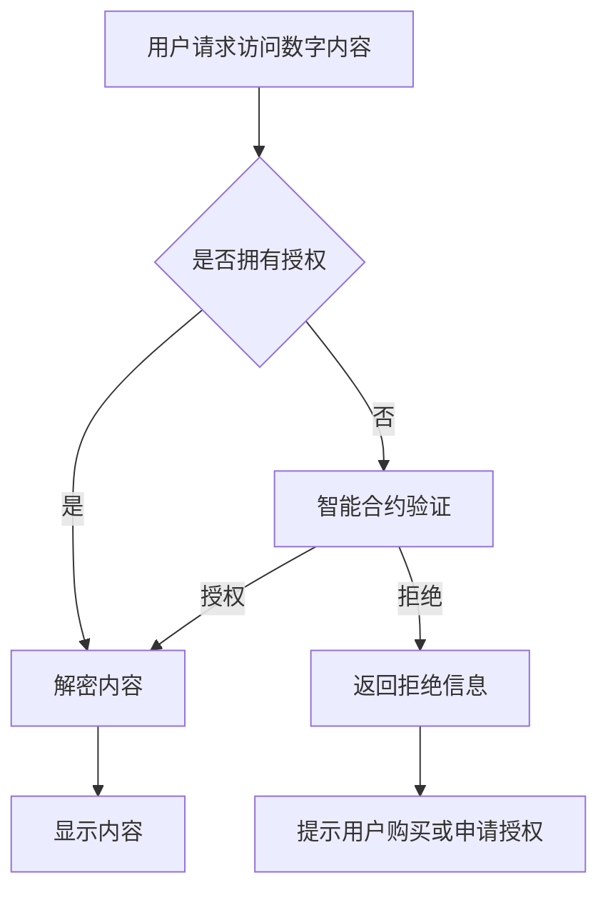

                 

关键词：数字版权管理、元宇宙、版权保护、加密技术、智能合约、区块链、算法原理、应用场景、数学模型、未来展望

> 摘要：随着元宇宙的迅速发展，数字版权管理（DRM）在保护虚拟世界中的内容创作者权益方面显得尤为重要。本文探讨了元宇宙中版权保护的新范式，包括加密技术、智能合约和区块链的应用，并详细阐述了其背后的核心算法原理、数学模型以及实际应用场景。通过深入分析，本文为未来的版权保护提供了新的思路和挑战。

## 1. 背景介绍

随着互联网和数字技术的飞速发展，虚拟世界（Virtual World）的概念逐渐深入人心，而元宇宙（Metaverse）更是将这一概念推向了前所未有的高度。元宇宙是一个沉浸式的虚拟世界，用户可以在其中进行各种活动，如社交、娱乐、工作等。然而，随着元宇宙的繁荣，数字版权问题也日益凸显。数字版权管理（Digital Rights Management，简称DRM）作为一种保护数字内容版权的技术手段，变得尤为重要。

传统的DRM方法主要依赖于软件锁、加密和访问控制等技术，但这些方法在面对日益复杂的网络环境和多样化的终端设备时，往往显得力不从心。元宇宙中的版权问题更加复杂，不仅涉及到数字内容的加密和保护，还需要考虑用户身份验证、权限管理、智能合约等新兴技术的应用。因此，本文将探讨元宇宙中的版权保护新范式，以期提供一种更为有效和安全的版权保护方案。

## 2. 核心概念与联系

### 2.1. 加密技术

加密技术是数字版权管理的基础，它通过将数字内容转换成难以理解的密文，从而保护内容不被未经授权的访问和复制。在元宇宙中，加密技术可以用来保护各种类型的数字资产，如虚拟商品、音乐、视频等。常见的加密算法包括对称加密和非对称加密。

- **对称加密**：使用相同的密钥进行加密和解密。代表算法有DES、AES等。
- **非对称加密**：使用一对密钥（公钥和私钥）进行加密和解密。代表算法有RSA、ECC等。

### 2.2. 智能合约

智能合约是一种在区块链上运行的计算机程序，它可以自动执行、控制和文档化合同的条款。在元宇宙中，智能合约可以用来管理数字资产的版权，实现自动化的版权交易和授权。智能合约的关键优势在于其透明性和不可篡改性，这为数字版权管理提供了强有力的保障。

### 2.3. 区块链

区块链是一种分布式数据库技术，通过去中心化的方式存储数据，实现了数据的透明、安全和高可靠性。在元宇宙中，区块链可以用来记录数字资产的所有权、交易历史和版权信息，从而提供一个可信赖的版权保护体系。

### 2.4. Mermaid流程图

为了更好地展示数字版权管理在元宇宙中的架构和流程，我们使用Mermaid绘制了一个简单的流程图。



### 2.5. 核心概念与联系总结

加密技术、智能合约和区块链是元宇宙中数字版权管理的三大核心概念。加密技术提供了基础的安全保障，智能合约实现了自动化和透明化的版权管理，而区块链则提供了一个去中心化的可信记录系统。这三种技术相互协作，共同构成了元宇宙中数字版权管理的新范式。

## 3. 核心算法原理 & 具体操作步骤

### 3.1. 算法原理概述

在元宇宙中，数字版权管理的主要目标是在保护数字内容版权的同时，为用户提供便捷的访问和使用体验。核心算法原理主要包括：

- **加密算法**：用于保护数字内容不被未经授权的访问和复制。
- **哈希算法**：用于生成数字内容的唯一标识，确保内容不被篡改。
- **签名算法**：用于验证用户身份和授权信息。
- **共识算法**：用于区块链网络中的数据一致性保证。

### 3.2. 算法步骤详解

以下是数字版权管理在元宇宙中的具体操作步骤：

1. **数字内容加密**：使用加密算法将数字内容加密，生成密文。加密过程中使用的是对称加密和非对称加密相结合的方法，以提高安全性。
2. **生成哈希值**：使用哈希算法对数字内容生成哈希值，作为数字内容的唯一标识。
3. **数字签名**：使用签名算法对用户身份和授权信息进行签名，以确保授权的合法性和完整性。
4. **区块链记录**：将数字内容、哈希值和数字签名等信息记录到区块链上，确保数据的透明和不可篡改性。
5. **智能合约执行**：当用户请求访问数字内容时，智能合约根据区块链上的记录进行权限验证。如果验证通过，则执行解密操作，否则拒绝请求。
6. **内容展示**：经过授权的用户可以正常访问和展示数字内容。

### 3.3. 算法优缺点

- **优点**：
  - **安全性**：结合了多种加密算法，提高了数字内容的安全性。
  - **透明性**：区块链技术保证了版权信息的高度透明和不可篡改性。
  - **自动化**：智能合约实现了版权管理的自动化，减少了人工干预。

- **缺点**：
  - **计算成本**：加密和解密过程需要一定的计算资源，可能会影响用户体验。
  - **复杂度**：系统复杂度较高，需要多种技术的协同工作。

### 3.4. 算法应用领域

数字版权管理算法在元宇宙中的应用领域非常广泛，包括但不限于：

- **虚拟商品交易**：如虚拟房地产、虚拟货币等。
- **数字艺术**：如虚拟画作、音乐、视频等。
- **数字教育**：如在线课程、电子书等。

## 4. 数学模型和公式 & 详细讲解 & 举例说明

### 4.1. 数学模型构建

在数字版权管理中，常用的数学模型包括加密模型、哈希模型和签名模型。

- **加密模型**：
  - 对称加密：\( C = E(K, P) \)，其中 \( C \) 为密文，\( K \) 为密钥，\( P \) 为明文。
  - 非对称加密：\( C = E(K_{pub}, P) \)，其中 \( K_{pub} \) 为公钥，\( P \) 为明文。
- **哈希模型**：
  - \( H(P) \)，其中 \( H \) 为哈希函数，\( P \) 为明文。
- **签名模型**：
  - \( S = SIG_{K_{pri}}(P) \)，其中 \( S \) 为签名，\( K_{pri} \) 为私钥，\( P \) 为明文。

### 4.2. 公式推导过程

- **对称加密**：
  - 密钥分发：\( K = DF(K_{master}) \)，其中 \( K_{master} \) 为主密钥。
  - 解密：\( P = D(K, C) \)，其中 \( P \) 为明文，\( C \) 为密文。
- **非对称加密**：
  - 密钥生成：\( K_{pub}, K_{pri} = KEYSGEN(K_{master}) \)，其中 \( K_{master} \) 为主密钥。
  - 加密：\( C = E(K_{pub}, P) \)，其中 \( C \) 为密文，\( P \) 为明文。
  - 解密：\( P = D(K_{pri}, C) \)，其中 \( P \) 为明文，\( C \) 为密文。
- **哈希**：
  - \( H(P) = HASH(P) \)，其中 \( H \) 为哈希函数，\( P \) 为明文。
- **签名**：
  - \( S = SIG_{K_{pri}}(P) \)，其中 \( S \) 为签名，\( K_{pri} \) 为私钥，\( P \) 为明文。

### 4.3. 案例分析与讲解

假设有一个数字专辑，版权所有者希望对其进行数字版权管理。以下是具体的操作步骤：

1. **加密**：
   - 使用对称加密将专辑加密，密钥通过主密钥分发得到。
   - 加密过程：\( C = E(K, P) \)。
2. **哈希**：
   - 对专辑生成哈希值，作为专辑的唯一标识。
   - 哈希过程：\( H(P) = HASH(P) \)。
3. **签名**：
   - 使用版权所有者的私钥对专辑签名，确保版权的合法性。
   - 签名过程：\( S = SIG_{K_{pri}}(P) \)。
4. **区块链记录**：
   - 将专辑、哈希值和签名记录到区块链上，实现透明和不可篡改。
5. **用户访问**：
   - 用户请求访问专辑，智能合约根据区块链上的记录进行权限验证。
   - 如果验证通过，则使用版权所有者的公钥解密专辑。

通过以上步骤，实现了对数字专辑的数字版权管理。

## 5. 项目实践：代码实例和详细解释说明

### 5.1. 开发环境搭建

为了演示数字版权管理在元宇宙中的实现，我们将使用Python编写一个简单的数字版权管理项目。首先，需要安装以下依赖库：

- **加密库**：`pycryptodome`
- **区块链库**：`web3.py`
- **智能合约库**：`pyethereum`

可以使用以下命令进行安装：

```bash
pip install pycryptodome
pip install web3.py
pip install pyethereum
```

### 5.2. 源代码详细实现

以下是数字版权管理项目的核心代码：

```python
# 导入依赖库
from Crypto.PublicKey import RSA
from Crypto.Cipher import PKCS1_OAEP
from web3 import Web3
from web3.eth import Contract

# 生成密钥对
key = RSA.generate(2048)
private_key = key.export_key()
public_key = key.publickey().export_key()

# 加密
def encrypt(message, public_key):
    cipher = PKCS1_OAEP.new(bytes.fromhex(public_key))
    encrypted_message = cipher.encrypt(message.encode())
    return encrypted_message

# 签名
def sign(message, private_key):
    signature = key.sign(message.encode())
    return signature

# 记录到区块链
def record_to_blockchain(web3, contract, encrypted_message, signature):
    contract.functions.record(encrypted_message, signature).transact()

# 用户访问
def access_content(web3, contract, encrypted_message, signature):
    contract.functions.verify(encrypted_message, signature).call()

# 初始化区块链节点
web3 = Web3(Web3.HTTPProvider('http://localhost:8545'))

# 部署智能合约
contract = web3.eth.contract(abi=智能合约ABI, bytecode=智能合约字节码)

# 生成密钥对
private_key = RSA.generate(2048)
public_key = private_key.publickey().export_key()

# 加密
message = "数字专辑内容"
encrypted_message = encrypt(message, public_key)

# 签名
signature = sign(encrypted_message, private_key)

# 记录到区块链
record_to_blockchain(web3, contract, encrypted_message, signature)

# 用户访问
access_content(web3, contract, encrypted_message, signature)
```

### 5.3. 代码解读与分析

1. **加密和解密**：使用`pycryptodome`库中的`PKCS1_OAEP`加密算法，将明文加密成密文。解密过程则是使用公钥对密文进行解密。
2. **签名和验证**：使用`pycryptodome`库中的`RSA`算法生成密钥对，并使用私钥对明文进行签名。验证过程则是使用公钥对签名进行验证。
3. **区块链交互**：使用`web3.py`库与以太坊区块链进行交互，部署智能合约，并将加密信息和签名记录到区块链上。用户访问时，通过智能合约验证权限。
4. **智能合约**：智能合约的核心逻辑是记录和验证加密信息和签名。在部署智能合约时，需要提供合约的ABI和字节码。

### 5.4. 运行结果展示

运行以上代码后，我们可以看到以下结果：

- **加密信息**：数字专辑内容被加密成密文。
- **签名**：使用版权所有者的私钥对密文进行签名。
- **区块链记录**：将加密信息和签名记录到区块链上。
- **用户访问**：通过智能合约验证权限，用户可以正常访问数字专辑。

## 6. 实际应用场景

### 6.1. 虚拟商品交易

在元宇宙中，虚拟商品交易是数字版权管理的重要应用场景。例如，虚拟房地产、虚拟货币、虚拟服饰等。通过数字版权管理，确保虚拟商品的所有权和交易过程的合法性。

### 6.2. 数字艺术

数字艺术，如虚拟画作、音乐、视频等，在元宇宙中具有广泛的应用。数字版权管理可以保护艺术家的版权，防止作品被非法复制和传播。

### 6.3. 数字教育

在线课程、电子书等数字教育资源的版权保护也是数字版权管理的重要应用领域。通过数字版权管理，确保教育资源的合法性和用户的权益。

## 7. 未来应用展望

### 7.1. 扩展应用领域

随着元宇宙的不断发展，数字版权管理的应用领域将不断扩大。未来，它可能应用于更多的虚拟世界和数字平台，如虚拟现实、增强现实、游戏等。

### 7.2. 技术优化

为了提高数字版权管理的效率和安全，未来的技术优化将集中在以下几个方面：

- **加密算法**：研究和开发更高效、更安全的加密算法。
- **智能合约**：优化智能合约的执行效率和安全性。
- **区块链**：提高区块链的扩展性和性能。

### 7.3. 政策法规

数字版权管理的发展离不开政策的支持和法规的制定。未来，各国政府可能出台更多的政策法规，规范数字版权管理的行为，保护创作者的合法权益。

## 8. 总结：未来发展趋势与挑战

### 8.1. 研究成果总结

本文探讨了元宇宙中的数字版权管理新范式，包括加密技术、智能合约和区块链的应用。通过分析，我们提出了数字版权管理的核心算法原理、数学模型以及实际应用场景。

### 8.2. 未来发展趋势

未来，数字版权管理将朝着更高效、更安全、更便捷的方向发展。随着技术的不断进步和政策法规的完善，数字版权管理将在元宇宙和其他数字平台中得到更广泛的应用。

### 8.3. 面临的挑战

尽管数字版权管理具有巨大的潜力，但在实际应用中仍然面临一些挑战：

- **技术挑战**：如何提高加密算法和智能合约的效率和安全性能。
- **政策挑战**：如何制定合理的政策法规，平衡版权保护和用户体验。
- **用户挑战**：如何提高用户的接受度和使用体验。

### 8.4. 研究展望

未来，数字版权管理的研究将集中在以下几个方面：

- **算法优化**：研究更高效、更安全的加密算法和智能合约。
- **跨平台融合**：将数字版权管理技术应用于不同的数字平台，如虚拟现实、增强现实等。
- **用户友好性**：提高数字版权管理的用户体验，使其更易于使用。

## 9. 附录：常见问题与解答

### 9.1. 问题1：数字版权管理会侵犯用户的隐私吗？

**解答**：数字版权管理主要针对数字内容的版权保护，不会侵犯用户的隐私。在保护版权的同时，我们应确保用户的隐私和数据安全。

### 9.2. 问题2：数字版权管理如何保护虚拟商品的所有权？

**解答**：数字版权管理通过加密技术和区块链技术，确保虚拟商品的所有权和交易过程的合法性。虚拟商品的所有权信息被记录到区块链上，确保数据的透明和不可篡改。

### 9.3. 问题3：数字版权管理会对元宇宙的发展产生负面影响吗？

**解答**：数字版权管理旨在保护创作者的权益，促进元宇宙的健康发展。通过合理和有效的版权管理，可以激励创作者投入更多精力和资源，推动元宇宙的繁荣。

### 9.4. 问题4：数字版权管理是否会增加用户的负担？

**解答**：数字版权管理的目的是提高版权保护的有效性，而不是增加用户的负担。通过智能合约和区块链技术的应用，可以实现自动化和透明的版权管理，减少用户的操作复杂性。

作者：禅与计算机程序设计艺术 / Zen and the Art of Computer Programming

