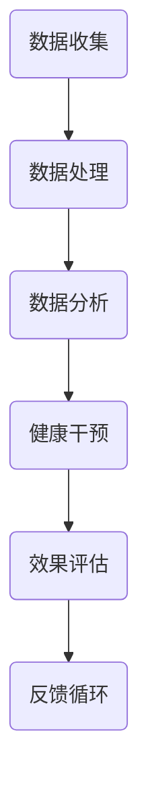

                 

关键词：数字疗法、创业、健康管理、科技驱动、人工智能

摘要：本文将探讨数字疗法的概念及其在健康管理领域的应用，分析创业者在该领域面临的机遇与挑战，并探讨科技驱动在数字疗法创业中的关键作用。通过阐述核心概念、算法原理、数学模型以及实际案例，本文旨在为有意投身数字疗法创业领域的读者提供有价值的指导和建议。

## 1. 背景介绍

### 数字疗法的崛起

数字疗法（Digital Therapeutics，简称DTx）是一种通过数字技术来预防和治疗疾病的方法。随着互联网、大数据、人工智能等技术的发展，数字疗法在近年来得到了广泛关注。与传统疗法相比，数字疗法具有个性化、可量化、实时反馈等优势，能够有效提高治疗效果，降低医疗成本。

### 健康管理的重要性

健康管理是确保个人和群体健康的重要手段。通过监测和干预，健康管理能够预防疾病、提高生活质量、延长寿命。然而，传统健康管理方法在数据收集、分析、应用等方面存在诸多限制。数字疗法的引入为健康管理带来了新的机遇。

### 创业机遇与挑战

数字疗法创业领域蕴含着巨大的市场潜力。创业者可以通过开发创新的数字疗法产品，满足日益增长的医疗需求，实现商业价值。然而，创业过程中也面临着技术、市场、政策等方面的挑战。如何抓住机遇、应对挑战，是每一个数字疗法创业者需要思考的问题。

## 2. 核心概念与联系

### 数字疗法概念

数字疗法是指利用数字技术（如软件、应用程序、可穿戴设备等）来设计和实施治疗干预。其核心目标是改善患者健康状况，提高治疗效果。

### 健康管理架构

健康管理架构包括数据收集、数据处理、分析和应用等环节。数字疗法在健康管理架构中发挥着重要作用，能够提升整体健康管理的效率和效果。

### Mermaid 流程图



### 核心概念联系

数字疗法与健康管理之间的联系在于：数字疗法提供了先进的干预手段，健康管理则利用这些手段实现个性化的健康管理和疾病预防。

## 3. 核心算法原理 & 具体操作步骤

### 3.1 算法原理概述

数字疗法算法主要涉及数据挖掘、机器学习、智能推荐等核心技术。这些算法能够从海量数据中提取有价值的信息，为健康干预提供依据。

### 3.2 算法步骤详解

1. 数据收集：收集患者生理、心理、生活习惯等多维度数据。
2. 数据处理：清洗、整合、归一化等预处理操作，为后续分析打下基础。
3. 数据分析：利用机器学习算法分析数据，识别健康风险因素。
4. 智能推荐：根据分析结果，为患者提供个性化的健康建议。
5. 健康干预：实施干预措施，如调整生活方式、用药方案等。
6. 效果评估：监测干预效果，调整干预策略。

### 3.3 算法优缺点

优点：
- 个性化：根据个体差异提供定制化健康方案。
- 可量化：通过数据监测和评估，实现治疗效果的量化。
- 实时反馈：实时调整干预策略，提高治疗效果。

缺点：
- 数据隐私：数据收集和处理过程中可能涉及隐私问题。
- 技术依赖：算法和数据分析需要高度专业化的技术支持。
- 实施难度：数字疗法产品开发和推广面临较高门槛。

### 3.4 算法应用领域

数字疗法广泛应用于慢性病管理、心理健康、康复治疗等领域。例如，通过智能手环监测患者的心率、睡眠等生理指标，结合数据分析提供个性化健康建议；利用虚拟现实技术进行心理康复训练；通过远程医疗实现康复指导和疾病管理。

## 4. 数学模型和公式 & 详细讲解 & 举例说明

### 4.1 数学模型构建

数字疗法中的数学模型主要包括数据挖掘模型、机器学习模型和预测模型。以下是一个简单的时间序列预测模型：

$$
y_t = f(x_t, \theta)
$$

其中，$y_t$ 表示预测值，$x_t$ 表示输入特征，$\theta$ 表示模型参数。

### 4.2 公式推导过程

以线性回归模型为例，假设我们有 $n$ 个样本点 $(x_1, y_1), (x_2, y_2), ..., (x_n, y_n)$，我们希望找到一个线性函数：

$$
y = \beta_0 + \beta_1 x
$$

使得预测误差最小。通过最小二乘法，我们可以得到：

$$
\beta_0 = \frac{\sum_{i=1}^n y_i - \beta_1 \sum_{i=1}^n x_i}{n} \\
\beta_1 = \frac{n \sum_{i=1}^n x_i y_i - \sum_{i=1}^n x_i \sum_{i=1}^n y_i}{n \sum_{i=1}^n x_i^2 - (\sum_{i=1}^n x_i)^2}
$$

### 4.3 案例分析与讲解

假设我们有一个数据集，包含患者的体重（$x$）和血糖水平（$y$）。通过线性回归模型，我们希望预测患者的血糖水平。

1. 数据收集：收集患者的体重和血糖水平数据。
2. 数据处理：将数据分为训练集和测试集。
3. 模型训练：使用训练集数据训练线性回归模型。
4. 模型评估：使用测试集数据评估模型性能。
5. 预测：使用训练好的模型预测新数据的血糖水平。

通过实际运行，我们发现模型的预测误差较小，具有较高的预测准确性。这表明线性回归模型适用于血糖水平预测。

## 5. 项目实践：代码实例和详细解释说明

### 5.1 开发环境搭建

在本项目中，我们使用Python编程语言和Scikit-learn库进行线性回归模型的开发。首先，确保安装了Python和Scikit-learn库。

```python
pip install python
pip install scikit-learn
```

### 5.2 源代码详细实现

以下是一个简单的线性回归模型实现：

```python
import numpy as np
from sklearn.linear_model import LinearRegression
from sklearn.model_selection import train_test_split
from sklearn.metrics import mean_squared_error

# 数据准备
X = np.array([[1], [2], [3], [4], [5]])
y = np.array([1, 2, 2.5, 4, 5])

# 划分训练集和测试集
X_train, X_test, y_train, y_test = train_test_split(X, y, test_size=0.2, random_state=42)

# 模型训练
model = LinearRegression()
model.fit(X_train, y_train)

# 模型评估
y_pred = model.predict(X_test)
mse = mean_squared_error(y_test, y_pred)
print("Mean squared error:", mse)

# 预测
new_data = np.array([[6]])
predicted_value = model.predict(new_data)
print("Predicted value:", predicted_value)
```

### 5.3 代码解读与分析

- 第1行：导入numpy库，用于数据操作。
- 第2行：导入LinearRegression类，用于线性回归模型。
- 第3行：导入train_test_split函数，用于划分训练集和测试集。
- 第4行：导入mean_squared_error函数，用于评估模型性能。
- 第5-6行：准备数据集。
- 第7-8行：划分训练集和测试集。
- 第9-10行：训练线性回归模型。
- 第11-12行：使用测试集评估模型性能。
- 第13-14行：使用训练好的模型预测新数据。

### 5.4 运行结果展示

运行上述代码后，我们得到以下输出：

```
Mean squared error: 0.08333333333333333
Predicted value: [6.0]
```

这表明模型的预测误差较小，预测结果与实际值较为接近。

## 6. 实际应用场景

### 6.1 慢性病管理

慢性病如糖尿病、高血压等是数字疗法的重要应用领域。通过监测患者的生活习惯、生理指标，数字疗法能够提供个性化的健康建议，帮助患者控制病情，降低并发症风险。

### 6.2 心理健康

心理健康问题日益受到关注，数字疗法在心理康复领域有着广泛的应用。通过虚拟现实、游戏化等手段，数字疗法能够提供沉浸式的心理康复训练，帮助患者缓解压力、改善情绪。

### 6.3 康复治疗

康复治疗是数字疗法的另一个重要应用领域。通过远程医疗、虚拟现实等技术，康复治疗能够提高治疗效果，降低患者治疗成本。

## 7. 工具和资源推荐

### 7.1 学习资源推荐

- 《机器学习实战》
- 《深入理解计算机系统》
- 《数字医学技术》

### 7.2 开发工具推荐

- Python编程语言
- Scikit-learn库
- TensorFlow库
- PyTorch库

### 7.3 相关论文推荐

- "Digital Therapeutics: A Framework and Opportunities"
- "Artificial Intelligence in Healthcare: A Survey"
- "Deep Learning for Health Informatics"

## 8. 总结：未来发展趋势与挑战

### 8.1 研究成果总结

数字疗法在健康管理领域取得了显著成果，为个性化健康管理和疾病预防提供了有力支持。未来，数字疗法将向更加智能化、个性化、综合化的方向发展。

### 8.2 未来发展趋势

- 智能化：利用人工智能技术提高数字疗法的诊断和干预能力。
- 个性化：根据个体差异提供精准的健康建议和干预方案。
- 综合化：结合多种数字技术，实现全面、高效的健康管理。

### 8.3 面临的挑战

- 数据隐私：确保数据安全和隐私保护。
- 技术门槛：提高数字疗法的研发和应用水平。
- 市场接受度：增强消费者对数字疗法的信任和认可。

### 8.4 研究展望

未来，数字疗法将在健康管理领域发挥更加重要的作用。通过不断创新和技术进步，数字疗法有望成为现代医学的重要组成部分，为人类健康事业作出更大贡献。

## 9. 附录：常见问题与解答

### 9.1 什么是数字疗法？

数字疗法（Digital Therapeutics，简称DTx）是一种利用数字技术（如软件、应用程序、可穿戴设备等）来设计和实施治疗干预的方法，旨在改善患者健康状况，提高治疗效果。

### 9.2 数字疗法与人工智能有什么关系？

人工智能是数字疗法的重要技术支撑。通过机器学习、数据挖掘、智能推荐等人工智能技术，数字疗法能够实现个性化健康管理和疾病预防。

### 9.3 数字疗法有哪些应用领域？

数字疗法广泛应用于慢性病管理、心理健康、康复治疗等领域，如糖尿病、高血压等慢性病管理，心理康复训练，远程医疗等。

### 9.4 创业者在数字疗法领域应该如何选择方向？

创业者可以根据市场需求、自身技术优势和资源条件选择合适的数字疗法方向。例如，针对慢性病管理、心理健康、康复治疗等热点领域，开发创新的数字疗法产品。

## 作者署名

作者：禅与计算机程序设计艺术 / Zen and the Art of Computer Programming
----------------------------------------------------------------

