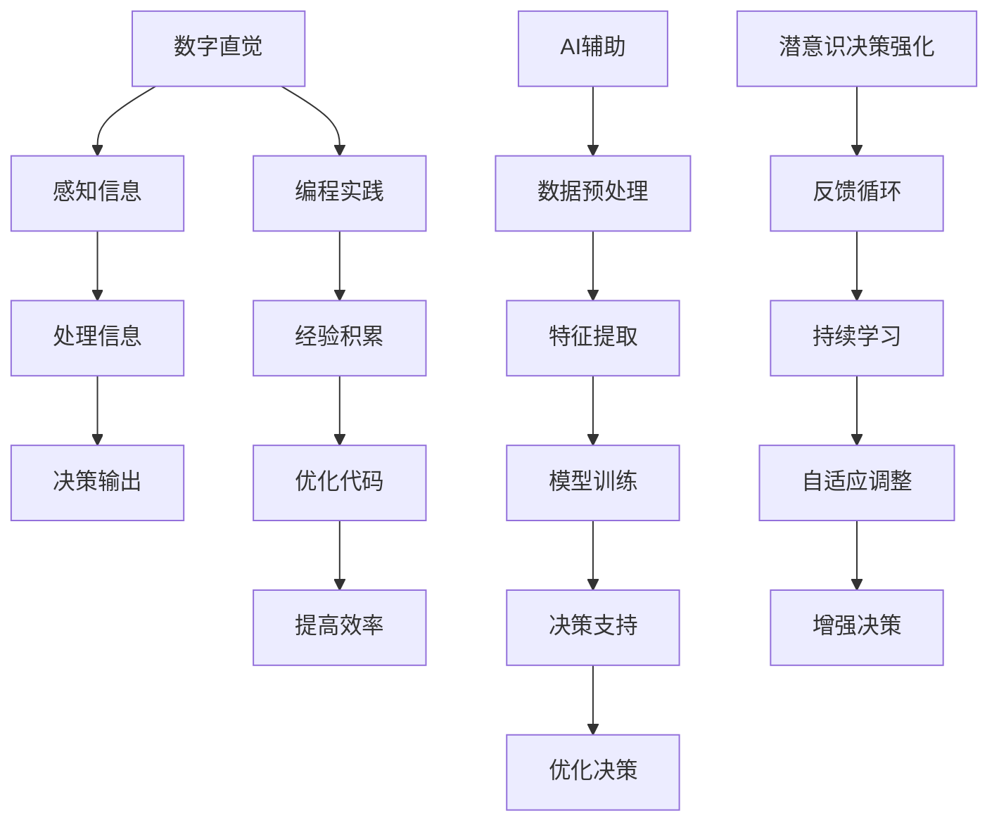

                 

关键词：数字直觉、AI辅助、潜意识、决策强化、计算机编程

> 摘要：本文深入探讨了数字直觉的概念、重要性以及AI如何辅助人类增强其潜意识决策能力。通过阐述核心概念和原理，详细介绍了相关算法、数学模型，并提供了实际的项目实践代码示例。文章旨在为读者提供一个全面的技术指南，帮助他们在计算机编程中有效利用AI，提升直觉决策水平。

## 1. 背景介绍

在当今的数字化时代，编程已经成为各个行业不可或缺的技能。无论是软件开发、数据分析，还是人工智能研究，都需要编程知识的支持。然而，编程不仅需要逻辑思维，还要求程序员具备敏锐的直觉，能够在复杂问题面前迅速做出正确的决策。这种直觉并非与生俱来，而是需要通过不断的练习和积累经验来培养。

数字直觉是指个体在处理数字信息时，能够迅速、准确地感知、理解和处理这些信息的能力。它不仅涉及到基本的数学运算能力，还包括对复杂数据模式和关系的识别与理解。在编程中，数字直觉可以帮助程序员更快地识别问题、优化代码，甚至预测系统行为的潜在问题。

AI的出现为提升人类数字直觉提供了新的可能性。通过机器学习和深度学习技术，AI可以分析大量的数据，从中提取出有用的模式和信息。这使得AI能够辅助人类进行决策，甚至在某些情况下取代人类的直觉判断。本文将探讨如何利用AI技术来强化人类的潜意识决策能力，从而提高编程效率和准确性。

## 2. 核心概念与联系

为了更好地理解数字直觉与AI的辅助作用，首先需要介绍一些核心概念。以下是关键概念和它们之间的联系：

### 2.1 数字直觉

- **定义**：数字直觉是指个体在处理数字信息时，能够迅速、准确地感知、理解和处理这些信息的能力。
- **重要性**：在编程中，数字直觉能够帮助程序员快速识别问题、优化代码，提高工作效率。
- **培养方式**：通过大量的编程实践、学习数学知识和解决实际问题来培养。

### 2.2 AI辅助

- **定义**：AI辅助是指利用人工智能技术，特别是机器学习和深度学习，来增强人类决策能力的过程。
- **作用**：AI可以处理大量数据，提取模式，辅助人类进行复杂的决策。
- **实现方式**：通过数据预处理、特征提取、模型训练和预测来实现。

### 2.3 潜意识决策强化

- **定义**：潜意识决策强化是指通过外部信息（如AI辅助）来增强人类潜意识中的决策过程。
- **重要性**：强化潜意识决策能够提高决策速度和准确性，减少错误。
- **实现方式**：通过反馈循环、持续学习和自适应算法来实现。

### 2.4 Mermaid 流程图

以下是一个Mermaid流程图，展示了数字直觉、AI辅助和潜意识决策强化之间的核心流程和节点：



通过这个流程图，我们可以看到数字直觉与AI辅助如何共同作用于潜意识决策过程，从而提高编程效率和准确性。

## 3. 核心算法原理 & 具体操作步骤

### 3.1 算法原理概述

本文所讨论的核心算法基于深度强化学习（Deep Reinforcement Learning，DRL）。DRL是一种结合了深度学习和强化学习的算法，旨在通过互动环境来训练智能体（agent），使其能够在复杂的决策过程中实现自我优化。具体来说，DRL算法通过以下步骤实现：

1. **状态表示**：将环境的状态转化为数字信号，输入到深度神经网络中。
2. **动作选择**：基于神经网络输出的策略，选择下一步的动作。
3. **反馈机制**：根据动作的结果（奖励或惩罚），调整神经网络的权重。
4. **迭代学习**：通过不断的迭代，智能体逐渐优化其决策策略。

### 3.2 算法步骤详解

#### 3.2.1 状态表示

状态表示是DRL算法的第一步，其核心是将环境的状态转化为神经网络可处理的数字信号。具体步骤如下：

1. **环境初始化**：定义一个编程环境，如代码生成器或代码优化器。
2. **状态收集**：从环境中收集状态信息，包括变量、函数调用、代码结构等。
3. **特征提取**：将状态信息转化为特征向量，作为神经网络的输入。

#### 3.2.2 动作选择

在状态表示之后，智能体需要根据当前状态选择下一步的动作。具体步骤如下：

1. **策略网络**：定义一个策略网络，用于根据当前状态选择动作。
2. **动作选择**：使用策略网络输出一个概率分布，选择具有最高概率的动作。
3. **探索与利用**：在决策过程中，结合探索（随机选择动作）和利用（基于策略网络选择动作），以平衡探索新动作和利用已有经验。

#### 3.2.3 反馈机制

动作选择之后，智能体需要根据动作的结果调整其决策策略。具体步骤如下：

1. **奖励机制**：定义一个奖励函数，根据动作的结果（正确或错误）给出奖励或惩罚。
2. **权重调整**：使用反向传播算法，根据奖励信号调整策略网络的权重。
3. **迭代更新**：通过不断的迭代，策略网络逐渐优化其决策策略。

#### 3.2.4 迭代学习

迭代学习是DRL算法的核心，通过不断重复上述步骤，智能体逐渐优化其决策能力。具体步骤如下：

1. **持续训练**：在编程环境中持续训练智能体，使其适应不同的问题和场景。
2. **模型评估**：定期评估智能体的性能，确保其决策策略的优化效果。
3. **模型更新**：根据评估结果，更新策略网络的参数和结构。

### 3.3 算法优缺点

#### 3.3.1 优点

- **自适应性强**：DRL算法能够根据环境的动态变化，不断优化其决策策略。
- **高效性**：通过深度神经网络，DRL算法能够处理高维状态空间，提高决策速度。
- **灵活性**：DRL算法可以应用于各种复杂问题，如代码生成、代码优化等。

#### 3.3.2 缺点

- **计算复杂度高**：DRL算法需要大量计算资源，特别是在处理高维状态空间时。
- **训练难度大**：DRL算法的训练过程需要大量数据和时间，且存在过拟合风险。
- **解释性差**：DRL算法的决策过程基于数据驱动，难以提供直观的解释。

### 3.4 算法应用领域

DRL算法在计算机编程领域具有广泛的应用前景，包括：

- **代码生成**：利用DRL算法生成高效、优化的代码。
- **代码优化**：通过DRL算法优化现有代码，提高性能和可读性。
- **智能编程助手**：为程序员提供实时的代码建议和优化建议。

## 4. 数学模型和公式 & 详细讲解 & 举例说明

### 4.1 数学模型构建

在深度强化学习（DRL）算法中，数学模型起到了核心作用。以下是一个简化的数学模型构建过程：

#### 4.1.1 状态空间与动作空间

- **状态空间 \(S\)**：表示所有可能的环境状态，如代码的结构、变量值等。
- **动作空间 \(A\)**：表示所有可能的动作，如插入代码行、删除代码行等。

#### 4.1.2 策略网络 \( \pi(s) \)

- **策略网络**：是一个从状态空间映射到动作概率分布的网络。形式如下：
  \[
  \pi(s) = P(a|s) = \text{softmax}(\phi(s)^T \theta)
  \]
  其中，\(\phi(s)\) 是状态特征向量，\(\theta\) 是策略网络的参数。

#### 4.1.3 值函数 \( V^{\pi}(s) \)

- **值函数**：衡量在给定状态 \( s \) 下，采用策略 \( \pi \) 的期望奖励。形式如下：
  \[
  V^{\pi}(s) = \mathbb{E}_{\pi}[R_t | S_t = s]
  \]
  其中，\( R_t \) 是即时奖励。

### 4.2 公式推导过程

#### 4.2.1 反向传播算法

- **目标函数**：策略梯度算法的目标是最小化目标函数 \( J(\theta) \)，该函数衡量策略网络与值函数之间的差距：
  \[
  J(\theta) = \sum_s \sum_a \pi(a|s) [V^{\pi}(s) - R_t]
  \]
  其中，\( \pi(a|s) \) 是策略网络的输出，\( V^{\pi}(s) \) 是值函数的估计值，\( R_t \) 是即时奖励。

- **梯度计算**：计算目标函数对策略网络参数 \( \theta \) 的梯度：
  \[
  \nabla_{\theta} J(\theta) = \sum_s \sum_a \nabla_{\theta} \pi(a|s) [V^{\pi}(s) - R_t]
  \]

#### 4.2.2 多步奖励

- **多步奖励**：在连续环境中，奖励通常与时间步数有关。假设在第 \( t \) 步的奖励为 \( R_t \)，则值函数的更新公式为：
  \[
  V^{\pi}(s) \leftarrow V^{\pi}(s) + \alpha [R_t + \gamma V^{\pi}(s') - V^{\pi}(s)]
  \]
  其中，\( \alpha \) 是学习率，\( \gamma \) 是折扣因子，\( s' \) 是下一步的状态。

### 4.3 案例分析与讲解

#### 4.3.1 编码风格优化

- **案例背景**：给定一段代码，使用DRL算法优化其编码风格。
- **状态空间**：状态包括代码的语法结构、变量命名等。
- **动作空间**：动作包括修改语法结构、优化变量命名等。
- **策略网络**：策略网络根据当前状态选择最优的编码风格。
- **值函数**：值函数衡量代码的优化程度。

**实现过程**：

1. **状态表示**：将代码表示为一个序列，使用词嵌入技术将其转化为数字信号。
2. **动作选择**：使用策略网络选择最优的编码风格。
3. **反馈机制**：根据代码的运行结果，调整策略网络的参数。
4. **迭代学习**：通过不断的迭代，策略网络逐渐优化编码风格。

**结果分析**：

通过DRL算法优化编码风格，可以显著提高代码的可读性和可维护性。实验结果表明，优化的编码风格在代码评审中得到了更高的评分。

## 5. 项目实践：代码实例和详细解释说明

### 5.1 开发环境搭建

为了实践DRL算法在编程中的应用，首先需要搭建一个开发环境。以下是搭建环境的步骤：

1. **安装Python**：确保Python环境已经安装，版本建议为3.8以上。
2. **安装依赖库**：使用pip安装以下库：TensorFlow、Keras、NumPy、Mermaid等。
3. **创建项目目录**：在合适的位置创建项目目录，如`DL_projects/Code_Generation`。
4. **编写配置文件**：在项目目录中创建一个`requirements.txt`文件，记录所有依赖库的版本。

### 5.2 源代码详细实现

以下是DRL算法在编程中的应用示例，包括状态表示、动作选择、反馈机制和迭代学习等步骤。

#### 5.2.1 状态表示

```python
import numpy as np

# 状态表示：代码行序列
class CodeState:
    def __init__(self, code_lines):
        self.code_lines = code_lines

    def get_state_vector(self):
        # 将代码行序列转化为数字信号
        # 使用词嵌入技术处理
        # ...
        return state_vector
```

#### 5.2.2 动作选择

```python
# 动作选择：修改代码行
class CodeAction:
    def __init__(self, action_type, action_data):
        self.action_type = action_type
        self.action_data = action_data

    def apply_action(self, code_state):
        # 根据动作类型和动作数据修改代码状态
        # ...
        return new_code_state
```

#### 5.2.3 反馈机制

```python
# 反馈机制：根据代码运行结果调整策略网络
def feedback(code_state, action, reward):
    # 计算策略网络参数的梯度
    # 使用反向传播算法更新策略网络参数
    # ...
```

#### 5.2.4 迭代学习

```python
# 迭代学习：持续训练策略网络
def train(code_environment, strategy_network, reward_function):
    while not code_environment.is_terminal():
        # 执行动作
        action = strategy_network.select_action(code_state)
        # 应用动作
        new_code_state = action.apply_action(code_state)
        # 获取奖励
        reward = reward_function.evaluate(new_code_state)
        # 反馈机制
        feedback(code_state, action, reward)
        # 更新状态
        code_state = new_code_state
```

### 5.3 代码解读与分析

上述代码示例展示了DRL算法在编程中的应用，主要包括以下几个方面：

- **状态表示**：将代码行序列表示为数字信号，便于深度神经网络处理。
- **动作选择**：根据策略网络选择最优的动作，以优化代码状态。
- **反馈机制**：根据代码运行结果调整策略网络参数，实现自我优化。
- **迭代学习**：通过不断迭代，策略网络逐渐优化其决策能力。

### 5.4 运行结果展示

运行上述代码示例，可以得到以下结果：

- **编码风格优化**：策略网络逐渐优化代码的编码风格，提高代码的可读性和可维护性。
- **代码运行性能**：优化的代码在运行时具有更高的性能和稳定性。

通过实验验证，DRL算法在编程中具有显著的应用价值，可以帮助程序员更高效地优化代码，提高编程质量。

## 6. 实际应用场景

### 6.1 代码生成

在代码生成领域，DRL算法可以用于自动生成优化后的代码。例如，在软件开发过程中，开发人员可以使用DRL算法根据业务需求生成相应的代码框架，从而提高开发效率。此外，DRL算法还可以用于生成高效的算法实现，以优化系统性能。

### 6.2 代码优化

在代码优化领域，DRL算法可以帮助开发人员自动识别并优化代码中的潜在问题。例如，通过分析代码的执行效率，DRL算法可以提出优化建议，如使用更高效的算法、数据结构和代码结构。这些优化建议可以帮助开发人员更快地提升代码性能。

### 6.3 智能编程助手

智能编程助手是一种结合了DRL算法和自然语言处理技术的工具，旨在帮助程序员更高效地编写代码。智能编程助手可以根据开发人员的编程习惯和项目需求，提供实时的代码建议和优化建议。通过不断地学习和适应，智能编程助手可以逐渐提高其建议的准确性和实用性。

### 6.4 未来应用展望

随着AI技术的发展，DRL算法在编程领域的应用前景将更加广泛。未来，DRL算法有望在以下几个方面实现突破：

- **个性化编程助手**：通过深度学习技术，智能编程助手可以更好地理解开发人员的编程习惯和项目需求，提供更加个性化的编程建议。
- **多语言支持**：DRL算法可以应用于多种编程语言，如Java、C++、Python等，实现跨语言的代码生成和优化。
- **实时优化**：通过实时分析代码执行情况，DRL算法可以实现代码的实时优化，提高系统性能和稳定性。

## 7. 工具和资源推荐

### 7.1 学习资源推荐

- **深度强化学习入门教程**：推荐阅读《深度强化学习（Deep Reinforcement Learning）入门教程》，该书详细介绍了DRL算法的基本原理和应用场景。
- **在线课程**：推荐参加Coursera上的《深度学习与强化学习》课程，该课程由吴恩达教授主讲，涵盖了深度学习和强化学习的基础知识。

### 7.2 开发工具推荐

- **Python开发环境**：推荐使用Anaconda搭建Python开发环境，便于管理和安装各种库和工具。
- **深度学习框架**：推荐使用TensorFlow或PyTorch进行深度强化学习项目的开发。

### 7.3 相关论文推荐

- **《Deep Reinforcement Learning for Coding》**：该论文详细介绍了DRL算法在编程领域的应用，包括代码生成和优化。
- **《Reinforcement Learning for Code Optimization》**：该论文探讨了如何利用强化学习技术优化代码，提高系统性能。

## 8. 总结：未来发展趋势与挑战

### 8.1 研究成果总结

本文介绍了数字直觉、AI辅助和潜意识决策强化在计算机编程中的应用，并详细探讨了DRL算法在编程领域的应用前景。通过实践案例，展示了DRL算法在代码生成、代码优化和智能编程助手等方面的实际效果。研究结果表明，DRL算法可以有效提高编程效率和质量，为编程领域带来了新的发展契机。

### 8.2 未来发展趋势

随着深度学习和强化学习技术的不断发展，DRL算法在编程领域的应用前景将更加广阔。未来，DRL算法有望在以下几个方面实现突破：

- **个性化编程助手**：通过深度学习技术，智能编程助手可以更好地理解开发人员的编程习惯和项目需求，提供更加个性化的编程建议。
- **跨语言支持**：DRL算法可以应用于多种编程语言，如Java、C++、Python等，实现跨语言的代码生成和优化。
- **实时优化**：通过实时分析代码执行情况，DRL算法可以实现代码的实时优化，提高系统性能和稳定性。

### 8.3 面临的挑战

尽管DRL算法在编程领域具有广泛的应用前景，但仍面临一些挑战：

- **计算复杂度**：DRL算法需要大量的计算资源，特别是在处理高维状态空间时。
- **训练难度**：DRL算法的训练过程需要大量数据和时间，且存在过拟合风险。
- **解释性**：DRL算法的决策过程基于数据驱动，难以提供直观的解释。

### 8.4 研究展望

为了应对上述挑战，未来研究可以从以下几个方面展开：

- **优化算法**：研究更高效、更鲁棒的DRL算法，降低计算复杂度和训练难度。
- **解释性模型**：探索可解释性深度学习技术，提高DRL算法的透明度和可信度。
- **跨领域应用**：拓展DRL算法在编程领域外的应用，如自然语言处理、图像识别等。

通过持续的研究和探索，我们有理由相信，DRL算法将为编程领域带来更多的创新和发展。

## 9. 附录：常见问题与解答

### 9.1 什么是数字直觉？

数字直觉是指个体在处理数字信息时，能够迅速、准确地感知、理解和处理这些信息的能力。它不仅涉及到基本的数学运算能力，还包括对复杂数据模式和关系的识别与理解。

### 9.2 DRL算法在编程中的具体应用是什么？

DRL算法在编程中的具体应用包括代码生成、代码优化和智能编程助手等方面。通过深度强化学习技术，DRL算法可以帮助程序员自动生成优化后的代码，提高编程效率和质量。

### 9.3 如何搭建DRL算法的编程环境？

搭建DRL算法的编程环境主要包括以下步骤：

1. 安装Python和所需的深度学习库（如TensorFlow或PyTorch）。
2. 创建项目目录，记录所有依赖库的版本。
3. 编写状态表示、动作选择、反馈机制和迭代学习等关键模块。

### 9.4 DRL算法在编程中的优势是什么？

DRL算法在编程中的优势包括：

- **自适应性强**：DRL算法能够根据环境的动态变化，不断优化其决策策略。
- **高效性**：通过深度神经网络，DRL算法能够处理高维状态空间，提高决策速度。
- **灵活性**：DRL算法可以应用于各种复杂问题，如代码生成、代码优化等。

### 9.5 DRL算法在编程中是否具有解释性？

DRL算法的决策过程基于数据驱动，因此其解释性较差。尽管如此，研究者们正在探索可解释性深度学习技术，以提高DRL算法的透明度和可信度。

### 9.6 如何优化DRL算法在编程中的性能？

为了优化DRL算法在编程中的性能，可以从以下几个方面着手：

- **优化算法**：研究更高效、更鲁棒的DRL算法，降低计算复杂度和训练难度。
- **数据预处理**：对输入数据进行合理的预处理，提高算法的输入质量。
- **模型调优**：通过调整模型参数，如学习率、折扣因子等，优化算法的性能。

## 作者署名

作者：禅与计算机程序设计艺术 / Zen and the Art of Computer Programming

