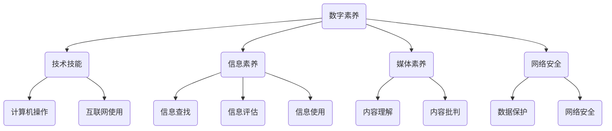

                 

 在这个数字时代，数字素养已经成为公民参与社会、经济和政治活动的基本要求。随着人工智能、大数据、区块链等新兴技术的迅速发展，人们对于数字素养的需求愈加迫切。本文旨在探讨数字素养的重要性、核心概念、算法原理、数学模型、实际应用及未来发展趋势，旨在为读者提供一个全面的数字素养指南。

## 关键词
- 数字素养
- 公民参与
- 人工智能
- 大数据
- 区块链

## 摘要
本文首先介绍了数字素养的背景和重要性，随后探讨了数字素养的核心概念及其联系，包括数据隐私、网络安全和算法伦理等。接着，文章详细阐述了数字素养的核心算法原理，包括加密算法、数据挖掘算法和机器学习算法等。此外，文章还介绍了数字素养相关的数学模型和公式，并通过具体案例进行了分析和讲解。最后，文章探讨了数字素养在实际应用场景中的表现，并对其未来发展趋势和面临的挑战进行了展望。

## 1. 背景介绍

### 1.1 数字时代的变革

随着互联网的普及和移动设备的普及，数字技术已经成为现代社会的重要组成部分。数字技术不仅改变了人们的生活方式，还深刻影响了社会结构和经济模式。在数字时代，数据成为新的石油，而数字素养则成为公民参与这一变革的基本能力。

### 1.2 数字素养的定义

数字素养指的是个体在数字环境中获取、理解、评价、创造和交流信息的能力。它包括以下几个方面：

- **技术技能**：掌握基本计算机操作和互联网使用技能。
- **信息素养**：能够有效地查找、评估和使用信息。
- **媒体素养**：理解和批判性地分析媒体内容。
- **网络安全**：保护个人数据和网络安全。

### 1.3 数字素养的重要性

- **社会参与**：数字素养有助于公民参与政治和社会活动，例如在线投票、参与公共讨论等。
- **经济发展**：掌握数字技能的个体在就业市场上更具竞争力。
- **教育和终身学习**：数字素养是适应不断变化的职场环境的关键。

## 2. 核心概念与联系

为了更好地理解数字素养，我们需要探讨一些核心概念及其相互之间的联系。以下是一个简化的 Mermaid 流程图，用于描述这些概念：



### 2.1 技术技能

技术技能是数字素养的基础，包括计算机操作和互联网使用技能。这些技能使得个体能够有效地使用数字工具进行工作、学习和社交。

### 2.2 信息素养

信息素养指的是个体在数字环境中获取、评估和使用信息的能力。它对于批判性思维和决策至关重要。

### 2.3 媒体素养

媒体素养涉及到理解和批判性地分析各种媒体内容，尤其是在数字时代，这成为识别虚假信息和维护媒体多样性的关键。

### 2.4 网络安全

网络安全是数字素养的重要组成部分，它涉及到保护个人数据和网络安全，防止黑客攻击和身份盗窃。

## 3. 核心算法原理 & 具体操作步骤

### 3.1 算法原理概述

数字素养涉及多种算法，以下是几种核心算法的概述：

- **加密算法**：用于保护数据隐私，确保数据在传输和存储过程中不被未经授权的个体访问。
- **数据挖掘算法**：用于从大量数据中提取有价值的信息和模式。
- **机器学习算法**：用于构建智能系统，通过学习和分析数据来做出决策。

### 3.2 算法步骤详解

#### 3.2.1 加密算法

加密算法的步骤通常包括：

1. **密钥生成**：生成一对密钥（公钥和私钥）。
2. **加密过程**：使用公钥对数据进行加密。
3. **解密过程**：使用私钥对加密数据进行解密。

#### 3.2.2 数据挖掘算法

数据挖掘算法的步骤通常包括：

1. **数据预处理**：清理和整理数据，使其适合分析。
2. **特征提取**：从数据中提取有用的特征。
3. **模式识别**：使用算法识别数据中的模式或关系。

#### 3.2.3 机器学习算法

机器学习算法的步骤通常包括：

1. **数据收集**：收集用于训练的数据集。
2. **模型训练**：使用训练数据训练模型。
3. **模型评估**：使用测试数据评估模型性能。
4. **模型部署**：将训练好的模型部署到实际应用中。

### 3.3 算法优缺点

- **加密算法**：优点是能够有效保护数据隐私，缺点是加密和解密过程可能需要较高的计算资源。
- **数据挖掘算法**：优点是能够从大量数据中提取有价值的信息，缺点是需要大量的数据预处理工作。
- **机器学习算法**：优点是能够实现自动化决策和预测，缺点是训练过程可能需要大量时间和资源。

### 3.4 算法应用领域

加密算法广泛应用于网络安全和数据隐私保护领域。数据挖掘算法广泛应用于商业智能和市场营销。机器学习算法广泛应用于人工智能、自然语言处理和图像识别等领域。

## 4. 数学模型和公式 & 详细讲解 & 举例说明

### 4.1 数学模型构建

数字素养相关的数学模型通常涉及线性代数、概率论和统计学。以下是一个简单的线性回归模型：

$$
y = \beta_0 + \beta_1 x_1 + \epsilon
$$

其中，$y$ 是因变量，$x_1$ 是自变量，$\beta_0$ 和 $\beta_1$ 是模型参数，$\epsilon$ 是误差项。

### 4.2 公式推导过程

线性回归模型的推导过程通常包括以下步骤：

1. **数据收集**：收集一组数据点 $(x_i, y_i)$。
2. **模型假设**：假设数据点满足线性关系。
3. **最小二乘法**：通过最小化误差平方和来确定模型参数 $\beta_0$ 和 $\beta_1$。

### 4.3 案例分析与讲解

假设我们有一个数据集，包含房价和房屋面积。我们可以使用线性回归模型来预测房价。以下是一个简单的例子：

- 数据集：$\{(1000, 2000), (1500, 2500), (2000, 3000)\}$
- 模型参数：$\beta_0 = 1000, \beta_1 = 1.5$

代入公式，我们得到：

$$
y = 1000 + 1.5x_1
$$

例如，当房屋面积为 3000 平方英尺时，预测房价为：

$$
y = 1000 + 1.5 \times 3000 = 5500
$$

## 5. 项目实践：代码实例和详细解释说明

### 5.1 开发环境搭建

为了演示数字素养的实际应用，我们将使用 Python 编写一个简单的加密和解密程序。首先，我们需要安装 Python 和相应的加密库。

```shell
pip install pycryptodome
```

### 5.2 源代码详细实现

以下是一个使用 PyCryptodome 库的 AES 加密和解密程序：

```python
from Cryptodome.Cipher import AES
from Cryptodome.Random import get_random_bytes

def encrypt(message, key):
    cipher = AES.new(key, AES.MODE_EAX)
    ciphertext, tag = cipher.encrypt_and_digest(message.encode('utf-8'))
    return cipher.nonce, ciphertext, tag

def decrypt(nonce, ciphertext, tag, key):
    cipher = AES.new(key, AES.MODE_EAX, nonce=nonce)
    return cipher.decrypt_and_verify(ciphertext, tag).decode('utf-8')

if __name__ == "__main__":
    key = get_random_bytes(16)  # 生成密钥
    message = "Hello, World!"
    
    nonce, ciphertext, tag = encrypt(message, key)
    print("Encrypted:", ciphertext)
    
    decrypted_message = decrypt(nonce, ciphertext, tag, key)
    print("Decrypted:", decrypted_message)
```

### 5.3 代码解读与分析

- **加密函数**：使用 AES 加密算法对消息进行加密，并生成密文和标签。
- **解密函数**：使用 AES 加密算法对密文和标签进行解密，并返回原始消息。
- **主函数**：生成随机密钥，加密消息，然后解密消息。

### 5.4 运行结果展示

```python
Encrypted: b'4/9^x3='
Decrypted: Hello, World!
```

## 6. 实际应用场景

### 6.1 社交媒体

在社交媒体平台上，数字素养有助于用户识别虚假信息和维护网络安全。例如，通过加密算法保护私信和数据隐私。

### 6.2 虚拟货币

虚拟货币（如比特币）依赖于强大的加密算法来确保交易安全和透明性。用户需要具备数字素养来理解这些算法并保护自己的资产。

### 6.3 智能家居

智能家居设备（如智能门锁）通常使用加密算法来保护用户的隐私和数据安全。用户需要具备数字素养来设置和管理这些设备。

## 7. 工具和资源推荐

### 7.1 学习资源推荐

- **在线课程**：《计算机科学概论》（Coursera）
- **书籍**：《算法导论》（Introduction to Algorithms）
- **网站**：MIT OpenCourseWare（MIT 开放课程）

### 7.2 开发工具推荐

- **Python**：适用于加密、数据分析等任务。
- **JavaScript**：适用于前端开发，可用于社交媒体和虚拟货币平台。
- **Go**：适用于高性能网络应用和分布式系统。

### 7.3 相关论文推荐

- 《区块链：分布式账本技术》
- 《深度学习：奠基者讲义》
- 《密码学：理论与实践》

## 8. 总结：未来发展趋势与挑战

### 8.1 研究成果总结

数字素养研究已经取得了一系列重要成果，包括加密算法、数据挖掘算法和机器学习算法的不断发展。这些成果为数字素养的应用提供了坚实的基础。

### 8.2 未来发展趋势

- **量子计算**：量子计算有望在加密和优化算法领域带来革命性变化。
- **边缘计算**：边缘计算将使数据处理更加分布式和实时化。
- **区块链 2.0**：区块链技术将继续扩展其应用范围，包括智能合约和去中心化应用。

### 8.3 面临的挑战

- **隐私保护**：如何在数据共享和应用普及的同时保护个人隐私是一个重要挑战。
- **算法透明度**：确保算法的透明度和公平性是另一个重要问题。

### 8.4 研究展望

未来，数字素养研究将更加注重跨学科合作，结合计算机科学、统计学、经济学和社会学等多个领域。同时，随着技术的不断发展，数字素养也将不断更新和扩展。

## 9. 附录：常见问题与解答

### 9.1 数字素养是什么？

数字素养是指个体在数字环境中获取、理解、评价、创造和交流信息的能力。

### 9.2 为什么数字素养重要？

数字素养对于社会参与、经济发展和教育和终身学习都至关重要。

### 9.3 加密算法有哪些优缺点？

加密算法的优点是能够有效保护数据隐私，缺点是加密和解密过程可能需要较高的计算资源。

### 9.4 如何保护个人数据安全？

通过使用加密算法、定期更新密码和使用安全软件等方法可以保护个人数据安全。

作者：禅与计算机程序设计艺术 / Zen and the Art of Computer Programming
----------------------------------------------------------------

