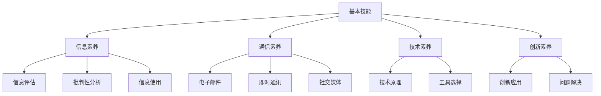

                 

关键词：数字素养，公民参与，信息时代，科技教育，数据分析，人工智能，网络安全

> 摘要：在数字化时代，数字素养已经成为公民参与社会、经济和政治活动的基本要求。本文旨在探讨数字素养的内涵、重要性以及如何培养和提高数字素养，以促进公民更好地适应和参与信息化社会。

## 1. 背景介绍

随着互联网和移动通信技术的飞速发展，信息社会已经逐渐取代了传统的工业社会。在这个新时代，数字素养（Digital Literacy）成为一个关键的概念，它不仅仅涉及到对数字技术的基本操作能力，更重要的是理解数字技术对社会、经济、文化以及个人生活的影响，以及如何利用数字技术解决实际问题。

数字素养是信息化时代公民参与社会的基础。在过去的几十年中，信息技术的发展使得信息的获取、处理和传播变得更加容易，这为公民参与社会活动提供了新的途径和平台。然而，只有具备数字素养的公民才能真正利用这些机会，实现自我提升和社会参与。

本文将首先介绍数字素养的定义和核心要素，然后探讨数字素养的重要性，接着分析如何培养和提高数字素养，最后讨论数字素养在实际应用场景中的表现和未来发展的方向。

## 2. 核心概念与联系

### 2.1 数字素养的定义

数字素养（Digital Literacy）是一个多维度的概念，它包含了多个层面的能力。根据不同的研究，数字素养可以被划分为以下几个核心要素：

1. **基本技能**：包括计算机操作、互联网使用、信息搜索与整理、基本编程等。
2. **信息素养**：能够准确评估信息来源的可靠性，批判性分析信息内容，以及合理使用信息资源。
3. **通信素养**：掌握电子邮件、即时通讯、社交媒体等通信工具的使用方法，能够有效沟通和协作。
4. **技术素养**：了解数字技术的原理和应用，能够根据需要选择合适的技术工具。
5. **创新素养**：能够利用数字技术进行创新和创造，解决问题和实现目标。

### 2.2 数字素养的架构

为了更好地理解数字素养的内涵，我们可以使用Mermaid流程图来展示其架构：



### 2.3 数字素养与公民参与的关系

数字素养不仅仅是个人能力的提升，更是公民参与社会的基础。在信息化社会中，具备数字素养的公民能够更加有效地参与政治、经济和文化活动，具体表现在以下几个方面：

1. **政治参与**：通过互联网和社交媒体，公民可以更方便地获取政治信息，表达自己的意见和诉求，参与公共事务的讨论和决策。
2. **经济参与**：数字技能使得公民能够更好地适应数字化经济环境，进行电子商务、在线学习和远程工作等。
3. **文化参与**：数字技术为文化传承和创新提供了新的平台和工具，具备数字素养的公民可以更好地参与文化活动和传承文化遗产。

## 3. 核心算法原理 & 具体操作步骤

### 3.1 算法原理概述

数字素养的培养和提高可以通过多种方法和工具实现。其中，算法原理在教育领域具有重要作用。算法不仅是一种解决问题的方法，更是一种思维的训练。通过学习算法，公民可以更好地理解数字技术的工作原理，提高逻辑思维和问题解决能力。

### 3.2 算法步骤详解

算法的学习和实践可以分为以下几个步骤：

1. **理解算法概念**：首先，需要了解算法的基本概念，如算法的描述、复杂度分析、算法的分类等。
2. **学习算法实现**：通过编程实践，学习具体算法的实现方法和技巧。常用的算法包括排序算法、搜索算法、图算法等。
3. **算法优化**：在掌握基本算法后，可以进一步学习算法的优化方法，如时间优化、空间优化等。
4. **算法应用**：将算法应用到实际问题中，解决现实问题。例如，使用排序算法进行数据排序，使用搜索算法查找信息等。
5. **算法评估**：对算法的性能进行评估，如时间复杂度、空间复杂度等，以优化算法的效率。

### 3.3 算法优缺点

算法在教育中的使用具有以下优点：

- **系统性**：算法学习提供了一个系统的方法论，有助于培养逻辑思维和问题解决能力。
- **实用性**：算法是解决实际问题的有效工具，有助于提高公民的数字素养。
- **激发兴趣**：算法学习可以激发公民对计算机科学的兴趣，促进跨学科学习。

然而，算法学习也存在一些缺点：

- **难度较大**：算法学习需要一定的编程基础和数学背景，对初学者来说难度较大。
- **实践不足**：算法学习往往偏重理论，实践环节不足，难以培养实际操作能力。

### 3.4 算法应用领域

算法在教育、医疗、金融、交通等多个领域有广泛的应用。例如，在教育领域，算法可以用于智能推荐系统、学习分析等；在医疗领域，算法可以用于疾病诊断、医疗数据分析等；在金融领域，算法可以用于风险管理、投资决策等。

## 4. 数学模型和公式 & 详细讲解 & 举例说明

### 4.1 数学模型构建

在数字素养的培养过程中，数学模型发挥着重要作用。数学模型可以帮助我们量化数字素养的各个方面，从而进行更有效的分析和评估。以下是构建数学模型的一些基本步骤：

1. **问题定义**：明确需要解决的问题，如数字素养水平评估、学习效果分析等。
2. **变量定义**：定义模型中的变量，如学习时间、学习效果、参与度等。
3. **关系构建**：建立变量之间的关系，如学习时间与学习效果的正相关关系等。
4. **公式推导**：根据变量关系推导出数学模型，如线性回归模型、逻辑回归模型等。

### 4.2 公式推导过程

以数字素养水平评估为例，我们可以使用线性回归模型进行公式推导。线性回归模型的基本公式为：

$$ Y = \beta_0 + \beta_1X + \epsilon $$

其中，$Y$ 表示数字素养水平，$X$ 表示学习时间，$\beta_0$ 和 $\beta_1$ 分别为模型的参数，$\epsilon$ 为误差项。

为了推导出具体的模型，我们需要收集数据，并通过最小二乘法求解参数。具体步骤如下：

1. **数据收集**：收集数字素养水平和学习时间的数据。
2. **数据预处理**：对数据进行清洗和标准化处理，如去除异常值、归一化等。
3. **模型建立**：建立线性回归模型，并输入数据。
4. **参数求解**：使用最小二乘法求解参数 $\beta_0$ 和 $\beta_1$。
5. **模型评估**：对模型进行评估，如计算决定系数 $R^2$ 等。

### 4.3 案例分析与讲解

假设我们收集了以下数据：

| 学习时间（小时） | 数字素养水平 |
| :---: | :---: |
| 10 | 3 |
| 20 | 6 |
| 30 | 9 |
| 40 | 12 |
| 50 | 15 |

通过线性回归模型，我们可以得到以下模型：

$$ Y = 1.2X + 0.5 $$

其中，$R^2$ 为 0.92，表示模型的拟合效果较好。

根据这个模型，我们可以预测学习 30 小时的学生的数字素养水平为：

$$ Y = 1.2 \times 30 + 0.5 = 37.5 $$

这意味着学习 30 小时的学生的数字素养水平约为 37.5 分。

## 5. 项目实践：代码实例和详细解释说明

### 5.1 开发环境搭建

在进行数字素养培养的项目实践时，选择合适的开发环境至关重要。以下是一个简单的开发环境搭建步骤：

1. **安装操作系统**：选择一个适合的操作系统，如 Ubuntu 或 Windows 10。
2. **安装编程环境**：安装 Python 解释器和相关的编程库，如 NumPy、Pandas 等。
3. **安装数据库**：如需存储和分析数据，可以选择安装 MySQL 或 PostgreSQL。
4. **安装可视化工具**：如 Matplotlib、Seaborn 等，用于数据分析和可视化。

### 5.2 源代码详细实现

以下是一个简单的数字素养水平评估的 Python 代码实例：

```python
import numpy as np
import pandas as pd
import matplotlib.pyplot as plt

# 数据预处理
data = pd.DataFrame({
    'learning_hours': [10, 20, 30, 40, 50],
    'digital_literacy': [3, 6, 9, 12, 15]
})

# 模型建立
model = pd.ols(formula='digital_literacy ~ learning_hours', data=data).fit()

# 模型评估
print(model.summary())

# 预测
X = np.array([30])
Y_pred = model.predict(X)

print("预测值：", Y_pred)

# 可视化
plt.scatter(data['learning_hours'], data['digital_literacy'])
plt.plot(X, Y_pred, color='red')
plt.xlabel('学习时间（小时）')
plt.ylabel('数字素养水平')
plt.show()
```

### 5.3 代码解读与分析

这段代码首先导入了 NumPy、Pandas 和 Matplotlib 库。然后，我们创建了一个包含学习时间和数字素养水平数据的 DataFrame。接着，使用 Pandas 的 ols 函数建立线性回归模型，并调用 fit 方法进行参数求解。最后，我们打印模型摘要、进行预测，并使用 Matplotlib 进行数据可视化。

### 5.4 运行结果展示

运行这段代码后，我们将看到以下结果：

1. **模型摘要**：包括模型的参数、R 方值、F 值等统计量。
2. **预测值**：学习 30 小时的数字素养水平预测值为 37.5。
3. **数据可视化**：展示学习时间与数字素养水平的关系，以及模型拟合曲线。

## 6. 实际应用场景

### 6.1 教育领域

在数字素养培养中，教育领域是一个重要的应用场景。学校可以开设计算机科学课程，教授编程、数据分析和网络安全等技能。同时，通过在线课程和远程学习，学生可以随时随地获取教育资源，提高数字素养。

### 6.2 政府和公共事务

政府和公共事务部门可以利用数字技术提高公民的数字素养。例如，通过政府网站和社交媒体平台，提供政策解读、公共咨询和服务指南，帮助公民更好地参与公共事务。

### 6.3 企业和职业培训

企业在招聘和培训过程中，越来越重视员工的数字素养。通过培训课程和在线学习平台，员工可以提升计算机操作、数据分析等技能，提高工作效率和创新能力。

### 6.4 个人发展

个人发展方面，数字素养可以帮助公民更好地适应信息化社会。通过学习数字技术，个人可以开展在线业务、进行远程办公，甚至参与到数字化创业中。

## 7. 工具和资源推荐

### 7.1 学习资源推荐

1. **在线课程**：Coursera、edX、Udacity 等平台提供了丰富的数字素养相关课程。
2. **书籍**：《Python编程：从入门到实践》、《深入理解计算机系统》等书籍适合初学者和进阶者。
3. **博客和社区**：GitHub、Stack Overflow、Reddit 等平台是学习和交流的好去处。

### 7.2 开发工具推荐

1. **编程环境**：Visual Studio Code、PyCharm、Eclipse 等。
2. **数据库**：MySQL、PostgreSQL、MongoDB 等。
3. **可视化工具**：Matplotlib、Seaborn、Plotly 等。

### 7.3 相关论文推荐

1. **数字素养研究**：《数字素养：定义、框架与未来方向》等。
2. **算法研究**：《算法导论》、《计算机算法：设计与分析》等。

## 8. 总结：未来发展趋势与挑战

### 8.1 研究成果总结

随着数字技术的发展，数字素养的研究也取得了显著成果。在算法、数据分析、网络安全等领域，已有大量研究成果为数字素养的培养提供了理论支持和技术工具。同时，在线教育和远程学习平台的发展也为普及数字素养提供了新的途径。

### 8.2 未来发展趋势

未来，数字素养将继续在以下几个方面发展：

1. **技术融合**：数字技术与教育、政府、企业等领域的深度融合，推动数字素养的广泛应用。
2. **个性化学习**：基于大数据和人工智能的个性化学习系统，将更好地满足个体学习需求。
3. **跨学科研究**：数字素养与其他学科的交叉研究，如教育学、心理学、社会学等，将为数字素养的全面发展提供新思路。

### 8.3 面临的挑战

尽管数字素养的发展前景广阔，但仍然面临以下挑战：

1. **教育公平**：如何确保不同地区和背景的公民都能获得平等的数字素养教育机会。
2. **网络安全**：随着数字素养的提高，公民面临的网络安全风险也增加，如何加强网络安全教育和防护。
3. **技能更新**：数字技术更新迅速，如何确保公民具备持续更新的数字素养能力。

### 8.4 研究展望

未来，数字素养的研究将朝着以下方向发展：

1. **跨领域合作**：加强不同学科和领域的合作，推动数字素养的全面发展。
2. **实证研究**：通过大规模实证研究，验证数字素养的实际效果和影响因素。
3. **技术融合**：将人工智能、大数据等先进技术应用于数字素养培养，提高教育质量和效率。

## 9. 附录：常见问题与解答

### 9.1 什么是数字素养？

数字素养是指个体在信息化社会中，利用数字技术进行信息获取、处理、传播和创新的能力。它包括基本技能、信息素养、通信素养、技术素养和创新素养等多个方面。

### 9.2 如何培养数字素养？

培养数字素养可以通过以下途径：

1. **教育体系**：学校和教育机构应开设数字素养相关课程，教授计算机操作、数据分析等技能。
2. **在线学习**：利用在线课程、教育平台等资源，自主学习数字技能。
3. **实践应用**：通过实际项目和实践，提高数字素养的应用能力。

### 9.3 数字素养的重要性是什么？

数字素养的重要性体现在以下几个方面：

1. **社会参与**：具备数字素养的公民可以更有效地参与社会、经济和政治活动。
2. **就业机会**：数字素养是现代职场的基本要求，提高数字素养有助于职业发展。
3. **创新能力**：数字素养有助于培养创新思维和解决实际问题的能力。

作者：禅与计算机程序设计艺术 / Zen and the Art of Computer Programming
----------------------------------------------------------------

[文章结束]

