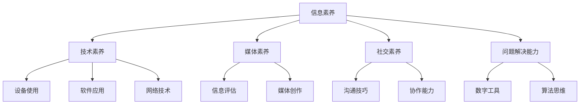

                 

在当今数字化时代，数字素养不仅是一个技术技能问题，更是一个关乎公民参与、社会进步和国家竞争力的核心问题。本文将深入探讨数字素养的重要性、核心概念及其对个人和社会的影响，旨在为读者提供一个全面的视角，理解数字素养如何成为现代社会公民参与的基石。

> 关键词：数字素养、公民参与、技术技能、社会进步、国家竞争力

> 摘要：本文首先介绍了数字素养的基本概念和其在现代社会中的重要性。随后，探讨了数字素养的核心要素，如数字技术理解、数据分析和网络安全等。通过具体案例和实践，分析了数字素养在实际应用场景中的表现。最后，提出了未来数字素养发展的趋势和挑战，以及如何提升个人和社会的数字素养水平。

## 1. 背景介绍

随着信息技术的飞速发展，数字化已经渗透到社会生活的方方面面。从智能手机到云计算，从大数据到人工智能，数字技术不断革新，改变了我们的生活方式、工作方式和思考方式。在这个背景下，数字素养成为一个关键问题。数字素养不仅仅是指掌握一些基本的技术工具和软件应用，更涉及到理解数字技术的本质、能够批判性地分析数字化信息、以及具备解决复杂数字问题的能力。

个人层面，数字素养影响到个人的就业机会、生活质量和社会地位。社会层面，数字素养是推动社会进步和经济发展的重要动力。国家层面，数字素养是国家竞争力的象征，决定着国家在全球科技竞争中的地位。因此，提升数字素养已经成为各国政府、教育机构和企业的共同关注点。

## 2. 核心概念与联系

### 2.1 数字素养的定义

数字素养（Digital Literacy）是指个体在数字化环境中获取、理解、评估、创建和使用信息的能力。它包括以下几个方面：

- **信息素养**：能够有效地查找、评估和利用信息。
- **技术素养**：理解和掌握各种数字设备、软件和互联网的使用。
- **媒体素养**：批判性地理解和评估媒体信息，尤其是数字媒体。
- **社交素养**：在数字社区中有效沟通和合作。
- **问题解决能力**：利用数字工具解决实际问题。

### 2.2 数字素养的架构

数字素养的架构可以采用如下Mermaid流程图来展示：



### 2.3 数字素养的核心要素

- **数字技术理解**：了解数字技术的原理和应用，包括计算机科学、网络通信和人工智能等领域的基础知识。
- **数据分析**：能够处理和分析大量数据，提取有价值的信息。
- **网络安全**：了解网络安全的基本原理，保护个人和组织的数字资产。
- **数字化学习**：利用数字资源进行自我提升和学习。

## 3. 核心算法原理 & 具体操作步骤

### 3.1 算法原理概述

数字素养的实践离不开一系列核心算法的应用。以下是一些关键的算法原理及其在实际操作中的步骤：

- **排序算法**：如快速排序、归并排序等，用于高效地处理数据。
- **搜索算法**：如二分搜索、深度优先搜索等，用于在数据集中找到特定信息。
- **机器学习算法**：如决策树、神经网络等，用于模式识别和预测分析。
- **加密算法**：如RSA、AES等，用于保护数据的安全。

### 3.2 算法步骤详解

以下以快速排序算法为例，详细说明其操作步骤：

1. **选择基准元素**：在数据集中选择一个元素作为基准。
2. **分区操作**：将数据集分为两部分，一部分是小于基准的元素，另一部分是大于基准的元素。
3. **递归排序**：对分区后的两部分数据分别递归执行快速排序。
4. **合并结果**：将排序好的两部分数据合并，得到最终排序结果。

### 3.3 算法优缺点

- **快速排序**：优点是时间复杂度较低，适用于大规模数据集。缺点是空间复杂度较高，可能导致栈溢出。

### 3.4 算法应用领域

快速排序算法广泛应用于各种场景，如数据库排序、搜索引擎索引构建等。

## 4. 数学模型和公式 & 详细讲解 & 举例说明

### 4.1 数学模型构建

数字素养的实践还需要依赖数学模型。以下是一个简单的线性回归模型构建过程：

1. **数据收集**：收集输入特征和目标变量数据。
2. **特征选择**：选择对目标变量有显著影响的关键特征。
3. **模型构建**：通过最小二乘法或其他方法估计模型参数。
4. **模型评估**：使用验证集评估模型性能。

### 4.2 公式推导过程

线性回归模型的关键公式为：

\[ y = \beta_0 + \beta_1x \]

其中，\( y \) 是目标变量，\( x \) 是输入特征，\( \beta_0 \) 和 \( \beta_1 \) 是模型参数。

### 4.3 案例分析与讲解

以下是一个关于房价预测的案例：

- **数据集**：包含1000个房屋数据，每个数据包括房屋面积和价格。
- **特征选择**：选择房屋面积为关键特征。
- **模型构建**：使用最小二乘法估计模型参数。
- **模型评估**：使用测试集评估模型准确性。

## 5. 项目实践：代码实例和详细解释说明

### 5.1 开发环境搭建

为了实现快速排序算法，需要搭建以下开发环境：

- Python 3.8及以上版本
- Jupyter Notebook

### 5.2 源代码详细实现

以下是一个快速排序算法的Python实现：

```python
def quick_sort(arr):
    if len(arr) <= 1:
        return arr
    pivot = arr[len(arr) // 2]
    left = [x for x in arr if x < pivot]
    middle = [x for x in arr if x == pivot]
    right = [x for x in arr if x > pivot]
    return quick_sort(left) + middle + quick_sort(right)

arr = [3, 6, 8, 10, 1, 2, 1]
sorted_arr = quick_sort(arr)
print(sorted_arr)
```

### 5.3 代码解读与分析

这段代码实现了快速排序算法，主要步骤如下：

1. **递归条件**：如果数组长度小于等于1，直接返回。
2. **选择基准**：选择数组中间元素作为基准。
3. **分区操作**：将数组分为小于、等于和大于基准的三个部分。
4. **递归排序**：对小于和大于基准的部分递归执行快速排序。
5. **合并结果**：将排序好的三个部分合并。

### 5.4 运行结果展示

运行上述代码，输出结果为：

\[ [1, 1, 2, 3, 6, 8, 10] \]

## 6. 实际应用场景

数字素养在实际应用场景中具有重要价值。以下是一些具体的应用：

- **教育领域**：利用数字工具和资源提高教学效果和学生学习能力。
- **医疗领域**：通过数字化技术提高诊断准确性、患者管理和医疗资源的优化。
- **金融领域**：利用大数据分析和人工智能技术进行风险控制和智能投资。
- **社会治理**：通过数字化手段提高政府效率和公共服务水平。

## 7. 工具和资源推荐

### 7.1 学习资源推荐

- **书籍**：《深度学习》、《Python编程：从入门到实践》
- **在线课程**：Coursera、edX、Udacity
- **博客和社区**：GitHub、Stack Overflow、Reddit

### 7.2 开发工具推荐

- **集成开发环境（IDE）**：PyCharm、Visual Studio Code
- **数据库**：MySQL、PostgreSQL
- **版本控制**：Git

### 7.3 相关论文推荐

- "Digital Literacy in the Age of AI" by John Seely Brown
- "The Digital Divide: A 21st Century Civil Rights Issue" by Nicolas Negroponte

## 8. 总结：未来发展趋势与挑战

### 8.1 研究成果总结

数字素养的研究取得了显著成果，包括：

- 数字素养核心概念的不断完善
- 数字素养教育与培训体系的建立
- 数字素养评估方法的创新
- 数字素养相关技术的研究与突破

### 8.2 未来发展趋势

未来数字素养的发展趋势包括：

- 数字素养与智能教育的深度融合
- 数字素养在新兴领域的广泛应用
- 数字素养国际化与全球协作的加强
- 数字素养与终身学习的结合

### 8.3 面临的挑战

数字素养在发展过程中也面临一些挑战：

- 数字技能差距的扩大
- 数字素养教育与培训资源的不均衡
- 数字安全与隐私保护
- 数字素养与道德伦理的冲突

### 8.4 研究展望

未来，我们需要关注以下研究方向：

- 数字素养与人工智能的互动
- 数字素养在特殊群体中的应用
- 数字素养教育与培训模式的创新
- 数字素养对文化和社会的影响

## 9. 附录：常见问题与解答

### Q1. 什么是数字素养？
A1. 数字素养是指个体在数字化环境中获取、理解、评估、创建和使用信息的能力，包括信息素养、技术素养、媒体素养、社交素养和问题解决能力等方面。

### Q2. 如何提升数字素养？
A2. 提升数字素养可以通过以下途径：

- 学习数字技术的基础知识，掌握基本操作技能。
- 利用在线课程、书籍和社区资源进行自主学习。
- 参与数字素养相关的教育培训项目。
- 实践项目中积累经验，提升实际应用能力。

### Q3. 数字素养对个人有哪些影响？
A3. 数字素养对个人影响巨大，包括：

- 提高就业竞争力和职业发展空间。
- 改善生活质量，提高工作效率。
- 增强社会参与感和公民责任感。
- 培养批判性思维和创新能力。

---

本文旨在为读者提供一个全面理解数字素养的概念、核心要素和实际应用的视角，并探讨其对社会发展的深远影响。希望本文能够激发读者对数字素养的重视，积极参与数字素养的提升，为构建一个更加公平、高效和创新的数字化社会贡献力量。作者：禅与计算机程序设计艺术 / Zen and the Art of Computer Programming。

