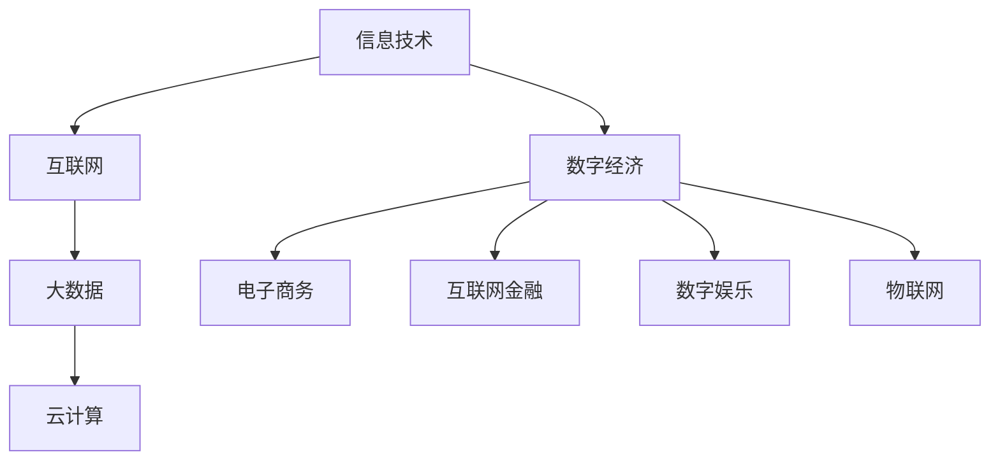

                 

 在当今全球化的时代，数字经济的兴起已成为不可逆转的趋势，它不仅改变了我们的生活方式，更为社会的全面发展提供了强大的动力。本文将深入探讨数字经济的内涵、核心概念、算法原理、数学模型、项目实践、应用场景以及未来展望，旨在揭示数字经济作为社会发展的助推器的深远影响。

## 文章关键词

- 数字经济
- 社会发展
- 推动力量
- 算法原理
- 数学模型
- 应用场景
- 未来展望

## 文章摘要

本文将系统性地阐述数字经济的概念，剖析其在现代社会发展中的作用。通过介绍数字经济的核心算法原理、数学模型，结合实际项目实践，分析其在不同领域的应用，并对未来发展趋势进行展望，探讨数字经济面临的挑战与机遇。文章旨在为读者提供一个全面、深入的了解，帮助人们更好地把握数字经济的发展脉络。

## 1. 背景介绍

### 1.1 数字经济的概念

数字经济是指以数字化的信息和知识为关键生产因素，以现代信息网络为重要载体，以信息通信技术的有效利用为驱动，推动经济结构和经济活动不断优化升级的过程。它包括电子商务、互联网金融、数字娱乐、物联网等多个领域。

### 1.2 数字经济的重要性

数字经济已成为现代社会的重要组成部分，其对经济增长的贡献不可忽视。首先，数字经济促进了信息的快速传播和资源的有效配置，提升了生产效率。其次，数字经济创造了新的商业模式和就业机会，推动了产业结构升级。最后，数字经济有助于提升社会整体创新能力和国际竞争力。

## 2. 核心概念与联系

### 2.1 数字经济的核心概念

- 信息技术：信息技术的不断进步是数字经济发展的基石。
- 互联网：互联网的普及和普及为数字经济提供了基础设施。
- 大数据：大数据为数字经济提供了丰富的数据资源。
- 云计算：云计算为数字经济提供了弹性和可扩展的计算资源。

### 2.2 数字经济架构图（使用Mermaid绘制）



### 2.3 数字经济与信息技术、互联网、大数据、云计算的关系

- 信息技术为数字经济提供了技术支持，包括软件开发、网络安全等。
- 互联网作为信息传输的载体，使得数字经济得以迅速扩展。
- 大数据为数字经济提供了丰富的数据资源，支持数据分析和决策。
- 云计算提供了强大的计算能力和存储资源，支撑数字经济的运行。

## 3. 核心算法原理 & 具体操作步骤

### 3.1 算法原理概述

数字经济的核心算法主要包括数据挖掘、机器学习和人工智能算法。这些算法通过处理和分析大量数据，帮助企业和组织做出更准确的决策，优化业务流程。

### 3.2 算法步骤详解

1. 数据收集：收集来自不同来源的数据，如电子商务平台、社交媒体、传感器等。
2. 数据预处理：对数据进行清洗、归一化、去噪等操作，使其适合后续分析。
3. 特征提取：从数据中提取有用的特征，用于训练模型。
4. 模型训练：使用机器学习算法对特征进行训练，建立预测模型。
5. 模型评估：评估模型的准确性和性能，并进行优化。
6. 模型应用：将训练好的模型应用于实际业务场景，如推荐系统、风险评估等。

### 3.3 算法优缺点

- 优点：高效的数据处理能力，准确的预测结果，灵活的模型应用。
- 缺点：数据隐私和安全问题，模型过拟合风险，计算资源需求大。

### 3.4 算法应用领域

- 电子商务：个性化推荐、用户行为分析、欺诈检测等。
- 金融：信用评估、风险控制、市场预测等。
- 健康医疗：疾病预测、个性化治疗、药物研发等。
- 教育：学习行为分析、课程推荐、考试评分等。

## 4. 数学模型和公式 & 详细讲解 & 举例说明

### 4.1 数学模型构建

数字经济的数学模型主要包括线性回归、决策树、神经网络等。这些模型通过数学公式来描述数据之间的关系。

### 4.2 公式推导过程

以线性回归模型为例，其公式推导过程如下：

- 假设自变量为 \( x \)，因变量为 \( y \)。
- 线性回归模型： \( y = \beta_0 + \beta_1 x + \epsilon \)，其中 \( \beta_0 \) 和 \( \beta_1 \) 为模型参数，\( \epsilon \) 为误差项。
- 模型推导：通过最小二乘法求解模型参数，使得实际值 \( y \) 与预测值 \( \hat{y} \) 之间的误差平方和最小。

### 4.3 案例分析与讲解

#### 案例背景

某电商平台希望通过分析用户购买历史数据，预测用户的下一次购买行为。

#### 模型构建

- 自变量：用户购买历史数据，包括购买频率、购买金额等。
- 因变量：下一次购买行为，是否购买。

#### 模型训练

- 使用线性回归模型进行训练。
- 模型公式：\( y = \beta_0 + \beta_1 x + \epsilon \)。
- 模型参数：通过最小二乘法求解。

#### 模型评估

- 评估指标：预测准确率、召回率、F1 分数等。
- 模型优化：根据评估结果调整模型参数，提升预测效果。

## 5. 项目实践：代码实例和详细解释说明

### 5.1 开发环境搭建

- 使用 Python 语言和 TensorFlow 深度学习框架进行开发。
- 安装必要的依赖库，如 NumPy、Pandas、Scikit-learn 等。

### 5.2 源代码详细实现

```python
import numpy as np
import pandas as pd
from sklearn.linear_model import LinearRegression
from sklearn.model_selection import train_test_split
from sklearn.metrics import accuracy_score

# 数据加载与预处理
data = pd.read_csv('data.csv')
X = data[['purchase_frequency', 'purchase_amount']]
y = data['next_purchase']

# 数据划分
X_train, X_test, y_train, y_test = train_test_split(X, y, test_size=0.2, random_state=42)

# 模型训练
model = LinearRegression()
model.fit(X_train, y_train)

# 模型评估
y_pred = model.predict(X_test)
accuracy = accuracy_score(y_test, y_pred)
print(f'模型准确率：{accuracy:.2f}')

# 模型应用
new_data = np.array([[10, 100]])
new_prediction = model.predict(new_data)
print(f'新数据预测结果：{new_prediction[0]}')
```

### 5.3 代码解读与分析

- 数据加载与预处理：使用 Pandas 库读取数据，并进行必要的预处理操作，如数据清洗、特征提取等。
- 数据划分：将数据划分为训练集和测试集，用于模型训练和评估。
- 模型训练：使用线性回归模型进行训练，通过最小二乘法求解模型参数。
- 模型评估：使用测试集评估模型性能，计算预测准确率。
- 模型应用：将训练好的模型应用于新数据，进行预测。

## 6. 实际应用场景

### 6.1 电子商务

- 个性化推荐：基于用户购买历史，为用户提供个性化的商品推荐。
- 欺诈检测：识别并防范购物平台的欺诈行为。
- 用户行为分析：分析用户行为，优化电商平台运营策略。

### 6.2 金融

- 信用评估：预测借款人的信用风险，为金融机构提供决策支持。
- 风险控制：监控金融市场，防范系统性风险。
- 市场预测：分析市场数据，预测未来市场走势。

### 6.3 健康医疗

- 疾病预测：基于患者数据，预测患者可能患有的疾病。
- 个性化治疗：根据患者数据，为患者提供个性化的治疗方案。
- 药物研发：分析药物数据，加速新药研发进程。

### 6.4 教育

- 学习行为分析：分析学生学习行为，为教育机构提供教学改进建议。
- 课程推荐：根据学生学习情况，为学习者推荐合适的课程。
- 考试评分：基于学生答题情况，为考试评分提供参考。

## 7. 工具和资源推荐

### 7.1 学习资源推荐

- 《Python机器学习》（作者：塞巴斯蒂安·拉斯塔尼）
- 《深度学习》（作者：伊恩·古德费洛、约书亚·本吉奥、亚伦·库维尔）
- 《大数据之路：阿里巴巴大数据实践》（作者：李强）

### 7.2 开发工具推荐

- Jupyter Notebook：用于数据分析和可视化。
- TensorFlow：用于深度学习模型训练。
- PyCharm：用于 Python 代码开发。

### 7.3 相关论文推荐

- “Deep Learning for Text Classification”（作者：Yoon Kim）
- “User Behavior Analysis in E-commerce: A Survey”（作者：Xu, Z., & Chen, H.”）
- “Application of Machine Learning in Healthcare”（作者：Swan, A. J.）

## 8. 总结：未来发展趋势与挑战

### 8.1 研究成果总结

数字经济在近年来取得了显著的研究成果，包括数据挖掘、机器学习、人工智能等领域的突破。这些成果为数字经济的发展提供了强大的技术支持。

### 8.2 未来发展趋势

- 数据驱动：数据将成为数字经济的重要驱动力，推动业务创新和决策优化。
- 人工智能：人工智能将进一步融入数字经济，提升自动化和智能化水平。
- 跨界融合：数字经济与其他行业的融合将加速，推动产业升级和社会进步。

### 8.3 面临的挑战

- 数据安全：随着数据规模的扩大，数据安全和隐私保护将面临更大挑战。
- 技术壁垒：高水平的算法和模型训练技术将成为企业竞争的关键。
- 法规监管：数字经济的快速发展需要完善的法律法规体系来保障其健康发展。

### 8.4 研究展望

数字经济作为社会发展的助推器，未来将继续发挥重要作用。研究者应关注数据安全、人工智能、跨界融合等前沿领域，推动数字经济的发展。同时，政策制定者应加强对数字经济的监管，确保其健康、可持续地发展。

## 9. 附录：常见问题与解答

### 9.1 数字经济是什么？

数字经济是指以数字化的信息和知识为关键生产因素，以现代信息网络为重要载体，以信息通信技术的有效利用为驱动，推动经济结构和经济活动不断优化升级的过程。

### 9.2 数字经济的重要性有哪些？

数字经济的重要性主要体现在以下几个方面：提高生产效率、创造新就业机会、促进产业升级、提升国际竞争力等。

### 9.3 数字经济与实体经济的关系如何？

数字经济与实体经济相互依存、相互促进。数字经济为实体经济提供了新的发展动力，而实体经济的健康发展也为数字经济的持续发展提供了坚实基础。

### 9.4 如何保障数据安全与隐私？

保障数据安全与隐私需要从技术和管理两个层面进行。技术层面包括数据加密、访问控制、安全审计等；管理层面包括制定相关法律法规、加强企业内部数据安全管理、提高公众数据安全意识等。

---

**作者：禅与计算机程序设计艺术 / Zen and the Art of Computer Programming**

