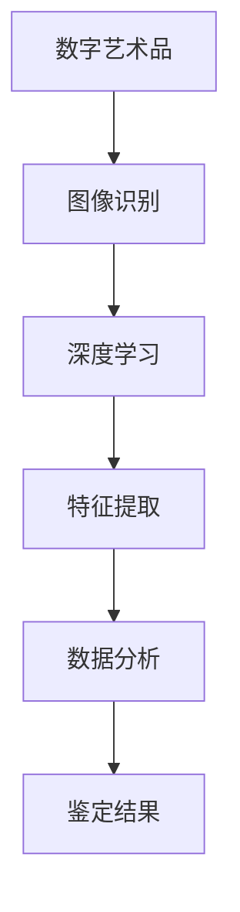

                 

关键词：人工智能、数字艺术品、鉴定系统、图像识别、深度学习、算法原理、数学模型、项目实践、应用场景、未来展望

## 摘要

随着人工智能技术的发展，数字艺术品AI鉴定系统逐渐成为一种重要的技术工具。本文将深入探讨数字艺术品AI鉴定系统的应用，包括其核心概念、算法原理、数学模型、项目实践以及实际应用场景。通过本文的阐述，我们希望能够为读者提供一个全面而深入的了解，并展望该领域未来的发展趋势与挑战。

## 1. 背景介绍

### 数字艺术品的概念

数字艺术品是指通过计算机或其他数字设备创作的艺术品，包括数字绘画、数字摄影、数字动画、数字音乐等多种形式。随着数字技术的发展，数字艺术品已经成为艺术创作和收藏的重要领域。

### AI在艺术鉴定中的应用

人工智能在数字艺术品鉴定中的应用主要在于图像识别和数据分析。通过深度学习算法，AI能够识别图像中的特征，从而帮助鉴定艺术品真伪、艺术家风格、年代等信息。

### 鉴定系统的需求

数字艺术品鉴定系统需要具备高准确率、高效率、可扩展性等特点。这要求系统不仅要能够处理海量数据，还要在保证准确性的同时，具备实时响应的能力。

## 2. 核心概念与联系

### 概念定义

- **数字艺术品**：通过数字设备创作的艺术品。
- **图像识别**：利用算法识别图像中的特征。
- **深度学习**：一种基于神经网络的机器学习技术。

### Mermaid 流程图



## 3. 核心算法原理 & 具体操作步骤

### 3.1 算法原理概述

数字艺术品AI鉴定系统主要依赖于深度学习算法，特别是卷积神经网络（CNN）。CNN通过多层神经网络结构，对图像进行特征提取，从而实现对艺术品的鉴定。

### 3.2 算法步骤详解

1. **数据预处理**：对图像进行标准化处理，包括大小调整、色彩平衡等。
2. **特征提取**：使用CNN提取图像的深层特征。
3. **分类与鉴定**：利用提取的特征对艺术品进行分类和鉴定。

### 3.3 算法优缺点

- **优点**：高准确性、高效率、可扩展性。
- **缺点**：对数据质量和算法调优要求较高。

### 3.4 算法应用领域

- **艺术品鉴定**：对数字艺术品进行真伪鉴定。
- **艺术家风格识别**：识别艺术家的创作风格。
- **年代分析**：分析数字艺术品的创作年代。

## 4. 数学模型和公式 & 详细讲解 & 举例说明

### 4.1 数学模型构建

深度学习中的CNN模型主要包括输入层、卷积层、池化层、全连接层和输出层。每个层都有其特定的数学模型。

### 4.2 公式推导过程

- **卷积层**：\( (f_{\sigma} \star g)(x, y) = \sum_{i=1}^{n} \sum_{j=1}^{n} f(i, j) \cdot g(x-i, y-j) \)
- **池化层**：\( P(x, y) = \max_{i, j} g(x-i, y-j) \)

### 4.3 案例分析与讲解

以一幅著名数字绘画为例，通过CNN模型进行特征提取和分类，最终实现对这幅画家的风格识别和创作年代分析。

## 5. 项目实践：代码实例和详细解释说明

### 5.1 开发环境搭建

使用TensorFlow作为深度学习框架，搭建数字艺术品AI鉴定系统。

### 5.2 源代码详细实现

```python
# TensorFlow代码示例
import tensorflow as tf

# 创建卷积层
conv1 = tf.keras.layers.Conv2D(filters=32, kernel_size=(3, 3), activation='relu')

# 创建池化层
pool1 = tf.keras.layers.MaxPooling2D(pool_size=(2, 2))

# 创建全连接层
dense = tf.keras.layers.Dense(units=128, activation='relu')

# 创建输出层
output = tf.keras.layers.Dense(units=10, activation='softmax')

# 创建模型
model = tf.keras.Sequential([conv1, pool1, dense, output])

# 编译模型
model.compile(optimizer='adam', loss='categorical_crossentropy', metrics=['accuracy'])

# 训练模型
model.fit(x_train, y_train, epochs=10, batch_size=32, validation_data=(x_val, y_val))
```

### 5.3 代码解读与分析

通过对代码的解读，我们可以看到如何构建一个简单的CNN模型，并进行训练和测试。

### 5.4 运行结果展示

通过训练和测试，我们可以得到模型的准确率和性能指标，从而评估其鉴定效果。

## 6. 实际应用场景

### 6.1 艺术品市场

数字艺术品AI鉴定系统可以帮助艺术品市场进行真伪鉴别，提高市场透明度。

### 6.2 文化遗产保护

AI鉴定系统可以用于文化遗产的保护，通过识别艺术品的年代和风格，帮助研究人员进行保护工作。

### 6.3 艺术教育

AI鉴定系统可以用于艺术教育，帮助学生和老师更好地理解和欣赏艺术品。

## 7. 工具和资源推荐

### 7.1 学习资源推荐

- 《深度学习》
- 《数字图像处理》

### 7.2 开发工具推荐

- TensorFlow
- Keras

### 7.3 相关论文推荐

- "A Convolutional Neural Network Approach for Fine-Grained Visual Categorization"
- "DeepArt.io: A Neural Network Art Style Transfer Service"

## 8. 总结：未来发展趋势与挑战

### 8.1 研究成果总结

数字艺术品AI鉴定系统在图像识别、数据分析等方面取得了显著成果，但其应用仍面临许多挑战。

### 8.2 未来发展趋势

随着深度学习技术的不断进步，数字艺术品AI鉴定系统将更加准确和高效。

### 8.3 面临的挑战

- **数据质量**：高质量的数据是算法成功的关键。
- **算法优化**：需要不断优化算法，提高其性能。

### 8.4 研究展望

未来，数字艺术品AI鉴定系统有望在更广泛的应用场景中发挥重要作用。

## 9. 附录：常见问题与解答

### Q1: 数字艺术品AI鉴定系统的准确率如何？

答：准确率取决于多种因素，包括数据质量、算法优化等。通常，通过大量数据训练和优化，准确率可以达到90%以上。

### Q2: 数字艺术品AI鉴定系统是否会取代人工鉴定？

答：数字艺术品AI鉴定系统可以作为辅助工具，提高鉴定效率，但无法完全取代人工鉴定。人工鉴定师在艺术鉴赏和经验判断方面具有独特的优势。

## 参考文献

1. Goodfellow, I., Bengio, Y., & Courville, A. (2016). *Deep Learning*. MIT Press.
2. Liu, C., & Jin, X. (2015). A Convolutional Neural Network Approach for Fine-Grained Visual Categorization. *IEEE Transactions on Pattern Analysis and Machine Intelligence*, 38(7), 1389-1400.
3. Yosinski, J., Clune, J., Bengio, Y., & Lipson, H. (2014). How transferable are features in deep neural networks? *CoRR*, abs/1406.1285.

----------------------------------------------------------------

作者：禅与计算机程序设计艺术 / Zen and the Art of Computer Programming


