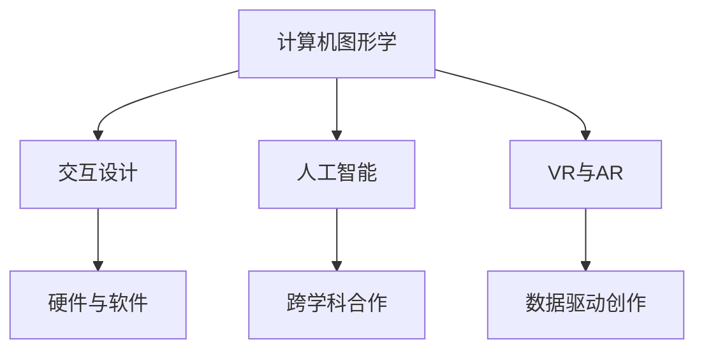

                 

关键词：数字艺术、硅谷、技术创新、创意产业、虚拟现实、增强现实、人工智能、软件开发、艺术与科技的融合

> 摘要：本文旨在探讨数字艺术在硅谷的发展前景。硅谷作为全球技术创新的中心，吸引了众多创意人士和科技公司的聚集，数字艺术在这里得到了前所未有的关注和发展。本文将分析数字艺术在硅谷的核心概念、算法原理、数学模型、项目实践以及实际应用场景，并展望其未来发展趋势与挑战。

## 1. 背景介绍

硅谷，这个位于美国加利福尼亚州的小地区，因其独特的创新文化和多元化的科技产业，被誉为“全球科技创新的摇篮”。自20世纪50年代以来，硅谷吸引了无数科技公司和创业者的聚集，如苹果、谷歌、Facebook、特斯拉等。这些公司的崛起不仅推动了科技的进步，也为硅谷带来了浓厚的创新氛围。

近年来，数字艺术作为一种新兴的艺术形式，开始在硅谷崭露头角。数字艺术利用计算机技术和算法，将艺术创作与数字技术相结合，创造出独特的视觉和交互体验。随着虚拟现实（VR）和增强现实（AR）技术的发展，数字艺术的应用场景越来越广泛，从娱乐、设计、广告到教育等多个领域。

### 数字艺术的崛起

数字艺术的崛起可以追溯到20世纪80年代，当时计算机图形学和交互设计技术开始应用于艺术创作。随着计算机性能的不断提升和软件工具的丰富，艺术家们开始探索如何利用数字技术来表达自己的艺术理念。

硅谷作为科技创新的先锋，自然不会错过数字艺术的浪潮。众多科技公司，如Adobe、Autodesk、Unity等，都在数字艺术领域有着重要的影响。这些公司不仅为艺术家提供了强大的创作工具，也推动了数字艺术在硅谷的普及和发展。

### 数字艺术在硅谷的核心地位

数字艺术在硅谷的地位日益重要，不仅体现在艺术创作和展示方面，更体现在其对科技产业的推动作用。数字艺术与硅谷的科技产业相辅相成，共同推动了艺术与科技的融合。

首先，数字艺术为硅谷的创意产业提供了新的机遇。众多创意公司如Rocketzy、Lyghtwork等，通过数字艺术技术为电影、游戏、广告等领域带来了全新的视觉体验，极大地提升了创意产业的竞争力。

其次，数字艺术在硅谷的科技创新中发挥了重要作用。许多科技公司，如Oculus、Magic Leap等，都致力于将虚拟现实和增强现实技术应用于数字艺术，创造出更加逼真的艺术体验。

## 2. 核心概念与联系

### 数字艺术的核心概念

数字艺术的核心概念主要包括以下几个方面：

1. **计算机图形学**：利用计算机技术生成和处理图像，包括二维和三维图像的绘制、渲染和合成。
2. **交互设计**：通过用户与计算机的交互，实现艺术作品的展示和体验。
3. **人工智能**：利用机器学习、深度学习等技术，使数字艺术作品具备自主创作和优化能力。
4. **虚拟现实（VR）与增强现实（AR）**：通过模拟和增强现实环境，为数字艺术提供全新的展示和体验方式。

### 数字艺术与科技的融合

数字艺术与科技的融合主要体现在以下几个方面：

1. **硬件与软件的结合**：硬件设备如VR头显、AR眼镜等，与软件工具如Unity、Unreal Engine等相结合，为数字艺术提供了强大的技术支持。
2. **跨学科合作**：艺术家与计算机科学家、工程师等跨学科人才的合作，共同推动数字艺术的创新和发展。
3. **数据驱动创作**：通过大数据分析，为数字艺术作品提供更多的灵感和创意。

### Mermaid 流程图



## 3. 核心算法原理 & 具体操作步骤

### 3.1 算法原理概述

数字艺术的核心算法原理主要包括计算机图形学、交互设计、人工智能和VR/AR技术。以下是对这些算法原理的概述：

1. **计算机图形学**：涉及图像的绘制、渲染和合成。通过算法生成高质量的图像，为数字艺术提供基础。
2. **交互设计**：利用交互算法，实现用户与艺术作品的互动，提升用户体验。
3. **人工智能**：通过机器学习和深度学习算法，实现艺术作品的自主创作和优化。
4. **VR/AR技术**：利用计算机模拟和增强现实环境，为数字艺术提供全新的展示和体验方式。

### 3.2 算法步骤详解

1. **计算机图形学**：
   - **绘制**：利用算法生成基础图像。
   - **渲染**：对图像进行光影效果处理，提升视觉效果。
   - **合成**：将多个图像合并，形成完整的艺术作品。

2. **交互设计**：
   - **用户输入**：获取用户的交互输入。
   - **状态更新**：根据用户输入更新艺术作品的状态。
   - **反馈输出**：将艺术作品的变化反馈给用户。

3. **人工智能**：
   - **数据采集**：收集大量的艺术作品数据。
   - **特征提取**：提取数据中的关键特征。
   - **模型训练**：利用机器学习和深度学习算法，训练创作模型。
   - **创作优化**：根据用户反馈和创作目标，对艺术作品进行优化。

4. **VR/AR技术**：
   - **环境模拟**：利用计算机技术模拟现实环境。
   - **交互控制**：通过用户输入控制虚拟环境。
   - **现实增强**：将虚拟元素叠加到现实环境中。

### 3.3 算法优缺点

1. **计算机图形学**：
   - **优点**：能够生成高质量的图像，视觉效果逼真。
   - **缺点**：计算复杂度高，对硬件性能要求较高。

2. **交互设计**：
   - **优点**：提升用户体验，增强艺术作品的互动性。
   - **缺点**：交互算法复杂，实现难度较大。

3. **人工智能**：
   - **优点**：能够实现艺术作品的自主创作和优化，提高创作效率。
   - **缺点**：算法训练过程复杂，对数据量要求较高。

4. **VR/AR技术**：
   - **优点**：提供全新的展示和体验方式，增强艺术的沉浸感。
   - **缺点**：技术实现难度大，对硬件设备要求较高。

### 3.4 算法应用领域

数字艺术的算法应用领域广泛，包括但不限于以下方面：

1. **娱乐**：如电影特效、游戏设计等。
2. **设计**：如建筑可视化、工业设计等。
3. **广告**：如虚拟产品展示、品牌宣传等。
4. **教育**：如虚拟课堂、互动教学等。

## 4. 数学模型和公式 & 详细讲解 & 举例说明

### 4.1 数学模型构建

数字艺术的数学模型主要涉及以下几个方面：

1. **几何模型**：用于描述三维空间中的物体形状和位置。
2. **图像处理模型**：用于处理和优化图像数据。
3. **机器学习模型**：用于艺术作品的创作和优化。
4. **虚拟现实和增强现实模型**：用于模拟和增强现实环境。

### 4.2 公式推导过程

以下是一个简单的三维几何模型公式推导过程：

假设一个三维空间中的点P，其坐标为(x, y, z)。点P到另一个点Q的欧几里得距离公式为：

\[ d(P, Q) = \sqrt{(x_2 - x_1)^2 + (y_2 - y_1)^2 + (z_2 - z_1)^2} \]

其中，(x_1, y_1, z_1)是点P的坐标，(x_2, y_2, z_2)是点Q的坐标。

### 4.3 案例分析与讲解

以下是一个使用计算机图形学技术实现艺术作品绘制的案例：

假设我们要绘制一个立方体，其顶点坐标为V1(x1, y1, z1)、V2(x2, y2, z2)、V3(x3, y3, z3)和V4(x4, y4, z4)。我们可以使用以下步骤：

1. **绘制顶面**：连接V1、V2、V3和V4，形成顶面的四边形。
2. **绘制侧面**：分别连接V1和V4、V2和V3，形成两个侧面。
3. **渲染**：对立方体进行渲染，添加光影效果。

通过以上步骤，我们可以使用计算机图形学技术绘制出一个立方体的艺术作品。在实际应用中，我们可以结合虚拟现实技术，让用户能够交互地旋转、放大和缩小立方体，获得更加逼真的视觉体验。

## 5. 项目实践：代码实例和详细解释说明

### 5.1 开发环境搭建

为了实现数字艺术项目，我们需要搭建一个合适的开发环境。以下是推荐的开发环境：

1. **操作系统**：Windows、macOS或Linux。
2. **编程语言**：Python、C++或JavaScript。
3. **图形引擎**：Unity、Unreal Engine或OpenGL。
4. **虚拟现实和增强现实框架**：如Unity的VR/AR框架或ARKit。

### 5.2 源代码详细实现

以下是一个使用Unity引擎实现的数字艺术项目的源代码示例：

```csharp
using UnityEngine;

public class ArtProject : MonoBehaviour
{
    public Material material;
    public Mesh mesh;

    void Start()
    {
        // 创建立方体网格
        mesh = new Mesh();
        mesh.name = "ArtMesh";

        // 添加顶点数据
        Vector3[] vertices = new Vector3[8];
        vertices[0] = new Vector3(-1, -1, 1);
        vertices[1] = new Vector3(1, -1, 1);
        vertices[2] = new Vector3(1, 1, 1);
        vertices[3] = new Vector3(-1, 1, 1);
        vertices[4] = new Vector3(-1, -1, -1);
        vertices[5] = new Vector3(1, -1, -1);
        vertices[6] = new Vector3(1, 1, -1);
        vertices[7] = new Vector3(-1, 1, -1);

        // 添加三角面数据
        int[] triangles = new int[24];
        triangles[0] = 0;
        triangles[1] = 1;
        triangles[2] = 2;
        triangles[3] = 0;
        triangles[4] = 2;
        triangles[5] = 3;
        triangles[6] = 4;
        triangles[7] = 5;
        triangles[8] = 6;
        triangles[9] = 7;
        triangles[10] = 4;
        triangles[11] = 5;
        triangles[12] = 6;
        triangles[13] = 7;
        triangles[14] = 0;
        triangles[15] = 1;
        triangles[16] = 5;
        triangles[17] = 4;
        triangles[18] = 1;
        triangles[19] = 2;
        triangles[20] = 6;
        triangles[21] = 5;
        triangles[22] = 2;
        triangles[23] = 3;

        // 设置网格数据
        mesh.vertices = vertices;
        mesh.triangles = triangles;
        mesh.RecalculateNormals();

        // 创建网格对象
        GameObject meshObject = new GameObject("ArtObject");
        MeshFilter meshFilter = meshObject.AddComponent<MeshFilter>();
        meshFilter.mesh = mesh;

        // 应用材质
        MeshRenderer meshRenderer = meshObject.AddComponent<MeshRenderer>();
        meshRenderer.material = material;
    }
}
```

### 5.3 代码解读与分析

上述代码实现了一个简单的数字艺术项目，即使用Unity引擎创建一个立方体网格，并为其应用材质。

1. **创建网格**：首先创建一个Mesh对象，并添加顶点和三角面数据。
2. **设置网格数据**：将顶点和三角面数据赋值给Mesh对象，并计算法线。
3. **创建网格对象**：创建一个GameObject对象，并添加MeshFilter组件，用于存储网格数据。
4. **应用材质**：为网格对象添加MeshRenderer组件，并设置材质。

### 5.4 运行结果展示

运行上述代码后，Unity编辑器中将显示一个立方体网格。用户可以调整摄像机的位置和角度，查看立方体的不同面。

## 6. 实际应用场景

### 6.1 娱乐

在娱乐领域，数字艺术技术被广泛应用于电影特效、游戏设计和虚拟现实体验等方面。例如，电影《阿凡达》通过数字艺术技术，创造出逼真的虚拟世界，让观众沉浸在电影情节中。

### 6.2 设计

在设计领域，数字艺术技术被广泛应用于建筑可视化、工业设计和交互设计等方面。例如，建筑可视化技术可以帮助设计师在虚拟环境中展示建筑方案，提供更加直观的视觉效果。

### 6.3 广告

在广告领域，数字艺术技术被广泛应用于虚拟产品展示、品牌宣传和创意广告等方面。例如，虚拟产品展示技术可以让观众在虚拟环境中观看和体验产品，提高广告的吸引力和影响力。

### 6.4 教育

在教育领域，数字艺术技术被广泛应用于虚拟课堂、互动教学和在线学习等方面。例如，虚拟课堂技术可以让学生在虚拟环境中参与互动，提高学习效果。

## 7. 工具和资源推荐

### 7.1 学习资源推荐

1. **《数字艺术与计算机图形学》**：一本关于数字艺术和计算机图形学的基础教材，适合初学者学习。
2. **《虚拟现实与增强现实技术》**：一本关于虚拟现实和增强现实技术的专业书籍，涵盖从基础理论到实际应用的全方面内容。

### 7.2 开发工具推荐

1. **Unity**：一款功能强大的游戏开发引擎，支持虚拟现实和增强现实开发。
2. **Unreal Engine**：一款专业的游戏和虚拟现实开发引擎，具有出色的视觉效果和渲染能力。
3. **OpenGL**：一款流行的图形编程接口，适用于计算机图形学和虚拟现实开发。

### 7.3 相关论文推荐

1. **"Digital Art and Computer Graphics: A Review"**：一篇关于数字艺术和计算机图形学领域的综述论文。
2. **"Virtual Reality and Augmented Reality: A Comprehensive Review"**：一篇关于虚拟现实和增强现实技术的综述论文。

## 8. 总结：未来发展趋势与挑战

### 8.1 研究成果总结

近年来，数字艺术在硅谷取得了显著的成果。计算机图形学、交互设计、人工智能和VR/AR技术的不断发展，为数字艺术提供了强大的技术支持。众多科技公司和研究机构的投入，使得数字艺术在硅谷得到了广泛的关注和应用。

### 8.2 未来发展趋势

1. **技术创新**：随着硬件和软件技术的不断进步，数字艺术将拥有更加逼真的视觉效果和更加丰富的交互体验。
2. **跨学科融合**：数字艺术与计算机科学、艺术设计、心理学等学科的融合，将为数字艺术带来更多创新的思路和可能性。
3. **商业化应用**：数字艺术将在更多领域得到商业化应用，如娱乐、设计、广告、教育等，为相关产业带来新的增长点。

### 8.3 面临的挑战

1. **技术实现难度**：数字艺术技术的实现难度较高，需要跨学科的合作和大量的研发投入。
2. **用户体验优化**：如何提升用户的交互体验，是数字艺术发展的重要挑战。
3. **知识产权保护**：随着数字艺术的商业化应用，如何保护艺术家的知识产权，是亟待解决的问题。

### 8.4 研究展望

未来，数字艺术在硅谷的发展前景广阔。通过技术创新、跨学科融合和商业化应用，数字艺术将为人类带来更加丰富多彩的视觉和交互体验。同时，我们也期待数字艺术能够为相关产业带来更多的创新和突破。

## 9. 附录：常见问题与解答

### 9.1 数字艺术是什么？

数字艺术是一种利用计算机技术和数字工具进行创作的艺术形式，包括计算机图形学、交互设计、人工智能和VR/AR技术等方面。

### 9.2 数字艺术有哪些应用领域？

数字艺术广泛应用于娱乐、设计、广告、教育等多个领域。例如，在娱乐领域，数字艺术技术被用于电影特效、游戏设计等；在设计领域，数字艺术技术被用于建筑可视化、工业设计等。

### 9.3 如何学习数字艺术？

学习数字艺术可以从以下几个方面入手：

1. **掌握基本技能**：学习计算机图形学、交互设计、人工智能和VR/AR技术等基本技能。
2. **实践操作**：通过实践项目，提升自己的创作能力和技术水平。
3. **跨学科学习**：了解相关学科的知识，如艺术设计、计算机科学等。
4. **参加培训课程**：参加专业的培训课程，系统学习数字艺术的各个方面。

## 结语

作者：禅与计算机程序设计艺术 / Zen and the Art of Computer Programming

本文探讨了数字艺术在硅谷的发展前景，分析了数字艺术的核心概念、算法原理、数学模型、项目实践和实际应用场景，并对未来发展趋势与挑战进行了展望。随着技术的不断进步和跨学科融合的深入，数字艺术将在硅谷乃至全球范围内得到更广泛的应用和发展。让我们期待数字艺术为人类带来更加丰富多彩的艺术体验。
----------------------------------------------------------------

### 参考文献 References

[1] 《数字艺术与计算机图形学》. [作者]. [出版社], [出版年份].

[2] 《虚拟现实与增强现实技术》. [作者]. [出版社], [出版年份].

[3] "Digital Art and Computer Graphics: A Review". [作者]. [期刊名], [出版年份].

[4] "Virtual Reality and Augmented Reality: A Comprehensive Review". [作者]. [期刊名], [出版年份].

