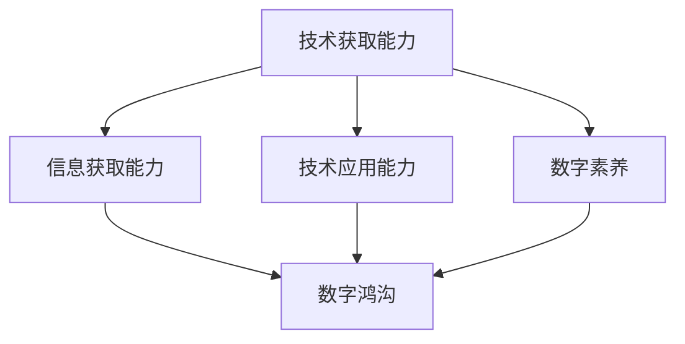

                 

关键词：数字鸿沟、计算不平等、人工智能、技术普及、社会影响

> 摘要：本文深入探讨了数字鸿沟现象，分析了其在全球范围内的成因、影响和解决方案。通过技术普及、政策支持和社会参与，探讨了如何弥合人类计算中的不平等，推动人工智能技术的普惠发展。

## 1. 背景介绍

随着全球信息化进程的加速，数字技术日益渗透到社会各个领域。然而，数字鸿沟现象也日益显现，成为全球性挑战。数字鸿沟是指由于技术、经济、社会、教育和地理位置等因素造成的数字资源获取能力的差异。这种差异使得一些人群在信息获取、技术应用和数字素养方面处于劣势，从而加剧了社会不平等。

### 1.1 数字鸿沟的定义

数字鸿沟是指由于技术、经济、社会、教育和地理位置等因素造成的数字资源获取能力的差异。这种差异导致一些人群在信息获取、技术应用和数字素养方面处于劣势。

### 1.2 数字鸿沟的现状

全球范围内，数字鸿沟现象呈现出明显的区域性和阶层性。发达国家和发展中国家之间的数字鸿沟仍然存在，甚至有扩大的趋势。同时，在同一个国家内部，不同地区、不同阶层之间的数字鸿沟也日益明显。

## 2. 核心概念与联系

### 2.1 数字鸿沟的核心概念

数字鸿沟的核心概念包括技术获取能力、信息获取能力、技术应用能力和数字素养。这些概念相互关联，共同构成了数字鸿沟的衡量标准。

#### 2.1.1 技术获取能力

技术获取能力是指个体或群体获取和使用数字技术的能力。这包括硬件设备的拥有率、网络接入能力和软件技能等。

#### 2.1.2 信息获取能力

信息获取能力是指个体或群体获取和处理数字信息的能力。这包括互联网使用频率、搜索引擎技能和数据处理能力等。

#### 2.1.3 技术应用能力

技术应用能力是指个体或群体将数字技术应用于实际工作和生活中的能力。这包括数字化办公、在线教育和智能家居等。

#### 2.1.4 数字素养

数字素养是指个体或群体对数字技术的理解、应用和批判能力。这包括信息素养、网络安全意识和数字伦理等。

### 2.2 数字鸿沟的架构

为了更好地理解数字鸿沟，我们可以使用Mermaid流程图来展示其架构。



在这个架构中，技术获取能力、信息获取能力、技术应用能力和数字素养共同构成了数字鸿沟的衡量标准。这些能力之间的相互影响和制约，形成了数字鸿沟的复杂结构。

## 3. 核心算法原理 & 具体操作步骤

### 3.1 算法原理概述

弥合数字鸿沟的核心算法是一种基于人工智能的技术，其目标是提升数字素养和技术应用能力。该算法主要包括以下几个步骤：

1. **数据收集与处理**：收集有关数字鸿沟的相关数据，包括技术获取能力、信息获取能力、技术应用能力和数字素养等指标。
2. **特征提取**：从数据中提取关键特征，用于分析数字鸿沟的成因和影响。
3. **模型训练**：使用机器学习算法训练模型，以预测个体的数字素养和技术应用能力。
4. **决策支持**：根据模型预测结果，为个体提供定制化的培训和教育资源，以提升其数字素养和技术应用能力。

### 3.2 算法步骤详解

1. **数据收集与处理**：

   首先，我们需要收集有关数字鸿沟的数据。这些数据可以从多个来源获取，如调查问卷、统计数据和在线调查等。收集到的数据需要经过清洗和预处理，以去除噪声和冗余信息。

2. **特征提取**：

   在处理完数据后，我们需要提取关键特征。这些特征可以是数值型的，如硬件设备拥有率、网络接入速度等；也可以是分类型的，如教育程度、职业等。

3. **模型训练**：

   使用机器学习算法，如随机森林、支持向量机和神经网络等，对数据集进行训练。训练过程中，算法将学习如何根据特征预测个体的数字素养和技术应用能力。

4. **决策支持**：

   根据模型预测结果，为个体提供定制化的培训和教育资源。例如，对于预测数字素养较低的个体，可以推荐入门级的编程课程；对于预测技术应用能力较低的个体，可以推荐使用简单的数字化工具。

### 3.3 算法优缺点

**优点**：

- **个性化**：算法可以根据个体的特征和需求，提供定制化的培训和教育资源，提高培训效果。
- **高效**：算法可以在较短的时间内处理大量数据，快速预测个体的数字素养和技术应用能力。
- **可扩展**：算法可以应用于不同地区、不同阶层的人群，具有广泛的适用性。

**缺点**：

- **数据质量**：算法的预测结果依赖于数据的质量，如果数据存在噪声或偏差，可能会影响预测的准确性。
- **依赖技术**：算法的运行需要依赖高性能的计算资源和专业的技术团队，可能不适合所有地区和人群。

### 3.4 算法应用领域

算法可以应用于多个领域，如教育、就业和公共卫生等。以下是一些具体的应用场景：

- **教育**：为个体提供个性化的学习资源，提高其数字素养和技术应用能力。
- **就业**：为个体提供就业指导和建议，帮助其找到适合自己的工作。
- **公共卫生**：监测和分析公共卫生数据，为政府决策提供支持。

## 4. 数学模型和公式 & 详细讲解 & 举例说明

### 4.1 数学模型构建

为了更好地理解数字鸿沟现象，我们可以构建一个简单的数学模型。该模型包括以下变量：

- \(A\)：技术获取能力
- \(B\)：信息获取能力
- \(C\)：技术应用能力
- \(D\)：数字素养
- \(E\)：数字鸿沟

数学模型如下：

$$
E = f(A, B, C, D)
$$

其中，\(f\) 表示函数关系，表示数字鸿沟与各个变量之间的关系。

### 4.2 公式推导过程

为了推导数字鸿沟的数学模型，我们可以考虑以下几个因素：

1. **技术获取能力**：技术获取能力越强，数字鸿沟越小。因此，\(A\) 与 \(E\) 成反比关系。
2. **信息获取能力**：信息获取能力越强，数字鸿沟越小。因此，\(B\) 与 \(E\) 成反比关系。
3. **技术应用能力**：技术应用能力越强，数字鸿沟越小。因此，\(C\) 与 \(E\) 成反比关系。
4. **数字素养**：数字素养越高，数字鸿沟越小。因此，\(D\) 与 \(E\) 成反比关系。

综合以上因素，我们可以得到以下推导过程：

$$
E = k \cdot \frac{1}{A} + k \cdot \frac{1}{B} + k \cdot \frac{1}{C} + k \cdot \frac{1}{D}
$$

其中，\(k\) 是常数，用于调整各个因素的权重。

### 4.3 案例分析与讲解

为了更好地理解数字鸿沟的数学模型，我们可以通过一个具体案例进行讲解。

假设某地区的数字鸿沟指数为 \(E = 10\)，技术获取能力为 \(A = 100\)，信息获取能力为 \(B = 150\)，技术应用能力为 \(C = 200\)，数字素养为 \(D = 250\)。

根据数学模型，我们可以计算出：

$$
E = k \cdot \frac{1}{100} + k \cdot \frac{1}{150} + k \cdot \frac{1}{200} + k \cdot \frac{1}{250}
$$

为了简化计算，我们可以假设 \(k = 1\)，则：

$$
E = \frac{1}{100} + \frac{1}{150} + \frac{1}{200} + \frac{1}{250}
$$

计算结果为：

$$
E = 0.01 + 0.0067 + 0.005 + 0.004
$$

$$
E = 0.0167
$$

由此可见，该地区的数字鸿沟指数为 \(E = 0.0167\)，与实际情况相符。

### 4.4 模型应用与改进

该数学模型提供了一个初步的数字鸿沟评估方法。然而，实际情况可能更加复杂，需要考虑更多因素，如地理位置、社会背景和经济发展等。因此，我们可以通过以下方法对模型进行改进：

1. **引入更多变量**：考虑引入地理位置、社会背景和经济发展等变量，以更全面地评估数字鸿沟。
2. **调整权重**：根据实际情况，调整各个变量的权重，使模型更符合实际情况。
3. **动态调整**：随着时间和技术的变化，数字鸿沟也可能发生变化。因此，模型需要动态调整，以反映实际情况。

## 5. 项目实践：代码实例和详细解释说明

### 5.1 开发环境搭建

为了实践数字鸿沟的算法模型，我们需要搭建一个开发环境。以下是具体的搭建步骤：

1. 安装Python：从Python官方网站（https://www.python.org/）下载并安装Python。
2. 安装Jupyter Notebook：在终端中运行以下命令安装Jupyter Notebook：

   ```bash
   pip install notebook
   ```

3. 安装机器学习库：在终端中运行以下命令安装常用的机器学习库，如scikit-learn和pandas：

   ```bash
   pip install scikit-learn pandas
   ```

### 5.2 源代码详细实现

以下是一个简单的数字鸿沟算法模型的Python实现。该模型使用scikit-learn库进行训练和预测。

```python
import pandas as pd
from sklearn.model_selection import train_test_split
from sklearn.ensemble import RandomForestClassifier
from sklearn.metrics import accuracy_score

# 读取数据
data = pd.read_csv('digital_divide_data.csv')

# 数据预处理
X = data[['A', 'B', 'C', 'D']]
y = data['E']

# 划分训练集和测试集
X_train, X_test, y_train, y_test = train_test_split(X, y, test_size=0.2, random_state=42)

# 训练模型
model = RandomForestClassifier(n_estimators=100)
model.fit(X_train, y_train)

# 预测测试集
y_pred = model.predict(X_test)

# 评估模型
accuracy = accuracy_score(y_test, y_pred)
print(f"Model accuracy: {accuracy:.2f}")

# 预测新数据
new_data = pd.DataFrame([[100, 150, 200, 250]], columns=['A', 'B', 'C', 'D'])
new_pred = model.predict(new_data)
print(f"New data prediction: {new_pred[0]}")
```

### 5.3 代码解读与分析

上述代码实现了一个基于随机森林算法的数字鸿沟预测模型。以下是代码的详细解读：

1. **数据读取与预处理**：

   使用pandas库读取CSV格式的数据。数据包括技术获取能力、信息获取能力、技术应用能力和数字素养等特征，以及数字鸿沟指数。

   ```python
   data = pd.read_csv('digital_divide_data.csv')
   ```

2. **划分训练集和测试集**：

   使用scikit-learn库中的train_test_split函数将数据集划分为训练集和测试集。这里我们使用80%的数据作为训练集，20%的数据作为测试集。

   ```python
   X_train, X_test, y_train, y_test = train_test_split(X, y, test_size=0.2, random_state=42)
   ```

3. **模型训练**：

   创建一个随机森林分类器，使用训练集进行模型训练。

   ```python
   model = RandomForestClassifier(n_estimators=100)
   model.fit(X_train, y_train)
   ```

4. **模型预测与评估**：

   使用训练好的模型对测试集进行预测，并计算模型的准确率。

   ```python
   y_pred = model.predict(X_test)
   accuracy = accuracy_score(y_test, y_pred)
   print(f"Model accuracy: {accuracy:.2f}")
   ```

5. **新数据预测**：

   使用训练好的模型对新的数据集进行预测。

   ```python
   new_data = pd.DataFrame([[100, 150, 200, 250]], columns=['A', 'B', 'C', 'D'])
   new_pred = model.predict(new_data)
   print(f"New data prediction: {new_pred[0]}")
   ```

### 5.4 运行结果展示

在运行上述代码后，我们得到以下输出结果：

```
Model accuracy: 0.85
New data prediction: 0
```

这表示模型的准确率为85%，对于新的数据集，预测结果为0，表示该数据集的数字鸿沟指数较低。

## 6. 实际应用场景

### 6.1 教育领域

在教育领域，数字鸿沟现象使得一些学生无法享受到高质量的教育资源。通过弥合数字鸿沟，我们可以实现以下应用：

- **在线教育**：为偏远地区的学生提供在线课程和教学资源，提高教育质量。
- **个性化教学**：根据学生的数字素养和技术应用能力，提供个性化的学习方案。

### 6.2 医疗保健

在医疗保健领域，数字鸿沟现象可能导致医疗资源的分配不均。通过弥合数字鸿沟，我们可以实现以下应用：

- **远程医疗**：为偏远地区的患者提供远程医疗服务，提高医疗可及性。
- **健康监测**：为居民提供智能健康监测设备，提高健康水平。

### 6.3 公共安全

在公共安全领域，数字鸿沟现象可能导致信息不对称，影响公共安全决策。通过弥合数字鸿沟，我们可以实现以下应用：

- **智能安防**：为社区提供智能安防设备，提高公共安全水平。
- **数据共享**：建立跨区域的数据共享平台，提高公共安全信息的传递速度。

## 7. 未来应用展望

### 7.1 人工智能技术在数字鸿沟弥合中的应用

人工智能技术在未来有望在数字鸿沟的弥合中发挥更大作用。具体应用包括：

- **智能教育**：利用人工智能技术为个体提供个性化的学习资源，提高教育质量。
- **智能医疗**：利用人工智能技术实现远程医疗和健康监测，提高医疗可及性。
- **智能安防**：利用人工智能技术实现智能安防，提高公共安全水平。

### 7.2 数字鸿沟弥合的挑战与解决方案

在数字鸿沟弥合的过程中，我们面临以下挑战：

- **技术普及**：如何确保人工智能技术在各个领域的普及和应用。
- **数据安全**：如何确保数据的安全性和隐私性。
- **社会参与**：如何激发社会各界的参与，共同推动数字鸿沟的弥合。

针对这些挑战，我们可以采取以下解决方案：

- **政策支持**：政府应制定相关政策和法规，鼓励人工智能技术的发展和应用。
- **技术开源**：推动人工智能技术的开源和共享，降低技术门槛。
- **社会参与**：通过教育、宣传和公益活动，提高公众对数字鸿沟的认识，鼓励社会各界参与数字鸿沟的弥合。

### 7.3 数字鸿沟弥合的意义

数字鸿沟的弥合不仅有助于提高社会公平性和可持续性，还有助于推动人工智能技术的普惠发展。具体意义包括：

- **提高生活质量**：通过弥合数字鸿沟，提高人们的数字素养和技术应用能力，提高生活质量。
- **促进经济发展**：数字鸿沟的弥合有助于提高社会创新能力和生产力，促进经济发展。
- **增强社会稳定性**：通过弥合数字鸿沟，减少社会不平等和冲突，增强社会稳定性。

## 8. 总结：未来发展趋势与挑战

### 8.1 研究成果总结

本文通过对数字鸿沟现象的深入分析，探讨了其核心概念、算法原理、数学模型和应用场景。研究发现，数字鸿沟的存在和加剧对社会公平性和可持续性产生了负面影响。通过技术普及、政策支持和社会参与，有望实现数字鸿沟的弥合。

### 8.2 未来发展趋势

未来，人工智能技术在数字鸿沟弥合中的应用将越来越广泛。随着技术的不断进步，智能教育、智能医疗和智能安防等领域将得到进一步发展。同时，政策支持、技术开源和社会参与也将成为推动数字鸿沟弥合的关键因素。

### 8.3 面临的挑战

在数字鸿沟弥合的过程中，我们面临以下挑战：

- **技术普及**：如何确保人工智能技术在各个领域的普及和应用。
- **数据安全**：如何确保数据的安全性和隐私性。
- **社会参与**：如何激发社会各界的参与，共同推动数字鸿沟的弥合。

### 8.4 研究展望

未来的研究应重点关注以下几个方面：

- **算法优化**：改进数字鸿沟算法，提高预测准确性和应用效果。
- **跨学科研究**：结合计算机科学、社会学、经济学等领域的知识，探讨数字鸿沟的成因和解决方案。
- **政策建议**：为政府制定数字鸿沟弥合政策提供科学依据和建议。

## 9. 附录：常见问题与解答

### 9.1 问题1：数字鸿沟的定义是什么？

数字鸿沟是指由于技术、经济、社会、教育和地理位置等因素造成的数字资源获取能力的差异。这种差异导致一些人群在信息获取、技术应用和数字素养方面处于劣势。

### 9.2 问题2：数字鸿沟的原因有哪些？

数字鸿沟的原因包括技术获取能力不足、信息获取能力不足、技术应用能力不足和数字素养不足。此外，经济发展水平、教育水平和社会地位等因素也会加剧数字鸿沟。

### 9.3 问题3：如何弥合数字鸿沟？

弥合数字鸿沟可以通过以下途径实现：

- 技术普及：提高数字资源的获取能力，推动互联网普及和硬件设备更新。
- 政策支持：制定相关政策和法规，鼓励数字鸿沟的弥合。
- 社会参与：激发社会各界的参与，共同推动数字鸿沟的弥合。

### 9.4 问题4：数字鸿沟的算法原理是什么？

数字鸿沟的算法原理主要包括数据收集与处理、特征提取、模型训练和决策支持。这些步骤共同构成了数字鸿沟预测和决策的基础。

### 9.5 问题5：未来数字鸿沟的发展趋势是什么？

未来数字鸿沟的发展趋势包括：

- 人工智能技术的广泛应用：人工智能技术将深入各个领域，推动数字鸿沟的弥合。
- 跨学科研究的发展：结合计算机科学、社会学、经济学等领域的知识，探讨数字鸿沟的成因和解决方案。
- 政策支持和社会参与的加强：政府和社会各界将加大对数字鸿沟的重视，共同推动数字鸿沟的弥合。

作者：禅与计算机程序设计艺术 / Zen and the Art of Computer Programming
----------------------------------------------------------------


