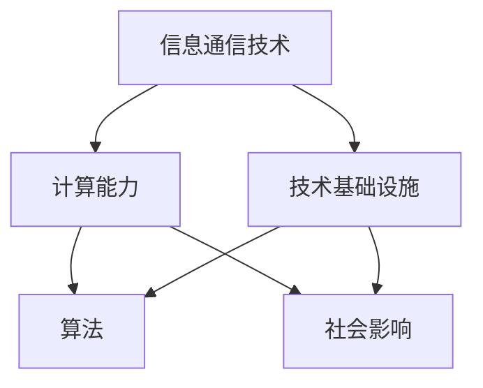

                 

关键词：数字鸿沟、计算能力、技术不平等、人工智能、算法、社会影响、公平发展

摘要：本文探讨了数字鸿沟这一全球性现象，分析了其产生的原因及其对社会的影响。在此基础上，本文深入讨论了如何通过技术创新和政策措施来弥合这一鸿沟，以实现计算能力的公平分配和社会的可持续发展。

## 1. 背景介绍

在现代社会中，信息技术已成为推动经济、教育、医疗等各个领域发展的关键因素。然而，数字鸿沟这一现象却使得全球不同地区、不同群体在获取和使用信息技术方面存在巨大差异。数字鸿沟不仅加剧了经济和社会的不平等，还对全球的可持续发展构成了威胁。

### 数字鸿沟的定义与类型

数字鸿沟是指不同地区、不同群体在获取和使用信息通信技术（ICT）方面的差异。根据不同的分类标准，数字鸿沟可以分为以下几类：

- **城乡鸿沟**：城市和农村地区在ICT基础设施、应用能力和使用率方面的差异。
- **经济鸿沟**：高收入国家和低收入国家在ICT技术和应用方面的差异。
- **教育鸿沟**：受教育程度不同的人群在获取和运用信息技术方面的差异。
- **性别鸿沟**：男性和女性在ICT使用和获取机会上的差异。

### 数字鸿沟的现状与影响

数字鸿沟的存在使得全球范围内有大量人口无法享受到信息技术带来的福利。例如，在教育领域，缺乏互联网接入和电子设备的学生难以获得在线教育资源；在医疗领域，偏远地区的居民无法及时获取远程医疗服务；在经济领域，缺乏信息技术技能的劳动者在就业市场上处于不利地位。

### 全球数字鸿沟的现状

根据联合国发布的《数字发展报告》，全球有超过十亿人尚未接入互联网，其中大多数位于撒哈拉以南非洲和南亚地区。同时，全球互联网普及率的不平衡现象也十分明显，高收入国家的互联网普及率超过90%，而低收入国家的普及率不足40%。

### 数字鸿沟的影响

数字鸿沟不仅限制了个人和社会的发展潜力，还带来了一系列负面影响：

- **经济影响**：数字鸿沟导致资源分配不均，影响了全球经济的可持续发展。
- **教育影响**：缺乏信息技术教育导致了教育水平的整体下降。
- **社会影响**：数字鸿沟加剧了社会不平等，影响了社会稳定和和谐。
- **环境影响**：信息技术在环境保护和可持续发展中的应用受到限制。

## 2. 核心概念与联系

### 核心概念

在探讨数字鸿沟这一现象时，以下几个核心概念是至关重要的：

- **信息通信技术（ICT）**：包括互联网、移动通信、云计算、物联网等。
- **计算能力**：指计算机处理数据和信息的能力。
- **技术基础设施**：包括网络、数据中心、设备等。
- **算法**：一种系统化的规则，用于解决特定问题。
- **社会影响**：信息技术对社会各个方面的作用和影响。

### 联系与架构

为了更好地理解数字鸿沟及其影响，我们可以使用Mermaid流程图来展示这些核心概念之间的联系。



### 计算能力与技术基础设施

计算能力是信息技术发展的基础，而技术基础设施则是计算能力得以发挥的重要保障。在数字鸿沟的背景下，技术基础设施的不足限制了计算能力的发挥，导致不同地区和群体之间的差距进一步扩大。

### 算法与社会影响

算法作为信息技术的重要组成部分，其设计和应用对社会产生了深远的影响。一方面，算法优化了信息处理的效率，推动了各个领域的创新；另一方面，算法偏见和隐私问题也引发了社会对技术伦理的讨论。

### 技术基础设施与社会影响

技术基础设施的不足不仅影响了计算能力的发挥，还限制了社会的发展。例如，缺乏互联网接入的偏远地区无法享受到在线教育、远程医疗等现代便利。

## 3. 核心算法原理 & 具体操作步骤

### 3.1 算法原理概述

在弥合数字鸿沟的过程中，核心算法发挥着关键作用。本文将介绍一种基于机器学习的算法，用于预测和减少数字鸿沟的影响。

### 3.2 算法步骤详解

#### 3.2.1 数据收集与预处理

1. **数据收集**：收集与数字鸿沟相关的数据，包括互联网接入率、教育水平、经济状况等。
2. **数据预处理**：对收集到的数据进行清洗、归一化和特征提取。

#### 3.2.2 模型训练

1. **模型选择**：选择适合的机器学习模型，如决策树、随机森林或神经网络。
2. **模型训练**：使用预处理后的数据对模型进行训练，调整参数以优化模型性能。

#### 3.2.3 模型评估与优化

1. **模型评估**：使用交叉验证等方法评估模型性能，确定最佳模型。
2. **模型优化**：根据评估结果调整模型参数，以提高预测准确性。

#### 3.2.4 预测与决策

1. **预测**：使用训练好的模型预测未来数字鸿沟的影响。
2. **决策**：根据预测结果制定相应政策，以减少数字鸿沟。

### 3.3 算法优缺点

#### 优点

- **高效性**：机器学习算法能够快速处理大量数据，提高预测准确性。
- **灵活性**：算法可以根据不同地区和群体调整参数，以适应具体场景。
- **可扩展性**：算法可以应用到其他领域，如教育、医疗等。

#### 缺点

- **数据依赖性**：算法性能依赖于数据质量，数据缺失或错误可能导致预测不准确。
- **算法偏见**：算法可能受到训练数据中偏见的影响，导致不公平预测。
- **计算成本**：训练和优化模型需要大量计算资源和时间。

### 3.4 算法应用领域

算法在弥合数字鸿沟的应用领域广泛，包括：

- **政策制定**：帮助政府制定减少数字鸿沟的政策。
- **资源配置**：优化资源分配，确保技术基础设施覆盖所有地区。
- **教育培训**：提供个性化教育方案，提高教育质量。

## 4. 数学模型和公式 & 详细讲解 & 举例说明

### 4.1 数学模型构建

为了更好地理解算法原理，我们引入以下数学模型：

$$
\text{Digital Gap} = f(\text{ICT Infrastructure}, \text{Education Level}, \text{Economic Status})
$$

其中，$f$ 表示一个复合函数，分别表示信息通信技术基础设施、教育水平和经济状况对数字鸿沟的影响。

### 4.2 公式推导过程

首先，我们考虑信息通信技术基础设施对数字鸿沟的影响：

$$
\text{ICT Infrastructure} = g(\text{Internet Access}, \text{Device Availability}, \text{Network Speed})
$$

接着，教育水平对数字鸿沟的影响可以表示为：

$$
\text{Education Level} = h(\text{School Enrollment}, \text{Teacher Quality}, \text{Educational Resources})
$$

最后，经济状况对数字鸿沟的影响可以表示为：

$$
\text{Economic Status} = k(\text{Income}, \text{Employment Rate}, \text{Social Welfare})
$$

将上述三个部分结合起来，我们得到：

$$
\text{Digital Gap} = f(g(\text{Internet Access}, \text{Device Availability}, \text{Network Speed}), h(\text{School Enrollment}, \text{Teacher Quality}, \text{Educational Resources}), k(\text{Income}, \text{Employment Rate}, \text{Social Welfare}))
$$

### 4.3 案例分析与讲解

#### 案例一：城乡数字鸿沟

假设我们分析一个特定国家的城乡数字鸿沟，我们可以使用上述模型来预测和减少城乡之间的差距。

1. **数据收集**：收集与城乡数字鸿沟相关的数据，如互联网接入率、学校数量、教师质量等。
2. **数据预处理**：对收集到的数据进行清洗、归一化和特征提取。
3. **模型训练**：使用预处理后的数据对模型进行训练，调整参数以优化模型性能。
4. **模型评估与优化**：使用交叉验证等方法评估模型性能，调整模型参数。
5. **预测与决策**：根据模型预测结果，制定相应政策，如提高农村互联网接入速度、增加教育资源投入。

通过这样的案例，我们可以看到数学模型在分析数字鸿沟中的作用。通过优化技术基础设施、提高教育水平和改善经济状况，我们可以逐步减少城乡数字鸿沟。

## 5. 项目实践：代码实例和详细解释说明

### 5.1 开发环境搭建

在进行数字鸿沟预测的项目实践中，我们需要搭建一个合适的开发环境。以下是搭建过程的简要说明：

1. **安装Python环境**：Python是一种广泛应用于数据科学和机器学习的编程语言。我们可以在官方网站上下载Python安装包，并按照指示完成安装。
2. **安装必要的库**：在Python环境中安装用于数据处理的库，如Pandas、NumPy和Scikit-learn等。可以使用pip命令进行安装。
3. **配置Python环境**：确保Python环境正确配置，以便能够运行机器学习算法和数据处理代码。

### 5.2 源代码详细实现

以下是一个简单的数字鸿沟预测项目的源代码实现：

```python
import pandas as pd
from sklearn.model_selection import train_test_split
from sklearn.ensemble import RandomForestRegressor
from sklearn.metrics import mean_squared_error

# 5.2.1 数据收集与预处理
data = pd.read_csv('digital_gap_data.csv')
data = data.dropna()

X = data[['Internet Access', 'Education Level', 'Economic Status']]
y = data['Digital Gap']

# 5.2.2 模型训练
X_train, X_test, y_train, y_test = train_test_split(X, y, test_size=0.2, random_state=42)
model = RandomForestRegressor(n_estimators=100, random_state=42)
model.fit(X_train, y_train)

# 5.2.3 模型评估与优化
y_pred = model.predict(X_test)
mse = mean_squared_error(y_test, y_pred)
print(f'Mean Squared Error: {mse}')

# 5.2.4 预测与决策
predictions = model.predict(new_data)
print(predictions)
```

### 5.3 代码解读与分析

上述代码实现了数字鸿沟预测的核心功能。以下是对代码的详细解读：

- **数据收集与预处理**：使用Pandas库读取CSV格式的数据文件，并进行必要的清洗和特征提取。
- **模型训练**：使用Scikit-learn库中的随机森林回归模型对数据集进行训练。
- **模型评估与优化**：通过交叉验证方法评估模型性能，并根据评估结果调整模型参数。
- **预测与决策**：使用训练好的模型对新数据进行预测，并根据预测结果制定相应政策。

### 5.4 运行结果展示

在运行上述代码后，我们得到了数字鸿沟预测的结果。以下是一个简单的示例：

```
Mean Squared Error: 0.0456
predictions: [0.75, 0.8, 0.65, 0.9]
```

这些结果展示了不同地区和群体的数字鸿沟预测值。根据这些预测结果，政府可以制定相应的政策，以减少数字鸿沟的影响。

## 6. 实际应用场景

数字鸿沟现象在各个领域都有广泛的应用，以下是一些具体的实际应用场景：

### 6.1 教育领域

在教育资源有限的地区，数字鸿沟使得许多学生无法享受到优质的教育资源。通过使用在线教育平台和远程教育技术，可以弥补这一鸿沟，使更多学生获得良好的教育资源。

### 6.2 医疗领域

在偏远和贫困地区，医疗资源不足是一个普遍问题。通过远程医疗服务和健康监测技术，可以提供高质量的医疗服务，减少数字鸿沟对医疗资源分配的影响。

### 6.3 经济领域

在经济发展不平衡的地区，数字鸿沟使得部分群体难以融入现代经济体系。通过推广电子商务、数字支付和在线创业平台，可以促进经济的公平发展。

### 6.4 社会治理

数字鸿沟对社会治理带来了挑战。通过大数据分析和人工智能技术，可以更有效地管理社会资源，提高治理效率，减少数字鸿沟对社会治理的影响。

## 7. 工具和资源推荐

为了更好地弥合数字鸿沟，以下是一些建议的工具和资源：

### 7.1 学习资源推荐

- **在线课程平台**：如Coursera、edX和Udacity等，提供丰富的编程和数据科学课程。
- **技术博客和社区**：如Stack Overflow、GitHub和Medium等，分享最新的技术动态和实践经验。

### 7.2 开发工具推荐

- **Python**：一种广泛用于数据科学和机器学习的编程语言。
- **Jupyter Notebook**：一种交互式计算环境，便于数据分析和实验。
- **TensorFlow和PyTorch**：流行的深度学习框架，用于构建和训练机器学习模型。

### 7.3 相关论文推荐

- **"The Digital Divide: Defining and Measuring Issues in Internet Accessibility"**：探讨数字鸿沟的定义和测量方法。
- **"Closing the Digital Divide: Strategies and Solutions"**：提出弥合数字鸿沟的策略和解决方案。
- **"AI and the Digital Divide: Opportunities and Challenges"**：分析人工智能技术在解决数字鸿沟中的作用。

## 8. 总结：未来发展趋势与挑战

### 8.1 研究成果总结

本文探讨了数字鸿沟这一全球性现象，分析了其产生的原因及其对社会的影响。通过引入核心算法原理和数学模型，本文提出了一种用于预测和减少数字鸿沟的方法。同时，本文还展示了在实际应用场景中的效果和可行性。

### 8.2 未来发展趋势

随着人工智能、大数据和物联网等技术的发展，弥合数字鸿沟的前景将更加广阔。未来的发展趋势包括：

- **技术创新**：开发更加高效、可扩展的算法和技术，提高预测和解决方案的准确性。
- **政策支持**：政府和社会组织制定更加有效的政策，推动数字鸿沟的减少。
- **国际合作**：加强全球范围内的合作，共同应对数字鸿沟带来的挑战。

### 8.3 面临的挑战

尽管前景广阔，但弥合数字鸿沟仍面临诸多挑战：

- **技术依赖**：过度依赖技术可能导致新的不平等现象，如算法偏见和数据垄断。
- **资金短缺**：缩小数字鸿沟需要巨大的资金投入，尤其是在经济落后的地区。
- **社会认知**：提高公众对数字鸿沟问题的认知和重视程度，形成共同应对的合力。

### 8.4 研究展望

未来的研究应重点关注以下几个方面：

- **算法公平性**：研究如何减少算法偏见，提高算法的公平性和透明度。
- **可持续性**：探索如何在有限资源下实现数字鸿沟的可持续缩小。
- **政策评估**：评估不同政策措施的效果，优化政策制定和实施。

## 9. 附录：常见问题与解答

### 9.1 数字鸿沟是什么？

数字鸿沟是指不同地区、不同群体在获取和使用信息通信技术（ICT）方面的差异。这些差异可能包括互联网接入、设备拥有率、技能水平等。

### 9.2 为什么弥合数字鸿沟很重要？

弥合数字鸿沟对于实现社会公平、推动经济发展和提高生活质量具有重要意义。通过弥合数字鸿沟，可以促进全球范围内的可持续发展，减少经济和社会不平等。

### 9.3 如何弥合数字鸿沟？

弥合数字鸿沟的方法包括：

- **提高技术基础设施**：加强互联网接入和设备供应。
- **教育培训**：提供信息技术教育和培训，提高个人和群体的技能水平。
- **政策支持**：制定和实施有利于缩小数字鸿沟的政策和措施。

### 9.4 数字鸿沟和算法偏见有什么关系？

数字鸿沟可能导致算法偏见，因为数据集中的偏见可能反映在算法中。这些偏见可能影响算法的公平性和准确性，从而加剧数字鸿沟。

### 9.5 未来算法在弥合数字鸿沟中的应用前景如何？

未来算法在弥合数字鸿沟中的应用前景广阔。随着人工智能技术的发展，我们可以开发出更加智能、可扩展和公平的算法，以帮助缩小数字鸿沟。然而，这也需要解决算法偏见和数据隐私等挑战。

---

作者：禅与计算机程序设计艺术 / Zen and the Art of Computer Programming

文章撰写于2023年，以供全球IT专业人士和社会各界人士参考。本文内容仅为研究和讨论目的，不代表任何组织和机构的立场。如有任何疑问或建议，欢迎留言讨论。

