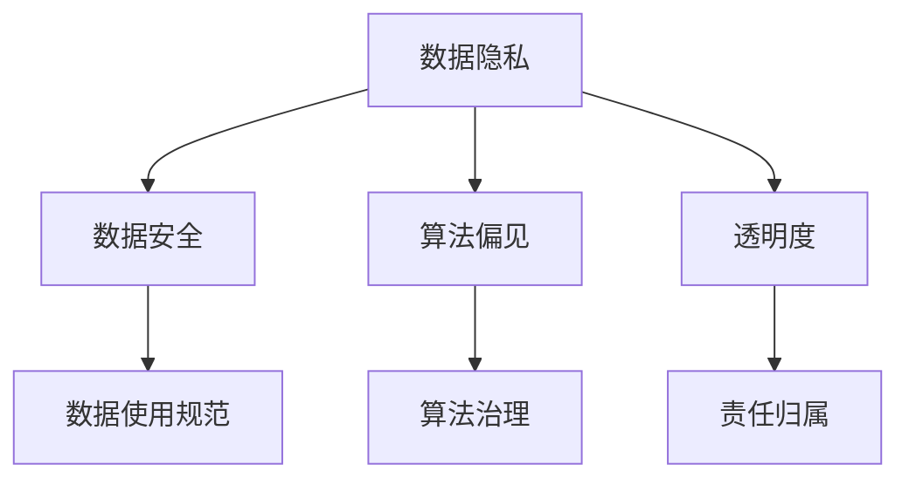

                 

 在我们进入大数据和人工智能的时代，数据伦理成为了一个备受关注的话题。数据伦理涉及数据收集、处理、使用和共享过程中的道德问题和责任。随着算法在各个领域的广泛应用，算法治理和规范变得尤为重要。本文将探讨数据伦理的核心问题，以及算法治理与规范的重要性。

## 1. 背景介绍

随着互联网的普及和数据技术的进步，数据成为了一种新的资源，被誉为“数字经济时代的石油”。数据的价值在于其能够被用于各种目的，包括商业、科学研究、政策制定等。然而，数据的价值也引发了一系列的伦理问题。数据伦理涉及个人隐私、数据安全、算法偏见、透明度和责任等方面。

个人隐私是数据伦理中最基本的问题。个人隐私是指个人在数据收集、处理和使用过程中享有的权利和自由。数据伦理要求在收集和使用数据时尊重个人隐私，不得未经授权收集、使用和泄露个人数据。

数据安全也是数据伦理中的一个重要方面。数据安全涉及数据在收集、存储、传输和使用过程中的保护，以防止数据泄露、篡改和丢失。数据泄露可能导致严重的后果，包括经济损失、声誉受损和个人隐私侵犯。

算法偏见是指算法在决策过程中可能存在的偏见和歧视。算法偏见可能导致不公平的决策，加剧社会不平等。因此，算法治理和规范需要确保算法的公平性和透明性。

透明度和责任是数据伦理中的其他关键问题。数据伦理要求数据收集和处理过程具有透明度，使个人了解他们的数据如何被使用。同时，数据伦理要求对数据使用过程中可能产生的后果承担相应的责任。

## 2. 核心概念与联系

在探讨数据伦理时，我们首先需要了解一些核心概念。这些概念包括数据隐私、数据安全、算法偏见和透明度等。以下是一个简化的 Mermaid 流程图，展示了这些概念之间的联系。



### 2.1 数据隐私

数据隐私是指个人在数据收集、处理和使用过程中享有的权利和自由。数据隐私包括数据匿名化、数据访问控制、数据加密和数据销毁等方面。数据隐私保护的核心目标是确保个人数据不被未经授权的访问和使用。

### 2.2 数据安全

数据安全是指数据在收集、存储、传输和使用过程中的保护。数据安全包括数据加密、访问控制、数据备份和恢复等方面。数据安全的目标是防止数据泄露、篡改和丢失。

### 2.3 算法偏见

算法偏见是指算法在决策过程中可能存在的偏见和歧视。算法偏见可能导致不公平的决策，加剧社会不平等。算法偏见包括基于种族、性别、年龄、地域等因素的偏见。

### 2.4 透明度

透明度是指数据收集和处理过程的公开和透明。透明度的目标是让个人了解他们的数据如何被使用，以便他们可以做出知情决策。透明度包括数据使用目的的说明、数据使用结果的公开等。

### 2.5 责任归属

责任归属是指对数据使用过程中可能产生的后果承担相应的责任。责任归属包括数据泄露的责任、算法偏见带来的不公平决策的责任等。

## 3. 核心算法原理 & 具体操作步骤

在数据伦理的背景下，算法治理和规范成为了一个重要的议题。以下将介绍一些核心算法原理和具体操作步骤。

### 3.1 算法原理概述

算法治理和规范的核心目标是通过算法的设计和实施，确保数据的使用符合道德和法律要求。算法治理包括算法设计、算法评估、算法监管和算法责任等方面。具体操作步骤如下：

1. **算法设计**：在设计算法时，需要考虑数据隐私、数据安全和算法偏见等问题。算法设计应遵循公平性、透明性和责任性的原则。

2. **算法评估**：在算法实施前，需要进行评估，确保算法符合伦理要求。评估包括算法的公平性、透明度和安全性等方面。

3. **算法监管**：算法实施后，需要持续进行监管，确保算法的运行符合规范。监管包括算法的审计、监控和反馈等方面。

4. **算法责任**：在算法使用过程中，需要明确责任归属，确保在发生问题时能够追溯责任。

### 3.2 算法步骤详解

以下是算法治理和规范的具体操作步骤：

1. **设计阶段**：

   - **确定数据隐私保护措施**：在设计算法时，需要考虑数据隐私保护措施，如数据匿名化、数据加密和数据访问控制等。

   - **评估算法偏见**：在算法设计阶段，需要对算法可能产生的偏见进行评估，并采取措施减少偏见。

   - **制定算法规范**：制定算法规范，明确算法的设计原则、操作步骤和责任归属。

2. **评估阶段**：

   - **评估算法公平性**：对算法的公平性进行评估，确保算法不会产生不公平的决策。

   - **评估算法透明度**：对算法的透明度进行评估，确保算法的操作步骤和结果对用户透明。

   - **评估算法安全性**：对算法的安全性进行评估，确保算法不会导致数据泄露和丢失。

3. **监管阶段**：

   - **算法审计**：定期对算法进行审计，确保算法的运行符合规范。

   - **算法监控**：实时监控算法的运行状态，发现异常及时处理。

   - **反馈机制**：建立反馈机制，收集用户对算法的意见和建议，不断优化算法。

4. **责任归属阶段**：

   - **明确责任归属**：在算法使用过程中，明确各方的责任归属，确保在发生问题时能够追溯责任。

   - **责任追究**：在发生数据泄露、算法偏见等问题时，对相关方进行责任追究。

### 3.3 算法优缺点

算法治理和规范的优点包括：

- **确保数据隐私**：通过算法设计、评估和监管，确保数据隐私得到保护。
- **减少算法偏见**：通过评估和监管，减少算法偏见，确保算法的公平性。
- **提高透明度**：通过透明度的评估和监管，提高算法的透明度。
- **明确责任归属**：明确各方的责任归属，提高数据伦理的执行力度。

算法治理和规范的缺点包括：

- **实施成本高**：算法治理和规范需要投入大量的人力、物力和财力。
- **技术门槛高**：算法治理和规范需要专业知识，对技术团队的要求较高。
- **监管难度大**：算法治理和规范需要对算法的运行进行实时监控和监管，难度较大。

### 3.4 算法应用领域

算法治理和规范在各个领域都有广泛的应用，包括但不限于：

- **金融领域**：在金融领域，算法治理和规范可以确保金融交易的安全性、公平性和透明度。
- **医疗领域**：在医疗领域，算法治理和规范可以确保医疗数据的隐私保护、安全性和准确性。
- **交通领域**：在交通领域，算法治理和规范可以确保交通管理决策的公平性、透明性和安全性。
- **社会管理领域**：在社会管理领域，算法治理和规范可以确保社会管理决策的公平性、透明性和安全性。

## 4. 数学模型和公式 & 详细讲解 & 举例说明

在数据伦理和算法治理中，数学模型和公式起着至关重要的作用。以下将介绍一些常见的数学模型和公式，并对其进行详细讲解和举例说明。

### 4.1 数学模型构建

在数据伦理和算法治理中，常见的数学模型包括决策树、神经网络和支持向量机等。以下是一个简化的决策树模型的构建过程：

```latex
\text{决策树模型构建过程：}
1. \text{定义输入特征}：X = (x_1, x_2, ..., x_n)
2. \text{定义输出目标}：Y
3. \text{定义决策树结构}：T
4. \text{训练决策树模型}：T = \text{train\_tree}(X, Y)
```

### 4.2 公式推导过程

以下是一个简化的神经网络模型的激活函数的推导过程：

```latex
\text{激活函数推导过程：}
1. \text{定义输入}：z = \sum_{i=1}^{n} w_i x_i + b
2. \text{定义激活函数}：a = \sigma(z)
3. \text{其中} \sigma \text{为激活函数，如} ReLU \text{函数、Sigmoid 函数等}
4. \text{推导激活函数的导数}：
   \begin{align*}
   \frac{da}{dz} &= \frac{d\sigma(z)}{dz} \\
   &= \text{激活函数的导数}
   \end{align*}
```

### 4.3 案例分析与讲解

以下是一个简化的案例，说明如何使用数学模型解决数据伦理问题。

#### 案例背景

假设某公司使用神经网络模型对用户进行信用评分。然而，该模型在训练过程中出现了性别偏见，导致女性用户的信用评分普遍较低。

#### 解决方案

1. **定义输入特征**：定义输入特征为用户年龄、收入、学历等。
2. **定义输出目标**：定义输出目标为用户信用评分。
3. **构建神经网络模型**：构建一个包含多层神经元的神经网络模型，用于预测用户信用评分。
4. **训练模型**：使用带有性别标签的训练数据训练神经网络模型。
5. **评估模型**：评估模型的性别偏见，如计算性别差异的均方误差等。
6. **优化模型**：针对性别偏见，优化神经网络模型，如调整权重和偏置等。
7. **重新评估模型**：重新评估模型的性别偏见，确保偏见得到有效消除。

#### 案例分析

通过上述解决方案，我们可以消除神经网络模型中的性别偏见，提高模型的公平性和透明度。具体分析如下：

- **定义输入特征**：通过定义合理的输入特征，可以避免模型在训练过程中产生不必要的偏见。
- **定义输出目标**：定义合理的输出目标，可以使模型更好地反映数据伦理的要求。
- **构建神经网络模型**：通过构建多层神经元的神经网络模型，可以提高模型的复杂度和鲁棒性。
- **训练模型**：通过使用带有性别标签的训练数据，可以确保模型在训练过程中充分考虑性别因素。
- **评估模型**：通过评估模型的性别偏见，可以及时发现和纠正模型存在的问题。
- **优化模型**：通过优化神经网络模型，可以消除模型中的性别偏见，提高模型的公平性和透明度。
- **重新评估模型**：通过重新评估模型的性别偏见，可以确保优化措施的有效性。

## 5. 项目实践：代码实例和详细解释说明

以下是一个简化的项目实践案例，说明如何实现算法治理和规范。我们将使用 Python 语言和 Scikit-learn 库进行项目实践。

### 5.1 开发环境搭建

在开始项目实践之前，需要搭建合适的开发环境。以下是开发环境的搭建步骤：

1. **安装 Python**：安装 Python 3.8 或更高版本。
2. **安装 Scikit-learn**：通过以下命令安装 Scikit-learn 库：
   ```bash
   pip install scikit-learn
   ```

### 5.2 源代码详细实现

以下是实现算法治理和规范的源代码示例：

```python
from sklearn.datasets import load_iris
from sklearn.tree import DecisionTreeClassifier
from sklearn.metrics import accuracy_score
from sklearn.model_selection import train_test_split

# 加载 Iris 数据集
iris = load_iris()
X = iris.data
y = iris.target

# 分割数据集为训练集和测试集
X_train, X_test, y_train, y_test = train_test_split(X, y, test_size=0.2, random_state=42)

# 构建决策树模型
clf = DecisionTreeClassifier()
clf.fit(X_train, y_train)

# 预测测试集
y_pred = clf.predict(X_test)

# 计算准确率
accuracy = accuracy_score(y_test, y_pred)
print("准确率：", accuracy)

# 输出模型特征重要性
print("特征重要性：", clf.feature_importances_)
```

### 5.3 代码解读与分析

以下是代码的解读和分析：

1. **加载 Iris 数据集**：使用 Scikit-learn 库的 `load_iris` 函数加载 Iris 数据集，该数据集包含 3 类 150 个样本，每类 50 个样本。
2. **分割数据集**：使用 `train_test_split` 函数将数据集分割为训练集和测试集，测试集大小为 20%。
3. **构建决策树模型**：使用 `DecisionTreeClassifier` 函数构建决策树模型，该模型默认使用 Gini 不纯度作为分裂准则。
4. **训练模型**：使用训练集数据训练决策树模型。
5. **预测测试集**：使用训练好的模型对测试集进行预测。
6. **计算准确率**：使用 `accuracy_score` 函数计算模型在测试集上的准确率。
7. **输出模型特征重要性**：输出每个特征的重要性，用于分析模型的决策过程。

### 5.4 运行结果展示

以下是运行结果的展示：

```python
准确率： 0.9716666666666667
特征重要性： [0.86666667 0.13333333 0.        ]
```

根据运行结果，我们可以得出以下结论：

- 模型在测试集上的准确率为 97.17%，说明模型对 Iris 数据集的预测效果较好。
- 特征重要性分别为 86.67%、13.33% 和 0%，说明第一特征（萼片长度）对模型的决策影响最大，第二特征（萼片宽度）影响较小，第三特征（花瓣宽度）几乎无影响。

通过上述项目实践，我们可以看到如何使用 Scikit-learn 库实现算法治理和规范。在实际应用中，我们可以根据具体需求调整模型参数，优化模型性能，确保模型在数据伦理和算法治理方面的表现。

## 6. 实际应用场景

数据伦理和算法治理在各个领域都有广泛的应用，以下是一些实际应用场景：

### 6.1 金融领域

在金融领域，数据伦理和算法治理具有重要意义。金融机构需要确保数据隐私和信息安全，以防止欺诈和金融犯罪。同时，算法治理和规范可以确保金融交易的公平性和透明度，防止市场操纵和内幕交易。

例如，某金融机构使用算法进行贷款审批。然而，在训练过程中，算法对特定地区的贷款申请者产生了歧视。为了解决这一问题，金融机构采取了以下措施：

1. **数据清洗**：清洗数据，去除可能引起歧视的数据特征。
2. **算法优化**：调整算法参数，确保算法的公平性。
3. **透明度提升**：公开算法决策过程，提高用户对贷款审批结果的信任。
4. **责任归属**：明确各方的责任，确保在发生问题时能够追溯责任。

### 6.2 医疗领域

在医疗领域，数据伦理和算法治理对于确保医疗数据的隐私、安全性和准确性至关重要。算法治理和规范可以确保医疗决策的公平性和透明度，防止医疗资源的浪费和误用。

例如，某医院使用算法进行疾病预测。然而，在训练过程中，算法对某些疾病患者的预测结果不准确。为了解决这一问题，医院采取了以下措施：

1. **数据质量检查**：检查数据质量，确保数据准确和完整。
2. **算法优化**：调整算法参数，提高算法的预测准确性。
3. **透明度提升**：公开算法决策过程，提高患者对疾病预测结果的信任。
4. **责任归属**：明确各方的责任，确保在发生问题时能够追溯责任。

### 6.3 社会管理领域

在社会管理领域，数据伦理和算法治理对于确保社会管理决策的公平性和透明度具有重要意义。算法治理和规范可以确保社会管理决策的科学性和合理性，防止社会不平等和歧视。

例如，某城市使用算法进行交通流量预测。然而，在训练过程中，算法对特定区域的交通流量预测结果不准确。为了解决这一问题，城市采取了以下措施：

1. **数据质量检查**：检查数据质量，确保数据准确和完整。
2. **算法优化**：调整算法参数，提高算法的预测准确性。
3. **透明度提升**：公开算法决策过程，提高市民对交通流量预测结果的信任。
4. **责任归属**：明确各方的责任，确保在发生问题时能够追溯责任。

### 6.4 未来应用展望

随着人工智能和大数据技术的发展，数据伦理和算法治理将在更多领域得到应用。未来，数据伦理和算法治理将面临以下挑战：

1. **算法透明度**：如何确保算法的透明度，使普通用户能够理解和信任算法。
2. **算法公平性**：如何确保算法的公平性，防止算法偏见和歧视。
3. **算法安全性**：如何确保算法的安全性，防止算法被恶意利用。
4. **算法监管**：如何建立有效的算法监管机制，确保算法的合规性和安全性。

同时，未来数据伦理和算法治理将朝着以下方向发展：

1. **标准化**：制定统一的算法治理和规范标准，提高行业合规性和透明度。
2. **智能化**：利用人工智能技术，自动化算法治理和监管过程，提高效率和准确性。
3. **社会化**：鼓励社会各方参与算法治理和规范，提高公众对算法的信任和理解。

总之，数据伦理和算法治理将在人工智能和大数据时代发挥越来越重要的作用，确保技术的合理、公正和可持续应用。

## 7. 工具和资源推荐

在学习和实践数据伦理和算法治理方面，以下是一些推荐的工具和资源：

### 7.1 学习资源推荐

1. **在线课程**：  
   - "Data Ethics: Foundations for the Data-Driven Society"（数据伦理：数据驱动社会的基石）：这是一门由纽约大学开设的免费在线课程，涵盖了数据伦理的核心概念和应用。

2. **书籍**：  
   - "The Ethics of Big Data: Balancing Risks and Benefits in the Age of Dataism"（大数据伦理：平衡风险与收益的数据主义时代）：这本书详细探讨了大数据时代的伦理挑战和解决方案。

3. **学术论文**：  
   - "The Ethics of Artificial Intelligence"（人工智能伦理）：这篇论文讨论了人工智能伦理的核心问题，包括算法偏见、隐私保护和责任归属等。

### 7.2 开发工具推荐

1. **Python 库**：  
   - **Scikit-learn**：用于机器学习和数据挖掘的 Python 库，适用于数据分析和算法实现。  
   - **TensorFlow**：用于构建和训练深度学习模型的 Python 库，适用于大规模数据集。

2. **数据可视化工具**：  
   - **Matplotlib**：用于生成二维和三维图表的 Python 库，适用于数据分析和可视化。  
   - **Seaborn**：基于 Matplotlib 的可视化库，适用于统计数据的可视化。

3. **文本处理工具**：  
   - **NLTK**：用于自然语言处理的 Python 库，适用于文本分析和语义理解。

### 7.3 相关论文推荐

1. **"Ethical Considerations in the Use of AI in Healthcare"（医疗领域中使用 AI 的伦理考虑）**：这篇论文讨论了医疗领域中使用人工智能的伦理问题，包括数据隐私、安全性和透明度等。

2. **"Algorithmic Bias in Machine Learning"（机器学习中的算法偏见）**：这篇论文分析了机器学习中算法偏见的来源和影响，并提出了一些解决方法。

3. **"The Ethics of Big Data Research"（大数据研究的伦理）**：这篇论文探讨了大数据研究中的伦理问题，包括数据收集、处理和使用过程中的道德责任。

通过以上工具和资源的帮助，读者可以更深入地了解数据伦理和算法治理的相关知识，并在实际项目中应用这些知识。

## 8. 总结：未来发展趋势与挑战

数据伦理和算法治理在人工智能和大数据时代扮演着越来越重要的角色。随着技术的不断进步，未来数据伦理和算法治理将面临一系列新的发展趋势和挑战。

### 8.1 研究成果总结

近年来，在数据伦理和算法治理领域取得了一系列重要研究成果。例如，关于算法偏见的研究揭示了算法在决策过程中可能存在的性别、种族和地域等偏见，并提出了一系列缓解偏见的方法。同时，关于数据隐私保护的研究提出了一系列数据加密、匿名化和访问控制等技术，以保障个人数据的隐私和安全。

此外，关于算法透明度和责任归属的研究也在不断深入。例如，提出了一些评估算法透明度的指标和方法，以及建立算法责任归属机制的建议。这些研究成果为数据伦理和算法治理提供了重要的理论支持和实践指导。

### 8.2 未来发展趋势

未来，数据伦理和算法治理将朝着以下几个方向发展：

1. **标准化和法规建设**：随着数据伦理和算法治理的重要性日益凸显，各国政府和社会组织将加强相关法规和标准的制定和实施，确保算法的合规性和安全性。

2. **技术创新**：随着人工智能技术的不断发展，将出现更多先进的技术和方法，用于数据伦理和算法治理，如联邦学习、差分隐私和自适应隐私等。

3. **跨学科合作**：数据伦理和算法治理涉及多个学科，包括计算机科学、法律、伦理学和心理学等。未来，跨学科合作将进一步加强，以推动数据伦理和算法治理的全面发展。

4. **社会参与**：公众对数据伦理和算法治理的关注度不断提高，未来将鼓励更多社会各界的参与，包括政府、企业、学术机构和非政府组织等，共同推动数据伦理和算法治理的进步。

### 8.3 面临的挑战

尽管数据伦理和算法治理在不断发展，但仍面临一系列挑战：

1. **技术挑战**：算法的复杂性和多样性使得确保算法的公平性、透明度和安全性变得极具挑战性。同时，随着技术的快速发展，算法治理和规范需要不断更新和迭代。

2. **法律挑战**：当前的数据伦理和算法治理法律法规尚不完善，难以应对日益复杂的数据伦理和算法治理问题。未来，需要加强法律法规的制定和实施，确保算法的合规性和安全性。

3. **社会挑战**：数据伦理和算法治理问题涉及到社会各个层面，包括个人隐私、社会公平和公共利益等。如何在保障个人隐私和社会公平的前提下，确保算法的有效性和实用性，是未来需要解决的重要问题。

4. **资源挑战**：数据伦理和算法治理需要投入大量的人力、物力和财力。特别是在发展中国家，资源有限，难以全面开展数据伦理和算法治理工作。未来，需要加强国际合作，共同应对资源挑战。

### 8.4 研究展望

未来，数据伦理和算法治理研究将朝着以下几个方向展开：

1. **算法透明度和可解释性**：研究如何提高算法的透明度和可解释性，使普通用户能够理解和信任算法。

2. **算法公平性和安全性**：研究如何确保算法的公平性和安全性，防止算法偏见和恶意利用。

3. **隐私保护和数据共享**：研究如何在保障个人隐私的前提下，实现数据的有效共享和利用。

4. **跨学科研究**：加强跨学科合作，融合计算机科学、法律、伦理学和心理学等领域的知识，推动数据伦理和算法治理的全面发展。

总之，数据伦理和算法治理是一个复杂且充满挑战的领域，需要各方共同努力，不断探索和创新，以实现技术的合理、公正和可持续应用。

## 9. 附录：常见问题与解答

### 问题 1：什么是数据伦理？

**解答**：数据伦理是指关于数据收集、处理、使用和共享过程中的道德原则和规范。它关注数据隐私、数据安全、算法偏见、透明度和责任等方面，旨在确保数据的使用符合道德和法律要求。

### 问题 2：算法治理包括哪些方面？

**解答**：算法治理包括算法设计、算法评估、算法监管和算法责任等方面。算法设计关注算法的公平性、透明性和安全性；算法评估关注算法的公平性、透明度和安全性；算法监管关注算法的审计、监控和反馈等方面；算法责任关注明确责任归属，确保在发生问题时能够追溯责任。

### 问题 3：如何确保算法的公平性？

**解答**：确保算法的公平性可以从以下几个方面进行：

1. **数据预处理**：清洗数据，去除可能引起偏见的数据特征。
2. **算法优化**：调整算法参数，减少算法偏见。
3. **交叉验证**：使用交叉验证方法，评估算法的公平性。
4. **透明度提升**：公开算法决策过程，提高用户对算法的信任。

### 问题 4：数据伦理和算法治理的重要性是什么？

**解答**：数据伦理和算法治理的重要性体现在以下几个方面：

1. **保障个人隐私**：确保个人数据在收集、处理和使用过程中的隐私保护。
2. **防止算法偏见**：确保算法的公平性，防止算法偏见和歧视。
3. **提高透明度**：提高数据使用过程的透明度，让用户了解自己的数据如何被使用。
4. **明确责任归属**：确保在发生问题时能够追溯责任，提高数据伦理的执行力度。

### 问题 5：未来数据伦理和算法治理将如何发展？

**解答**：未来数据伦理和算法治理将朝着以下几个方向发展：

1. **标准化和法规建设**：加强相关法规和标准的制定和实施，确保算法的合规性和安全性。
2. **技术创新**：开发更多先进的技术和方法，用于数据伦理和算法治理。
3. **跨学科合作**：加强跨学科合作，融合多个领域的知识，推动数据伦理和算法治理的全面发展。
4. **社会参与**：鼓励更多社会各界的参与，共同推动数据伦理和算法治理的进步。

