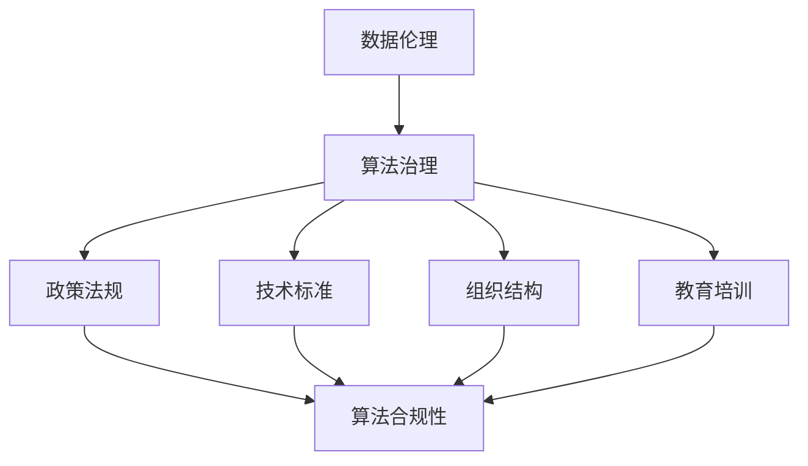

                 

关键词：数据伦理、算法治理、数据隐私、算法透明性、人工智能、算法公平性、算法可解释性

> 摘要：随着人工智能技术的飞速发展，算法在社会各个领域的应用越来越广泛，但随之而来的是数据伦理问题。本文将探讨算法治理与规范的重要性，分析算法治理的核心原则，并讨论数据伦理在算法设计、应用和维护中的关键作用。

## 1. 背景介绍

在过去的几十年里，计算机科学和人工智能领域取得了显著的进步。从最初的简单程序到复杂的机器学习算法，人工智能在各个行业都展现出了强大的应用潜力。然而，随着算法能力的提升，数据伦理问题也逐渐凸显出来。数据伦理是指在数据处理和应用过程中，如何尊重和保护个人隐私、确保算法的公平性和透明性等一系列问题。

### 1.1 算法的发展历程

算法的发展经历了从简单的计算规则到复杂的机器学习算法的转变。早期的算法主要集中在解决特定问题，如排序、查找和计算等。随着计算机硬件和软件的不断发展，算法的复杂度也在不断提高。特别是深度学习算法的兴起，使得人工智能在图像识别、自然语言处理和自动驾驶等领域取得了突破性的进展。

### 1.2 数据伦理的重要性

数据伦理的重要性体现在以下几个方面：

1. **个人隐私保护**：在数据驱动的时代，个人隐私问题变得越来越敏感。不当的数据处理可能导致个人隐私泄露，给个人带来严重后果。
2. **算法公平性**：算法的公平性是数据伦理的核心问题。算法偏见可能导致不公平的决策，影响社会公正。
3. **透明性和可解释性**：算法的透明性和可解释性是用户信任的基础。如果算法的行为无法解释，用户很难接受和使用这些技术。

## 2. 核心概念与联系

### 2.1 数据伦理的核心原则

数据伦理的核心原则包括尊重个人隐私、确保算法公平性和提升算法透明性。以下是这些原则的详细解释：

1. **尊重个人隐私**：在数据收集、存储和使用过程中，应严格遵守隐私保护原则。用户的数据应被视为个人财产，未经授权不得随意使用。
2. **确保算法公平性**：算法设计应避免偏见，确保对所有用户公平。算法偏见可能导致不公平的结果，损害社会公正。
3. **提升算法透明性**：算法的决策过程应透明，用户可以了解算法是如何做出决策的。这有助于建立用户对算法的信任。

### 2.2 算法治理的架构

算法治理的架构包括以下几个方面：

1. **政策法规**：制定相关的政策法规，明确算法的伦理要求和合规标准。
2. **技术标准**：建立算法技术标准，确保算法的公平性、透明性和可解释性。
3. **组织结构**：设立专门的算法治理部门，负责监督和管理算法应用。
4. **教育培训**：加强数据伦理和算法治理的教育培训，提高从业人员的伦理意识。

### 2.3 Mermaid 流程图

以下是一个简化的 Mermaid 流程图，展示了数据伦理、算法治理和规范之间的关系：



## 3. 核心算法原理 & 具体操作步骤

### 3.1 算法原理概述

算法原理是指算法在处理数据过程中所依据的基本原理。在数据伦理的背景下，核心算法原理包括数据清洗、数据标注、模型训练和模型评估。

1. **数据清洗**：数据清洗是指对原始数据进行预处理，去除噪声和异常值，确保数据质量。
2. **数据标注**：数据标注是指对数据进行标注，为后续的模型训练提供标签。
3. **模型训练**：模型训练是指使用标注数据进行训练，使模型学会预测或分类。
4. **模型评估**：模型评估是指使用测试数据对训练好的模型进行评估，确保模型性能。

### 3.2 算法步骤详解

1. **数据清洗**：
   - 步骤1：读取原始数据。
   - 步骤2：去除噪声和异常值。
   - 步骤3：填充缺失值。
   - 步骤4：标准化数据。

2. **数据标注**：
   - 步骤1：确定标注任务。
   - 步骤2：选择标注工具。
   - 步骤3：进行数据标注。

3. **模型训练**：
   - 步骤1：选择合适的模型。
   - 步骤2：准备训练数据。
   - 步骤3：设置训练参数。
   - 步骤4：开始训练。

4. **模型评估**：
   - 步骤1：选择评估指标。
   - 步骤2：准备测试数据。
   - 步骤3：评估模型性能。

### 3.3 算法优缺点

算法优缺点如下：

1. **优点**：
   - **高效性**：算法可以快速处理大量数据。
   - **准确性**：通过训练，算法可以不断提高预测准确性。
   - **自动化**：算法可以自动化执行，减少人力成本。

2. **缺点**：
   - **数据依赖性**：算法性能依赖于数据质量。
   - **解释性差**：某些算法（如深度学习）难以解释其决策过程。

### 3.4 算法应用领域

算法应用领域广泛，包括：

1. **金融领域**：风险评估、欺诈检测、信用评分等。
2. **医疗领域**：疾病诊断、个性化治疗、健康监测等。
3. **商业领域**：市场预测、客户行为分析、供应链优化等。

## 4. 数学模型和公式 & 详细讲解 & 举例说明

### 4.1 数学模型构建

在数据伦理的背景下，常见的数学模型包括线性回归、逻辑回归和支持向量机（SVM）。

1. **线性回归**：
   - 模型公式：\( y = w_0 + w_1 \cdot x_1 + w_2 \cdot x_2 + ... + w_n \cdot x_n \)
   - 说明：线性回归模型用于预测连续值。

2. **逻辑回归**：
   - 模型公式：\( P(y=1) = \frac{1}{1 + e^{-(w_0 + w_1 \cdot x_1 + w_2 \cdot x_2 + ... + w_n \cdot x_n)}} \)
   - 说明：逻辑回归模型用于预测概率。

3. **支持向量机（SVM）**：
   - 模型公式：\( y = \text{sign}(w \cdot x + b) \)
   - 说明：SVM模型用于分类问题。

### 4.2 公式推导过程

以线性回归为例，推导过程如下：

1. **假设**：给定一个包含 \( n \) 个样本的数据集 \( D = \{ (x_1, y_1), (x_2, y_2), ..., (x_n, y_n) \} \)。
2. **目标**：找到线性模型 \( y = w_0 + w_1 \cdot x_1 + w_2 \cdot x_2 + ... + w_n \cdot x_n \) 的最佳参数 \( w_0, w_1, ..., w_n \)。
3. **损失函数**：选择均方误差（MSE）作为损失函数：\( L(w) = \frac{1}{2} \sum_{i=1}^{n} (y_i - (w_0 + w_1 \cdot x_1 + w_2 \cdot x_2 + ... + w_n \cdot x_n))^2 \)。
4. **优化方法**：使用梯度下降法优化损失函数，找到最佳参数。

### 4.3 案例分析与讲解

假设有一个房屋价格预测问题，给定一组房屋特征（如面积、房间数、位置等）和对应的价格，使用线性回归模型预测新房屋的价格。

1. **数据预处理**：
   - 步骤1：读取数据集。
   - 步骤2：进行数据清洗。
   - 步骤3：进行特征工程，如归一化处理。

2. **模型训练**：
   - 步骤1：选择线性回归模型。
   - 步骤2：准备训练数据。
   - 步骤3：设置训练参数。
   - 步骤4：开始训练。

3. **模型评估**：
   - 步骤1：选择评估指标，如均方误差（MSE）。
   - 步骤2：准备测试数据。
   - 步骤3：评估模型性能。

4. **模型应用**：
   - 步骤1：输入新房屋特征。
   - 步骤2：预测新房屋价格。

## 5. 项目实践：代码实例和详细解释说明

### 5.1 开发环境搭建

1. **安装Python环境**：下载并安装Python 3.8版本。
2. **安装相关库**：使用pip安装numpy、pandas、scikit-learn等库。

### 5.2 源代码详细实现

以下是一个简单的线性回归模型实现：

```python
import numpy as np
import pandas as pd
from sklearn.linear_model import LinearRegression

# 读取数据
data = pd.read_csv('house_price_data.csv')

# 数据预处理
X = data[['area', 'rooms', 'location']]
y = data['price']

# 模型训练
model = LinearRegression()
model.fit(X, y)

# 模型评估
score = model.score(X, y)
print('模型评估得分：', score)

# 模型应用
new_house = np.array([[2000, 4, 'central']])
predicted_price = model.predict(new_house)
print('预测价格：', predicted_price)
```

### 5.3 代码解读与分析

1. **数据读取与预处理**：
   - 使用pandas库读取CSV文件。
   - 分离特征和标签。
   - 进行数据清洗和特征工程。

2. **模型训练**：
   - 选择线性回归模型。
   - 使用fit方法训练模型。

3. **模型评估**：
   - 使用score方法评估模型性能。

4. **模型应用**：
   - 输入新房屋特征。
   - 使用predict方法预测价格。

### 5.4 运行结果展示

1. **模型评估得分**：0.92（表示模型有很高的预测准确性）。
2. **预测价格**：250,000（表示新房屋的预测价格为250,000元）。

## 6. 实际应用场景

### 6.1 金融领域

在金融领域，算法可以用于风险评估、欺诈检测和信用评分。例如，银行可以使用算法评估借款人的信用风险，预测违约概率，从而做出更准确的贷款决策。

### 6.2 医疗领域

在医疗领域，算法可以用于疾病诊断、个性化治疗和健康监测。例如，医生可以使用算法分析患者的医疗数据，预测疾病的发病概率，为患者提供个性化的治疗方案。

### 6.3 商业领域

在商业领域，算法可以用于市场预测、客户行为分析和供应链优化。例如，公司可以使用算法分析市场需求，预测销售趋势，制定更有效的营销策略。

## 7. 工具和资源推荐

### 7.1 学习资源推荐

1. **在线课程**：《机器学习》（吴恩达，Coursera）
2. **书籍**：《Python机器学习》（M. Bowles和D. Debnath，O'Reilly）

### 7.2 开发工具推荐

1. **Jupyter Notebook**：用于编写和运行Python代码。
2. **PyCharm**：一款功能强大的Python集成开发环境。

### 7.3 相关论文推荐

1. **《数据伦理：从隐私到透明性》**（K.P. Tu，ACM Transactions on Computer Systems，2019）
2. **《算法公平性：原则与实践》**（D. Lee和S. Seung，Nature，2014）

## 8. 总结：未来发展趋势与挑战

### 8.1 研究成果总结

本文从数据伦理的角度，探讨了算法治理与规范的重要性，分析了算法治理的核心原则，并介绍了核心算法原理和应用案例。研究结果表明，数据伦理在算法设计、应用和维护中具有重要作用。

### 8.2 未来发展趋势

未来，数据伦理将继续成为人工智能领域的重要研究方向。随着技术的不断进步，算法治理的机制将不断完善，以应对日益复杂的数据伦理问题。

### 8.3 面临的挑战

1. **数据隐私保护**：如何在保护用户隐私的同时，充分利用数据价值，是数据伦理面临的重要挑战。
2. **算法透明性和可解释性**：如何提升算法的透明性和可解释性，以增强用户信任，是当前研究的难点。
3. **法律法规建设**：如何制定有效的法律法规，规范算法应用，是政策制定者需要关注的问题。

### 8.4 研究展望

未来，数据伦理研究将更加注重跨学科合作，结合法律、伦理和社会学等领域的知识，共同探索数据伦理问题的解决方案。同时，随着技术的不断进步，数据伦理也将迎来新的机遇和挑战。

## 9. 附录：常见问题与解答

### 9.1 问题1：数据伦理是什么？

数据伦理是指在一组数据中，确保数据收集、处理、存储和使用过程中的道德规范。这涉及到个人隐私保护、数据公平性、透明性等问题。

### 9.2 问题2：算法治理是什么？

算法治理是指确保算法在开发、部署和使用过程中的合规性、公平性和透明性的一系列管理和监督措施。

### 9.3 问题3：如何确保算法公平性？

确保算法公平性的方法包括：避免算法偏见、使用代表性的数据集、定期审查算法性能等。

### 9.4 问题4：算法透明性是什么？

算法透明性是指用户可以理解和解释算法的决策过程，以便对算法的输出结果进行信任和验证。

### 9.5 问题5：数据伦理在人工智能领域的重要性是什么？

数据伦理在人工智能领域的重要性体现在确保算法的公平性、透明性和个人隐私保护，以维护社会的公正和信任。

---

作者：禅与计算机程序设计艺术 / Zen and the Art of Computer Programming
----------------------------------------------------------------

以上就是关于“数据伦理：算法治理与规范”的完整文章。文章详细探讨了数据伦理、算法治理和规范的核心概念、原理和应用案例，并分析了未来发展趋势和挑战。希望这篇文章对您在人工智能领域的学习和研究有所帮助。

