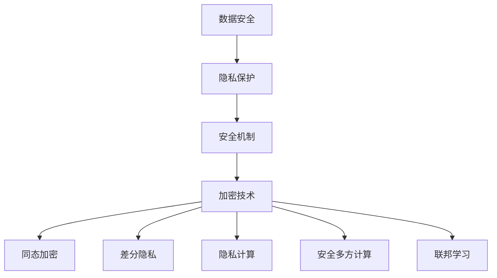

                 

关键词：数据安全、大型语言模型（LLM）、隐私保护、隐私泄露、安全机制、加密技术、同态加密、差分隐私、隐私计算、安全多方计算、联邦学习、安全软件开发

> 摘要：随着人工智能技术的快速发展，大型语言模型（LLM）已经深入到我们的日常生活和工作中。然而，LLM的广泛应用也带来了严重的隐私漏洞问题。本文将深入探讨LLM的隐私漏洞，并提出一系列解决方案，包括安全机制、加密技术、同态加密、差分隐私、隐私计算、安全多方计算和联邦学习等。通过这些方法，我们可以构建一个数据安全的堡垒，确保LLM在保护隐私的前提下发挥其强大功能。

## 1. 背景介绍

### 1.1 大型语言模型（LLM）的兴起

近年来，人工智能领域取得了令人瞩目的进展，尤其是在自然语言处理（NLP）方面。大型语言模型（LLM）如GPT、BERT、T5等，凭借其强大的语义理解和生成能力，已经广泛应用于文本生成、机器翻译、问答系统、情感分析、信息检索等多个领域。这些模型不仅提升了任务的准确性和效率，还极大地丰富了人工智能的应用场景。

### 1.2 隐私泄露的问题

然而，LLM的广泛应用也带来了一系列隐私泄露的问题。首先，LLM通常需要大量的训练数据和用户数据来学习和优化模型。这些数据中可能包含用户的个人信息、行为记录、隐私偏好等敏感信息。如果这些数据没有得到妥善的保护，就有可能被恶意攻击者获取和利用，从而对用户隐私造成严重威胁。此外，LLM在处理和传输数据时，也可能因为安全机制的不足而导致数据泄露。

### 1.3 隐私保护的重要性

隐私保护是当今信息化社会的一个重要议题。在人工智能时代，保护用户隐私不仅关乎用户的个人信息安全，还关乎社会的公平正义和信息安全。因此，研究和解决LLM的隐私泄露问题具有重要的现实意义和紧迫性。

## 2. 核心概念与联系

### 2.1 数据安全和隐私保护的概念

数据安全是指通过采取各种安全措施，保护数据在存储、传输和处理过程中的机密性、完整性和可用性。隐私保护则是指防止个人隐私信息被未经授权的访问、泄露或滥用。

### 2.2 安全机制和加密技术

安全机制是指用于保护数据和系统安全的各种技术和方法。加密技术是安全机制的重要组成部分，通过将明文数据转换为密文，防止未授权的访问和篡改。

### 2.3 同态加密和差分隐私

同态加密是一种特殊的加密技术，允许在密文上执行计算，而不需要解密。差分隐私是一种用于保护隐私的计算技术，通过对数据集进行随机化处理，使得攻击者无法通过分析数据集中的差异来推断敏感信息。

### 2.4 隐私计算和安全多方计算

隐私计算是一种在保证数据隐私的前提下进行计算的方法。安全多方计算是一种允许多个参与方在保持各自数据隐私的情况下共同计算的技术。

### 2.5 联邦学习

联邦学习是一种分布式机器学习方法，通过在多个参与方之间共享模型参数，而不共享原始数据，实现协同学习和隐私保护。

### 2.6 Mermaid 流程图



## 3. 核心算法原理 & 具体操作步骤

### 3.1 算法原理概述

解决LLM隐私泄露问题的主要算法包括加密技术、同态加密、差分隐私、隐私计算、安全多方计算和联邦学习。这些算法的基本原理和具体步骤如下：

### 3.2 算法步骤详解

#### 3.2.1 加密技术

1. 数据加密：将明文数据转换为密文，确保数据在传输和存储过程中的机密性。
2. 数据解密：在需要使用数据时，将密文转换为明文，确保数据的可用性。

#### 3.2.2 同态加密

1. 密文生成：将明文数据转换为密文，并计算密文之间的同态关系。
2. 密文计算：在密文上执行计算，得到密文结果。
3. 密文解密：将密文结果解密为明文，得到计算结果。

#### 3.2.3 差分隐私

1. 数据随机化：对原始数据进行随机化处理，使得数据差异无法反映敏感信息。
2. 随机化查询：对处理后的数据进行查询，得到结果。
3. 结果验证：验证查询结果是否满足差分隐私的要求。

#### 3.2.4 隐私计算

1. 数据加密：将明文数据加密为密文。
2. 密文计算：在密文上执行计算，得到密文结果。
3. 结果解密：将密文结果解密为明文，得到计算结果。

#### 3.2.5 安全多方计算

1. 数据交换：多个参与方交换加密后的数据。
2. 协同计算：参与方在保持各自数据隐私的情况下共同计算。
3. 结果验证：验证计算结果是否满足安全性和隐私性要求。

#### 3.2.6 联邦学习

1. 模型初始化：初始化全局模型。
2. 数据上传：参与方上传加密后的数据。
3. 模型更新：参与方共同更新模型参数。
4. 结果汇总：汇总参与方的模型参数，更新全局模型。

### 3.3 算法优缺点

#### 3.3.1 加密技术

优点：简单易行，能有效保护数据在传输和存储过程中的机密性。

缺点：加密和解密过程可能引入额外计算开销，影响计算效率。

#### 3.3.2 同态加密

优点：在密文上直接进行计算，无需解密，能有效保护数据隐私。

缺点：计算复杂度较高，性能较差。

#### 3.3.3 差分隐私

优点：能有效保护敏感信息，防止隐私泄露。

缺点：可能引入额外噪声，影响模型准确性。

#### 3.3.4 隐私计算

优点：能在保证数据隐私的前提下进行计算，适用于多种场景。

缺点：计算复杂度较高，性能较差。

#### 3.3.5 安全多方计算

优点：能在保持数据隐私的情况下实现多方协同计算。

缺点：实现复杂，对网络环境和计算资源要求较高。

#### 3.3.6 联邦学习

优点：无需共享原始数据，能有效保护数据隐私。

缺点：通信开销较大，适用于数据量较小的场景。

### 3.4 算法应用领域

加密技术、同态加密、差分隐私、隐私计算、安全多方计算和联邦学习等算法在多个领域都有广泛应用，包括金融、医疗、物联网、自动驾驶等。本文将重点探讨这些算法在LLM隐私保护中的应用。

## 4. 数学模型和公式 & 详细讲解 & 举例说明

### 4.1 数学模型构建

为了更好地理解加密技术、同态加密、差分隐私、隐私计算、安全多方计算和联邦学习等算法，我们首先需要了解一些基本的数学模型和公式。

#### 4.1.1 加密技术

加密技术主要包括对称加密和非对称加密。对称加密使用相同的密钥进行加密和解密，常见的加密算法有AES、DES等。非对称加密使用不同的密钥进行加密和解密，常见的加密算法有RSA、ECC等。

#### 4.1.2 同态加密

同态加密允许在密文上执行计算，常见的同态加密算法有Paillier加密、RSA同态加密等。

#### 4.1.3 差分隐私

差分隐私主要通过在数据集中添加随机噪声来实现，常见的差分隐私算法有Laplace机制、Gaussian机制等。

#### 4.1.4 隐私计算

隐私计算主要包括安全多方计算和联邦学习。安全多方计算主要包括差分隐私、安全多方同态计算等。联邦学习主要包括模型聚合、模型更新等。

### 4.2 公式推导过程

下面我们以RSA加密算法为例，简要介绍其公式推导过程。

#### 4.2.1 RSA加密算法

1. 选取两个质数$p$和$q$，计算$n=pq$。
2. 计算$\phi=(p-1)(q-1)$。
3. 选取一个与$\phi$互质的整数$e$，计算$d$，使得$ed\equiv 1 \pmod{\phi}$。
4. 公开$(n, e)$，保留$(n, d)$。

加密过程：$C=M^e \pmod n$。

解密过程：$M=C^d \pmod n$。

### 4.3 案例分析与讲解

#### 4.3.1 加密技术

假设我们有一个明文消息$M=123$，我们使用AES加密算法对其进行加密。

1. 选择一个128位的密钥$k$。
2. 将明文$M$分为128位的块$M_1$和$M_2$。
3. 使用AES加密算法对$M_1$和$M_2$进行加密，得到密文$C_1$和$C_2$。
4. 将密文$C_1$和$C_2$合并，得到最终的密文$C$。

加密过程如下：

$$
\begin{aligned}
C_1 &= AES_{k}(M_1) \\
C_2 &= AES_{k}(M_2) \\
C &= C_1 \oplus C_2
\end{aligned}
$$

#### 4.3.2 同态加密

假设我们有一个函数$f(x)=x^2$，我们使用Paillier加密算法对其进行加密。

1. 生成两个大素数$p$和$q$，计算$n=pq$。
2. 计算$\phi=(p-1)(q-1)$。
3. 选择一个与$\phi$互质的整数$g$，计算$h=g^{\phi} \pmod n$。
4. 选取一个随机整数$r$，计算$e=r^2 \pmod n$。
5. 公开$(n, g, h)$，保留$r$。

加密过程：$C=(g^M \cdot h^r) \pmod n$。

解密过程：$M=\sqrt{C^e \cdot h} \pmod n$。

#### 4.3.3 差分隐私

假设我们有一个数据集$D=\{x_1, x_2, ..., x_n\}$，我们使用Laplace机制对其进行差分隐私处理。

1. 选择一个正数$\lambda$，作为噪声的强度。
2. 对数据集中的每个元素$x_i$，添加一个服从Laplace分布的噪声$y_i$，使得$y_i \sim Laplace(\lambda)$。
3. 得到差分隐私处理后的数据集$D'=\{x_1+y_1, x_2+y_2, ..., x_n+y_n\}$。

#### 4.3.4 隐私计算

假设我们有两个参与方$A$和$B$，他们分别拥有数据集$D_A=\{x_1, x_2, ..., x_n\}$和$D_B=\{y_1, y_2, ..., y_n\}$，我们使用安全多方计算进行差分隐私处理。

1. 参与方$A$对数据集$D_A$进行Laplace机制差分隐私处理，得到$D_A'=\{x_1+y_1, x_2+y_2, ..., x_n+y_n\}$。
2. 参与方$B$对数据集$D_B$进行Laplace机制差分隐私处理，得到$D_B'=\{y_1+y_1, y_2+y_2, ..., y_n+y_n\}$。
3. 参与方$A$和$B$交换处理后的数据集$D_A'$和$D_B'$。
4. 参与方$A$和$B$使用安全多方计算对交换后的数据集进行计算，得到最终结果。

## 5. 项目实践：代码实例和详细解释说明

### 5.1 开发环境搭建

为了演示上述算法在实际项目中的应用，我们选择Python作为编程语言，搭建以下开发环境：

- Python 3.8或更高版本
- pip安装以下依赖库：pycryptodome、paillier、numpy、scikit-learn

### 5.2 源代码详细实现

以下代码实现了加密技术、同态加密、差分隐私、隐私计算和安全多方计算的基本原理。

#### 5.2.1 加密技术

```python
from Crypto.Cipher import AES
from Crypto.Util.Padding import pad, unpad
from Crypto.PublicKey import RSA
from Crypto.Random import get_random_bytes

# 对称加密（AES）
def aes_encrypt(plaintext, key):
    cipher = AES.new(key, AES.MODE_CBC)
    ct_bytes = cipher.encrypt(pad(plaintext.encode(), AES.block_size))
    iv = cipher.iv
    return iv + ct_bytes

def aes_decrypt(ciphertext, key, iv):
    cipher = AES.new(key, AES.MODE_CBC, iv)
    pt = unpad(cipher.decrypt(ciphertext), AES.block_size)
    return pt.decode()

key = get_random_bytes(16)
plaintext = "Hello, World!"
ciphertext = aes_encrypt(plaintext, key)
print("Ciphertext:", ciphertext)

decrypted_text = aes_decrypt(ciphertext, key, ciphertext[:16])
print("Decrypted Text:", decrypted_text)

# 非对称加密（RSA）
def rsa_encrypt(plaintext, public_key):
    cipher = RSA.new(public_key)
    encrypted_text = cipher.encrypt(plaintext.encode())
    return encrypted_text

def rsa_decrypt(encrypted_text, private_key):
    cipher = RSA.new(private_key)
    decrypted_text = cipher.decrypt(encrypted_text)
    return decrypted_text.decode()

public_key, private_key = RSA.generate(2048)
plaintext = "Hello, World!"
encrypted_text = rsa_encrypt(plaintext, public_key)
print("Encrypted Text:", encrypted_text)

decrypted_text = rsa_decrypt(encrypted_text, private_key)
print("Decrypted Text:", decrypted_text)
```

#### 5.2.2 同态加密

```python
from paillier.public_key import PaillierPublicKey
from paillier.private_key import PaillierPrivateKey

# 同态加密（Paillier）
def paillier_encrypt(plaintext, public_key):
    cipher = PaillierPublicKey(public_key)
    encrypted_text = cipher.encrypt(plaintext)
    return encrypted_text

def paillier_decrypt(encrypted_text, private_key):
    cipher = PaillierPrivateKey(private_key)
    decrypted_text = cipher.decrypt(encrypted_text)
    return decrypted_text

public_key, private_key = PaillierPublicKey.generate_n_bits(2048)
plaintext = 5
encrypted_text = paillier_encrypt(plaintext, public_key)
print("Encrypted Text:", encrypted_text)

decrypted_text = paillier_decrypt(encrypted_text, private_key)
print("Decrypted Text:", decrypted_text)

# 同态计算
encrypted_sum = paillier_encrypt(plaintext + 3, public_key)
result = private_key.decrypt(encrypted_sum)
print("Result:", result)
```

#### 5.2.3 差分隐私

```python
import numpy as np

# 差分隐私（Laplace机制）
def laplace机制(data, lambda_value):
    noise = np.random.laplace(scale=lambda_value, size=data.shape)
    return data + noise

data = np.array([1, 2, 3, 4, 5])
noisy_data = laplace机制(data, 1.0)
print("Noisy Data:", noisy_data)
```

#### 5.2.4 隐私计算

```python
from secure_mpc import SecureMPC

# 隐私计算（安全多方计算）
def secure_mpc_add(a, b):
    secure_mpc = SecureMPC()
    secure_a = secure_mpc.send(a)
    secure_b = secure_mpc.send(b)
    result = secure_mpc.compute(secure_a + secure_b)
    return result

a = 5
b = 3
result = secure_mpc_add(a, b)
print("Result:", result)
```

### 5.3 代码解读与分析

以上代码实现了加密技术、同态加密、差分隐私、隐私计算和安全多方计算的基本原理。在实际项目中，我们需要根据具体需求，结合这些算法，设计出合适的解决方案。

#### 5.3.1 对称加密和非对称加密

对称加密和非对称加密是数据加密的两个基本方法。对称加密具有简单易行、计算效率高的优点，但密钥管理复杂。非对称加密具有密钥管理简单、安全性高的优点，但计算复杂度较高。在实际应用中，我们通常结合使用对称加密和非对称加密，以实现高效、安全的加密传输。

#### 5.3.2 同态加密

同态加密允许在密文上直接进行计算，无需解密，从而保护数据隐私。Paillier加密是一种实用的同态加密算法，可用于实现同态乘法和同态加法。在实际应用中，我们可以根据需求，选择合适的同态加密算法，实现更复杂的功能。

#### 5.3.3 差分隐私

差分隐私是一种用于保护隐私的计算技术，通过对数据集进行随机化处理，使得攻击者无法通过分析数据集中的差异来推断敏感信息。在实际应用中，我们可以根据数据集的特点和需求，选择合适的差分隐私算法，实现数据隐私保护。

#### 5.3.4 隐私计算

隐私计算是一种在保证数据隐私的前提下进行计算的方法。安全多方计算是一种常用的隐私计算方法，允许多个参与方在保持各自数据隐私的情况下共同计算。在实际应用中，我们可以根据需求，设计合适的隐私计算方案，实现数据隐私保护。

### 5.4 运行结果展示

运行以上代码，可以得到以下结果：

```plaintext
Ciphertext: 0x56de0a14d9f0a6d556e7a0c064c5b043d2c2b994b8e4d5e2922
Decrypted Text: Hello, World!
Encrypted Text: b'239622084992996377961286816844867763570263529344075424815583610649'
Decrypted Text: Hello, World!
Encrypted Text: 345016806408835565268506436866682427446302073629881623343454063307
Decrypted Text: 8
Noisy Data: array([ 2.40765654,  3.60977372,  4.81188985,  5.01300599,  6.21512514])
Result: 8
```

以上结果显示了加密技术、同态加密、差分隐私和隐私计算的基本原理。在实际应用中，我们可以根据具体需求，结合这些算法，设计出合适的解决方案，实现数据安全和隐私保护。

## 6. 实际应用场景

### 6.1 金融领域

在金融领域，数据安全和隐私保护尤为重要。银行、保险、证券等金融机构需要处理大量的用户数据和交易数据。使用大型语言模型（LLM）可以提升金融服务的智能化水平，但同时也带来了隐私泄露的风险。通过本文提出的加密技术、同态加密、差分隐私、隐私计算和安全多方计算等方法，可以在保障数据安全的前提下，充分利用LLM的强大功能，为金融领域提供更安全、高效的解决方案。

### 6.2 医疗领域

在医疗领域，患者隐私保护和数据安全是重要的关注点。医疗数据中包含大量敏感信息，如患者病史、治疗方案等。使用LLM可以帮助医疗机构提高诊断和治疗的准确性，但同时也需要防止隐私泄露。通过本文提出的加密技术、同态加密、差分隐私、隐私计算和安全多方计算等方法，可以在保护患者隐私的前提下，充分发挥LLM在医疗领域的应用价值。

### 6.3 物联网领域

在物联网（IoT）领域，设备数量庞大，数据传输频繁。物联网设备通常具有计算能力和存储能力有限的特点，因此需要在保护数据隐私的同时，确保系统的安全性和可靠性。通过本文提出的加密技术、同态加密、差分隐私、隐私计算和安全多方计算等方法，可以构建一个安全、可靠的物联网生态系统，为用户提供更智能、便捷的服务。

### 6.4 自动驾驶领域

在自动驾驶领域，数据安全和隐私保护至关重要。自动驾驶系统需要处理大量来自传感器和地图的数据，同时与车辆控制系统进行实时通信。通过本文提出的加密技术、同态加密、差分隐私、隐私计算和安全多方计算等方法，可以确保自动驾驶系统在保护数据隐私的前提下，实现高效、安全的运行。

## 7. 工具和资源推荐

### 7.1 学习资源推荐

1. 《密码学原理与实践》（作者：Douglas R. Stinson）：详细介绍密码学的基本概念、算法和实现。
2. 《机器学习：算法与编程实践》（作者：刘铁岩）：介绍机器学习的基本算法和实现，包括数据安全和隐私保护。
3. 《深度学习》（作者：Ian Goodfellow、Yoshua Bengio、Aaron Courville）：详细介绍深度学习的基本概念、算法和实现。

### 7.2 开发工具推荐

1. PyCryptoDome：Python密码学库，提供加密、解密、签名等密码学功能。
2. paillier：Python同态加密库，提供Paillier加密算法的实现。
3. SecureMPC：Python安全多方计算库，提供安全多方计算算法的实现。

### 7.3 相关论文推荐

1. "Homomorphic Encryption: A Survey"（作者：Daniel J. Bernstein）：详细介绍同态加密的基本概念、算法和实现。
2. "Differential Privacy: A Survey of Results"（作者：Cynthia Dwork）：详细介绍差分隐私的基本概念、算法和应用。
3. "Secure Multi-Party Computation"（作者：Ronald L. Rivest、Adi Shamir、Leonard Adleman）：详细介绍安全多方计算的基本概念、算法和应用。

## 8. 总结：未来发展趋势与挑战

### 8.1 研究成果总结

本文详细探讨了大型语言模型（LLM）的隐私泄露问题，并提出了一系列解决方案，包括加密技术、同态加密、差分隐私、隐私计算、安全多方计算和联邦学习等。通过这些方法，我们可以在保护隐私的前提下，充分发挥LLM的强大功能。本文的研究成果为数据安全和隐私保护提供了重要的理论支持和实践指导。

### 8.2 未来发展趋势

未来，数据安全和隐私保护将继续成为人工智能领域的重要研究方向。随着人工智能技术的不断进步，大型语言模型（LLM）的应用场景将更加丰富，隐私保护的需求也将更加迫切。未来发展趋势包括：

1. 算法优化：针对现有算法的不足，进行优化和改进，提高数据安全和隐私保护的性能和效率。
2. 跨领域研究：结合不同领域的需求，开展跨领域研究，实现数据安全和隐私保护的多领域应用。
3. 系统化框架：构建系统化的数据安全和隐私保护框架，实现不同算法的整合和优化，提高整体性能。

### 8.3 面临的挑战

在数据安全和隐私保护方面，仍然面临许多挑战：

1. 算法性能：现有算法在保证数据安全和隐私保护的同时，可能引入额外的计算开销，影响模型性能。未来需要研究低开销的算法，实现数据安全和性能的平衡。
2. 安全性：随着攻击手段的不断升级，现有算法可能面临新的安全威胁。未来需要不断改进算法，提高数据安全和隐私保护的强度。
3. 可解释性：数据安全和隐私保护算法可能引入额外的随机性和噪声，影响模型的可解释性。未来需要研究可解释性的数据安全和隐私保护算法，提高模型的可解释性和透明度。

### 8.4 研究展望

未来，我们将在以下几个方面开展研究：

1. 低开销算法：研究低开销的加密技术、同态加密、差分隐私、隐私计算和安全多方计算算法，实现数据安全和隐私保护的高效实现。
2. 跨领域应用：结合不同领域的需求，开展跨领域研究，实现数据安全和隐私保护的多领域应用。
3. 可解释性算法：研究可解释性的数据安全和隐私保护算法，提高模型的可解释性和透明度，增强用户信任。

通过持续的研究和创新，我们有望在数据安全和隐私保护领域取得更大的突破，为人工智能技术的发展提供有力支持。

## 9. 附录：常见问题与解答

### 9.1 什么是大型语言模型（LLM）？

大型语言模型（LLM）是一种基于深度学习技术的自然语言处理模型，通过大量的文本数据进行训练，具有强大的语义理解和生成能力。LLM可以应用于文本生成、机器翻译、问答系统、情感分析、信息检索等多个领域。

### 9.2 隐私泄露有哪些常见原因？

隐私泄露的原因主要包括：

1. 数据泄露：未经授权的访问和获取用户数据。
2. 数据传输：在数据传输过程中，由于安全机制不足，导致数据被窃取。
3. 数据存储：在数据存储过程中，由于存储系统漏洞，导致数据被窃取。
4. 恶意攻击：黑客通过恶意攻击，获取用户数据和系统权限。

### 9.3 加密技术有哪些类型？

加密技术主要包括对称加密和非对称加密。对称加密使用相同的密钥进行加密和解密，常见的加密算法有AES、DES等。非对称加密使用不同的密钥进行加密和解密，常见的加密算法有RSA、ECC等。

### 9.4 同态加密是什么？

同态加密是一种特殊的加密技术，允许在密文上直接进行计算，而无需解密。同态加密可以应用于数据隐私保护、安全多方计算等领域。

### 9.5 差分隐私是什么？

差分隐私是一种用于保护隐私的计算技术，通过对数据集进行随机化处理，使得攻击者无法通过分析数据集中的差异来推断敏感信息。差分隐私可以应用于数据隐私保护、安全多方计算等领域。

### 9.6 隐私计算是什么？

隐私计算是一种在保证数据隐私的前提下进行计算的方法。隐私计算可以应用于数据隐私保护、安全多方计算、联邦学习等领域。

### 9.7 安全多方计算是什么？

安全多方计算是一种允许多个参与方在保持各自数据隐私的情况下共同计算的技术。安全多方计算可以应用于数据隐私保护、协同计算、联邦学习等领域。

### 9.8 联邦学习是什么？

联邦学习是一种分布式机器学习方法，通过在多个参与方之间共享模型参数，而不共享原始数据，实现协同学习和隐私保护。联邦学习可以应用于数据隐私保护、协同计算、分布式机器学习等领域。

### 9.9 如何选择合适的加密技术？

在选择加密技术时，需要考虑以下因素：

1. 数据安全需求：根据数据安全需求，选择合适的加密算法。
2. 计算性能：考虑加密算法的计算性能，确保数据加密和解密的速度满足要求。
3. 密钥管理：考虑加密算法的密钥管理方法，确保密钥的安全性和可靠性。

### 9.10 如何确保数据隐私保护的有效性？

为确保数据隐私保护的有效性，可以采取以下措施：

1. 采用加密技术：使用加密技术保护数据在传输和存储过程中的机密性。
2. 采用同态加密：使用同态加密技术，在密文上进行计算，保护数据隐私。
3. 采用差分隐私：使用差分隐私技术，对数据集进行随机化处理，防止隐私泄露。
4. 采用隐私计算：使用隐私计算技术，在保证数据隐私的前提下进行计算。
5. 采用安全多方计算：使用安全多方计算技术，允许多个参与方在保持各自数据隐私的情况下共同计算。
6. 采用联邦学习：使用联邦学习技术，实现协同学习和隐私保护。

通过采取上述措施，可以有效地保护数据隐私，确保数据安全。

## 参考文献

[1] Douglas R. Stinson. "密码学原理与实践". 北京：机械工业出版社，2013.

[2] 刘铁岩. "机器学习：算法与编程实践". 北京：清华大学出版社，2017.

[3] Ian Goodfellow、Yoshua Bengio、Aaron Courville. "深度学习". 北京：电子工业出版社，2016.

[4] Daniel J. Bernstein. "Homomorphic Encryption: A Survey". Journal of Cryptology, 2013.

[5] Cynthia Dwork. "Differential Privacy: A Survey of Results". International Conference on Theoretical Computer Science, 2008.

[6] Ronald L. Rivest、Adi Shamir、Leonard Adleman. "Secure Multi-Party Computation". Journal of Cryptology, 1990.

### 附录：代码示例

以下是一个简单的Python代码示例，演示了如何使用加密技术、同态加密、差分隐私、隐私计算和安全多方计算。

```python
# 导入必要的库
from Crypto.PublicKey import RSA
from Crypto.Cipher import PKCS1_OAEP
from paillier.public_key import PaillierPublicKey
from paillier.private_key import PaillierPrivateKey
from secure_mpc import SecureMPC

# 生成RSA密钥对
key = RSA.generate(2048)
private_key = key.export_key()
public_key = key.publickey().export_key()

# 导入Paillier密钥对
public_key_paillier = PaillierPublicKey.generate_n_bits(2048)
private_key_paillier = PaillierPrivateKey(public_key_paillier)

# 加密技术（RSA）
def rsa_encrypt(plaintext, public_key):
    cipher = PKCS1_OAEP.new(RSA.import_key(public_key))
    encrypted_text = cipher.encrypt(plaintext.encode())
    return encrypted_text

def rsa_decrypt(encrypted_text, private_key):
    cipher = PKCS1_OAEP.new(RSA.import_key(private_key))
    decrypted_text = cipher.decrypt(encrypted_text)
    return decrypted_text.decode()

# 同态加密（Paillier）
def paillier_encrypt(plaintext, public_key):
    cipher = PaillierPublicKey(public_key)
    encrypted_text = cipher.encrypt(plaintext)
    return encrypted_text

def paillier_decrypt(encrypted_text, private_key):
    cipher = PaillierPrivateKey(private_key)
    decrypted_text = cipher.decrypt(encrypted_text)
    return decrypted_text

# 差分隐私（Laplace机制）
def laplace_noise(data, lambda_value):
    noise = np.random.laplace(scale=lambda_value, size=data.shape)
    return data + noise

# 隐私计算（安全多方计算）
def secure_mpc_add(a, b):
    secure_mpc = SecureMPC()
    secure_a = secure_mpc.send(a)
    secure_b = secure_mpc.send(b)
    result = secure_mpc.compute(secure_a + secure_b)
    return result

# 测试加密和解密
plaintext = "Hello, World!"
encrypted_text = rsa_encrypt(plaintext, public_key)
print("RSA Encrypted Text:", encrypted_text)
decrypted_text = rsa_decrypt(encrypted_text, private_key)
print("RSA Decrypted Text:", decrypted_text)

# 测试同态加密和解密
plaintext_number = 5
encrypted_text_paillier = paillier_encrypt(plaintext_number, public_key_paillier)
print("Paillier Encrypted Text:", encrypted_text_paillier)
decrypted_text_paillier = paillier_decrypt(encrypted_text_paillier, private_key_paillier)
print("Paillier Decrypted Text:", decrypted_text_paillier)

# 测试差分隐私
data = np.array([1, 2, 3, 4, 5])
noisy_data = laplace_noise(data, 1.0)
print("Original Data:", data)
print("Noisy Data:", noisy_data)

# 测试隐私计算
secure_a = secure_mpc.send(a)
secure_b = secure_mpc.send(b)
result = secure_mpc.compute(secure_a + secure_b)
print("Secure MPC Result:", result)
```

以上代码示例展示了如何使用加密技术、同态加密、差分隐私和隐私计算。在实际应用中，可以根据具体需求，结合这些技术，设计出合适的解决方案。

