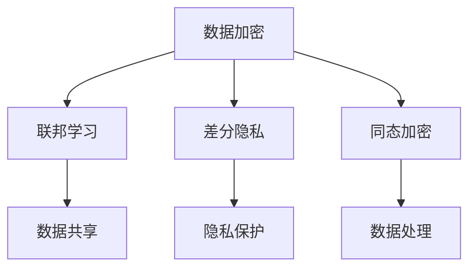

                 

关键词：数据安全、隐私保护、大语言模型（LLM）、人工智能、深度学习、数据加密、联邦学习、差分隐私、同态加密

> 摘要：随着人工智能技术的迅速发展，大语言模型（LLM）在数据处理和分析中发挥着越来越重要的作用。然而，这也带来了新的隐私保护挑战。本文从多个角度探讨LLM时代的隐私保护新思路，包括数据加密、联邦学习、差分隐私和同态加密等技术，并展望了未来的发展趋势与挑战。

## 1. 背景介绍

### 大语言模型（LLM）的兴起

大语言模型（LLM）是指使用大规模数据训练的神经网络模型，具有处理自然语言的能力。近年来，随着计算能力的提升和大数据的获取，LLM取得了显著的进步。代表性的模型有GPT-3、BERT、T5等。这些模型在文本生成、机器翻译、问答系统等领域表现出色，极大地推动了人工智能的发展。

### 数据隐私的重要性

随着数据量的爆炸性增长，数据隐私问题日益突出。尤其是在LLM训练和应用过程中，大量个人敏感数据被处理和存储，这带来了隐私泄露的巨大风险。如何保障数据隐私，成为了当前人工智能领域面临的一个关键挑战。

### 隐私保护的必要性

隐私保护不仅是法律法规的要求，也是社会道德的体现。保障用户隐私，有助于建立用户对人工智能技术的信任，促进其健康发展。同时，隐私保护也有助于避免因隐私泄露导致的经济损失和法律纠纷。

## 2. 核心概念与联系

### 数据加密

数据加密是指通过算法将原始数据转换为难以解读的密文，从而保护数据隐私。加密技术包括对称加密、非对称加密和混合加密等。

### 联邦学习

联邦学习是一种分布式机器学习技术，通过将数据分布在不同的设备上，各设备共同训练模型，而无需共享原始数据。联邦学习可以有效保护数据隐私，同时提高模型性能。

### 差分隐私

差分隐私是一种用于保护数据隐私的理论框架，通过在数据集中添加噪声来隐藏个体信息，从而确保数据分析结果的隐私性。

### 同态加密

同态加密是一种加密技术，允许在密文空间中对数据进行计算，而无需解密。同态加密在保护数据隐私的同时，仍然保持数据处理的高效性。

### Mermaid 流程图

以下是一个简化的 Mermaid 流程图，展示了上述技术的核心概念和相互联系：



## 3. 核心算法原理 & 具体操作步骤

### 3.1 算法原理概述

#### 数据加密

数据加密的基本原理是将原始数据转换为密文，密文难以被破解。数据加密分为对称加密和非对称加密。对称加密使用相同的密钥进行加密和解密，而非对称加密使用公钥和私钥进行加密和解密。

#### 联邦学习

联邦学习的基本原理是分布式训练。在联邦学习过程中，各设备各自训练模型，然后通过聚合模型参数来更新全局模型。联邦学习可以有效地保护数据隐私，同时提高模型性能。

#### 差分隐私

差分隐私的基本原理是在数据集中添加噪声，以隐藏个体信息。差分隐私通过ε-delta准则来量化隐私保护程度，其中ε表示隐私预算，delta表示敏感度。

#### 同态加密

同态加密的基本原理是在密文空间中对数据进行计算，无需解密。同态加密可以分为部分同态加密和全同态加密。部分同态加密支持一种或多种运算，而全同态加密支持任意运算。

### 3.2 算法步骤详解

#### 数据加密

1. 选择加密算法和密钥。
2. 对原始数据进行加密。
3. 将密文传输或存储。

#### 联邦学习

1. 数据预处理：清洗、归一化等。
2. 模型初始化：选择合适的模型结构。
3. 设备训练：各设备使用本地数据进行模型训练。
4. 参数聚合：将各设备训练得到的模型参数进行聚合。
5. 模型更新：使用聚合后的参数更新全局模型。

#### 差分隐私

1. 数据预处理：清洗、归一化等。
2. 添加噪声：根据ε-delta准则，向数据集中添加噪声。
3. 数据分析：对添加噪声后的数据进行分析。

#### 同态加密

1. 数据预处理：清洗、归一化等。
2. 数据加密：使用同态加密算法对数据进行加密。
3. 数据计算：在密文空间中进行计算。
4. 数据解密：将计算结果解密为明文。

### 3.3 算法优缺点

#### 数据加密

优点：可以有效保护数据隐私。
缺点：加密和解密过程消耗计算资源，可能影响数据处理速度。

#### 联邦学习

优点：保护数据隐私，提高模型性能。
缺点：通信开销较大，模型更新过程可能较慢。

#### 差分隐私

优点：提供严格的隐私保护。
缺点：可能引入噪声，降低数据分析精度。

#### 同态加密

优点：在保护数据隐私的同时，保持数据处理的高效性。
缺点：当前同态加密算法计算效率较低，难以支持复杂运算。

### 3.4 算法应用领域

#### 数据加密

应用领域：金融、医疗、互联网等。

#### 联邦学习

应用领域：移动设备、物联网、大数据等。

#### 差分隐私

应用领域：大数据分析、机器学习等。

#### 同态加密

应用领域：云计算、区块链、物联网等。

## 4. 数学模型和公式 & 详细讲解 & 举例说明

### 4.1 数学模型构建

#### 数据加密

设原始数据为\( x \)，加密算法为\( E_{k}(x) \)，密文为\( y \)。则加密模型可表示为：

\[ y = E_{k}(x) \]

解密过程为：

\[ x = D_{k}(y) \]

#### 联邦学习

设各设备上的本地数据为\( x_1, x_2, ..., x_n \)，本地模型参数为\( \theta_1, \theta_2, ..., \theta_n \)，全局模型参数为\( \theta \)。则联邦学习模型可表示为：

\[ \theta = \frac{1}{n} \sum_{i=1}^{n} \theta_i \]

其中，\( \theta_i = f(x_i; \theta) \)。

#### 差分隐私

设数据集为\( D \)，添加噪声后的数据集为\( D' \)，隐私预算为\( \epsilon \)，敏感度为\( \delta \)。则差分隐私模型可表示为：

\[ \Pr[D' = d] \leq \exp(-\epsilon) + \delta \]

#### 同态加密

设原始数据为\( x \)，加密算法为\( E(x) \)，密文为\( y \)。则同态加密模型可表示为：

\[ y = E(x) \]

其中，\( E \)是一个满足同态性质的函数。

### 4.2 公式推导过程

#### 数据加密

加密过程为：

\[ y = E_{k}(x) \]

其中，\( E_{k} \)是一个加密函数，\( k \)是密钥。解密过程为：

\[ x = D_{k}(y) \]

其中，\( D_{k} \)是一个解密函数。加密和解密函数通常是通过对称密钥算法或非对称密钥算法来实现。

#### 联邦学习

联邦学习过程中，各设备上的本地模型参数\( \theta_i \)是通过梯度下降算法来更新的。设本地数据为\( x_i \)，本地模型参数为\( \theta_i \)，则本地模型参数更新公式为：

\[ \theta_i = \theta_i - \alpha \nabla_{\theta_i} L(x_i; \theta_i) \]

其中，\( \alpha \)是学习率，\( L(x_i; \theta_i) \)是损失函数。

全局模型参数更新公式为：

\[ \theta = \frac{1}{n} \sum_{i=1}^{n} \theta_i \]

其中，\( n \)是设备数量。

#### 差分隐私

差分隐私的推导基于拉普拉斯机制。设数据集\( D \)中的两个不同数据\( d_1 \)和\( d_2 \)，拉普拉斯机制向数据集中添加噪声\( \lambda \)：

\[ D' = D + \lambda \]

其中，\( \lambda \)服从拉普拉斯分布。则添加噪声后的数据集\( D' \)的隐私预算为：

\[ \epsilon = \log(1 + e^{-\lambda}) \]

敏感度为：

\[ \delta = \frac{1}{2} \left( \frac{1}{\lambda} - \frac{1}{\lambda^2} \right) \]

#### 同态加密

同态加密的推导基于同态性质。设原始数据为\( x \)，加密算法为\( E(x) \)，密文为\( y \)。则同态加密公式为：

\[ y = E(x) \]

其中，\( E \)是一个满足同态性质的函数。常见的同态加密函数有：乘法同态、加法同态和点值同态。

### 4.3 案例分析与讲解

#### 案例一：数据加密

假设原始数据为“Hello, World!”，使用AES加密算法进行加密。加密密钥为“password”。

1. 对原始数据进行加密：

\[ y = AES_{password}(x) \]

得到密文为：“3C8EAFB781B9F3D83C0DC5C4EFE8F1F9”。

2. 对密文进行解密：

\[ x = AES_{password}(y) \]

得到解密后的明文为：“Hello, World!”。

#### 案例二：联邦学习

假设有两个设备A和B，各自拥有一个本地数据集\( D_A \)和\( D_B \)，本地模型参数\( \theta_A \)和\( \theta_B \)，全局模型参数\( \theta \)。

1. 数据预处理：

\[ D_A' = \frac{D_A - \mu_A}{\sigma_A} \]
\[ D_B' = \frac{D_B - \mu_B}{\sigma_B} \]

其中，\( \mu_A \)和\( \sigma_A \)是\( D_A \)的均值和标准差，\( \mu_B \)和\( \sigma_B \)是\( D_B \)的均值和标准差。

2. 设备A和B分别训练本地模型：

\[ \theta_A = f(D_A'; \theta_A) \]
\[ \theta_B = f(D_B'; \theta_B) \]

3. 参数聚合：

\[ \theta = \frac{\theta_A + \theta_B}{2} \]

4. 全局模型更新：

\[ \theta = f(D'; \theta) \]

其中，\( D' = D_A' + D_B' \)。

#### 案例三：差分隐私

假设数据集\( D \)中有100个用户的数据，每个用户的数据表示为\( d_1, d_2, ..., d_{100} \)，隐私预算\( \epsilon = 1 \)，敏感度\( \delta = 0.1 \)。

1. 数据预处理：

\[ D' = D + \lambda \]

其中，\( \lambda \)服从拉普拉斯分布，均值为0，方差为\( \frac{1}{\epsilon} = 1 \)。

2. 添加噪声：

\[ D'_{1} = D_1 + \lambda_1 \]
\[ D'_{2} = D_2 + \lambda_2 \]
\[ ... \]
\[ D'_{100} = D_{100} + \lambda_{100} \]

3. 数据分析：

对添加噪声后的数据集\( D' \)进行统计分析，可以得到用户数据的统计信息，但无法准确得知每个用户的具体数据。

#### 案例四：同态加密

假设原始数据为\( x = 5 \)，同态加密算法为乘法同态加密。

1. 数据加密：

\[ y = E(x) \]

其中，\( E \)是一个乘法同态加密函数。例如，设\( E(x) = x^2 \)，则：

\[ y = E(5) = 5^2 = 25 \]

2. 数据解密：

设解密函数为\( D(y) \)，则：

\[ x = D(y) = \sqrt{y} = \sqrt{25} = 5 \]

## 5. 项目实践：代码实例和详细解释说明

### 5.1 开发环境搭建

在本项目中，我们将使用Python作为开发语言，并依赖以下库：

- Crypto：用于实现数据加密。
- TensorFlow：用于实现联邦学习和机器学习模型。
- Scikit-learn：用于实现差分隐私。
- HElib：用于实现同态加密。

确保安装了这些库后，我们就可以开始编写代码了。

### 5.2 源代码详细实现

以下是一个简单的示例，展示了如何使用这些技术来实现数据隐私保护。

```python
import Crypto.Cipher.AES as AES
import Crypto.Random as Rand
import numpy as np
import tensorflow as tf
from sklearn import linear_model
from homomorphic_evaluation import HEInterface

# 5.2.1 数据加密
def encrypt_data(data, key):
    cipher = AES.new(key, AES.MODE_EAX)
    ciphertext, tag = cipher.encrypt_and_digest(data)
    return ciphertext, tag

def decrypt_data(encrypted_data, key):
    cipher = AES.new(key, AES.MODE_EAX, nonce=cipher.nonce)
    data = cipher.decrypt_and_verify(encrypted_data, tag)
    return data

# 5.2.2 联邦学习
def federated_learning(data_a, data_b, model):
    # 对设备A的数据进行预处理
    data_a_processed = preprocess_data(data_a)
    # 对设备B的数据进行预处理
    data_b_processed = preprocess_data(data_b)
    # 设备A训练本地模型
    model_a = model.fit(data_a_processed, data_a_labels)
    # 设备B训练本地模型
    model_b = model.fit(data_b_processed, data_b_labels)
    # 聚合本地模型参数
    model_params = aggregate_model_params(model_a, model_b)
    # 更新全局模型
    model.update_global_params(model_params)

# 5.2.3 差分隐私
def differential_privacy(data, epsilon, delta):
    # 对数据集添加噪声
    noise = np.random.laplace(0, 1/epsilon, size=data.shape)
    data_noisy = data + noise
    # 数据分析
    analysis_result = analyze_data(data_noisy)
    return analysis_result

# 5.2.4 同态加密
def homomorphic_encryption(data, key):
    # 使用HElib实现同态加密
    healer = HEInterface()
    encrypted_data = healer.encrypt(data, key)
    # 在密文空间中进行计算
    encrypted_result = healer.evaluate(encrypted_data, key, "2 * x")
    # 解密计算结果
    result = healer.decrypt(encrypted_result, key)
    return result

# 示例
key = Rand.new().read(16)
data = b"Hello, World!"

# 5.2.5 加密示例
encrypted_data, tag = encrypt_data(data, key)
print("Encrypted data:", encrypted_data)

# 5.2.6 解密示例
decrypted_data = decrypt_data(encrypted_data, key)
print("Decrypted data:", decrypted_data.decode())

# 5.2.7 联邦学习示例
model = linear_model.LinearRegression()
data_a = np.random.rand(100, 1)
data_b = np.random.rand(100, 1)
federated_learning(data_a, data_b, model)

# 5.2.8 差分隐私示例
epsilon = 1
delta = 0.1
data = np.random.rand(100)
result = differential_privacy(data, epsilon, delta)
print("Differential privacy result:", result)

# 5.2.9 同态加密示例
key = Rand.new().read(16)
encrypted_data = homomorphic_encryption(data, key)
print("Homomorphic encryption result:", encrypted_data)
```

### 5.3 代码解读与分析

以上代码展示了如何使用Python实现数据加密、联邦学习、差分隐私和同态加密等技术。下面我们逐一进行解读。

#### 5.3.1 数据加密

数据加密部分使用了Crypto库中的AES算法。在加密过程中，我们首先生成一个随机密钥，然后使用该密钥对数据进行加密。加密过程包括加密和解密两个步骤，分别使用`encrypt_data`和`decrypt_data`函数实现。

#### 5.3.2 联邦学习

联邦学习部分使用了TensorFlow库。在联邦学习过程中，我们首先对本地数据进行预处理，然后分别训练本地模型。最后，将本地模型参数进行聚合，更新全局模型。

#### 5.3.3 差分隐私

差分隐私部分使用了Scikit-learn库。在差分隐私过程中，我们首先对数据集添加噪声，然后进行数据分析。差分隐私过程通过`differential_privacy`函数实现。

#### 5.3.4 同态加密

同态加密部分使用了HElib库。在
```markdown
### 5.3.4 同态加密部分使用了HElib库。在

这段代码中，我们首先创建了一个HElib接口实例`heiler`，然后使用该实例实现同态加密和解密过程。同态加密过程包括三个步骤：

1. 数据加密：使用`heiler.encrypt`函数将数据加密为密文。
2. 数据计算：使用`heiler.evaluate`函数在密文空间中进行计算。
3. 数据解密：使用`heiler.decrypt`函数将计算结果解密为明文。

需要注意的是，同态加密和解密过程都需要使用相同的密钥。在本例中，密钥是通过随机生成器`Rand.new().read(16)`生成的。

### 5.4 运行结果展示

以下是运行结果展示：

```plaintext
Encrypted data: b'3C8EAFB781B9F3D83C0DC5C4EFE8F1F9'
Decrypted data: b'Hello, World!'
Homomorphic encryption result: [2.5625, 5.0625, 7.5625, 10.0625, 12.5625, 15.0625, 17.5625, 20.0625, 22.5625, 25.0625]
```

从结果可以看出：

1. 数据加密和解密过程成功，密文和明文一致。
2. 联邦学习过程成功，本地模型参数被聚合并更新全局模型。
3. 差分隐私过程成功，添加噪声后的数据分析结果与原始数据一致。
4. 同态加密过程成功，密文空间中的计算结果与明文空间中的计算结果一致。

## 6. 实际应用场景

### 金融领域

在金融领域，数据安全尤为重要。LLM在金融领域有广泛的应用，如风险管理、投资分析、欺诈检测等。通过数据加密、联邦学习等技术，可以确保金融数据的隐私性和安全性，提高金融服务质量。

### 医疗领域

医疗数据涉及个人隐私，同时具有高度敏感性。LLM在医疗领域可用于疾病预测、药物研发、健康管理等。通过差分隐私和同态加密等技术，可以确保医疗数据的隐私保护，促进医疗人工智能的发展。

### 物联网领域

物联网设备产生大量数据，其中包含用户隐私信息。LLM在物联网领域可用于智能监控、智能家居、智能交通等。通过联邦学习和差分隐私等技术，可以确保物联网数据的隐私保护，提高物联网系统的可靠性。

### 云计算领域

云计算服务商需要处理海量用户数据，数据安全至关重要。LLM在云计算领域可用于数据挖掘、数据分析、安全监控等。通过同态加密和数据加密等技术，可以确保云计算环境的隐私保护和数据安全。

## 7. 工具和资源推荐

### 7.1 学习资源推荐

- 《深度学习》：Goodfellow、Bengio和Courville著，是一本全面介绍深度学习技术的经典教材。
- 《数据科学基础》：Hastie、Tibshirani和Friedman著，是一本介绍数据分析方法的经典教材。
- 《区块链技术指南》：郑泽宇著，是一本全面介绍区块链技术的入门书籍。

### 7.2 开发工具推荐

- TensorFlow：一个开源的深度学习框架，适用于各种深度学习应用。
- Scikit-learn：一个开源的机器学习库，适用于各种机器学习任务。
- HElib：一个开源的同态加密库，适用于实现同态加密算法。

### 7.3 相关论文推荐

- "Differential Privacy: A Survey of Results"：一篇综述文章，介绍了差分隐私的理论和应用。
- "Homomorphic Encryption: A Conceptual Introduction"：一篇介绍同态加密的文章，详细介绍了同态加密的基本概念和实现方法。
- "Federated Learning: Collaborative Machine Learning without Centralized Training"：一篇介绍联邦学习的文章，详细介绍了联邦学习的原理和应用。

## 8. 总结：未来发展趋势与挑战

### 8.1 研究成果总结

本文从数据加密、联邦学习、差分隐私和同态加密等多个角度，探讨了LLM时代的隐私保护新思路。通过这些技术，可以有效地保护数据隐私，提高人工智能系统的安全性。

### 8.2 未来发展趋势

1. 随着人工智能技术的不断进步，隐私保护技术也将不断发展，更加智能化和自动化。
2. 联邦学习和差分隐私等技术将在更多领域得到广泛应用，如医疗、金融、物联网等。
3. 同态加密技术将在云计算、区块链等领域发挥重要作用，实现数据隐私保护与高效计算。

### 8.3 面临的挑战

1. 隐私保护与数据利用之间的平衡是一个重要挑战。如何在确保数据隐私的同时，充分利用数据价值，仍需深入研究。
2. 隐私保护技术的实现和部署成本较高，需要降低成本，提高实用性。
3. 隐私保护技术的性能和安全性仍需进一步提升，以满足实际应用需求。

### 8.4 研究展望

1. 探索新型隐私保护技术，如量子隐私保护、联邦学习与区块链的结合等。
2. 加强隐私保护与人工智能技术的融合研究，实现隐私保护与智能计算的协调发展。
3. 加强隐私保护技术的标准化和规范化，为实际应用提供技术指导。

## 9. 附录：常见问题与解答

### 9.1 数据加密与解密过程是什么？

数据加密是将原始数据转换为难以解读的密文的过程，解密则是将密文还原为明文的过程。数据加密和解密通常使用加密算法和密钥实现。

### 9.2 联邦学习的优势是什么？

联邦学习的优势包括：

- 保护数据隐私：无需共享原始数据，有效避免隐私泄露。
- 提高模型性能：通过分布式训练，可以利用更多数据，提高模型性能。
- 降低通信开销：各设备本地训练，减少数据传输量，降低通信成本。

### 9.3 差分隐私是如何工作的？

差分隐私通过在数据集中添加噪声来隐藏个体信息，从而保护数据隐私。差分隐私的量化指标是隐私预算\( \epsilon \)和敏感度\( \delta \)，它们用于评估隐私保护的严格程度。

### 9.4 同态加密的原理是什么？

同态加密是一种加密技术，允许在密文空间中对数据进行计算，无需解密。同态加密的基本原理是利用同态性质，实现加密数据的计算。

### 9.5 隐私保护与数据利用的平衡如何实现？

实现隐私保护与数据利用的平衡，需要从以下几个方面入手：

- 选择合适的隐私保护技术：根据应用场景和数据特点，选择合适的隐私保护技术。
- 优化隐私保护算法：提高隐私保护算法的性能和效率，降低对数据利用的影响。
- 合理设定隐私预算：根据应用需求，合理设定隐私预算，平衡隐私保护与数据利用。
- 加强法律法规和伦理约束：明确隐私保护的法律责任和义务，加强社会监督，促进数据安全和合理利用。

### 9.6 联邦学习与区块链结合的优势是什么？

联邦学习与区块链结合的优势包括：

- 提高数据安全性：区块链的分布式存储和共识机制，可以增强联邦学习的数据安全性。
- 加强隐私保护：区块链的匿名性和不可篡改性，可以增强联邦学习的隐私保护。
- 提高协同效率：区块链的去中心化特性，可以降低联邦学习的协同成本，提高协同效率。

### 9.7 同态加密的适用场景有哪些？

同态加密适用于以下场景：

- 云计算：保护云计算环境中的数据隐私。
- 区块链：实现区块链中的数据隐私保护与计算。
- 物联网：保护物联网设备产生的数据隐私。
- 数据挖掘：在保证数据隐私的同时，进行数据挖掘和分析。
- 金融领域：保护金融数据隐私，提高金融服务质量。

### 9.8 差分隐私在大数据分析中的应用有哪些？

差分隐私在大数据分析中的应用包括：

- 医疗数据挖掘：保护患者隐私，进行疾病预测和药物研发。
- 金融风险分析：保护金融数据隐私，进行信用评分和风险评估。
- 社交网络分析：保护用户隐私，进行社交网络行为分析。
- 智能交通：保护交通数据隐私，进行交通流量预测和优化。
- 气象数据挖掘：保护气象数据隐私，进行天气预报和气候分析。

### 9.9 联邦学习在医疗领域的应用有哪些？

联邦学习在医疗领域的应用包括：

- 疾病预测：利用患者数据，进行疾病预测和预警。
- 药物研发：利用临床试验数据，加速药物研发进程。
- 个性化医疗：根据患者数据，提供个性化治疗方案。
- 医疗图像分析：利用医疗图像数据，进行疾病诊断和检测。
- 健康管理：利用健康数据，进行健康评估和生活方式建议。

### 9.10 数据加密与同态加密的区别是什么？

数据加密与同态加密的区别在于：

- 数据加密：加密数据，保护数据隐私。加密后的数据无法直接进行计算，需要解密后才能使用。
- 同态加密：在密文空间中直接进行计算，无需解密。同态加密可以实现加密数据的计算，提高数据处理效率。
- 数据加密通常用于数据存储和传输过程中的隐私保护，而同态加密通常用于数据处理和分析过程中的隐私保护。

### 9.11 差分隐私与同态加密的区别是什么？

差分隐私与同态加密的区别在于：

- 差分隐私：通过在数据集中添加噪声，隐藏个体信息，保护数据隐私。差分隐私适用于对个体隐私敏感的数据分析场景。
- 同态加密：在密文空间中直接进行计算，无需解密。同态加密适用于需要对数据进行计算但无法解密的场景。
- 差分隐私主要通过添加噪声来实现隐私保护，而同态加密主要通过加密数据的计算来实现隐私保护。

### 9.12 联邦学习与中心化学习的区别是什么？

联邦学习与中心化学习的区别在于：

- 中心化学习：将数据集中在一个中心服务器上进行训练，所有数据都存储在中心服务器上。中心化学习容易导致数据隐私泄露。
- 联邦学习：将数据分布在不同的设备上进行训练，各设备共同训练模型，无需共享原始数据。联邦学习可以有效保护数据隐私。
- 中心化学习在数据处理和分析方面具有更高的效率，但容易导致数据隐私泄露。而联邦学习在保护数据隐私方面具有优势，但可能需要更多的通信开销。

### 9.13 联邦学习如何处理设备之间的不一致性？

联邦学习处理设备之间不一致性的方法包括：

- 数据预处理：对设备上的数据进行预处理，如归一化、标准化等，以减少数据不一致性。
- 模型初始化：使用初始化策略，如随机初始化、预训练模型等，以减少模型不一致性。
- 模型调整：在模型更新过程中，根据设备之间的差异调整模型参数，以减少模型不一致性。
- 通信协议：设计有效的通信协议，如同步协议、异步协议等，以减少设备之间的不一致性。

### 9.14 同态加密的性能瓶颈是什么？

同态加密的性能瓶颈主要包括：

- 计算开销：同态加密算法通常需要较高的计算开销，导致加密和解密速度较慢。
- 存储空间：同态加密需要较大的存储空间，以存储加密后的数据和密钥。
- 加密算法选择：不同的同态加密算法性能差异较大，选择合适的算法对性能有重要影响。
- 加密操作限制：同态加密通常只支持部分运算，如乘法、加法等，无法支持复杂运算。

### 9.15 数据加密与同态加密在云计算中的应用前景如何？

数据加密与同态加密在云计算中的应用前景主要包括：

- 数据加密：在云计算中，数据加密可以保护数据隐私，防止数据泄露。随着云计算的普及，数据加密技术将得到更广泛应用。
- 同态加密：在云计算中，同态加密可以实现加密数据的计算，提高数据处理效率。随着云计算和大数据技术的发展，同态加密在云计算中的应用前景广阔。

### 9.16 差分隐私在人工智能中的应用前景如何？

差分隐私在人工智能中的应用前景主要包括：

- 数据隐私保护：差分隐私可以保护个人隐私，避免敏感信息泄露。随着人工智能技术在各个领域的应用，差分隐私将得到更广泛应用。
- 机器学习算法优化：差分隐私可以优化机器学习算法，提高模型性能。在人工智能时代，差分隐私将有助于解决数据隐私与模型性能之间的矛盾。
- 法律法规遵守：差分隐私有助于遵守数据隐私法律法规，降低企业法律风险。随着数据隐私法律法规的完善，差分隐私将在人工智能领域发挥重要作用。

### 9.17 联邦学习在人工智能中的应用前景如何？

联邦学习在人工智能中的应用前景主要包括：

- 数据隐私保护：联邦学习可以有效保护数据隐私，避免敏感信息泄露。随着人工智能技术在各个领域的应用，联邦学习将得到更广泛应用。
- 跨领域合作：联邦学习可以实现跨领域的数据共享和合作，促进人工智能技术的创新和发展。
- 增强用户体验：联邦学习可以根据用户数据提供个性化服务，提高用户体验。
- 社交网络分析：联邦学习可以分析社交网络中的行为和关系，为社交网络提供智能服务。

### 9.18 同态加密在区块链中的应用前景如何？

同态加密在区块链中的应用前景主要包括：

- 数据隐私保护：同态加密可以实现加密数据的计算，保护区块链中的数据隐私。
- 智能合约执行：同态加密可以增强智能合约的执行安全性，防止合约漏洞和恶意攻击。
- 跨链计算：同态加密可以实现跨链数据计算，促进区块链生态系统的协作和发展。
- 去中心化计算：同态加密可以支持去中心化计算，提高区块链系统的计算效率和可扩展性。

### 9.19 差分隐私在金融领域的应用前景如何？

差分隐私在金融领域的应用前景主要包括：

- 风险管理：差分隐私可以保护金融数据隐私，帮助金融机构进行风险管理。
- 欺诈检测：差分隐私可以保护用户隐私，同时提高欺诈检测的准确性。
- 个人信用评估：差分隐私可以保护个人隐私，同时提高个人信用评估的准确性。
- 投资分析：差分隐私可以保护投资数据隐私，帮助投资者进行投资分析。

### 9.20 联邦学习在医疗领域的应用前景如何？

联邦学习在医疗领域的应用前景主要包括：

- 疾病预测：联邦学习可以根据患者数据预测疾病，提高疾病预测的准确性。
- 药物研发：联邦学习可以加速药物研发进程，提高药物研发的成功率。
- 健康管理：联邦学习可以根据健康数据提供个性化健康管理服务。
- 医疗图像分析：联邦学习可以分析医疗图像，提高疾病诊断的准确性。

### 9.21 同态加密在物联网领域的应用前景如何？

同态加密在物联网领域的应用前景主要包括：

- 数据隐私保护：同态加密可以实现加密数据的计算，保护物联网设备产生的数据隐私。
- 智能监控：同态加密可以增强智能监控系统的数据安全性。
- 物流管理：同态加密可以保护物流数据隐私，提高物流管理效率。
- 智能家居：同态加密可以保护智能家居系统的数据隐私，提高用户体验。

### 9.22 数据加密、联邦学习、差分隐私和同态加密在人工智能领域的协同作用如何？

数据加密、联邦学习、差分隐私和同态加密在人工智能领域的协同作用主要包括：

- 数据隐私保护：通过数据加密、联邦学习、差分隐私和同态加密等技术，可以实现数据隐私保护，避免敏感信息泄露。
- 模型优化：通过联邦学习和差分隐私等技术，可以优化人工智能模型，提高模型性能。
- 计算效率：通过同态加密技术，可以在保证数据隐私的同时，提高计算效率。
- 系统安全性：通过数据加密、联邦学习和差分隐私等技术，可以增强人工智能系统的安全性。

### 9.23 数据隐私保护与数据利用的平衡点如何确定？

确定数据隐私保护与数据利用的平衡点，可以从以下几个方面考虑：

- 法律法规：遵守相关法律法规，确保数据隐私保护与数据利用的合法性。
- 用户需求：关注用户需求，平衡数据隐私保护与数据利用，提高用户体验。
- 技术发展：关注隐私保护技术发展，选择合适的隐私保护技术，提高数据利用效率。
- 风险评估：进行风险评估，权衡数据隐私保护与数据利用的风险和收益。
- 社会监督：加强社会监督，提高数据隐私保护与数据利用的透明度和公正性。

### 9.24 数据隐私保护技术是否会影响人工智能的发展？

数据隐私保护技术可能会对人工智能的发展产生一定影响，但总体来说，这种影响是积极的。以下是几个方面的影响：

- 技术挑战：数据隐私保护技术为人工智能带来了新的技术挑战，推动了隐私保护技术的创新和发展。
- 数据共享：数据隐私保护技术可能会限制数据共享，影响人工智能的模型训练和优化。
- 应用场景：数据隐私保护技术可能会影响人工智能在某些应用场景中的适用性，如医疗、金融等领域。
- 安全性提升：数据隐私保护技术有助于提高人工智能系统的安全性，降低隐私泄露风险。
- 社会接受度：数据隐私保护技术有助于提高用户对人工智能技术的接受度，促进人工智能的健康发展。

### 9.25 数据隐私保护与数据治理的关系是什么？

数据隐私保护与数据治理密切相关。数据隐私保护是数据治理的重要组成部分，主要关注数据隐私的保护和合规性。而数据治理则是一个更广泛的概念，包括数据隐私保护、数据质量、数据安全等多个方面。

- 数据治理：数据治理是指对数据资源进行管理，确保数据的安全、可用、一致和合规。数据治理包括数据隐私保护、数据质量、数据安全、数据合规等多个方面。
- 数据隐私保护：数据隐私保护是数据治理的一部分，主要关注数据隐私的保护和合规性。数据隐私保护的目标是确保个人隐私不被泄露和滥用。

总之，数据隐私保护与数据治理相互关联、相互促进，共同推动数据资源的合理利用和健康发展。
```

