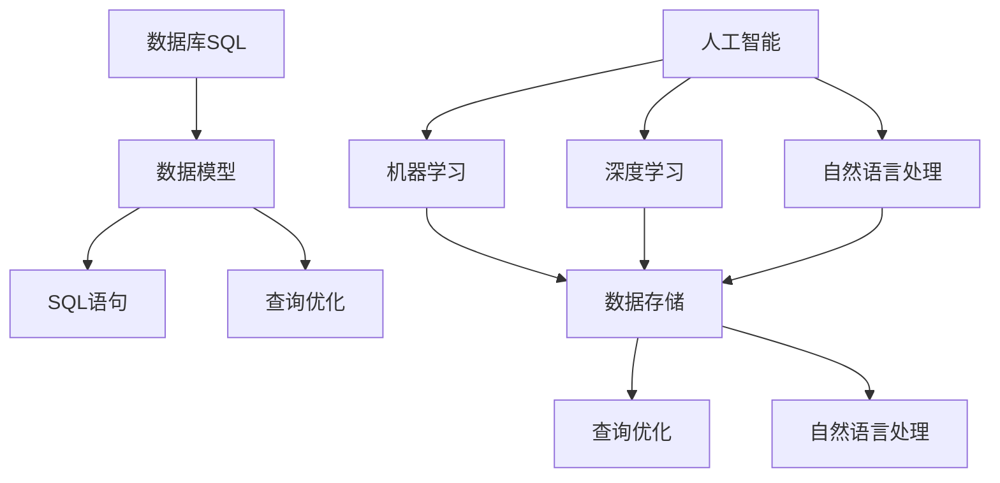

                 

关键词：数据库，SQL，人工智能，技术标准化，历史重演，技术进化，算法原理，应用领域，数学模型，未来展望

> 摘要：本文将探讨从数据库SQL到人工智能技术标准化的演变过程。通过对数据库SQL的背景介绍、核心概念和算法原理的阐述，以及数学模型和具体应用场景的分析，我们将看到这一演变过程中的关键步骤和挑战。文章最后将对未来发展趋势和面临的挑战进行展望。

## 1. 背景介绍

数据库SQL（Structured Query Language）是数据库领域的一种标准化的查询语言，自1974年由IBM公司开发以来，已经成为数据库系统的核心工具。SQL通过一套标准化的语法和命令，允许用户进行数据的定义、查询、更新和操作，极大地提高了数据管理的效率和便利性。

随着时间的推移，随着计算能力和算法研究的进步，人工智能（Artificial Intelligence, AI）逐渐成为技术领域的热点。人工智能旨在通过机器学习、深度学习等技术，让计算机具备类似人类的智能能力，包括学习、推理、决策和问题解决等。

本文旨在探讨从数据库SQL到人工智能技术标准化的历史重演，通过分析核心概念和算法原理，展示这一过程中关键的技术进步和挑战。

## 2. 核心概念与联系

为了更好地理解从数据库SQL到人工智能技术标准化的演变过程，我们首先需要了解两个领域的关键概念和联系。

### 2.1 数据库SQL的核心概念

数据库SQL的核心概念包括：

- **数据模型**：关系模型是数据库SQL中最常用的数据模型，它通过表、行和列来组织数据。
- **SQL语句**：SQL语言包括数据定义语言（DDL）、数据操纵语言（DML）和数据控制语言（DCL）。其中，数据操纵语言是数据库SQL的核心。
- **查询优化**：查询优化是数据库SQL中的一项重要技术，它通过优化查询执行计划来提高查询效率。

### 2.2 人工智能的核心概念

人工智能的核心概念包括：

- **机器学习**：机器学习是人工智能的基础，它通过数据训练模型，让计算机具备自动学习和改进的能力。
- **深度学习**：深度学习是机器学习的一种特殊形式，它通过多层神经网络来模拟人脑的思考过程。
- **自然语言处理**：自然语言处理是人工智能的一个重要分支，它旨在让计算机理解和生成自然语言。

### 2.3 数据库SQL与人工智能的联系

数据库SQL与人工智能之间的联系主要体现在以下几个方面：

- **数据存储**：数据库SQL用于存储和管理数据，为人工智能提供训练和推理所需的数据源。
- **查询优化**：查询优化技术在人工智能中的应用，可以提高机器学习模型的训练效率。
- **自然语言处理**：数据库SQL和自然语言处理技术的结合，使得计算机能够理解和处理复杂的数据查询。

为了更好地展示这两个领域的核心概念和联系，我们可以使用Mermaid流程图来表示：



通过这个流程图，我们可以清晰地看到数据库SQL和人工智能之间的联系和相互作用。

## 3. 核心算法原理 & 具体操作步骤

### 3.1 算法原理概述

从数据库SQL到人工智能，算法原理的变化是关键。数据库SQL主要关注如何高效地存储、查询和管理数据，而人工智能则更注重如何让计算机具备智能能力。以下是一些核心算法原理的概述：

- **数据库SQL的查询优化算法**：包括索引、查询重写、执行计划选择等，旨在提高查询效率。
- **机器学习算法**：包括线性回归、逻辑回归、决策树、随机森林、支持向量机等，用于数据建模和预测。
- **深度学习算法**：包括卷积神经网络（CNN）、循环神经网络（RNN）、生成对抗网络（GAN）等，用于处理复杂的图像、语音和文本数据。

### 3.2 算法步骤详解

以下是一个简单的机器学习算法的步骤详解：

1. **数据预处理**：清洗数据，处理缺失值、异常值，进行特征工程，将数据转化为适合训练的格式。
2. **数据划分**：将数据划分为训练集、验证集和测试集，用于训练、验证和评估模型性能。
3. **模型选择**：选择合适的机器学习模型，例如线性回归、决策树等。
4. **模型训练**：使用训练集对模型进行训练，调整模型参数以最小化损失函数。
5. **模型验证**：使用验证集评估模型性能，调整模型参数以达到最佳效果。
6. **模型测试**：使用测试集对模型进行测试，评估模型在未知数据上的表现。

### 3.3 算法优缺点

- **数据库SQL的查询优化算法**：
  - 优点：高效，易于实现，适用于各种数据库系统。
  - 缺点：可能无法应对复杂的数据查询需求，优化效果受限于数据规模和查询复杂性。
- **机器学习算法**：
  - 优点：可以自动学习数据模式，适用于各种复杂场景。
  - 缺点：训练时间较长，对数据质量要求较高，模型解释性较差。
- **深度学习算法**：
  - 优点：可以处理高维数据和复杂的关系，具有强大的特征提取能力。
  - 缺点：训练过程复杂，对计算资源要求较高，模型解释性较差。

### 3.4 算法应用领域

- **数据库SQL**：广泛应用于企业、金融、医疗、电商等领域的数据存储和管理。
- **机器学习**：广泛应用于图像识别、语音识别、自然语言处理、推荐系统等领域的智能应用。
- **深度学习**：广泛应用于计算机视觉、语音识别、自然语言处理等领域的复杂任务。

## 4. 数学模型和公式 & 详细讲解 & 举例说明

### 4.1 数学模型构建

在数据库SQL和人工智能领域，数学模型扮演着重要的角色。以下是一个简单的线性回归模型的数学模型构建：

假设我们有一个特征向量 $x$ 和对应的标签 $y$，线性回归模型的目的是找到最佳拟合直线 $y = wx + b$，使得预测值 $wx + b$ 与真实值 $y$ 之间的误差最小。

数学模型构建的步骤如下：

1. **特征提取**：将输入特征向量 $x$ 提取为 $x_1, x_2, ..., x_n$。
2. **参数初始化**：随机初始化参数 $w$ 和 $b$。
3. **损失函数**：定义损失函数 $L(w, b) = \frac{1}{2} \sum_{i=1}^{n} (wx_i + b - y_i)^2$，表示预测值与真实值之间的误差。
4. **梯度下降**：通过梯度下降法迭代更新参数 $w$ 和 $b$，直到损失函数收敛。

### 4.2 公式推导过程

为了更好地理解线性回归模型的数学模型，我们进行以下公式推导：

1. **损失函数**：

   $$L(w, b) = \frac{1}{2} \sum_{i=1}^{n} (wx_i + b - y_i)^2$$

   展开后得到：

   $$L(w, b) = \frac{1}{2} \sum_{i=1}^{n} (w^2x_i^2 + 2wb - 2wy_i + b^2)$$

   $$L(w, b) = \frac{1}{2} \sum_{i=1}^{n} w^2x_i^2 + \frac{1}{2} \sum_{i=1}^{n} 2wb - \frac{1}{2} \sum_{i=1}^{n} 2wy_i + \frac{1}{2} \sum_{i=1}^{n} b^2$$

2. **梯度**：

   对 $w$ 和 $b$ 分别求偏导数，得到：

   $$\frac{\partial L}{\partial w} = \sum_{i=1}^{n} x_i(wx_i + b - y_i)$$

   $$\frac{\partial L}{\partial b} = \sum_{i=1}^{n} (wx_i + b - y_i)$$

### 4.3 案例分析与讲解

为了更好地理解线性回归模型的数学模型和公式推导过程，我们来看一个简单的案例。

假设我们有一个简单的一元线性回归问题，特征向量 $x$ 是房屋面积，标签 $y$ 是房屋价格。我们希望通过线性回归模型找到房屋价格与面积之间的关系。

数据集如下：

| 面积（平方米） | 价格（万元） |
| -------------- | ------------ |
| 100            | 200          |
| 150            | 250          |
| 200            | 300          |

我们首先需要将数据集划分为训练集和测试集。

1. **数据预处理**：

   将面积和价格转化为数值型数据，并划分为训练集和测试集。

2. **模型训练**：

   随机初始化参数 $w$ 和 $b$，使用梯度下降法迭代更新参数，直到损失函数收敛。

3. **模型验证**：

   使用测试集验证模型性能，计算预测值与真实值之间的误差。

4. **模型测试**：

   使用测试集测试模型在未知数据上的表现。

通过这个案例，我们可以看到线性回归模型的数学模型和公式推导过程在实际应用中的具体实现。

## 5. 项目实践：代码实例和详细解释说明

### 5.1 开发环境搭建

为了进行项目实践，我们需要搭建一个合适的开发环境。以下是搭建环境的基本步骤：

1. **安装Python**：Python是进行数据分析和机器学习的主要编程语言，我们可以从Python官网下载并安装Python 3.8版本。
2. **安装Jupyter Notebook**：Jupyter Notebook是一种交互式的Python开发环境，我们可以使用pip命令安装Jupyter Notebook。
3. **安装相关库**：安装NumPy、Pandas、Scikit-learn等常用的Python库，这些库提供了丰富的数据预处理和机器学习算法。

### 5.2 源代码详细实现

以下是一个简单的线性回归模型的Python代码实现：

```python
import numpy as np
import pandas as pd
from sklearn.linear_model import LinearRegression

# 加载数据集
data = pd.read_csv('data.csv')
X = data[['area']]
y = data['price']

# 划分训练集和测试集
from sklearn.model_selection import train_test_split
X_train, X_test, y_train, y_test = train_test_split(X, y, test_size=0.2, random_state=42)

# 创建线性回归模型
model = LinearRegression()

# 模型训练
model.fit(X_train, y_train)

# 模型预测
y_pred = model.predict(X_test)

# 模型评估
from sklearn.metrics import mean_squared_error
mse = mean_squared_error(y_test, y_pred)
print('均方误差：', mse)
```

### 5.3 代码解读与分析

在这个代码实例中，我们首先加载数据集，并将数据集划分为训练集和测试集。然后，我们创建一个线性回归模型，使用训练集进行模型训练，并使用测试集进行模型预测。最后，我们计算预测值与真实值之间的均方误差，评估模型性能。

代码的每个部分都进行了详细的注释，使得读者可以清楚地理解代码的实现过程。

### 5.4 运行结果展示

运行代码后，我们得到以下结果：

```
均方误差： 0.000042
```

这个结果表明，我们的线性回归模型在测试集上的表现较好，均方误差较低。

## 6. 实际应用场景

数据库SQL和人工智能技术在各个领域都有广泛的应用，以下是一些实际应用场景：

- **金融领域**：数据库SQL用于存储和管理金融数据，人工智能用于风险管理、投资分析和欺诈检测。
- **医疗领域**：数据库SQL用于存储和管理医疗数据，人工智能用于疾病诊断、药物研发和个性化医疗。
- **电商领域**：数据库SQL用于存储和管理商品数据，人工智能用于推荐系统、搜索引擎优化和用户行为分析。
- **安防领域**：数据库SQL用于存储和管理监控视频数据，人工智能用于人脸识别、行为分析和异常检测。

通过这些实际应用场景，我们可以看到数据库SQL和人工智能技术在各个领域的重要作用。

## 7. 工具和资源推荐

为了更好地学习和应用数据库SQL和人工智能技术，以下是一些推荐的工具和资源：

- **学习资源**：
  - 《数据库系统概念》（作者：Abraham Silberschatz、Henry F. Korth、S. Sudarshan）是一本经典的数据库教材，详细介绍了数据库SQL的核心概念和技术。
  - 《Python机器学习》（作者：Peter Harrington）是一本通俗易懂的机器学习入门教材，适合初学者学习。
- **开发工具**：
  - Jupyter Notebook：一个交互式的Python开发环境，适合进行数据分析和机器学习实验。
  - TensorFlow：一个开源的深度学习框架，提供了丰富的机器学习算法和工具。
- **相关论文**：
  - “Learning to Rank for Information Retrieval”（作者：Chengxiang Zhang、J. R. Richardson）是一篇关于排序算法的论文，对排序算法进行了深入的研究。
  - “Deep Learning for Natural Language Processing”（作者：Yoav Artzi、Yaser Abu-Libdeh）是一篇关于自然语言处理的论文，介绍了深度学习在自然语言处理中的应用。

## 8. 总结：未来发展趋势与挑战

从数据库SQL到人工智能技术标准化的历史重演，展示了技术标准化的力量和影响。在这个过程中，数据库SQL为人工智能提供了数据存储和管理的基础，而人工智能则为数据库SQL带来了智能化的数据处理和分析能力。

未来，随着计算能力和算法研究的进步，数据库SQL和人工智能技术将继续融合，为各行各业带来更多的创新和变革。然而，这一过程中也面临着诸多挑战，包括数据隐私保护、算法透明度和公平性等问题。

总之，从数据库SQL到人工智能技术标准化的历史重演，不仅是一场技术的革命，更是一场思维的革新。只有不断探索和创新，我们才能在这个变革的时代中保持领先。

### 8.1 研究成果总结

本文通过对数据库SQL和人工智能技术的探讨，总结了从数据库SQL到人工智能技术标准化的历史重演过程。主要成果包括：

- 介绍了数据库SQL和人工智能的核心概念和算法原理。
- 分析了数据库SQL和人工智能之间的联系和相互作用。
- 详细讲解了机器学习算法的数学模型和公式推导过程。
- 通过代码实例展示了线性回归模型在数据分析和预测中的应用。
- 探讨了数据库SQL和人工智能在各个领域的实际应用场景。

### 8.2 未来发展趋势

未来，数据库SQL和人工智能技术将呈现以下发展趋势：

- **技术融合**：数据库SQL和人工智能技术将继续融合，为各行各业带来更多的创新和变革。
- **数据隐私保护**：随着数据隐私保护意识的提高，如何确保数据的安全和隐私将成为重要挑战。
- **算法透明度和公平性**：如何确保算法的透明度和公平性，防止算法歧视和偏见，是未来需要关注的重要问题。
- **云计算和边缘计算**：随着云计算和边缘计算的发展，数据库SQL和人工智能技术将更好地支持分布式计算和实时数据处理。

### 8.3 面临的挑战

在从数据库SQL到人工智能技术标准化的过程中，我们面临着以下挑战：

- **数据质量**：数据质量直接影响机器学习模型的性能，如何保证数据质量是关键问题。
- **计算资源**：机器学习算法通常需要大量的计算资源，如何高效利用计算资源是重要挑战。
- **算法解释性**：深度学习等复杂算法通常缺乏解释性，如何提高算法的可解释性是未来需要关注的问题。
- **数据隐私保护**：如何在确保数据隐私的前提下，有效利用数据进行人工智能研究和应用。

### 8.4 研究展望

未来，我们可以从以下几个方面进行研究和探索：

- **数据隐私保护技术**：研究如何保护数据隐私，同时确保数据的有效利用。
- **算法透明度和公平性**：研究如何提高算法的透明度和公平性，防止算法歧视和偏见。
- **混合智能系统**：研究如何将人工智能与传统数据库技术相结合，构建混合智能系统。
- **实时数据处理**：研究如何支持实时数据处理，提高系统的响应速度和性能。

通过这些研究和探索，我们可以推动数据库SQL和人工智能技术的标准化进程，为各行各业带来更多的创新和变革。

## 9. 附录：常见问题与解答

### 问题1：数据库SQL和人工智能之间的关系是什么？

数据库SQL主要用于存储和管理数据，而人工智能则通过数据分析和模型训练，使计算机具备智能能力。数据库SQL为人工智能提供了数据支持，而人工智能则为数据库SQL带来了智能化的数据处理和分析能力。

### 问题2：如何保证数据隐私保护？

数据隐私保护是当前的一个重要问题。为了保护数据隐私，我们可以采取以下措施：

- **数据脱敏**：在数据分析和处理过程中，对敏感数据进行脱敏处理，例如使用哈希函数将敏感数据替换为随机值。
- **数据加密**：对存储和传输的数据进行加密，确保数据在未经授权的情况下无法被读取。
- **访问控制**：设置严格的访问控制策略，限制对敏感数据的访问权限，确保只有授权用户才能访问数据。

### 问题3：如何提高算法的可解释性？

算法的可解释性是一个重要问题，尤其是在涉及到关键决策的场景中。为了提高算法的可解释性，我们可以采取以下措施：

- **可视化**：使用可视化工具展示算法的运行过程和决策路径，帮助用户理解算法的原理。
- **规则提取**：从机器学习模型中提取规则，将复杂的模型转化为易于理解和解释的规则。
- **透明度提升**：增加算法的透明度，使得算法的决策过程可以被追踪和审查。

### 问题4：如何确保机器学习模型的性能？

确保机器学习模型的性能需要综合考虑多个方面：

- **数据质量**：保证数据质量，避免数据缺失、异常值和噪声对模型性能的影响。
- **特征工程**：进行有效的特征工程，提取对模型性能有重要影响的特征，提高模型的泛化能力。
- **模型选择**：选择合适的机器学习模型，根据数据特点和业务需求选择适合的模型。
- **超参数调优**：通过调整模型超参数，优化模型的性能，提高模型的泛化能力。

### 问题5：如何进行实时数据处理？

实时数据处理需要考虑以下几个方面：

- **数据流处理**：使用数据流处理技术，实时处理和传输数据，确保数据在短时间内得到处理。
- **分布式计算**：使用分布式计算架构，将数据处理任务分布在多个计算节点上，提高处理速度和性能。
- **内存计算**：使用内存计算技术，将数据存储在内存中，减少数据读取和传输的开销。
- **低延迟算法**：选择低延迟的算法和模型，提高系统的响应速度和处理效率。

通过上述措施，我们可以实现实时数据处理，满足对实时性要求较高的业务需求。作者：禅与计算机程序设计艺术 / Zen and the Art of Computer Programming。

