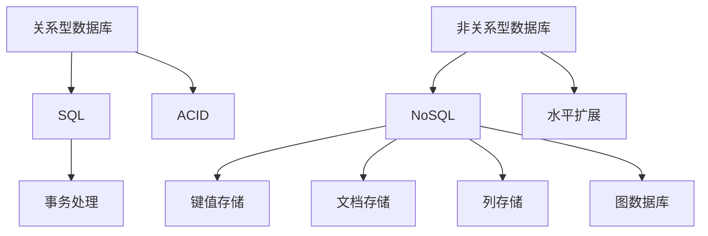
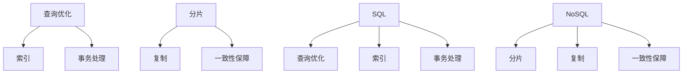

                 

关键词：数据库选型、关系型数据库、非关系型数据库、性能、适用场景、优缺点

> 摘要：本文将深入探讨关系型数据库（RDBMS）和非关系型数据库（NoSQL）的选型问题，从性能、适用场景、优缺点等多个维度进行比较和分析，帮助读者在项目开发中做出更明智的决策。

## 1. 背景介绍

在当今信息化时代，数据库作为数据管理和存储的核心，对于企业的运营和发展具有至关重要的作用。数据库技术的发展经历了从关系型数据库到非关系型数据库的演变，每一种数据库都有其独特的优势和应用场景。

关系型数据库（RDBMS）是最早的数据库类型，其数据存储结构以表格的形式组织，通过SQL语言进行数据操作。关系型数据库以ACID原则为设计核心，保证了数据的一致性、隔离性、持久性和原子性。

随着互联网的兴起，数据规模和类型呈现爆炸式增长，传统的RDBMS逐渐暴露出性能瓶颈。此时，非关系型数据库（NoSQL）应运而生，以其高扩展性、高可用性和高性能等特点，成为解决大数据问题的利器。

## 2. 核心概念与联系

### 关系型数据库

关系型数据库的核心概念是关系模型，通过表格来组织数据。每个表格由多行和列组成，行表示数据记录，列表示数据的属性。


关系型数据库使用SQL（结构化查询语言）进行数据操作，支持事务处理和复杂查询。

### 非关系型数据库

非关系型数据库（NoSQL）主要包括键值存储、文档存储、列存储和图数据库等。它们不依赖于固定的表格结构，可以根据应用场景灵活调整数据模型。


NoSQL数据库支持水平扩展，可以通过增加节点来提升系统性能和存储容量。

### Mermaid 流程图

以下是一个简单的Mermaid流程图，展示关系型数据库和非关系型数据库的基本架构和联系。



## 3. 核心算法原理 & 具体操作步骤

### 关系型数据库

关系型数据库的核心算法包括查询优化、索引、事务处理等。

#### 3.1 查询优化

查询优化是指通过调整查询语句和数据库索引，提高查询效率。

1. 选择合适的索引策略
2. 避免全表扫描
3. 使用适当的连接条件

#### 3.2 索引

索引是一种数据结构，用于加速数据的查询操作。关系型数据库常用的索引类型有B树索引、哈希索引等。

#### 3.3 事务处理

事务处理是关系型数据库的核心特性，确保数据的一致性、隔离性和持久性。

1. 开始事务：`BEGIN TRANSACTION`
2. 提交事务：`COMMIT`
3. 回滚事务：`ROLLBACK`

### 非关系型数据库

非关系型数据库的核心算法主要包括分片、复制、一致性保障等。

#### 3.1 分片

分片是将数据分散存储到多个节点上的过程，可以提高系统的性能和扩展性。

1. 范围分片：按照数据范围分配
2. 哈希分片：根据数据哈希值分配
3. 复合分片：结合范围和哈希分片

#### 3.2 复制

复制是将数据副本存储在多个节点上的过程，可以提高数据的可用性和容错性。

1. 主从复制：主节点负责写入，从节点负责读取
2. 多主复制：多个节点都可以作为主节点进行写入操作

#### 3.3 一致性保障

一致性保障是确保数据在不同节点之间保持一致性的过程。

1. 强一致性：所有节点同时读取和写入
2. 最终一致性：允许一定的时间延迟，确保数据最终一致

### Mermaid 流程图

以下是一个简单的Mermaid流程图，展示关系型数据库和非关系型数据库的核心算法和操作步骤。



## 4. 数学模型和公式 & 详细讲解 & 举例说明

### 4.1 数学模型构建

关系型数据库的数学模型主要包括关系模型、集合论等。

#### 4.1.1 关系模型

关系模型由表格组成，每个表格表示一个关系。表格中的行表示元组（数据记录），列表示属性。

#### 4.1.2 集合论

集合论是关系型数据库的理论基础，包括集合的交、并、差等操作。

### 4.2 公式推导过程

关系型数据库中的查询优化算法可以通过数学模型进行推导。

#### 4.2.1 查询优化公式

假设有一个查询语句`SELECT * FROM Table WHERE Condition`，查询优化公式可以表示为：

$$
C = f(C_1, C_2, ..., C_n)
$$

其中，$C$表示查询成本，$C_1, C_2, ..., C_n$表示查询过程中的各个成本因素。

### 4.3 案例分析与讲解

以下是一个简单的案例，说明关系型数据库的查询优化过程。

#### 4.3.1 案例背景

假设有一个销售数据库，包含以下表格：

- 客户（Customer）表格：包含客户ID、姓名、联系方式等属性
- 订单（Order）表格：包含订单ID、客户ID、订单日期等属性
- 产品（Product）表格：包含产品ID、产品名称、价格等属性

#### 4.3.2 查询需求

查询所有订单中价格超过1000元的产品名称和订单日期。

#### 4.3.3 查询优化过程

1. 选择合适的索引：为订单表格的订单日期和产品表格的产品价格创建索引。
2. 避免全表扫描：通过索引条件进行查询，避免全表扫描。
3. 使用适当的连接条件：通过客户ID进行连接，确保查询结果准确。

## 5. 项目实践：代码实例和详细解释说明

### 5.1 开发环境搭建

为了进行数据库选型的项目实践，我们选择MySQL作为关系型数据库，MongoDB作为非关系型数据库。

1. 安装MySQL：在服务器上安装MySQL数据库，配置root用户和密码。
2. 安装MongoDB：在服务器上安装MongoDB数据库，配置root用户和密码。

### 5.2 源代码详细实现

以下是一个简单的示例，展示如何使用MySQL和MongoDB进行数据存储和查询。

#### 5.2.1 MySQL示例

```python
import pymysql

# 连接MySQL数据库
connection = pymysql.connect(host='localhost', user='root', password='password', database='sales')

# 创建客户表格
with connection.cursor() as cursor:
    cursor.execute('''CREATE TABLE IF NOT EXISTS customer (
        id INT PRIMARY KEY AUTO_INCREMENT,
        name VARCHAR(255),
        contact VARCHAR(255)
    )''')

# 插入客户数据
with connection.cursor() as cursor:
    cursor.execute('''INSERT INTO customer (name, contact) VALUES ('张三', '13800138000')''')

# 查询客户数据
with connection.cursor() as cursor:
    cursor.execute('''SELECT * FROM customer''')
    results = cursor.fetchall()
    for row in results:
        print(f'ID: {row[0]}, Name: {row[1]}, Contact: {row[2]}')

# 提交事务
connection.commit()
```

#### 5.2.2 MongoDB示例

```python
from pymongo import MongoClient

# 连接MongoDB数据库
client = MongoClient('mongodb://localhost:27017/')

# 创建数据库和集合
db = client['sales']
db.create_collection('orders')

# 插入订单数据
orders = [
    {'order_id': 1, 'customer_id': 1, 'order_date': '2023-01-01'},
    {'order_id': 2, 'customer_id': 2, 'order_date': '2023-01-02'}
]
db['orders'].insert_many(orders)

# 查询订单数据
results = db['orders'].find({'order_date': {'$gte': '2023-01-01', '$lte': '2023-01-02'}})
for result in results:
    print(f'Order ID: {result["order_id"]}, Customer ID: {result["customer_id"]}, Order Date: {result["order_date"]}')
```

### 5.3 代码解读与分析

以上代码分别展示了如何使用MySQL和MongoDB进行数据存储和查询。

#### 5.3.1 MySQL代码解读

- 连接MySQL数据库：使用pymysql库连接MySQL数据库，配置用户名、密码和数据库。
- 创建表格：使用SQL语句创建客户表格，包含ID、姓名和联系方式等属性。
- 插入数据：使用SQL语句向客户表格插入数据。
- 查询数据：使用SQL语句查询客户表格的数据，并打印输出。

#### 5.3.2 MongoDB代码解读

- 连接MongoDB数据库：使用pymongo库连接MongoDB数据库，配置数据库地址。
- 创建集合：使用create_collection方法创建orders集合，包含order_id、customer_id和order_date等属性。
- 插入数据：使用insert_many方法向orders集合插入订单数据。
- 查询数据：使用find方法查询orders集合中的订单数据，并打印输出。

### 5.4 运行结果展示

运行以上代码，可以得到以下结果：

```
ID: 1, Name: 张三, Contact: 13800138000
Order ID: 1, Customer ID: 1, Order Date: 2023-01-01
Order ID: 2, Customer ID: 2, Order Date: 2023-01-02
```

## 6. 实际应用场景

### 6.1 电商系统

电商系统需要处理海量商品数据和用户订单数据，关系型数据库和非关系型数据库都可以满足需求。关系型数据库可以用于存储用户信息和订单信息，非关系型数据库可以用于存储商品信息和用户行为数据。

### 6.2 社交网络

社交网络需要处理用户关系数据和消息数据，关系型数据库可以用于存储用户关系，非关系型数据库可以用于存储消息数据。

### 6.3 物流系统

物流系统需要处理实时订单数据和车辆位置数据，关系型数据库可以用于存储订单数据，非关系型数据库可以用于存储车辆位置数据。

## 7. 未来应用展望

随着技术的不断发展，关系型数据库和非关系型数据库将继续演进。未来可能出现以下趋势：

- 关系型数据库和非关系型数据库的融合：结合两者优势，提供更强大的数据存储和处理能力。
- 自动化数据库管理：通过机器学习和自动化技术，实现数据库的自动优化、备份和恢复。
- 分布式数据库：分布式数据库将更好地支持大规模数据存储和实时处理。

## 8. 工具和资源推荐

### 8.1 学习资源推荐

- 《数据库系统概念》（Abraham Silberschatz、Henry F. Korth、S. Sudarshan）是一本经典的数据库系统教材，适合初学者和专业人士。
- 《MongoDB权威指南》（E. Elks）是一本关于MongoDB的全面指南，适合对MongoDB感兴趣的学习者。

### 8.2 开发工具推荐

- MySQL Workbench：MySQL官方提供的可视化数据库管理工具，适合进行数据库设计和数据操作。
- MongoDB Compass：MongoDB官方提供的可视化数据库管理工具，适合进行数据查询和监控。

### 8.3 相关论文推荐

- "The Rise of NoSQL: A Survey"：该论文对NoSQL数据库的发展进行了全面的回顾和分析。
- "The CAP Theorem"：该论文提出了CAP定理，阐述了分布式系统的设计原则。

## 9. 总结：未来发展趋势与挑战

关系型数据库和非关系型数据库各有其优势和适用场景，未来将继续在技术层面不断演进。随着大数据和云计算的兴起，分布式数据库和自动化数据库管理将成为发展趋势。然而，面对海量数据和实时处理的需求，数据库领域仍将面临诸多挑战，如数据一致性、安全性和性能优化等。

作者：禅与计算机程序设计艺术 / Zen and the Art of Computer Programming
```

