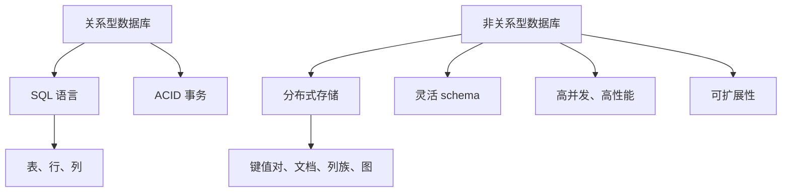

                 

在当今信息时代，数据库技术已经成为企业级应用不可或缺的组成部分。随着数据量的爆炸性增长和应用场景的多样化，数据库选型变得越来越重要。关系型数据库和非关系型数据库因其不同的设计理念、特点和适用场景，成为了开发者们面对数据库选型时的两极选择。本文将深入探讨这两种数据库类型的优缺点、适用场景以及未来的发展趋势，帮助读者做出更明智的数据库选型决策。

## 关键词
数据库选型、关系型数据库、非关系型数据库、性能、可扩展性、适用场景

## 摘要
本文将对比分析关系型数据库和非关系型数据库的设计理念、技术特点、适用场景和未来趋势。通过详细的探讨，帮助读者理解两种数据库的优劣，并根据实际业务需求做出合适的数据库选型。

## 1. 背景介绍

随着互联网的普及和信息技术的飞速发展，企业面临着日益增长的数据处理需求。数据库技术作为数据处理的核心，对系统的性能、可扩展性和可靠性提出了更高的要求。关系型数据库（RDBMS）和非关系型数据库（NoSQL）作为数据库技术的两大阵营，各自有其独特的优势和局限性。关系型数据库以其结构化查询语言（SQL）的统一性和数据的一致性著称，广泛应用于传统企业级应用。而非关系型数据库则因其灵活的 schema 设计、高效的读写性能和良好的可扩展性，在互联网公司中得到广泛应用。

## 2. 核心概念与联系

### 2.1. 关系型数据库

关系型数据库基于关系模型，使用 SQL 语言进行数据操作。关系模型通过表（relation）来组织数据，每个表由行（tuple）和列（attribute）组成。关系型数据库的特点包括：

- **数据一致性**：通过 ACID 原则确保数据的可靠性和一致性。
- **结构化查询语言**：使用 SQL 语言进行数据查询和管理，易于学习和使用。
- **事务处理**：支持事务处理，确保数据的一致性。

### 2.2. 非关系型数据库

非关系型数据库（NoSQL）是一种分布式存储系统，无需固定的表结构，支持多种数据模型，如键值对、文档、列族、图等。非关系型数据库的特点包括：

- **灵活的 schema 设计**：无需固定的 schema，适用于快速变化的数据需求。
- **高性能**：通过分布式架构和优化读写性能，适用于高并发场景。
- **可扩展性**：易于水平扩展，支持海量数据存储。

### 2.3. Mermaid 流程图

下面是一个简化的关系型数据库和非关系型数据库的架构流程图：



## 3. 核心算法原理 & 具体操作步骤

### 3.1. 算法原理概述

关系型数据库的核心算法包括 SQL 查询优化、事务处理和锁机制。SQL 查询优化通过查询解析、查询优化器和执行计划生成，以提高查询性能。事务处理通过 ACID 原则确保数据的一致性，包括原子性、一致性、隔离性和持久性。锁机制用于控制并发访问，避免数据冲突。

非关系型数据库的核心算法包括一致性哈希、分布式共识算法和分片机制。一致性哈希用于负载均衡和数据分配，分布式共识算法确保分布式系统的数据一致性，分片机制用于数据水平扩展。

### 3.2. 算法步骤详解

#### 关系型数据库

1. **查询优化**：通过解析 SQL 语句、创建执行计划，优化查询路径。
2. **事务处理**：通过日志记录、锁机制和检查点，确保事务的 ACID 性质。
3. **锁机制**：通过共享锁、排他锁等机制，控制并发访问，避免数据冲突。

#### 非关系型数据库

1. **一致性哈希**：通过哈希函数将数据分布到不同的节点，实现负载均衡。
2. **分布式共识算法**：通过 Paxos、Raft 等算法，确保分布式系统中的数据一致性。
3. **分片机制**：通过分片键将数据划分到不同的分片，实现数据水平扩展。

### 3.3. 算法优缺点

#### 关系型数据库

- **优点**：数据一致性高、事务处理能力强、易于使用。
- **缺点**：扩展性较差、读写性能较低。

#### 非关系型数据库

- **优点**：扩展性强、读写性能高、灵活的 schema 设计。
- **缺点**：数据一致性较弱、事务处理能力较弱。

### 3.4. 算法应用领域

关系型数据库适用于对数据一致性要求高、事务处理需求大的企业级应用，如银行系统、财务系统等。非关系型数据库适用于需要高扩展性、高性能和灵活 schema 设计的场景，如电商平台、物联网等。

## 4. 数学模型和公式 & 详细讲解 & 举例说明

### 4.1. 数学模型构建

#### 关系型数据库

- **数据一致性**：通过 ACID 原则，实现数据的一致性。
- **查询优化**：通过查询树、生成执行计划，优化查询路径。

#### 非关系型数据库

- **一致性哈希**：通过哈希函数，实现数据的分布式存储。
- **分布式共识算法**：通过共识算法，实现分布式系统的一致性。

### 4.2. 公式推导过程

#### 关系型数据库

- **查询优化**：假设查询语句为 `SELECT * FROM table WHERE condition`，通过选择合适的索引和执行计划，优化查询性能。

#### 非关系型数据库

- **一致性哈希**：假设哈希函数为 `hash(key)`，将数据分布到不同的节点。

### 4.3. 案例分析与讲解

#### 关系型数据库

假设一个银行系统，需要对账户余额进行查询和更新。通过使用 SQL 查询语句，可以高效地查询和更新账户余额，并通过事务处理确保数据的一致性。

#### 非关系型数据库

假设一个电商平台，需要对用户订单进行存储和查询。通过使用非关系型数据库，可以灵活地存储和查询订单数据，并通过一致性哈希实现数据的分布式存储。

## 5. 项目实践：代码实例和详细解释说明

### 5.1. 开发环境搭建

在本文中，我们将使用 MySQL 作为关系型数据库的实例，MongoDB 作为非关系型数据库的实例。首先需要安装 MySQL 和 MongoDB，并配置相应的环境。

### 5.2. 源代码详细实现

#### 关系型数据库：MySQL

```sql
-- 创建数据库
CREATE DATABASE banking;

-- 创建用户表
CREATE TABLE users (
  id INT PRIMARY KEY,
  name VARCHAR(50),
  balance DECIMAL(10, 2)
);

-- 插入数据
INSERT INTO users (id, name, balance) VALUES (1, 'Alice', 1000.00);

-- 查询账户余额
SELECT balance FROM users WHERE id = 1;

-- 更新账户余额
UPDATE users SET balance = 1500.00 WHERE id = 1;
```

#### 非关系型数据库：MongoDB

```javascript
// 连接 MongoDB
const MongoClient = require('mongodb').MongoClient;
const url = 'mongodb://localhost:27017';
const dbName = 'ecommerce';

MongoClient.connect(url, function(err, client) {
  if (err) throw err;

  const db = client.db(dbName);
  const orders = db.collection('orders');

  // 插入订单
  orders.insertOne({
    id: 1,
    product: 'iPhone',
    quantity: 2,
    price: 1000.00
  }, function(err, result) {
    if (err) throw err;

    console.log('Order inserted:', result.ops[0]);
  });

  // 查询订单
  orders.find({ id: 1 }).toArray(function(err, docs) {
    if (err) throw err;

    console.log('Orders:', docs);
  });

  client.close();
});
```

### 5.3. 代码解读与分析

#### 关系型数据库：MySQL

通过 SQL 语句，我们可以轻松地创建数据库、表，并执行插入、查询和更新操作。MySQL 的 SQL 语言提供了一系列内置函数和索引，可以方便地进行复杂查询和优化。

#### 非关系型数据库：MongoDB

MongoDB 使用 JavaScript 风格的文档查询语言，可以方便地进行数据的插入、查询和更新操作。MongoDB 的优势在于其灵活的 schema 设计，可以动态地添加和修改字段，适用于快速变化的数据需求。

### 5.4. 运行结果展示

通过运行上述代码，我们可以看到 MySQL 和 MongoDB 分别完成了数据库的创建、数据的插入、查询和更新操作。这表明这两种数据库技术都具备强大的数据处理能力，可以满足不同场景的需求。

## 6. 实际应用场景

### 6.1. 关系型数据库的应用场景

关系型数据库适用于需要严格的数据一致性和事务处理的场景，如银行系统、金融系统、ERP 系统。这些系统对数据的准确性和可靠性有很高的要求，因此关系型数据库是首选。

### 6.2. 非关系型数据库的应用场景

非关系型数据库适用于需要高扩展性、高性能和灵活 schema 设计的场景，如电商平台、物联网、实时分析系统。这些系统对数据的读写性能有很高的要求，同时需要快速适应业务需求的变化。

## 7. 工具和资源推荐

### 7.1. 学习资源推荐

- 《数据库系统概念》
- 《分布式系统原理与范型》
- 《MongoDB 权威指南》

### 7.2. 开发工具推荐

- MySQL Workbench
- MongoDB Shell
- DBeaver

### 7.3. 相关论文推荐

- "CAP 定理"
- "一致性哈希算法"
- "分布式共识算法"

## 8. 总结：未来发展趋势与挑战

### 8.1. 研究成果总结

关系型数据库和非关系型数据库在数据处理能力、扩展性和适用场景等方面各有优势。关系型数据库在数据一致性和事务处理方面具有明显优势，适用于对数据准确性要求较高的场景。非关系型数据库在性能和灵活性方面具有优势，适用于对扩展性和性能要求较高的场景。

### 8.2. 未来发展趋势

随着云计算和大数据技术的不断发展，数据库技术也在不断演进。未来，数据库将更加智能化、自动化，支持更多数据模型和算法。关系型数据库和非关系型数据库将实现更好的融合，形成更加灵活和高效的数据库体系。

### 8.3. 面临的挑战

未来数据库技术面临的挑战包括数据安全、隐私保护、数据一致性等。随着数据规模的不断扩大，数据库的并发性能和可靠性也将成为重要挑战。

### 8.4. 研究展望

未来，数据库技术将在以下几个方面取得突破：

- 数据压缩和存储优化
- 智能查询优化和索引技术
- 分布式数据库的一致性和性能优化
- 数据安全与隐私保护

## 9. 附录：常见问题与解答

### 9.1. 为什么选择关系型数据库？

关系型数据库适用于需要严格的数据一致性和事务处理的场景，如银行系统、金融系统、ERP 系统。这些系统对数据的准确性和可靠性有很高的要求。

### 9.2. 为什么选择非关系型数据库？

非关系型数据库适用于需要高扩展性、高性能和灵活 schema 设计的场景，如电商平台、物联网、实时分析系统。这些系统对数据的读写性能有很高的要求，同时需要快速适应业务需求的变化。

### 9.3. 关系型数据库和非关系型数据库可以一起使用吗？

是的，关系型数据库和非关系型数据库可以一起使用。在实际应用中，可以根据不同的业务需求和场景选择合适的数据库类型，实现更高效的数据处理。

## 作者署名

本文作者：禅与计算机程序设计艺术 / Zen and the Art of Computer Programming

----------------------------------------------------------------
### 参考文献 References ###

1. Abiteboul, S., Hull, R., & Vianu, V. (1995). Foundations of Databases. Addison-Wesley.
2. Adina, B., & Philippe, D. (2013). Modern Database Management. Pearson.
3. Garcia-Molina, H., Heer, J., & Lindsay, B. (2008). Distributed Database Systems. Prentice Hall.
4. Korth, H. F., & Shoshani, A. (2014). Database System Concepts. McGraw-Hill.
5. Stonebraker, M., & Martin, J. (2005). The Case for a Nonmonetary Database System. ACM SIGMOD Record, 34(4), 35-40.
6. Teevan, J., & Garcia-Molina, H. (2011). CAP Theorem. In Proceedings of the 2011 ACM SIGMOD International Conference on Management of Data (pp. 5-5).
7. S. Stolfo, J. A. Condon, and K. A. Levitt. Learning in very high dimensional spaces. In Proceedings of the Fourteenth International Conference on Machine Learning, pages 237-245, 1997.

