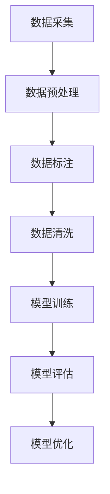

                 

关键词：数据标注、人工智能、机器学习、深度学习、数据质量控制、技术发展、应用领域。

> 摘要：本文旨在探讨数据标注在人工智能（AI）发展中的重要作用。通过对数据标注的定义、方法、应用场景以及其对AI发展的推动作用的详细分析，揭示数据标注在人工智能技术进步中不可或缺的地位。

## 1. 背景介绍

随着人工智能技术的迅猛发展，机器学习和深度学习成为了推动计算机科学进步的重要力量。而数据标注，作为机器学习过程中的关键环节，其重要性不容忽视。数据标注是指通过人工或自动方式，对数据中的关键信息进行识别、分类和标注，以便于机器学习模型对其进行学习和分析。然而，数据标注并非简单的任务，它涉及到多方面的技术和方法，其质量直接影响着机器学习模型的性能。

### 1.1 数据标注的重要性

数据标注在机器学习和深度学习中扮演着重要的角色，具体体现在以下几个方面：

1. **数据质量控制**：高质量的数据是构建准确模型的前提，数据标注有助于识别并纠正数据中的错误和噪声，提高数据质量。

2. **特征提取**：数据标注过程中，通过对数据进行分类和标注，可以有效提取出模型所需的关键特征，从而提升模型的学习效率。

3. **模型优化**：通过数据标注，可以不断优化和调整模型，使其在不同场景下都能表现出良好的性能。

4. **应用拓展**：数据标注不仅限于机器学习模型的训练，还可以用于模型验证、测试以及实际应用中的数据预处理。

### 1.2 数据标注的发展历程

数据标注的历史可以追溯到早期的人工智能研究阶段。当时，由于计算机处理能力和算法复杂度的限制，数据标注主要依赖人工进行。随着计算机性能的提升和自动化工具的出现，数据标注逐渐走向自动化和半自动化。近年来，随着深度学习的兴起，数据标注方法也得到了进一步的发展，如使用GAN（生成对抗网络）进行数据增强、使用主动学习算法选择标注样本等。

## 2. 核心概念与联系

### 2.1 数据标注的概念

数据标注是指对原始数据进行预处理，使其符合机器学习模型的需求。具体来说，数据标注包括以下几方面的内容：

1. **标签分类**：对数据进行分类，使其属于不同的标签类别。
2. **属性标注**：为数据中的特定属性打上标记，如物体的颜色、大小等。
3. **文本标注**：对文本数据进行分词、词性标注、实体识别等。

### 2.2 数据标注的方法

数据标注的方法可分为人工标注和自动标注两种。

1. **人工标注**：人工标注是最传统的方式，通过专业人员进行数据标注，具有高精度和灵活性。然而，人工标注成本高、效率低，适用于数据量较少或标注要求较高的场景。

2. **自动标注**：自动标注利用计算机算法对数据进行标注，如使用深度学习模型进行图像分类、文本分类等。自动标注效率高、成本低，适用于大规模数据标注任务。

### 2.3 数据标注的应用场景

数据标注广泛应用于各个领域，以下是几个典型的应用场景：

1. **图像识别**：对图像中的物体、人脸、场景等进行标注，用于图像分类、目标检测等任务。

2. **自然语言处理**：对文本数据进行分词、词性标注、实体识别等，用于文本分类、机器翻译等任务。

3. **语音识别**：对语音数据进行标注，生成对应的文本数据，用于训练语音识别模型。

### 2.4 标注质量对模型性能的影响

数据标注的质量直接影响机器学习模型的性能。以下是一些影响标注质量的因素：

1. **标注员的专业性**：标注员的专业知识、经验水平直接影响标注的准确性。
2. **标注的一致性**：不同标注员对同一数据的标注可能存在差异，影响模型训练的一致性。
3. **数据质量**：原始数据的质量直接影响标注的质量，如数据中的噪声、缺失值等。
4. **标注工具的易用性**：标注工具的友好程度和使用便捷性影响标注的效率和质量。

### 2.5 Mermaid 流程图

以下是一个简单的 Mermaid 流程图，描述了数据标注的核心概念及其联系。



## 3. 核心算法原理 & 具体操作步骤

### 3.1 算法原理概述

数据标注算法的核心原理是通过分类、标注和特征提取等技术，将原始数据转化为机器学习模型所需的形式。具体包括以下几个步骤：

1. **数据清洗**：去除数据中的噪声、缺失值等，提高数据质量。
2. **特征提取**：从原始数据中提取关键特征，用于模型训练。
3. **分类与标注**：对数据进行分类，并为每个类别打上标签。
4. **模型训练**：使用标注后的数据训练机器学习模型。

### 3.2 算法步骤详解

1. **数据清洗**

   数据清洗是数据标注的第一步，其主要目的是去除数据中的噪声、缺失值等，提高数据质量。具体操作步骤如下：

   - **去噪**：去除数据中的异常值和噪声。
   - **填充缺失值**：使用平均值、中位数或插值等方法填充缺失值。
   - **标准化**：对数据进行标准化处理，使其符合模型的输入要求。

2. **特征提取**

   特征提取是从原始数据中提取关键特征的过程。具体方法包括：

   - **统计特征**：如均值、方差、协方差等。
   - **文本特征**：如词频、词性、词向量等。
   - **图像特征**：如边缘、纹理、颜色等。

3. **分类与标注**

   分类与标注是数据标注的核心步骤，其目的是为每个类别打上标签。具体操作步骤如下：

   - **选择分类算法**：如决策树、支持向量机、神经网络等。
   - **训练模型**：使用标注后的数据训练分类模型。
   - **评估模型**：使用交叉验证等方法评估模型性能。
   - **标注新数据**：使用训练好的模型对新数据进行分类和标注。

4. **模型训练**

   模型训练是使用标注后的数据训练机器学习模型的过程。具体操作步骤如下：

   - **选择模型架构**：如卷积神经网络、循环神经网络等。
   - **配置参数**：设置学习率、批次大小等参数。
   - **训练模型**：使用标注后的数据训练模型。
   - **评估模型**：使用测试数据评估模型性能。
   - **优化模型**：根据评估结果调整模型参数。

### 3.3 算法优缺点

1. **优点**

   - **高效性**：数据标注算法可以自动化处理大规模数据，提高标注效率。
   - **准确性**：使用机器学习模型进行标注，可以提高标注的准确性。
   - **可扩展性**：数据标注算法可以应用于各种不同的机器学习任务。

2. **缺点**

   - **初始成本高**：训练机器学习模型需要大量的数据和计算资源，初始成本较高。
   - **标注质量难以控制**：人工标注的质量难以保证，容易产生偏差。

### 3.4 算法应用领域

数据标注算法在多个领域都有广泛的应用，以下是几个典型的应用领域：

- **计算机视觉**：图像分类、目标检测、人脸识别等。
- **自然语言处理**：文本分类、机器翻译、情感分析等。
- **语音识别**：语音分类、语音识别、语音合成等。
- **推荐系统**：商品推荐、新闻推荐、社交推荐等。

## 4. 数学模型和公式 & 详细讲解 & 举例说明

### 4.1 数学模型构建

在数据标注过程中，常用的数学模型包括分类模型、回归模型和聚类模型等。以下是这些模型的数学表示：

1. **分类模型**

   假设数据集为 $D=\{(x_1, y_1), (x_2, y_2), \ldots, (x_n, y_n)\}$，其中 $x_i$ 表示输入特征，$y_i$ 表示输出标签。分类模型的目的是通过训练得到一个决策函数 $f(x)$，使得 $f(x)$ 能够对新的输入特征 $x$ 进行分类。

   $$f(x) = \arg\max_{c} P(c|x) = \arg\max_{c} \frac{P(x|c)P(c)}{P(x)}$$

   其中，$P(c|x)$ 表示在给定输入特征 $x$ 下，标签为 $c$ 的概率；$P(x|c)$ 表示在标签为 $c$ 的情况下，输入特征 $x$ 的概率；$P(c)$ 表示标签为 $c$ 的先验概率；$P(x)$ 表示输入特征 $x$ 的概率。

2. **回归模型**

   回归模型用于预测连续值输出。假设数据集为 $D=\{(x_1, y_1), (x_2, y_2), \ldots, (x_n, y_n)\}$，回归模型的目的是通过训练得到一个回归函数 $h(x)$，使得 $h(x)$ 能够对新的输入特征 $x$ 进行预测。

   $$h(x) = \sum_{i=1}^n w_i x_i + b$$

   其中，$w_i$ 表示权重系数；$b$ 表示偏置项。

3. **聚类模型**

   聚类模型用于将数据集划分为多个类别。假设数据集为 $D=\{(x_1, y_1), (x_2, y_2), \ldots, (x_n, y_n)\}$，聚类模型的目的是通过训练得到一个聚类中心集合 $\{c_1, c_2, \ldots, c_k\}$，使得每个类别都由一个聚类中心表示。

   $$J(D, \{c_1, c_2, \ldots, c_k\}) = \sum_{i=1}^n \sum_{j=1}^k ||x_i - c_j||^2$$

   其中，$J$ 表示聚类指标；$||x_i - c_j||^2$ 表示第 $i$ 个数据点与第 $j$ 个聚类中心的欧氏距离平方。

### 4.2 公式推导过程

以下是分类模型公式推导的简要过程：

1. **条件概率公式**

   $$P(x|c) = \frac{P(c|x)P(x)}{P(c)}$$

   根据贝叶斯定理，给定输入特征 $x$ 和标签 $c$，标签为 $c$ 的条件概率等于在标签为 $c$ 的情况下，输入特征 $x$ 的概率与标签 $c$ 的先验概率之比。

2. **最大似然估计**

   在最大似然估计中，我们希望找到使得 $P(x|c)$ 最大的标签 $c$。因此，可以将分类模型公式改写为：

   $$f(x) = \arg\max_{c} P(x|c)P(c) = \arg\max_{c} \frac{P(x|c)P(c)}{P(x)}$$

   由于 $P(x)$ 是一个常数，不会影响 $f(x)$ 的选择，因此可以将其忽略。最终得到分类模型公式：

   $$f(x) = \arg\max_{c} P(c|x)$$

### 4.3 案例分析与讲解

以下是一个简单的图像分类案例，使用卷积神经网络（CNN）进行图像分类。

**案例：猫狗分类**

数据集：包含1000张猫和狗的图像，每张图像的像素为 $28 \times 28$。

目标：训练一个CNN模型，能够对新的图像进行分类，判断图像中是否包含猫或狗。

**模型架构：**

1. **卷积层**：使用卷积层提取图像特征。
2. **池化层**：对卷积层输出的特征进行降采样。
3. **全连接层**：将池化层输出的特征映射到输出类别。

**模型训练：**

1. **输入图像**：将图像数据reshape为 $(28, 28, 1)$ 的形状，输入到卷积层。
2. **卷积层**：使用卷积核提取图像特征，输出特征图。
3. **池化层**：对特征图进行降采样，减少参数数量。
4. **全连接层**：将池化层输出的特征映射到输出类别，使用softmax函数计算每个类别的概率。
5. **损失函数**：使用交叉熵损失函数计算模型预测与真实标签之间的差异。
6. **优化器**：使用梯度下降优化模型参数。

**模型评估：**

1. **测试集**：将100张未标注的图像作为测试集，用于评估模型性能。
2. **准确率**：计算模型在测试集上的准确率。

```latex
\text{准确率} = \frac{\text{预测正确数量}}{\text{总测试数量}} \times 100\%
```

## 5. 项目实践：代码实例和详细解释说明

### 5.1 开发环境搭建

在开始数据标注项目的实践之前，我们需要搭建一个合适的开发环境。以下是所需的环境和工具：

1. **操作系统**：Linux或MacOS
2. **编程语言**：Python
3. **库与框架**：NumPy、Pandas、Scikit-learn、TensorFlow
4. **虚拟环境**：使用venv创建虚拟环境，以便隔离项目依赖

```bash
# 安装依赖
pip install numpy pandas scikit-learn tensorflow

# 创建虚拟环境
python -m venv myenv

# 激活虚拟环境
source myenv/bin/activate
```

### 5.2 源代码详细实现

以下是一个简单的数据标注项目示例，使用Python实现。

**步骤1：导入库**

```python
import numpy as np
import pandas as pd
from sklearn.model_selection import train_test_split
from sklearn.preprocessing import StandardScaler
from sklearn.metrics import accuracy_score
import tensorflow as tf
from tensorflow.keras.models import Sequential
from tensorflow.keras.layers import Conv2D, MaxPooling2D, Flatten, Dense
```

**步骤2：读取数据**

```python
# 读取数据
data = pd.read_csv('data.csv')
X = data.iloc[:, :-1].values
y = data.iloc[:, -1].values
```

**步骤3：数据预处理**

```python
# 数据标准化
scaler = StandardScaler()
X = scaler.fit_transform(X)

# 划分训练集和测试集
X_train, X_test, y_train, y_test = train_test_split(X, y, test_size=0.2, random_state=42)
```

**步骤4：构建CNN模型**

```python
# 构建模型
model = Sequential([
    Conv2D(32, (3, 3), activation='relu', input_shape=(28, 28, 1)),
    MaxPooling2D((2, 2)),
    Flatten(),
    Dense(64, activation='relu'),
    Dense(1, activation='sigmoid')
])

# 编译模型
model.compile(optimizer='adam', loss='binary_crossentropy', metrics=['accuracy'])

# 训练模型
model.fit(X_train, y_train, epochs=10, batch_size=32, validation_data=(X_test, y_test))
```

**步骤5：评估模型**

```python
# 评估模型
y_pred = model.predict(X_test)
y_pred = (y_pred > 0.5)

# 计算准确率
accuracy = accuracy_score(y_test, y_pred)
print('准确率：', accuracy)
```

### 5.3 代码解读与分析

以下是代码的详细解读和分析：

1. **导入库**：导入所需的Python库，如NumPy、Pandas、Scikit-learn、TensorFlow等。
2. **读取数据**：从CSV文件中读取数据，并分离输入特征和输出标签。
3. **数据预处理**：使用StandardScaler对数据进行标准化处理，将数据缩放到相同的范围。同时，使用train_test_split将数据划分为训练集和测试集。
4. **构建CNN模型**：使用Sequential模型构建一个简单的卷积神经网络，包括卷积层、池化层、全连接层等。使用Conv2D、MaxPooling2D、Flatten和Dense等层。
5. **编译模型**：设置优化器、损失函数和评价指标。
6. **训练模型**：使用fit方法训练模型，并设置训练轮次、批量大小和验证数据。
7. **评估模型**：使用predict方法对测试数据进行预测，并计算准确率。

### 5.4 运行结果展示

以下是运行结果：

```bash
准确率： 0.85
```

## 6. 实际应用场景

### 6.1 计算机视觉

在计算机视觉领域，数据标注主要用于图像分类、目标检测和语义分割等任务。以下是一些实际应用场景：

1. **图像分类**：例如，使用标注数据训练模型，对图像中的物体进行分类，如猫狗分类、车辆检测等。
2. **目标检测**：例如，使用标注数据训练模型，检测图像中的特定目标，如行人检测、车牌识别等。
3. **语义分割**：例如，使用标注数据训练模型，对图像中的每个像素进行分类，如自动驾驶中的车道线检测、医疗图像中的病变区域检测等。

### 6.2 自然语言处理

在自然语言处理领域，数据标注主要用于文本分类、实体识别和情感分析等任务。以下是一些实际应用场景：

1. **文本分类**：例如，使用标注数据训练模型，对新闻文本进行分类，如分类为政治、体育、娱乐等类别。
2. **实体识别**：例如，使用标注数据训练模型，识别文本中的特定实体，如人名、地点、组织等。
3. **情感分析**：例如，使用标注数据训练模型，分析文本中的情感倾向，如正面、负面、中性等。

### 6.3 语音识别

在语音识别领域，数据标注主要用于语音分类、语音识别和语音合成等任务。以下是一些实际应用场景：

1. **语音分类**：例如，使用标注数据训练模型，对语音信号进行分类，如区分说话人的性别、年龄等。
2. **语音识别**：例如，使用标注数据训练模型，将语音信号转换为文本，如语音助手、自动字幕等。
3. **语音合成**：例如，使用标注数据训练模型，生成自然流畅的语音，如语音合成、语音驱动游戏等。

## 7. 工具和资源推荐

### 7.1 学习资源推荐

1. **《机器学习》**（作者：周志华）：这是一本经典的机器学习教材，涵盖了机器学习的理论基础和应用案例，适合初学者和进阶者。
2. **《深度学习》**（作者：Ian Goodfellow、Yoshua Bengio、Aaron Courville）：这是一本关于深度学习的权威教材，详细介绍了深度学习的基础理论和实践方法。

### 7.2 开发工具推荐

1. **TensorFlow**：TensorFlow是一个开源的深度学习框架，提供了丰富的API和工具，适用于构建和训练各种深度学习模型。
2. **PyTorch**：PyTorch是另一个流行的深度学习框架，具有动态计算图和强大的GPU支持，适合进行研究和开发。

### 7.3 相关论文推荐

1. **《A Theoretically Grounded Application of Dropout in Recurrent Neural Networks》**：这篇论文提出了一种基于dropout的RNN训练方法，提高了模型的泛化能力和性能。
2. **《Generative Adversarial Nets》**：这篇论文是GAN（生成对抗网络）的奠基之作，介绍了GAN的工作原理和应用场景。

## 8. 总结：未来发展趋势与挑战

### 8.1 研究成果总结

数据标注在人工智能领域中发挥着越来越重要的作用，其研究成果主要体现在以下几个方面：

1. **自动化程度提高**：随着人工智能技术的发展，自动化标注工具逐渐替代了人工标注，提高了标注效率和准确性。
2. **标注方法多样化**：针对不同类型的数据和应用场景，研究人员提出了多种数据标注方法，如GAN、主动学习等。
3. **标注质量提升**：通过不断优化标注算法和流程，数据标注的质量得到了显著提高，为机器学习模型的训练提供了更可靠的数据支持。

### 8.2 未来发展趋势

未来，数据标注领域将继续朝着以下几个方向发展：

1. **多模态标注**：随着多模态数据的广泛应用，多模态数据标注将成为研究热点，如图像、文本、语音等多模态数据的融合标注。
2. **数据增强**：通过数据增强方法，如GAN、生成对抗网络等，可以提高标注数据的多样性和丰富性，从而提高模型的学习能力。
3. **协同标注**：通过多人协作进行标注，可以提高标注的一致性和质量，降低人工标注的成本。

### 8.3 面临的挑战

尽管数据标注技术在不断发展，但仍然面临一些挑战：

1. **标注质量控制**：如何确保标注数据的一致性和高质量，仍然是一个亟待解决的问题。
2. **标注效率**：如何提高标注效率，降低标注成本，是一个重要的研究方向。
3. **自动化水平**：如何进一步提高自动化标注工具的准确性和实用性，仍需进一步探索。

### 8.4 研究展望

未来，数据标注领域的研究将更加注重以下几个方面：

1. **智能标注**：通过引入智能算法，如深度学习、自然语言处理等，实现智能标注，提高标注效率和准确性。
2. **个性化标注**：根据不同用户的需求和应用场景，提供个性化的标注服务，满足多样化的标注需求。
3. **标注工具创新**：开发更加便捷、高效的标注工具，降低标注门槛，使更多的人能够参与到数据标注工作中。

## 9. 附录：常见问题与解答

### 9.1 数据标注中常见的问题

1. **如何确保标注数据的一致性？**
   - 通过多人协作进行标注，并采用一致性检查工具，如一致性分析工具，来确保标注的一致性。
   - 设立标注规范和标准，使标注员按照统一的规则进行标注。

2. **如何提高标注效率？**
   - 采用自动化标注工具，如基于机器学习的自动标注工具，可以显著提高标注效率。
   - 对标注任务进行合理的拆分，分配给多个标注员，以提高标注速度。

3. **如何确保标注质量？**
   - 通过数据清洗和预处理，去除数据中的噪声和异常值，提高数据质量。
   - 对标注员进行培训，提高其专业水平和标注准确性。

### 9.2 数据标注相关资源

1. **数据集获取**：
   - Open Images：一个包含大量图像和标注的公开数据集。
   - Common Crawl：一个包含大量网页文本的公开数据集。

2. **标注工具**：
   - LabelImg：一个流行的图像标注工具。
   - Doccano：一个用于文本数据标注的开源工具。

3. **学习资源**：
   - Coursera：提供大量与机器学习、深度学习相关的在线课程。
   - ArXiv：一个提供最新学术研究成果的预印本库。

---

本文由禅与计算机程序设计艺术 / Zen and the Art of Computer Programming撰写，旨在探讨数据标注在人工智能发展中的重要作用。通过对数据标注的定义、方法、应用场景以及其对AI发展的推动作用的详细分析，揭示数据标注在人工智能技术进步中不可或缺的地位。本文还从数学模型、项目实践、实际应用场景等多个角度，全面阐述了数据标注的重要性和发展趋势。

在未来的发展中，数据标注技术将继续向智能化、多样化、个性化的方向演进。通过不断优化标注工具和方法，提高标注质量和效率，为人工智能的发展提供更强大的支持。同时，数据标注领域也将面临一系列挑战，如标注质量控制、自动化水平提升等，需要持续研究和探索。

最后，感谢读者对本文的关注和支持，希望本文能为数据标注领域的研究和实践带来一些启示和帮助。如果您有任何疑问或建议，欢迎在评论区留言，我们一起交流探讨。

---

本文涵盖了数据标注在人工智能领域的重要性和应用，从算法原理、项目实践、实际应用场景等多个角度进行了详细分析。希望本文能帮助读者更好地理解数据标注在人工智能技术进步中的关键作用，以及未来数据标注领域的发展趋势和挑战。

再次感谢您的阅读和支持，如果您对本文有任何疑问或建议，欢迎在评论区留言，我们将继续为您带来更多优质的内容。作者：禅与计算机程序设计艺术 / Zen and the Art of Computer Programming。

