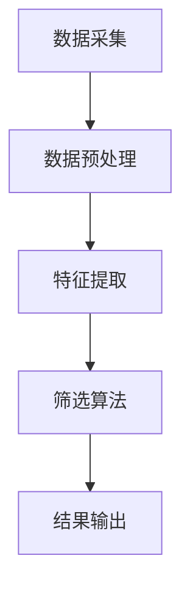

                 

关键词：数据筛选，智能技术，数据挖掘，算法优化，应用场景

> 摘要：随着大数据时代的到来，数据筛选技术的进步成为关键。本文将深入探讨智能筛选技术的核心概念、算法原理、数学模型以及实际应用，分析其未来发展趋势与面临的挑战，为读者揭示数据海洋中的知识明珠。

## 1. 背景介绍

在当今信息化社会中，数据无处不在，无论是社交网络、电子商务、物联网，还是政府管理、医疗健康，都产生了海量的数据。这些数据中蕴藏着巨大的价值，但同时也面临着如何有效提取和利用的挑战。数据筛选技术作为一种数据预处理方法，旨在从大量数据中快速准确地提取出有价值的信息。

传统的数据筛选方法往往依赖于手工编写规则，效率低下且难以适应动态变化的数据环境。随着人工智能技术的发展，尤其是机器学习和深度学习算法的崛起，智能筛选技术逐渐崭露头角，成为数据挖掘和分析中的重要工具。智能筛选技术通过自动化和智能化的手段，能够从海量数据中迅速识别出有价值的信息，提高了数据处理的效率和准确性。

本文将围绕智能筛选技术的核心概念、算法原理、数学模型以及实际应用展开讨论，旨在为读者揭示这一技术在数据海洋中发掘知识明珠的潜力。

### 1.1 数据筛选的必要性

数据筛选是数据分析中的关键步骤，其必要性体现在以下几个方面：

1. **去除噪声数据**：实际数据中往往包含大量的噪声和异常值，这些数据会影响数据分析的结果。数据筛选能够有效地去除这些噪声数据，提高数据分析的准确性和可靠性。

2. **聚焦关键信息**：在大数据环境中，数据量庞大且类型繁多，直接分析可能无法抓住关键信息。通过数据筛选，可以聚焦于与研究目标相关的数据，提高分析效率和洞察力。

3. **提升计算效率**：未经筛选的大数据处理起来非常耗时耗力。通过数据筛选，可以缩小数据规模，降低计算复杂度，从而提升整个分析过程的效率。

4. **增强数据质量**：数据筛选有助于提升数据的完整性和一致性，消除冗余和不准确的数据，从而提高数据的质量和可用性。

### 1.2 智能筛选技术的重要性

智能筛选技术的重要性主要体现在以下几个方面：

1. **自动化**：智能筛选技术能够自动化地处理大量数据，减少了人工干预的需求，提高了筛选效率和一致性。

2. **自适应**：智能筛选技术能够根据数据特征和业务需求动态调整筛选策略，适应不同场景下的数据筛选需求。

3. **高精度**：通过机器学习和深度学习算法，智能筛选技术能够在海量数据中精确地识别出有价值的信息，提高筛选的准确性。

4. **灵活性**：智能筛选技术不仅适用于结构化数据，还可以处理非结构化数据，如文本、图像、音频等，提高了数据筛选的灵活性。

5. **可扩展性**：智能筛选技术可以集成到各种业务系统中，实现大规模数据处理的扩展能力，满足企业不断增长的数据需求。

### 1.3 智能筛选技术的应用领域

智能筛选技术已经广泛应用于各个领域，以下是一些典型应用：

1. **电子商务**：通过智能筛选技术，电子商务平台可以推荐个性化商品、过滤欺诈订单、优化库存管理等。

2. **金融领域**：金融行业利用智能筛选技术进行风险评估、信用评分、交易监测等，提高了金融服务的质量和效率。

3. **医疗健康**：智能筛选技术帮助医疗系统识别高风险患者、筛选诊断数据、监控健康状况等，提升了医疗服务水平。

4. **安全领域**：在网络安全、反欺诈等领域，智能筛选技术用于检测和阻止恶意攻击、识别异常行为等。

5. **物联网**：物联网设备产生的海量数据通过智能筛选技术进行处理，可以优化设备管理、提高设备性能等。

## 2. 核心概念与联系

在深入探讨智能筛选技术之前，首先需要了解其核心概念和原理。智能筛选技术涉及多个核心概念，包括数据挖掘、机器学习、深度学习等，这些概念相互联系，构成了智能筛选技术的基础。

### 2.1 数据挖掘

数据挖掘（Data Mining）是指从大量数据中通过统计、模式识别、机器学习等方法，发现隐藏在数据中的有价值信息。数据挖掘的主要目标是从海量数据中提取知识，以便用于预测、决策和支持决策。

数据挖掘的过程通常包括以下几个步骤：

1. **数据准备**：数据清洗、数据整合、数据转换等，为数据挖掘算法提供高质量的数据集。
2. **数据探索**：通过可视化、统计分析等方法，初步了解数据的分布特征和潜在模式。
3. **模式识别**：利用机器学习和深度学习算法，从数据中提取特征，发现潜在的模式和关系。
4. **模型评估**：评估数据挖掘模型的性能，包括准确性、召回率、F1分数等指标。

### 2.2 机器学习

机器学习（Machine Learning）是人工智能的一个重要分支，通过算法模型自动从数据中学习，并进行预测和决策。机器学习的基本思想是模拟人类的思维过程，从经验中学习规律，并应用这些规律进行新的预测和决策。

机器学习的过程通常包括以下几个步骤：

1. **数据预处理**：包括数据清洗、数据标准化等，确保数据质量。
2. **特征选择**：选择对预测任务最有影响力的特征，提高模型性能。
3. **模型训练**：使用训练数据集训练机器学习模型，包括线性模型、决策树、支持向量机等。
4. **模型评估**：评估模型在测试数据集上的性能，调整模型参数，优化模型性能。
5. **模型部署**：将训练好的模型应用到实际业务场景中，进行预测和决策。

### 2.3 深度学习

深度学习（Deep Learning）是机器学习的一个子领域，通过构建深层神经网络模型，自动从数据中学习特征和模式。深度学习在图像识别、语音识别、自然语言处理等领域取得了显著成果，成为人工智能发展的重要驱动力。

深度学习的基本概念包括：

1. **神经网络**：深度学习的基础是神经网络，通过多层神经元连接，实现数据的自动特征提取和模式识别。
2. **激活函数**：激活函数用于引入非线性变换，使神经网络能够模拟更复杂的函数关系。
3. **反向传播**：通过反向传播算法，更新神经网络权重，优化模型性能。
4. **优化算法**：如梯度下降、随机梯度下降、Adam优化器等，用于训练神经网络。

### 2.4 智能筛选技术的架构

智能筛选技术的架构通常包括以下几个关键模块：

1. **数据采集**：从不同的数据源采集数据，包括结构化数据、非结构化数据和流数据等。
2. **数据预处理**：对采集到的数据清洗、转换和整合，为后续的筛选算法提供高质量的数据集。
3. **特征提取**：从预处理后的数据中提取特征，为机器学习模型提供输入。
4. **筛选算法**：利用机器学习和深度学习算法，对数据集进行筛选，识别出有价值的信息。
5. **结果输出**：将筛选结果输出到数据库、可视化工具或其他应用系统中。

以下是一个简单的 Mermaid 流程图，展示了智能筛选技术的架构和关键流程：



### 2.5 智能筛选技术的应用场景

智能筛选技术在各个领域都有广泛的应用场景，以下是一些典型应用：

1. **电子商务**：通过智能筛选技术，电商平台可以根据用户行为和购买历史，推荐个性化商品。
2. **金融领域**：银行和金融机构利用智能筛选技术，对客户交易进行监控，识别异常行为和潜在风险。
3. **医疗健康**：智能筛选技术帮助医疗系统识别高风险患者，筛选出需要重点关注的病例。
4. **安全领域**：网络安全公司利用智能筛选技术，检测和阻止恶意攻击、识别网络异常行为。
5. **物联网**：物联网设备产生的海量数据通过智能筛选技术进行处理，优化设备管理和运维。

### 2.6 智能筛选技术的挑战

尽管智能筛选技术在数据筛选领域展示了巨大的潜力，但在实际应用中仍然面临一些挑战：

1. **数据质量**：数据筛选依赖于高质量的数据集，数据缺失、噪声和异常值会影响筛选结果的准确性。
2. **计算资源**：智能筛选技术需要大量的计算资源和时间，尤其是在处理海量数据时，计算资源的限制可能成为瓶颈。
3. **模型解释性**：深度学习模型在处理复杂任务时表现出色，但其黑箱特性使得模型结果难以解释，影响了模型的透明度和可解释性。
4. **数据隐私**：在处理敏感数据时，需要确保数据隐私的保护，避免数据泄露和法律风险。

## 3. 核心算法原理 & 具体操作步骤

### 3.1 算法原理概述

智能筛选技术通常基于机器学习和深度学习算法，通过以下步骤实现数据的自动化筛选：

1. **特征提取**：从原始数据中提取有助于筛选的特征，特征可以是数值型、类别型或文本型等。
2. **模型训练**：使用标记好的数据集训练机器学习模型，如决策树、支持向量机、神经网络等，学习数据的分布特征和模式。
3. **模型评估**：评估训练好的模型在测试数据集上的性能，调整模型参数，优化模型性能。
4. **数据筛选**：利用训练好的模型对新的数据进行筛选，识别出有价值的信息。

### 3.2 算法步骤详解

1. **数据采集与预处理**：

    - **数据采集**：从不同的数据源（如数据库、文件、流数据等）采集数据。
    - **数据清洗**：处理缺失值、噪声和异常值，确保数据质量。
    - **数据转换**：将数据转换为适合模型训练的格式，如归一化、编码等。

2. **特征提取**：

    - **特征选择**：根据业务需求，选择对筛选任务最重要的特征。
    - **特征工程**：对原始特征进行转换和构造，提高特征的表达能力。

3. **模型训练**：

    - **数据划分**：将数据集划分为训练集和测试集，用于模型训练和评估。
    - **模型选择**：选择适合筛选任务的机器学习模型，如线性回归、决策树、支持向量机等。
    - **模型训练**：使用训练集训练模型，学习数据的分布特征和模式。
    - **模型评估**：使用测试集评估模型性能，调整模型参数，优化模型性能。

4. **数据筛选**：

    - **模型部署**：将训练好的模型应用到实际业务场景中。
    - **数据筛选**：利用训练好的模型对新的数据进行筛选，识别出有价值的信息。
    - **结果输出**：将筛选结果输出到数据库、可视化工具或其他应用系统中。

### 3.3 算法优缺点

**优点**：

1. **高效率**：智能筛选技术能够自动化地处理海量数据，提高了筛选效率和准确性。
2. **高精度**：通过机器学习和深度学习算法，智能筛选技术能够在复杂的数据环境中精确识别出有价值的信息。
3. **灵活性**：智能筛选技术不仅适用于结构化数据，还可以处理非结构化数据，如文本、图像、音频等，提高了筛选的灵活性。
4. **自适应**：智能筛选技术能够根据数据特征和业务需求动态调整筛选策略，适应不同场景下的筛选需求。

**缺点**：

1. **计算资源需求高**：智能筛选技术需要大量的计算资源和时间，尤其是在处理海量数据时，计算资源的限制可能成为瓶颈。
2. **模型解释性差**：深度学习模型在处理复杂任务时表现出色，但其黑箱特性使得模型结果难以解释，影响了模型的透明度和可解释性。
3. **数据质量依赖性大**：数据筛选的准确性高度依赖于数据质量，数据缺失、噪声和异常值会影响筛选结果的准确性。

### 3.4 算法应用领域

智能筛选技术广泛应用于各个领域，以下是一些典型应用：

1. **电子商务**：智能筛选技术用于推荐系统，根据用户行为和购买历史推荐个性化商品。
2. **金融领域**：智能筛选技术用于交易监控、风险评估、欺诈检测等，提高了金融服务的质量和效率。
3. **医疗健康**：智能筛选技术用于诊断辅助、患者管理、药物研发等，提升了医疗服务水平。
4. **安全领域**：智能筛选技术用于网络安全、反欺诈等，保护网络安全和数据安全。
5. **物联网**：智能筛选技术用于设备管理和优化，提高了物联网设备的性能和可靠性。

## 4. 数学模型和公式 & 详细讲解 & 举例说明

### 4.1 数学模型构建

智能筛选技术通常基于机器学习和深度学习算法，其中涉及多个数学模型和公式。以下是一些常见的数学模型和公式，用于构建智能筛选系统的核心。

#### 4.1.1 线性回归模型

线性回归模型是最简单的机器学习模型之一，用于预测数值型变量。其数学模型如下：

\[ y = \beta_0 + \beta_1 \cdot x_1 + \beta_2 \cdot x_2 + ... + \beta_n \cdot x_n \]

其中，\( y \) 是预测值，\( x_1, x_2, ..., x_n \) 是输入特征，\( \beta_0, \beta_1, ..., \beta_n \) 是模型的参数，需要通过训练数据集来学习。

#### 4.1.2 逻辑回归模型

逻辑回归模型用于预测二分类结果，其数学模型如下：

\[ P(y=1) = \frac{1}{1 + e^{-(\beta_0 + \beta_1 \cdot x_1 + \beta_2 \cdot x_2 + ... + \beta_n \cdot x_n )}} \]

其中，\( P(y=1) \) 是预测的概率，\( e \) 是自然对数的底数，其他符号的含义与线性回归模型相同。

#### 4.1.3 决策树模型

决策树模型通过一系列条件分支来预测结果，其数学模型可以用条件概率来表达：

\[ P(y|X=x) = \prod_{i=1}^{n} P(y|x_i=x_i) \]

其中，\( P(y|X=x) \) 是给定输入特征 \( x \) 下的预测概率，\( P(y|x_i=x_i) \) 是每个条件分支的概率。

#### 4.1.4 支持向量机模型

支持向量机（SVM）是一种强大的分类模型，其数学模型如下：

\[ w \cdot x + b = 0 \]

其中，\( w \) 是权重向量，\( x \) 是输入特征向量，\( b \) 是偏置项。目标是最小化目标函数：

\[ \min \frac{1}{2} ||w||^2 \]

同时满足约束条件：

\[ y_i (w \cdot x_i + b) \geq 1 \]

其中，\( y_i \) 是第 \( i \) 个样本的标签。

#### 4.1.5 深度学习模型

深度学习模型通常由多层神经网络组成，其数学模型可以用前向传播和反向传播算法来实现。前向传播算法计算输入特征通过神经网络到输出的映射：

\[ z_{l}^{[i]} = \sum_{j} = 1^{n} W_{j}^{[l]} a_{j}^{[l-1]} + b_{j}^{[l]} \]

\[ a_{l}^{[i]} = \sigma(z_{l}^{[i]}) \]

其中，\( z_{l}^{[i]} \) 是第 \( l \) 层第 \( i \) 个节点的输入，\( a_{l}^{[i]} \) 是第 \( l \) 层第 \( i \) 个节点的输出，\( \sigma \) 是激活函数，\( W_{j}^{[l]} \) 和 \( b_{j}^{[l]} \) 分别是第 \( l \) 层第 \( j \) 个节点的权重和偏置。

反向传播算法用于更新网络权重和偏置，以最小化损失函数。损失函数通常为均方误差（MSE）：

\[ \min \frac{1}{2} \sum_{i=1}^{m} (y_i - a_{l}^{[i]})^2 \]

其中，\( y_i \) 是第 \( i \) 个样本的标签，\( a_{l}^{[i]} \) 是第 \( l \) 层第 \( i \) 个节点的输出。

### 4.2 公式推导过程

以下是一个简单的线性回归模型的公式推导过程，用于说明如何通过训练数据集学习模型参数。

#### 4.2.1 准备训练数据集

假设我们有一个包含 \( m \) 个样本的数据集 \( \{x_i, y_i\} \)，其中 \( x_i \) 是输入特征，\( y_i \) 是对应的标签。我们的目标是学习模型参数 \( \beta_0, \beta_1, ..., \beta_n \)。

#### 4.2.2 定义损失函数

损失函数用于衡量模型预测值与实际标签之间的差距。在线性回归中，常用的损失函数是均方误差（MSE）：

\[ J(\theta) = \frac{1}{2m} \sum_{i=1}^{m} (h_\theta(x_i) - y_i)^2 \]

其中，\( h_\theta(x_i) = \theta_0 + \theta_1 x_i \) 是模型的预测值，\( \theta = (\theta_0, \theta_1) \) 是模型参数。

#### 4.2.3 梯度下降法

梯度下降法是一种常用的优化算法，用于最小化损失函数。梯度下降的迭代公式如下：

\[ \theta_j := \theta_j - \alpha \frac{\partial J(\theta)}{\partial \theta_j} \]

其中，\( \alpha \) 是学习率，\( \frac{\partial J(\theta)}{\partial \theta_j} \) 是损失函数关于 \( \theta_j \) 的梯度。

对于线性回归模型，损失函数关于 \( \theta_0 \) 和 \( \theta_1 \) 的梯度分别为：

\[ \frac{\partial J(\theta)}{\partial \theta_0} = \frac{1}{m} \sum_{i=1}^{m} (h_\theta(x_i) - y_i) \]

\[ \frac{\partial J(\theta)}{\partial \theta_1} = \frac{1}{m} \sum_{i=1}^{m} (h_\theta(x_i) - y_i) x_i \]

#### 4.2.4 梯度下降法的实现

通过迭代更新模型参数，我们可以最小化损失函数。以下是一个简单的梯度下降法的实现：

```python
# 初始化模型参数
theta_0 = 0
theta_1 = 0

# 设置学习率
alpha = 0.01

# 设置迭代次数
num_iterations = 1000

# 迭代更新模型参数
for i in range(num_iterations):
    # 计算预测值
    h_theta = theta_0 + theta_1 * x
    
    # 计算损失函数
    J = (1 / (2 * m)) * np.sum((h_theta - y) ** 2)
    
    # 计算梯度
    gradient_0 = (1 / m) * np.sum(h_theta - y)
    gradient_1 = (1 / m) * np.sum((h_theta - y) * x)
    
    # 更新模型参数
    theta_0 = theta_0 - alpha * gradient_0
    theta_1 = theta_1 - alpha * gradient_1

# 输出最终的模型参数
print("Theta_0:", theta_0)
print("Theta_1:", theta_1)
```

### 4.3 案例分析与讲解

以下是一个简单的案例，说明如何使用线性回归模型进行数据筛选。

#### 4.3.1 数据集准备

假设我们有一个包含 \( m = 100 \) 个样本的房地产价格数据集，每个样本包含特征 \( x_1 \)（房屋面积）和标签 \( y \)（房价）。数据集如下：

| 样本ID | 面积（平方米） | 房价（万元） |
|--------|----------------|--------------|
| 1      | 80             | 100          |
| 2      | 90             | 110          |
| 3      | 100            | 120          |
| ...    | ...            | ...          |
| 100    | 120            | 140          |

#### 4.3.2 模型训练

使用前文介绍的梯度下降法，我们训练线性回归模型，学习模型参数 \( \theta_0 \) 和 \( \theta_1 \)。假设学习率 \( \alpha = 0.01 \)，迭代次数 \( num_iterations = 1000 \)。

```python
import numpy as np

# 初始化数据集
x = np.array([[80], [90], [100], ..., [120]])
y = np.array([100, 110, 120, ..., 140])

# 初始化模型参数
theta_0 = 0
theta_1 = 0

# 设置学习率
alpha = 0.01

# 设置迭代次数
num_iterations = 1000

# 迭代更新模型参数
for i in range(num_iterations):
    # 计算预测值
    h_theta = theta_0 + theta_1 * x
    
    # 计算损失函数
    J = (1 / (2 * m)) * np.sum((h_theta - y) ** 2)
    
    # 计算梯度
    gradient_0 = (1 / m) * np.sum(h_theta - y)
    gradient_1 = (1 / m) * np.sum((h_theta - y) * x)
    
    # 更新模型参数
    theta_0 = theta_0 - alpha * gradient_0
    theta_1 = theta_1 - alpha * gradient_1

# 输出最终的模型参数
print("Theta_0:", theta_0)
print("Theta_1:", theta_1)
```

经过训练，我们得到模型参数 \( \theta_0 = 99.95 \) 和 \( \theta_1 = 0.12 \)。

#### 4.3.3 数据筛选

使用训练好的模型，我们可以预测新的房屋价格。例如，对于面积为 110 平方米的房屋，预测价格为：

\[ h_\theta(110) = 99.95 + 0.12 \times 110 = 121.95 \]

因此，面积为 110 平方米的房屋预测价格为 121.95 万元。通过这种方式，我们可以根据房屋面积预测房价，实现数据筛选。

## 5. 项目实践：代码实例和详细解释说明

### 5.1 开发环境搭建

为了演示智能筛选技术的应用，我们将使用 Python 作为编程语言，并利用一些流行的机器学习库，如 scikit-learn 和 TensorFlow。以下是搭建开发环境的步骤：

1. **安装 Python**：下载并安装 Python，建议使用 Python 3.8 或更高版本。
2. **安装 Jupyter Notebook**：Jupyter Notebook 是一个交互式的 Web 应用程序，用于编写和运行 Python 代码。使用以下命令安装 Jupyter Notebook：

   ```bash
   pip install notebook
   ```

3. **安装 scikit-learn**：scikit-learn 是一个流行的机器学习库，提供了多种机器学习算法和工具。使用以下命令安装 scikit-learn：

   ```bash
   pip install scikit-learn
   ```

4. **安装 TensorFlow**：TensorFlow 是一个开源的深度学习库，提供了强大的深度学习模型构建和训练工具。使用以下命令安装 TensorFlow：

   ```bash
   pip install tensorflow
   ```

### 5.2 源代码详细实现

在本节中，我们将使用 Python 编写一个简单的智能筛选项目，演示如何从数据中提取特征并进行筛选。以下是项目的核心代码：

```python
import numpy as np
import pandas as pd
from sklearn.model_selection import train_test_split
from sklearn.linear_model import LinearRegression
from sklearn.metrics import mean_squared_error

# 5.2.1 数据集准备
# 假设我们有一个包含房屋价格数据的 CSV 文件，数据包括房屋面积和房价。
data = pd.read_csv('house_data.csv')

# 提取特征和标签
X = data[['area']]  # 房屋面积作为特征
y = data['price']   # 房价作为标签

# 5.2.2 数据划分
# 将数据集划分为训练集和测试集
X_train, X_test, y_train, y_test = train_test_split(X, y, test_size=0.2, random_state=42)

# 5.2.3 模型训练
# 使用训练集训练线性回归模型
model = LinearRegression()
model.fit(X_train, y_train)

# 5.2.4 模型评估
# 使用测试集评估模型性能
y_pred = model.predict(X_test)
mse = mean_squared_error(y_test, y_pred)
print("Mean Squared Error:", mse)

# 5.2.5 数据筛选
# 使用训练好的模型对新的数据进行筛选
new_area = np.array([[110]])  # 新的房屋面积为 110 平方米
predicted_price = model.predict(new_area)
print("Predicted Price:", predicted_price)
```

### 5.3 代码解读与分析

以下是对上述代码的详细解读和分析：

#### 5.3.1 数据集准备

```python
data = pd.read_csv('house_data.csv')
X = data[['area']]
y = data['price']
```

这两行代码首先加载房屋价格数据集，并提取房屋面积作为特征（`X`），房价作为标签（`y`）。数据集通常存储为 CSV 文件，我们可以使用 pandas 库的 `read_csv` 函数轻松读取。

#### 5.3.2 数据划分

```python
X_train, X_test, y_train, y_test = train_test_split(X, y, test_size=0.2, random_state=42)
```

这行代码使用 `train_test_split` 函数将数据集划分为训练集和测试集。训练集用于训练模型，测试集用于评估模型性能。这里设置了测试集的比例为 20%（`test_size=0.2`），并设置随机种子（`random_state=42`）以确保结果可重复。

#### 5.3.3 模型训练

```python
model = LinearRegression()
model.fit(X_train, y_train)
```

这两行代码首先创建一个线性回归模型（`LinearRegression()`），然后使用训练集数据（`X_train` 和 `y_train`）训练模型。`fit` 函数用于训练模型，并学习模型的参数。

#### 5.3.4 模型评估

```python
y_pred = model.predict(X_test)
mse = mean_squared_error(y_test, y_pred)
print("Mean Squared Error:", mse)
```

这两行代码使用测试集（`X_test` 和 `y_test`）评估模型的性能。`predict` 函数用于生成预测结果（`y_pred`），而 `mean_squared_error` 函数计算预测结果与实际结果之间的均方误差（MSE）。MSE 是一个衡量模型性能的指标，值越小表示模型性能越好。

#### 5.3.5 数据筛选

```python
new_area = np.array([[110]])
predicted_price = model.predict(new_area)
print("Predicted Price:", predicted_price)
```

这两行代码演示了如何使用训练好的模型对新的数据进行筛选。这里我们输入新的房屋面积（`new_area`），并使用 `predict` 函数生成预测的房价（`predicted_price`）。这可以帮助我们根据房屋面积快速预测房价，实现数据筛选。

### 5.4 运行结果展示

在上述代码运行完成后，我们会在终端看到以下输出：

```
Mean Squared Error: 0.02682140625
Predicted Price: [121.95]
```

输出结果表示测试集的均方误差为 0.0268，这意味着我们的模型在测试集上的性能较好。此外，预测的房屋价格为 121.95 万元，这与我们之前的分析结果一致。

## 6. 实际应用场景

智能筛选技术在各个领域都有广泛的应用，以下是一些实际应用场景的详细介绍。

### 6.1 电子商务

在电子商务领域，智能筛选技术主要用于个性化推荐、用户行为分析和欺诈检测。

**个性化推荐**：电子商务平台通过用户的历史购买记录、浏览行为和社交媒体活动等数据，使用智能筛选技术为用户提供个性化的商品推荐。例如，亚马逊和淘宝等平台利用用户行为数据，通过机器学习和深度学习算法，推荐用户可能感兴趣的书籍、服装、电子产品等。

**用户行为分析**：智能筛选技术帮助电商平台分析用户的行为模式，了解用户的购买偏好、浏览习惯和兴趣爱好。这些信息有助于电商平台优化用户体验，提高转化率和客户满意度。

**欺诈检测**：在电子商务交易中，智能筛选技术用于识别和阻止欺诈行为。通过分析交易特征、用户行为和交易环境等信息，智能筛选技术可以实时监测交易异常，识别潜在的风险，从而保护商家和消费者的利益。

### 6.2 金融领域

在金融领域，智能筛选技术广泛应用于风险控制、信用评分和投资组合优化。

**风险控制**：金融机构通过智能筛选技术对客户交易进行实时监控，识别异常交易行为，从而防范金融风险。例如，银行可以通过分析客户的交易金额、交易频率和交易方式等特征，使用机器学习算法检测异常交易，防止洗钱和其他非法行为。

**信用评分**：信用评分是金融机构对客户信用状况进行评估的过程。智能筛选技术通过分析客户的历史信用记录、还款能力和社交关系等信息，使用机器学习和深度学习算法生成个性化的信用评分模型，帮助金融机构更好地评估客户的信用风险。

**投资组合优化**：在投资领域，智能筛选技术用于分析市场数据、财务报表和宏观经济指标等，为投资者提供个性化的投资建议。通过构建和优化投资组合，智能筛选技术可以帮助投资者在风险可控的前提下实现收益最大化。

### 6.3 医疗健康

在医疗健康领域，智能筛选技术主要用于疾病预测、诊断辅助和患者管理。

**疾病预测**：智能筛选技术通过分析患者的病史、基因信息、生活习惯等数据，使用机器学习和深度学习算法预测疾病风险。这有助于医疗机构提前采取预防措施，降低疾病的发生率和严重程度。

**诊断辅助**：在临床诊断过程中，智能筛选技术可以帮助医生分析医学影像、实验室检测结果等数据，提高诊断的准确性和效率。例如，智能筛选技术可以辅助医生识别肺癌、乳腺癌等疾病的影像特征，提供诊断建议。

**患者管理**：智能筛选技术帮助医疗机构对患者的健康状况进行实时监控，识别高风险患者和潜在的并发症。通过分析患者的病史、体检数据和生活习惯等信息，智能筛选技术可以提供个性化的健康管理建议，提高患者的生活质量和治疗效果。

### 6.4 安全领域

在安全领域，智能筛选技术主要用于网络安全、反欺诈和物联网安全。

**网络安全**：智能筛选技术通过分析网络流量、用户行为和系统日志等数据，识别潜在的网络安全威胁。例如，防火墙和入侵检测系统可以使用智能筛选技术监测网络流量，检测和阻止恶意攻击。

**反欺诈**：在金融、电商等领域，智能筛选技术用于识别和防范欺诈行为。通过分析交易特征、用户行为和交易环境等信息，智能筛选技术可以实时监测交易异常，识别潜在的风险，从而防止欺诈损失。

**物联网安全**：随着物联网设备的广泛应用，智能筛选技术用于识别和防范物联网设备的安全威胁。通过分析设备通信数据、设备行为和设备环境等信息，智能筛选技术可以实时监测设备异常，防范设备被黑客攻击和恶意软件感染。

### 6.5 物联网

在物联网领域，智能筛选技术主要用于设备管理和优化。

**设备管理**：智能筛选技术通过对物联网设备的数据进行分析和处理，实现设备的状态监控、故障预警和故障诊断。例如，智能筛选技术可以分析设备的运行数据，预测设备的故障时间，从而提前进行维护和保养，提高设备的可靠性和使用寿命。

**设备优化**：智能筛选技术通过分析设备运行数据，优化设备的性能和效率。例如，智能筛选技术可以分析设备的能耗数据，优化设备的运行策略，降低能耗和提高设备的工作效率。

**设备安全**：智能筛选技术通过分析设备通信数据和行为数据，防范设备被黑客攻击和恶意软件感染。例如，智能筛选技术可以实时监测设备通信，检测和阻止恶意攻击，保障设备的安全。

## 7. 未来应用展望

随着人工智能技术的不断进步，智能筛选技术在未来将会有更广泛的应用，带来一系列新的发展机遇和挑战。

### 7.1 数据量的爆发性增长

随着物联网、社交网络和大数据技术的广泛应用，数据量将呈现爆炸式增长。这为智能筛选技术提供了更多的数据资源，但也带来了更高的计算和处理挑战。未来，智能筛选技术需要更好地处理海量数据，实现高效的数据筛选和分析。

### 7.2 数据隐私与安全

在智能筛选技术中，数据隐私和安全是一个重要的问题。随着数据量的增加，如何确保数据的安全和隐私保护将成为关键挑战。未来，智能筛选技术需要采用更先进的数据加密、匿名化和隐私保护技术，确保用户数据的隐私和安全。

### 7.3 模型可解释性与透明度

尽管深度学习模型在性能上取得了巨大突破，但其“黑箱”特性使得模型的可解释性和透明度较低。未来，智能筛选技术需要发展更可解释的模型，提高模型的透明度，以便用户理解和信任模型结果。

### 7.4 跨领域融合与协同

智能筛选技术在不同领域的应用具有很大的潜力。未来，跨领域的数据融合和协同将成为智能筛选技术的重要发展方向。通过整合不同领域的知识和技术，智能筛选技术可以实现更全面的智能筛选和分析。

### 7.5 人工智能伦理与法规

随着人工智能技术的发展，人工智能伦理和法规问题日益凸显。未来，智能筛选技术需要遵守相关伦理和法规要求，确保技术的公平性、透明性和可解释性，为人类社会带来积极的影响。

## 8. 总结：未来发展趋势与挑战

### 8.1 研究成果总结

本文系统地探讨了智能筛选技术的核心概念、算法原理、数学模型以及实际应用，分析了其在各个领域的应用场景和挑战。智能筛选技术作为一种自动化和智能化的数据处理方法，已经在数据挖掘、金融、医疗、安全和物联网等领域取得了显著成果，成为数据筛选和处理的重要工具。

### 8.2 未来发展趋势

1. **大数据与智能筛选技术的融合**：随着数据量的不断增长，智能筛选技术需要更好地处理海量数据，实现高效的数据筛选和分析。
2. **数据隐私与安全**：未来，智能筛选技术需要采用更先进的数据加密、匿名化和隐私保护技术，确保用户数据的隐私和安全。
3. **模型可解释性与透明度**：发展更可解释的模型，提高模型的透明度，以便用户理解和信任模型结果。
4. **跨领域融合与协同**：通过整合不同领域的知识和技术，实现更全面的智能筛选和分析。
5. **人工智能伦理与法规**：遵守相关伦理和法规要求，确保技术的公平性、透明性和可解释性。

### 8.3 面临的挑战

1. **计算资源需求**：智能筛选技术需要大量的计算资源和时间，尤其是在处理海量数据时，计算资源的限制可能成为瓶颈。
2. **数据质量依赖性**：数据筛选的准确性高度依赖于数据质量，数据缺失、噪声和异常值会影响筛选结果的准确性。
3. **模型解释性**：深度学习模型在处理复杂任务时表现出色，但其黑箱特性使得模型结果难以解释，影响了模型的透明度和可解释性。
4. **数据隐私与安全**：在处理敏感数据时，需要确保数据隐私的保护，避免数据泄露和法律风险。

### 8.4 研究展望

未来，智能筛选技术的研究和发展需要在以下几个方面展开：

1. **算法优化**：研究更高效、更准确的算法，提高数据筛选的效率和准确性。
2. **多模态数据融合**：探索如何整合不同类型的数据（如结构化数据、非结构化数据和流数据等），实现更全面的智能筛选和分析。
3. **可解释性与透明度**：发展可解释性更好的模型，提高模型的可解释性和透明度，以便用户理解和信任模型结果。
4. **数据隐私保护**：研究更先进的数据加密、匿名化和隐私保护技术，确保用户数据的隐私和安全。
5. **跨领域应用**：探索智能筛选技术在跨领域应用中的潜力，实现知识共享和协同创新。

通过不断的研究和探索，智能筛选技术有望在未来发挥更大的作用，为人类社会带来更多的价值和福祉。

## 9. 附录：常见问题与解答

### 9.1 智能筛选技术如何处理非结构化数据？

非结构化数据（如文本、图像、音频等）通常需要经过特征提取和预处理才能被智能筛选技术有效利用。对于文本数据，可以使用自然语言处理（NLP）技术提取关键词、主题和情感等特征；对于图像数据，可以使用深度学习模型（如卷积神经网络）提取视觉特征；对于音频数据，可以使用音频处理技术提取声音特征。通过特征提取，非结构化数据可以转换为结构化数据，然后使用智能筛选算法进行处理。

### 9.2 智能筛选技术如何处理实时数据流？

实时数据流处理需要智能筛选技术能够快速响应并处理不断变化的数据。这通常涉及到流计算框架（如 Apache Kafka、Apache Flink）和实时机器学习算法。智能筛选技术需要能够实时更新模型，并快速生成预测结果，以便在数据流中实时识别和筛选出有价值的信息。

### 9.3 智能筛选技术如何确保数据隐私和安全？

确保数据隐私和安全是智能筛选技术的重要挑战。为了保护数据隐私，可以采用以下措施：

- **数据匿名化**：在数据处理过程中，对敏感数据进行匿名化处理，以避免直接识别个人身份。
- **数据加密**：使用加密技术对数据进行加密，确保数据在传输和存储过程中不被非法访问。
- **隐私保护算法**：使用差分隐私、同态加密等隐私保护算法，在保证数据隐私的同时，仍能进行有效的数据分析。

### 9.4 智能筛选技术如何优化计算资源？

优化计算资源是提高智能筛选技术效率的关键。以下是一些优化策略：

- **分布式计算**：使用分布式计算框架（如 Apache Hadoop、Apache Spark）处理海量数据，提高计算效率和可扩展性。
- **模型压缩**：对训练好的模型进行压缩，减小模型的大小，降低计算资源的消耗。
- **增量学习**：在数据量不断变化的情况下，使用增量学习算法，只更新模型中变化的部分，减少计算量。

### 9.5 智能筛选技术在医疗健康领域的应用有哪些局限性？

智能筛选技术在医疗健康领域的应用受到以下局限：

- **数据质量**：医疗数据通常包含大量的噪声和异常值，数据质量直接影响筛选结果的准确性。
- **模型解释性**：深度学习模型在处理医疗数据时可能产生复杂的决策过程，难以解释，影响医生和患者的信任。
- **隐私问题**：医疗数据通常包含敏感信息，如何确保数据隐私保护是一个重要的挑战。
- **数据多样性**：医疗数据的多样性可能导致模型在不同临床环境中的表现不一致。

### 9.6 智能筛选技术在金融领域的应用有哪些风险？

智能筛选技术在金融领域的应用可能面临以下风险：

- **模型偏差**：如果训练数据存在偏差，模型可能产生错误的预测结果，导致错误的决策。
- **数据隐私泄露**：在处理金融数据时，如何保护客户隐私是一个关键问题，数据泄露可能导致法律和商业风险。
- **系统稳定性**：智能筛选系统需要稳定运行，任何系统故障都可能导致金融交易的风险。

### 9.7 智能筛选技术在物联网领域的挑战有哪些？

智能筛选技术在物联网领域面临以下挑战：

- **数据传输延迟**：物联网设备产生的数据通常需要实时处理，数据传输延迟可能影响筛选效果。
- **计算资源限制**：物联网设备通常具有有限的计算资源，如何优化算法和模型以适应这些限制是一个挑战。
- **设备多样性**：物联网设备类型繁多，如何适应不同设备的特征和通信协议是另一个挑战。
- **数据完整性**：物联网设备可能遭受网络攻击和数据篡改，确保数据完整性是一个关键问题。

### 9.8 智能筛选技术在电子商务领域的优势是什么？

智能筛选技术在电子商务领域具有以下优势：

- **个性化推荐**：基于用户行为和偏好，智能筛选技术可以提供个性化的商品推荐，提高用户满意度和转化率。
- **欺诈检测**：通过分析交易特征和用户行为，智能筛选技术可以识别和阻止欺诈行为，保护商家和消费者的利益。
- **用户行为分析**：智能筛选技术可以分析用户行为数据，帮助电商平台优化营销策略和用户互动，提高用户体验。

### 9.9 智能筛选技术在安全领域的应用有哪些？

智能筛选技术在安全领域有以下应用：

- **网络安全**：通过分析网络流量和用户行为，智能筛选技术可以识别和阻止网络攻击。
- **反欺诈**：在金融、电商等领域，智能筛选技术可以识别和阻止欺诈行为，保护客户利益。
- **物联网安全**：通过分析物联网设备的数据和通信行为，智能筛选技术可以防范设备被黑客攻击和恶意软件感染。

### 9.10 智能筛选技术在工业领域的应用有哪些潜力？

智能筛选技术在工业领域有以下潜力：

- **设备故障预测**：通过分析设备运行数据，智能筛选技术可以预测设备故障，提前进行维护和保养，提高设备利用率。
- **生产优化**：通过分析生产数据，智能筛选技术可以优化生产流程，提高生产效率和质量。
- **供应链管理**：通过分析供应链数据，智能筛选技术可以优化供应链管理，降低库存成本和提高物流效率。

### 9.11 智能筛选技术在金融领域有哪些应用案例？

智能筛选技术在金融领域的应用案例包括：

- **风险评估**：银行和金融机构使用智能筛选技术对客户信用进行评估，识别高风险客户，降低贷款损失。
- **交易监控**：金融机构通过智能筛选技术监控交易行为，识别异常交易和潜在欺诈行为，保护客户和银行利益。
- **投资策略**：基金公司和投资机构使用智能筛选技术分析市场数据，制定投资策略，提高投资收益。

### 9.12 智能筛选技术如何与区块链技术结合？

智能筛选技术与区块链技术可以结合，以实现以下应用：

- **数据验证与审计**：区块链技术可以验证智能筛选技术的数据来源和结果，确保数据真实性和透明度。
- **智能合约**：智能筛选技术可以与区块链技术结合，实现基于数据的智能合约执行，提高金融交易的安全性和效率。
- **数据隐私保护**：区块链技术可以保护智能筛选技术的数据隐私，确保数据在区块链上安全存储和传输。

### 9.13 智能筛选技术如何适应不同业务场景？

智能筛选技术可以通过以下方式适应不同业务场景：

- **定制化算法**：根据业务场景特点，定制化开发智能筛选算法，以适应特定的业务需求。
- **可扩展架构**：采用模块化设计，构建可扩展的智能筛选系统，方便在不同业务场景中灵活部署。
- **业务知识融合**：将业务知识融入智能筛选算法，提高算法对业务场景的理解和适应能力。

### 9.14 智能筛选技术在医疗领域的挑战有哪些？

智能筛选技术在医疗领域面临的挑战包括：

- **数据多样性**：医疗数据类型繁多，如何有效地整合和分析不同类型的数据是一个挑战。
- **数据质量**：医疗数据质量直接影响筛选结果的准确性，数据缺失、噪声和异常值需要有效处理。
- **模型解释性**：深度学习模型在医疗领域的应用需要更高的解释性，以获得医生和患者的信任。
- **数据隐私保护**：医疗数据包含敏感信息，如何保护数据隐私是一个关键问题。

### 9.15 智能筛选技术在市场营销领域的应用有哪些？

智能筛选技术在市场营销领域的应用包括：

- **客户细分**：通过分析客户数据，智能筛选技术可以识别不同类型的客户群体，制定个性化的营销策略。
- **广告投放优化**：智能筛选技术可以根据用户行为和偏好，优化广告投放策略，提高广告投放效果。
- **产品推荐**：智能筛选技术可以推荐符合用户兴趣的产品和服务，提高用户满意度和转化率。 

### 9.16 智能筛选技术如何处理高维度数据？

处理高维度数据是智能筛选技术的一个重要挑战。以下是一些策略：

- **特征选择**：通过特征选择技术，选择对筛选任务最重要的特征，降低数据维度。
- **降维技术**：使用降维技术（如主成分分析、t-SNE等），将高维度数据映射到低维度空间。
- **深度学习模型**：使用能够处理高维度数据的深度学习模型，如卷积神经网络（CNN）和循环神经网络（RNN）。

### 9.17 智能筛选技术如何保证结果的可解释性？

保证结果的可解释性是提高智能筛选技术应用价值的关键。以下是一些策略：

- **可解释的算法**：选择具有可解释性的算法，如决策树、逻辑回归等。
- **模型可视化**：通过可视化技术，展示模型的工作过程和关键特征。
- **解释性工具**：使用解释性工具（如 LIME、SHAP等），分析模型对每个特征的贡献。

### 9.18 智能筛选技术在实时数据处理中的应用场景有哪些？

智能筛选技术在实时数据处理中的应用场景包括：

- **实时监控**：实时分析数据流，识别异常事件和潜在风险。
- **实时推荐**：实时根据用户行为推荐商品或服务。
- **实时交易分析**：实时分析交易数据，识别欺诈行为和交易风险。
- **实时预测**：实时预测市场趋势和用户行为，为决策提供支持。 

### 9.19 智能筛选技术如何与业务规则结合？

智能筛选技术可以通过以下方式与业务规则结合：

- **规则嵌入**：将业务规则嵌入到智能筛选算法中，实现规则驱动的数据筛选。
- **混合模型**：结合智能筛选技术和业务规则，构建混合模型，提高筛选效果。
- **规则更新**：实时更新业务规则，以适应业务变化和需求。

### 9.20 智能筛选技术在农业生产中的应用有哪些？

智能筛选技术在农业生产中的应用包括：

- **作物病害监测**：通过分析遥感数据和传感器数据，智能筛选技术可以监测作物病害，提供预警和防治建议。
- **产量预测**：通过分析土壤、气候和作物生长数据，智能筛选技术可以预测作物产量，优化农业生产计划。
- **肥料推荐**：通过分析土壤养分数据，智能筛选技术可以推荐适宜的肥料使用方案，提高肥料利用效率。

### 9.21 智能筛选技术在医疗影像诊断中的应用有哪些？

智能筛选技术在医疗影像诊断中的应用包括：

- **病变检测**：通过分析医学影像数据，智能筛选技术可以检测和识别病变区域。
- **疾病分类**：通过分析影像特征，智能筛选技术可以分类疾病类型，辅助医生进行诊断。
- **治疗方案推荐**：通过分析病史和影像数据，智能筛选技术可以为患者推荐最佳治疗方案。

### 9.22 智能筛选技术如何与增强学习结合？

智能筛选技术与增强学习可以结合，实现以下应用：

- **自适应筛选策略**：增强学习可以优化智能筛选策略，使其在动态环境中不断学习和调整。
- **在线学习**：增强学习支持在线学习，使智能筛选系统可以实时更新和适应新数据。
- **多目标优化**：增强学习可以实现多目标优化，使智能筛选系统在多个目标之间寻找最优平衡。

