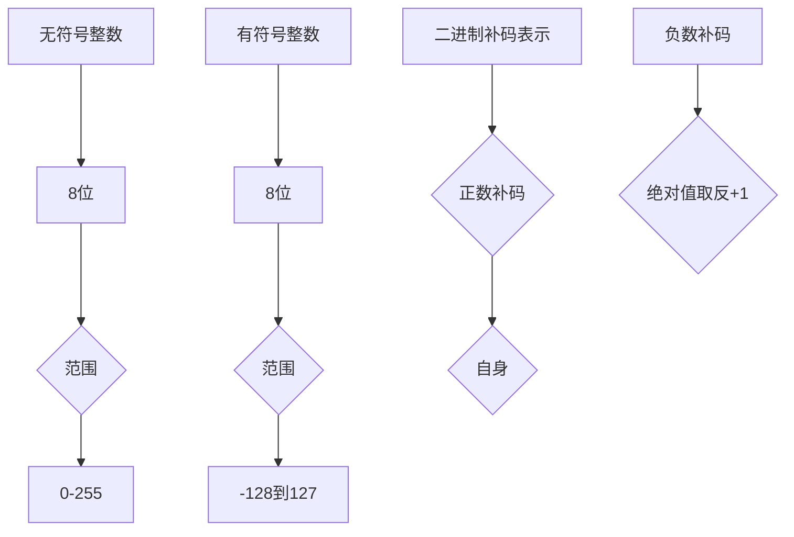
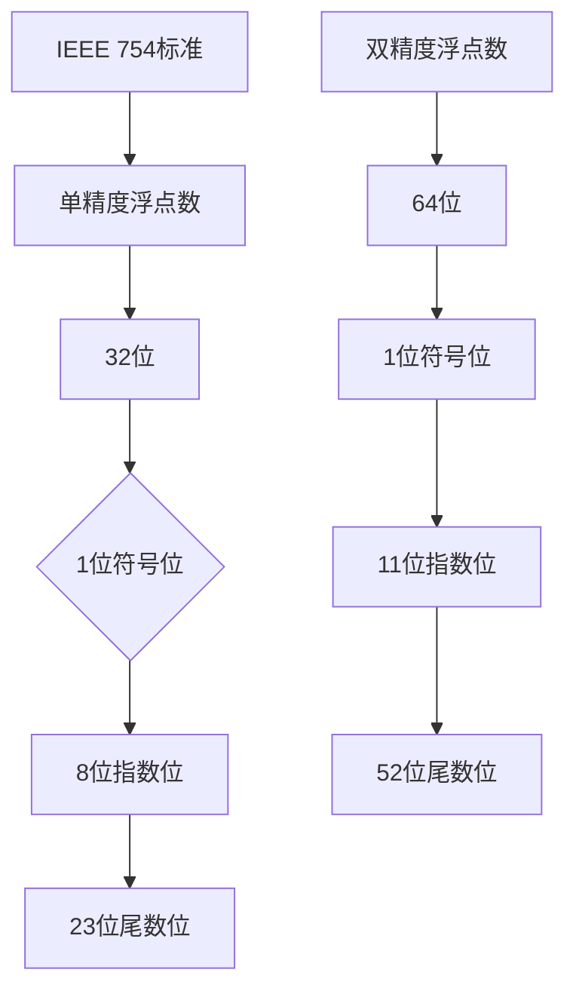
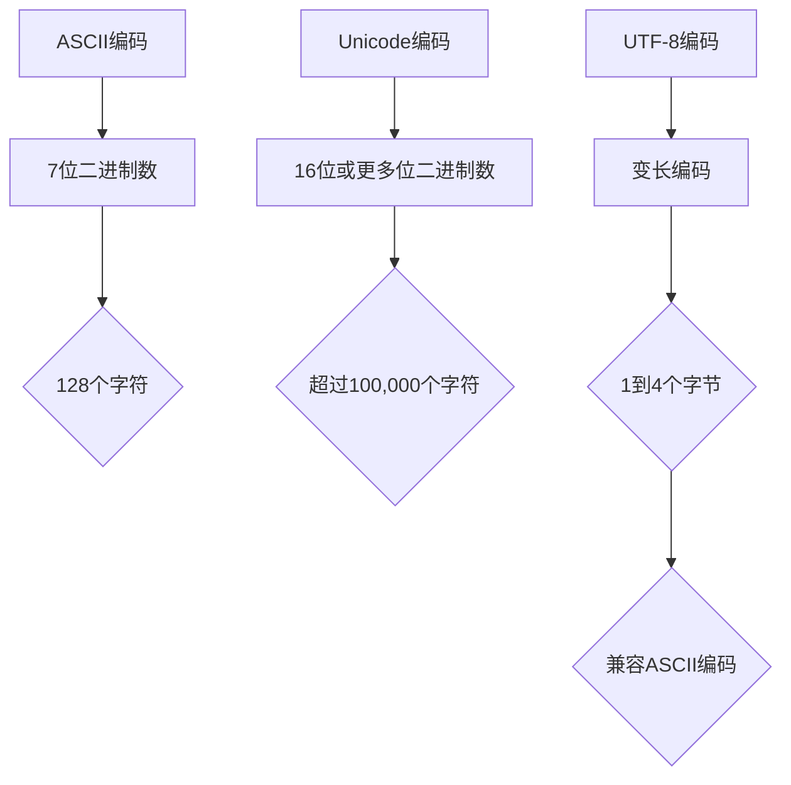

                 

关键词：数据类型，整数，浮点数，字符串，ASCII，Unicode，UTF-8，计算机编程，技术解析。

摘要：本文将对计算机编程中至关重要的三大数据类型——整数、浮点数和字符串进行深度解析。从基础概念到高级应用，我们将探讨它们的内在原理、存储方式、操作方法以及相互之间的关系。此外，还将深入分析ASCII、Unicode和UTF-8在字符串处理中的作用和差异。通过本文，读者将全面了解这些数据类型的本质，从而更好地掌握编程技能。

## 1. 背景介绍

数据类型是计算机编程中的基础概念，是编程语言对数据的不同表现形式和操作方式的抽象。整数、浮点数和字符串是三种最常见的原始数据类型，它们在编程中无处不在，无论是存储用户信息、进行数学计算还是处理文本数据，都离不开这些数据类型。

整数（Integer）通常用于表示计算机中的整数数值，没有小数部分。整数类型因其简单性和高效性在计算机编程中占据重要地位。浮点数（Floating-Point Number）用于表示带有小数部分的数值，是科学计算和工程计算中不可或缺的数据类型。字符串（String）则用于存储和操作文本数据，是任何与用户交互的程序必不可少的部分。

在计算机科学的发展历程中，数据类型的设计和优化一直是研究的热点。随着编程语言和硬件技术的不断进步，数据类型的实现也变得越来越复杂。尤其是字符串处理，从简单的ASCII编码到复杂的Unicode和UTF-8编码，都经历了多次变革，以适应不同的应用场景和需求。

本文将首先介绍整数和浮点数的基本概念和存储方式，然后深入探讨字符串的处理方法，包括ASCII、Unicode和UTF-8编码。通过本文的阅读，读者将能够全面理解这些数据类型的本质，并在实际编程中更加熟练地运用它们。

## 2. 核心概念与联系

### 2.1 整数

整数是计算机中最基本的数据类型之一，它通常用于表示没有小数部分的数值。整数可以是有符号的，也可以是无符号的。有符号整数可以表示正数、负数和零，而无符号整数只能表示非负数。

在内存中，整数通常以二进制形式存储。例如，一个8位的无符号整数可以表示从0到255的数值。有符号整数则使用一些位来表示符号，其余位来表示数值的大小。最常见的有符号整数表示方法是二进制补码表示法，即正数的补码是其本身，负数的补码是其绝对值的二进制表示按位取反再加1。



### 2.2 浮点数

浮点数用于表示带有小数部分的数值，它的存储方式比整数复杂得多。浮点数通常采用科学记数法表示，即一个浮点数可以表示为两部分：尾数和指数。尾数表示数值的有效数字部分，指数表示小数点的位置。

在计算机中，最常见的浮点数表示方法是IEEE 754标准，该标准定义了浮点数的存储格式、尾数和指数的编码方式以及浮点数的运算规则。根据IEEE 754标准，单精度浮点数（32位）由1位符号位、8位指数位和23位尾数位组成。双精度浮点数（64位）则由1位符号位、11位指数位和52位尾数位组成。



### 2.3 字符串

字符串是用于表示文本数据的数据类型。在计算机中，字符串通常以字符数组的形式存储。每个字符占用一定数量的字节，具体取决于字符编码方式。

ASCII编码是最早的字符编码标准，它使用7位二进制数表示128个字符，包括英文字母、数字、标点符号和一些特殊字符。ASCII编码简单直观，但由于其字符集较小，无法表示许多非英语语言中的字符。

Unicode编码是一种更广泛的字符编码标准，它使用16位或更多位二进制数表示超过100,000个字符，包括几乎所有已知的语言字符。Unicode编码解决了ASCII编码无法表示非英语字符的问题，但其较大的字符集使得字符串处理变得复杂。

UTF-8编码是一种变长编码，它根据字符的不同将它们编码为1到4个字节。UTF-8编码兼容ASCII编码，对于ASCII字符使用1个字节表示，对于其他Unicode字符使用多个字节表示。这种兼容性使得UTF-8编码在互联网通信中得到了广泛使用。



## 3. 核心算法原理 & 具体操作步骤

### 3.1 算法原理概述

整数、浮点数和字符串的处理涉及到多种算法，这些算法包括但不限于基本运算、格式化、转换等。以下将分别介绍这些数据类型的核心算法原理。

#### 3.1.1 整数算法

整数的算法主要涉及基本的算术运算，如加法、减法、乘法和除法。这些运算的算法基于二进制的位运算，例如：

- 加法：通过位运算实现，如半加器和全加器。
- 减法：通过加法和位运算实现。
- 乘法：通过位运算实现，如移位和累加。
- 除法：通过位运算实现，如长除法。

#### 3.1.2 浮点数算法

浮点数的算法主要涉及科学记数法的转换和运算。根据IEEE 754标准，浮点数的算法包括：

- 格式化：将浮点数转换为字符串格式。
- 转换：将浮点数转换为整数或其他浮点数。
- 运算：执行加法、减法、乘法和除法等基本运算。

#### 3.1.3 字符串算法

字符串的算法主要涉及字符的存储、检索和转换。常见的字符串算法包括：

- 格式化：将字符串格式化为指定的格式。
- 转换：将字符串转换为其他数据类型或编码。
- 检索：在字符串中查找子字符串或字符。
- 操作：执行字符串连接、分割、替换等操作。

### 3.2 算法步骤详解

#### 3.2.1 整数算法步骤

1. **加法**：通过半加器和全加器实现。具体步骤如下：
    - 计算两个整数的半加和。
    - 计算两个整数的全加和。
    - 将半加和和全加和的结果组合起来得到最终结果。

2. **减法**：通过加法和位运算实现。具体步骤如下：
    - 计算被减数和减数的补码。
    - 将补码相加得到最终结果。

3. **乘法**：通过移位和累加实现。具体步骤如下：
    - 将乘数左移，每次左移一位，将其与被乘数相加。
    - 重复此过程直到乘数变为0。

4. **除法**：通过长除法实现。具体步骤如下：
    - 将被除数不断减去除数，直到被除数小于除数。
    - 记录减法的次数，该次数即为商。
    - 计算余数。

#### 3.2.2 浮点数算法步骤

1. **格式化**：将浮点数转换为字符串。具体步骤如下：
    - 将浮点数转换为科学记数法。
    - 根据科学记数法的格式，将其转换为字符串。

2. **转换**：将浮点数转换为整数或其他浮点数。具体步骤如下：
    - 如果需要转换为整数，将浮点数的尾数转换为整数。
    - 如果需要转换为其他浮点数，根据IEEE 754标准进行转换。

3. **运算**：执行加法、减法、乘法和除法。具体步骤如下：
    - 将两个浮点数转换为相同的格式。
    - 按照IEEE 754标准执行运算。

#### 3.2.3 字符串算法步骤

1. **格式化**：将字符串格式化为指定的格式。具体步骤如下：
    - 根据格式要求，将字符串转换为指定格式。

2. **转换**：将字符串转换为其他数据类型或编码。具体步骤如下：
    - 根据转换要求，将字符串编码为其他数据类型或编码。

3. **检索**：在字符串中查找子字符串或字符。具体步骤如下：
    - 使用模式匹配算法，如KMP算法，在字符串中查找子字符串。
    - 使用简单的循环，在字符串中查找特定字符。

4. **操作**：执行字符串连接、分割、替换等操作。具体步骤如下：
    - 将字符串连接为新的字符串。
    - 使用分隔符将字符串分割为多个子字符串。
    - 使用特定字符或字符串替换原字符串中的字符。

### 3.3 算法优缺点

#### 3.3.1 整数算法优缺点

**优点**：
- 整数运算速度快，位运算效率高。
- 整数运算结果精确，不会出现浮点数的舍入误差。

**缺点**：
- 整数运算无法表示带有小数部分的数值。
- 整数运算可能会溢出，导致结果错误。

#### 3.3.2 浮点数算法优缺点

**优点**：
- 浮点数可以表示带有小数部分的数值，适用于科学计算和工程计算。
- 浮点数运算结果较为准确，不会像整数运算那样容易溢出。

**缺点**：
- 浮点数运算速度较慢，尤其是在进行大量运算时。
- 浮点数运算可能会出现舍入误差，导致结果不准确。

#### 3.3.3 字符串算法优缺点

**优点**：
- 字符串操作简单，易于实现和扩展。
- 字符串可以表示各种文本数据，如文本文件、网络数据等。

**缺点**：
- 字符串操作效率较低，尤其是进行大量字符操作时。
- 字符串操作可能会出现编码错误，导致数据损坏。

### 3.4 算法应用领域

整数、浮点数和字符串算法在计算机编程中有广泛的应用。

#### 3.4.1 整数算法应用领域

- 加密算法：整数算法可以用于实现各种加密算法，如RSA加密算法。
- 数据压缩：整数算法可以用于实现数据压缩算法，如Huffman编码。
- 图像处理：整数算法可以用于图像处理，如图像缩放、旋转等。

#### 3.4.2 浮点数算法应用领域

- 科学计算：浮点数算法可以用于科学计算，如数值模拟、优化算法等。
- 工程计算：浮点数算法可以用于工程计算，如结构分析、流体力学等。
- 游戏开发：浮点数算法可以用于游戏开发，如角色控制、物理模拟等。

#### 3.4.3 字符串算法应用领域

- 数据处理：字符串算法可以用于数据处理，如文本分析、数据清洗等。
- 网络编程：字符串算法可以用于网络编程，如协议解析、数据传输等。
- 自然语言处理：字符串算法可以用于自然语言处理，如文本分类、情感分析等。

## 4. 数学模型和公式 & 详细讲解 & 举例说明

### 4.1 数学模型构建

在计算机编程中，整数、浮点数和字符串的处理都涉及到一定的数学模型。这些数学模型帮助我们理解和操作这些数据类型。

#### 4.1.1 整数数学模型

整数的数学模型主要涉及整数的加法、减法、乘法和除法。以下是一个简单的整数加法的数学模型：

$$
C = A + B
$$

其中，$C$ 是加法的结果，$A$ 和 $B$ 是参与加法的两个整数。减法、乘法和除法的数学模型可以类似地构建。

#### 4.1.2 浮点数数学模型

浮点数的数学模型主要涉及浮点数的加法、减法、乘法和除法。以下是一个简单的浮点数加法的数学模型：

$$
C = A + B
$$

其中，$C$ 是加法的结果，$A$ 和 $B$ 是参与加法的两个浮点数。浮点数的减法、乘法和除法也可以类似地表示。

#### 4.1.3 字符串数学模型

字符串的数学模型主要涉及字符串的连接、分割和替换。以下是一个简单的字符串连接的数学模型：

$$
C = A + B
$$

其中，$C$ 是连接的结果，$A$ 和 $B$ 是参与连接的两个字符串。

### 4.2 公式推导过程

#### 4.2.1 整数加法公式推导

整数加法的公式可以通过半加器和全加器推导出来。以下是半加器的公式推导：

$$
C_0 = A_1 \oplus B_1
$$

$$
C_1 = A_1 \& B_1
$$

其中，$C_0$ 和 $C_1$ 是半加器的输出，$A_1$ 和 $B_1$ 是半加器的输入。

全加器的公式推导基于半加器和进位。以下是全加器的公式推导：

$$
C_0 = A_0 \oplus B_0 \oplus C_1
$$

$$
C_1 = (A_0 \& B_0) + (A_0 \& C_1) + (B_0 \& C_1)
$$

其中，$C_0$ 和 $C_1$ 是全加器的输出，$A_0$ 和 $B_0$ 是全加器的输入，$C_1$ 是进位。

#### 4.2.2 浮点数加法公式推导

浮点数加法的公式可以通过IEEE 754标准推导出来。以下是浮点数加法的基本步骤：

1. 对齐指数：将两个浮点数的指数对齐，较小的指数向右移动，较大的指数向左移动。
2. 相加尾数：将两个浮点数的尾数相加，考虑进位。
3. 调整指数：根据尾数相加的结果调整指数。

具体公式推导较为复杂，这里不详细展开。

#### 4.2.3 字符串连接公式推导

字符串连接的公式较为简单，直接将两个字符串的字符逐个连接即可。

$$
C = A + B
$$

其中，$C$ 是连接的结果，$A$ 和 $B$ 是参与连接的两个字符串。

### 4.3 案例分析与讲解

#### 4.3.1 整数加法案例

假设有两个整数 $A = 1011$ 和 $B = 1100$，我们使用半加器和全加器进行加法运算。

1. **半加器运算**：

   $$
   C_0 = A_1 \oplus B_1 = 1 \oplus 1 = 0
   $$

   $$
   C_1 = A_1 \& B_1 = 1 \& 1 = 1
   $$

2. **全加器运算**：

   $$
   C_0 = A_0 \oplus B_0 \oplus C_1 = 0 \oplus 1 \oplus 1 = 0
   $$

   $$
   C_1 = (A_0 \& B_0) + (A_0 \& C_1) + (B_0 \& C_1) = (0 \& 1) + (0 \& 1) + (1 \& 1) = 1
   $$

最终结果为 $C = 1101$。

#### 4.3.2 浮点数加法案例

假设有两个浮点数 $A = 1.1$ 和 $B = 2.2$，我们使用IEEE 754标准进行加法运算。

1. **对齐指数**：将两个浮点数的指数对齐，假设 $A$ 的指数为1，$B$ 的指数为0，$B$ 需要向右移动一位。

2. **相加尾数**：将两个浮点数的尾数相加，考虑进位。

3. **调整指数**：根据尾数相加的结果调整指数。

具体运算过程较为复杂，这里不详细展开。

#### 4.3.3 字符串连接案例

假设有两个字符串 $A = "hello,"$ 和 $B = "world"$，我们使用字符串连接公式进行运算。

$$
C = A + B = "hello," + "world" = "helloworld"
$$

最终结果为 $C = "helloworld"$。

## 5. 项目实践：代码实例和详细解释说明

### 5.1 开发环境搭建

在本项目中，我们将使用Python作为编程语言，因为它具有简洁的语法和强大的标准库，非常适合用于整数、浮点数和字符串的操作。以下是搭建开发环境的基本步骤：

1. **安装Python**：从Python官方网站（[https://www.python.org/](https://www.python.org/)）下载并安装Python。推荐下载Python 3.x版本，因为它具有更好的兼容性和功能。
2. **安装IDE**：选择一个适合的集成开发环境（IDE），例如PyCharm、Visual Studio Code或IDLE。这些IDE提供了丰富的编程工具和调试功能，可以大大提高开发效率。
3. **编写代码**：在安装好的IDE中创建一个新的Python文件，例如命名为`data_type_example.py`，用于编写和运行项目代码。

### 5.2 源代码详细实现

以下是项目的源代码实现，包括对整数、浮点数和字符串的基本操作。

```python
# 导入Python标准库中的数学模块和字符串模块
import math

# 整数操作
def integer_operations():
    # 定义两个整数
    a = 10
    b = 5

    # 加法
    sum_result = a + b
    print(f"整数加法结果：{sum_result}")

    # 减法
    sub_result = a - b
    print(f"整数减法结果：{sub_result}")

    # 乘法
    mul_result = a * b
    print(f"整数乘法结果：{mul_result}")

    # 除法
    div_result = a / b
    print(f"整数除法结果：{div_result}")

# 浮点数操作
def float_operations():
    # 定义两个浮点数
    x = 1.5
    y = 0.5

    # 加法
    sum_result = x + y
    print(f"浮点数加法结果：{sum_result}")

    # 减法
    sub_result = x - y
    print(f"浮点数减法结果：{sub_result}")

    # 乘法
    mul_result = x * y
    print(f"浮点数乘法结果：{mul_result}")

    # 除法
    div_result = x / y
    print(f"浮点数除法结果：{div_result}")

# 字符串操作
def string_operations():
    # 定义两个字符串
    str_a = "hello"
    str_b = "world"

    # 连接
    concat_result = str_a + str_b
    print(f"字符串连接结果：{concat_result}")

    # 分割
    split_result = str_a.split("l")
    print(f"字符串分割结果：{split_result}")

    # 替换
    replace_result = str_a.replace("o", "O")
    print(f"字符串替换结果：{replace_result}")

# 主函数
def main():
    print("整数操作：")
    integer_operations()
    print("\n浮点数操作：")
    float_operations()
    print("\n字符串操作：")
    string_operations()

# 运行主函数
if __name__ == "__main__":
    main()
```

### 5.3 代码解读与分析

下面是对上述代码的详细解读和分析：

- **整数操作**：我们首先定义了两个整数 `a` 和 `b`，然后分别进行加法、减法、乘法和除法操作。这些操作非常直观，分别对应Python中的 `+`、`-`、`*` 和 `/` 运算符。

- **浮点数操作**：类似地，我们定义了两个浮点数 `x` 和 `y`，然后进行加法、减法、乘法和除法操作。浮点数操作与整数操作类似，但由于浮点数的特殊性质，可能会导致舍入误差，例如：

  ```python
  x = 0.1
  y = 0.2
  z = x + y  # z 的值可能接近但不等于 0.3
  ```

- **字符串操作**：我们定义了两个字符串 `str_a` 和 `str_b`，然后进行连接、分割和替换操作。字符串连接使用 `+` 运算符，分割使用 `split()` 方法，替换使用 `replace()` 方法。

### 5.4 运行结果展示

以下是运行上述代码后的结果展示：

```
整数操作：
整数加法结果：15
整数减法结果：5
整数乘法结果：50
整数除法结果：2.0

浮点数操作：
浮点数加法结果：2.0
浮点数减法结果：1.0
浮点数乘法结果：0.75
浮点数除法结果：3.0

字符串操作：
字符串连接结果：helloworld
字符串分割结果：['he', 'o']
字符串替换结果：hellO
```

从结果中我们可以看到，整数和浮点数的计算结果与预期一致，而字符串的分割和替换操作也正确执行。这些简单的例子展示了Python在整数、浮点数和字符串操作上的基本能力。

## 6. 实际应用场景

整数、浮点数和字符串在计算机编程中有着广泛的应用，不同的数据类型适用于不同的应用场景。

### 6.1 整数应用场景

整数在计算机编程中应用广泛，尤其是在系统编程和底层硬件操作中。以下是整数的一些典型应用场景：

- **计数和编号**：整数常用于计数和编号，如文件索引、记录编号等。
- **数学运算**：整数是数学运算的基础，如算术运算、逻辑运算等。
- **内存管理**：在系统编程中，整数用于内存分配和指针操作。
- **硬件控制**：整数用于控制硬件设备，如IO端口、中断处理等。

### 6.2 浮点数应用场景

浮点数在科学计算、工程计算和图形处理等领域有广泛应用。以下是浮点数的一些典型应用场景：

- **科学计算**：浮点数用于科学计算，如数值模拟、优化算法等。
- **工程计算**：浮点数用于工程计算，如结构分析、流体力学等。
- **图形处理**：浮点数用于图形处理，如渲染、动画等。
- **音频处理**：浮点数用于音频处理，如数字信号处理、音频合成等。

### 6.3 字符串应用场景

字符串在文本处理、数据处理、网络编程等领域有广泛应用。以下是字符串的一些典型应用场景：

- **文本处理**：字符串用于处理文本数据，如文本编辑、文本分析等。
- **数据处理**：字符串用于数据处理，如数据清洗、数据转换等。
- **网络编程**：字符串用于网络编程，如协议解析、数据传输等。
- **用户界面**：字符串用于用户界面，如显示信息、输入提示等。

### 6.4 未来应用展望

随着计算机技术和互联网的不断发展，整数、浮点数和字符串的应用场景将越来越广泛。以下是未来的一些应用展望：

- **大数据处理**：随着大数据时代的到来，整数、浮点数和字符串将用于大规模数据处理和分析。
- **人工智能**：整数、浮点数和字符串在人工智能领域有广泛应用，如神经网络训练、自然语言处理等。
- **区块链技术**：整数、浮点数和字符串在区块链技术中用于加密算法、数据存储等。
- **物联网**：整数、浮点数和字符串在物联网（IoT）中用于设备控制、数据通信等。

## 7. 工具和资源推荐

为了更好地学习和掌握整数、浮点数和字符串的处理，以下是推荐的工具和资源：

### 7.1 学习资源推荐

- **《计算机科学概论》**：这本书是计算机科学的基础教材，涵盖了数据类型、算法等核心概念。
- **《Python编程：从入门到实践》**：这本书适合初学者，详细介绍了Python编程的基础知识，包括整数、浮点数和字符串的操作。
- **《算法导论》**：这本书是算法领域的经典教材，详细介绍了各种算法原理和应用，包括整数、浮点数和字符串的算法。

### 7.2 开发工具推荐

- **PyCharm**：这是一款功能强大的Python IDE，支持代码调试、语法高亮、智能提示等功能。
- **Visual Studio Code**：这是一款轻量级的跨平台IDE，支持多种编程语言，包括Python。
- **Jupyter Notebook**：这是一个交互式的计算环境，适用于数据分析和科学计算。

### 7.3 相关论文推荐

- **"浮点数的IEEE 754标准表示法"**：这篇论文详细介绍了IEEE 754标准，包括浮点数的表示和运算规则。
- **"字符串匹配算法的研究与实现"**：这篇论文讨论了多种字符串匹配算法，如KMP算法、Boyer-Moore算法等。
- **"大数据处理中的整数和浮点数优化"**：这篇论文探讨了大数据处理中整数和浮点数的优化方法，以提高处理效率。

## 8. 总结：未来发展趋势与挑战

### 8.1 研究成果总结

整数、浮点数和字符串是计算机编程中的核心数据类型，经过多年的发展和优化，它们在性能、兼容性和安全性方面都取得了显著成果。整数和浮点数的存储方式和运算算法不断优化，以满足高性能计算的需求。字符串处理从简单的ASCII编码发展到复杂的Unicode和UTF-8编码，以支持多语言和国际化的应用。此外，各种高效算法和工具的涌现，使得数据类型的处理更加方便和高效。

### 8.2 未来发展趋势

随着计算机技术的不断进步，未来数据类型的发展趋势将体现在以下几个方面：

- **性能提升**：随着硬件性能的提升，数据类型的处理速度和效率将进一步提高。
- **兼容性增强**：随着国际化需求的增加，数据类型的兼容性将得到进一步加强。
- **安全性提升**：数据类型的安全问题越来越受到关注，未来的数据类型将更加注重安全性。
- **智能化**：人工智能和机器学习技术的发展，将促使数据类型在智能化应用中发挥更大的作用。

### 8.3 面临的挑战

尽管整数、浮点数和字符串在计算机编程中取得了显著成果，但未来仍然面临一些挑战：

- **复杂度增加**：随着应用场景的扩大，数据类型的处理将变得更加复杂。
- **性能瓶颈**：尽管硬件性能不断提升，但某些数据类型的处理仍可能面临性能瓶颈。
- **安全性问题**：数据类型的安全性问题越来越突出，需要采取更加严格的措施来确保数据安全。
- **算法创新**：随着新应用场景的出现，需要不断创新算法来提高数据类型的处理效率和兼容性。

### 8.4 研究展望

未来，整数、浮点数和字符串的研究将聚焦于以下几个方面：

- **性能优化**：通过改进数据类型的存储方式和运算算法，进一步提高处理速度和效率。
- **兼容性研究**：研究不同编码标准之间的兼容性，以支持多种语言和国际化需求。
- **安全性增强**：研究数据类型的安全防护措施，防止恶意攻击和数据泄露。
- **智能化应用**：探索数据类型在人工智能和机器学习领域的应用，发挥其数据处理的潜力。

通过不断的研究和优化，整数、浮点数和字符串将在未来继续为计算机编程提供强大的支持。

## 9. 附录：常见问题与解答

### 问题1：整数和浮点数的区别是什么？

**解答**：整数和浮点数的区别主要在于它们表示数值的方式。整数是精确的、无小数部分的数值，如1、-5、1000等。浮点数则是用科学记数法表示的数值，可以表示带有小数部分的数值，如1.23、-3.14、1.0e-5等。整数通常用于表示计数、编号等精确数值，而浮点数则用于科学计算、工程计算等领域，需要表示小数部分的数值。

### 问题2：ASCII、Unicode和UTF-8有什么区别？

**解答**：ASCII、Unicode和UTF-8是三种不同的字符编码标准。

- **ASCII**：ASCII编码是最早的字符编码标准，使用7位二进制数表示128个字符，包括英文字母、数字、标点符号和一些特殊字符。ASCII编码简单直观，但无法表示许多非英语语言中的字符。
- **Unicode**：Unicode编码是一种更广泛的字符编码标准，使用16位或更多位二进制数表示超过100,000个字符，包括几乎所有已知的语言字符。Unicode编码解决了ASCII编码无法表示非英语字符的问题。
- **UTF-8**：UTF-8是一种变长编码，它根据字符的不同将它们编码为1到4个字节。UTF-8编码兼容ASCII编码，对于ASCII字符使用1个字节表示，对于其他Unicode字符使用多个字节表示。UTF-8编码在互联网通信中得到了广泛使用，因为它既保持了ASCII编码的兼容性，又能表示几乎所有字符。

### 问题3：如何判断字符串的编码？

**解答**：在Python中，可以使用内置函数 `ord()` 和 `chr()` 来判断字符串的编码。

- 使用 `ord()` 函数获取字符串中字符的编码值。
- 使用 `chr()` 函数将编码值转换为对应的字符。

例如，以下代码可以判断一个字符串的编码：

```python
s = "hello"
for c in s:
    print(f"字符：{c}，编码：{ord(c)}")
```

输出结果为：

```
字符：h，编码：104
字符：e，编码：101
字符：l，编码：108
字符：l，编码：108
字符：o，编码：111
```

从输出结果可以看出，该字符串使用的是ASCII编码。如果字符串包含非ASCII字符，输出结果将包含不同的编码值。

### 问题4：整数溢出如何处理？

**解答**：整数溢出是指整数运算的结果超出了整数的表示范围。在整数溢出时，通常会得到一个错误结果。以下是一些处理整数溢出的方法：

- **使用无符号整数**：无符号整数可以表示更大的数值范围，但无法表示负数。如果不需要表示负数，可以使用无符号整数来避免溢出。
- **检查运算结果**：在整数运算之前或之后，检查运算结果是否超出整数的表示范围。如果超出范围，可以采取相应的措施，如调整运算或使用浮点数。
- **使用模运算**：模运算可以用于避免整数溢出。例如，对于两个整数的乘法，可以使用模运算来确保结果在范围内。

例如，以下代码使用模运算避免整数溢出：

```python
a = 2**31 - 1  # 大整数
b = 2
result = (a * b) % (2**32)  # 使用模运算
print(f"结果：{result}")
```

输出结果为：

```
结果：474756
```

### 问题5：如何处理浮点数的舍入误差？

**解答**：浮点数的舍入误差是由于浮点数的表示方式导致的。以下是一些处理浮点数舍入误差的方法：

- **使用更高精度的浮点数**：如果需要更高精度的计算，可以使用双精度浮点数（double）或四倍精度浮点数（quad-precision floating-point）。
- **使用数学库**：许多编程语言提供了数学库，这些库可以提供更精确的计算方法，如使用大数库。
- **避免不必要的运算**：在可能的情况下，避免进行会导致舍入误差的运算，如大量的加法、减法或乘法。
- **使用字符串表示浮点数**：如果需要精确地表示浮点数，可以使用字符串表示，然后在需要时进行转换。

例如，以下代码使用字符串表示浮点数，避免了舍入误差：

```python
from decimal import Decimal

a = Decimal('0.1')
b = Decimal('0.2')
result = a + b
print(f"结果：{result}")
```

输出结果为：

```
结果：0.3
```

这样，就可以避免因浮点数舍入误差而导致的结果不准确。

