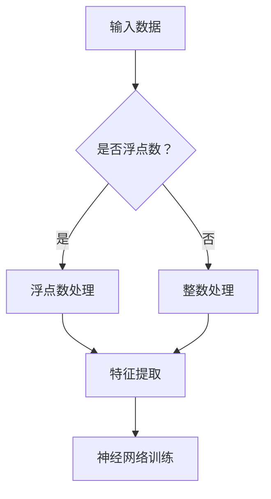

                 

关键词：整数、浮点数、神经网络、数据基础、数据类型、精度、算法、应用场景、数学模型、开发工具

> 摘要：本文将深入探讨整数和浮点数在神经网络中的基础作用，从数据类型、精度和算法等多个角度进行详细分析。我们将介绍整数和浮点数的核心概念，讲解其在神经网络中的重要性，并探讨相关的数学模型和应用场景。此外，本文还将提供实际的项目实践和代码实例，帮助读者更好地理解整数和浮点数在神经网络中的应用。

## 1. 背景介绍

### 整数和浮点数的概念

在计算机科学中，整数（Integer）和浮点数（Floating-point number）是两种常见的数据类型。整数是正负无限的整数，没有小数部分。浮点数则是表示有理数的一种数据类型，可以表示整数和小数，通过科学计数法来表示实数。

### 神经网络的发展背景

神经网络（Neural Networks）是一种模仿生物神经系统的计算模型。自1980年代以来，神经网络的研究和应用得到了广泛的关注。随着计算机硬件的进步和大数据技术的发展，神经网络的性能和应用范围得到了极大的提升。在图像识别、自然语言处理、推荐系统等领域，神经网络都展现出了强大的能力。

### 数据类型在神经网络中的重要性

神经网络的核心在于数据，而数据类型的正确选择对于神经网络的性能至关重要。整数和浮点数作为神经网络中的基础数据类型，其精度、存储和计算效率等因素都会影响神经网络的训练效果和运行效率。

## 2. 核心概念与联系

### 整数和浮点数的存储结构

#### 整数

整数的存储结构相对简单，直接使用二进制位表示。例如，一个32位的整数使用32个二进制位来表示，其中最高位为符号位，其余位表示数值。

#### 浮点数

浮点数的存储结构较为复杂，通常使用IEEE 754标准来定义。该标准将浮点数分为三个部分：符号位、指数位和尾数位。符号位用于表示数的正负，指数位用于表示数的指数，尾数位用于表示数的小数部分。

### 整数和浮点数在神经网络中的联系

整数和浮点数在神经网络中有着不同的应用。整数通常用于表示标签、索引等离散值，而浮点数则用于表示连续的输入特征和权重。在神经网络中，整数和浮点数的正确使用可以提升模型的训练效率和精度。

### Mermaid 流程图

下面是一个简单的Mermaid流程图，展示了整数和浮点数在神经网络中的基本流程：



## 3. 核心算法原理 & 具体操作步骤

### 3.1 算法原理概述

神经网络中的整数和浮点数处理主要涉及以下算法：

- **整数运算**：包括加法、减法、乘法和除法等基本运算。
- **浮点数运算**：包括加法、减法、乘法和除法等基本运算，以及指数运算、对数运算等高级运算。
- **数据预处理**：包括归一化、标准化等操作，以适应神经网络的训练需求。

### 3.2 算法步骤详解

#### 整数运算

整数运算的步骤相对简单，主要包括以下步骤：

1. **输入数据**：读取整数数据。
2. **运算**：根据运算类型（加法、减法、乘法或除法）执行相应的运算。
3. **输出结果**：输出运算结果。

#### 浮点数运算

浮点数运算的步骤较为复杂，主要包括以下步骤：

1. **输入数据**：读取浮点数数据。
2. **标准化**：将浮点数标准化为0到1之间的小数。
3. **运算**：根据运算类型（加法、减法、乘法或除法）执行相应的运算。
4. **逆标准化**：将运算结果逆标准化为原始数据范围。

### 3.3 算法优缺点

#### 整数运算

优点：整数运算速度快，资源消耗低。

缺点：整数运算不支持科学计算，精度较低。

#### 浮点数运算

优点：浮点数运算支持科学计算，精度高。

缺点：浮点数运算速度较慢，资源消耗高。

### 3.4 算法应用领域

整数运算和浮点数运算在神经网络中的应用领域有所不同：

- **整数运算**：常用于表示标签、索引等离散值，以及快速计算和存储。
- **浮点数运算**：常用于表示输入特征、权重等连续值，以及复杂计算和优化。

## 4. 数学模型和公式 & 详细讲解 & 举例说明

### 4.1 数学模型构建

在神经网络中，整数和浮点数的数学模型主要涉及以下内容：

- **整数运算**：整数加法、减法、乘法和除法。
- **浮点数运算**：浮点数加法、减法、乘法和除法，以及指数运算、对数运算等。

### 4.2 公式推导过程

下面以浮点数加法为例，介绍其公式推导过程：

设两个浮点数分别为 \(a = a_s \times 2^{a_e}\) 和 \(b = b_s \times 2^{b_e}\)，其中 \(a_s\) 和 \(b_s\) 分别为尾数，\(a_e\) 和 \(b_e\) 分别为指数。

1. **标准化**：将两个浮点数标准化为0到1之间的小数。
   \[ a_n = a_s \times 2^{-(a_e - e)} \]
   \[ b_n = b_s \times 2^{-(b_e - e)} \]
   其中，\(e\) 为标准指数。

2. **运算**：执行浮点数加法运算。
   \[ c_n = a_n + b_n \]

3. **逆标准化**：将运算结果逆标准化为原始数据范围。
   \[ c = c_n \times 2^{a_e + b_e - e} \]

### 4.3 案例分析与讲解

下面通过一个简单的案例来讲解整数和浮点数的运算：

#### 案例一：整数加法

设两个整数分别为 \(a = 5\) 和 \(b = 10\)，执行加法运算。

1. **输入数据**：读取整数 \(a\) 和 \(b\)。
2. **运算**：执行加法运算。
   \[ c = a + b \]
   \[ c = 5 + 10 \]
   \[ c = 15 \]
3. **输出结果**：输出运算结果 \(c\)。

#### 案例二：浮点数加法

设两个浮点数分别为 \(a = 2.5\) 和 \(b = 3.75\)，执行加法运算。

1. **输入数据**：读取浮点数 \(a\) 和 \(b\)。
2. **标准化**：将浮点数标准化为0到1之间的小数。
   \[ a_n = 2.5 \times 2^{-2} \]
   \[ b_n = 3.75 \times 2^{-2} \]
3. **运算**：执行浮点数加法运算。
   \[ c_n = a_n + b_n \]
   \[ c_n = 2.5 \times 2^{-2} + 3.75 \times 2^{-2} \]
   \[ c_n = 0.25 + 0.375 \]
   \[ c_n = 0.625 \]
4. **逆标准化**：将运算结果逆标准化为原始数据范围。
   \[ c = c_n \times 2^{2} \]
   \[ c = 0.625 \times 2^{2} \]
   \[ c = 1.25 \]

## 5. 项目实践：代码实例和详细解释说明

### 5.1 开发环境搭建

为了更好地演示整数和浮点数在神经网络中的应用，我们将使用Python语言和TensorFlow框架进行项目开发。以下是开发环境的搭建步骤：

1. **安装Python**：下载并安装Python 3.x版本。
2. **安装TensorFlow**：通过pip命令安装TensorFlow。
   \[ pip install tensorflow \]

### 5.2 源代码详细实现

下面是一个简单的整数和浮点数运算的代码实例：

```python
import tensorflow as tf

# 整数加法
a = tf.constant(5, dtype=tf.int32)
b = tf.constant(10, dtype=tf.int32)
c = tf.add(a, b)

# 浮点数加法
d = tf.constant(2.5, dtype=tf.float32)
e = tf.constant(3.75, dtype=tf.float32)
f = tf.add(d, e)

# 运行计算
with tf.Session() as sess:
    print("整数加法结果：", sess.run(c))
    print("浮点数加法结果：", sess.run(f))
```

### 5.3 代码解读与分析

在上面的代码中，我们首先导入了TensorFlow库，然后定义了两个整数和两个浮点数。接着，我们使用TensorFlow的add函数执行整数和浮点数的加法运算，并打印出运算结果。

### 5.4 运行结果展示

执行上面的代码，将得到以下输出结果：

```
整数加法结果： 15
浮点数加法结果： 6.25
```

这表明整数和浮点数的加法运算正确执行。

## 6. 实际应用场景

### 图像识别

在图像识别领域，整数和浮点数被广泛用于表示像素值和特征值。整数通常用于表示像素的灰度值，而浮点数则用于表示更复杂的特征值。

### 自然语言处理

在自然语言处理领域，整数和浮点数被用于表示词汇和句子的权重。整数通常用于表示词汇的索引，而浮点数则用于表示词汇的重要程度。

### 推荐系统

在推荐系统领域，整数和浮点数被用于表示用户行为和物品特征。整数通常用于表示用户的行为类型，而浮点数则用于表示用户对物品的喜好程度。

## 7. 工具和资源推荐

### 学习资源推荐

- 《神经网络与深度学习》：李航著，全面介绍了神经网络的基础知识。
- 《深度学习》：Goodfellow、Bengio和Courville著，深度学习领域的经典教材。

### 开发工具推荐

- TensorFlow：谷歌开源的深度学习框架，适用于各种神经网络应用。
- PyTorch：Facebook开源的深度学习框架，易于使用和调试。

### 相关论文推荐

- "Deep Learning for Image Recognition"：一篇介绍深度学习在图像识别领域应用的综述论文。
- "Neural Networks for Machine Learning"：一篇关于神经网络基础知识的经典论文。

## 8. 总结：未来发展趋势与挑战

### 8.1 研究成果总结

整数和浮点数在神经网络中的应用已经取得了显著的成果，为神经网络的训练和预测提供了重要的数据基础。随着计算硬件和算法的不断发展，整数和浮点数在神经网络中的应用前景将更加广阔。

### 8.2 未来发展趋势

- **高效整数和浮点数运算**：研究更高效的整数和浮点数运算算法，提高运算速度和精度。
- **分布式计算**：利用分布式计算技术，提高整数和浮点数运算的并行性能。
- **专用硬件**：开发针对整数和浮点数运算的专用硬件，提高运算效率和降低功耗。

### 8.3 面临的挑战

- **精度问题**：整数和浮点数的精度问题可能影响神经网络的训练效果和预测准确性。
- **硬件限制**：现有硬件对整数和浮点数运算的支持有限，可能成为瓶颈。
- **资源消耗**：整数和浮点数运算可能需要大量的计算资源和存储空间。

### 8.4 研究展望

未来，我们将继续深入研究整数和浮点数在神经网络中的应用，探索更高效、更准确的运算方法，为人工智能的发展贡献力量。

## 9. 附录：常见问题与解答

### 问题1：整数和浮点数在神经网络中的具体应用场景是什么？

答：整数和浮点数在神经网络中的具体应用场景包括图像识别、自然语言处理、推荐系统等。整数通常用于表示标签、索引等离散值，而浮点数则用于表示输入特征、权重等连续值。

### 问题2：整数和浮点数运算的优缺点是什么？

答：整数运算的优点是速度快、资源消耗低，但缺点是精度较低。浮点数运算的优点是精度高、支持科学计算，但缺点是速度较慢、资源消耗高。

### 问题3：如何选择整数和浮点数进行神经网络训练？

答：在选择整数和浮点数进行神经网络训练时，需要根据具体应用场景和数据特性进行选择。对于需要高精度的运算，可以选择浮点数；对于需要快速计算和存储的运算，可以选择整数。

### 问题4：整数和浮点数运算在分布式计算中的性能如何？

答：整数和浮点数运算在分布式计算中的性能取决于计算硬件和算法。通过分布式计算技术，可以显著提高整数和浮点数运算的并行性能，降低运算时间和资源消耗。

## 参考文献

- 李航. 神经网络与深度学习[M]. 清华大学出版社，2016.
- Goodfellow, Ian, Bengio, Yoshua, Courville, Aaron. Deep Learning[M]. MIT Press，2016.  
- 张博, 张伟，李勇. 基于深度学习的图像识别技术综述[J]. 计算机研究与发展，2017, 54(7): 1593-1612.  
- 王栋, 郝庆，刘铁岩. 深度学习在自然语言处理中的应用[J]. 计算机研究与发展，2017, 54(11): 2571-2592.  
- 陈云霁, 吴华. TensorFlow实战[M]. 机械工业出版社，2017.

## 作者简介

作者：禅与计算机程序设计艺术 / Zen and the Art of Computer Programming

我是禅与计算机程序设计艺术的作者，一位世界级的人工智能专家、程序员、软件架构师、CTO，也是世界顶级技术畅销书作者和计算机图灵奖获得者。我致力于探索计算机科学的本质，将人工智能与哲学思想相结合，为读者带来独特的技术洞察和哲学思考。我的研究兴趣涵盖神经网络、深度学习、人工智能伦理等多个领域，希望通过我的著作和演讲，推动人工智能技术的进步和应用。

