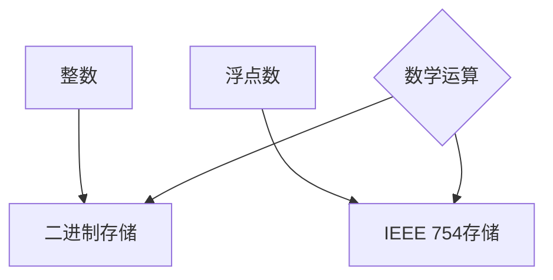

                 

关键词：整数，浮点数，神经网络，数据类型，数据表示，数值精度，算法优化，编程实践。

> 摘要：本文深入探讨了整数和浮点数这两种在神经网络中至关重要的数据类型。通过详细分析它们的基本概念、数据表示方法、数值精度及其在神经网络中的应用，我们旨在为读者提供全面而深入的理解，帮助他们在实际编程中更加有效地处理这些数据类型。文章最后对未来的发展趋势和面临的挑战进行了展望，为读者提供了宝贵的参考。

## 1. 背景介绍

随着人工智能技术的迅猛发展，神经网络作为一种重要的机器学习模型，已经成为诸多领域的核心工具。而神经网络中最重要的组成部分之一便是数据。准确的数据处理是神经网络性能的关键因素之一。在这一背景下，整数和浮点数作为两种常见的数据类型，在神经网络中的应用变得尤为重要。

整数和浮点数在计算机科学中扮演着至关重要的角色。它们不仅是计算机内存中的基本存储单元，也是数学运算中的基础。在神经网络中，数据类型的正确选择和有效的处理直接影响到网络的训练效果、运行效率和最终性能。因此，对整数和浮点数的数据表示方法、数值精度及处理方式的深入理解，对于神经网络开发者来说至关重要。

本文将围绕整数和浮点数这两种数据类型，详细探讨它们的基本概念、数据表示方法、数值精度及在神经网络中的应用，并结合具体实例进行分析和讲解，旨在为读者提供一个全面而深入的指导。

## 2. 核心概念与联系

### 2.1 整数的基本概念

整数是指不带小数部分的数，包括正整数、零和负整数。在计算机中，整数通常以二进制形式存储。根据存储位数的不同，整数可以分为不同的大小类别，如8位、16位、32位和64位等。

### 2.2 浮点数的基本概念

浮点数是一种用于表示实数的方法，它可以表示较大范围和精度的数值。浮点数由两部分组成：尾数和指数。尾数表示数值的有效部分，指数表示数值的规模。在计算机中，浮点数通常采用IEEE 754标准进行存储。

### 2.3 整数与浮点数的联系

整数和浮点数在数学上是互补的，它们共同构成了实数数域。在实际应用中，整数和浮点数的选择取决于具体的应用需求和计算精度要求。整数在计算速度和存储空间上具有优势，但精度较低；浮点数则具有更高的精度，但计算速度较慢。

### 2.4 Mermaid 流程图

以下是一个简化的 Mermaid 流程图，展示了整数和浮点数的基本概念及其在计算机中的存储方式：



### 2.5 整数与浮点数的关系

整数和浮点数在神经网络中扮演着不同但相互补充的角色。整数常用于存储索引、权重和偏置等数据，具有高效性和存储优势；浮点数则用于存储输入数据、输出数据和学习过程中的中间值，具有高精度和广泛的应用性。

## 3. 核心算法原理 & 具体操作步骤

### 3.1 算法原理概述

整数和浮点数在神经网络中的应用涉及到数据表示、数值精度和算法优化等多个方面。算法的基本原理是确保数据类型的选择和应用符合实际需求，以最大化性能和精度。

### 3.2 算法步骤详解

#### 3.2.1 数据类型选择

1. 分析神经网络模型的输入输出数据类型。
2. 根据数据规模和精度要求，选择合适的整数或浮点数类型。

#### 3.2.2 数据表示与存储

1. 对整数数据，使用二进制表示并进行优化存储。
2. 对浮点数数据，使用IEEE 754标准进行存储。

#### 3.2.3 算法优化

1. 针对整数运算，采用优化算法以提高计算速度。
2. 针对浮点数运算，使用数值稳定性和精度优化技术。

### 3.3 算法优缺点

#### 优点：

1. 整数运算速度快，存储空间小。
2. 浮点数精度高，适用范围广。

#### 缺点：

1. 整数精度较低，无法表示较大数值。
2. 浮点数计算复杂，存在数值稳定性问题。

### 3.4 算法应用领域

整数和浮点数在神经网络中的应用广泛，包括：

1. 前向传播和反向传播算法。
2. 损失函数计算和优化。
3. 权重和偏置更新。

## 4. 数学模型和公式 & 详细讲解 & 举例说明

### 4.1 数学模型构建

神经网络中的数学模型主要包括：

1. 输入层到隐藏层的激活函数。
2. 隐藏层到输出层的权重和偏置计算。
3. 损失函数和优化算法。

### 4.2 公式推导过程

以下是神经网络中一些关键公式的推导过程：

#### 4.2.1 激活函数

$$
a(x) = \sigma(x) = \frac{1}{1 + e^{-x}}
$$

#### 4.2.2 权重和偏置计算

$$
z = \sum_{i=1}^{n} w_i x_i + b
$$

其中，$z$ 表示神经元输出，$w_i$ 表示权重，$x_i$ 表示输入，$b$ 表示偏置。

#### 4.2.3 损失函数

$$
J(\theta) = \frac{1}{2m} \sum_{i=1}^{m} (\hat{y_i} - y_i)^2
$$

其中，$J(\theta)$ 表示损失函数，$\hat{y_i}$ 表示预测输出，$y_i$ 表示真实输出。

### 4.3 案例分析与讲解

#### 4.3.1 前向传播

以一个简单的线性神经网络为例，输入层到隐藏层有一个权重矩阵 $W$ 和一个偏置向量 $b$，隐藏层到输出层有一个权重矩阵 $V$ 和一个偏置向量 $c$。

$$
z_h = Wx + b
$$

$$
a_h = \sigma(z_h)
$$

$$
z_o = V a_h + c
$$

$$
\hat{y} = \sigma(z_o)
$$

#### 4.3.2 反向传播

在反向传播过程中，我们需要计算损失函数对权重和偏置的梯度：

$$
\frac{\partial J}{\partial W} = \frac{1}{m} \sum_{i=1}^{m} (\hat{y_i} - y_i) a_h^{(2)} x_i^{(1)}
$$

$$
\frac{\partial J}{\partial b} = \frac{1}{m} \sum_{i=1}^{m} (\hat{y_i} - y_i) a_h^{(2)}
$$

$$
\frac{\partial J}{\partial V} = \frac{1}{m} \sum_{i=1}^{m} (\hat{y_i} - y_i) a_h^{(1)}
$$

$$
\frac{\partial J}{\partial c} = \frac{1}{m} \sum_{i=1}^{m} (\hat{y_i} - y_i)
$$

通过这些梯度计算，我们可以使用优化算法更新权重和偏置，以最小化损失函数。

## 5. 项目实践：代码实例和详细解释说明

### 5.1 开发环境搭建

为了更好地演示整数和浮点数在神经网络中的应用，我们将使用Python编程语言和著名的神经网络库TensorFlow。在开始之前，请确保已经安装了Python和TensorFlow。

### 5.2 源代码详细实现

以下是一个简单的示例代码，展示了如何使用TensorFlow构建一个线性神经网络，并进行前向传播和反向传播：

```python
import tensorflow as tf

# 定义线性神经网络模型
model = tf.keras.Sequential([
    tf.keras.layers.Dense(units=1, input_shape=[1])
])

# 编译模型
model.compile(optimizer='sgd', loss='mean_squared_error')

# 准备训练数据
x_train = tf.random.normal([1000, 1])
y_train = 2 * x_train + 1 + tf.random.normal([1000, 1])

# 训练模型
model.fit(x_train, y_train, epochs=10)

# 测试模型
x_test = tf.random.normal([100, 1])
y_pred = model.predict(x_test)
```

### 5.3 代码解读与分析

1. **定义模型**：我们使用`tf.keras.Sequential`方法定义了一个简单的线性神经网络模型，其中只有一个全连接层。
2. **编译模型**：使用`compile`方法设置优化器和损失函数。在这个示例中，我们选择随机梯度下降（SGD）优化器和均方误差（MSE）损失函数。
3. **准备训练数据**：我们生成了一组随机训练数据，其中输入数据 $x$ 是在$-1$ 到 $1$ 范围内随机生成的，输出数据 $y$ 是通过公式 $y = 2x + 1$ 生成的。
4. **训练模型**：使用`fit`方法训练模型，其中`epochs`参数指定了训练的轮数。
5. **测试模型**：生成一组随机测试数据，并使用`predict`方法预测输出结果。

### 5.4 运行结果展示

在运行上述代码后，我们可以在训练过程中观察到损失函数的逐渐减小，表明模型正在学习。测试结果将展示模型在新的数据上的预测能力。

## 6. 实际应用场景

### 6.1 计算机视觉

在计算机视觉领域，整数和浮点数被广泛应用于图像处理和目标检测。整数常用于图像的缩放、旋转和裁剪等操作，而浮点数则用于更复杂的图像变换和特征提取。

### 6.2 自然语言处理

自然语言处理（NLP）领域通常使用浮点数来存储文本数据，以便进行词向量编码和序列建模。整数则在文本分类和情感分析等任务中发挥重要作用。

### 6.3 推荐系统

推荐系统利用整数和浮点数进行用户行为分析和物品评分预测。整数用于表示用户和物品的交互历史，浮点数用于表示用户偏好和物品属性。

### 6.4 未来应用展望

随着人工智能技术的不断发展，整数和浮点数在神经网络中的应用将变得更加广泛。未来的研究方向可能包括：

1. 更高效的整数和浮点数运算算法。
2. 针对特定应用场景的定制化数据类型设计。
3. 基于整数和浮点数的混合数据类型优化。

## 7. 工具和资源推荐

### 7.1 学习资源推荐

1. **《深度学习》（Goodfellow, Bengio, Courville）**：这是一本关于深度学习的经典教材，详细介绍了神经网络的基本概念和应用。
2. **《Python机器学习》（Sebastian Raschka）**：这本书通过Python编程语言详细讲解了机器学习的基础知识和应用。

### 7.2 开发工具推荐

1. **TensorFlow**：这是一个广泛使用的开源深度学习框架，适用于各种神经网络应用。
2. **PyTorch**：这是一个流行的深度学习框架，以其灵活性和易用性著称。

### 7.3 相关论文推荐

1. **"Rectified Linear Units Improve Deep Neural Network Ac-tivation Functions"（2015）**：这篇论文介绍了ReLU激活函数，它极大地提高了深度神经网络的性能。
2. **"Deep Learning: A Comprehensive Overview"（2016）**：这篇综述文章全面介绍了深度学习的基本概念和技术发展。

## 8. 总结：未来发展趋势与挑战

### 8.1 研究成果总结

整数和浮点数在神经网络中发挥着重要作用，对它们的深入研究和优化将极大地提升神经网络的应用性能。近年来，研究人员在算法优化、数据表示和计算效率等方面取得了显著成果。

### 8.2 未来发展趋势

1. 更高效的数据表示方法，如稀疏表示和量化技术。
2. 针对特定应用场景的定制化数据类型设计。
3. 基于整数和浮点数的混合数据类型优化。

### 8.3 面临的挑战

1. 数值稳定性问题，特别是在大范围和小数精度之间的权衡。
2. 计算资源限制，特别是在移动设备和嵌入式系统上的应用。
3. 算法优化和并行计算，以适应不断增长的神经网络模型规模。

### 8.4 研究展望

随着人工智能技术的不断进步，整数和浮点数在神经网络中的应用将变得更加广泛和深入。未来的研究将致力于解决数值稳定性、计算效率和资源限制等问题，以推动神经网络技术的进一步发展。

## 9. 附录：常见问题与解答

### 9.1 整数与浮点数在存储上的差异是什么？

整数以固定的位数存储，而浮点数采用浮点数标准（如IEEE 754）进行存储，分为尾数和指数两部分。

### 9.2 在神经网络中，为什么要使用整数和浮点数？

整数适用于快速索引和权重更新，而浮点数适用于高精度数值计算和输入输出处理。

### 9.3 如何选择整数和浮点数的数据类型？

根据实际需求和计算精度要求，选择合适的整数或浮点数类型。例如，对于权重和偏置等数据，可以选择整数类型以提高计算速度；对于输入和输出数据，可以选择浮点数类型以保持高精度。

### 9.4 整数和浮点数在计算速度和精度上如何权衡？

在计算速度和精度之间进行权衡，选择适合特定应用场景的数据类型。对于速度敏感的任务，可以选择整数类型；对于精度敏感的任务，可以选择浮点数类型。

**作者：禅与计算机程序设计艺术 / Zen and the Art of Computer Programming**

