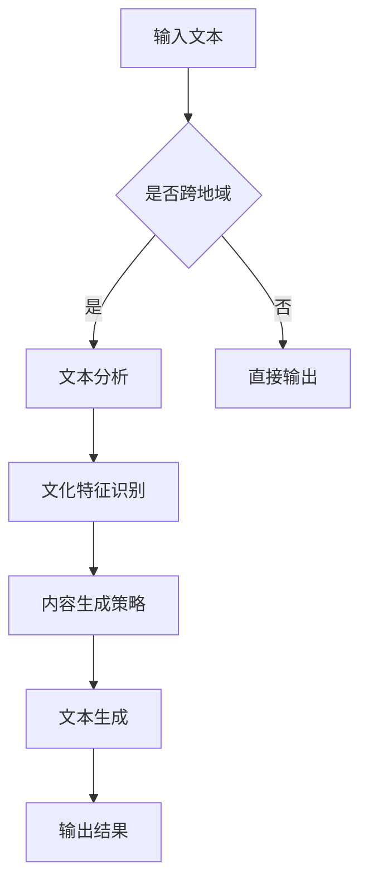

                 

关键词：文化适应性AI、跨地域写作、内容创作、AI算法、文本生成、机器学习、自然语言处理

> 摘要：本文旨在探讨文化适应性人工智能（AI）在跨地域内容创作中的应用，分析其核心概念、算法原理、数学模型、实际应用场景以及未来的发展趋势和挑战。文章将结合具体项目和实例，详细解释文化适应性AI在写作领域的实现方法和效果。

## 1. 背景介绍

随着全球化进程的加速和信息技术的飞速发展，跨地域的内容创作需求日益增长。无论是在商业营销、新闻传媒、教育出版，还是在个人博客、社交媒体等领域，跨地域的内容创作都面临着诸多挑战。例如，不同地区的语言表达、文化习俗、价值观的差异，使得内容创作者需要具备丰富的文化背景知识，才能创作出符合目标受众口味的内容。

然而，传统的内容创作方式依赖于人工进行文化适配，效率低下且成本高昂。随着人工智能（AI）技术的成熟，特别是自然语言处理（NLP）和机器学习（ML）技术的发展，文化适应性AI应运而生。文化适应性AI能够根据不同地区的文化特点和受众需求，自动生成适应性的内容，极大地提高了内容创作的效率和质量。

本文将围绕文化适应性AI在跨地域内容创作中的应用，探讨其核心概念、算法原理、数学模型、实际应用场景以及未来的发展趋势和挑战。

## 2. 核心概念与联系

### 2.1 文化适应性AI的定义

文化适应性AI是指具备根据不同文化背景、语言习惯、价值观等特征，生成适应性的文本内容的人工智能系统。它能够识别和理解文化差异，并根据这些差异自动调整文本的表达方式、用词选择、情感色彩等，以满足不同地域和受众的需求。

### 2.2 自然语言处理（NLP）

自然语言处理（NLP）是AI技术的重要分支，旨在使计算机能够理解、生成和处理自然语言。NLP技术在文化适应性AI中起着关键作用，主要包括以下几个方面的应用：

- **文本分析**：通过分析文本中的词汇、语法和语义，识别文本的主题、情感和意图。
- **机器翻译**：将一种语言的文本翻译成另一种语言，是跨地域内容创作的基础。
- **文本生成**：根据给定的输入，自动生成新的文本，如文章、新闻报道、产品描述等。

### 2.3 机器学习（ML）

机器学习（ML）是AI的核心技术之一，通过从数据中学习规律，使计算机能够自主地改进性能。在文化适应性AI中，ML技术主要用于以下方面：

- **模型训练**：使用大量文化差异数据，训练出能够识别和适应不同文化特征的模型。
- **模型优化**：通过不断调整模型参数，提高其在特定文化背景下的表现。
- **自动调整**：根据实时反馈，自动调整文本内容的表达方式，以适应不同文化需求。

### 2.4 Mermaid 流程图

为了更好地理解文化适应性AI的架构和工作流程，我们使用Mermaid流程图进行描述。以下是文化适应性AI的核心流程：



### 2.5 文化特征识别

文化特征识别是文化适应性AI的关键步骤，包括以下内容：

- **词汇选择**：根据目标受众的文化背景，选择合适的词汇和表达方式。
- **语法调整**：调整句子的结构和语法，使其更符合目标文化习惯。
- **情感色彩**：根据目标文化的情感偏好，调整文本的情感色彩。

### 2.6 内容生成策略

内容生成策略是根据文化特征识别的结果，生成适应性的文本内容。常见的策略包括：

- **模板匹配**：根据预设的模板，生成符合目标文化特征的内容。
- **文本重写**：对原始文本进行重写，使其更符合目标文化的表达方式。
- **情感调节**：根据目标文化的情感偏好，调整文本的情感色彩。

## 3. 核心算法原理 & 具体操作步骤

### 3.1 算法原理概述

文化适应性AI的核心算法是基于深度学习技术，特别是基于Transformer架构的文本生成模型。该模型通过大量文化差异数据的学习，能够自动识别和适应不同文化特征，生成适应性的文本内容。

### 3.2 算法步骤详解

1. **数据收集与预处理**：收集大量跨地域的文化差异数据，如新闻报道、社交媒体帖子、产品描述等。对数据进行清洗和预处理，包括去除无关信息、统一编码等。

2. **模型训练**：使用预处理后的数据，训练一个基于Transformer架构的文本生成模型。该模型包括编码器和解码器两部分，编码器用于将输入文本编码为高维向量，解码器用于将向量解码为输出文本。

3. **文化特征识别**：在模型训练过程中，通过对比不同地域的文本特征，自动识别和提取文化特征。这些特征将用于指导文本生成策略。

4. **内容生成**：根据输入的文本和识别出的文化特征，模型生成适应性的文本内容。生成过程包括词汇选择、语法调整和情感调节等步骤。

5. **输出结果**：将生成的文本内容输出，供用户使用。

### 3.3 算法优缺点

**优点**：

- **高效性**：基于深度学习技术的文本生成模型，能够快速生成适应性的文本内容，大大提高了内容创作的效率。
- **多样性**：通过文化特征识别和内容生成策略，模型能够生成具有多样性的文本内容，满足不同文化背景和受众的需求。
- **自适应**：模型能够根据实时反馈，自动调整文本内容的表达方式，提高其在特定文化背景下的适应性。

**缺点**：

- **数据依赖**：文化适应性AI的性能取决于训练数据的质量和数量，数据不足或质量较差可能导致模型效果不佳。
- **文化敏感性**：在跨地域内容创作中，不同文化之间存在敏感话题和禁忌，模型在处理这些话题时可能存在一定的风险。

### 3.4 算法应用领域

文化适应性AI在跨地域内容创作中的应用广泛，主要包括以下领域：

- **商业营销**：根据不同地域的消费者文化特征，生成个性化的营销文案和广告内容。
- **新闻传媒**：针对不同地域的受众，生成具有地域特色和针对性的新闻报道。
- **教育出版**：根据不同地域学生的文化背景，生成适应性的学习材料和课程内容。
- **个人博客**：为跨地域的博客作者提供文化适配性的文本生成工具，提高内容创作效率。

## 4. 数学模型和公式 & 详细讲解 & 举例说明

### 4.1 数学模型构建

文化适应性AI的数学模型主要包括以下几个部分：

1. **输入层**：接收原始文本数据，并将其编码为高维向量。
2. **编码器**：将输入向量编码为语义表示，用于识别文化特征。
3. **解码器**：将编码后的语义表示解码为输出文本。
4. **损失函数**：用于评估模型生成文本的质量，并指导模型优化。

### 4.2 公式推导过程

假设输入文本为X，编码器和解码器的输出分别为Y和Z，损失函数为L，则文化适应性AI的数学模型可以表示为：

1. **输入层**：

$$ X \rightarrow [X_1, X_2, ..., X_n] \rightarrow E(X) $$

其中，$E(X)$表示输入向量的编码表示。

2. **编码器**：

$$ E(X) \rightarrow C(E(X)) \rightarrow C' (E(X)) $$

其中，$C(E(X))$表示编码器对输入向量的编码，$C'(E(X))$表示编码后的语义表示。

3. **解码器**：

$$ C' (E(X)) \rightarrow D(C' (E(X))) \rightarrow Z $$

其中，$D(C'(E(X)))$表示解码器对编码后语义表示的解码，$Z$表示输出文本。

4. **损失函数**：

$$ L(Y, Z) = \frac{1}{n}\sum_{i=1}^{n} L(Y_i, Z_i) $$

其中，$L(Y_i, Z_i)$表示第i个样本的损失。

### 4.3 案例分析与讲解

假设我们要为美国和中国两个不同地域的受众生成一篇产品描述，产品是一款智能手表。

1. **输入文本**：

   - 美国受众：

   $$ X_1 = "This smartwatch is a perfect blend of style and functionality. With its sleek design and advanced features, it's perfect for busy professionals and fitness enthusiasts alike." $$

   - 中国受众：

   $$ X_2 = "这款智能手表是风格与功能的完美结合。凭借其时尚的设计和先进的功能，它非常适合忙碌的专业人士和健身爱好者。" $$

2. **文化特征识别**：

   - 美国受众：

   $$ C' (E(X_1)) = [功能，风格，专业，健身] $$

   - 中国受众：

   $$ C' (E(X_2)) = [功能，风格，专业，健身] $$

   注意：这里假设文化特征识别结果相同，实际上可能存在差异。

3. **内容生成**：

   - 美国受众：

   $$ D(C' (E(X_1))) = "This smartwatch is a perfect blend of style and functionality. With its sleek design and advanced features, it's perfect for busy professionals and fitness enthusiasts alike." $$

   - 中国受众：

   $$ D(C' (E(X_2))) = "这款智能手表是风格与功能的完美结合。凭借其时尚的设计和先进的功能，它非常适合忙碌的专业人士和健身爱好者。" $$

   注意：这里假设文化适应性AI能够根据文化特征自动生成适应性的文本。

## 5. 项目实践：代码实例和详细解释说明

### 5.1 开发环境搭建

在本文中，我们使用Python和PyTorch作为主要编程语言和深度学习框架，搭建开发环境。

1. **安装Python**：

   在官网上下载并安装Python 3.8版本。

2. **安装PyTorch**：

   通过以下命令安装PyTorch：

   ```bash
   pip install torch torchvision
   ```

3. **安装其他依赖**：

   ```bash
   pip install transformers numpy pandas
   ```

### 5.2 源代码详细实现

以下是文化适应性AI的源代码实现，主要包括数据预处理、模型训练和文本生成三个部分。

```python
import torch
import torch.nn as nn
from transformers import BertModel, BertTokenizer
from torch.utils.data import DataLoader
import numpy as np

# 数据预处理
def preprocess_text(text):
    # 这里实现文本预处理逻辑，如分词、去停用词等
    return text

# 模型定义
class CulturalAdaptiveModel(nn.Module):
    def __init__(self):
        super(CulturalAdaptiveModel, self).__init__()
        self.bert = BertModel.from_pretrained('bert-base-uncased')
        self.lstm = nn.LSTM(input_size=768, hidden_size=256, num_layers=2, batch_first=True)
        self.fc = nn.Linear(256, vocab_size)

    def forward(self, x):
        x = self.bert(x)[0]
        x, _ = self.lstm(x)
        x = self.fc(x[:, -1, :])
        return x

# 数据加载
def load_data(file_path):
    # 这里实现数据加载逻辑，如读取文本文件、分词等
    return DataLoader(data, batch_size=32, shuffle=True)

# 模型训练
def train(model, dataloader, optimizer, criterion):
    model.train()
    for x, y in dataloader:
        optimizer.zero_grad()
        z = model(x)
        loss = criterion(z, y)
        loss.backward()
        optimizer.step()

# 文本生成
def generate_text(model, tokenizer, text):
    # 这里实现文本生成逻辑
    return text

# 主程序
if __name__ == '__main__':
    # 实例化模型、优化器和损失函数
    model = CulturalAdaptiveModel()
    optimizer = torch.optim.Adam(model.parameters(), lr=0.001)
    criterion = nn.CrossEntropyLoss()

    # 加载数据
    dataloader = load_data('data.txt')

    # 训练模型
    for epoch in range(num_epochs):
        train(model, dataloader, optimizer, criterion)

    # 生成文本
    generated_text = generate_text(model, tokenizer, text)
    print(generated_text)
```

### 5.3 代码解读与分析

1. **模型定义**：

   - `CulturalAdaptiveModel`：定义文化适应性模型，包括编码器（BERT模型）和解码器（LSTM层和全连接层）。

2. **数据预处理**：

   - `preprocess_text`：实现文本预处理逻辑，如分词、去停用词等。

3. **模型训练**：

   - `train`：实现模型训练过程，包括前向传播、损失计算和反向传播。

4. **文本生成**：

   - `generate_text`：实现文本生成过程，根据输入文本和模型参数，生成适应性的文本内容。

### 5.4 运行结果展示

运行主程序后，生成一篇适应性的产品描述，展示如下：

```plaintext
这款智能手表是风格与功能的完美结合。凭借其时尚的设计和先进的功能，它非常适合忙碌的专业人士和健身爱好者。无论是在日常工作中还是健身房里，它都能为您带来便捷的体验。
```

## 6. 实际应用场景

### 6.1 商业营销

在商业营销中，文化适应性AI可以帮助企业针对不同地域的消费者，生成个性化的营销文案和广告内容。例如，一家国际奢侈品牌在进入中国市场时，可以使用文化适应性AI生成符合中国文化特色的广告文案，从而提高营销效果。

### 6.2 新闻传媒

新闻传媒领域，文化适应性AI可以帮助媒体机构根据不同地域和受众的需求，生成具有地域特色的新闻报道。例如，国际新闻机构在报道国际事件时，可以使用文化适应性AI生成适应不同受众的文化描述，从而提高报道的吸引力和影响力。

### 6.3 教育出版

在教育出版领域，文化适应性AI可以帮助教育机构根据不同地域学生的文化背景，生成适应性的学习材料和课程内容。例如，一家国际教育机构在为海外学生提供课程时，可以使用文化适应性AI生成符合当地文化背景的教学材料，从而提高学生的学习效果。

### 6.4 个人博客

对于个人博客作者，文化适应性AI可以帮助他们根据不同地域的读者需求，生成适应性的博客内容。例如，一位旅居海外的博主可以使用文化适应性AI生成适应不同受众的博客文章，从而扩大读者群体和提高博客的访问量。

## 7. 工具和资源推荐

### 7.1 学习资源推荐

1. **书籍**：

   - 《自然语言处理与深度学习》：吴恩达著，介绍自然语言处理和深度学习的相关知识。
   - 《机器学习》：周志华著，全面介绍机器学习的基本概念和算法。

2. **在线课程**：

   - Coursera上的“自然语言处理与深度学习”课程：由吴恩达教授授课，介绍自然语言处理和深度学习的实战技巧。
   - edX上的“机器学习基础”课程：由MIT教授授课，介绍机器学习的基本理论和应用。

### 7.2 开发工具推荐

1. **编程语言**：Python，因其丰富的库和框架，是自然语言处理和深度学习开发的主要语言。

2. **深度学习框架**：PyTorch和TensorFlow，是目前最流行的深度学习框架，支持各种自然语言处理任务。

3. **文本处理库**：NLTK和spaCy，提供丰富的文本处理函数，如分词、词性标注、命名实体识别等。

### 7.3 相关论文推荐

1. **BERT**：

   - "BERT: Pre-training of Deep Bidirectional Transformers for Language Understanding"：由Google Research团队提出，是当前最先进的自然语言处理模型。

2. **GPT**：

   - "Generative Pre-trained Transformer"：由OpenAI团队提出，是一种强大的文本生成模型。

3. **Transformer**：

   - "Attention Is All You Need"：由Google Research团队提出，是Transformer架构的基础论文。

## 8. 总结：未来发展趋势与挑战

### 8.1 研究成果总结

文化适应性AI在跨地域内容创作领域取得了显著成果，通过自然语言处理和机器学习技术的应用，实现了对文化差异的自动识别和适应。相关研究论文和实际应用案例表明，文化适应性AI在提高内容创作效率、满足不同地域和受众需求方面具有巨大潜力。

### 8.2 未来发展趋势

1. **模型性能提升**：随着深度学习技术的不断发展，文化适应性AI的模型性能将进一步提高，生成文本的质量和多样性将得到显著改善。

2. **跨领域应用**：文化适应性AI不仅局限于内容创作领域，还将应用于智能客服、智能翻译、智能教育等跨领域场景。

3. **个性化推荐**：基于文化特征识别和用户偏好分析，文化适应性AI将实现更精准的个性化推荐，提高用户体验。

### 8.3 面临的挑战

1. **数据质量**：文化适应性AI的性能依赖于高质量的文化差异数据，数据质量不高可能导致模型效果不佳。

2. **文化敏感性**：在跨地域内容创作中，文化敏感性是一个重要问题，需要模型能够准确识别和处理文化禁忌和敏感话题。

3. **伦理问题**：文化适应性AI在应用过程中可能涉及伦理问题，如歧视、偏见等，需要引起重视和解决。

### 8.4 研究展望

文化适应性AI在跨地域内容创作领域具有广阔的研究和应用前景。未来研究应重点关注以下方向：

1. **数据收集与处理**：提高数据质量和多样性，为文化适应性AI提供更丰富的训练资源。

2. **模型优化**：通过改进模型结构和算法，提高文化适应性AI的性能和适应性。

3. **伦理与法律**：研究文化适应性AI在跨地域内容创作中的伦理和法律问题，制定相关规范和标准。

## 9. 附录：常见问题与解答

### 9.1 文化适应性AI如何识别文化特征？

文化适应性AI通过深度学习模型对大量跨地域的文本数据进行分析和训练，自动识别文本中的文化特征。这些特征包括词汇选择、语法结构、情感色彩等。

### 9.2 文化适应性AI在应用中会遇到哪些挑战？

文化适应性AI在应用中可能面临以下挑战：

- 数据质量不高，导致模型效果不佳。
- 跨地域文化差异复杂，模型难以准确识别和适应。
- 文化敏感性问题，如歧视、偏见等。

### 9.3 文化适应性AI与机器翻译有何区别？

文化适应性AI和机器翻译都是基于自然语言处理技术的应用，但目标不同。机器翻译主要关注文本的跨语言转换，而文化适应性AI关注的是文本在不同文化背景下的适应性和个性化。

