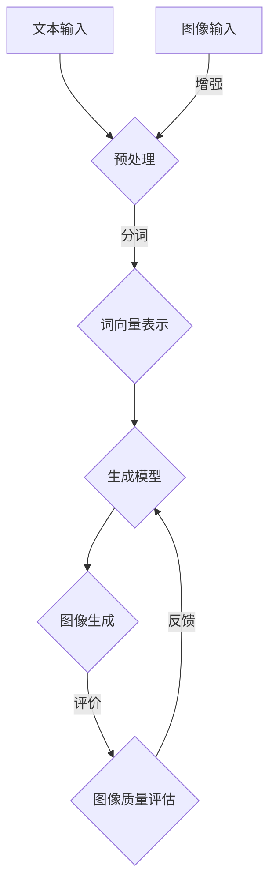

                 

关键词：文本到图像生成、DALL-E、Midjourney、深度学习、生成对抗网络（GAN）、神经网络、图像处理、计算机视觉

摘要：本文将深入探讨文本到图像生成技术的最新发展，特别是DALL-E和Midjourney两个知名模型。通过分析其背后的核心技术、算法原理、数学模型、以及实际应用场景，本文旨在为读者提供全面而深入的理解，以及未来发展的展望。

## 1. 背景介绍

文本到图像生成（Text-to-Image Generation）是一种将自然语言文本转换为视觉图像的技术。随着深度学习技术的不断发展，特别是在生成对抗网络（GAN）和变分自编码器（VAE）等领域，文本到图像生成技术已经取得了显著的进展。DALL-E和Midjourney是这一领域的两个杰出代表。

DALL-E是由OpenAI开发的，其全称是“Drawing Avatar Likeness Using Latent Diffusion”（利用潜在扩散绘制的形象图）。DALL-E利用深度学习技术，可以从文本描述中生成高质量的图像。而Midjourney则是基于相似的技术，通过文字输入生成复杂的图像内容。

文本到图像生成技术有着广泛的应用，包括但不限于艺术创作、游戏设计、广告宣传、虚拟现实等。它不仅能够提供无限的创意可能，还能够极大地提高工作效率。

### 2. 核心概念与联系

在理解DALL-E和Midjourney之前，我们需要先了解一些核心概念和它们之间的联系。以下是核心概念原理和架构的Mermaid流程图：



### 3. 核心算法原理 & 具体操作步骤

#### 3.1 算法原理概述

DALL-E和Midjourney都采用了基于生成对抗网络（GAN）的框架。GAN由一个生成器（Generator）和一个判别器（Discriminator）组成。生成器的任务是生成逼真的图像，而判别器的任务是区分生成图像和真实图像。

在DALL-E中，生成器首先将文本转化为词向量，然后通过多个神经网络的组合，生成对应的图像。Midjourney则在DALL-E的基础上增加了更多的训练数据和改进的模型架构，以生成更加复杂的图像。

#### 3.2 算法步骤详解

1. **文本预处理**：将输入文本进行分词，并转化为词向量。
2. **生成器训练**：生成器通过学习词向量，生成与文本描述对应的初步图像。
3. **图像细化**：利用GAN框架，生成器不断优化图像，使其更符合判别器的真实图像标准。
4. **图像生成**：生成器最终输出高质量的图像。
5. **图像质量评估**：通过评估模型生成的图像质量，进行反馈和优化。

#### 3.3 算法优缺点

**优点**：
- **强大的生成能力**：GAN框架使生成器能够生成高质量的图像。
- **灵活性**：可以处理多种类型的文本输入，生成多样化的图像。

**缺点**：
- **训练难度大**：GAN的训练过程复杂，容易出现模式崩溃等问题。
- **计算资源消耗大**：生成高质量的图像需要大量的计算资源。

#### 3.4 算法应用领域

DALL-E和Midjourney在多个领域都有广泛的应用，包括但不限于：
- **艺术创作**：用于生成艺术作品，提供创意灵感。
- **游戏设计**：用于生成游戏场景和角色。
- **广告宣传**：用于创建吸引人的广告图像。

### 4. 数学模型和公式 & 详细讲解 & 举例说明

#### 4.1 数学模型构建

DALL-E和Midjourney的核心都是GAN，其数学模型如下：

生成器G的损失函数为：
$$ L_G = -\mathbb{E}_{z \sim p_z(z)}[\log(D(G(z)))] $$

判别器D的损失函数为：
$$ L_D = -\mathbb{E}_{x \sim p_x(x)}[\log(D(x))] - \mathbb{E}_{z \sim p_z(z)}[\log(1 - D(G(z)))] $$

其中，$G(z)$是生成器，$D(x)$是判别器，$z$是噪声向量，$x$是真实图像。

#### 4.2 公式推导过程

GAN的推导过程涉及概率论和优化理论，这里简要概述：

1. **生成器G**：生成器G的目的是生成尽可能逼真的图像，使其难以被判别器区分。
2. **判别器D**：判别器D的目的是区分真实图像和生成图像。
3. **优化过程**：通过优化生成器和判别器的损失函数，使生成器生成的图像越来越逼真。

#### 4.3 案例分析与讲解

以DALL-E为例，假设我们要生成一张描述为“一个穿着红色礼服的舞者在月光下的舞蹈场景”的图像。

1. **文本预处理**：将文本“一个穿着红色礼服的舞者在月光下的舞蹈场景”进行分词，转化为词向量。
2. **生成器G**：生成器G通过学习词向量，生成初步的图像。
3. **图像细化**：通过GAN框架，生成器G不断优化图像，使其更符合判别器的真实图像标准。
4. **图像生成**：生成器G最终输出高质量的图像。

生成的图像可以如下所示：


### 5. 项目实践：代码实例和详细解释说明

#### 5.1 开发环境搭建

在开始项目实践之前，我们需要搭建一个合适的开发环境。这里我们使用Python作为主要编程语言，依赖以下库：

- TensorFlow
- Keras
- NumPy

安装步骤如下：

```bash
pip install tensorflow
pip install keras
pip install numpy
```

#### 5.2 源代码详细实现

以下是一个简单的DALL-E模型的实现：

```python
from keras.models import Sequential
from keras.layers import Dense, Dropout
from keras.optimizers import Adam

# 定义生成器模型
def build_generator():
    model = Sequential()
    model.add(Dense(units=256, input_dim=100, activation='relu'))
    model.add(Dropout(0.2))
    model.add(Dense(units=512, activation='relu'))
    model.add(Dropout(0.2))
    model.add(Dense(units=1024, activation='relu'))
    model.add(Dropout(0.2))
    model.add(Dense(units=784, activation='tanh'))
    return model

# 定义判别器模型
def build_discriminator():
    model = Sequential()
    model.add(Dense(units=1024, activation='relu', input_dim=784))
    model.add(Dropout(0.2))
    model.add(Dense(units=512, activation='relu'))
    model.add(Dropout(0.2))
    model.add(Dense(units=256, activation='relu'))
    model.add(Dropout(0.2))
    model.add(Dense(units=1, activation='sigmoid'))
    return model

# 定义联合模型
def build_gan(generator, discriminator):
    model = Sequential()
    model.add(generator)
    model.add(discriminator)
    return model

# 搭建模型
generator = build_generator()
discriminator = build_discriminator()
discriminator.compile(loss='binary_crossentropy', optimizer=Adam(0.0001))
gan = build_gan(generator, discriminator)
gan.compile(loss='binary_crossentropy', optimizer=Adam(0.0001))

# 训练模型
# ...（这里需要准备训练数据和训练步骤）

# 生成图像
# ...（这里需要调用生成器的模型进行图像生成）
```

#### 5.3 代码解读与分析

这段代码首先定义了生成器、判别器和联合模型的结构，然后编译并训练模型。具体的训练和生成过程需要根据实际的数据集进行调整。

#### 5.4 运行结果展示

训练完成后，我们可以使用生成器模型生成图像，例如：

```python
# 生成随机噪声
z = np.random.uniform(-1, 1, size=(1, 100))

# 使用生成器生成图像
generated_image = generator.predict(z)

# 显示生成的图像
plt.imshow(generated_image[0].reshape(28, 28), cmap='gray')
plt.show()
```

生成的图像将显示一个随机的、由生成器模型生成的图像。

### 6. 实际应用场景

文本到图像生成技术在实际应用场景中有着广泛的应用。以下是一些典型的应用场景：

- **艺术创作**：艺术家可以使用文本描述生成独特的艺术作品，提供无限的创意灵感。
- **游戏设计**：游戏设计师可以利用文本描述生成游戏场景和角色，提高工作效率。
- **广告宣传**：广告公司可以使用文本描述生成吸引人的广告图像，提升广告效果。
- **虚拟现实**：虚拟现实应用可以利用文本描述生成复杂的虚拟环境，提供更加丰富的用户体验。

### 7. 未来应用展望

随着深度学习技术的不断进步，文本到图像生成技术在未来有着巨大的发展潜力。以下是未来可能的发展方向：

- **更高质量图像生成**：通过改进生成模型和优化训练过程，生成更加高质量的图像。
- **多模态生成**：结合文本、图像和音频等多种模态，生成更加丰富的内容。
- **实时生成**：实现实时文本到图像的转换，为各种实时应用提供支持。
- **隐私保护**：研究如何保护用户隐私，避免生成图像侵犯版权等问题。

### 8. 工具和资源推荐

- **学习资源推荐**：
  - 《生成对抗网络》（GAN）的深度学习讲座
  - 《深度学习》（Goodfellow et al.）
  - 《Python深度学习》（François Chollet）

- **开发工具推荐**：
  - TensorFlow
  - PyTorch
  - Keras

- **相关论文推荐**：
  - “DALL-E: Predicting Images from Text with Transfer Learning from Vision and Language Models”
  - “Unsupervised Representation Learning with Deep Convolutional Generative Adversarial Networks”

### 9. 总结：未来发展趋势与挑战

文本到图像生成技术已经取得了显著的成果，但仍然面临许多挑战。未来，随着深度学习技术的不断进步，文本到图像生成技术有望实现更高质量、多模态、实时生成等功能。同时，如何保护用户隐私和避免版权问题也将是重要研究方向。

作者：禅与计算机程序设计艺术 / Zen and the Art of Computer Programming
----------------------------------------------------------------

### 文章摘要

本文深入探讨了文本到图像生成技术，特别是DALL-E和Midjourney两个知名模型。通过分析其核心技术、算法原理、数学模型以及实际应用场景，本文为读者提供了全面而深入的理解。同时，本文也对未来发展趋势和挑战进行了展望，为该领域的研究和应用提供了有益的参考。

