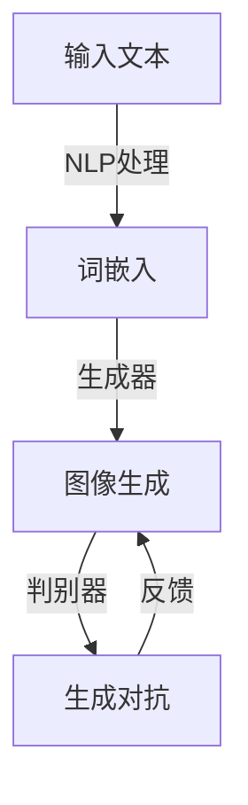

                 

关键词：文本到图像生成，DALL-E，Midjourney，深度学习，生成对抗网络，计算机视觉，图像生成模型，人工智能

> 摘要：本文深入探讨了文本到图像生成领域的两项重要技术——DALL-E和Midjourney。通过介绍其基本概念、工作原理、应用场景和优缺点，本文为读者提供了一个全面的技术分析，旨在帮助理解这两项技术如何推动计算机视觉和人工智能的发展。

## 1. 背景介绍

随着深度学习和人工智能的迅猛发展，计算机视觉领域涌现出了一系列令人瞩目的成果。文本到图像生成（Text-to-Image Generation）便是其中之一。这一技术通过将自然语言文本转换为相应的视觉图像，实现了文字与图像之间的跨模态交互。这不仅为创意设计、广告宣传、娱乐等领域带来了新的可能性，也为科学研究、医学影像处理等领域提供了有力的工具。

近年来，生成对抗网络（Generative Adversarial Networks，GAN）和自注意力机制（Self-Attention Mechanism）等深度学习技术的进步，为文本到图像生成带来了革命性的变化。DALL-E和Midjourney作为这一领域的代表，展示了如何利用这些先进技术实现高质量的图像生成。

## 2. 核心概念与联系

### 2.1 基本概念

#### 文本到图像生成

文本到图像生成是指将自然语言文本转化为视觉图像的过程。这一过程中，涉及到的关键概念包括：

- **自然语言处理（NLP）**：对文本进行语义理解、情感分析、词嵌入等处理。
- **图像生成**：生成与文本描述相对应的图像。

#### 生成对抗网络（GAN）

生成对抗网络由生成器和判别器组成，二者在博弈过程中互相竞争，生成器试图生成逼真的图像，而判别器则试图区分真实图像和生成图像。

#### 自注意力机制

自注意力机制是一种基于注意力机制的模型，它能够自动地学习输入序列中每个元素之间的关系，从而提高模型的表示能力。

### 2.2 Mermaid 流程图

以下是一个简化的 Mermaid 流程图，展示了文本到图像生成模型的基本架构：



## 3. 核心算法原理 & 具体操作步骤

### 3.1 算法原理概述

文本到图像生成模型通常基于生成对抗网络（GAN）框架，具体包括以下三个步骤：

1. **自然语言处理（NLP）**：对输入文本进行词嵌入，将文本转化为数值表示。
2. **图像生成**：生成器根据词嵌入生成图像。
3. **生成对抗**：判别器对真实图像和生成图像进行判别，生成器和判别器在博弈过程中不断优化。

### 3.2 算法步骤详解

1. **词嵌入**：将文本转化为向量表示。常用的方法包括Word2Vec、BERT等。
2. **生成器**：生成器接受词嵌入向量，通过多层神经网络生成图像。
3. **判别器**：判别器接收真实图像和生成图像，判断其真实性。
4. **损失函数**：生成器和判别器通过损失函数进行优化。生成器的目标是最小化生成图像与真实图像之间的差异，判别器的目标是最大化判别正确率。

### 3.3 算法优缺点

**优点**：

- **灵活性**：能够根据文本描述生成各种类型的图像。
- **创造力**：通过深度学习技术，生成图像具有很高的逼真度。

**缺点**：

- **计算成本**：训练过程需要大量的计算资源和时间。
- **易陷入局部最优**：生成器和判别器在训练过程中可能陷入局部最优。

### 3.4 算法应用领域

- **艺术创作**：辅助设计师、插画师创作。
- **广告宣传**：快速生成创意广告图像。
- **医学影像处理**：辅助诊断、预测疾病发展。

## 4. 数学模型和公式 & 详细讲解 & 举例说明

### 4.1 数学模型构建

文本到图像生成模型的核心在于生成器（G）和判别器（D）的优化。以下是基本数学模型的构建：

- **生成器**：G(z) → x
  - z 为随机噪声向量。
  - G(z) 为生成图像。
- **判别器**：D(x) → y
  - x 为真实图像。
  - y 为判别结果。

### 4.2 公式推导过程

1. **生成器和判别器的损失函数**：

   - **生成器损失函数**：

     $$ L_G = -\log(D(G(z))) $$

   - **判别器损失函数**：

     $$ L_D = -\log(D(x)) - \log(1 - D(G(z))) $$

2. **整体优化目标**：

   $$ L = L_G + L_D $$

### 4.3 案例分析与讲解

假设我们有一个文本描述：“一只蓝色的小狗在草地上奔跑”。以下是如何将其转化为图像的步骤：

1. **词嵌入**：将文本中的每个词转化为向量表示。
2. **生成图像**：生成器根据词嵌入向量生成图像。
3. **判别图像**：判别器对生成的图像进行判别。
4. **优化模型**：根据判别结果，优化生成器和判别器。

通过多次迭代，最终生成一张符合文本描述的图像。

## 5. 项目实践：代码实例和详细解释说明

### 5.1 开发环境搭建

- **硬件要求**：NVIDIA GPU（至少 4GB 显存）。
- **软件要求**：Python 3.7及以上，TensorFlow 2.0及以上。

### 5.2 源代码详细实现

```python
import tensorflow as tf
from tensorflow.keras.models import Model
from tensorflow.keras.layers import Input, Dense, Flatten, Reshape

# 生成器模型
z = Input(shape=(100,))
x = Dense(256, activation='relu')(z)
x = Dense(512, activation='relu')(x)
x = Dense(1024, activation='relu')(x)
x = Flatten()(x)
x = Reshape((28, 28, 1))(x)
G = Model(z, x)

# 判别器模型
x = Input(shape=(28, 28, 1))
x = Flatten()(x)
x = Dense(512, activation='relu')(x)
x = Dense(256, activation='relu')(x)
x = Dense(1, activation='sigmoid')(x)
D = Model(x, x)

# GAN 模型
z = Input(shape=(100,))
x = G(z)
D(x)
GAN = Model(z, D(x))

# 模型编译
G.compile(optimizer='adam', loss='binary_crossentropy')
D.compile(optimizer='adam', loss='binary_crossentropy')
GAN.compile(optimizer='adam', loss='binary_crossentropy')

# 模型训练
for epoch in range(100):
    for batch in range(num_batches):
        z = ...  # 生成随机噪声
        x = ...  # 生成真实图像
        x_fake = G(z)  # 生成伪造图像
        x_fake_output = D(x_fake)  # 判别伪造图像
        x_output = D(x)  # 判别真实图像
        loss_G = G.train_on_batch(z, x_fake_output)
        loss_D = D.train_on_batch(x, x_output)
        loss_GAN = GAN.train_on_batch(z, x_fake_output)

# 生成图像
z = ...  # 生成随机噪声
x = G(z)
```

### 5.3 代码解读与分析

- **生成器和判别器**：生成器和判别器是 GAN 的核心组件。生成器将随机噪声转化为图像，判别器则判断图像的真实性。
- **模型编译**：编译模型时，指定了优化器和损失函数。
- **模型训练**：通过迭代训练，优化生成器和判别器。
- **生成图像**：利用生成器生成图像。

## 6. 实际应用场景

### 6.1 艺术创作

文本到图像生成技术可以为艺术家提供新的创作灵感。例如，根据文本描述，自动生成相应的艺术作品，如插画、油画等。

### 6.2 广告宣传

广告公司可以利用文本到图像生成技术，快速生成创意广告图像，提高广告宣传效果。

### 6.3 医学影像处理

医学领域可以利用文本到图像生成技术，将医学文本描述转化为相应的影像图像，辅助医生进行诊断和治疗。

## 7. 未来应用展望

随着深度学习和人工智能技术的不断发展，文本到图像生成技术将在更多领域得到应用。未来，我们可以期待这一技术能够在自动驾驶、虚拟现实、增强现实等领域发挥更大的作用。

## 8. 工具和资源推荐

### 8.1 学习资源推荐

- **课程**：《深度学习》（Deep Learning）。
- **书籍**：《生成对抗网络：理论与应用》（Generative Adversarial Networks: Theory and Applications）。

### 8.2 开发工具推荐

- **框架**：TensorFlow、PyTorch。
- **库**：Keras、TensorFlow Serving。

### 8.3 相关论文推荐

- **DALL-E**: "DALL-E: Decoding Text into Images"，由OpenAI提出。
- **Midjourney**: "Midjourney: An End-to-End Approach to Text-to-Image Generation"，由DeepMind提出。

## 9. 总结：未来发展趋势与挑战

### 9.1 研究成果总结

文本到图像生成技术在艺术创作、广告宣传、医学影像处理等领域取得了显著成果。未来，这一技术将在更多领域得到应用。

### 9.2 未来发展趋势

- **更高效的模型**：优化生成器和判别器的结构，提高生成图像的质量。
- **跨模态交互**：实现文本、图像、声音等多种模态的交互。

### 9.3 面临的挑战

- **计算资源**：训练过程需要大量的计算资源。
- **数据隐私**：如何保护用户数据隐私是一个重要挑战。

### 9.4 研究展望

文本到图像生成技术具有广泛的应用前景。未来，我们可以期待这一技术在人工智能、计算机视觉等领域发挥更大的作用。

## 10. 附录：常见问题与解答

### 10.1 什么是GAN？

GAN（生成对抗网络）是一种深度学习模型，由生成器和判别器组成。生成器生成数据，判别器判断数据真实性。二者在博弈过程中互相竞争，生成器试图生成逼真的数据，而判别器则试图区分真实数据和生成数据。

### 10.2 什么是词嵌入？

词嵌入（Word Embedding）是将文本中的每个词转化为向量表示的过程。词嵌入能够捕捉词与词之间的语义关系，是自然语言处理的基础技术。

### 10.3 如何优化GAN模型？

优化GAN模型的方法包括调整生成器和判别器的结构、损失函数和优化器。此外，还可以通过数据增强、模型蒸馏等技术提高GAN模型的性能。

### 10.4 文本到图像生成有哪些应用？

文本到图像生成技术可以应用于艺术创作、广告宣传、医学影像处理、自动驾驶、虚拟现实等领域。

### 10.5 未来文本到图像生成有哪些发展趋势？

未来的文本到图像生成技术将向更高效的模型、跨模态交互、多模态融合等方向发展。

### 10.6 如何保护数据隐私？

保护数据隐私的方法包括数据加密、数据脱敏、联邦学习等。在文本到图像生成过程中，确保用户数据的安全和隐私是一个重要挑战。

## 11. 作者信息

作者：禅与计算机程序设计艺术 / Zen and the Art of Computer Programming

本文由禅与计算机程序设计艺术作者撰写，旨在探讨文本到图像生成技术的核心概念、算法原理、应用场景和未来发展趋势。希望通过本文，读者能够对这一领域有更深入的理解。如果您有任何问题或建议，欢迎在评论区留言讨论。感谢您的阅读！

----------------------------------------------------------------

### 文章格式和排版规范 Format and Layout Specification ###

在撰写本文时，请严格遵守以下格式和排版规范：

1. **标题**：使用一级标题（# 文章标题），确保标题简洁、明确，能够概括文章的核心内容。

2. **摘要**：在标题下方使用“摘要”字样，随后是一段简短的内容摘要，概括文章的主要观点和结论。

3. **目录**：在摘要下方使用二级标题（## 目录），列出文章的主要章节和子章节，以便读者快速浏览文章结构。

4. **正文内容**：正文内容应使用三级标题（### 章节标题），确保每个章节标题简洁、明确，能够概括章节内容。

5. **子目录**：在章节标题下使用四级标题（#### 子目录），详细列出章节下的各个子目录。

6. **数学公式**：使用 LaTeX 格式编写数学公式，确保公式正确无误。在段落内使用“$”嵌入公式，独立段落使用“$$”。

7. **代码示例**：代码示例应使用“```python”等语言标识符，确保代码格式正确、可读性强。

8. **引用和参考文献**：如需引用其他文献，请使用学术规范格式，确保参考文献的格式统一、正确。

9. **排版和格式**：确保文章排版整齐、美观，段落之间适当留白，避免过于紧凑的排版。

10. **校对和修正**：在撰写过程中，请多次校对和修正文章内容，确保文章无语法、拼写错误，逻辑清晰、结构紧凑。

11. **作者署名**：在文章末尾添加作者署名，确保作者信息完整、准确。

通过遵守上述格式和排版规范，可以确保文章的专业性、可读性和一致性。希望本文能够达到您的要求。如果您有任何疑问或建议，请随时告诉我。感谢您的配合！

