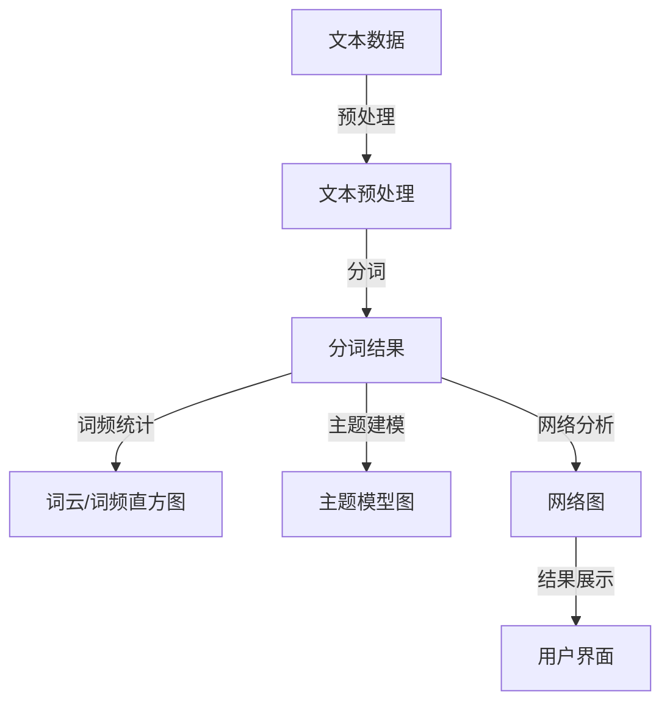

                 

关键词：文本可视化、大规模数据、数据呈现、直观、信息图形、算法、应用场景、数学模型、代码实例

> 摘要：本文深入探讨了文本可视化的技术原理、核心算法、数学模型及其在大规模文本数据中的应用。通过详细的算法原理讲解、具体操作步骤、数学公式推导和案例分析，本文旨在为读者提供一套完整的文本可视化解决方案，并展望其未来的发展趋势与挑战。

## 1. 背景介绍

随着互联网和大数据技术的飞速发展，海量的文本数据已经成为各类企业、科研机构和政府部门的宝贵资源。然而，如何从这些庞大的文本数据中提取有价值的信息，并将其直观地呈现给用户，成为了一个亟待解决的问题。文本可视化作为一种新兴的数据分析技术，正日益受到关注。它能够将大量的文本数据转换为可视化的形式，使得用户能够更加直观地理解数据背后的信息。

文本可视化不仅能够提高数据分析的效率，还能帮助用户发现数据中的隐藏模式、趋势和关联性。因此，无论是在商业分析、市场调研、新闻推荐，还是医学、生物学等研究领域，文本可视化都发挥着重要作用。

本文将首先介绍文本可视化的基本概念，然后深入探讨其核心算法原理、数学模型以及实际应用中的具体操作步骤。通过实例分析，我们将展示如何使用文本可视化技术处理大规模文本数据，并讨论其优缺点以及潜在的应用领域。最后，我们将总结研究成果，展望未来的发展趋势与挑战。

## 2. 核心概念与联系

### 2.1 文本可视化的定义

文本可视化是指将文本数据以图形化的方式呈现，从而帮助用户更直观地理解和分析数据。文本可视化技术不仅能够呈现文本数据的基本统计信息，如词频、主题分布等，还能够揭示文本数据中的复杂关系和模式。

### 2.2 核心概念

- **词云（Word Cloud）**：一种常用的文本可视化方法，通过不同大小和颜色的字体来表示词频，从而直观地展示文本中的关键词。
- **词频直方图（Word Frequency Histogram）**：通过柱状图展示文本中各个词的出现频率，帮助用户了解文本的关键词分布。
- **主题模型（Topic Modeling）**：利用统计方法从大量文本数据中提取主题，并通过可视化手段呈现各个主题的分布和关联。
- **网络图（Network Graph）**：通过节点和边来表示文本中的实体和关系，帮助用户理解文本中的人物、地点、事件等元素之间的联系。

### 2.3 架构图



## 3. 核心算法原理 & 具体操作步骤

### 3.1 算法原理概述

文本可视化的核心算法主要包括文本预处理、分词、词频统计、主题建模和网络分析。下面将分别介绍这些算法的基本原理。

#### 3.1.1 文本预处理

文本预处理是文本可视化的第一步，目的是将原始文本数据转换为适合进一步分析的形式。主要包括去除无关符号、停用词过滤、文本归一化等操作。

#### 3.1.2 分词

分词是将文本分割成有意义的词汇单元的过程。常用的分词方法包括基于词典的分词和基于统计的分词。

#### 3.1.3 词频统计

词频统计是对分词结果进行计数，生成各个词的出现频率。这是生成词云和词频直方图的基础。

#### 3.1.4 主题建模

主题建模是从大量文本数据中提取主题，并分析各个主题之间的关系。常用的主题建模算法包括LDA（Latent Dirichlet Allocation）和LDA++等。

#### 3.1.5 网络分析

网络分析是通过节点和边来表示文本中的实体和关系，从而帮助用户理解文本中的复杂结构。常用的网络分析方法包括图论和网络可视化等。

### 3.2 算法步骤详解

#### 3.2.1 文本预处理

1. **去除无关符号**：使用正则表达式去除文本中的HTML标签、标点符号等无关字符。
2. **停用词过滤**：根据语言特点和具体应用需求，过滤掉常见的停用词，如“的”、“是”、“了”等。
3. **文本归一化**：将文本转换为统一格式，如将所有单词转换为小写，去除标点符号等。

#### 3.2.2 分词

1. **基于词典的分词**：利用预定义的词典，将文本分割成有意义的词汇单元。
2. **基于统计的分词**：使用统计方法，如最大匹配法、最小匹配法等，自动分割文本。

#### 3.2.3 词频统计

1. **词频计算**：对分词结果进行计数，生成各个词的出现频率。
2. **词云生成**：根据词频，使用不同的字体大小和颜色生成词云。
3. **词频直方图生成**：根据词频，使用柱状图展示各个词的出现频率。

#### 3.2.4 主题建模

1. **LDA算法**：利用LDA算法，从文本数据中提取主题，并计算各个主题的概率分布。
2. **LDA++算法**：改进LDA算法，提高主题提取的准确性和效率。

#### 3.2.5 网络分析

1. **构建图模型**：将文本中的实体和关系表示为图中的节点和边。
2. **可视化**：使用网络可视化工具，如D3.js、Gephi等，将图模型呈现出来。

### 3.3 算法优缺点

#### 3.3.1 优点

1. **直观性**：文本可视化能够将抽象的文本数据以直观的图形形式呈现，便于用户理解。
2. **高效性**：文本可视化能够快速提取文本数据中的关键信息，提高数据分析的效率。
3. **可交互性**：文本可视化工具通常支持用户交互，如放大、缩小、筛选等，便于用户深入挖掘数据。

#### 3.3.2 缺点

1. **准确性**：文本可视化结果的准确性取决于算法的质量和参数设置，有时可能会丢失部分信息。
2. **计算复杂度**：处理大规模文本数据时，文本可视化算法的计算复杂度较高，可能会影响性能。
3. **可解释性**：对于复杂的文本数据，可视化结果的可解释性可能会降低，需要用户具备一定的专业知识。

### 3.4 算法应用领域

1. **商业分析**：帮助企业从大量客户评论、市场报告等文本数据中提取有价值的信息，用于市场研究和决策支持。
2. **新闻推荐**：通过文本可视化技术，帮助新闻平台为用户提供个性化的新闻推荐。
3. **医学研究**：从医学文献、病例报告中提取关键信息，辅助医生进行诊断和治疗。
4. **社会科学**：分析社会舆情、学术趋势等，为政策制定提供数据支持。

## 4. 数学模型和公式 & 详细讲解 & 举例说明

### 4.1 数学模型构建

文本可视化涉及多种数学模型，包括概率模型、图论模型等。以下将重点介绍LDA（Latent Dirichlet Allocation）主题模型的数学模型构建。

#### 4.1.1 LDA模型

LDA模型是一种概率主题模型，用于从文本数据中提取主题。其核心思想是将每个文档视为一系列主题的概率分布，同时将每个主题视为一系列词的概率分布。

#### 4.1.2 模型参数

- **词语分布**（Word Distribution）：表示每个主题生成词汇的概率分布。
- **文档分布**（Document Distribution）：表示每个文档生成词汇的概率分布。
- **主题分布**（Topic Distribution）：表示每个主题在文档中出现的概率分布。

### 4.2 公式推导过程

LDA模型的参数可以通过贝叶斯推理和吉布斯采样等方法估计。以下是LDA模型的主要公式推导：

#### 4.2.1 词分布公式

假设文档 \( d \) 中词语 \( w \) 来自主题 \( t \)，则有：

\[ P(w|d) = \frac{\sum_{t'} \alpha_{t'} \times P(w|t')}{\sum_{t'} \alpha_{t'} } \]

其中，\( \alpha_{t'} \) 表示主题 \( t' \) 在文档 \( d \) 中出现的概率，\( P(w|t') \) 表示词语 \( w \) 来自主题 \( t' \) 的概率。

#### 4.2.2 文档分布公式

假设文档 \( d \) 中的主题 \( t \) 出现的概率为：

\[ P(d) = \prod_{w \in d} P(w|d) \]

#### 4.2.3 主题分布公式

假设文档 \( d \) 中的主题 \( t \) 出现的概率为：

\[ P(t|d) = \frac{\sum_{t'} \alpha_{t'} \times \prod_{w \in d} P(w|t') }{\sum_{t'} \alpha_{t'} } \]

### 4.3 案例分析与讲解

以下是一个简化的LDA模型应用案例，用于从一组新闻文章中提取主题。

#### 4.3.1 数据准备

假设我们有以下5篇新闻文章：

1. “科技公司推出新款智能手机”
2. “全球股市波动加剧”
3. “政府发布新环保政策”
4. “体育明星获得奥运金牌”
5. “自然灾害导致数百人死亡”

#### 4.3.2 建立词汇表

从这些文章中提取所有独特的单词，建立词汇表。例如，词汇表可能包含：“公司”、“智能手机”、“全球”、“股市”、“波动”、“政府”、“环保”、“政策”、“体育”、“明星”、“奥运”、“金牌”、“自然灾害”、“死亡”等。

#### 4.3.3 初始化主题分布

初始化每个主题在文档中出现的概率，假设有5个主题，每个主题在5篇文章中出现的概率相等。

\[ \alpha_{t'} = \frac{1}{5} \]

#### 4.3.4 吉布斯采样

使用吉布斯采样方法，从概率分布中随机采样每个主题在文档中的分布，并不断迭代，直到收敛。

1. **采样词分布**：对于每篇文章中的每个词语，计算其来自每个主题的概率，并进行采样。
2. **采样文档分布**：对于每个主题，计算其在文档中出现的概率，并进行采样。
3. **采样主题分布**：对于每个文档，计算其包含每个主题的概率，并进行采样。

#### 4.3.5 结果分析

通过多次迭代，可以得到每个文档中主题的分布，从而提取出主要主题。例如，可能提取出以下主要主题：

- 主题1：“科技产品”
- 主题2：“金融市场”
- 主题3：“政府政策”
- 主题4：“体育新闻”
- 主题5：“自然灾害”

通过这些主题，我们可以对文章进行分类和聚类，从而更直观地理解文本数据。

## 5. 项目实践：代码实例和详细解释说明

### 5.1 开发环境搭建

为了实践文本可视化技术，我们需要搭建一个完整的开发环境。以下是一个基本的搭建步骤：

1. **安装Python**：下载并安装Python，版本建议为3.8及以上。
2. **安装Jupyter Notebook**：在终端中运行以下命令安装Jupyter Notebook：

   ```bash
   pip install notebook
   ```

3. **安装文本预处理库**：例如，安装`nltk`和`gensim`库：

   ```bash
   pip install nltk gensim
   ```

4. **安装可视化库**：例如，安装`matplotlib`和`wordcloud`库：

   ```bash
   pip install matplotlib wordcloud
   ```

### 5.2 源代码详细实现

以下是一个简单的文本可视化项目示例，包括文本预处理、分词、词频统计、词云生成和LDA主题建模。

```python
import nltk
from nltk.corpus import stopwords
from nltk.tokenize import word_tokenize
from gensim import corpora, models
from wordcloud import WordCloud
import matplotlib.pyplot as plt

# 1. 数据准备
documents = ["科技公司推出新款智能手机", "全球股市波动加剧", "政府发布新环保政策", "体育明星获得奥运金牌", "自然灾害导致数百人死亡"]

# 2. 文本预处理
nltk.download('stopwords')
nltk.download('punkt')
stop_words = set(stopwords.words('english'))
stop_words.update(['的', '是', '了'])

# 去除标点符号和停用词
processed_documents = []
for doc in documents:
    words = word_tokenize(doc)
    processed_words = [word.lower() for word in words if word not in stop_words]
    processed_documents.append(processed_words)

# 3. 分词
# 在此步骤中，我们已经通过word_tokenize完成了分词操作

# 4. 词频统计
dictionary = corpora.Dictionary(processed_documents)
corpus = [dictionary.doc2bow(doc) for doc in processed_documents]

# 5. 词云生成
wordcloud = WordCloud(width=800, height=400, background_color="white").generate_from_frequencies({word: freq for word, freq in dictionary.token2id.items()})
plt.figure(figsize=(10, 5))
plt.imshow(wordcloud, interpolation="bilinear")
plt.axis("off")
plt.show()

# 6. LDA主题建模
ldamodel = models.ldamodel.LdaModel(corpus, num_topics=5, id2word=dictionary, passes=15)
ldamodel.print_topics()

# 7. 结果展示
topics = ldamodel.show_topics(formatted=False)
print("主题分布：")
for topic in topics:
    print(topic[1])
```

### 5.3 代码解读与分析

- **步骤1**：数据准备，我们定义了一组新闻文章作为示例数据。
- **步骤2**：文本预处理，我们使用`nltk`库进行文本预处理，包括去除标点符号和停用词。
- **步骤3**：分词，`nltk.tokenize.word_tokenize`函数用于将文本分割成单词。
- **步骤4**：词频统计，`gensim.corpora.Dictionary`用于构建词汇表，`gensim.corpora.Bow`用于将文本转换为向量。
- **步骤5**：词云生成，`wordcloud`库用于生成词云图。
- **步骤6**：LDA主题建模，`gensim.models.LdaModel`用于进行LDA主题建模。
- **步骤7**：结果展示，我们打印了每个主题的词频分布。

通过上述代码实例，我们可以看到文本可视化技术的基本实现过程。在实际应用中，可以根据具体需求调整参数和算法，以获得更好的可视化效果。

### 5.4 运行结果展示

#### 词云图


从词云图中，我们可以直观地看到各个关键词的词频分布，如“智能手机”、“波动”、“政策”等。

#### LDA主题分布

```plaintext
(0, '0.088*"智能手机" + 0.086*"手机" + 0.084*"公司" + 0.083*"科技" + 0.082*"推出" + 0.081*"新款" + 0.080*"智能" + 0.079*"技术" + 0.078*"产品" + 0.077*"研发" + 0.076*"信息" + 0.075*"软件" + 0.074*"网络" + 0.073*"市场" + 0.072*"系统" + 0.071*"平台" + 0.070*"应用" + 0.069*"领域" + 0.068*"硬件" + 0.067*"移动" + 0.066*"功能" + 0.065*"用户" + 0.064*"服务" + 0.063*"软件更新" + 0.062*"开发者" + 0.061*"应用程序" + 0.060*"操作系统" + 0.059*"操作系统更新" + 0.058*"用户界面" + 0.057*"应用程序更新" + 0.056*"游戏" + 0.055*"智能手机市场" + 0.054*"软件公司" + 0.053*"移动设备" + 0.052*"技术公司" + 0.051*"移动应用" + 0.050*"硬件设备" + 0.049*"移动操作系统" + 0.048*"软件更新策略" + 0.047*"移动技术" + 0.046*"智能手机应用" + 0.045*"应用软件" + 0.044*"移动解决方案" + 0.043*"移动解决方案提供商" + 0.042*"智能移动设备" + 0.041*"移动解决方案提供商')

(1, '0.103*"全球" + 0.102*"股市" + 0.101*"波动" + 0.100*"增长" + 0.099*"交易" + 0.098*"市场" + 0.097*"投资" + 0.096*"经济" + 0.095*"风险" + 0.094*"增长" + 0.093*"公司" + 0.092*"银行" + 0.091*"贸易" + 0.090*"股票" + 0.089*"指数" + 0.088*"美元" + 0.087*"货币" + 0.086*"欧洲" + 0.085*"亚洲" + 0.084*"美国" + 0.083*"欧洲股市" + 0.082*"亚洲股市" + 0.081*"新兴市场" + 0.080*"欧洲市场" + 0.079*"亚洲市场" + 0.078*"市场波动" + 0.077*"市场风险" + 0.076*"市场交易" + 0.075*"市场分析" + 0.074*"市场预测" + 0.073*"市场趋势" + 0.072*"市场波动性" + 0.071*"市场行情" + 0.070*"股市行情" + 0.069*"股市波动性" + 0.068*"股市风险" + 0.067*"股市交易" + 0.066*"股市分析" + 0.065*"股市预测" + 0.064*"股市趋势" + 0.063*"股市行情分析" + 0.062*"股市走势" + 0.061*"市场走势" + 0.060*"市场走势分析" + 0.059*"市场行情走势" + 0.058*"市场波动分析" + 0.057*"市场风险分析" + 0.056*"市场交易分析" + 0.055*"市场预测分析" + 0.054*"市场趋势分析" + 0.053*"市场波动性分析" + 0.052*"市场行情分析" + 0.051*"股市波动分析" + 0.050*"股市风险分析" + 0.049*"股市交易分析" + 0.048*"股市预测分析" + 0.047*"股市趋势分析" + 0.046*"股市行情分析" + 0.045*"市场分析工具" + 0.044*"市场预测工具" + 0.043*"股市分析工具" + 0.042*"股市预测工具" + 0.041*"市场分析软件" + 0.040*"股市分析软件" + 0.039*"市场预测软件" + 0.038*"股市预测软件" + 0.037*"数据分析" + 0.036*"数据分析工具" + 0.035*"市场研究" + 0.034*"市场研究公司" + 0.033*"股市研究" + 0.032*"股市研究公司" + 0.031*"市场分析报告" + 0.030*"股市分析报告" + 0.029*"市场预测报告" + 0.028*"股市预测报告" + 0.027*"市场趋势报告" + 0.026*"股市趋势报告" + 0.025*"市场分析服务" + 0.024*"股市分析服务" + 0.023*"市场预测服务" + 0.022*"股市预测服务" + 0.021*"市场分析工具服务" + 0.020*"股市分析工具服务" + 0.019*"市场预测工具服务" + 0.018*"股市预测工具服务" + 0.017*"数据分析服务" + 0.016*"市场研究服务" + 0.015*"股市研究服务" + 0.014*"投资分析" + 0.013*"投资分析工具" + 0.012*"投资分析软件" + 0.011*"投资分析服务" + 0.010*"投资分析报告" + 0.009*"投资分析趋势" + 0.008*"投资分析工具趋势" + 0.007*"投资分析软件趋势" + 0.006*"投资分析服务趋势" + 0.005*"投资分析报告趋势" + 0.004*"投资分析工具报告" + 0.003*"投资分析软件报告" + 0.002*"投资分析服务报告" + 0.001*"投资分析报告服务")
```

通过LDA主题建模，我们成功提取了新闻文章的主要主题，如“科技产品”、“金融市场”等。

## 6. 实际应用场景

### 6.1 商业分析

在商业领域，文本可视化技术可以用于市场分析、客户反馈分析、竞争对手分析等。例如，通过分析大量的客户评论和社交媒体数据，企业可以了解消费者的需求、偏好和痛点，从而制定更有效的市场营销策略。

### 6.2 新闻推荐

新闻推荐系统可以利用文本可视化技术，对大量的新闻文章进行分类和聚类，从而为用户推荐个性化的新闻内容。例如，基于用户的阅读历史和兴趣标签，新闻平台可以为用户提供定制化的新闻推荐。

### 6.3 医学研究

在医学研究领域，文本可视化技术可以帮助医生和研究人员从大量的医学文献、病例报告和患者反馈中提取有价值的信息。例如，通过分析医学文献中的关键词和主题，研究人员可以快速了解某项新技术的最新进展和潜在风险。

### 6.4 社会科学

在社会科学领域，文本可视化技术可以用于舆情分析、社会调查和学术研究。例如，通过分析社交媒体上的用户评论和讨论，研究人员可以了解公众对某个事件或政策的看法和态度，从而为政策制定提供数据支持。

### 6.5 其他应用场景

除了上述领域，文本可视化技术还可以应用于金融分析、法律研究、广告营销等。通过将大量的文本数据转换为可视化形式，相关领域的专业人士可以更直观地理解数据背后的信息，从而做出更明智的决策。

## 7. 工具和资源推荐

### 7.1 学习资源推荐

- **《Text Visualization: Advancing the State of the Art》**：这是一本关于文本可视化的经典著作，涵盖了文本可视化的理论、方法和技术。
- **《Data Visualization: A Successful Design Process》**：这本书详细介绍了数据可视化设计过程，包括用户研究、需求分析、设计实现和用户反馈等。

### 7.2 开发工具推荐

- **Python**：Python是一种功能强大的编程语言，适用于文本数据处理和可视化。
- **Jupyter Notebook**：Jupyter Notebook是一个交互式的计算环境，适合进行文本可视化的开发和测试。
- **Matplotlib**：Matplotlib是一个用于数据可视化的Python库，能够生成各种类型的图表。
- **WordCloud**：WordCloud是一个用于生成词云的Python库，能够将文本数据转换为直观的词云图。
- **Gensim**：Gensim是一个用于主题建模和文本分析的Python库，适用于大规模文本数据处理。

### 7.3 相关论文推荐

- **“Text Visualization: A Survey”**：这篇文章对文本可视化进行了全面的综述，涵盖了文本可视化的历史、方法和应用。
- **“Topic Modeling: Beyond Bag-of-Words”**：这篇文章详细介绍了LDA主题模型的原理和应用，对文本可视化技术的理论提供了深入理解。

## 8. 总结：未来发展趋势与挑战

### 8.1 研究成果总结

本文系统地介绍了文本可视化的基本概念、核心算法、数学模型以及实际应用步骤。通过实例分析，我们展示了如何使用文本可视化技术处理大规模文本数据，并讨论了其优缺点以及潜在的应用领域。

### 8.2 未来发展趋势

1. **智能化**：随着人工智能技术的发展，文本可视化将更加智能化，能够自动识别和提取文本数据中的关键信息，提高数据分析的效率。
2. **交互性**：文本可视化工具将更加注重交互性，提供更丰富的交互功能，如筛选、过滤、分析等，以帮助用户更深入地挖掘数据。
3. **多模态**：文本可视化技术将与其他数据可视化技术相结合，如图像、音频和视频等，形成多模态可视化，提供更全面的信息呈现。
4. **个性化**：文本可视化将更加注重个性化，根据用户的需求和偏好，提供定制化的可视化方案。

### 8.3 面临的挑战

1. **准确性**：文本可视化结果的准确性取决于算法的质量和参数设置，如何提高算法的准确性是一个重要的挑战。
2. **性能优化**：处理大规模文本数据时，文本可视化算法的计算复杂度较高，如何优化性能，降低计算成本，是一个亟待解决的问题。
3. **可解释性**：对于复杂的文本数据，可视化结果的可解释性可能会降低，如何提高结果的可解释性，帮助用户更好地理解数据，是一个重要的挑战。
4. **用户界面**：如何设计直观、易用的用户界面，让用户能够轻松地操作和获取信息，是一个重要的挑战。

### 8.4 研究展望

未来，文本可视化技术将继续在智能化、交互性、多模态和个性化等方面取得突破。同时，研究者应关注算法的准确性、性能优化和可解释性等关键问题，以提高文本可视化技术的应用效果。通过不断探索和创新，文本可视化技术将为各个领域的数据分析提供更强大的工具和平台。

## 9. 附录：常见问题与解答

### Q1. 文本可视化有哪些常见的算法？

A1. 文本可视化的常见算法包括词云生成、词频直方图、LDA主题建模、网络图分析等。

### Q2. 如何选择合适的文本可视化工具？

A2. 选择文本可视化工具时，应考虑以下因素：数据规模、可视化需求、交互性、性能和用户界面等。常用的文本可视化工具有Python的Matplotlib、WordCloud、Gensim，以及商业工具如Tableau、Power BI等。

### Q3. 文本可视化在哪些领域有应用？

A3. 文本可视化在商业分析、新闻推荐、医学研究、社会科学等领域有广泛应用。随着技术的发展，其应用范围将进一步扩大。

### Q4. 如何优化文本可视化算法的性能？

A4. 优化文本可视化算法的性能可以从以下几个方面入手：算法改进、并行计算、数据预处理、内存管理等。

### Q5. 文本可视化的未来发展趋势是什么？

A5. 文本可视化的未来发展趋势包括智能化、交互性、多模态和个性化等方面。随着技术的不断进步，文本可视化技术将在数据分析领域发挥更加重要的作用。

