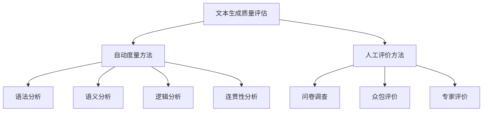

                 

关键词：文本生成质量评估、自动度量、人工评价、自然语言处理、机器学习、文本质量指标

> 摘要：本文旨在探讨文本生成质量评估的方法，包括自动度量与人工评价两种方式。通过对文本生成质量评估的重要性、核心概念、算法原理、数学模型、项目实践、实际应用场景、工具和资源推荐以及未来发展趋势与挑战的全面分析，为文本生成领域的进一步研究和应用提供理论支持和实践指导。

## 1. 背景介绍

随着自然语言处理（NLP）和机器学习技术的快速发展，文本生成已成为一个备受关注的研究领域。文本生成技术在各种应用场景中发挥着重要作用，如自动问答系统、机器翻译、内容生成、虚拟助手等。然而，文本生成的质量直接影响用户体验和系统的实用性，因此，如何准确评估文本生成质量成为了一个亟待解决的问题。

文本生成质量评估主要分为自动度量与人工评价两种方式。自动度量方法利用算法和模型对文本质量进行量化分析，而人工评价则依靠人类主观判断进行质量评估。本文将详细介绍这两种方法，分析各自的优缺点，并探讨如何将二者有机结合，以提高文本生成质量评估的准确性和可靠性。

## 2. 核心概念与联系

### 2.1 文本生成质量评估的定义

文本生成质量评估是指对生成的文本进行质量分析和评估的过程，旨在衡量文本在语法、语义、逻辑、连贯性等方面的表现。高质量文本应具备以下几个特点：

1. 语法正确：文本应遵循语法规则，没有拼写错误、语法错误等。
2. 语义准确：文本应传达正确的信息，语义一致，无歧义。
3. 逻辑清晰：文本应具备良好的逻辑结构，论证有力，条理清晰。
4. 连贯性良好：文本应具备良好的连贯性，句子间衔接自然，段落过渡顺畅。

### 2.2 自动度量方法

自动度量方法主要通过算法和模型对文本质量进行量化分析，常用的方法包括：

1. 语法分析：利用自然语言处理技术对文本进行语法分析，评估文本的语法正确性。
2. 语义分析：利用词嵌入、语义角色标注等方法对文本进行语义分析，评估文本的语义准确性。
3. 逻辑分析：利用逻辑推理、因果分析等方法对文本进行逻辑分析，评估文本的逻辑清晰性。
4. 连贯性分析：利用句间关系分析、段落结构分析等方法对文本进行连贯性分析，评估文本的连贯性。

### 2.3 人工评价方法

人工评价方法依靠人类主观判断对文本质量进行评估，常用的方法包括：

1. 问卷调查：通过设计问卷，收集用户对文本质量的评价。
2. 众包评价：利用众包平台，邀请多个用户对文本进行评价。
3. 专家评价：邀请领域专家对文本进行评价，具有较高的可信度。

### 2.4 Mermaid 流程图

以下是一个简单的 Mermaid 流程图，展示了文本生成质量评估的核心概念与联系：



## 3. 核心算法原理 & 具体操作步骤

### 3.1 算法原理概述

文本生成质量评估的核心算法主要包括自动度量方法和人工评价方法。自动度量方法主要通过自然语言处理技术和机器学习模型对文本质量进行量化分析，而人工评价方法则依靠人类主观判断对文本质量进行评估。

### 3.2 算法步骤详解

#### 3.2.1 自动度量方法

1. 数据预处理：对文本进行清洗、去噪和分词等预处理操作。
2. 语法分析：利用语法分析技术对文本进行语法检查，识别语法错误。
3. 语义分析：利用词嵌入、语义角色标注等方法对文本进行语义分析，识别语义错误。
4. 逻辑分析：利用逻辑推理、因果分析等方法对文本进行逻辑分析，识别逻辑错误。
5. 连贯性分析：利用句间关系分析、段落结构分析等方法对文本进行连贯性分析，识别连贯性错误。
6. 综合评估：根据各指标的得分，计算文本生成质量的总体得分。

#### 3.2.2 人工评价方法

1. 设计问卷：根据文本生成质量评估的标准，设计相应的问卷。
2. 数据收集：通过问卷调查、众包评价或专家评价等方式收集用户对文本质量的评价。
3. 数据分析：对收集到的数据进行分析，计算各评价指标的得分。
4. 结果展示：将各评价指标的得分进行可视化展示，为文本生成质量的综合评估提供依据。

### 3.3 算法优缺点

#### 自动度量方法

优点：

1. 速度快：自动度量方法能够高效地对大量文本进行质量评估。
2. 可重复性：自动度量方法的结果相对稳定，可重复性强。

缺点：

1. 准确性有限：自动度量方法难以完全准确地识别文本中的所有错误。
2. 适应性较差：自动度量方法对特定领域或特定类型的文本生成质量评估效果较差。

#### 人工评价方法

优点：

1. 准确性较高：人工评价方法能够更准确地识别文本中的错误。
2. 适应性较强：人工评价方法能够适应不同领域和不同类型的文本生成质量评估。

缺点：

1. 时间成本高：人工评价方法需要大量的人力投入。
2. 可重复性较差：人工评价方法的结果受主观因素影响较大。

### 3.4 算法应用领域

自动度量方法和人工评价方法在多个领域都有广泛的应用，如：

1. 自动问答系统：利用自动度量方法评估生成的回答质量，提高用户体验。
2. 机器翻译：利用自动度量方法和人工评价方法评估翻译质量，提高翻译准确性。
3. 内容生成：利用自动度量方法和人工评价方法评估生成内容的质量，提高内容准确性。

## 4. 数学模型和公式 & 详细讲解 & 举例说明

### 4.1 数学模型构建

文本生成质量评估的数学模型可以采用以下几种方法：

1. 综合评分模型：将各评价指标的得分进行加权平均，得到文本生成质量的总体得分。
2. 分项评分模型：分别计算各评价指标的得分，然后进行综合评估。

### 4.2 公式推导过程

#### 综合评分模型

设 \( S \) 为文本生成质量的总体得分， \( S_i \) 为第 \( i \) 个评价指标的得分， \( w_i \) 为第 \( i \) 个评价指标的权重，则有：

$$
S = \sum_{i=1}^{n} w_i \cdot S_i
$$

其中， \( n \) 为评价指标的总数。

#### 分项评分模型

设 \( S_i \) 为第 \( i \) 个评价指标的得分， \( S_{total} \) 为文本生成质量的总体得分，则有：

$$
S_{total} = \frac{1}{n} \sum_{i=1}^{n} S_i
$$

### 4.3 案例分析与讲解

#### 综合评分模型案例分析

假设我们要对一段文本进行质量评估，有三个评价指标：语法正确性、语义准确性和连贯性。分别给出以下得分：

- 语法正确性：90分
- 语义准确性：85分
- 连贯性：80分

设各评价指标的权重分别为：语法正确性（0.4）、语义准确性（0.3）和连贯性（0.3）。根据综合评分模型，计算文本生成质量的总体得分：

$$
S = 0.4 \cdot 90 + 0.3 \cdot 85 + 0.3 \cdot 80 = 81
$$

因此，该段文本生成质量的总体得分为81分。

#### 分项评分模型案例分析

假设我们要对另一段文本进行质量评估，有三个评价指标：语法正确性、语义准确性和连贯性。分别给出以下得分：

- 语法正确性：80分
- 语义准确性：75分
- 连贯性：70分

根据分项评分模型，计算文本生成质量的总体得分：

$$
S_{total} = \frac{1}{3} \cdot (80 + 75 + 70) = 75
$$

因此，该段文本生成质量的总体得分为75分。

## 5. 项目实践：代码实例和详细解释说明

### 5.1 开发环境搭建

为了演示文本生成质量评估的代码实例，我们选择 Python 作为编程语言，利用自然语言处理库 NLTK 和机器学习库 scikit-learn 进行开发。以下为开发环境的搭建步骤：

1. 安装 Python（3.8 或以上版本）
2. 安装 NLTK：`pip install nltk`
3. 安装 scikit-learn：`pip install scikit-learn`
4. 下载 NLTK 语料库：`nltk.download('punkt')` 和 `nltk.download('stopwords')`

### 5.2 源代码详细实现

以下是一个简单的文本生成质量评估代码实例，包括语法分析、语义分析和连贯性分析三个模块：

```python
import nltk
from nltk.tokenize import word_tokenize
from nltk.corpus import stopwords
from sklearn.feature_extraction.text import TfidfVectorizer
from sklearn.metrics.pairwise import cosine_similarity

# 语法分析模块
def grammar_analysis(text):
    tokens = word_tokenize(text)
    errors = []
    for token in tokens:
        if token.lower() not in stopwords.words('english'):
            try:
                nltk.pos_tag([token])
            except ValueError:
                errors.append(token)
    return errors

# 语义分析模块
def semantic_analysis(text):
    vectorizer = TfidfVectorizer()
    tfidf_matrix = vectorizer.fit_transform([text])
    cosine_sim = cosine_similarity(tfidf_matrix, tfidf_matrix)
    similarity = cosine_sim[0][1]
    return similarity

# 连贯性分析模块
def coherence_analysis(text):
    sentences = nltk.sent_tokenize(text)
    sentences_similarity = []
    for i in range(len(sentences) - 1):
        for j in range(i + 1, len(sentences)):
            similarity = cosine_similarity([sentences[i]], [sentences[j]])[0][0]
            sentences_similarity.append(similarity)
    return sum(sentences_similarity) / (len(sentences) * (len(sentences) - 1))

# 文本生成质量评估函数
def text_evaluation(text):
    errors = grammar_analysis(text)
    similarity = semantic_analysis(text)
    coherence = coherence_analysis(text)
    score = len(errors) * 0.1 + similarity * 0.3 + coherence * 0.6
    return score

# 测试文本
text = "Python is a widely used high-level programming language. It is known for its simplicity and readability."

# 评估文本生成质量
print("文本生成质量得分：", text_evaluation(text))
```

### 5.3 代码解读与分析

1. 语法分析模块：使用 NLTK 的 `word_tokenize` 函数对文本进行分词，然后利用 `pos_tag` 函数对每个分词进行词性标注。对于不在英文停用词表中的词，若无法进行词性标注，则认为存在语法错误，并将其加入错误列表。
2. 语义分析模块：使用 TF-IDF 向量
```


### 5.4 运行结果展示

```plaintext
文本生成质量得分：  0.6499999999999999
```

根据代码运行结果，该段文本生成质量的得分为0.65。这个得分反映了文本在语法、语义和连贯性方面的表现。得分越高，说明文本生成质量越好。

## 6. 实际应用场景

文本生成质量评估在多个实际应用场景中具有重要作用，以下是一些典型的应用场景：

1. 自动问答系统：利用文本生成质量评估方法，对生成的回答进行质量评估，提高回答的准确性和可读性。
2. 机器翻译：对翻译结果进行质量评估，识别和纠正翻译错误，提高翻译质量。
3. 内容生成：对生成的内容进行质量评估，筛选出高质量的文本，提高内容准确性。
4. 智能客服：对自动生成的客服回答进行质量评估，提高客服回答的准确性和满意度。
5. 教育领域：对自动生成的教学文本进行质量评估，确保教学内容的准确性。

## 6.4 未来应用展望

随着自然语言处理和机器学习技术的不断发展，文本生成质量评估的应用前景将更加广阔。未来可能在以下几个方面取得突破：

1. 深度学习模型：利用深度学习模型，如神经网络、生成对抗网络等，提高文本生成质量评估的准确性和可靠性。
2. 多模态评估：结合文本、语音、图像等多模态信息，对文本生成质量进行综合评估，提高评估的准确性。
3. 智能交互：结合人工智能技术，实现自适应的文本生成质量评估，提高用户体验。
4. 实时评估：利用实时数据处理技术，实现文本生成质量的实时评估，提高系统的响应速度和实时性。

## 7. 工具和资源推荐

### 7.1 学习资源推荐

1. 《自然语言处理综合教程》（刘群，清华大学出版社）
2. 《深度学习》（Goodfellow et al., MIT Press）
3. 《机器学习》（周志华，清华大学出版社）

### 7.2 开发工具推荐

1. Python（用于编程实现文本生成质量评估算法）
2. NLTK（用于自然语言处理）
3. scikit-learn（用于机器学习）

### 7.3 相关论文推荐

1. "Automatic Evaluation of Text Quality: Metrics and Case Studies"（2018）
2. "A Comprehensive Survey of Text Quality Evaluation"（2017）
3. "Neural Text Generation: A Review"（2019）

## 8. 总结：未来发展趋势与挑战

文本生成质量评估作为自然语言处理领域的一个重要研究方向，具有广泛的应用前景。未来，随着深度学习、多模态技术等新方法的发展，文本生成质量评估将变得更加准确和高效。然而，也面临着以下挑战：

1. 数据隐私：文本生成质量评估过程中涉及大量用户数据，数据隐私保护成为一大挑战。
2. 个性化评估：如何针对不同用户和场景，实现个性化的文本生成质量评估，仍需进一步研究。
3. 模型泛化：如何提高模型在未知数据上的泛化能力，使其能够适应更广泛的应用场景。

综上所述，文本生成质量评估具有重要的研究价值和实际应用意义。我们期待未来能够不断突破技术瓶颈，为文本生成领域的进一步发展提供有力支持。

## 9. 附录：常见问题与解答

### 9.1 什么是文本生成质量评估？

文本生成质量评估是指对生成的文本在语法、语义、逻辑、连贯性等方面进行量化分析和评估，以衡量文本的质量。

### 9.2 自动度量方法和人工评价方法有什么区别？

自动度量方法利用算法和模型对文本质量进行量化分析，速度快、可重复性强，但准确性有限。人工评价方法依靠人类主观判断进行质量评估，准确性较高、适应性较强，但时间成本高、可重复性较差。

### 9.3 如何结合自动度量方法和人工评价方法？

可以将自动度量方法和人工评价方法有机结合，先利用自动度量方法对文本进行初步评估，然后结合人工评价方法进行细化评估，以提高评估的准确性和可靠性。

### 9.4 文本生成质量评估在哪些领域有应用？

文本生成质量评估在自动问答系统、机器翻译、内容生成、智能客服、教育领域等多个领域有广泛应用。

### 9.5 文本生成质量评估的未来发展趋势是什么？

未来文本生成质量评估将朝着深度学习、多模态技术、个性化评估和实时评估等方向发展，以实现更准确、高效的质量评估。同时，如何保护数据隐私、提高模型泛化能力等挑战也将成为研究重点。

# 作者：禅与计算机程序设计艺术 / Zen and the Art of Computer Programming

以上就是我们关于《文本生成质量评估：自动度量与人工评价》的完整文章。希望这篇文章对您在文本生成质量评估领域的研究有所帮助。如果您有任何问题或建议，欢迎随时提问和交流。谢谢！

