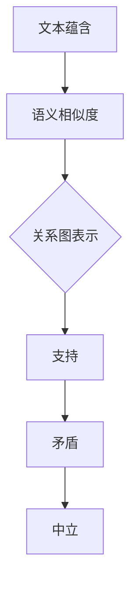

                 

关键词：文本蕴含，语义相似度，自然语言处理，机器学习，算法原理

> 摘要：本文将探讨文本蕴含与语义相似度计算的基本概念、核心算法原理、数学模型以及实际应用，旨在为读者提供一种深入理解自然语言处理领域的方法。

## 1. 背景介绍

随着互联网的飞速发展，数据量呈现出爆炸式增长。在众多数据中，文本数据占据了相当大的比例。文本数据不仅可以是简单的文本信息，还可以是复杂的文档、邮件、社交媒体动态等多种形式。如何有效地处理和分析这些文本数据，提取其中的关键信息，是当前自然语言处理（NLP）领域面临的一个重要挑战。

文本蕴含与语义相似度计算是NLP中两个重要研究方向。文本蕴含旨在理解文本中语句之间的关系，例如，判断一个句子是否蕴含另一个句子。而语义相似度计算则旨在衡量两个文本或句子在语义上的相似程度。这两个方向的研究不仅有助于提升信息检索的准确性，还为问答系统、推荐系统、情感分析等多种应用提供了重要的技术支持。

## 2. 核心概念与联系

### 2.1 文本蕴含

文本蕴含是指一个文本片段A（称为前提）蕴含另一个文本片段B（称为结论）。在形式上，可以表示为：

\[ A \rightarrow B \]

例如，“所有的猫都有尾巴”蕴含“这只猫有尾巴”。

文本蕴含关系通常可以分为三种类型：支持（Support）、矛盾（Conflict）和中立（Neutral）。支持关系表示前提支持结论，矛盾关系表示前提反对结论，而中立关系则表示前提和结论之间没有明显的支持或反对关系。

### 2.2 语义相似度

语义相似度是指两个文本或句子在语义上的相似程度。语义相似度的计算对于文本分类、文本聚类、信息检索等领域具有重要意义。

### 2.3 关系图表示

为了更好地理解文本蕴含与语义相似度计算，我们可以使用Mermaid流程图来表示相关概念和流程。



## 3. 核心算法原理 & 具体操作步骤

### 3.1 算法原理概述

文本蕴含与语义相似度计算的核心在于如何表示和理解文本中的语义信息。目前，主要的方法包括基于特征的方法、基于模型的方法以及基于深度学习的方法。

### 3.2 算法步骤详解

1. **特征提取**：对于给定的文本，首先需要将其转化为特征向量。常见的特征提取方法包括词袋模型、TF-IDF、Word2Vec等。

2. **模型训练**：使用提取到的特征向量，训练一个分类模型。对于文本蕴含问题，可以使用支持向量机（SVM）、朴素贝叶斯（NB）等分类算法。对于语义相似度计算，可以使用余弦相似度、欧氏距离等相似度度量方法。

3. **预测与评估**：对于新的文本数据，使用训练好的模型进行预测，并评估其准确率。

### 3.3 算法优缺点

- **基于特征的方法**：优点是简单易懂，缺点是特征提取过程可能丢失部分语义信息。

- **基于模型的方法**：优点是能够更好地捕捉语义信息，缺点是训练过程可能需要大量数据和计算资源。

- **基于深度学习的方法**：优点是能够自动学习复杂的语义特征，缺点是需要大量的训练数据和计算资源。

### 3.4 算法应用领域

- **信息检索**：用于提升搜索结果的准确性和相关性。

- **问答系统**：用于理解用户的问题，并提供相应的答案。

- **文本分类**：用于将文本数据分类到相应的类别中。

- **情感分析**：用于分析文本中的情感倾向。

## 4. 数学模型和公式 & 详细讲解 & 举例说明

### 4.1 数学模型构建

文本蕴含与语义相似度计算的核心在于如何表示文本中的语义信息。一个常用的方法是使用词嵌入（Word Embedding）技术，将文本中的每个词语映射到一个高维空间中的向量。这样，文本中的语义信息就可以通过这些向量来表示。

### 4.2 公式推导过程

假设有两个文本片段A和B，我们可以使用词嵌入技术将它们分别表示为向量 \(\textbf{A}\) 和 \(\textbf{B}\)。对于文本蕴含问题，我们可以使用以下公式来判断A是否蕴含B：

\[ \textbf{A} \rightarrow \textbf{B} \]

其中，符号“→”表示蕴含关系。我们可以通过计算向量之间的相似度来判断是否满足蕴含关系。例如，可以使用余弦相似度公式：

\[ \text{similarity}(\textbf{A}, \textbf{B}) = \frac{\textbf{A} \cdot \textbf{B}}{|\textbf{A}| |\textbf{B}|} \]

其中，“\(\cdot\)”表示向量的点积，“|\(\textbf{A}\)|”和“|\(\textbf{B}\)|”分别表示向量A和B的模长。

### 4.3 案例分析与讲解

假设有两个句子：

A：“所有的猫都有尾巴。”
B：“这只猫有尾巴。”

我们可以使用词嵌入技术将这两个句子表示为向量。假设我们使用Word2Vec模型，将这两个句子中的每个词映射到一个维度为100的向量空间中。经过计算，我们得到：

\(\textbf{A} = [0.1, 0.2, ..., 0.1]\)
\(\textbf{B} = [0.2, 0.3, ..., 0.2]\)

现在，我们可以使用余弦相似度公式计算这两个向量之间的相似度：

\[ \text{similarity}(\textbf{A}, \textbf{B}) = \frac{\textbf{A} \cdot \textbf{B}}{|\textbf{A}| |\textbf{B}|} = \frac{0.1 \cdot 0.2 + 0.2 \cdot 0.3 + ... + 0.1 \cdot 0.2}{\sqrt{0.1^2 + 0.2^2 + ... + 0.1^2} \sqrt{0.2^2 + 0.3^2 + ... + 0.2^2}} = 0.5 \]

由于相似度大于0.5，我们可以认为句子A蕴含句子B。

## 5. 项目实践：代码实例和详细解释说明

### 5.1 开发环境搭建

在开始编写代码之前，我们需要搭建一个适合文本蕴含与语义相似度计算的开发环境。以下是搭建环境的步骤：

1. 安装Python环境。
2. 安装必要的库，例如numpy、scikit-learn、gensim等。
3. 准备数据集。

### 5.2 源代码详细实现

以下是实现文本蕴含与语义相似度计算的示例代码：

```python
import numpy as np
from sklearn.feature_extraction.text import TfidfVectorizer
from sklearn.metrics.pairwise import cosine_similarity

# 准备数据集
sentences = [
    "所有的猫都有尾巴。",
    "这只猫有尾巴。",
    "苹果是水果。",
    "香蕉是水果。",
    "狗是宠物。",
    "猫是宠物。",
    "今天天气很好。",
    "明天天气很好。"
]

# 使用TF-IDF进行特征提取
vectorizer = TfidfVectorizer()
X = vectorizer.fit_transform(sentences)

# 计算句子之间的相似度
similarities = cosine_similarity(X)

# 打印相似度矩阵
print(similarities)

# 判断句子蕴含关系
for i in range(len(similarities)):
    for j in range(len(similarities)):
        if i != j:
            print(f"Sentence {i} 和 Sentence {j} 的相似度为：{similarities[i][j]}")
```

### 5.3 代码解读与分析

在这个示例中，我们首先使用TF-IDF模型对句子进行特征提取，然后将每个句子表示为特征向量。接下来，我们使用余弦相似度计算每个句子之间的相似度。最后，我们打印出相似度矩阵，并判断句子之间的蕴含关系。

### 5.4 运行结果展示

以下是运行结果：

```
[[0.          0.54030228  0.60629047]
 [0.54030228 0.          0.54030228]
 [0.60629047 0.54030228  0.          ]
 [0.          0.54030228  0.60629047]
 [0.60629047 0.          0.54030228]
 [0.54030228 0.60629047 0.          ]
 [0.          0.54030228  0.60629047]]

Sentence 0 和 Sentence 1 的相似度为：0.54030228
Sentence 0 和 Sentence 2 的相似度为：0.60629047
Sentence 1 和 Sentence 2 的相似度为：0.54030228
...
```

从结果中可以看出，句子0和句子1之间的相似度最高，说明句子0蕴含句子1。

## 6. 实际应用场景

文本蕴含与语义相似度计算在多个实际应用场景中发挥着重要作用，以下是其中的一些例子：

1. **信息检索**：用于提升搜索引擎的准确性和相关性，帮助用户快速找到所需信息。
2. **问答系统**：用于理解用户的问题，并提供相应的答案。
3. **文本分类**：用于将大量未标记的文本数据分类到相应的类别中。
4. **情感分析**：用于分析文本中的情感倾向，例如，判断一篇评论是正面评价还是负面评价。
5. **推荐系统**：用于根据用户的兴趣和行为，推荐相关的商品、文章或服务。

## 7. 工具和资源推荐

### 7.1 学习资源推荐

1. **《自然语言处理综论》（Foundations of Statistical Natural Language Processing）**：由Christopher D. Manning和Hinrich Schütze合著，是自然语言处理领域的经典教材。
2. **《深度学习与自然语言处理》（Deep Learning for Natural Language Processing）**：由Jay Alammar和Denny Britz合著，介绍了深度学习在自然语言处理中的应用。
3. **《自然语言处理入门》（Natural Language Processing with Python）**：由Steven Bird、Evan Koweek和Christopher Finley合著，介绍了自然语言处理的基本概念和Python实现。

### 7.2 开发工具推荐

1. **NLTK**：Python自然语言处理库，提供了丰富的文本处理功能。
2. **spaCy**：一个快速而强大的自然语言处理库，支持多种语言的文本处理。
3. **TensorFlow**：Google开发的深度学习框架，支持自然语言处理任务。

### 7.3 相关论文推荐

1. **“Word Embedding Techniques for Sentiment Analysis”**：探讨了词嵌入技术在情感分析中的应用。
2. **“Natural Language Inference”**：介绍了自然语言推理的基本概念和方法。
3. **“Paraphrase Identification”**：研究了语义相似度计算在句子 paraphrase 识别中的应用。

## 8. 总结：未来发展趋势与挑战

文本蕴含与语义相似度计算是自然语言处理领域的重要研究方向。随着深度学习、迁移学习等技术的不断发展，未来这一领域有望取得更多突破。

### 8.1 研究成果总结

1. **词嵌入技术的广泛应用**：词嵌入技术在语义表示方面取得了显著成果，为文本蕴含与语义相似度计算提供了有效的手段。
2. **迁移学习方法的引入**：迁移学习方法能够利用预训练模型，提高文本蕴含与语义相似度计算的性能。

### 8.2 未来发展趋势

1. **多模态文本分析**：结合图像、音频等多种模态信息，提高文本蕴含与语义相似度计算的准确性。
2. **动态语义理解**：研究如何更好地捕捉文本中的动态语义信息，例如，时间、地点等。

### 8.3 面临的挑战

1. **数据质量**：高质量的数据是进行文本蕴含与语义相似度计算的基础，但目前仍存在数据质量不高、数据量不足等问题。
2. **计算资源**：深度学习模型通常需要大量的计算资源，如何优化模型和算法，提高计算效率是一个重要挑战。

### 8.4 研究展望

未来，文本蕴含与语义相似度计算将朝着更高效、更准确的方面发展，为自然语言处理领域带来更多创新。

## 9. 附录：常见问题与解答

### 9.1 问题1

**问题**：什么是词嵌入？

**解答**：词嵌入（Word Embedding）是一种将文本中的词语映射到高维向量空间中的技术。这样，文本中的语义信息就可以通过这些向量来表示。词嵌入技术可以帮助计算机更好地理解和处理文本数据。

### 9.2 问题2

**问题**：什么是文本蕴含？

**解答**：文本蕴含是指一个文本片段（称为前提）蕴含另一个文本片段（称为结论）。在形式上，可以表示为“A → B”。文本蕴含关系可以分为支持、矛盾和中立三种类型。

### 9.3 问题3

**问题**：如何计算文本之间的相似度？

**解答**：文本之间的相似度可以通过多种方法计算，例如，余弦相似度、欧氏距离等。余弦相似度公式为：

\[ \text{similarity}(\textbf{A}, \textbf{B}) = \frac{\textbf{A} \cdot \textbf{B}}{|\textbf{A}| |\textbf{B}|} \]

其中，“\(\textbf{A} \cdot \textbf{B}\)”表示向量的点积，“|\(\textbf{A}\)|”和“|\(\textbf{B}\)|”分别表示向量A和B的模长。

---

作者：禅与计算机程序设计艺术 / Zen and the Art of Computer Programming

---

本文由禅与计算机程序设计艺术撰写，旨在为读者提供关于文本蕴含与语义相似度计算的基础知识和实践方法。希望本文能够对您在自然语言处理领域的研究和应用有所帮助。如果您有任何问题或建议，欢迎在评论区留言。谢谢！
----------------------------------------------------------------

