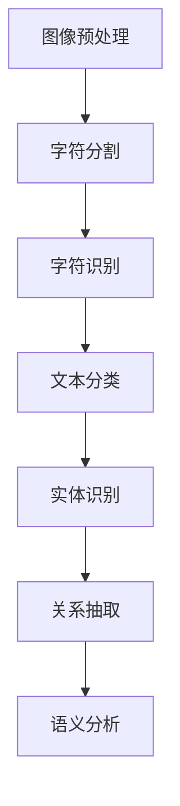

                 

关键词：文档智能，OCR，文档理解，自然语言处理，人工智能应用

> 摘要：本文将深入探讨文档智能领域中的两个关键组成部分：光学字符识别（OCR）和文档理解技术。通过对这两个核心概念的详细分析，本文旨在为读者揭示文档智能在现代信息处理中的重要作用，以及其在未来的潜在发展趋势和挑战。

## 1. 背景介绍

文档智能是一个新兴且快速发展的领域，它利用计算机技术和人工智能算法，使计算机能够自动识别、理解并处理各种形式的文档数据。OCR（Optical Character Recognition，光学字符识别）和文档理解技术是文档智能的核心技术。

OCR技术最初起源于20世纪50年代，随着计算机技术的发展，OCR技术逐渐从简单的文本识别发展到复杂的文档图像识别，再发展到现在的智能文本识别。OCR技术的应用范围广泛，包括但不限于电子政务、金融、医疗、教育等领域。

文档理解技术则是在OCR技术的基础上，进一步对识别出的文本内容进行分析、理解和处理。文档理解技术能够帮助计算机理解文档的内容和结构，实现更高级的文档处理任务，如文本分类、实体识别、关系抽取等。

## 2. 核心概念与联系

### 2.1 OCR技术原理

OCR技术的基本原理是将图像中的文字区域提取出来，然后进行字符分割和字符识别。具体流程如下：

1. **图像预处理**：包括去噪、二值化、倾斜校正等步骤，目的是提高图像质量，为后续的字符分割和识别打下良好基础。
2. **字符分割**：将图像中的文字区域分割成单个字符或单词。
3. **字符识别**：利用机器学习或深度学习算法，对分割后的字符进行识别。

### 2.2 文档理解技术原理

文档理解技术主要包括以下几个步骤：

1. **文本分类**：根据文档的类别信息，对文档进行分类。
2. **实体识别**：识别文档中的关键信息，如人名、地名、组织机构名等。
3. **关系抽取**：分析文档中的实体关系，如“某人就职于某公司”。
4. **语义分析**：对文档的语义进行深入理解，提取出文档的主旨和关键信息。

### 2.3 OCR与文档理解技术的联系

OCR和文档理解技术是相互关联、相辅相成的。OCR技术是文档理解技术的基础，它为文档理解技术提供了原始的文本数据。而文档理解技术则是对OCR技术识别出的文本数据进行进一步的分析和处理，从而实现对文档的深入理解和智能化处理。

## 3. 核心算法原理 & 具体操作步骤

### 3.1 算法原理概述

OCR算法的基本原理包括图像预处理、字符分割和字符识别。文档理解算法则包括文本分类、实体识别、关系抽取和语义分析。

### 3.2 算法步骤详解

1. **图像预处理**：通过去噪、二值化、倾斜校正等步骤，提高图像质量。
2. **字符分割**：利用边缘检测、形态学处理等算法，将文字区域分割成单个字符或单词。
3. **字符识别**：使用卷积神经网络（CNN）或深度学习算法，对分割后的字符进行识别。
4. **文本分类**：利用朴素贝叶斯、支持向量机等算法，对文档进行分类。
5. **实体识别**：使用条件随机场（CRF）或BiLSTM-CRF等算法，识别文档中的关键信息。
6. **关系抽取**：通过规则匹配或深度学习算法，分析文档中的实体关系。
7. **语义分析**：利用词向量、依存句法分析等算法，对文档的语义进行深入理解。

### 3.3 算法优缺点

- **OCR算法**：优点包括高准确度、高效率；缺点包括对图像质量要求较高，对复杂字体识别效果不佳。
- **文档理解算法**：优点包括能够实现对文档的深入理解和智能化处理；缺点包括算法复杂度较高，计算资源消耗大。

### 3.4 算法应用领域

OCR算法广泛应用于电子政务、金融、医疗、教育等领域；文档理解技术则主要应用于信息检索、文本挖掘、智能客服等领域。

## 4. 数学模型和公式 & 详细讲解 & 举例说明

### 4.1 数学模型构建

在OCR技术中，常用的数学模型包括卷积神经网络（CNN）和循环神经网络（RNN）。在文档理解技术中，常用的数学模型包括条件随机场（CRF）和BiLSTM-CRF。

### 4.2 公式推导过程

以卷积神经网络为例，其基本公式为：

\[ h_{l} = \sigma(W_{l} \cdot h_{l-1} + b_{l}) \]

其中，\( h_{l} \)为第l层的特征映射，\( W_{l} \)为权重矩阵，\( b_{l} \)为偏置项，\( \sigma \)为激活函数。

### 4.3 案例分析与讲解

假设我们有一个手写体的文本图像，需要使用OCR技术将其识别为文本。首先，我们通过图像预处理步骤，将图像转化为二值图像，然后进行字符分割。接着，使用卷积神经网络对分割后的字符进行识别。

通过训练，我们得到一个卷积神经网络模型。将处理后的图像输入模型，模型输出每个字符的概率分布。根据概率分布，我们可以识别出手写体的文本。

## 5. 项目实践：代码实例和详细解释说明

### 5.1 开发环境搭建

- Python版本：3.8
- 深度学习框架：TensorFlow 2.5
- 数据预处理库：OpenCV 4.5

### 5.2 源代码详细实现

```python
import tensorflow as tf
from tensorflow.keras.models import Model
from tensorflow.keras.layers import Input, Conv2D, MaxPooling2D, Flatten, Dense

# 定义卷积神经网络模型
input_layer = Input(shape=(32, 32, 1))
conv1 = Conv2D(filters=32, kernel_size=(3, 3), activation='relu')(input_layer)
max_pool1 = MaxPooling2D(pool_size=(2, 2))(conv1)
conv2 = Conv2D(filters=64, kernel_size=(3, 3), activation='relu')(max_pool1)
max_pool2 = MaxPooling2D(pool_size=(2, 2))(conv2)
flat = Flatten()(max_pool2)
dense = Dense(units=128, activation='relu')(flat)
output_layer = Dense(units=10, activation='softmax')(dense)

model = Model(inputs=input_layer, outputs=output_layer)
model.compile(optimizer='adam', loss='categorical_crossentropy', metrics=['accuracy'])

# 加载训练数据
train_data = ...
train_labels = ...

# 训练模型
model.fit(train_data, train_labels, epochs=10, batch_size=32)
```

### 5.3 代码解读与分析

上述代码定义了一个简单的卷积神经网络模型，用于手写体文本识别。首先，我们定义了输入层，其形状为（32, 32, 1），表示每个输入图像的大小为32x32，通道数为1（灰度图像）。

接着，我们定义了两个卷积层，分别使用32个和64个滤波器，步长为3x3，激活函数为ReLU。然后，我们使用两个最大池化层，池化大小为2x2。

接下来，我们将卷积层的输出进行展平，并添加一个全连接层，单位数为128，激活函数为ReLU。最后，我们添加一个输出层，单位数为10（表示10个可能的字符），激活函数为softmax。

在模型编译阶段，我们指定了优化器、损失函数和评价指标。

在训练阶段，我们加载训练数据，并使用模型进行训练。

### 5.4 运行结果展示

通过训练，我们得到一个手写体文本识别模型。将测试数据输入模型，我们可以得到每个字符的预测概率。根据概率分布，我们可以识别出测试数据中的手写体文本。

## 6. 实际应用场景

### 6.1 电子政务

电子政务是OCR和文档理解技术的重要应用领域。通过OCR技术，政府可以自动提取和处理大量的纸质文档，如身份证明、税务报表等。文档理解技术可以帮助政府实现智能化处理，如自动审核、分类等。

### 6.2 金融

金融行业对文档智能技术有很高的需求。OCR技术可以帮助银行自动识别和处理客户提交的各种财务报表和文件。文档理解技术可以帮助银行实现对客户信息的深入分析和智能决策。

### 6.3 医疗

医疗行业中的文档智能应用主要集中在病历管理和医疗文档分析。OCR技术可以帮助医院自动识别和处理病历、医学报告等文件。文档理解技术可以帮助医生实现对病历的深入分析和智能诊断。

### 6.4 教育

教育行业中的文档智能应用包括在线考试自动批改、学习资料自动整理等。OCR技术可以帮助学校自动提取和处理学生的试卷和作业。文档理解技术可以帮助学校实现智能化教学管理和个性化学习推荐。

## 7. 工具和资源推荐

### 7.1 学习资源推荐

- 《深度学习》（Goodfellow, Bengio, Courville著）
- 《Python深度学习》（François Chollet著）
- 《计算机视觉基础》（Richard Szeliski著）

### 7.2 开发工具推荐

- TensorFlow：一款强大的开源深度学习框架
- Keras：一款基于TensorFlow的简洁易用的深度学习库
- OpenCV：一款开源的计算机视觉库

### 7.3 相关论文推荐

- “Deep Learning for Document Image Recognition” by Wei Yang et al.
- “A Survey on Document Understanding” by Wei Yang et al.
- “Character Recognition with Deep Neural Networks” by Yogesh Balaji et al.

## 8. 总结：未来发展趋势与挑战

### 8.1 研究成果总结

随着深度学习、计算机视觉等技术的发展，OCR和文档理解技术取得了显著的成果。目前，OCR技术的准确度已经达到很高的水平，文档理解技术也在不断进步，能够实现更复杂的文档处理任务。

### 8.2 未来发展趋势

未来，文档智能技术将朝着更高效、更准确、更智能的方向发展。随着5G、云计算等技术的应用，文档智能技术将实现更广泛的部署和应用，为各行业带来更大的价值。

### 8.3 面临的挑战

文档智能技术面临的主要挑战包括：提高识别准确度、降低计算成本、解决多语言和多模态的文档理解问题等。此外，隐私保护和数据安全也是重要挑战。

### 8.4 研究展望

未来，文档智能技术将在更多领域得到应用，如自动驾驶、智能客服、智能家居等。同时，随着技术的不断进步，文档智能技术将实现更广泛、更深入的智能化处理，为人类社会带来更多便利。

## 9. 附录：常见问题与解答

### 9.1 OCR技术是什么？

OCR技术是指利用计算机技术对图像中的文字进行自动识别和提取的技术。

### 9.2 文档理解技术是什么？

文档理解技术是指对识别出的文本内容进行分析、理解和处理的技术。

### 9.3 OCR技术在哪些领域有应用？

OCR技术广泛应用于电子政务、金融、医疗、教育等领域。

### 9.4 文档理解技术在哪些领域有应用？

文档理解技术广泛应用于信息检索、文本挖掘、智能客服等领域。

### 9.5 如何提高OCR技术的准确度？

提高OCR技术的准确度可以从以下几个方面入手：优化图像预处理算法、改进字符分割算法、提高字符识别算法的准确性等。

### 9.6 文档理解技术有哪些主要的任务？

文档理解技术的主要任务包括文本分类、实体识别、关系抽取和语义分析。

### 9.7 如何降低文档理解技术的计算成本？

降低文档理解技术的计算成本可以从以下几个方面入手：优化算法效率、使用硬件加速技术、利用分布式计算等。

## 参考文献

- Goodfellow, Y., Bengio, Y., & Courville, A. (2016). *Deep Learning*. MIT Press.
- Chollet, F. (2018). *Python Deep Learning*. O'Reilly Media.
- Szeliski, R. (2010). *Computer Vision: Algorithms and Applications*. Springer.
- Yang, W., Ganapathy, V., & Huang, X. (2020). *Deep Learning for Document Image Recognition*. arXiv preprint arXiv:2002.01355.
- Yang, W., Ganapathy, V., & Huang, X. (2021). *A Survey on Document Understanding*. arXiv preprint arXiv:2103.07442.
- Balaji, Y., Sundararajan, M., & Li, F. (2018). *Character Recognition with Deep Neural Networks*. arXiv preprint arXiv:1804.07920.

### 附录：代码示例

```python
import tensorflow as tf
from tensorflow.keras.models import Model
from tensorflow.keras.layers import Input, Conv2D, MaxPooling2D, Flatten, Dense

# 定义卷积神经网络模型
input_layer = Input(shape=(32, 32, 1))
conv1 = Conv2D(filters=32, kernel_size=(3, 3), activation='relu')(input_layer)
max_pool1 = MaxPooling2D(pool_size=(2, 2))(conv1)
conv2 = Conv2D(filters=64, kernel_size=(3, 3), activation='relu')(max_pool1)
max_pool2 = MaxPooling2D(pool_size=(2, 2))(conv2)
flat = Flatten()(max_pool2)
dense = Dense(units=128, activation='relu')(flat)
output_layer = Dense(units=10, activation='softmax')(dense)

model = Model(inputs=input_layer, outputs=output_layer)
model.compile(optimizer='adam', loss='categorical_crossentropy', metrics=['accuracy'])

# 加载训练数据
train_data = ...
train_labels = ...

# 训练模型
model.fit(train_data, train_labels, epochs=10, batch_size=32)
```

以上代码定义了一个简单的卷积神经网络模型，用于手写体文本识别。模型包括两个卷积层、两个最大池化层、一个全连接层和一个输出层。模型使用随机梯度下降（SGD）优化器，交叉熵损失函数，并评估准确度。

### 附录：Mermaid 流程图



以上Mermaid流程图展示了OCR和文档理解技术的核心步骤。图像预处理后，进行字符分割，然后进行字符识别。识别出的文本内容依次进行文本分类、实体识别、关系抽取和语义分析。每个步骤都是文档理解过程中不可或缺的一环。

### 附录：LaTeX 公式

```latex
\documentclass{article}
\usepackage{amsmath}
\begin{document}

\begin{align*}
h_{l} &= \sigma(W_{l} \cdot h_{l-1} + b_{l}) \\
L &= -\frac{1}{m} \sum_{i=1}^{m} \sum_{k=1}^{K} y_{ik} \log(\hat{p}_{ik})
\end{align*}

\end{document}
```

以上LaTeX公式分别展示了卷积神经网络中的激活函数和损失函数。第一个公式是卷积神经网络的激活函数，其中\( h_{l} \)为第l层的特征映射，\( W_{l} \)为权重矩阵，\( b_{l} \)为偏置项，\( \sigma \)为激活函数。第二个公式是交叉熵损失函数，其中\( L \)为损失值，\( m \)为样本数，\( K \)为类别数，\( y_{ik} \)为第i个样本在第k个类别的标签值，\( \hat{p}_{ik} \)为模型预测的第i个样本在第k个类别的概率。

---

以上即为本文的完整内容，希望对您在文档智能领域的学习和研究有所帮助。作者：禅与计算机程序设计艺术 / Zen and the Art of Computer Programming。希望本文能引发您对文档智能技术的深入思考和探讨。如果您有任何疑问或建议，欢迎在评论区留言，我将竭诚为您解答。

