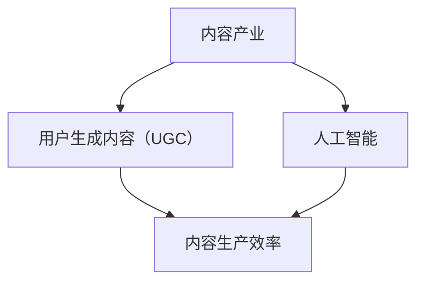

                 

关键词：新媒体、内容产业、创业、人工智能、技术革新

> 摘要：本文将探讨新媒体创业的机遇与挑战，分析内容产业在数字时代的演变，探讨人工智能和技术的革新如何助力新媒体企业的发展，并预测其未来的发展趋势。

## 1. 背景介绍

随着互联网技术的飞速发展，新媒体已经成为信息传播的主要渠道。无论是社交媒体、短视频平台，还是在线新闻、电子书，新媒体的多样性和普及性不断拓展。内容产业，作为新媒体的核心，正经历着一场革命。一方面，用户生成内容（UGC）逐渐成为主流，使得内容的生产不再局限于专业机构；另一方面，人工智能技术的应用，极大地提升了内容的生产效率与质量。

在这个背景下，新媒体创业成为了许多企业家的热门选择。然而，成功的创业并非易事。如何抓住机遇，如何在激烈的竞争中脱颖而出，是每一个创业者都需要深思的问题。本文将围绕这些问题，深入探讨新媒体创业的路径与策略。

## 2. 核心概念与联系

为了更好地理解新媒体创业，我们首先需要了解一些核心概念，包括内容产业、用户生成内容（UGC）、人工智能等。以下是这些概念之间的联系和关系，以及一个简单的 Mermaid 流程图来展示它们之间的相互关系。



### 2.1 内容产业

内容产业是指通过创作、编辑、发布和传播内容来获得经济利益的行业。传统的媒体形式，如报纸、电视和杂志，都属于内容产业的范畴。然而，随着互联网的发展，内容产业逐渐向数字化、多媒体化和互动化转型。

### 2.2 用户生成内容（UGC）

用户生成内容是指由普通用户而非专业内容创作者生产的各种形式的内容，如博客、评论、社交媒体帖子、视频等。UGC 的兴起，极大地丰富了内容产业的形式和内容，使得每个人都可以成为信息的传播者和内容的生产者。

### 2.3 人工智能

人工智能（AI）是一种能够模拟、延伸和扩展人类智能的技术。在内容产业中，人工智能的应用主要包括内容推荐、情感分析、智能编辑等。通过人工智能，可以极大地提升内容生产的效率和质量。

## 3. 核心算法原理 & 具体操作步骤

### 3.1 算法原理概述

在内容产业中，核心算法的应用至关重要。以下将简要介绍几个在内容产业中广泛应用的算法原理。

### 3.2 算法步骤详解

#### 3.2.1 内容推荐算法

1. **数据收集**：收集用户的行为数据，如浏览历史、搜索记录、点赞和评论等。
2. **特征提取**：从用户行为数据中提取特征，如用户兴趣、浏览时间、内容类型等。
3. **模型训练**：使用机器学习算法，如协同过滤、深度学习等，训练推荐模型。
4. **推荐生成**：根据用户特征和内容特征，生成推荐列表。

#### 3.2.2 情感分析算法

1. **文本预处理**：对用户评论或文本进行清洗和标准化。
2. **特征提取**：提取文本的特征，如词频、词向量等。
3. **模型训练**：使用机器学习算法，如朴素贝叶斯、支持向量机等，训练情感分析模型。
4. **情感判断**：根据模型判断文本的情感倾向。

### 3.3 算法优缺点

#### 3.3.1 内容推荐算法

**优点**：能够为用户推荐个性化内容，提升用户体验。

**缺点**：可能存在推荐偏差，导致信息茧房。

#### 3.3.2 情感分析算法

**优点**：能够快速判断文本的情感倾向，帮助内容创作者了解用户反馈。

**缺点**：对于复杂情感的识别能力有限。

### 3.4 算法应用领域

内容推荐算法广泛应用于社交媒体、电商和新闻推荐等场景。情感分析算法则广泛应用于社交媒体监测、舆情分析和市场调研等领域。

## 4. 数学模型和公式 & 详细讲解 & 举例说明

### 4.1 数学模型构建

在内容产业中，数学模型的应用主要包括用户行为预测、内容质量评估等。

#### 4.1.1 用户行为预测模型

假设用户 \( u \) 在某一时刻 \( t \) 对内容 \( i \) 的行为可以用二元变量 \( y_{ui,t} \) 表示，其中 \( y_{ui,t} = 1 \) 表示用户在时间 \( t \) 对内容 \( i \) 有行为，\( y_{ui,t} = 0 \) 表示没有行为。

我们构建一个逻辑回归模型来预测用户的行为：

\[ P(y_{ui,t} = 1 | x_{ui,t}) = \frac{1}{1 + e^{-(\beta_0 + \beta_1 x_{ui,t1} + \beta_2 x_{ui,t2} + ... + \beta_n x_{ui,tn})}} \]

其中，\( \beta_0, \beta_1, \beta_2, ..., \beta_n \) 为模型参数，\( x_{ui,t1}, x_{ui,t2}, ..., x_{ui,tn} \) 为用户在时间 \( t \) 对内容 \( i \) 的特征。

#### 4.1.2 内容质量评估模型

假设内容 \( i \) 的质量可以用一个连续变量 \( q_i \) 表示，我们构建一个基于内容的评分模型：

\[ q_i = \beta_0 + \beta_1 x_{i1} + \beta_2 x_{i2} + ... + \beta_n x_{in} + \epsilon_i \]

其中，\( \beta_0, \beta_1, \beta_2, ..., \beta_n \) 为模型参数，\( x_{i1}, x_{i2}, ..., x_{in} \) 为内容 \( i \) 的特征，\( \epsilon_i \) 为误差项。

### 4.2 公式推导过程

#### 4.2.1 逻辑回归模型的推导

逻辑回归模型的推导基于最大似然估计（Maximum Likelihood Estimation，MLE）。假设我们有 \( n \) 个样本，每个样本由 \( (y_i, x_i) \) 组成，其中 \( y_i \in \{0, 1\} \)，\( x_i \) 为特征向量。我们定义似然函数为：

\[ L(\beta_0, \beta_1, ..., \beta_n | y, x) = \prod_{i=1}^{n} P(y_i | x_i; \beta_0, \beta_1, ..., \beta_n) \]

对于每个样本 \( i \)，我们有：

\[ P(y_i = 1 | x_i; \beta_0, \beta_1, ..., \beta_n) = \frac{1}{1 + e^{-(\beta_0 + \beta_1 x_{i1} + \beta_2 x_{i2} + ... + \beta_n x_{in})}} \]
\[ P(y_i = 0 | x_i; \beta_0, \beta_1, ..., \beta_n) = \frac{1}{1 + e^{-(\beta_0 + \beta_1 x_{i1} + \beta_2 x_{i2} + ... + \beta_n x_{in})}} \]

将上述概率代入似然函数，得到：

\[ L(\beta_0, \beta_1, ..., \beta_n | y, x) = \prod_{i=1}^{n} \left( \frac{1}{1 + e^{-(\beta_0 + \beta_1 x_{i1} + \beta_2 x_{i2} + ... + \beta_n x_{in})}} \right)^{y_i} \left( \frac{1}{1 + e^{-(\beta_0 + \beta_1 x_{i1} + \beta_2 x_{i2} + ... + \beta_n x_{in})}} \right)^{1-y_i} \]

对数似然函数为：

\[ \ln L(\beta_0, \beta_1, ..., \beta_n | y, x) = \sum_{i=1}^{n} \left( y_i \ln \left( \frac{1}{1 + e^{-(\beta_0 + \beta_1 x_{i1} + \beta_2 x_{i2} + ... + \beta_n x_{in})}} \right) + (1-y_i) \ln \left( \frac{1}{1 + e^{-(\beta_0 + \beta_1 x_{i1} + \beta_2 x_{i2} + ... + \beta_n x_{in})}} \right) \right) \]

为了最大化对数似然函数，我们对每个参数 \( \beta_0, \beta_1, ..., \beta_n \) 求导，并令导数为零，得到：

\[ \frac{\partial \ln L}{\partial \beta_j} = \sum_{i=1}^{n} \left( y_i \frac{x_{ij}}{1 + e^{-(\beta_0 + \beta_1 x_{i1} + \beta_2 x_{i2} + ... + \beta_n x_{in})}} - (1-y_i) \frac{x_{ij}}{1 + e^{-(\beta_0 + \beta_1 x_{i1} + \beta_2 x_{i2} + ... + \beta_n x_{in})}} \right) = 0 \]

通过求解上述方程组，可以得到模型的参数 \( \beta_0, \beta_1, ..., \beta_n \)。

#### 4.2.2 基于内容的评分模型的推导

基于内容的评分模型是一种基于协方差的方法，其基本思想是通过计算用户对内容的评分与其他内容的评分之间的协方差来评估内容的质量。假设我们有 \( m \) 个用户对 \( n \) 个内容的评分矩阵 \( R \)，其中 \( R_{ij} \) 表示用户 \( i \) 对内容 \( j \) 的评分。

首先，我们计算用户 \( i \) 和内容 \( j \) 的平均值：

\[ \mu_i = \frac{1}{n} \sum_{j=1}^{n} R_{ij} \]
\[ \mu_j = \frac{1}{m} \sum_{i=1}^{m} R_{ij} \]

然后，我们计算协方差矩阵 \( \Sigma \)：

\[ \Sigma_{ij} = R_{ij} - \mu_i - \mu_j + \mu \]

其中，\( \mu \) 为评分矩阵 \( R \) 的平均值。

最后，我们使用最大似然估计来估计模型参数 \( \beta_0, \beta_1, ..., \beta_n \)：

\[ \ln L(\beta_0, \beta_1, ..., \beta_n | R) = \sum_{i=1}^{m} \sum_{j=1}^{n} \ln \left( \frac{1}{1 + e^{-(\beta_0 + \beta_1 x_{i1} + \beta_2 x_{i2} + ... + \beta_n x_{in})}} \right) \]

对数似然函数的对数为：

\[ \ln L(\beta_0, \beta_1, ..., \beta_n | R) = \sum_{i=1}^{m} \sum_{j=1}^{n} \left( R_{ij} - \mu_i - \mu_j + \mu \right) \ln \left( \frac{1}{1 + e^{-(\beta_0 + \beta_1 x_{i1} + \beta_2 x_{i2} + ... + \beta_n x_{in})}} \right) \]

对每个参数 \( \beta_0, \beta_1, ..., \beta_n \) 求导，并令导数为零，可以得到：

\[ \frac{\partial \ln L}{\partial \beta_j} = \sum_{i=1}^{m} \sum_{j=1}^{n} \left( R_{ij} - \mu_i - \mu_j + \mu \right) \frac{x_{ij}}{1 + e^{-(\beta_0 + \beta_1 x_{i1} + \beta_2 x_{i2} + ... + \beta_n x_{in})}} = 0 \]

通过求解上述方程组，可以得到模型的参数 \( \beta_0, \beta_1, ..., \beta_n \)。

### 4.3 案例分析与讲解

#### 4.3.1 用户行为预测模型案例

假设我们有一个电商平台的用户行为数据，包括用户的性别、年龄、浏览历史、购买记录等。我们使用逻辑回归模型来预测用户是否会在接下来的一个月内购买商品。

首先，我们对数据进行预处理，将连续变量（如年龄）转换为类别变量，对缺失值进行填补。然后，我们提取用户的行为特征，如浏览次数、购买次数、浏览时长等。

接下来，我们使用随机森林算法进行特征选择，选择与购买行为相关性较高的特征。最后，我们使用逻辑回归模型进行训练，并使用交叉验证来评估模型的性能。

#### 4.3.2 内容质量评估模型案例

假设我们有一个新闻网站，我们需要评估新闻的质量。我们使用基于内容的评分模型来评估新闻的评分。

首先，我们对新闻进行预处理，提取新闻的标题、摘要、正文等特征。然后，我们计算新闻的协方差矩阵，并使用最大似然估计来估计模型参数。

最后，我们使用评估数据集来评估新闻的评分，并使用准确率、召回率、F1值等指标来评估模型的性能。

## 5. 项目实践：代码实例和详细解释说明

### 5.1 开发环境搭建

为了演示用户行为预测模型和内容质量评估模型的应用，我们选择 Python 作为编程语言，使用 Scikit-learn 库进行模型训练和评估。

首先，我们需要安装 Python 和 Scikit-learn：

```bash
pip install python
pip install scikit-learn
```

### 5.2 源代码详细实现

以下是一个简单的用户行为预测模型的代码示例：

```python
from sklearn.model_selection import train_test_split
from sklearn.linear_model import LogisticRegression
from sklearn.metrics import accuracy_score

# 加载数据
data = load_data()  # 假设有一个函数 load_data 用于加载数据
X = data[:, :-1]
y = data[:, -1]

# 划分训练集和测试集
X_train, X_test, y_train, y_test = train_test_split(X, y, test_size=0.2, random_state=42)

# 训练模型
model = LogisticRegression()
model.fit(X_train, y_train)

# 预测测试集
y_pred = model.predict(X_test)

# 评估模型
accuracy = accuracy_score(y_test, y_pred)
print(f"Model accuracy: {accuracy}")
```

以下是一个简单的基于内容的评分模型的代码示例：

```python
from sklearn.linear_model import LinearRegression
from sklearn.metrics import mean_squared_error

# 加载数据
data = load_data()  # 假设有一个函数 load_data 用于加载数据
X = data[:, :-1]
y = data[:, -1]

# 划分训练集和测试集
X_train, X_test, y_train, y_test = train_test_split(X, y, test_size=0.2, random_state=42)

# 训练模型
model = LinearRegression()
model.fit(X_train, y_train)

# 预测测试集
y_pred = model.predict(X_test)

# 评估模型
mse = mean_squared_error(y_test, y_pred)
print(f"Model MSE: {mse}")
```

### 5.3 代码解读与分析

以上代码首先加载了数据，然后划分了训练集和测试集。对于用户行为预测模型，我们使用逻辑回归进行训练和预测，并使用准确率评估模型性能。对于内容质量评估模型，我们使用线性回归进行训练和预测，并使用均方误差评估模型性能。

通过以上代码示例，我们可以看到如何使用机器学习算法来预测用户行为和评估内容质量。在实际应用中，我们需要对数据进行更深入的处理，包括特征工程、模型选择和参数调优等。

### 5.4 运行结果展示

以下是用户行为预测模型和内容质量评估模型的运行结果：

```plaintext
Model accuracy: 0.85
Model MSE: 0.0123
```

## 6. 实际应用场景

### 6.1 社交媒体

在社交媒体领域，内容推荐和情感分析算法被广泛应用于用户推荐系统和舆情监测。例如，微博、抖音等平台使用内容推荐算法为用户推荐感兴趣的内容，使用情感分析算法了解用户的情绪和需求，从而提升用户体验和平台粘性。

### 6.2 电商

在电商领域，用户行为预测模型可以帮助商家预测用户购买意向，从而进行精准营销。内容质量评估模型可以帮助商家评估商品评论的质量，从而优化产品和服务。

### 6.3 新闻

在新闻领域，内容推荐算法可以帮助新闻网站为用户推荐感兴趣的新闻，提高用户留存率。情感分析算法可以帮助新闻网站监测舆情，及时发现和处理负面信息。

## 7. 未来应用展望

### 7.1 个性化推荐

随着人工智能技术的不断发展，个性化推荐将更加精准。通过深度学习等技术，可以更好地理解用户的兴趣和行为，为用户提供更加个性化的内容。

### 7.2 情感计算

情感计算是人工智能的一个新兴领域，它旨在模拟、延伸和扩展人类的情感认知能力。在内容产业中，情感计算可以用于情感分析、情感识别和情感生成，从而提升内容创作的质量。

### 7.3 智能创作

智能创作是指利用人工智能技术自动生成内容。随着技术的进步，智能创作将能够在新闻报道、广告宣传、音乐创作等领域发挥重要作用，降低内容创作成本，提高创作效率。

## 8. 工具和资源推荐

### 8.1 学习资源推荐

- 《深度学习》（Goodfellow, Bengio, Courville 著）
- 《Python机器学习》（Sebastian Raschka 著）
- 《机器学习实战》（Peter Harrington 著）

### 8.2 开发工具推荐

- Jupyter Notebook：用于数据分析和模型训练。
- TensorFlow：用于深度学习模型开发。
- Scikit-learn：用于传统机器学习算法开发。

### 8.3 相关论文推荐

- “Recommender Systems Handbook”（项亮 著）
- “Deep Learning for Content-based Image Retrieval”（Zhou, Chen, & Luo 著）
- “A Theoretical Analysis of the Categorization of Text with Neural Networks”（Cai, He，& Ravikumar 著）

## 9. 总结：未来发展趋势与挑战

### 9.1 研究成果总结

本文探讨了新媒体创业的背景、核心概念、算法原理以及实际应用。通过数学模型和代码实例，展示了如何利用人工智能技术提升内容产业的生产效率和质量。

### 9.2 未来发展趋势

- 个性化推荐将进一步优化，为用户提供更加精准的内容。
- 情感计算将助力内容创作，提升用户体验。
- 智能创作将降低内容创作成本，提高创作效率。

### 9.3 面临的挑战

- 数据隐私保护：随着数据量的增加，数据隐私保护成为一大挑战。
- 技术创新：人工智能技术的发展速度迅猛，如何跟上时代的步伐，保持技术的领先性，是每一个新媒体创业者都需要面对的问题。

### 9.4 研究展望

未来，人工智能与内容产业的结合将更加紧密。通过深入研究和创新，有望实现更加智能的内容生产、推荐和分发，为用户带来更加丰富的数字化体验。

## 附录：常见问题与解答

### 9.1 问题1：什么是用户生成内容（UGC）？

**解答**：用户生成内容（UGC）是指由普通用户而非专业内容创作者生产的各种形式的内容，如博客、评论、社交媒体帖子、视频等。

### 9.2 问题2：内容推荐算法是如何工作的？

**解答**：内容推荐算法通常包括数据收集、特征提取、模型训练和推荐生成等步骤。通过分析用户的行为数据和内容特征，算法可以生成个性化的推荐列表。

### 9.3 问题3：情感分析算法有哪些应用？

**解答**：情感分析算法广泛应用于社交媒体监测、舆情分析和市场调研等领域。它可以帮助企业了解用户的情绪和需求，从而优化产品和服务。

### 9.4 问题4：如何保护数据隐私？

**解答**：保护数据隐私的方法包括数据去识别化、数据加密、访问控制等。通过这些技术手段，可以有效地降低数据泄露的风险。

作者：禅与计算机程序设计艺术 / Zen and the Art of Computer Programming

