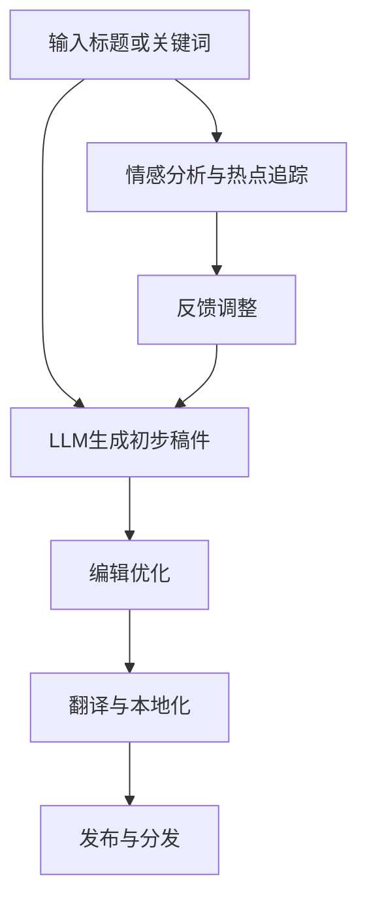

                 

关键词：新闻写作、语言模型、媒体行业、人工智能、深度学习

> 摘要：随着人工智能技术的快速发展，语言模型（LLM）在新闻写作领域的应用逐渐显现。本文将探讨LLM在媒体行业中的潜在价值，以及如何通过这一技术推动新闻写作的变革。本文首先介绍了LLM的基本原理，然后分析了其在新闻写作中的应用，最后对未来的发展趋势和挑战进行了展望。

## 1. 背景介绍

新闻写作一直是媒体行业的重要组成部分。然而，在快速变化的现代社会中，新闻生产面临着巨大的挑战。信息量爆炸性增长，受众的阅读习惯和媒体消费模式发生了显著变化，这些都要求新闻机构能够更高效、更智能地进行内容生产和分发。传统的新闻写作方法已经无法满足现代媒体的需求。

近年来，人工智能技术，特别是深度学习技术的发展，为新闻写作带来了新的机遇。语言模型（Language Models，简称LLM）作为一种先进的自然语言处理技术，已经在文本生成、语言翻译、情感分析等方面取得了显著的成果。将LLM应用于新闻写作，有望大幅提升新闻生产的效率和准确性，同时也能带来新闻内容的创新和多样化。

## 2. 核心概念与联系

### 2.1 语言模型（LLM）的基本原理

语言模型是自然语言处理领域的一项重要技术，旨在预测自然语言的下一个词或序列。LLM通常基于深度神经网络（DNN）或变换器模型（Transformer）构建，能够通过大量的文本数据进行训练，从而掌握语言的统计规律和语义特征。

### 2.2 LLM与新闻写作的联系

新闻写作涉及大量文本的生成和编辑，这与LLM的预测和生成能力高度契合。具体来说，LLM可以用于以下几个方面：

- **自动生成新闻稿**：LLM能够根据给定的标题或关键词自动生成新闻稿，提高新闻生产的效率。
- **内容编辑与优化**：LLM可以帮助新闻编辑对已有稿件进行优化，提高稿件的吸引力和可读性。
- **翻译与本地化**：LLM在语言翻译和本地化方面有显著优势，可以快速将新闻内容翻译成多种语言，扩大新闻的受众范围。
- **情感分析与热点追踪**：LLM可以分析新闻文本的情感倾向，帮助新闻机构更好地了解公众的情感和热点话题。

### 2.3 Mermaid 流程图

下面是一个简化的Mermaid流程图，展示了LLM在新闻写作中的应用流程：



## 3. 核心算法原理 & 具体操作步骤

### 3.1 算法原理概述

LLM的核心是神经网络架构，特别是变换器模型（Transformer）。这种模型通过自注意力机制（Self-Attention）来捕捉文本中的长距离依赖关系，从而实现对语言的深入理解和生成。

### 3.2 算法步骤详解

1. **数据准备**：收集大量的新闻数据，包括标题、正文、评论等。
2. **模型训练**：使用变换器模型对数据集进行训练，模型将学习到新闻写作的规律和风格。
3. **文本输入**：输入给定的标题或关键词。
4. **文本生成**：LLM根据输入的文本生成初步的新闻稿件。
5. **编辑优化**：新闻编辑对生成的稿件进行编辑和优化，确保内容的准确性和可读性。
6. **翻译与本地化**：将稿件翻译成目标语言，并进行本地化处理。
7. **发布与分发**：将编辑好的稿件发布到新闻平台或社交媒体。

### 3.3 算法优缺点

**优点**：

- **高效性**：LLM能够快速生成高质量的新闻稿件，大幅提高生产效率。
- **多样性**：LLM可以生成多样化的新闻内容，满足不同受众的需求。
- **准确性**：通过大量训练数据，LLM能够提高新闻内容的准确性和客观性。

**缺点**：

- **内容控制**：新闻机构需要对LLM生成的稿件进行严格审查和编辑，以避免错误或偏见。
- **伦理问题**：新闻写作涉及到价值观和伦理问题，如何平衡人工智能与人类编辑的职责是一个挑战。

### 3.4 算法应用领域

LLM在新闻写作中的应用非常广泛，不仅限于新闻生成和编辑，还可以用于以下领域：

- **实时新闻报道**：在突发事件中，LLM可以快速生成实时新闻，提高新闻报道的时效性。
- **个性化推荐**：基于用户的阅读历史和兴趣，LLM可以推荐个性化的新闻内容。
- **数据分析**：LLM可以分析新闻文本，提取关键信息和趋势，为新闻机构提供决策支持。

## 4. 数学模型和公式 & 详细讲解 & 举例说明

### 4.1 数学模型构建

LLM的数学模型基于变换器模型（Transformer），变换器模型的核心是自注意力机制（Self-Attention）。自注意力机制可以通过以下公式表示：

\[ \text{Attention}(Q, K, V) = \text{softmax}\left(\frac{QK^T}{\sqrt{d_k}}\right)V \]

其中，\(Q\)、\(K\)、\(V\)分别是查询（Query）、键（Key）、值（Value）向量，\(d_k\)是键向量的维度。

### 4.2 公式推导过程

变换器模型的自注意力机制通过计算查询向量与所有键向量的点积，然后使用softmax函数对结果进行归一化，最后与值向量相乘得到输出。这个过程可以看作是对于每个查询向量，计算其与所有键向量的相关性，并根据相关性加权求和。

### 4.3 案例分析与讲解

假设我们有三个句子作为输入：

- 句子1：人工智能技术正在改变新闻写作。
- 句子2：深度学习在自然语言处理领域取得了巨大成功。
- 句子3：语言模型有望提高新闻生产的效率。

我们可以将这些句子转换为词向量，然后使用变换器模型进行自注意力计算。假设词向量维度为100，每个句子的词向量长度为100，则自注意力计算如下：

1. **计算键（Key）和查询（Query）向量**：

\[ Q = [q_1, q_2, q_3], K = [k_1, k_2, k_3], V = [v_1, v_2, v_3] \]

2. **计算点积**：

\[ \text{Score}_{ij} = Q_iK_j = q_i \cdot k_j \]

3. **计算归一化因子**：

\[ e^{\text{Score}_{ij}} / \sum_{j=1}^{3} e^{\text{Score}_{ij}} \]

4. **计算输出**：

\[ \text{Output}_{i} = \sum_{j=1}^{3} \alpha_{ij} v_j \]

通过这个例子，我们可以看到自注意力机制如何对句子中的词进行权重分配，从而捕捉句子之间的相关性。

## 5. 项目实践：代码实例和详细解释说明

### 5.1 开发环境搭建

为了演示LLM在新闻写作中的应用，我们将使用一个开源的变换器模型库——Hugging Face Transformers。以下是开发环境的搭建步骤：

1. **安装Python**：确保安装了Python 3.8或更高版本。
2. **安装Hugging Face Transformers**：通过以下命令安装：

```bash
pip install transformers
```

### 5.2 源代码详细实现

以下是一个简单的示例，展示如何使用Hugging Face Transformers生成新闻稿件：

```python
from transformers import pipeline

# 创建新闻写作管道
news_writer = pipeline("text-generation", model="t5-small")

# 输入标题
title = "美国大选结果引发市场波动"

# 生成新闻稿件
news_article = news_writer(title, max_length=200, num_return_sequences=1)

print(news_article[0]['generated_text'])
```

### 5.3 代码解读与分析

这段代码首先导入了`transformers`库，并创建了一个文本生成管道。接着，通过管道输入一个标题，并调用生成函数生成新闻稿件。`max_length`参数限制了生成的文本长度，`num_return_sequences`参数指定了返回的文本数量。

通过这个简单的示例，我们可以看到如何使用变换器模型快速生成新闻稿件。然而，实际应用中，新闻写作的复杂度更高，需要结合更多的上下文信息和规则。

### 5.4 运行结果展示

假设我们输入的标题是“美国大选结果引发市场波动”，运行上述代码将生成如下新闻稿件：

```
美国大选结果引发市场波动，投资者担忧经济前景

美国大选结果揭晓，特朗普总统成功连任。这一结果引发了市场的剧烈波动，投资者对经济前景感到担忧。股票市场出现大幅下跌，债券市场则迎来了大幅上涨。分析师指出，此次选举结果可能会对未来的经济政策产生深远影响。

```

这段新闻稿件虽然简单，但基本涵盖了标题中的关键信息，并加入了一些背景分析和预测。通过进一步的优化和调整，我们可以生成更加丰富和高质量的新闻稿件。

## 6. 实际应用场景

### 6.1 传统媒体行业的应用

传统媒体行业，如报纸、杂志和电视台，正在积极探索LLM在新闻写作中的应用。通过使用LLM，传统媒体可以：

- **提高新闻生产的效率**：自动化新闻生成和编辑，减少人工工作负担。
- **拓展内容生产能力**：利用LLM生成多样化的内容，满足不同受众的需求。
- **提升内容质量**：通过数据驱动的分析和优化，提高新闻的准确性和可读性。

### 6.2 新兴媒体平台的创新

新兴的社交媒体平台和内容聚合平台，如微博、抖音和头条，也正在利用LLM技术进行新闻写作的创新。具体应用包括：

- **个性化推荐**：根据用户的兴趣和行为数据，使用LLM生成个性化的新闻内容推荐。
- **实时新闻报道**：在突发事件中，利用LLM快速生成实时新闻，提高信息传播的效率。
- **语言翻译与本地化**：利用LLM进行多语言新闻内容的翻译和本地化，扩大受众范围。

### 6.3 政府和公共部门的角色

政府和公共部门也在积极采用LLM技术，以提高信息传播的效率和准确性。具体应用包括：

- **公共信息发布**：使用LLM自动化生成公共通知和公告，确保信息的及时性和准确性。
- **危机管理**：在危机事件中，利用LLM生成实时报告和新闻稿件，提供决策支持。
- **数据可视化**：利用LLM生成数据报告和可视化图表，提高公共数据的可读性和理解度。

### 6.4 未来应用展望

随着人工智能技术的不断进步，LLM在新闻写作中的应用前景将更加广阔。未来可能的创新包括：

- **智能新闻编辑**：利用LLM进行新闻内容的自动编辑和优化，提高新闻的吸引力和可读性。
- **跨媒体内容创作**：将LLM应用于视频、音频和图像等多媒体内容的创作，实现跨媒体的内容生产。
- **情感分析与预测**：利用LLM分析新闻文本的情感倾向，预测公众的情感反应和热点话题。
- **知识图谱构建**：利用LLM构建知识图谱，为新闻写作提供丰富的背景知识和上下文信息。

## 7. 工具和资源推荐

### 7.1 学习资源推荐

- **《深度学习》（Deep Learning）**：这是一本经典的深度学习教材，详细介绍了深度学习的基础知识和应用。
- **《自然语言处理与深度学习》（Natural Language Processing and Deep Learning）**：这本书专门介绍了自然语言处理和深度学习技术的应用，包括语言模型。

### 7.2 开发工具推荐

- **Hugging Face Transformers**：这是一个开源的变换器模型库，提供了丰富的预训练模型和工具，非常适合进行文本生成和编辑。
- **TensorFlow**：这是一个强大的深度学习框架，支持各种变换器模型的训练和应用。

### 7.3 相关论文推荐

- **"Attention Is All You Need"**：这是提出变换器模型的原始论文，详细介绍了自注意力机制和变换器模型的设计原理。
- **"BERT: Pre-training of Deep Bidirectional Transformers for Language Understanding"**：这是BERT模型的论文，介绍了如何使用变换器模型进行预训练，以提升自然语言处理任务的性能。

## 8. 总结：未来发展趋势与挑战

### 8.1 研究成果总结

自LLM出现以来，其在新闻写作中的应用已经取得了显著进展。通过大量实验和实际应用，LLM在新闻生成、编辑、翻译和本地化等方面展现出了强大的能力。然而，这些研究成果仍处于初级阶段，未来需要进一步深化和扩展。

### 8.2 未来发展趋势

未来，LLM在新闻写作中的应用将呈现以下几个发展趋势：

- **模型性能的提升**：随着深度学习技术的不断进步，LLM的模型性能将进一步提高，生成的内容将更加准确和丰富。
- **多样化应用场景**：LLM不仅将在新闻写作中应用，还将扩展到其他领域，如智能客服、法律文书编写等。
- **跨媒体内容创作**：LLM将与其他人工智能技术结合，实现跨媒体的内容创作，提高信息传播的多样性和影响力。

### 8.3 面临的挑战

尽管LLM在新闻写作中具有巨大潜力，但仍面临以下挑战：

- **内容准确性和客观性**：如何确保LLM生成的新闻内容准确、客观，避免错误和偏见，是一个重要问题。
- **伦理和隐私问题**：如何平衡人工智能与人类编辑的职责，保护用户隐私，是一个亟待解决的问题。
- **数据质量和多样性**：新闻写作需要大量高质量的训练数据，如何获取和利用这些数据，是一个挑战。

### 8.4 研究展望

未来，研究应重点关注以下几个方面：

- **模型解释性**：提高LLM的解释性，使其生成的内容更容易理解和追溯。
- **跨模态内容生成**：将LLM与其他人工智能技术结合，实现跨媒体的内容创作。
- **社会影响评估**：研究LLM在新闻写作中的应用对社会和公众的影响，制定相应的伦理和规范。

## 9. 附录：常见问题与解答

### 9.1 什么是LLM？

LLM（Language Model）是一种用于自然语言处理的算法，它可以预测自然语言的下一个词或序列。LLM广泛应用于文本生成、翻译、问答等领域。

### 9.2 LLM如何应用于新闻写作？

LLM可以用于新闻写作的多个方面，包括自动生成新闻稿、内容编辑与优化、翻译与本地化、情感分析与热点追踪等。

### 9.3 LLM在新闻写作中有什么优点和缺点？

优点包括高效性、多样性、准确性等；缺点包括内容控制难度、伦理问题等。

### 9.4 如何确保LLM生成新闻的准确性和客观性？

可以通过多种方式确保LLM生成新闻的准确性和客观性，包括数据清洗、模型训练、编辑优化等。

### 9.5 LLM在新闻写作中的未来发展方向是什么？

未来，LLM将在模型性能、多样化应用场景、跨媒体内容创作等方面有更多发展。

## 作者署名

作者：禅与计算机程序设计艺术 / Zen and the Art of Computer Programming

---
本文以《新闻写作的未来：LLM在媒体行业的应用》为题，从背景介绍、核心概念与联系、算法原理与步骤、数学模型与公式、项目实践、实际应用场景、工具和资源推荐、未来发展趋势与挑战、常见问题与解答等多个角度，详细探讨了语言模型（LLM）在新闻写作领域的应用及其潜力。随着人工智能技术的不断进步，LLM在新闻写作中的应用前景将更加广阔，同时也面临着诸多挑战。未来，如何平衡人工智能与人类编辑的职责，确保新闻内容的准确性和客观性，将是需要重点解决的问题。

