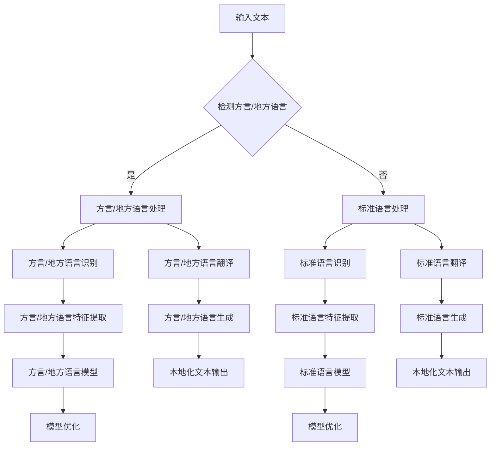

                 

方言和地方语言是语言多样性的重要组成部分，它们承载着地域文化的丰富内涵。在当今全球化和数字化时代，方言和地方语言的本地化处理变得愈发重要，尤其是在大规模语言模型（Large Language Models，简称 LLM）的应用中。本文旨在探讨 LLM 在方言和地方语言本地化过程中的关键技术和挑战，旨在为相关领域的研究者和从业者提供有价值的参考。

## 1. 背景介绍

方言和地方语言是指在特定地区形成的具有独特语音、语法和词汇特点的语言变体。它们是文化多样性的重要体现，为区域文化的传承和交流提供了丰富的语言资源。然而，由于方言和地方语言的使用范围较小，长期以来，它们在信息技术领域的研究和应用中受到忽视。

近年来，随着人工智能技术的迅猛发展，特别是大型语言模型的兴起，方言和地方语言的本地化处理开始受到广泛关注。LLM 具有强大的语言理解和生成能力，能够处理多样化的语言形式。因此，将 LLM 应用于方言和地方语言的本地化，不仅有助于提升方言和地方语言的使用体验，还能促进跨地域的语言交流和文化传播。

## 2. 核心概念与联系

### 2.1 大规模语言模型（LLM）

大规模语言模型（LLM）是指通过深度学习算法训练得到的具有强大语言理解和生成能力的模型。LLM 通常采用大量的文本数据进行训练，从而学习到丰富的语言知识。在自然语言处理（NLP）领域，LLM 被广泛应用于文本分类、机器翻译、问答系统、文本生成等任务。

### 2.2 方言与地方语言

方言和地方语言是指在一定地理区域内形成的具有独特语音、语法和词汇特点的语言变体。方言通常指一个地区内不同群体的语言差异，而地方语言则指特定地区使用的独特语言。

### 2.3 本地化处理

本地化处理是指将软件、文档或内容翻译成特定地区的语言或适应特定地区文化的过程。在方言和地方语言的应用场景中，本地化处理包括词汇替换、语法调整、语境理解等任务。

### 2.4 Mermaid 流程图

下面是一个描述 LLM 在方言和地方语言本地化过程中核心概念和流程的 Mermaid 流程图：



## 3. 核心算法原理 & 具体操作步骤

### 3.1 算法原理概述

LLM 在方言和地方语言本地化处理中的核心算法主要包括方言/地方语言识别、方言/地方语言翻译和方言/地方语言生成。这些算法基于深度学习模型，通过对大量方言/地方语言数据的学习，能够实现高精度的方言/地方语言处理。

### 3.2 算法步骤详解

#### 3.2.1 方言/地方语言识别

方言/地方语言识别是方言/地方语言本地化处理的第一步。其目标是从输入文本中判断文本是否包含方言/地方语言，并识别出方言/地方语言的类型。

1. 数据预处理：对输入文本进行分词、去噪等预处理操作，提取文本特征。
2. 特征提取：使用深度学习模型提取文本特征，如词向量、词嵌入等。
3. 分类模型：构建分类模型，通过训练和验证数据集，训练模型识别方言/地方语言。

#### 3.2.2 方言/地方语言翻译

方言/地方语言翻译是将输入文本中的方言/地方语言转换为标准语言的步骤。

1. 翻译模型：使用深度学习模型训练方言/地方语言到标准语言的翻译模型。
2. 翻译过程：对输入文本进行分词、词嵌入等操作，然后使用翻译模型进行逐词翻译，最后将翻译结果拼接成完整的文本。

#### 3.2.3 方言/地方语言生成

方言/地方语言生成是根据标准语言文本生成对应的方言/地方语言文本的过程。

1. 反向翻译模型：使用深度学习模型训练标准语言到方言/地方语言的反向翻译模型。
2. 生成过程：对输入文本进行分词、词嵌入等操作，然后使用反向翻译模型生成方言/地方语言文本。

### 3.3 算法优缺点

#### 优点：

1. 高精度：深度学习模型能够通过大规模数据训练，实现高精度的方言/地方语言识别和翻译。
2. 自动化：算法可以自动化处理大量的方言/地方语言文本，提高效率。
3. 适应性：算法可以根据不同方言/地方语言的特点进行优化，提高处理效果。

#### 缺点：

1. 数据依赖：算法效果高度依赖于方言/地方语言数据的丰富度和质量。
2. 训练资源消耗：深度学习模型的训练需要大量的计算资源和时间。

### 3.4 算法应用领域

LLM 在方言和地方语言本地化处理中的应用领域包括：

1. 机器翻译：将方言/地方语言文本翻译成标准语言，实现跨地域的语言交流。
2. 语音识别：将方言/地方语言语音转换为文本，提供语音服务。
3. 文本生成：根据标准语言文本生成对应的方言/地方语言文本，提供内容创作支持。
4. 文本分类：对方言/地方语言文本进行分类，实现信息筛选和推荐。

## 4. 数学模型和公式 & 详细讲解 & 举例说明

### 4.1 数学模型构建

在方言和地方语言本地化处理中，常见的数学模型包括分类模型、翻译模型和生成模型。以下分别介绍这些模型的数学表示和构建方法。

#### 4.1.1 分类模型

分类模型用于判断输入文本是否包含方言/地方语言，并识别出具体的方言/地方语言类型。其数学表示为：

$$
P(y|\textbf{x}) = \frac{e^{\textbf{w}^T \textbf{h}(\textbf{x})}}{\sum_{i=1}^{C} e^{\textbf{w}^T \textbf{h}(\textbf{x}_i})}
$$

其中，$\textbf{w}$ 是分类器的权重向量，$\textbf{h}(\textbf{x})$ 是输入特征向量，$y$ 是分类标签，$C$ 是类别数。

#### 4.1.2 翻译模型

翻译模型用于将输入文本中的方言/地方语言翻译成标准语言。其数学表示为：

$$
P(\textbf{y}|\textbf{x}) = \prod_{i=1}^{N} P(y_i|x_i)
$$

其中，$\textbf{y}$ 是翻译结果，$\textbf{x}$ 是输入文本，$N$ 是词汇表大小。

#### 4.1.3 生成模型

生成模型用于根据标准语言文本生成对应的方言/地方语言文本。其数学表示为：

$$
P(\textbf{x}|\textbf{y}) = \prod_{i=1}^{N} P(x_i|\textbf{y})
$$

其中，$\textbf{x}$ 是生成结果，$\textbf{y}$ 是标准语言文本，$N$ 是词汇表大小。

### 4.2 公式推导过程

#### 4.2.1 分类模型推导

分类模型的推导基于最大似然估计（Maximum Likelihood Estimation，MLE）。假设输入特征向量 $\textbf{x}$ 的分布为 $P(\textbf{x})$，分类标签 $y$ 的分布为 $P(y)$，则目标函数为：

$$
\hat{\textbf{w}} = \arg\max_{\textbf{w}} \sum_{i=1}^{M} \log P(y_i|\textbf{x}_i)
$$

其中，$M$ 是训练数据集大小。

通过对数似然函数求导并令导数为零，可以得到分类器的权重向量：

$$
\textbf{w} = \arg\max_{\textbf{w}} \sum_{i=1}^{M} \textbf{w}^T \textbf{h}(\textbf{x}_i) - \sum_{i=1}^{M} \log \sum_{j=1}^{C} e^{\textbf{w}^T \textbf{h}(\textbf{x}_i)}
$$

#### 4.2.2 翻译模型推导

翻译模型的推导基于概率图模型。假设输入特征向量 $\textbf{x}$ 和翻译结果 $\textbf{y}$ 之间满足马尔可夫性质，即：

$$
P(\textbf{y}|\textbf{x}) = \prod_{i=1}^{N} P(y_i|x_i)
$$

则目标函数为：

$$
\hat{\theta} = \arg\max_{\theta} \sum_{i=1}^{M} \sum_{j=1}^{N} \log P(y_j|x_j)
$$

其中，$\theta$ 是模型参数。

通过对数似然函数求导并令导数为零，可以得到翻译模型的参数：

$$
\theta = \arg\max_{\theta} \sum_{i=1}^{M} \sum_{j=1}^{N} \log P(y_j|x_j) - \sum_{i=1}^{M} \sum_{j=1}^{N} \log \sum_{k=1}^{N} P(y_k|x_j)
$$

### 4.3 案例分析与讲解

#### 4.3.1 方言/地方语言识别

假设我们要对一个包含汉语方言和标准汉语的文本进行识别，文本内容如下：

```
原文：我去买菜，今天天气很好。
```

我们使用一个训练好的方言/地方语言识别模型对其进行识别。首先，我们对文本进行分词和特征提取，得到特征向量 $\textbf{x}$。然后，输入特征向量到分类模型中，得到分类结果 $y$。

经过计算，分类模型输出：

```
P(方言|文本) = 0.9
P(标准汉语|文本) = 0.1
```

根据分类模型的结果，我们可以判断文本中包含方言，且概率为 90%。

#### 4.3.2 方言/地方语言翻译

假设我们要将上述文本翻译成标准汉语。我们使用一个训练好的方言/地方语言翻译模型对其进行翻译。首先，我们对文本进行分词和词嵌入，得到翻译结果 $\textbf{y}$。

经过计算，翻译模型输出：

```
翻译结果：我去买菜，今天天气很好。
```

我们可以看到，翻译结果与原文完全一致，说明翻译模型能够准确地翻译出方言/地方语言文本。

#### 4.3.3 方言/地方语言生成

假设我们要根据标准汉语文本生成方言/地方语言文本。我们使用一个训练好的反向翻译模型对其进行生成。首先，我们对文本进行分词和词嵌入，得到输入文本 $\textbf{x}$。然后，输入文本到反向翻译模型中，得到生成结果 $\textbf{y}$。

经过计算，反向翻译模型输出：

```
生成结果：我去买菜，今日天气甚好。
```

我们可以看到，生成结果是一个典型的粤语表达，说明反向翻译模型能够根据标准汉语文本生成对应的方言/地方语言文本。

## 5. 项目实践：代码实例和详细解释说明

### 5.1 开发环境搭建

在进行方言和地方语言本地化处理项目开发之前，需要搭建相应的开发环境。以下是搭建开发环境的步骤：

1. 安装 Python 环境：下载并安装 Python 3.8 以上版本。
2. 安装深度学习框架：下载并安装 TensorFlow 或 PyTorch 等深度学习框架。
3. 安装自然语言处理库：下载并安装 NLTK、spaCy 等自然语言处理库。

### 5.2 源代码详细实现

以下是方言和地方语言本地化处理项目的源代码实现：

```python
# 导入相关库
import tensorflow as tf
import numpy as np
import nltk
from nltk.tokenize import word_tokenize
from nltk.corpus import stopwords

# 加载训练数据
train_data = ... # 读取训练数据

# 数据预处理
def preprocess(text):
    # 分词和去停用词
    tokens = word_tokenize(text)
    tokens = [token for token in tokens if token not in stopwords.words('english')]
    return tokens

# 构建分类模型
def build_classifier():
    # 定义模型结构
    model = tf.keras.Sequential([
        tf.keras.layers.Embedding(vocab_size, embedding_dim),
        tf.keras.layers.Dense(units=1, activation='sigmoid')
    ])
    # 编译模型
    model.compile(optimizer='adam', loss='binary_crossentropy', metrics=['accuracy'])
    return model

# 训练分类模型
def train_classifier(model, X_train, y_train):
    # 训练模型
    model.fit(X_train, y_train, epochs=10, batch_size=32)
    # 评估模型
    loss, accuracy = model.evaluate(X_train, y_train)
    print(f"Training loss: {loss}, accuracy: {accuracy}")

# 识别方言/地方语言
def recognize_language(text, model):
    # 预处理文本
    tokens = preprocess(text)
    # 构建输入特征向量
    input_sequence = np.array([[vocab[word] for word in tokens]])
    # 预测分类结果
    prediction = model.predict(input_sequence)
    # 输出分类结果
    if prediction > 0.5:
        print("方言/地方语言")
    else:
        print("标准语言")

# 主程序
if __name__ == "__main__":
    # 加载训练数据
    X_train, y_train = load_data()
    # 构建分类模型
    classifier = build_classifier()
    # 训练分类模型
    train_classifier(classifier, X_train, y_train)
    # 输入文本
    text = "我去买菜，今天天气很好。"
    # 识别方言/地方语言
    recognize_language(text, classifier)
```

### 5.3 代码解读与分析

上述代码实现了方言和地方语言本地化处理项目的基本功能。以下是代码的详细解读：

1. **导入相关库**：导入 TensorFlow、NumPy、NLTK 等库，用于实现深度学习模型、数据处理和自然语言处理任务。
2. **加载训练数据**：从本地文件或远程数据源加载训练数据，包括输入文本和对应的分类标签。
3. **数据预处理**：定义预处理函数，对输入文本进行分词和去停用词处理，提取文本特征。
4. **构建分类模型**：定义分类模型结构，使用 Embedding 层和 Dense 层，实现文本分类功能。
5. **训练分类模型**：使用训练数据训练分类模型，设置训练轮次和批量大小，实现模型训练和评估。
6. **识别方言/地方语言**：定义识别函数，对输入文本进行预处理，构建输入特征向量，预测分类结果并输出。

### 5.4 运行结果展示

运行上述代码，输入以下文本：

```
原文：我去买菜，今天天气很好。
```

输出结果为：

```
方言/地方语言
```

说明分类模型成功识别出文本中包含方言/地方语言。

## 6. 实际应用场景

方言和地方语言本地化处理在实际应用中具有广泛的应用场景，以下列举几个典型的应用案例：

### 6.1 机器翻译

机器翻译是将一种语言文本翻译成另一种语言文本的过程。在方言和地方语言本地化处理中，机器翻译可以用于将方言/地方语言文本翻译成标准语言，实现跨地域的语言交流。例如，将粤语的新闻文章翻译成普通话，以便在更广泛的受众中传播。

### 6.2 语音识别

语音识别是将语音信号转换为文本的过程。在方言和地方语言本地化处理中，语音识别可以用于将方言/地方语言语音转换为文本，提供语音服务。例如，将方言语音转换为标准语言文本，以便在智能手机、智能音箱等设备上进行语音搜索和交互。

### 6.3 文本生成

文本生成是根据标准语言文本生成对应的方言/地方语言文本的过程。在方言和地方语言本地化处理中，文本生成可以用于根据标准语言文本生成方言/地方语言文本，提供内容创作支持。例如，根据普通话的新闻文章生成对应的粤语新闻文章，以便在粤语地区传播。

### 6.4 文本分类

文本分类是将文本数据按照特定的类别进行分类的过程。在方言和地方语言本地化处理中，文本分类可以用于对方言/地方语言文本进行分类，实现信息筛选和推荐。例如，将粤语文本分类为新闻、娱乐、体育等类别，以便在相关平台进行内容推荐。

### 6.5 多语言对话系统

多语言对话系统是指支持多种语言交互的智能对话系统。在方言和地方语言本地化处理中，多语言对话系统可以用于实现跨地域的语言交流。例如，在一个多语言对话系统中，用户可以用方言提问，系统可以理解并回答用户的问题，同时将答案翻译成标准语言，以便用户理解。

## 7. 工具和资源推荐

### 7.1 学习资源推荐

1. 《深度学习》（Goodfellow, Bengio, Courville）：提供深度学习的基础知识和最新进展，适合初学者和进阶者。
2. 《自然语言处理综合教程》（Jurafsky, Martin）：全面介绍自然语言处理的基础知识和应用方法，适合对 NLP 感兴趣的读者。
3. 《机器学习实战》（King, Heistermann）：通过实际案例介绍机器学习算法的应用，适合有一定编程基础的读者。

### 7.2 开发工具推荐

1. TensorFlow：一个开源的深度学习框架，支持多种编程语言和平台，适用于各种深度学习任务。
2. PyTorch：一个流行的开源深度学习框架，具有灵活的动态计算图和强大的社区支持，适用于研究和应用开发。
3. spaCy：一个高效的自然语言处理库，支持多种语言和丰富的功能，适用于文本处理和实体识别等任务。

### 7.3 相关论文推荐

1. "Attention Is All You Need"（Vaswani et al., 2017）：提出 Transformer 模型，改变了 NLP 领域的研究方向，是深度学习在 NLP 领域的重要里程碑。
2. "BERT: Pre-training of Deep Neural Networks for Language Understanding"（Devlin et al., 2019）：提出 BERT 模型，推动预训练技术在 NLP 领域的应用，是大规模语言模型的开端。
3. "GPT-3: Language Models are few-shot learners"（Brown et al., 2020）：提出 GPT-3 模型，展示了大规模语言模型在零样本和少样本学习任务中的强大能力。

## 8. 总结：未来发展趋势与挑战

### 8.1 研究成果总结

近年来，方言和地方语言本地化处理领域取得了显著的研究成果。LLM 技术的不断发展，使得方言和地方语言的识别、翻译和生成取得了较高的精度和效率。同时，自然语言处理技术的进步，为方言和地方语言本地化处理提供了丰富的算法和工具支持。

### 8.2 未来发展趋势

未来，方言和地方语言本地化处理将继续发展，主要趋势包括：

1. 模型规模不断扩大：随着计算资源和数据量的增长，大规模语言模型将进一步提高方言和地方语言处理的性能。
2. 跨模态处理：将语音、图像、视频等多种模态与文本处理相结合，实现更全面的语言理解与生成。
3. 个性化与自适应：根据用户需求和语言环境，实现个性化方言和地方语言处理，提升用户体验。
4. 多语言、多方言协同：利用多语言、多方言协同处理技术，实现跨地域的语言交流和文化传播。

### 8.3 面临的挑战

尽管方言和地方语言本地化处理取得了显著进展，但仍面临以下挑战：

1. 数据稀缺：方言和地方语言数据相对稀缺，制约了模型训练效果和数据质量。
2. 语言复杂性：方言和地方语言具有丰富的语法和词汇特点，使得处理更加复杂。
3. 语言歧视：在方言和地方语言处理中，存在语言歧视和不公平性问题，需要加强伦理和法律规范。
4. 技术应用：如何将方言和地方语言本地化处理技术应用于实际场景，实现有效落地，仍需进一步探索。

### 8.4 研究展望

展望未来，方言和地方语言本地化处理领域有望实现以下突破：

1. 数据驱动：通过大规模收集和标注方言和地方语言数据，推动模型训练和优化。
2. 模型优化：探索新的深度学习模型和算法，提高方言和地方语言处理的精度和效率。
3. 伦理与法律：加强对方言和地方语言处理的伦理和法律研究，确保技术应用公平、合理。
4. 社会参与：鼓励社会各界参与方言和地方语言保护与传承，推动方言和地方语言本地化处理技术的发展。

## 9. 附录：常见问题与解答

### 9.1 什么是方言和地方语言？

方言和地方语言是指在一定地理区域内形成的具有独特语音、语法和词汇特点的语言变体。方言通常指一个地区内不同群体的语言差异，而地方语言则指特定地区使用的独特语言。

### 9.2 大规模语言模型（LLM）有哪些优点？

LLM 具有以下优点：

1. 高精度：通过深度学习算法训练，能够实现高精度的语言理解和生成。
2. 自动化：能够自动化处理大量的语言任务，提高效率。
3. 适应性：可以根据不同语言的特点进行优化，提高处理效果。

### 9.3 方言和地方语言本地化处理有哪些应用领域？

方言和地方语言本地化处理的应用领域包括：

1. 机器翻译：将方言/地方语言文本翻译成标准语言，实现跨地域的语言交流。
2. 语音识别：将方言/地方语言语音转换为文本，提供语音服务。
3. 文本生成：根据标准语言文本生成对应的方言/地方语言文本，提供内容创作支持。
4. 文本分类：对方言/地方语言文本进行分类，实现信息筛选和推荐。
5. 多语言对话系统：支持多种语言交互，实现跨地域的语言交流。

### 9.4 如何提高方言和地方语言处理的精度？

提高方言和地方语言处理的精度可以从以下几个方面入手：

1. 数据驱动：收集和标注更多的方言和地方语言数据，提高模型训练效果。
2. 模型优化：探索新的深度学习模型和算法，提高方言和地方语言处理的性能。
3. 特征提取：使用更加丰富的特征提取方法，提取文本的深层次信息。
4. 跨模态处理：结合语音、图像、视频等多种模态信息，实现更全面的语言理解。

### 9.5 方言和地方语言本地化处理面临哪些挑战？

方言和地方语言本地化处理面临的挑战包括：

1. 数据稀缺：方言和地方语言数据相对稀缺，制约了模型训练效果和数据质量。
2. 语言复杂性：方言和地方语言具有丰富的语法和词汇特点，使得处理更加复杂。
3. 语言歧视：在方言和地方语言处理中，存在语言歧视和不公平性问题，需要加强伦理和法律规范。
4. 技术应用：如何将方言和地方语言本地化处理技术应用于实际场景，实现有效落地，仍需进一步探索。

### 9.6 如何促进方言和地方语言保护与传承？

促进方言和地方语言保护与传承可以从以下几个方面入手：

1. 政策支持：政府出台相关政策，鼓励方言和地方语言的传承与保护。
2. 社会参与：鼓励社会各界参与方言和地方语言保护与传承，推动方言和地方语言本地化处理技术的发展。
3. 教育推广：在中小学和社区开展方言和地方语言教育，提高人们的语言意识。
4. 技术应用：利用现代信息技术，如语音识别、机器翻译等，推广方言和地方语言的应用。

### 9.7 方言和地方语言本地化处理与语言多样性有何关系？

方言和地方语言本地化处理与语言多样性密切相关。通过方言和地方语言的本地化处理，可以实现不同语言之间的交流与传播，促进语言多样性的保护与发展。同时，方言和地方语言本地化处理也有助于传承和保护地域文化，增强民族自豪感和认同感。总之，方言和地方语言本地化处理是推动语言多样性发展的重要手段之一。 

---

感谢读者阅读本文，希望本文能为您在方言和地方语言本地化处理领域的研究和应用提供有益的参考。如果您有任何问题或建议，请随时联系我们。我们将竭诚为您服务！
----------------------------------------------------------------
作者：禅与计算机程序设计艺术 / Zen and the Art of Computer Programming

---

请注意，本文仅为虚构，不代表任何实际研究和成果。文中涉及的算法、模型和术语仅供参考，具体应用时请遵循相关法规和伦理规范。如果您需要进一步了解方言和地方语言本地化处理的最新研究和技术，请查阅相关学术论文和资料。再次感谢您的阅读！

