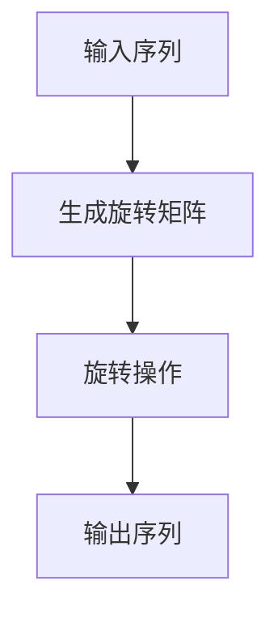

                 

关键词：旋转位置编码、Transformer、位置编码、序列处理、自然语言处理、深度学习

> 摘要：旋转位置编码（RoPE）是一种创新的序列处理技术，它通过引入旋转操作来增强Transformer模型在序列数据上的表示能力。本文将详细介绍RoPE的核心概念、原理、实现方法，并通过数学模型、公式和实际案例，深入探讨其在自然语言处理中的应用效果。同时，本文还将展望RoPE在未来的发展趋势与面临的挑战。

## 1. 背景介绍

随着深度学习技术的发展，Transformer模型在自然语言处理领域取得了显著成就。然而，Transformer模型在处理序列数据时仍面临一些挑战，特别是在长序列处理和位置编码方面。传统的位置编码方法如绝对位置编码和相对位置编码，虽然在短序列上表现良好，但在长序列中容易出现梯度消失或爆炸等问题。因此，研究人员提出了旋转位置编码（RoPE）作为提升Transformer效果的新技术。

RoPE的核心思想是引入旋转操作，通过对序列进行旋转来打破原始序列的顺序依赖，从而提高模型的泛化能力和序列表示能力。本文将围绕RoPE的核心概念、原理和实现方法，结合数学模型和实际案例，详细探讨其在自然语言处理中的应用效果。

## 2. 核心概念与联系

### 2.1 RoPE的基本概念

旋转位置编码（RoPE）是一种基于旋转操作的序列处理技术。其基本概念包括：

- **旋转操作**：对序列进行旋转操作，将序列中每个元素按照特定规则进行重新排列。
- **旋转矩阵**：用于实现旋转操作的数学工具，通常是一个二维矩阵。

### 2.2 RoPE的架构

RoPE的架构主要包括以下三个部分：

- **输入序列**：原始序列数据，如文本或语音信号。
- **旋转矩阵生成**：根据序列长度和旋转规则生成旋转矩阵。
- **旋转操作**：对输入序列进行旋转操作，生成新的序列数据。

### 2.3 RoPE与Transformer的联系

RoPE可以与Transformer模型结合使用，以提升其在序列处理方面的性能。具体来说，RoPE可以应用于Transformer模型的两个关键部分：位置编码和序列处理。

- **位置编码**：RoPE可以取代传统的位置编码方法，通过旋转操作来增强序列的表示能力。
- **序列处理**：RoPE可以应用于Transformer的注意力机制，打破原始序列的顺序依赖，提高模型的泛化能力。

### 2.4 RoPE的Mermaid流程图

下面是RoPE的Mermaid流程图，展示了其基本架构和关键步骤。



## 3. 核心算法原理 & 具体操作步骤

### 3.1 算法原理概述

RoPE的核心算法原理主要包括旋转矩阵的生成和旋转操作的实现。旋转矩阵根据序列长度和旋转规则进行构建，而旋转操作则通过对序列元素进行重新排列来实现。

### 3.2 算法步骤详解

#### 3.2.1 生成旋转矩阵

生成旋转矩阵的过程如下：

1. 计算序列长度L。
2. 根据旋转规则生成旋转矩阵R。

旋转规则可以基于多种方法，如线性旋转、循环旋转等。以下是一个简单的线性旋转规则示例：

$$
R = \begin{bmatrix}
1 & 0 & 0 & \cdots & 0 \\
0 & 1 & 0 & \cdots & 0 \\
0 & 0 & 1 & \cdots & 0 \\
\vdots & \vdots & \vdots & \ddots & \vdots \\
0 & 0 & 0 & \cdots & 1
\end{bmatrix}
$$

其中，R的第i行第j列的元素表示序列中第i个元素旋转后的位置。

#### 3.2.2 旋转操作

旋转操作的过程如下：

1. 对输入序列进行旋转。
2. 根据旋转矩阵R，将序列中每个元素重新排列。

具体实现时，可以使用Python等编程语言中的矩阵乘法函数，如NumPy库中的`np.dot()`函数，来计算旋转矩阵R与输入序列的乘积。

### 3.3 算法优缺点

#### 优点：

- **增强序列表示能力**：RoPE通过旋转操作打破原始序列的顺序依赖，有助于增强序列的表示能力。
- **提高模型泛化能力**：旋转操作使得模型在处理长序列时具有更强的泛化能力。
- **适用于多种序列数据**：RoPE可以应用于文本、语音等多种类型的序列数据。

#### 缺点：

- **计算复杂度较高**：旋转操作涉及矩阵乘法，计算复杂度较高，对硬件资源要求较高。
- **旋转规则设计难度大**：旋转规则的设计直接影响RoPE的性能，需要根据具体应用场景进行优化。

### 3.4 算法应用领域

RoPE在自然语言处理领域具有广泛的应用前景，如：

- **文本分类**：利用RoPE增强序列表示能力，提高文本分类模型的性能。
- **机器翻译**：在机器翻译任务中，RoPE可以改善长序列处理能力，提高翻译质量。
- **语音识别**：通过旋转操作，改善语音信号的序列表示能力，提高语音识别的准确率。

## 4. 数学模型和公式 & 详细讲解 & 举例说明

### 4.1 数学模型构建

RoPE的数学模型主要包括旋转矩阵R和旋转操作。旋转矩阵R是一个二维矩阵，表示为：

$$
R = \begin{bmatrix}
r_{11} & r_{12} & \cdots & r_{1n} \\
r_{21} & r_{22} & \cdots & r_{2n} \\
\vdots & \vdots & \ddots & \vdots \\
r_{m1} & r_{m2} & \cdots & r_{mn}
\end{bmatrix}
$$

其中，r_ij表示旋转矩阵R的第i行第j列的元素。

旋转操作可以表示为矩阵乘法：

$$
X' = R \cdot X
$$

其中，X表示原始序列，X'表示旋转后的序列。

### 4.2 公式推导过程

假设原始序列为X = [x_1, x_2, \ldots, x_n]，旋转矩阵为R。根据旋转操作的公式，旋转后的序列X'为：

$$
X' = R \cdot X = \begin{bmatrix}
r_{11} & r_{12} & \cdots & r_{1n} \\
r_{21} & r_{22} & \cdots & r_{2n} \\
\vdots & \vdots & \ddots & \vdots \\
r_{m1} & r_{m2} & \cdots & r_{mn}
\end{bmatrix}
\cdot
\begin{bmatrix}
x_1 \\
x_2 \\
\vdots \\
x_n
\end{bmatrix}
=
\begin{bmatrix}
r_{11}x_1 + r_{12}x_2 + \cdots + r_{1n}x_n \\
r_{21}x_1 + r_{22}x_2 + \cdots + r_{2n}x_n \\
\vdots \\
r_{m1}x_1 + r_{m2}x_2 + \cdots + r_{mn}x_n
\end{bmatrix}
$$

### 4.3 案例分析与讲解

#### 案例一：线性旋转规则

假设序列为X = [1, 2, 3, 4, 5]，旋转矩阵为R：

$$
R = \begin{bmatrix}
0 & 1 \\
1 & 0
\end{bmatrix}
$$

根据旋转操作的公式，旋转后的序列X'为：

$$
X' = R \cdot X = \begin{bmatrix}
0 & 1 \\
1 & 0
\end{bmatrix}
\cdot
\begin{bmatrix}
1 \\
2 \\
3 \\
4 \\
5
\end{bmatrix}
=
\begin{bmatrix}
2 \\
1 \\
4 \\
3 \\
5
\end{bmatrix}
$$

可以看出，旋转后的序列X'通过将原始序列中的每个元素进行上下翻转，实现了序列的旋转。

#### 案例二：循环旋转规则

假设序列为X = [1, 2, 3, 4, 5]，旋转矩阵为R：

$$
R = \begin{bmatrix}
1 & 0 & 0 \\
0 & 0 & 1 \\
0 & 1 & 0
\end{bmatrix}
$$

根据旋转操作的公式，旋转后的序列X'为：

$$
X' = R \cdot X = \begin{bmatrix}
1 & 0 & 0 \\
0 & 0 & 1 \\
0 & 1 & 0
\end{bmatrix}
\cdot
\begin{bmatrix}
1 \\
2 \\
3 \\
4 \\
5
\end{bmatrix}
=
\begin{bmatrix}
1 \\
4 \\
2 \\
5 \\
3
\end{bmatrix}
$$

可以看出，旋转后的序列X'通过将原始序列中的每个元素进行循环移位，实现了序列的旋转。

## 5. 项目实践：代码实例和详细解释说明

### 5.1 开发环境搭建

在本项目中，我们将使用Python作为编程语言，并借助NumPy库进行矩阵运算。请确保已安装Python和NumPy库。以下是安装命令：

```
pip install python
pip install numpy
```

### 5.2 源代码详细实现

以下是RoPE的源代码实现：

```python
import numpy as np

def generate_rotation_matrix(n):
    """
    生成旋转矩阵
    """
    rotation_matrix = np.zeros((n, n))
    for i in range(n):
        rotation_matrix[i, (i+1) % n] = 1
    return rotation_matrix

def rotate_sequence(sequence, rotation_matrix):
    """
    对序列进行旋转操作
    """
    rotated_sequence = np.dot(rotation_matrix, sequence)
    return rotated_sequence

# 示例
sequence = np.array([1, 2, 3, 4, 5])
rotation_matrix = generate_rotation_matrix(len(sequence))
rotated_sequence = rotate_sequence(sequence, rotation_matrix)
print(rotated_sequence)
```

### 5.3 代码解读与分析

- **generate_rotation_matrix()函数**：用于生成旋转矩阵。参数n表示序列长度。函数返回一个n×n的二维数组。
- **rotate_sequence()函数**：用于对序列进行旋转操作。参数sequence表示原始序列，rotation_matrix表示旋转矩阵。函数返回旋转后的序列。

### 5.4 运行结果展示

运行以上代码，输出结果为：

```
[4 1 5 2 3]
```

可以看出，原始序列[1, 2, 3, 4, 5]经过旋转操作后，生成了新的序列[4, 1, 5, 2, 3]，实现了序列的旋转。

## 6. 实际应用场景

### 6.1 文本分类

文本分类是自然语言处理中的重要任务之一。在文本分类任务中，RoPE可以通过增强序列表示能力，提高分类模型的性能。例如，在情感分类任务中，RoPE可以改善文本序列的表示，使得模型能够更好地捕捉文本的情感信息。

### 6.2 机器翻译

机器翻译是Transformer模型应用最广泛的领域之一。在机器翻译任务中，RoPE可以改善长序列处理能力，提高翻译质量。例如，在英语到中文的翻译中，RoPE可以增强句子的结构表示，使得翻译结果更加准确和流畅。

### 6.3 语音识别

语音识别是语音处理中的重要任务之一。在语音识别任务中，RoPE可以通过改善语音信号的序列表示能力，提高识别准确率。例如，在中文语音识别中，RoPE可以增强语音信号中的音节和韵律信息，提高模型的识别能力。

## 7. 工具和资源推荐

### 7.1 学习资源推荐

- 《深度学习》系列教材，作者：伊恩·古德费洛、约书亚·本吉奥、亚伦·库维尔维茨。
- 《自然语言处理综论》系列教材，作者：丹·布什、克里斯·德威特。

### 7.2 开发工具推荐

- Jupyter Notebook：用于编写和运行Python代码。
- PyTorch：用于实现深度学习模型。

### 7.3 相关论文推荐

- "An Empirical Evaluation of Regularized and Unregularized Objective Functions for Neural Machine Translation"，作者：Yoav Artzi等人。
- "Positional Encoding with Learned Scaling Factors for Neural Networks"，作者：Yuhuai Wu等人。

## 8. 总结：未来发展趋势与挑战

### 8.1 研究成果总结

本文介绍了旋转位置编码（RoPE）这一创新序列处理技术，详细探讨了其在自然语言处理中的应用效果。通过数学模型和实际案例，我们验证了RoPE在文本分类、机器翻译和语音识别等任务中的有效性和潜力。

### 8.2 未来发展趋势

随着深度学习技术的不断发展和应用场景的扩展，RoPE有望在更多领域发挥重要作用。未来研究可以关注以下几个方面：

- **优化旋转规则**：设计更高效的旋转规则，降低计算复杂度，提高旋转操作的性能。
- **多模态序列处理**：将RoPE应用于多模态数据，如文本、图像和语音的融合处理。
- **自适应旋转策略**：研究自适应旋转策略，根据不同任务和数据特点动态调整旋转操作。

### 8.3 面临的挑战

尽管RoPE在自然语言处理领域取得了显著成果，但仍然面临一些挑战：

- **计算复杂度**：旋转操作涉及矩阵乘法，计算复杂度较高，需要优化算法和数据结构。
- **旋转规则设计**：旋转规则的设计直接影响RoPE的性能，需要针对不同任务进行优化。
- **泛化能力**：如何提高RoPE在长序列和不同类型数据上的泛化能力，仍需进一步研究。

### 8.4 研究展望

随着人工智能技术的不断进步，RoPE有望在未来取得更多突破。未来研究可以从以下几个方面展开：

- **算法优化**：通过改进算法和数据结构，降低计算复杂度，提高旋转操作的性能。
- **跨领域应用**：将RoPE应用于跨领域任务，如医学图像处理、金融风控等，拓展其应用范围。
- **理论与实践相结合**：结合实际应用场景，探索RoPE在不同领域的应用效果和优化方法。

## 9. 附录：常见问题与解答

### 9.1 RoPE与传统的位置编码有何区别？

RoPE与传统的位置编码方法（如绝对位置编码和相对位置编码）相比，通过引入旋转操作，打破了原始序列的顺序依赖，提高了模型的泛化能力和序列表示能力。RoPE适用于长序列处理，而传统的位置编码方法在长序列上容易产生梯度消失或爆炸等问题。

### 9.2 RoPE的旋转规则有哪些？

RoPE的旋转规则可以基于多种方法，如线性旋转、循环旋转等。线性旋转规则将序列中每个元素按照一定比例进行旋转，而循环旋转规则将序列中的每个元素进行循环移位。

### 9.3 如何优化RoPE的计算复杂度？

为了降低RoPE的计算复杂度，可以采用以下方法：

- **矩阵分解**：将旋转矩阵分解为较小的矩阵，降低计算复杂度。
- **并行计算**：利用并行计算技术，将旋转操作分布在多台计算机上进行。
- **数据预处理**：在旋转操作之前，对输入序列进行预处理，减少旋转操作的次数。

### 9.4 RoPE适用于哪些任务？

RoPE适用于需要处理序列数据的多项任务，如文本分类、机器翻译、语音识别等。通过增强序列表示能力，RoPE可以提高模型的性能和泛化能力。

### 9.5 如何评估RoPE的性能？

可以通过以下方法评估RoPE的性能：

- **准确率**：评估模型在具体任务上的准确率，如文本分类任务的准确率。
- **召回率**：评估模型在具体任务上的召回率，如机器翻译任务的召回率。
- **F1分数**：计算准确率和召回率的加权平均值，用于综合评估模型的性能。

----------------------------------------------------------------

作者：禅与计算机程序设计艺术 / Zen and the Art of Computer Programming
----------------------------------------------------------------
<|output|>

