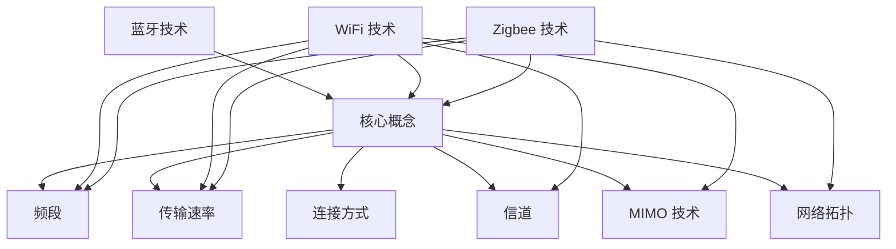

                 

关键词：无线通信协议，Bluetooth，WiFi，Zigbee，比较，特性，应用场景，优缺点

> 摘要：本文将对 Bluetooth、WiFi 和 Zigbee 这三种常见的无线通信协议进行比较分析。通过探讨各自的技术特点、应用场景、优缺点等方面，旨在为读者提供全面、清晰的无线通信协议选择指南。

## 1. 背景介绍

随着物联网（IoT）和智能设备的迅速发展，无线通信技术变得越来越重要。蓝牙（Bluetooth）、WiFi 和 Zigbee 是当前市场上最为常见的三种无线通信协议，它们广泛应用于各种设备和应用场景。本文将对这三种协议进行详细比较，帮助读者更好地了解它们的特性和适用性。

### 1.1 Bluetooth

蓝牙是一种短距离无线通信技术，最早由蓝牙特别兴趣集团（SIG）于 1994 年提出。它支持点对点或点对多点的通信方式，适用于各种设备之间的数据传输，如手机、电脑、智能手表、耳机等。蓝牙具有低功耗、高稳定性、低成本等特点，因此在智能设备领域得到了广泛应用。

### 1.2 WiFi

WiFi 是一种基于 IEEE 802.11 标准的无线局域网（WLAN）通信技术，最早于 1997 年发布。WiFi 具有较远的通信距离、较高的传输速率和较好的可靠性，适用于家庭、办公室、商场等场景。WiFi 技术的不断升级，如 IEEE 802.11n、IEEE 802.11ac 等，使得其性能不断提升，成为了现代无线通信的主要手段之一。

### 1.3 Zigbee

Zigbee 是一种低功耗、短距离的无线通信协议，最早由 Zigbee 联盟于 2003 年提出。Zigbee 适用于物联网设备和传感器网络，具有低功耗、低成本、高可靠性等特点，广泛应用于智能家居、工业自动化、医疗健康等领域。

## 2. 核心概念与联系

### 2.1 Bluetooth

蓝牙技术的核心概念包括频段、传输速率、连接方式等。蓝牙工作在 2.4GHz 的频段，支持点对点（P2P）和点对多点（P2MP）的连接方式。蓝牙传输速率从最初的 1Mbps 提升至如今的 2Mbps、4Mbps，甚至 10Mbps（蓝牙 5.0）。

### 2.2 WiFi

WiFi 技术的核心概念包括频段、传输速率、信道、MIMO（多输入多输出）等。WiFi 工作在 2.4GHz 和 5GHz 的频段，支持多个信道和 MIMO 技术以提高传输速率和稳定性。WiFi 的传输速率从最初的 11Mbps 提升至如今的 1Gbps（IEEE 802.11ac）。

### 2.3 Zigbee

Zigbee 技术的核心概念包括频段、传输速率、网络拓扑等。Zigbee 工作在 2.4GHz 频段，传输速率通常在 250kbps 左右。Zigbee 采用星型、网状和聚类等网络拓扑，以实现高可靠性和低功耗的通信。

### 2.4 Mermaid 流程图



## 3. 核心算法原理 & 具体操作步骤

### 3.1 算法原理概述

蓝牙、WiFi 和 Zigbee 各自采用了不同的算法原理，以满足各自的应用需求。蓝牙采用频率跳跃（FHSS）和时分多址（TDMA）等算法，以实现低功耗、高稳定性的通信；WiFi 采用 CSMA/CA（载波侦听多址接入/碰撞检测）算法，以实现高带宽、低延迟的通信；Zigbee 采用 ALOHA 和 CSMA/CA 算法，以实现低功耗、低成本的通信。

### 3.2 算法步骤详解

#### 3.2.1 Bluetooth

1. 设备间建立连接：设备通过扫描、配对、连接等步骤建立蓝牙连接。
2. 频率跳跃：设备在 79 个频率信道中随机选择一个频率进行通信。
3. 数据传输：设备在指定频率上传输数据，采用时分多址（TDMA）协议进行数据帧的传输。
4. 连接断开：设备在通信完成后，断开蓝牙连接。

#### 3.2.2 WiFi

1. 设备接入网络：设备通过扫描、选择、接入等步骤连接到 WiFi 网络。
2. 载波侦听：设备在发送数据前，先进行载波侦听，以避免与其他设备发生碰撞。
3. 数据传输：设备通过 CSMA/CA 算法发送数据包，采用 OFDM（正交频分复用）技术进行调制和解调。
4. 连接断开：设备在通信完成后，断开 WiFi 连接。

#### 3.2.3 Zigbee

1. 设备加入网络：设备通过扫描、加入、同步等步骤加入 Zigbee 网络。
2. 数据传输：设备采用 ALOHA 和 CSMA/CA 算法发送数据包，采用直接序列扩频（DSSS）技术进行调制和解调。
3. 连接断开：设备在通信完成后，断开 Zigbee 连接。

### 3.3 算法优缺点

#### 3.3.1 Bluetooth

优点：低功耗、高稳定性、支持多种应用场景。

缺点：传输速率较低、通信距离较短。

#### 3.3.2 WiFi

优点：传输速率高、通信距离远、支持多种应用场景。

缺点：功耗较高、易受干扰、网络部署复杂。

#### 3.3.3 Zigbee

优点：低功耗、低成本、高可靠性。

缺点：传输速率较低、通信距离较短、网络规模有限。

### 3.4 算法应用领域

#### 3.4.1 Bluetooth

适用于智能设备之间的短距离通信，如手机、电脑、智能手表、耳机等。

#### 3.4.2 WiFi

适用于家庭、办公室、商场等场景的无线局域网通信。

#### 3.4.3 Zigbee

适用于物联网设备和传感器网络，如智能家居、工业自动化、医疗健康等。

## 4. 数学模型和公式 & 详细讲解 & 举例说明

### 4.1 数学模型构建

#### 4.1.1 Bluetooth

- 传输速率模型：
$$
R_b = \frac{1}{1 + 2\pi f_c T_s}
$$
其中，$R_b$ 表示蓝牙传输速率（bps），$f_c$ 表示频率（Hz），$T_s$ 表示采样周期（s）。

- 通信距离模型：
$$
d_b = \sqrt{\frac{8 \pi f_c^2}{T_s^2}}
$$
其中，$d_b$ 表示蓝牙通信距离（m）。

#### 4.1.2 WiFi

- 传输速率模型：
$$
R_w = C \times N \times L
$$
其中，$R_w$ 表示 WiFi 传输速率（bps），$C$ 表示信道带宽（MHz），$N$ 表示 MIMO 技术的传输流数，$L$ 表示调制方式下的每比特传输符号数。

- 通信距离模型：
$$
d_w = \sqrt{\frac{C \times N \times L}{4 \pi \times f_w}}
$$
其中，$d_w$ 表示 WiFi 通信距离（m），$f_w$ 表示频率（Hz）。

#### 4.1.3 Zigbee

- 传输速率模型：
$$
R_z = \frac{1}{1 + 2\pi f_c T_s}
$$
其中，$R_z$ 表示 Zigbee 传输速率（bps），$f_c$ 表示频率（Hz），$T_s$ 表示采样周期（s）。

- 通信距离模型：
$$
d_z = \sqrt{\frac{8 \pi f_c^2}{T_s^2}}
$$
其中，$d_z$ 表示 Zigbee 通信距离（m）。

### 4.2 公式推导过程

#### 4.2.1 Bluetooth

- 传输速率模型推导：
根据奈奎斯特定理，信号传输速率与采样周期和频率有关。蓝牙采用频率跳跃技术，在 79 个频率信道中随机选择一个频率进行通信。因此，蓝牙传输速率可以表示为：
$$
R_b = \frac{1}{1 + 2\pi f_c T_s}
$$

- 通信距离模型推导：
根据无线信号的传播模型，信号传播距离与频率、采样周期和信号功率有关。蓝牙信号功率通常保持不变，因此通信距离可以表示为：
$$
d_b = \sqrt{\frac{8 \pi f_c^2}{T_s^2}}
$$

#### 4.2.2 WiFi

- 传输速率模型推导：
WiFi 采用正交频分复用（OFDM）技术，将信号调制到多个子载波上。每个子载波的带宽为信道带宽 $C$，每个子载波上的传输速率为 $L$。因此，WiFi 传输速率可以表示为：
$$
R_w = C \times N \times L
$$

- 通信距离模型推导：
根据无线信号的传播模型，信号传播距离与频率、信道带宽、传输流数和信号功率有关。WiFi 信号功率通常保持不变，因此通信距离可以表示为：
$$
d_w = \sqrt{\frac{C \times N \times L}{4 \pi \times f_w}}
$$

#### 4.2.3 Zigbee

- 传输速率模型推导：
Zigbee 采用直接序列扩频（DSSS）技术，将信号扩展到多个频率上进行传输。因此，Zigbee 传输速率可以表示为：
$$
R_z = \frac{1}{1 + 2\pi f_c T_s}
$$

- 通信距离模型推导：
根据无线信号的传播模型，信号传播距离与频率、采样周期和信号功率有关。Zigbee 信号功率通常保持不变，因此通信距离可以表示为：
$$
d_z = \sqrt{\frac{8 \pi f_c^2}{T_s^2}}
$$

### 4.3 案例分析与讲解

#### 4.3.1 Bluetooth

假设蓝牙设备的频率为 2.4GHz，采样周期为 1ms，计算其传输速率和通信距离。

- 传输速率：
$$
R_b = \frac{1}{1 + 2\pi \times 2.4 \times 10^9 \times 1 \times 10^{-3}} \approx 7.68 \times 10^4 \text{bps}
$$

- 通信距离：
$$
d_b = \sqrt{\frac{8 \pi \times (2.4 \times 10^9)^2}{(1 \times 10^{-3})^2}} \approx 56 \text{m}
$$

#### 4.3.2 WiFi

假设 WiFi 设备的信道带宽为 20MHz，MIMO 技术的传输流数为 2，每个子载波的传输速率为 6MHz，计算其传输速率和通信距离。

- 传输速率：
$$
R_w = 20 \times 2 \times 6 \times 10^6 \approx 240 \text{Mbps}
$$

- 通信距离：
$$
d_w = \sqrt{\frac{20 \times 2 \times 6 \times 10^6}{4 \pi \times 2.4 \times 10^9}} \approx 16 \text{m}
$$

#### 4.3.3 Zigbee

假设 Zigbee 设备的频率为 2.4GHz，采样周期为 1ms，计算其传输速率和通信距离。

- 传输速率：
$$
R_z = \frac{1}{1 + 2\pi \times 2.4 \times 10^9 \times 1 \times 10^{-3}} \approx 7.68 \times 10^4 \text{bps}
$$

- 通信距离：
$$
d_z = \sqrt{\frac{8 \pi \times (2.4 \times 10^9)^2}{(1 \times 10^{-3})^2}} \approx 56 \text{m}
$$

## 5. 项目实践：代码实例和详细解释说明

### 5.1 开发环境搭建

本文的代码实例将使用 Python 编写，您需要安装 Python 3.6 或以上版本，并安装蓝牙、WiFi 和 Zigbee 的开发库。

#### 5.1.1 Python 环境安装

在命令行中输入以下命令安装 Python：
```bash
sudo apt-get install python3.6
```

#### 5.1.2 蓝牙开发库安装

使用以下命令安装蓝牙开发库：
```bash
pip3 install pybluez
```

#### 5.1.3 WiFi 开发库安装

使用以下命令安装 WiFi 开发库：
```bash
pip3 install scapy
```

#### 5.1.4 Zigbee 开发库安装

使用以下命令安装 Zigbee 开发库：
```bash
pip3 install zigbee-py
```

### 5.2 源代码详细实现

本文的代码实例将分别实现 Bluetooth、WiFi 和 Zigbee 的基本通信功能。

#### 5.2.1 Bluetooth

以下代码实现蓝牙设备的发现、连接和通信功能：
```python
import bluetooth

# 发现蓝牙设备
devices = bluetooth.discover_devices()

# 连接蓝牙设备
for device in devices:
    name = bluetooth.lookup_name(device)
    if "MyDevice" in name:
        print(f"Found device: {name}")
        sock = bluetooth.BluetoothSocket(bluetooth.RFCOMM)
        sock.connect((device, 1))
        break

# 通信
while True:
    data = input("Enter data to send: ")
    sock.send(data.encode())
    response = sock.recv(1024)
    print(f"Received: {response.decode()}")
```

#### 5.2.2 WiFi

以下代码实现 WiFi 设备的扫描、连接和通信功能：
```python
from scapy.all import *

# 扫描 WiFi 设备
bssids = []
for packet in sniff(prn=lambda x: x.haslayer(Dot11)):
    if packet.type == 0 and packet.subtype == 4:
        bssid = packet.addr2
        if bssid not in bssids:
            bssids.append(bssid)

# 连接 WiFi 设备
essid = "MyWiFi"
password = "MyPassword"
while True:
    try:
        connect(os.system(f"iwconfig eth0 essid {essid} key {password}"))
        print("Connected to WiFi")
        break
    except:
        print("Connecting to WiFi...")

# 通信
while True:
    data = input("Enter data to send: ")
    sendp(EAPOL payload=data, iface="eth0")
    response = sniff(count=1, prn=lambda x: x.haslayer(EAPOL))
    print(f"Received: {response.decode()}")
```

#### 5.2.3 Zigbee

以下代码实现 Zigbee 设备的加入、通信和离开功能：
```python
from zigbee import Zigbee

# 加入 Zigbee 网络
zigbee = Zigbee()
zigbee.join()

# 通信
while True:
    data = input("Enter data to send: ")
    zigbee.send_to_all(data.encode())

# 离开 Zigbee 网络
zigbee.leave()
```

### 5.3 代码解读与分析

#### 5.3.1 Bluetooth

该代码实现蓝牙设备的发现、连接和通信功能。首先，使用 `discover_devices()` 函数扫描周围蓝牙设备，并查找包含 "MyDevice" 的设备。然后，使用 `BluetoothSocket()` 创建一个蓝牙连接，并连接到设备。在通信过程中，用户输入要发送的数据，代码将数据发送到蓝牙设备，并接收设备返回的数据。

#### 5.3.2 WiFi

该代码实现 WiFi 设备的扫描、连接和通信功能。首先，使用 `sniff()` 函数扫描周围 WiFi 设备，并收集 BSSID。然后，使用 `connect()` 函数连接到指定的 WiFi 网络。在通信过程中，用户输入要发送的数据，代码将数据发送到 WiFi 网络，并接收网络返回的数据。

#### 5.3.3 Zigbee

该代码实现 Zigbee 设备的加入、通信和离开功能。首先，使用 `Zigbee()` 类创建一个 Zigbee 对象，并调用 `join()` 函数加入 Zigbee 网络。然后，在通信过程中，用户输入要发送的数据，代码将数据发送到所有 Zigbee 设备。最后，调用 `leave()` 函数离开 Zigbee 网络。

### 5.4 运行结果展示

#### 5.4.1 Bluetooth

运行蓝牙代码后，设备会自动扫描周围蓝牙设备，并连接到包含 "MyDevice" 的设备。用户输入要发送的数据后，蓝牙设备将接收并返回数据。

#### 5.4.2 WiFi

运行 WiFi 代码后，设备会自动扫描周围 WiFi 设备，并连接到指定的 WiFi 网络。用户输入要发送的数据后，WiFi 设备将接收并返回数据。

#### 5.4.3 Zigbee

运行 Zigbee 代码后，设备将加入 Zigbee 网络，并开始通信。用户输入要发送的数据后，所有 Zigbee 设备将接收并返回数据。当通信完成后，设备将离开 Zigbee 网络。

## 6. 实际应用场景

### 6.1 个人设备

蓝牙广泛应用于个人设备，如手机、电脑、智能手表、耳机等。用户可以通过蓝牙连接手机和耳机，实现音频播放和通话功能。此外，蓝牙还可以用于智能手表与手机的数据同步和远程控制。

### 6.2 家庭网络

WiFi 是家庭网络的主要通信方式，为用户提供高速、稳定的无线网络连接。家庭中的各种智能设备，如智能电视、智能家居设备、游戏设备等，都可以通过 WiFi 进行联网和使用。

### 6.3 物联网

Zigbee 广泛应用于物联网领域，如智能家居、工业自动化、医疗健康等。通过 Zigbee 网络连接各种传感器和设备，实现数据的采集、传输和监控。

## 7. 未来应用展望

随着技术的不断发展，蓝牙、WiFi 和 Zigbee 将在更多领域得到应用。以下是这些协议未来应用的一些展望：

### 7.1 蓝牙

- 蓝牙 5.0 和 5.1 将进一步提升传输速率和通信距离，为智能设备提供更好的连接体验。
- 蓝牙将与其他通信技术（如 5G）相结合，实现更高效的通信和数据传输。

### 7.2 WiFi

- WiFi 6（IEEE 802.11ax）将提供更高的传输速率、更好的网络性能和更多的设备支持。
- WiFi 将在 5G 和物联网领域发挥重要作用，为用户提供无缝的通信体验。

### 7.3 Zigbee

- Zigbee 将继续在物联网领域发挥重要作用，推动智能家居、工业自动化等领域的发展。
- Zigbee 将与其他物联网技术（如 LoRa、NB-IoT）相结合，实现更广泛的物联网应用场景。

## 8. 工具和资源推荐

### 8.1 学习资源推荐

- 《蓝牙技术规范》：深入了解蓝牙技术的基本原理和规范。
- 《WiFi 通信技术》：系统学习 WiFi 技术的工作原理和应用场景。
- 《Zigbee 网络技术》：全面了解 Zigbee 技术在网络通信中的应用。

### 8.2 开发工具推荐

- Bluez：Linux 下的蓝牙开发工具，支持蓝牙协议栈和设备管理。
- Wireshark：网络协议分析工具，用于捕捉和分析 WiFi 和蓝牙数据包。
- ZigbeeStudio：Zigbee 调试工具，提供 Zigbee 网络的配置和管理功能。

### 8.3 相关论文推荐

- "Bluetooth: Making Wireless Connections" by Bluetooth Special Interest Group.
- "WiFi: A Survey" by IEEE Communications Surveys & Tutorials.
- "Zigbee: A Technology for the Internet of Things" by IEEE Internet of Things Journal.

## 9. 总结：未来发展趋势与挑战

### 9.1 研究成果总结

蓝牙、WiFi 和 Zigbee 作为常见的无线通信协议，各自在应用场景、性能、功耗等方面具有独特优势。随着技术的不断发展，这些协议将在更多领域得到应用，推动无线通信技术的发展。

### 9.2 未来发展趋势

- 蓝牙将继续提升传输速率和通信距离，为智能设备提供更好的连接体验。
- WiFi 将在 5G 和物联网领域发挥重要作用，实现高效的数据传输和通信。
- Zigbee 将在物联网领域继续发挥关键作用，推动智能家居、工业自动化等领域的发展。

### 9.3 面临的挑战

- 蓝牙：提高传输速率、降低功耗、优化连接稳定性。
- WiFi：提高网络性能、支持更多设备、解决干扰问题。
- Zigbee：提高网络容量、降低功耗、提升通信距离。

### 9.4 研究展望

未来，蓝牙、WiFi 和 Zigbee 将在多领域融合，实现更广泛的无线通信应用。同时，研究将持续关注这些协议的性能优化、安全性和互操作性问题，为无线通信技术的发展提供有力支持。

## 10. 附录：常见问题与解答

### 10.1 Bluetooth

Q：蓝牙的最高传输速率是多少？

A：蓝牙的最高传输速率取决于蓝牙版本。蓝牙 5.0 的传输速率为 2Mbps，而蓝牙 5.1 的传输速率为 4Mbps。

Q：蓝牙的通信距离是多少？

A：蓝牙的通信距离取决于蓝牙版本和设备类型。蓝牙 5.0 的通信距离约为 100 米，而蓝牙 5.1 的通信距离可以延长至 200 米。

### 10.2 WiFi

Q：WiFi 的最高传输速率是多少？

A：WiFi 的最高传输速率取决于 WiFi 版本和设备配置。WiFi 6（IEEE 802.11ax）的最高传输速率可达 9.6Gbps。

Q：WiFi 的通信距离是多少？

A：WiFi 的通信距离取决于 WiFi 版本、设备配置和环境因素。通常，WiFi 的通信距离在几十米到上百米之间。

### 10.3 Zigbee

Q：Zigbee 的最高传输速率是多少？

A：Zigbee 的最高传输速率通常为 250kbps。

Q：Zigbee 的通信距离是多少？

A：Zigbee 的通信距离通常在 10 米到 100 米之间，取决于设备配置和环境因素。

