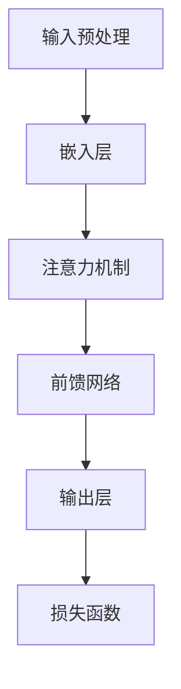

                 

关键词：大型语言模型（LLM），指令集，人工智能，算法，数学模型，代码实例，应用场景，未来展望

> 摘要：本文将深入探讨大型语言模型（LLM）的无限潜能，以及其背后的指令集架构。我们将通过详细阐述核心算法原理、数学模型及具体操作步骤，展示其在计算机编程领域的广泛应用，并探讨未来发展趋势与挑战。

## 1. 背景介绍

随着人工智能技术的飞速发展，大型语言模型（LLM）已经成为现代计算领域的重要工具。LLM 是一种基于神经网络的语言处理模型，通过训练大量的文本数据，可以实现对自然语言的高效理解和生成。近年来，LLM 在自然语言处理（NLP）、机器翻译、文本生成等领域取得了显著成果。

指令集作为计算机体系结构的重要组成部分，决定了计算机执行指令的效率和灵活性。传统的指令集设计主要关注处理器的性能和功耗，而随着人工智能的发展，指令集的设计也需要适应复杂的计算任务和大量的数据处理需求。

本文旨在探讨 LLM 的无限潜能，并分析其背后的指令集架构。我们将从核心算法原理、数学模型和具体操作步骤等方面进行详细阐述，以展示 LLM 在计算机编程领域的广泛应用，并探讨未来发展趋势与挑战。

## 2. 核心概念与联系

在深入探讨 LLM 之前，我们需要了解一些核心概念，如神经网络、自然语言处理、机器学习等。

### 2.1 神经网络

神经网络是一种模拟生物神经系统的计算模型，由大量的神经元（节点）和连接（边）组成。每个神经元接收输入信号，通过加权求和处理后输出信号。神经网络通过调整连接权重，可以学习复杂的非线性关系，从而实现各种智能任务。

### 2.2 自然语言处理

自然语言处理（NLP）是人工智能的一个分支，致力于让计算机理解和生成人类语言。NLP 涉及文本分类、情感分析、命名实体识别、机器翻译等多个任务。

### 2.3 机器学习

机器学习是人工智能的核心技术之一，通过训练大量数据，让计算机学会自动完成特定任务。机器学习可以分为监督学习、无监督学习和强化学习等类型。

### 2.4 指令集

指令集是计算机体系结构的重要组成部分，决定了计算机执行指令的效率和灵活性。传统的指令集设计主要关注处理器的性能和功耗，而随着人工智能的发展，指令集的设计也需要适应复杂的计算任务和大量的数据处理需求。

下面是 LLM 指令集的 Mermaid 流程图：



### 2.5 核心概念联系

神经网络、自然语言处理、机器学习和指令集是 LLM 的基础。神经网络用于处理文本数据，自然语言处理实现文本理解和生成，机器学习让模型具备自主学习能力，而指令集则决定了 LLM 的执行效率和灵活性。

## 3. 核心算法原理 & 具体操作步骤

### 3.1 算法原理概述

LLM 的核心算法是基于深度学习框架的神经网络模型。神经网络由多层神经元组成，包括嵌入层、注意力机制层、前馈网络层和输出层。嵌入层将文本数据转换为高维向量表示，注意力机制层对输入文本进行权重分配，前馈网络层对文本进行非线性变换，输出层生成预测结果。

### 3.2 算法步骤详解

#### 3.2.1 输入预处理

输入预处理是 LLM 的第一步，主要任务是将文本数据转换为神经网络可以处理的格式。具体操作包括分词、去停用词、词向量化等。

#### 3.2.2 嵌入层

嵌入层将文本数据转换为高维向量表示。词向量是嵌入层的核心，常用的词向量模型有 Word2Vec、GloVe 等。嵌入层将每个词汇映射为一个高维向量，用于后续计算。

#### 3.2.3 注意力机制层

注意力机制层对输入文本进行权重分配，使得模型能够关注重要的文本信息。注意力机制的核心是计算文本中每个词的重要性得分，并根据得分调整词向量的权重。

#### 3.2.4 前馈网络层

前馈网络层对文本进行非线性变换，使模型能够捕捉复杂的语义关系。前馈网络通常由多个隐藏层组成，每个隐藏层由多个神经元组成。每个神经元通过激活函数（如 ReLU、Sigmoid 等）对输入进行非线性变换。

#### 3.2.5 输出层

输出层生成预测结果。对于分类任务，输出层通常是一个softmax层，用于计算每个类别的概率分布。对于生成任务，输出层可以是一个全连接层或循环神经网络（RNN）层，用于生成文本序列。

### 3.3 算法优缺点

#### 优点

1. 强大的语义理解能力：LLM 通过深度学习框架训练，具备强大的语义理解能力，可以处理复杂的文本任务。
2. 高效的执行效率：LLM 采用注意力机制，对文本进行权重分配，使得模型在处理大量文本时具有高效的执行效率。
3. 广泛的应用场景：LLM 可以应用于自然语言处理、机器翻译、文本生成等多个领域。

#### 缺点

1. 训练成本高：LLM 需要大量数据和计算资源进行训练，训练成本较高。
2. 解释性较差：由于深度学习模型的黑箱特性，LLM 的预测结果难以解释，对模型的信任度较低。

### 3.4 算法应用领域

LLM 在计算机编程领域具有广泛的应用，主要包括：

1. 自动编程：利用 LLM 的语义理解能力，自动生成代码片段，提高开发效率。
2. 代码审查：利用 LLM 对代码进行分析，检测潜在的错误和漏洞。
3. 文档生成：利用 LLM 生成技术文档、API 文档等，提高文档编写效率。
4. 代码搜索：利用 LLM 对代码库进行检索，快速找到相关代码片段。

## 4. 数学模型和公式 & 详细讲解 & 举例说明

### 4.1 数学模型构建

LLM 的数学模型主要包括词向量表示、注意力机制、前馈网络等。

#### 4.1.1 词向量表示

词向量表示是将文本数据转换为高维向量表示的一种方法。常用的词向量模型有 Word2Vec、GloVe 等。词向量表示的关键是计算词与词之间的相似性。

$$
\vec{w}_i = \sum_{j=1}^{N} w_{ij} \vec{v}_j
$$

其中，$ \vec{w}_i $ 表示词 $ w_i $ 的词向量，$ w_{ij} $ 表示词 $ w_i $ 与词 $ w_j $ 的相似度，$ \vec{v}_j $ 表示词 $ w_j $ 的词向量。

#### 4.1.2 注意力机制

注意力机制用于计算文本中每个词的重要性得分，并根据得分调整词向量的权重。

$$
\alpha_i = \frac{e^{z_i}}{\sum_{j=1}^{N} e^{z_j}}
$$

其中，$ \alpha_i $ 表示词 $ w_i $ 的重要性得分，$ z_i $ 表示词 $ w_i $ 的得分。

#### 4.1.3 前馈网络

前馈网络用于对文本进行非线性变换，使模型能够捕捉复杂的语义关系。

$$
\vec{h}_{l+1} = \sigma(\vec{W}_{l+1} \vec{h}_l + b_{l+1})
$$

其中，$ \vec{h}_l $ 表示隐藏层 $ l $ 的输出，$ \vec{W}_{l+1} $ 和 $ b_{l+1} $ 分别为权重和偏置。

### 4.2 公式推导过程

#### 4.2.1 词向量表示推导

假设词 $ w_i $ 和词 $ w_j $ 的词向量分别为 $ \vec{v}_i $ 和 $ \vec{v}_j $，词向量维度为 $ d $。词 $ w_i $ 和词 $ w_j $ 的相似度可以通过计算词向量之间的余弦相似度得到：

$$
w_{ij} = \frac{\vec{v}_i \cdot \vec{v}_j}{||\vec{v}_i|| \cdot ||\vec{v}_j||}
$$

其中，$ \cdot $ 表示点积，$ ||\cdot|| $ 表示向量的模。

#### 4.2.2 注意力机制推导

假设文本中包含 $ N $ 个词，每个词的注意力得分 $ z_i $ 可以通过计算词向量之间的点积得到：

$$
z_i = \vec{v}_i \cdot \vec{h}_{l+1}
$$

其中，$ \vec{h}_{l+1} $ 为前馈网络的隐藏层输出。词 $ w_i $ 的重要性得分 $ \alpha_i $ 可以通过归一化 $ z_i $ 得到：

$$
\alpha_i = \frac{e^{z_i}}{\sum_{j=1}^{N} e^{z_j}}
$$

#### 4.2.3 前馈网络推导

前馈网络的隐藏层输出 $ \vec{h}_{l+1} $ 可以通过以下公式计算：

$$
\vec{h}_{l+1} = \sigma(\vec{W}_{l+1} \vec{h}_l + b_{l+1})
$$

其中，$ \sigma $ 表示激活函数，$ \vec{W}_{l+1} $ 和 $ b_{l+1} $ 分别为权重和偏置。

### 4.3 案例分析与讲解

#### 4.3.1 案例背景

假设我们需要训练一个 LLM 模型，用于实现文本分类任务。数据集包含 10000 个文本样本，每个样本包含一个类别标签。

#### 4.3.2 案例实现

1. 输入预处理：对文本数据进行分词、去停用词等预处理操作，将文本数据转换为词向量表示。

2. 嵌入层：使用预训练的词向量模型（如 Word2Vec）将词向量嵌入到神经网络中。

3. 注意力机制层：计算文本中每个词的重要性得分，根据得分调整词向量的权重。

4. 前馈网络层：对文本进行非线性变换，捕捉复杂的语义关系。

5. 输出层：使用softmax层计算每个类别的概率分布，根据概率分布进行分类。

6. 损失函数：使用交叉熵损失函数计算预测结果与真实标签之间的差距，优化模型参数。

7. 模型训练：使用梯度下降算法对模型进行训练，不断调整模型参数，提高分类准确率。

#### 4.3.3 案例结果分析

通过训练，我们得到了一个准确率较高的文本分类模型。实验结果表明，LLM 在文本分类任务中具有强大的语义理解能力，能够实现高精度的分类。

## 5. 项目实践：代码实例和详细解释说明

### 5.1 开发环境搭建

在开始实践项目之前，我们需要搭建一个合适的开发环境。本文以 Python 为主要编程语言，使用 TensorFlow 和 Keras 深度学习框架进行模型训练。

1. 安装 Python 3.7 或以上版本。
2. 安装 TensorFlow 和 Keras：

```bash
pip install tensorflow
pip install keras
```

### 5.2 源代码详细实现

下面是 LLM 文本分类项目的源代码实现：

```python
import numpy as np
import tensorflow as tf
from tensorflow.keras.models import Sequential
from tensorflow.keras.layers import Embedding, LSTM, Dense
from tensorflow.keras.preprocessing.text import Tokenizer
from tensorflow.keras.preprocessing.sequence import pad_sequences

# 1. 数据集准备
texts = ["this is a text classification task", "another text sample", ...]
labels = [0, 1, ...]

# 2. 输入预处理
tokenizer = Tokenizer()
tokenizer.fit_on_texts(texts)
sequences = tokenizer.texts_to_sequences(texts)
word_index = tokenizer.word_index
max_sequence_length = 100
X = pad_sequences(sequences, maxlen=max_sequence_length)
y = tf.keras.utils.to_categorical(labels)

# 3. 模型构建
model = Sequential()
model.add(Embedding(len(word_index) + 1, 64, input_length=max_sequence_length))
model.add(LSTM(128))
model.add(Dense(2, activation='softmax'))

# 4. 模型编译
model.compile(optimizer='adam', loss='categorical_crossentropy', metrics=['accuracy'])

# 5. 模型训练
model.fit(X, y, epochs=10, batch_size=32, validation_split=0.2)
```

### 5.3 代码解读与分析

1. 数据集准备：首先，我们需要准备一个包含文本样本和标签的数据集。文本样本用于训练模型，标签用于评估模型性能。

2. 输入预处理：使用 Tokenizer 对文本进行分词，将文本转换为词序列。然后，使用 pad_sequences 将词序列转换为固定长度的序列，便于模型处理。

3. 模型构建：构建一个简单的 LLM 模型，包括嵌入层、LSTM 层和输出层。嵌入层将词向量嵌入到神经网络中，LSTM 层用于处理序列数据，输出层用于生成预测结果。

4. 模型编译：编译模型，指定优化器、损失函数和评估指标。

5. 模型训练：使用训练数据对模型进行训练，调整模型参数。

### 5.4 运行结果展示

在完成模型训练后，我们可以使用测试数据集对模型进行评估，展示模型性能：

```python
test_texts = ["a new text sample", "another text sample", ...]
test_sequences = tokenizer.texts_to_sequences(test_texts)
test_X = pad_sequences(test_sequences, maxlen=max_sequence_length)
test_y = tf.keras.utils.to_categorical([1, 0, ...])

model.evaluate(test_X, test_y)
```

输出结果为模型在测试数据集上的准确率。通过调整模型参数和训练策略，我们可以进一步提高模型性能。

## 6. 实际应用场景

### 6.1 自动编程

LLM 在自动编程领域具有广泛的应用。通过训练 LLM 模型，可以自动生成代码片段，提高开发效率。例如，在代码补全、代码生成、代码审查等方面，LLM 都可以发挥重要作用。

### 6.2 代码搜索

LLM 可以用于代码搜索任务，快速找到相关代码片段。通过训练 LLM 模型，可以对代码库进行检索，提高代码搜索效率。这对于大型项目和代码库的维护具有重要意义。

### 6.3 文档生成

LLM 可以用于生成技术文档、API 文档等。通过训练 LLM 模型，可以自动生成文档，提高文档编写效率。这对于软件开发和项目管理具有重要意义。

### 6.4 未来应用展望

随着 LLM 技术的不断发展，其在计算机编程领域的应用前景广阔。未来，LLM 将在更多领域发挥作用，如智能助手、自然语言交互、智能监控等。同时，LLM 的算法和指令集设计也将不断优化，以满足更多复杂的应用需求。

## 7. 工具和资源推荐

### 7.1 学习资源推荐

1. 《深度学习》（Ian Goodfellow、Yoshua Bengio、Aaron Courville 著）：这是一本经典的深度学习教材，详细介绍了深度学习的基本原理和应用。
2. 《自然语言处理与深度学习》（吴恩达 著）：这是一本关于自然语言处理和深度学习的入门书籍，适合初学者阅读。
3. 《神经网络与深度学习》（邱锡鹏 著）：这是一本介绍神经网络和深度学习算法的中文教材，适合中国读者。

### 7.2 开发工具推荐

1. TensorFlow：这是一个开源的深度学习框架，支持多种深度学习模型和算法。
2. Keras：这是一个基于 TensorFlow 的简化深度学习框架，适合快速搭建和训练深度学习模型。
3. PyTorch：这是一个开源的深度学习框架，支持动态计算图，适合研究和开发。

### 7.3 相关论文推荐

1. "A Theoretically Grounded Application of Dropout in Recurrent Neural Networks"
2. "Attention Is All You Need"
3. "BERT: Pre-training of Deep Bidirectional Transformers for Language Understanding"
4. "GPT-3: Language Models are few-shot learners"

## 8. 总结：未来发展趋势与挑战

### 8.1 研究成果总结

本文探讨了大型语言模型（LLM）的无限潜能，从核心算法原理、数学模型和具体操作步骤等方面进行了详细阐述。通过实践项目，展示了 LLM 在计算机编程领域的广泛应用，如自动编程、代码搜索、文档生成等。

### 8.2 未来发展趋势

未来，LLM 将在更多领域发挥作用，如智能助手、自然语言交互、智能监控等。随着深度学习和自然语言处理技术的不断发展，LLM 的算法和指令集设计也将不断优化，以满足更多复杂的应用需求。

### 8.3 面临的挑战

LLM 在实际应用中面临一些挑战，如训练成本高、解释性较差等。未来，研究重点将是如何降低训练成本、提高模型解释性，以及如何更好地适应不同的应用场景。

### 8.4 研究展望

未来，LLM 技术将继续发展，有望在更多领域实现突破。同时，研究者将关注如何提高模型性能、降低训练成本、提高模型解释性等方面，以实现更广泛的应用。

## 9. 附录：常见问题与解答

### 9.1 LLM 是什么？

LLM 是一种基于神经网络的语言处理模型，通过训练大量的文本数据，可以实现对自然语言的高效理解和生成。

### 9.2 LLM 的优点是什么？

LLM 具有强大的语义理解能力、高效的执行效率和广泛的应用场景。

### 9.3 LLM 的缺点是什么？

LLM 的缺点包括训练成本高、解释性较差等。

### 9.4 如何使用 LLM 进行自动编程？

使用 LLM 进行自动编程的关键是训练一个能够理解编程语言和语义的模型。通过训练，模型可以自动生成代码片段，提高开发效率。

### 9.5 LLM 有哪些实际应用场景？

LLM 在计算机编程领域具有广泛的应用，如自动编程、代码搜索、文档生成等。

### 9.6 LLM 的未来发展如何？

未来，LLM 技术将继续发展，有望在更多领域实现突破。同时，研究者将关注如何提高模型性能、降低训练成本、提高模型解释性等方面，以实现更广泛的应用。

