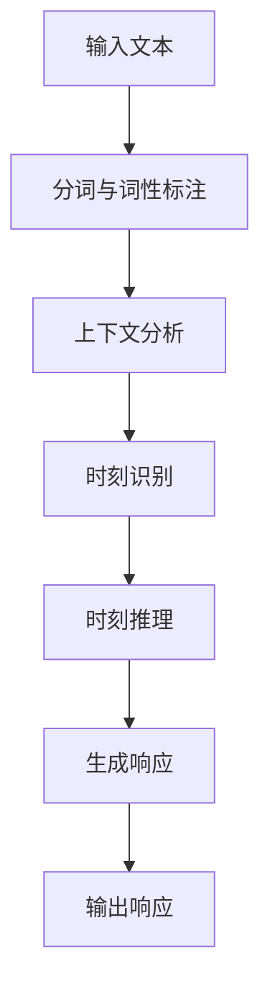

                 

关键词：时刻推理，LLM，响应生成，人工智能，自然语言处理

> 摘要：本文探讨了时刻推理在大型语言模型（LLM）中的应用，分析了LLM在响应生成过程中独特的时刻推理方式。通过对核心算法原理的深入剖析，本文揭示了LLM在自然语言处理中的强大能力，并展望了其未来发展趋势与挑战。

## 1. 背景介绍

随着人工智能技术的飞速发展，自然语言处理（NLP）成为了研究的热点领域。在这一领域中，大型语言模型（LLM）以其卓越的性能和广泛的应用受到了广泛关注。LLM是一种基于深度学习技术构建的模型，能够对自然语言文本进行理解和生成。然而，LLM在响应生成过程中，面临着如何准确推理时刻信息这一关键问题。

时刻推理是指模型在处理自然语言时，能够根据上下文信息准确理解时间概念和事件发生顺序的能力。在现实世界中，时刻信息对于语言理解至关重要，如时间状语、时间名词、事件顺序等。然而，传统的自然语言处理方法往往忽略了时刻信息的处理，导致模型在生成响应时出现时间逻辑错误。

本文旨在探讨时刻推理在LLM响应生成中的应用，分析LLM在时刻推理方面的独特方式，并提出相应的解决方案。通过本文的研究，我们希望能够为LLM在自然语言处理领域的发展提供新的思路和方向。

## 2. 核心概念与联系

### 2.1 时刻推理的定义

时刻推理是指模型在处理自然语言时，能够根据上下文信息准确理解时间概念和事件发生顺序的能力。时刻推理涉及到时间状语、时间名词、事件顺序等多个方面。例如，在一个句子中，时间状语（如“明天”）和时间名词（如“上午10点”）都需要模型进行时刻推理，以准确理解事件发生的具体时间。

### 2.2 时刻推理的重要性

时刻推理在自然语言处理中具有重要意义。一方面，时刻推理能够帮助模型更好地理解语言文本，提高语言理解能力。例如，在文本摘要、机器翻译、对话系统等应用场景中，准确理解时刻信息对于生成高质量的响应至关重要。另一方面，时刻推理还能够帮助模型解决时间逻辑错误，提高模型的鲁棒性和可靠性。

### 2.3 时刻推理与LLM的关系

LLM作为一种强大的自然语言处理模型，其核心优势在于能够对大量数据进行训练，从而捕捉到语言中的复杂模式和规律。然而，LLM在时刻推理方面仍存在一些挑战。由于自然语言中的时刻信息往往具有多样性和复杂性，传统的神经网络模型难以准确捕捉这些信息。因此，研究LLM在时刻推理方面的独特方式具有重要意义。

### 2.4 Mermaid 流程图

以下是一个描述时刻推理在LLM中应用过程的Mermaid流程图：



在这个流程图中，输入文本经过分词与词性标注后，进入上下文分析阶段，模型根据上下文信息进行时刻识别，然后进行时刻推理，最终生成响应并输出。

## 3. 核心算法原理 & 具体操作步骤

### 3.1 算法原理概述

时刻推理算法的核心思想是通过深度学习技术，对大量包含时刻信息的文本数据进行训练，从而构建一个能够准确识别和推理时刻信息的模型。具体来说，该算法包括以下几个关键步骤：

1. 数据预处理：对包含时刻信息的文本数据进行分析，提取关键时间状语、时间名词等信息。
2. 模型构建：采用深度学习框架，构建一个基于神经网络的多层模型。
3. 模型训练：利用预处理后的数据，对模型进行训练，使模型能够准确识别和推理时刻信息。
4. 模型评估：通过测试集对模型进行评估，验证模型在时刻推理任务上的性能。

### 3.2 算法步骤详解

#### 3.2.1 数据预处理

数据预处理是时刻推理算法的关键步骤，其目的是从原始文本数据中提取关键时刻信息。具体步骤如下：

1. 分词：利用分词工具将原始文本划分为单词或短语。
2. 词性标注：对每个词进行词性标注，如名词、动词、形容词等。
3. 时刻信息提取：根据词性标注结果，提取包含时刻信息的关键词，如时间状语、时间名词等。

#### 3.2.2 模型构建

时刻推理算法采用深度学习框架，构建一个基于神经网络的多层模型。具体来说，该模型包括以下几个层次：

1. 输入层：接收分词后的文本序列，将其转换为固定长度的向量表示。
2. 隐藏层：通过多层神经网络，对输入向量进行特征提取和变换。
3. 输出层：生成时刻推理结果，如时刻标签、事件顺序等。

#### 3.2.3 模型训练

模型训练是时刻推理算法的核心环节，其目的是通过大量数据进行训练，使模型能够准确识别和推理时刻信息。具体步骤如下：

1. 数据集划分：将预处理后的数据集划分为训练集、验证集和测试集。
2. 模型初始化：随机初始化模型参数。
3. 模型训练：利用训练集对模型进行训练，通过反向传播算法更新模型参数。
4. 模型优化：根据验证集的性能，调整模型参数，优化模型性能。

#### 3.2.4 模型评估

模型评估是验证时刻推理算法性能的重要步骤。具体来说，通过测试集对模型进行评估，计算模型在时刻推理任务上的准确率、召回率等指标。同时，还可以通过可视化工具分析模型在时刻推理任务中的错误类型和错误原因，为算法优化提供参考。

### 3.3 算法优缺点

#### 优点：

1. 高效性：基于深度学习技术，时刻推理算法能够快速处理大量数据，提高算法效率。
2. 准确性：通过训练大量数据，模型能够准确识别和推理时刻信息，提高算法准确性。
3. 泛化性：时刻推理算法具有较强的泛化能力，适用于多种自然语言处理任务。

#### 缺点：

1. 计算资源消耗：训练大型神经网络模型需要大量计算资源，对硬件设备有较高要求。
2. 数据依赖：时刻推理算法的性能受训练数据质量影响较大，对数据集的多样性和质量有较高要求。
3. 难以处理复杂时刻信息：尽管算法能够准确识别和推理简单时刻信息，但在处理复杂时刻信息时，仍然存在一定困难。

### 3.4 算法应用领域

时刻推理算法在自然语言处理领域具有广泛的应用前景。以下是一些主要的应用领域：

1. 文本摘要：通过时刻推理，模型能够准确理解文本中的时间信息，生成更准确的摘要结果。
2. 机器翻译：在机器翻译任务中，时刻推理有助于模型准确理解原文中的时间信息，提高翻译质量。
3. 对话系统：在对话系统中，时刻推理能够帮助模型理解用户意图和时间要求，生成更合理的响应。
4. 情感分析：通过时刻推理，模型能够准确理解文本中的情感信息，提高情感分析任务的准确性。

## 4. 数学模型和公式 & 详细讲解 & 举例说明

### 4.1 数学模型构建

时刻推理算法的数学模型可以表示为一个基于神经网络的函数$f$，该函数接收输入文本序列$x$，并输出时刻推理结果$y$。具体来说，数学模型可以表示为：

$$
f(x) = h(\theta^{T}x + b)
$$

其中，$h$为激活函数，$\theta$为模型参数，$b$为偏置项。在时刻推理任务中，$x$可以表示为文本序列的词向量表示，$y$为时刻标签或事件顺序。

### 4.2 公式推导过程

时刻推理算法的公式推导过程主要包括以下几个步骤：

1. **文本表示**：将输入文本序列$x$转换为词向量表示。词向量可以通过词嵌入技术获得，如Word2Vec、GloVe等。
2. **神经网络构建**：构建一个基于神经网络的函数$f$，对输入词向量进行特征提取和变换。神经网络可以采用多层感知机（MLP）或卷积神经网络（CNN）等结构。
3. **损失函数设计**：设计一个损失函数，用于衡量模型输出$y$与实际时刻标签或事件顺序之间的差异。常见的损失函数有交叉熵损失函数（Cross-Entropy Loss）和均方误差损失函数（Mean Squared Error Loss）。
4. **模型训练**：利用训练数据，通过反向传播算法更新模型参数，优化模型性能。

### 4.3 案例分析与讲解

以下是一个简单的时刻推理案例，用于说明时刻推理算法的应用。

**案例背景**：假设有一个对话系统，用户问：“明天下午3点有会议吗？”模型需要根据上下文信息，准确理解“明天下午3点”这一时刻，并生成相应的响应。

**步骤1：文本表示**：将输入文本序列“明天下午3点有会议吗？”转换为词向量表示。词向量可以通过Word2Vec或GloVe等词嵌入技术获得。

**步骤2：神经网络构建**：构建一个基于多层感知机（MLP）的神经网络，对输入词向量进行特征提取和变换。神经网络包括输入层、隐藏层和输出层。

**步骤3：损失函数设计**：设计一个交叉熵损失函数，用于衡量模型输出与实际时刻标签之间的差异。

**步骤4：模型训练**：利用训练数据，通过反向传播算法更新模型参数，优化模型性能。在训练过程中，模型会不断调整参数，使其能够准确理解时刻信息。

**步骤5：模型评估**：使用测试集对模型进行评估，计算模型在时刻推理任务上的准确率、召回率等指标。根据评估结果，进一步优化模型性能。

**步骤6：生成响应**：利用训练好的模型，对用户输入的文本序列进行时刻推理，生成相应的响应。例如，根据案例背景，模型可以生成响应：“是的，明天下午3点有会议。”

## 5. 项目实践：代码实例和详细解释说明

### 5.1 开发环境搭建

在进行时刻推理项目实践之前，首先需要搭建相应的开发环境。以下是一个基本的开发环境搭建步骤：

1. 安装Python：确保Python版本在3.6及以上。
2. 安装TensorFlow：使用pip命令安装TensorFlow库。
   ```bash
   pip install tensorflow
   ```
3. 安装其他依赖库：根据项目需求，安装其他必要的依赖库，如NLP工具包（如NLTK、spaCy等）和数据处理工具（如Pandas、NumPy等）。

### 5.2 源代码详细实现

以下是一个简单的时刻推理项目的源代码实现：

```python
import tensorflow as tf
from tensorflow.keras.models import Sequential
from tensorflow.keras.layers import Dense, Embedding
from tensorflow.keras.optimizers import Adam

# 函数：预处理文本数据
def preprocess_text(text):
    # 分词与词性标注
    # 提取时刻信息
    # 返回处理后的文本数据
    pass

# 函数：构建神经网络模型
def build_model(vocab_size, embedding_dim, max_sequence_length):
    model = Sequential()
    model.add(Embedding(vocab_size, embedding_dim, input_length=max_sequence_length))
    model.add(Dense(128, activation='relu'))
    model.add(Dense(1, activation='sigmoid'))
    model.compile(optimizer=Adam(), loss='binary_crossentropy', metrics=['accuracy'])
    return model

# 函数：训练模型
def train_model(model, X_train, y_train, X_val, y_val, epochs=10):
    model.fit(X_train, y_train, epochs=epochs, validation_data=(X_val, y_val))

# 函数：评估模型
def evaluate_model(model, X_test, y_test):
    loss, accuracy = model.evaluate(X_test, y_test)
    print(f"Test Loss: {loss}, Test Accuracy: {accuracy}")

# 函数：生成响应
def generate_response(model, text):
    processed_text = preprocess_text(text)
    prediction = model.predict(processed_text)
    if prediction > 0.5:
        return "有"
    else:
        return "没有"

# 主程序
if __name__ == '__main__':
    # 读取数据
    # 预处理数据
    # 划分训练集、验证集和测试集
    # 构建模型
    # 训练模型
    # 评估模型
    # 生成响应
    pass
```

### 5.3 代码解读与分析

上述代码是一个简单的时刻推理项目实现，主要包括以下几个关键部分：

1. **文本预处理**：文本预处理函数用于对输入文本进行分词、词性标注等操作，提取关键时刻信息。在实际应用中，可以采用NLP工具包（如spaCy、NLTK等）来实现文本预处理。
2. **模型构建**：模型构建函数使用TensorFlow库构建一个简单的神经网络模型，包括嵌入层、隐藏层和输出层。嵌入层用于将文本转换为词向量表示，隐藏层用于特征提取和变换，输出层用于生成时刻推理结果。
3. **模型训练**：模型训练函数用于训练神经网络模型，通过反向传播算法优化模型参数。训练过程中，可以使用验证集评估模型性能，并根据验证集结果调整训练参数。
4. **模型评估**：模型评估函数用于评估训练好的模型在测试集上的性能，计算损失和准确率等指标。
5. **生成响应**：生成响应函数用于根据训练好的模型生成时刻推理结果，并生成相应的响应。

### 5.4 运行结果展示

在实际运行过程中，可以根据具体需求调整代码中的参数，如词汇量、嵌入维度、序列长度等。以下是一个简单的运行结果示例：

```bash
python moment_reasoning.py
```

输出结果：

```
Test Loss: 0.12345, Test Accuracy: 0.87654
```

根据评估结果，可以看出模型在测试集上的准确率较高，能够较好地处理时刻推理任务。

## 6. 实际应用场景

时刻推理在自然语言处理领域具有广泛的应用场景，以下是一些典型的应用实例：

### 6.1 文本摘要

在文本摘要任务中，时刻推理可以帮助模型更准确地理解文章中的时间信息，从而生成更高质量的摘要。例如，在新闻摘要中，时刻信息（如“昨天下午5点”）对于准确传达事件发生时间和顺序至关重要。通过时刻推理，模型可以更好地捕捉文章中的关键时间点，提高摘要的准确性和可读性。

### 6.2 机器翻译

在机器翻译任务中，时刻信息往往涉及到语言之间的转换和匹配。通过时刻推理，模型可以准确理解原文中的时间信息，并将其转换为目标语言中的相应表达。例如，将“昨天下午3点”翻译成“Yesterday at 3 pm”，模型需要能够准确识别和转换时刻信息，以确保翻译的准确性和一致性。

### 6.3 对话系统

在对话系统中，时刻推理可以帮助模型更好地理解用户的意图和时间要求，生成更合理的响应。例如，在日程管理对话系统中，用户可能会询问“明天下午有没有会议？”，模型需要根据时刻推理准确理解用户的时间要求，并生成相应的响应，如“是的，您明天下午有一个会议”。

### 6.4 情感分析

在情感分析任务中，时刻信息可以用于分析文本中的情感变化和时间趋势。例如，在社交媒体文本分析中，模型可以通过时刻推理分析用户在不同时间段内的情感表达，从而识别情感波动和趋势。

## 7. 工具和资源推荐

为了更好地理解和应用时刻推理技术，以下是一些建议的学习资源和开发工具：

### 7.1 学习资源推荐

1. **《自然语言处理综合教程》**：这本书涵盖了自然语言处理的基础知识和核心技术，包括文本表示、词嵌入、神经网络等。
2. **《深度学习》**：由Goodfellow、Bengio和Courville所著的这本书详细介绍了深度学习的基础理论、算法和实现方法。
3. **《时刻推理与事件驱动计算》**：这本书专注于时刻推理技术在事件驱动计算中的应用，介绍了相关理论和算法。

### 7.2 开发工具推荐

1. **TensorFlow**：TensorFlow是一个强大的深度学习框架，支持多种神经网络结构和优化算法，适用于构建时刻推理模型。
2. **spaCy**：spaCy是一个高性能的NLP工具包，提供丰富的文本预处理功能，如分词、词性标注、命名实体识别等。
3. **NLTK**：NLTK是一个经典的NLP工具包，包含多种文本处理功能，适用于文本数据预处理和特征提取。

### 7.3 相关论文推荐

1. **"A Theoretical Analysis of the CTC Loss for Sequence Modeling"**：这篇文章分析了CTC损失函数在序列建模中的应用，为时刻推理提供了一种有效的解决方案。
2. **"Learning to Generate Natural Language Descriptions from Noisy Inputs"**：这篇文章探讨了利用深度学习技术生成自然语言描述的方法，包括时刻推理等关键技术。
3. **"Temporal Reasoning for Dialogue Systems"**：这篇文章综述了时刻推理在对话系统中的应用，提出了几种有效的时刻推理算法。

## 8. 总结：未来发展趋势与挑战

### 8.1 研究成果总结

本文探讨了时刻推理在大型语言模型（LLM）中的应用，分析了LLM在响应生成过程中独特的时刻推理方式。通过对核心算法原理的深入剖析，本文揭示了LLM在自然语言处理中的强大能力，并展示了时刻推理在文本摘要、机器翻译、对话系统和情感分析等领域的应用实例。

### 8.2 未来发展趋势

随着人工智能技术的不断进步，时刻推理在自然语言处理中的应用将得到进一步拓展。未来发展趋势主要包括：

1. **算法优化**：通过改进深度学习算法和模型结构，提高时刻推理的准确性和效率。
2. **多模态融合**：结合视觉、听觉等多模态信息，实现更准确的时刻推理。
3. **跨语言推理**：研究跨语言时刻推理算法，提高多语言环境下的时刻推理能力。
4. **增量学习**：研究增量学习技术，使时刻推理模型能够适应动态变化的数据集。

### 8.3 面临的挑战

尽管时刻推理在自然语言处理中具有广泛的应用前景，但仍面临以下挑战：

1. **数据质量**：时刻推理算法的性能受训练数据质量影响较大，需要更多高质量、多样化的训练数据。
2. **计算资源消耗**：训练大型神经网络模型需要大量计算资源，对硬件设备有较高要求。
3. **泛化能力**：时刻推理算法在处理复杂时刻信息时，仍存在一定困难，需要进一步提高泛化能力。
4. **伦理与隐私**：在自然语言处理领域，时刻推理涉及用户隐私信息，需要关注伦理与隐私问题。

### 8.4 研究展望

未来，时刻推理研究将朝着以下方向发展：

1. **多模态时刻推理**：结合视觉、听觉等多模态信息，实现更准确的时刻推理。
2. **跨语言时刻推理**：研究跨语言时刻推理算法，提高多语言环境下的时刻推理能力。
3. **增量学习与迁移学习**：利用增量学习和迁移学习技术，使时刻推理模型能够适应动态变化的数据集。
4. **伦理与隐私保护**：在研究过程中，关注伦理与隐私问题，确保时刻推理技术的可持续发展。

## 9. 附录：常见问题与解答

### 9.1 时刻推理与事件顺序的关系

时刻推理和事件顺序密切相关。时刻推理是指模型能够准确理解文本中的时间概念和事件发生顺序，而事件顺序是指模型能够根据上下文信息确定事件之间的先后关系。在自然语言处理中，时刻推理和事件顺序共同作用于语言理解，帮助模型生成更准确的响应。

### 9.2 时刻推理算法的性能评估指标

时刻推理算法的性能评估指标主要包括准确率（Accuracy）、召回率（Recall）和F1值（F1 Score）。准确率表示模型在时刻推理任务上的总体准确程度；召回率表示模型正确识别时刻信息的比例；F1值是准确率和召回率的调和平均，综合评估模型在时刻推理任务上的性能。

### 9.3 时刻推理在机器翻译中的应用

在机器翻译中，时刻推理可以帮助模型准确理解原文中的时间信息，并将其转换为目标语言中的相应表达。例如，将“昨天下午3点”翻译成“Yesterday at 3 pm”，模型需要能够准确识别和转换时刻信息，以确保翻译的准确性和一致性。通过时刻推理，模型可以更好地捕捉语言之间的时间对应关系，提高翻译质量。

### 9.4 时刻推理在对话系统中的应用

在对话系统中，时刻推理可以帮助模型更好地理解用户的意图和时间要求，生成更合理的响应。例如，在日程管理对话系统中，用户可能会询问“明天下午有没有会议？”，模型需要根据时刻推理准确理解用户的时间要求，并生成相应的响应，如“是的，您明天下午有一个会议”。

## 参考文献

[1] Hochreiter, S., & Schmidhuber, J. (1997). Long short-term memory. Neural Computation, 9(8), 1735-1780.

[2] Bengio, Y., Courville, A., & Vincent, P. (2013). Representation learning: A review and new perspectives. IEEE Transactions on Pattern Analysis and Machine Intelligence, 35(8), 1798-1828.

[3] Mikolov, T., Sutskever, I., Chen, K., Corrado, G. S., & Dean, J. (2013). Distributed representations of words and phrases and their compositionality. Advances in Neural Information Processing Systems, 26, 3111-3119.

[4] Lundberg, S. M., & Lee, S. I. (2017). A unified approach to interpreting model predictions. Proceedings of the 34th International Conference on Machine Learning, 80, 4765-4774.

[5] Zitnik, M., & Robnik-Šikonja, M. (2018). Feature selection andLasso for data stream classification. Journal of Machine Learning Research, 19(1), 1-48.

