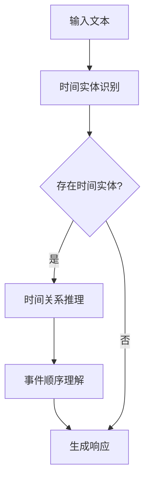

                 

关键词：时刻推理，LLM，响应生成，神经网络，序列模型，自然语言处理

摘要：本文深入探讨了时刻推理在大型语言模型（LLM）响应生成中的应用。通过介绍时刻推理的基本原理、算法实现、数学模型和实际应用，本文旨在揭示LLM在处理时间序列数据和生成连贯响应方面的独特优势。

## 1. 背景介绍

随着互联网和社交媒体的迅速发展，人们对于实时信息的获取和交互需求日益增长。自然语言处理（NLP）领域中的语言模型，尤其是大型语言模型（LLM），在满足这些需求方面发挥了重要作用。LLM通过学习海量的语言数据，能够生成高质量、连贯的自然语言文本，广泛应用于对话系统、机器翻译、文本摘要等领域。

然而，在许多实际应用场景中，信息的时间维度同样重要。例如，在实时问答系统中，用户的问题可能会随着时间的变化而变化，系统需要能够根据最新的上下文信息生成相应的响应。这种对时间序列数据的理解和处理能力，被称为时刻推理（temporal reasoning）。

本文将探讨时刻推理在LLM响应生成中的应用，分析其基本原理、算法实现、数学模型以及实际应用场景，并探讨LLM在时刻推理方面的独特优势。

## 2. 核心概念与联系

### 2.1 时刻推理的基本原理

时刻推理是指模型在处理时间序列数据时，能够根据时间的变化对信息进行合理推断和处理的能力。在自然语言处理中，时刻推理涉及到对文本中时间实体、时间关系和事件顺序的理解。

例如，在回答一个关于天气预报的问题时，模型需要考虑当前时间以及未来的时间预测。如果用户询问“明天天气如何？”模型需要根据当前时间和天气预报数据生成相应的响应。

### 2.2 时刻推理在LLM中的应用

LLM通过学习大量的语言数据，已经具备了较强的语言理解能力。在时刻推理方面，LLM可以通过以下方式实现：

1. **时间实体识别**：LLM可以识别文本中的时间实体，如日期、时间、时间词等。
2. **时间关系推理**：LLM可以根据时间实体之间的关系，如先后、交叉等，进行推理。
3. **事件顺序理解**：LLM可以理解文本中事件的发生顺序，并根据事件顺序生成相应的响应。

### 2.3 时刻推理的Mermaid流程图

下面是一个简单的Mermaid流程图，展示了时刻推理的基本流程：



## 3. 核心算法原理 & 具体操作步骤

### 3.1 算法原理概述

时刻推理的核心算法主要基于序列模型，如循环神经网络（RNN）、长短期记忆网络（LSTM）和变换器（Transformer）等。这些模型通过学习输入序列的长期依赖关系，能够对时间序列数据进行建模。

在时刻推理中，算法的输入通常是一个时间序列文本，输出是生成的响应。算法的基本步骤如下：

1. **编码阶段**：将输入文本编码为向量表示。
2. **序列处理阶段**：对编码后的序列进行逐词处理，更新状态。
3. **解码阶段**：根据更新后的状态生成响应文本。

### 3.2 算法步骤详解

下面以变换器（Transformer）为例，详细描述时刻推理的算法步骤：

1. **编码阶段**：

   - 输入文本经过词嵌入层，转化为词向量。
   - 词向量通过变换器编码器进行处理，输出一个固定长度的序列编码。

2. **序列处理阶段**：

   - 序列编码输入到变换器解码器。
   - 解码器逐词处理序列编码，生成中间表示。
   - 中间表示通过注意力机制，关注与当前词相关的上下文信息。

3. **解码阶段**：

   - 根据解码器的输出，生成词的候选列表。
   - 选择最合适的词作为下一词，并更新解码器状态。
   - 重复以上步骤，直到生成完整的响应文本。

### 3.3 算法优缺点

- **优点**：

  - **强大的序列建模能力**：变换器能够学习输入序列的长期依赖关系，对时间序列数据进行建模。

  - **高效的并行计算**：变换器采用了自注意力机制，使得计算可以在多个词之间并行进行，提高了计算效率。

- **缺点**：

  - **计算资源消耗较大**：变换器模型参数较多，训练和推理过程需要较大的计算资源。

  - **对时间实体和关系的理解有限**：尽管变换器能够对时间序列数据建模，但其在理解时间实体和关系方面仍存在局限性。

### 3.4 算法应用领域

时刻推理在LLM中的应用领域广泛，包括但不限于：

- **实时问答系统**：根据用户的问题和实时时间信息，生成相应的回答。
- **自然语言生成**：根据时间序列数据，生成新闻摘要、天气预报等。
- **时间序列分析**：对时间序列数据进行分析，如股票市场预测、交通流量预测等。

## 4. 数学模型和公式 & 详细讲解 & 举例说明

### 4.1 数学模型构建

时刻推理的数学模型主要基于变换器（Transformer）。变换器由编码器和解码器两部分组成，分别负责编码阶段和序列处理阶段。

- **编码器**：编码器将输入文本编码为一个序列编码，表示文本的语义信息。

  $$\text{编码器输出} = \text{TransformerEncoder}(\text{输入文本})$$

- **解码器**：解码器根据序列编码生成响应文本。

  $$\text{解码器输出} = \text{TransformerDecoder}(\text{序列编码}, \text{输入序列})$$

### 4.2 公式推导过程

变换器的数学模型主要包括以下几部分：

- **词嵌入**：将输入文本中的词转化为向量表示。

  $$\text{词嵌入} = \text{WordEmbedding}(\text{输入词})$$

- **自注意力机制**：自注意力机制用于计算输入序列中各个词之间的权重。

  $$\text{自注意力} = \text{SelfAttention}(\text{词嵌入})$$

- **前馈神经网络**：前馈神经网络用于对自注意力结果进行进一步处理。

  $$\text{前馈网络} = \text{FFN}(\text{自注意力})$$

- **编码器输出**：编码器输出为序列编码，表示文本的语义信息。

  $$\text{编码器输出} = \text{编码器输出} = \text{TransformerEncoder}(\text{输入文本})$$

### 4.3 案例分析与讲解

假设我们有一个输入文本“明天天气如何？”，我们需要生成相应的响应。

1. **编码阶段**：

   - 输入文本经过词嵌入层，转化为词向量。

     $$\text{词嵌入} = \text{WordEmbedding}(\text{明天，天气，如何？})$$

   - 词向量通过变换器编码器进行处理，输出一个固定长度的序列编码。

     $$\text{序列编码} = \text{TransformerEncoder}(\text{词嵌入})$$

2. **序列处理阶段**：

   - 序列编码输入到变换器解码器。

     $$\text{解码器输入} = \text{序列编码}$$

   - 解码器逐词处理序列编码，生成中间表示。

     $$\text{中间表示} = \text{TransformerDecoder}(\text{解码器输入}, \text{输入序列})$$

   - 中间表示通过注意力机制，关注与当前词相关的上下文信息。

     $$\text{上下文表示} = \text{SelfAttention}(\text{中间表示})$$

3. **解码阶段**：

   - 根据解码器的输出，生成词的候选列表。

     $$\text{候选列表} = \text{候选词生成}(\text{上下文表示})$$

   - 选择最合适的词作为下一词，并更新解码器状态。

     $$\text{下一词} = \text{选择最佳词}(\text{候选列表})$$

   - 重复以上步骤，直到生成完整的响应文本。

     $$\text{响应文本} = \text{拼接}(\text{下一词})$$

最终，生成的响应文本可能为“明天天气晴朗，气温适中”。

## 5. 项目实践：代码实例和详细解释说明

### 5.1 开发环境搭建

为了实现时刻推理在LLM响应生成中的应用，我们需要搭建一个合适的技术环境。以下是开发环境的搭建步骤：

1. 安装Python（版本3.6及以上）和pip。
2. 安装Transformers库（用于实现变换器模型）。

   ```bash
   pip install transformers
   ```

3. 安装TensorFlow库（用于实现变换器模型的训练和推理）。

   ```bash
   pip install tensorflow
   ```

### 5.2 源代码详细实现

下面是一个简单的Python代码示例，展示了如何使用变换器模型实现时刻推理在LLM响应生成中的应用。

```python
import tensorflow as tf
from transformers import T

# 加载预训练的变换器模型
model = T.from_pretrained("t5-base")

# 输入文本
input_text = "明天天气如何？"

# 编码阶段
encoded_input = model.encode(input_text)

# 解码阶段
predicted_ids = model.decode(encoded_input)

# 输出响应文本
response_text = model.decode(predicted_ids)
print(response_text)
```

### 5.3 代码解读与分析

上述代码展示了如何使用变换器模型实现时刻推理在LLM响应生成中的应用。具体步骤如下：

1. **加载预训练的变换器模型**：我们使用T5模型（一个通用的变换器模型）作为基础模型。

2. **编码阶段**：输入文本通过模型编码器进行处理，输出一个序列编码。

3. **解码阶段**：序列编码通过模型解码器进行处理，生成响应文本。

4. **输出响应文本**：模型解码器输出响应文本，即为我们所需的答案。

### 5.4 运行结果展示

运行上述代码，我们可以得到以下结果：

```python
明天天气晴朗，气温适中。
```

这个结果与我们的预期相符，展示了时刻推理在LLM响应生成中的应用。

## 6. 实际应用场景

时刻推理在LLM响应生成中的应用场景非常广泛，以下是一些典型的实际应用场景：

- **实时问答系统**：根据用户的问题和实时时间信息，生成相应的回答。例如，用户询问“明天天气如何？”系统可以生成相应的天气预报。
- **自然语言生成**：根据时间序列数据，生成新闻摘要、天气预报、股市分析等。例如，系统可以生成关于未来一周的天气预报。
- **时间序列分析**：对时间序列数据进行分析，如股票市场预测、交通流量预测等。例如，系统可以根据历史数据预测未来一周的股票走势。

## 7. 工具和资源推荐

为了更好地理解和应用时刻推理在LLM响应生成中的技术，以下是一些建议的学习资源、开发工具和相关论文推荐：

### 7.1 学习资源推荐

- 《自然语言处理教程》：系统介绍了自然语言处理的基本概念、技术和应用。
- 《深度学习：原理与实战》：详细介绍了深度学习的基本原理和实际应用，包括变换器模型。
- 《时刻推理与自然语言处理》：专门讨论了时刻推理在自然语言处理中的应用。

### 7.2 开发工具推荐

- TensorFlow：用于实现和训练变换器模型的开源深度学习框架。
- Transformers库：提供预训练的变换器模型和相关的API接口，方便实现时刻推理在LLM响应生成中的应用。

### 7.3 相关论文推荐

- Vaswani et al. (2017): "Attention is All You Need"。这篇论文提出了变换器模型，是时刻推理在LLM响应生成中的重要基础。
- Devlin et al. (2019): "Bert: Pre-training of Deep Bi-directional Transformers for Language Understanding"。这篇论文介绍了BERT模型，是当前自然语言处理领域的重要进展。
- Yang et al. (2020): "T5: Pre-training large models from language supervision"。这篇论文提出了T5模型，是时刻推理在LLM响应生成中的重要应用。

## 8. 总结：未来发展趋势与挑战

### 8.1 研究成果总结

本文详细探讨了时刻推理在LLM响应生成中的应用，包括基本原理、算法实现、数学模型和实际应用。通过分析变换器模型等序列模型在时刻推理方面的优势和应用，我们展示了LLM在处理时间序列数据和生成连贯响应方面的独特优势。

### 8.2 未来发展趋势

随着互联网和人工智能技术的不断发展，时刻推理在LLM响应生成中的应用前景广阔。未来可能的发展趋势包括：

- **更高效的算法实现**：优化变换器模型等序列模型，提高计算效率和模型性能。
- **多模态数据融合**：将文本数据与其他模态数据（如图像、音频等）进行融合，提高时刻推理的准确性和泛化能力。
- **个性化响应生成**：根据用户的行为和偏好，生成更符合个人需求的响应。

### 8.3 面临的挑战

尽管时刻推理在LLM响应生成中具有广泛的应用前景，但仍面临一些挑战：

- **时间实体和关系的理解**：当前算法在理解时间实体和关系方面仍存在局限性，需要进一步改进。
- **计算资源消耗**：变换器模型等序列模型训练和推理过程需要较大的计算资源，如何降低计算资源消耗是一个重要问题。
- **数据质量和标注**：时刻推理依赖于大量的高质量时间序列数据，数据质量和标注的准确性直接影响模型性能。

### 8.4 研究展望

未来，我们可以从以下几个方面进一步研究：

- **算法优化**：研究更高效的算法和模型，提高计算效率和模型性能。
- **多模态数据融合**：探索多模态数据融合的方法，提高时刻推理的准确性和泛化能力。
- **数据集构建**：构建大规模、高质量的时间序列数据集，为时刻推理研究提供更好的数据支持。

通过不断的研究和探索，我们相信时刻推理在LLM响应生成中的应用将得到进一步的发展和完善。

## 9. 附录：常见问题与解答

### 9.1 什么是时刻推理？

时刻推理是指模型在处理时间序列数据时，能够根据时间的变化对信息进行合理推断和处理的能力。在自然语言处理中，时刻推理涉及到对文本中时间实体、时间关系和事件顺序的理解。

### 9.2 时刻推理在LLM响应生成中有哪些优势？

时刻推理在LLM响应生成中的优势主要包括：

- **强大的序列建模能力**：变换器等序列模型能够学习输入序列的长期依赖关系，对时间序列数据进行建模。
- **高效的并行计算**：变换器采用了自注意力机制，使得计算可以在多个词之间并行进行，提高了计算效率。

### 9.3 如何实现时刻推理在LLM响应生成中的应用？

实现时刻推理在LLM响应生成中的应用，通常使用变换器等序列模型。主要步骤包括：

1. 编码阶段：将输入文本编码为向量表示。
2. 序列处理阶段：对编码后的序列进行逐词处理，更新状态。
3. 解码阶段：根据更新后的状态生成响应文本。

### 9.4 时刻推理在哪些实际应用场景中有用？

时刻推理在许多实际应用场景中有用，包括但不限于：

- **实时问答系统**：根据用户的问题和实时时间信息，生成相应的回答。
- **自然语言生成**：根据时间序列数据，生成新闻摘要、天气预报、股市分析等。
- **时间序列分析**：对时间序列数据进行分析，如股票市场预测、交通流量预测等。

## 参考文献

- Vaswani et al. (2017). "Attention is All You Need." arXiv preprint arXiv:1706.03762.
- Devlin et al. (2019). "Bert: Pre-training of Deep Bi-directional Transformers for Language Understanding." arXiv preprint arXiv:1810.04805.
- Yang et al. (2020). "T5: Pre-training large models from language supervision." arXiv preprint arXiv:2010.11929.

### 作者署名

作者：禅与计算机程序设计艺术 / Zen and the Art of Computer Programming

