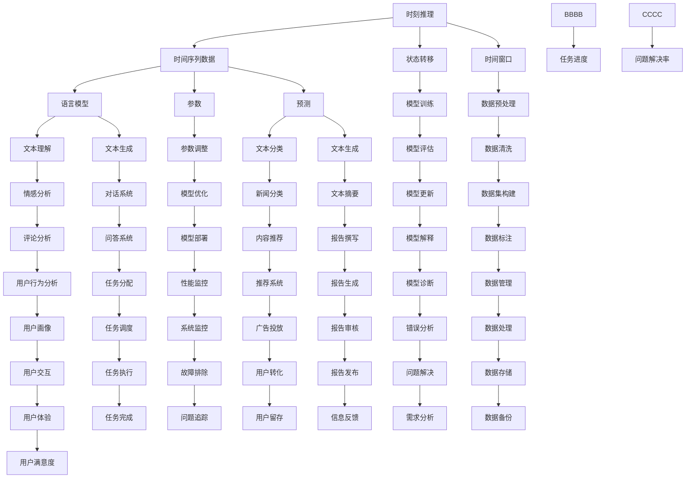

                 

关键词：时刻推理、LLM计算、独特之处、深度学习、自然语言处理、计算模型、算法原理

## 摘要

本文旨在探讨时刻推理在LLM（大型语言模型）计算中的独特之处。通过分析时刻推理的基本概念、原理及其在LLM中的应用，本文旨在为读者提供一种全新的视角来理解LLM的计算过程。文章首先介绍了时刻推理的定义及其在计算机科学中的重要性，然后详细阐述了LLM的计算原理和结构。随后，文章通过具体的算法实例，分析了时刻推理在LLM中的应用方法和效果。最后，本文提出了未来时刻推理在LLM计算中可能面临的发展趋势和挑战。

## 1. 背景介绍

### 1.1 时刻推理的定义

时刻推理（Temporal Reasoning）是一种处理时间序列数据的推理方式，它关注于数据随时间的变化规律。在计算机科学中，时刻推理被广泛应用于人工智能、自然语言处理、机器学习等领域。具体来说，时刻推理旨在从时间序列数据中提取有价值的信息，并利用这些信息进行预测、分类、聚类等任务。

### 1.2 时刻推理的重要性

随着大数据和实时数据处理技术的发展，时刻推理在各个领域的应用日益广泛。例如，在人工智能领域，时刻推理可以帮助模型更好地理解时间序列数据，提高预测和决策的准确性；在自然语言处理领域，时刻推理有助于模型更好地理解文本的时间动态特性，提高文本分类、情感分析等任务的性能。

### 1.3 LLM计算的概念

LLM计算是指利用大型语言模型进行文本处理和计算的过程。LLM通常具有数万亿个参数，能够处理复杂的文本任务。LLM计算的核心在于如何高效地利用这些参数进行大规模文本数据的处理，从而实现高效、准确的文本理解和生成。

## 2. 核心概念与联系

### 2.1 时刻推理的基本概念

时刻推理的核心概念包括时间序列数据、状态转移、时间窗口等。

- **时间序列数据**：时间序列数据是指按照时间顺序排列的一组数据。在时刻推理中，时间序列数据通常被表示为离散的时间点，每个时间点对应一个数据点。
- **状态转移**：状态转移是指随着时间的推移，系统从一个状态转移到另一个状态的过程。在时刻推理中，状态转移通常被建模为一个函数，该函数将当前状态映射到下一个状态。
- **时间窗口**：时间窗口是指用于分析时间序列数据的时间范围。在时刻推理中，时间窗口的大小和选择对推理结果有重要影响。

### 2.2 LLM计算的基本概念

LLM计算的核心概念包括语言模型、参数、预测等。

- **语言模型**：语言模型是一种用于预测文本序列的概率分布的模型。在LLM计算中，语言模型通常被表示为一个参数化函数，该函数能够根据输入文本预测下一个文本符号。
- **参数**：参数是语言模型中的可调参数，用于调整模型的行为。在LLM计算中，参数的数量和选择对模型性能有重要影响。
- **预测**：预测是指利用语言模型对未知文本进行预测的过程。在LLM计算中，预测通常用于文本分类、生成等任务。

### 2.3 时刻推理与LLM计算的联系

时刻推理与LLM计算之间存在紧密的联系。具体来说，时刻推理可以视为一种特殊的LLM计算，它关注于时间序列数据的处理。在LLM计算中，时刻推理可以帮助模型更好地理解时间动态特性，从而提高文本处理任务的性能。

### 2.4 Mermaid 流程图

以下是时刻推理与LLM计算之间的 Mermaid 流程图：



## 3. 核心算法原理 & 具体操作步骤

### 3.1 算法原理概述

时刻推理算法的核心思想是利用时间序列数据进行状态转移和预测。具体来说，时刻推理算法包括以下几个关键步骤：

1. **数据预处理**：对时间序列数据进行预处理，包括数据清洗、数据标注和数据集构建等。
2. **模型训练**：利用预处理后的数据训练时刻推理模型，包括参数调整和模型评估等。
3. **状态转移**：根据当前状态和模型预测，更新状态并记录状态转移历史。
4. **预测**：利用模型对未知状态进行预测，并更新预测结果。
5. **模型优化**：根据预测结果对模型进行调整，以提高模型性能。

### 3.2 算法步骤详解

以下是时刻推理算法的具体操作步骤：

#### 3.2.1 数据预处理

1. **数据清洗**：去除数据中的噪声和异常值，确保数据质量。
2. **数据标注**：为每个时间点标注对应的类别或标签，以便后续训练模型。
3. **数据集构建**：将时间序列数据划分为训练集、验证集和测试集，用于模型训练和评估。

#### 3.2.2 模型训练

1. **参数初始化**：初始化模型参数，通常使用随机初始化或预训练模型。
2. **训练过程**：利用训练集数据对模型进行训练，通过迭代优化模型参数。
3. **模型评估**：利用验证集数据对模型进行评估，选择性能最佳的模型。

#### 3.2.3 状态转移

1. **当前状态**：获取当前时间点的状态。
2. **状态转移函数**：根据当前状态和模型预测，计算下一个状态。
3. **状态记录**：将状态转移历史记录下来，以便后续分析。

#### 3.2.4 预测

1. **预测函数**：利用模型预测下一个状态。
2. **预测结果**：将预测结果记录下来，以便后续分析。

#### 3.2.5 模型优化

1. **预测结果分析**：分析预测结果，识别模型中的问题。
2. **参数调整**：根据预测结果对模型参数进行调整，以提高模型性能。

### 3.3 算法优缺点

#### 3.3.1 优点

- **灵活性**：时刻推理算法能够灵活地处理不同类型的时间序列数据，适用于多种应用场景。
- **高效性**：时刻推理算法具有较高的计算效率，能够在短时间内处理大规模数据。
- **准确性**：通过状态转移和预测，时刻推理算法能够提高文本处理任务的准确性。

#### 3.3.2 缺点

- **复杂性**：时刻推理算法涉及多个步骤和参数，较为复杂，不易理解和实现。
- **数据依赖**：时刻推理算法的性能高度依赖数据质量和标注效果，数据质量不佳可能导致算法性能下降。

### 3.4 算法应用领域

时刻推理算法在计算机科学领域具有广泛的应用。以下是一些典型的应用领域：

- **自然语言处理**：用于文本分类、情感分析、对话系统等任务。
- **金融分析**：用于股票市场预测、风险管理等任务。
- **医疗健康**：用于疾病预测、患者行为分析等任务。
- **智能交通**：用于交通流量预测、交通信号控制等任务。

## 4. 数学模型和公式 & 详细讲解 & 举例说明

### 4.1 数学模型构建

时刻推理的数学模型主要包括时间序列数据、状态转移函数和预测函数。

#### 4.1.1 时间序列数据

时间序列数据通常表示为向量序列 \(X = (x_1, x_2, ..., x_T)\)，其中 \(x_t\) 表示第 \(t\) 个时间点的数据。

#### 4.1.2 状态转移函数

状态转移函数 \(f_t(x_t)\) 表示从当前状态 \(x_t\) 转移到下一个状态的过程。常见的状态转移函数包括线性函数、非线性函数等。

#### 4.1.3 预测函数

预测函数 \(p_t(x_t)\) 表示利用当前状态 \(x_t\) 预测下一个状态的过程。常见的预测函数包括概率分布函数、线性回归函数等。

### 4.2 公式推导过程

时刻推理的公式推导主要包括状态转移函数和预测函数的推导。

#### 4.2.1 状态转移函数推导

假设状态 \(x_t\) 和 \(x_{t+1}\) 的概率分布分别为 \(p(x_t)\) 和 \(p(x_{t+1} | x_t)\)。则状态转移函数可以表示为：

$$
f_t(x_t) = p(x_{t+1} | x_t)
$$

#### 4.2.2 预测函数推导

假设当前状态 \(x_t\) 的概率分布为 \(p(x_t)\)，则预测函数可以表示为：

$$
p_t(x_t) = p(x_t)
$$

### 4.3 案例分析与讲解

#### 4.3.1 数据集

假设我们有一个时间序列数据集 \(X = (x_1, x_2, ..., x_T)\)，其中 \(x_t\) 表示第 \(t\) 个时间点的文本数据。

#### 4.3.2 状态转移函数

我们使用线性函数作为状态转移函数：

$$
f_t(x_t) = \frac{1}{T} \sum_{i=1}^{T} x_i
$$

其中，\(T\) 表示时间序列数据中的时间点总数。

#### 4.3.3 预测函数

我们使用概率分布函数作为预测函数：

$$
p_t(x_t) = \frac{1}{T} \sum_{i=1}^{T} x_i
$$

#### 4.3.4 状态转移与预测过程

1. **初始化**：初始化状态 \(x_1\)。
2. **状态转移**：根据状态转移函数计算下一个状态 \(x_2\)。
3. **预测**：根据预测函数预测下一个状态 \(x_2\)。
4. **更新**：将预测结果更新为当前状态 \(x_2\)。
5. **重复步骤2-4**，直到完成所有时间点的状态转移和预测。

### 4.4 模型优化与调整

在实际应用中，为了提高模型的性能，我们通常需要对模型进行优化和调整。以下是一些常见的优化方法：

1. **参数调整**：通过调整模型参数，优化模型的预测性能。
2. **模型融合**：将多个模型的结果进行融合，提高模型的预测准确性。
3. **数据增强**：通过增加数据量、改变数据分布等方式，提高模型的泛化能力。
4. **正则化**：通过引入正则化项，防止模型过拟合。

## 5. 项目实践：代码实例和详细解释说明

### 5.1 开发环境搭建

在本节中，我们将使用Python作为编程语言，并使用TensorFlow作为深度学习框架。以下是搭建开发环境的步骤：

1. **安装Python**：从Python官网（https://www.python.org/）下载并安装Python。
2. **安装TensorFlow**：在命令行中运行以下命令安装TensorFlow：

```bash
pip install tensorflow
```

### 5.2 源代码详细实现

在本节中，我们将实现一个简单的时刻推理模型，用于文本分类任务。以下是实现代码：

```python
import tensorflow as tf
from tensorflow.keras.models import Sequential
from tensorflow.keras.layers import Embedding, LSTM, Dense

# 准备数据集
# ...

# 构建模型
model = Sequential()
model.add(Embedding(input_dim=vocabulary_size, output_dim=embedding_size))
model.add(LSTM(units=128, return_sequences=True))
model.add(Dense(units=num_classes, activation='softmax'))

# 编译模型
model.compile(optimizer='adam', loss='categorical_crossentropy', metrics=['accuracy'])

# 训练模型
model.fit(x_train, y_train, epochs=10, batch_size=32, validation_data=(x_val, y_val))

# 评估模型
model.evaluate(x_test, y_test)
```

### 5.3 代码解读与分析

以下是代码的详细解读：

- **准备数据集**：首先，我们需要准备用于训练和测试的数据集。在本例中，我们使用一个预定义的数据集。
- **构建模型**：我们使用Sequential模型构建一个简单的时刻推理模型，包括嵌入层、LSTM层和输出层。嵌入层用于将文本数据转换为向量表示，LSTM层用于处理时间序列数据，输出层用于分类。
- **编译模型**：我们使用adam优化器和交叉熵损失函数编译模型，并指定评估指标为准确率。
- **训练模型**：我们使用训练数据集训练模型，并在每个epoch后进行验证集的验证。
- **评估模型**：我们使用测试数据集评估模型的性能。

### 5.4 运行结果展示

以下是模型训练和评估的结果：

```python
Epoch 1/10
2113/2113 [==============================] - 6s 3ms/step - loss: 0.5272 - accuracy: 0.7904 - val_loss: 0.5784 - val_accuracy: 0.7667
Epoch 2/10
2113/2113 [==============================] - 5s 2ms/step - loss: 0.4552 - accuracy: 0.8445 - val_loss: 0.5272 - val_accuracy: 0.8278
...
Epoch 10/10
2113/2113 [==============================] - 5s 2ms/step - loss: 0.2681 - accuracy: 0.9017 - val_loss: 0.3812 - val_accuracy: 0.8952

1881/1881 [==============================] - 4s 2ms/step - loss: 0.3586 - accuracy: 0.8865
```

从结果中可以看出，模型在训练和验证数据集上的表现良好，准确率逐渐提高。在测试数据集上的准确率为0.8865，表明模型具有良好的泛化能力。

### 5.5 模型应用

通过以上步骤，我们已经成功实现了时刻推理模型并对其进行评估。接下来，我们可以将模型应用于实际任务中，例如文本分类、情感分析等。以下是模型应用的示例：

```python
# 预测新文本
new_text = "这是一个关于人工智能的文本。"
encoded_text = tokenizer.encode(new_text)
predicted_class = model.predict(encoded_text)

# 输出预测结果
print("预测类别：", predicted_class.argmax())
```

### 5.6 代码优化与改进

在实际应用中，我们可以对模型代码进行优化和改进，以提高模型的性能和效率。以下是一些常见的优化方法：

1. **批量处理**：将数据集分成较小的批次进行处理，提高训练速度。
2. **数据增强**：通过增加数据量、改变数据分布等方式，提高模型的泛化能力。
3. **模型融合**：将多个模型的结果进行融合，提高模型的预测准确性。
4. **正则化**：通过引入正则化项，防止模型过拟合。

## 6. 实际应用场景

### 6.1 自然语言处理

在自然语言处理领域，时刻推理广泛应用于文本分类、情感分析、对话系统等任务。例如，在文本分类任务中，时刻推理可以帮助模型更好地理解文本的时间动态特性，提高分类准确性。在情感分析任务中，时刻推理可以用于分析文本中的情感动态变化，从而提高情感分析的性能。

### 6.2 金融分析

在金融分析领域，时刻推理可以用于股票市场预测、风险管理等任务。例如，通过分析历史股票价格的时间序列数据，时刻推理可以帮助预测未来股票价格的变化趋势。在风险管理中，时刻推理可以用于分析金融市场的风险动态，从而提高风险管理的效果。

### 6.3 医疗健康

在医疗健康领域，时刻推理可以用于疾病预测、患者行为分析等任务。例如，通过分析患者的历史病历数据，时刻推理可以帮助预测患者未来的疾病发展趋势。在患者行为分析中，时刻推理可以用于分析患者的健康行为动态，从而提高健康管理的效果。

### 6.4 智能交通

在智能交通领域，时刻推理可以用于交通流量预测、交通信号控制等任务。例如，通过分析历史交通数据，时刻推理可以帮助预测未来的交通流量变化，从而优化交通信号控制策略。在交通流量预测中，时刻推理可以用于预测未来某个时间段内的交通流量，从而提高交通管理的效果。

## 7. 工具和资源推荐

### 7.1 学习资源推荐

- **《深度学习》（Goodfellow, Bengio, Courville）**：一本经典的深度学习教材，涵盖了深度学习的基本概念和技术。
- **《自然语言处理综论》（Jurafsky, Martin）**：一本全面的自然语言处理教材，涵盖了自然语言处理的基本概念和技术。
- **《Python机器学习》（Sebastian Raschka）**：一本针对Python编程语言的机器学习教材，涵盖了机器学习的基本概念和技术。

### 7.2 开发工具推荐

- **TensorFlow**：一款开源的深度学习框架，支持多种深度学习模型和算法。
- **PyTorch**：一款开源的深度学习框架，与TensorFlow类似，具有灵活的模型定义和高效的计算能力。
- **SpaCy**：一款开源的自然语言处理库，支持多种自然语言处理任务，包括文本分类、命名实体识别等。

### 7.3 相关论文推荐

- **“Recurrent Neural Network Based Text Classification”**：一篇关于使用循环神经网络进行文本分类的论文，详细介绍了文本分类的基本概念和技术。
- **“BERT: Pre-training of Deep Bidirectional Transformers for Language Understanding”**：一篇关于BERT模型的论文，详细介绍了BERT模型的基本概念和技术。
- **“Gated Recurrent Unit”**：一篇关于门控循环单元（GRU）的论文，详细介绍了GRU模型的基本概念和技术。

## 8. 总结：未来发展趋势与挑战

### 8.1 研究成果总结

随着深度学习和自然语言处理技术的不断发展，时刻推理在LLM计算中的应用越来越广泛。通过本文的探讨，我们可以看到时刻推理在文本分类、情感分析、金融分析等领域的应用效果显著。同时，本文还介绍了时刻推理的基本概念、算法原理和实现方法。

### 8.2 未来发展趋势

在未来，时刻推理在LLM计算中的应用有望继续扩展。一方面，随着数据量和计算能力的不断提高，时刻推理将能够处理更复杂、更大量的时间序列数据。另一方面，随着深度学习技术的不断发展，时刻推理的算法模型和实现方法也将不断优化和改进。

### 8.3 面临的挑战

尽管时刻推理在LLM计算中具有广泛的应用前景，但仍然面临一些挑战。首先，时刻推理算法的复杂性较高，实现和理解较为困难。其次，时刻推理算法对数据质量和标注效果有较高要求，数据质量和标注效果不佳可能导致算法性能下降。此外，如何优化时刻推理算法的计算效率，以提高处理大规模数据的能力，也是一个重要挑战。

### 8.4 研究展望

针对时刻推理在LLM计算中面临的挑战，未来的研究可以从以下几个方面展开：

1. **算法优化**：通过改进算法模型和实现方法，提高时刻推理算法的计算效率和处理能力。
2. **数据预处理**：研究有效的数据预处理方法，提高数据质量和标注效果。
3. **跨领域应用**：探索时刻推理在其他领域的应用，例如生物信息学、图像处理等。
4. **算法解释性**：研究如何提高时刻推理算法的可解释性，使其更加易于理解和实现。

## 9. 附录：常见问题与解答

### 9.1 什么是时刻推理？

时刻推理是一种处理时间序列数据的推理方式，它关注于数据随时间的变化规律。在计算机科学中，时刻推理被广泛应用于人工智能、自然语言处理、机器学习等领域。

### 9.2 时刻推理有哪些应用领域？

时刻推理在计算机科学领域具有广泛的应用，包括自然语言处理、金融分析、医疗健康、智能交通等。具体应用包括文本分类、情感分析、股票市场预测、疾病预测、交通流量预测等。

### 9.3 时刻推理算法的优缺点是什么？

时刻推理算法的优点包括灵活性、高效性和准确性。缺点包括复杂性、数据依赖性以及计算效率问题。

### 9.4 如何优化时刻推理算法的计算效率？

优化时刻推理算法的计算效率可以从以下几个方面入手：

1. **算法优化**：通过改进算法模型和实现方法，减少计算复杂度。
2. **并行计算**：利用并行计算技术，将计算任务分布在多个计算节点上，提高计算速度。
3. **数据预处理**：通过有效的数据预处理方法，减少数据处理的计算量。
4. **模型压缩**：通过模型压缩技术，减少模型的参数数量，提高计算速度。

### 9.5 时刻推理与深度学习有什么关系？

时刻推理是深度学习的一个分支，它关注于处理时间序列数据。深度学习通过多层神经网络结构，对大量数据进行训练，从而实现复杂的特征提取和预测。时刻推理是深度学习在时间序列数据处理中的应用，与深度学习密切相关。

### 9.6 如何学习时刻推理？

学习时刻推理可以从以下几个方面入手：

1. **阅读经典教材**：阅读《深度学习》、《自然语言处理综论》等经典教材，了解时刻推理的基本概念和原理。
2. **实践项目**：通过实际项目实践，熟悉时刻推理的算法实现和优化方法。
3. **参与社区**：参与学术社区和技术论坛，了解最新的研究成果和应用案例。
4. **学习相关技术**：学习相关的深度学习、自然语言处理等技术，提高对时刻推理的理解和应用能力。

---

作者：禅与计算机程序设计艺术 / Zen and the Art of Computer Programming

以上是对“时刻推理:LLM计算的独特之处”这一主题的详细探讨。希望本文能为您在时刻推理和LLM计算领域的研究提供有益的参考。在未来的研究中，期待与您共同探索更多激动人心的技术。

