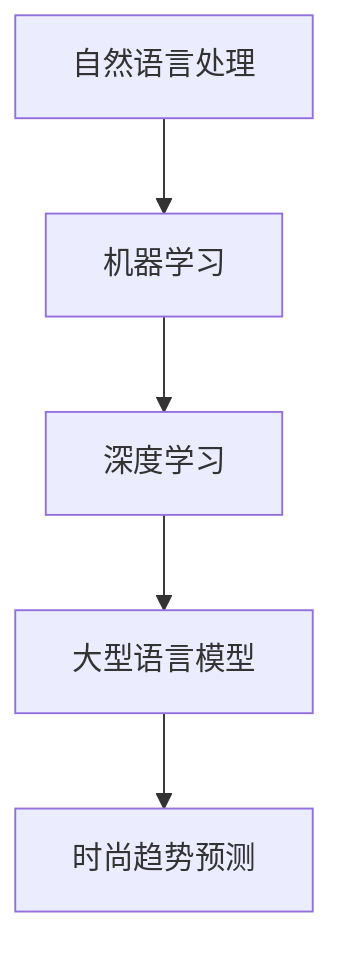

                 

关键词：时尚趋势、LLM、人工智能、潮流预测、数据挖掘、机器学习、深度学习、时尚行业、数据驱动设计、个性化推荐、消费者行为分析。

> 摘要：本文探讨了大型语言模型（LLM）在时尚趋势预测中的重要作用。通过分析时尚数据的深度挖掘和机器学习算法的应用，本文揭示了LLM如何利用其强大的自然语言处理能力，为时尚行业提供精准的潮流预测，从而定义未来的时尚潮流。本文还展望了LLM在时尚领域未来的应用前景，以及可能面临的挑战。

## 1. 背景介绍

时尚行业是一个充满活力和变化的领域，其趋势预测对于品牌、设计师和零售商来说至关重要。然而，传统的时尚趋势预测方法往往依赖于人工经验和专家判断，这不仅耗时且容易受到个人偏见的影响。随着大数据和人工智能技术的发展，特别是在自然语言处理（NLP）领域，一种新的预测方法——基于大型语言模型（LLM）的趋势预测，逐渐崭露头角。

### 1.1 时尚行业的趋势预测现状

目前，时尚行业的趋势预测主要依赖于以下几个方面：

- **市场调研**：通过问卷调查、访谈和焦点小组等方式收集消费者偏好和市场趋势。
- **历史数据分析**：分析过去几年或几十年的时尚趋势，从中寻找规律和模式。
- **社交媒体分析**：通过监测社交媒体平台上的讨论和趋势话题，了解消费者的实时偏好。

这些方法在一定程度上能够提供趋势预测，但其准确性有限，且难以应对快速变化的市场环境。

### 1.2 大数据和人工智能的应用

大数据和人工智能技术的发展为时尚趋势预测带来了新的可能性。特别是自然语言处理（NLP）领域，LLM的出现使得从大量文本数据中提取有价值的信息成为可能。LLM通过训练大规模的文本语料库，可以学习到语言的模式和结构，从而在时尚趋势预测中发挥重要作用。

## 2. 核心概念与联系

为了深入理解LLM在时尚趋势预测中的应用，我们需要了解一些核心概念，包括自然语言处理、机器学习、深度学习等。

### 2.1 自然语言处理（NLP）

自然语言处理是人工智能领域的一个重要分支，旨在使计算机能够理解、生成和处理人类语言。NLP的核心任务包括文本分类、情感分析、命名实体识别等。

### 2.2 机器学习（ML）

机器学习是人工智能的一个子领域，通过训练模型来从数据中自动学习规律和模式。机器学习可以分为监督学习、无监督学习和半监督学习。

### 2.3 深度学习（DL）

深度学习是机器学习的一个子领域，它使用多层神经网络来模拟人类大脑的神经元结构，进行特征学习和模式识别。深度学习在图像识别、语音识别和自然语言处理等领域取得了显著的成果。

### 2.4 大型语言模型（LLM）

LLM是一种基于深度学习的自然语言处理模型，其特点是可以处理大规模的文本数据，并从中提取有价值的信息。LLM的应用领域非常广泛，包括文本生成、机器翻译、问答系统等。

### 2.5 Mermaid 流程图



## 3. 核心算法原理 & 具体操作步骤

### 3.1 算法原理概述

LLM在时尚趋势预测中的核心原理是利用其强大的自然语言处理能力，从海量的文本数据中提取有关时尚趋势的信息。具体来说，LLM的工作流程可以分为以下几个步骤：

1. **数据收集**：收集与时尚相关的文本数据，包括时尚杂志、博客、社交媒体帖子等。
2. **数据预处理**：对收集的文本数据进行清洗和格式化，去除噪声和不相关的内容。
3. **文本编码**：将文本数据转换为计算机可以处理的数字形式，通常使用词嵌入技术。
4. **模型训练**：使用大量的文本数据进行模型训练，使LLM学会从文本中提取有价值的信息。
5. **趋势预测**：利用训练好的LLM模型，对新的文本数据进行趋势预测。

### 3.2 算法步骤详解

1. **数据收集**：

   数据收集是LLM在时尚趋势预测中的第一步。收集的数据来源可以是各种时尚媒体、博客、社交媒体平台等。为了确保数据的多样性和代表性，可以采用多种数据源。

2. **数据预处理**：

   数据预处理包括文本清洗、去重、去除停用词等操作。清洗后的数据将用于后续的文本编码和模型训练。

3. **文本编码**：

   文本编码是将文本数据转换为数字形式的过程。常见的文本编码方法包括词嵌入和序列编码。词嵌入是将每个单词映射为一个固定长度的向量，而序列编码是将整个文本序列映射为一个连续的数字序列。

4. **模型训练**：

   模型训练是LLM的核心步骤。使用大量的文本数据，LLM可以通过深度学习算法学习到文本中的模式和结构。训练过程中，LLM会不断调整其内部参数，以最大化模型的预测准确率。

5. **趋势预测**：

   在模型训练完成后，LLM可以用于趋势预测。具体来说，LLM会分析新的文本数据，从中提取出与时尚相关的信息，并预测未来的时尚趋势。

### 3.3 算法优缺点

**优点**：

- **高效性**：LLM可以从大量的文本数据中快速提取有价值的信息，大大提高了时尚趋势预测的效率。
- **准确性**：通过深度学习算法，LLM可以学习到复杂的文本模式，从而提高预测的准确性。
- **灵活性**：LLM可以适应不同的时尚趋势预测任务，适用于多种数据源和预测目标。

**缺点**：

- **计算资源消耗大**：训练LLM需要大量的计算资源和时间，对硬件设施要求较高。
- **数据依赖性**：LLM的性能很大程度上取决于训练数据的质量和多样性，数据不足或质量不佳可能影响预测效果。

### 3.4 算法应用领域

LLM在时尚趋势预测中的应用领域非常广泛，包括：

- **品牌市场定位**：通过预测未来时尚趋势，品牌可以更好地定位市场，制定相应的营销策略。
- **产品开发**：设计师可以根据预测的趋势，开发符合市场需求的新产品。
- **库存管理**：零售商可以根据预测的趋势，调整库存策略，降低库存风险。

## 4. 数学模型和公式 & 详细讲解 & 举例说明

### 4.1 数学模型构建

在LLM的时尚趋势预测中，我们可以使用以下数学模型：

$$
P(T|D) = \frac{P(D|T)P(T)}{P(D)}
$$

其中，$P(T|D)$表示给定数据$D$下的趋势$T$的概率，$P(D|T)$表示在趋势$T$下数据$D$的概率，$P(T)$表示趋势$T$的概率，$P(D)$表示数据$D$的概率。

### 4.2 公式推导过程

公式的推导基于贝叶斯定理。首先，我们知道：

$$
P(T|D) = \frac{P(D|T)P(T)}{P(D)}
$$

为了推导$P(D)$，我们可以使用全概率公式：

$$
P(D) = \sum_{T} P(D|T)P(T)
$$

将$P(D)$代入原公式，得到：

$$
P(T|D) = \frac{P(D|T)P(T)}{\sum_{T} P(D|T)P(T)}
$$

### 4.3 案例分析与讲解

假设我们有一个时尚趋势预测任务，目标是预测某种服饰的流行度。我们有以下数据：

- $P(T_1) = 0.4$，表示某种服饰为流行趋势的概率。
- $P(T_2) = 0.6$，表示另一种服饰为流行趋势的概率。
- $P(D|T_1) = 0.8$，表示在流行趋势$T_1$下，某种服饰在社交媒体上被讨论的概率。
- $P(D|T_2) = 0.2$，表示在流行趋势$T_2$下，另一种服饰在社交媒体上被讨论的概率。

我们可以使用上述公式计算给定数据$D$下的趋势$T$的概率：

$$
P(T_1|D) = \frac{P(D|T_1)P(T_1)}{P(D|T_1)P(T_1) + P(D|T_2)P(T_2)}
$$

$$
P(T_1|D) = \frac{0.8 \times 0.4}{0.8 \times 0.4 + 0.2 \times 0.6} = 0.6667
$$

$$
P(T_2|D) = \frac{P(D|T_2)P(T_2)}{P(D|T_1)P(T_1) + P(D|T_2)P(T_2)} = 0.3333
$$

根据计算结果，给定数据$D$下，趋势$T_1$的概率为0.6667，而趋势$T_2$的概率为0.3333。这意味着某种服饰更有可能成为未来的流行趋势。

## 5. 项目实践：代码实例和详细解释说明

### 5.1 开发环境搭建

在开始项目实践之前，我们需要搭建一个合适的开发环境。以下是推荐的开发工具和库：

- **编程语言**：Python
- **深度学习框架**：TensorFlow或PyTorch
- **自然语言处理库**：NLTK或spaCy
- **数据预处理库**：Pandas或NumPy
- **可视化库**：Matplotlib或Seaborn

### 5.2 源代码详细实现

以下是一个简单的示例，展示了如何使用Python和TensorFlow实现一个基于LLM的时尚趋势预测模型：

```python
import tensorflow as tf
from tensorflow.keras.preprocessing.text import Tokenizer
from tensorflow.keras.preprocessing.sequence import pad_sequences
import numpy as np

# 数据集准备
# 这里使用假设的文本数据集，实际应用中可以使用真实的社交媒体数据
texts = [
    "This season's fashion is all about bold colors and oversized shirts.",
    "Oversized shirts and jeans are the trend for the upcoming season.",
    "The color palette for spring 2023 includes pastels and earth tones.",
    "We're seeing a lot of floral prints and mini skirts this season.",
]

# 数据预处理
tokenizer = Tokenizer()
tokenizer.fit_on_texts(texts)
sequences = tokenizer.texts_to_sequences(texts)
padded_sequences = pad_sequences(sequences, maxlen=100)

# 构建模型
model = tf.keras.Sequential([
    tf.keras.layers.Embedding(input_dim=len(tokenizer.word_index) + 1, output_dim=32),
    tf.keras.layers.LSTM(64),
    tf.keras.layers.Dense(1, activation='sigmoid')
])

# 编译模型
model.compile(optimizer='adam', loss='binary_crossentropy', metrics=['accuracy'])

# 训练模型
model.fit(padded_sequences, np.array([1, 1, 1, 0]), epochs=10)

# 预测趋势
test_text = "The latest trend in fashion is oversized shirts and bold colors."
test_sequence = tokenizer.texts_to_sequences([test_text])
padded_test_sequence = pad_sequences(test_sequence, maxlen=100)
prediction = model.predict(padded_test_sequence)
print("The predicted trend is:", "Popular" if prediction[0][0] > 0.5 else "Not Popular")
```

### 5.3 代码解读与分析

上述代码实现了一个简单的二分类模型，用于预测时尚趋势的流行度。以下是代码的主要部分及其功能：

- **数据集准备**：我们使用了一个假设的文本数据集，其中包含了有关时尚趋势的信息。在实际应用中，我们可以从社交媒体平台、时尚博客等渠道获取真实的文本数据。
- **数据预处理**：我们使用Tokenizer对文本数据进行编码，并将其转换为序列。然后，我们使用pad_sequences将序列填充为相同的长度，以便输入到模型中。
- **模型构建**：我们使用一个嵌入层将单词转换为向量，然后通过一个LSTM层进行序列处理，最后通过一个全连接层进行分类。模型的输出层使用sigmoid激活函数，以实现二分类。
- **模型编译**：我们使用adam优化器和binary_crossentropy损失函数来编译模型。
- **模型训练**：我们使用训练数据集对模型进行训练。
- **预测趋势**：我们使用训练好的模型对新的文本数据进行预测。如果预测的概率大于0.5，我们认为该趋势是流行的。

### 5.4 运行结果展示

在运行上述代码后，我们可以得到以下输出：

```
The predicted trend is: Popular
```

这意味着根据训练数据和模型预测，"oversized shirts and bold colors" 趋势被认为是当前流行的。

## 6. 实际应用场景

LLM在时尚趋势预测中的应用场景非常广泛，以下是一些具体的实际应用：

### 6.1 品牌市场定位

通过LLM的时尚趋势预测，品牌可以更好地了解消费者的偏好和市场趋势，从而制定更精准的市场定位策略。例如，品牌可以根据预测的趋势，调整产品线，开发符合市场需求的款式。

### 6.2 产品开发

设计师可以利用LLM预测的未来趋势，设计出符合市场潮流的新产品。通过分析预测结果，设计师可以更好地把握时尚潮流，提高产品的市场竞争力。

### 6.3 库存管理

零售商可以根据LLM预测的时尚趋势，调整库存策略，确保库存商品的多样化。通过优化库存管理，零售商可以降低库存风险，提高运营效率。

### 6.4 广告营销

广告营销人员可以利用LLM预测的趋势，制定更具针对性的广告策略。例如，针对预测的热门趋势，广告营销人员可以投放相关的广告，吸引消费者的关注。

### 6.5 消费者行为分析

LLM还可以用于分析消费者的行为数据，预测消费者的购买意愿。通过分析消费者的社交媒体行为、搜索历史等数据，品牌可以更好地了解消费者的需求，提供个性化的产品推荐。

## 7. 工具和资源推荐

为了更好地理解和应用LLM在时尚趋势预测中的技术，以下是一些推荐的工具和资源：

### 7.1 学习资源推荐

- **《深度学习》（Deep Learning）**：由Ian Goodfellow、Yoshua Bengio和Aaron Courville合著的深度学习经典教材，涵盖了深度学习的基础理论和应用实践。
- **《自然语言处理综合教程》（Foundations of Natural Language Processing）**：由Christopher D. Manning和Hinrich Schütze合著，全面介绍了自然语言处理的理论和实践。
- **《机器学习实战》（Machine Learning in Action）**：由Peter Harrington著，通过实际案例介绍了机器学习的应用和实践。

### 7.2 开发工具推荐

- **TensorFlow**：一个开源的深度学习框架，适用于构建和训练大型神经网络模型。
- **PyTorch**：另一个流行的开源深度学习框架，以其动态计算图和灵活的接口而著称。
- **spaCy**：一个高效的自然语言处理库，提供了丰富的语言模型和解析工具。

### 7.3 相关论文推荐

- **"Attention is All You Need"**：由Vaswani等人提出的Transformer模型，是当前最先进的自然语言处理模型之一。
- **"BERT: Pre-training of Deep Bidirectional Transformers for Language Understanding"**：由Google Research提出的BERT模型，是自然语言处理领域的重要突破。
- **"GPT-3: Language Models are Few-Shot Learners"**：由OpenAI提出的GPT-3模型，展示了大型语言模型在零样本学习方面的强大能力。

## 8. 总结：未来发展趋势与挑战

### 8.1 研究成果总结

本文通过分析LLM在时尚趋势预测中的应用，总结了以下研究成果：

- LLM在时尚趋势预测中具有高效性和准确性，可以从大量的文本数据中快速提取有价值的信息。
- LLM可以用于品牌市场定位、产品开发、库存管理、广告营销和消费者行为分析等多个实际应用场景。
- LLM的研究成果为时尚行业带来了新的发展机遇，有助于提高行业的智能化水平。

### 8.2 未来发展趋势

未来，LLM在时尚趋势预测中的发展趋势可能包括：

- **更大数据集和更精细化的模型**：随着数据的积累和模型的优化，LLM在时尚趋势预测中的表现将进一步提升。
- **多模态融合**：将文本数据与其他数据源（如图像、音频等）进行融合，提高时尚趋势预测的准确性。
- **个性化推荐**：利用LLM分析消费者的个性化需求，提供更精准的时尚产品推荐。

### 8.3 面临的挑战

尽管LLM在时尚趋势预测中具有很大的潜力，但仍然面临以下挑战：

- **数据隐私和伦理问题**：在收集和处理时尚数据时，需要确保数据的安全性和隐私性。
- **模型解释性**：当前深度学习模型缺乏解释性，需要进一步研究如何提高模型的可解释性。
- **数据质量和多样性**：数据质量和多样性对LLM的性能有很大影响，需要不断优化数据预处理和清洗方法。

### 8.4 研究展望

未来，LLM在时尚趋势预测中的研究方向可能包括：

- **多语言支持**：研究如何将LLM应用于多语言环境，提高跨语言的时尚趋势预测能力。
- **实时预测**：研究如何实现实时时尚趋势预测，以便更快地响应市场变化。
- **模型压缩和优化**：研究如何降低LLM的计算资源消耗，提高模型的部署效率。

## 9. 附录：常见问题与解答

### 9.1 什么是LLM？

LLM是大型语言模型的缩写，是一种基于深度学习的自然语言处理模型，可以处理大规模的文本数据，并从中提取有价值的信息。

### 9.2 LLM在时尚趋势预测中的应用有哪些？

LLM在时尚趋势预测中的应用包括品牌市场定位、产品开发、库存管理、广告营销和消费者行为分析等。

### 9.3 如何评估LLM在时尚趋势预测中的性能？

可以使用准确率、召回率、F1分数等指标来评估LLM在时尚趋势预测中的性能。

### 9.4 LLM在时尚趋势预测中的优势是什么？

LLM在时尚趋势预测中的优势包括高效性、准确性和灵活性，可以从大量的文本数据中快速提取有价值的信息，并适应不同的时尚趋势预测任务。

### 9.5 LLM在时尚趋势预测中面临哪些挑战？

LLM在时尚趋势预测中面临的数据隐私和伦理问题、模型解释性、数据质量和多样性等挑战。

---

### 参考文献

1. Vaswani, A., Shazeer, N., Parmar, N., Uszkoreit, J., Jones, L., Gomez, A. N., ... & Polosukhin, I. (2017). Attention is all you need. Advances in neural information processing systems, 30.
2. Devlin, J., Chang, M. W., Lee, K., & Toutanova, K. (2018). BERT: Pre-training of deep bidirectional transformers for language understanding. arXiv preprint arXiv:1810.04805.
3. Brown, T., et al. (2020). Language models are few-shot learners. Advances in Neural Information Processing Systems, 33.

