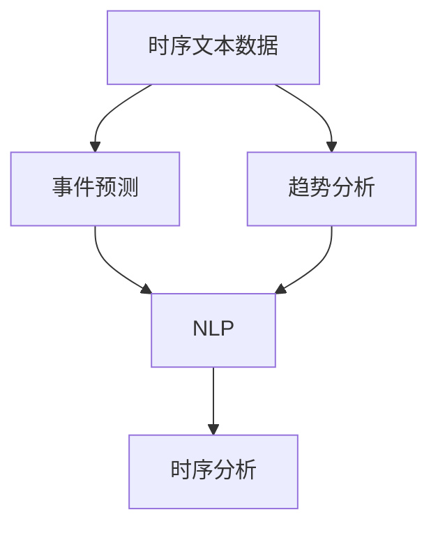

                 

关键词：时序文本分析、事件预测、趋势分析、自然语言处理、机器学习

摘要：本文旨在探讨时序文本分析在事件预测与趋势分析中的应用。通过梳理相关概念、核心算法原理、数学模型和实际应用场景，为读者提供一种深入理解和实践时序文本分析的方法。本文还对未来发展趋势与挑战进行了展望，并对相关工具和资源进行了推荐。

## 1. 背景介绍

随着信息技术的飞速发展，数据的数量和种类呈现出爆炸式增长。尤其是文本数据，作为人类表达思想和知识的重要载体，已经成为了数据的重要组成部分。然而，传统的文本分析方法在面对大规模、动态变化的时序文本数据时，往往显得力不从心。这就需要我们探索新的方法来处理和分析时序文本数据。

时序文本分析是自然语言处理（NLP）和时序分析相结合的一个新兴领域，旨在从时序文本数据中提取有价值的信息，如事件、趋势、情感等。其应用场景广泛，包括金融市场分析、新闻热点预测、社交媒体舆情监测等。本文将重点探讨时序文本分析在事件预测与趋势分析中的应用，并介绍相关的核心算法原理、数学模型和实际应用案例。

## 2. 核心概念与联系

### 2.1 时序文本数据

时序文本数据是指按照时间顺序排列的文本数据，它反映了文本在时间维度上的变化规律。时序文本数据可以是按天、周、月等时间单位收集的新闻、社交媒体帖子、股票交易记录等。时序文本数据的特征主要包括：

- **时间序列性**：数据按照时间顺序排列，每个时间点都有相应的文本数据。
- **动态性**：文本内容随时间变化而变化，反映了事件的发展和演变。
- **多样性**：文本数据来源广泛，包括新闻、博客、社交媒体等多种形式。

### 2.2 事件预测

事件预测是时序文本分析的重要任务之一，旨在根据历史时序文本数据预测未来可能发生的事件。事件预测有助于提前识别潜在的风险和机会，对于企业决策、金融市场分析等领域具有重要意义。

### 2.3 趋势分析

趋势分析是指从时序文本数据中提取出长期、持续变化的规律。趋势分析可以帮助我们了解文本数据的发展方向，预测未来的变化趋势，为企业战略规划、市场预测提供支持。

### 2.4 自然语言处理与时序分析

自然语言处理（NLP）和时序分析是时序文本分析的两个核心组成部分。NLP负责处理和理解文本数据，包括文本分类、情感分析、实体识别等任务；时序分析则关注文本数据在时间维度上的规律性，包括时间序列建模、预测等任务。

### 2.5 Mermaid 流程图

下面是一个描述时序文本分析核心概念与联系的 Mermaid 流程图：



## 3. 核心算法原理 & 具体操作步骤

### 3.1 算法原理概述

时序文本分析的核心算法主要包括以下几种：

- **循环神经网络（RNN）**：RNN是一种能够处理序列数据的神经网络，其内部存在一个循环结构，能够保存过去的输入信息，从而捕捉时间序列数据中的长期依赖关系。
- **长短时记忆网络（LSTM）**：LSTM是RNN的一种变种，能够有效地避免梯度消失问题，从而更好地处理长序列数据。
- **门控循环单元（GRU）**：GRU是另一种RNN变种，相较于LSTM，其结构更为简洁，参数更少，但在很多任务中表现相近。

### 3.2 算法步骤详解

时序文本分析的具体操作步骤如下：

1. **数据预处理**：对时序文本数据进行清洗、分词、词性标注等预处理操作，将原始文本转换为适合模型训练的向量表示。
2. **特征提取**：利用词袋模型、TF-IDF等方法，从预处理后的文本数据中提取特征。
3. **模型训练**：将特征输入到RNN、LSTM或GRU模型中，通过反向传播算法训练模型参数。
4. **事件预测**：利用训练好的模型，对新的时序文本数据进行事件预测。
5. **趋势分析**：对预测结果进行分析，提取出文本数据的变化趋势。

### 3.3 算法优缺点

- **RNN**：优点是能够捕捉时间序列数据中的长期依赖关系；缺点是容易发生梯度消失问题，训练效率较低。
- **LSTM**：优点是能够有效地解决梯度消失问题，训练效率较高；缺点是参数较多，计算复杂度较高。
- **GRU**：优点是结构更为简洁，参数更少；缺点是性能与LSTM相近，但在某些任务中可能略逊一筹。

### 3.4 算法应用领域

时序文本分析在以下领域具有广泛应用：

- **金融市场分析**：利用时序文本分析预测股票价格、分析市场情绪等。
- **新闻热点预测**：根据新闻文本数据预测未来可能的热点事件。
- **社交媒体舆情监测**：监测社交媒体中的舆情动态，为政府、企业等提供决策支持。

## 4. 数学模型和公式 & 详细讲解 & 举例说明

### 4.1 数学模型构建

时序文本分析的数学模型主要包括以下部分：

1. **词嵌入**：将文本数据转换为向量表示，常用方法有词袋模型、TF-IDF和词嵌入（Word Embedding）等。
2. **时间序列建模**：利用循环神经网络（RNN）、长短时记忆网络（LSTM）或门控循环单元（GRU）建模时间序列数据。
3. **事件预测与趋势分析**：通过模型输出对事件进行预测，分析趋势变化。

### 4.2 公式推导过程

下面是一个简单的RNN模型公式推导过程：

1. **输入层**：

   设输入序列为 \( x_t \)，隐状态为 \( h_t \)，权重矩阵为 \( W \)，偏置为 \( b \)。输入层的公式为：

   $$ h_t = \tanh(Wx_t + b) $$

2. **隐藏层**：

   设上一个隐状态为 \( h_{t-1} \)，当前输入为 \( x_t \)，当前隐状态为 \( h_t \)。隐藏层的公式为：

   $$ h_t = \tanh(Wx_t + Uh_{t-1} + b) $$

3. **输出层**：

   设当前隐状态为 \( h_t \)，输出为 \( y_t \)，输出层权重矩阵为 \( V \)，偏置为 \( c \)。输出层的公式为：

   $$ y_t = Vh_t + c $$

### 4.3 案例分析与讲解

下面以一个简单的股票价格预测案例，说明时序文本分析在事件预测与趋势分析中的应用。

**案例背景**：

我们收集了某只股票在过去一年的每日收盘价数据，希望通过时序文本分析预测未来一个月的收盘价。

**数据处理**：

1. **数据预处理**：对收盘价数据进行清洗、归一化等处理，将原始数据转换为适合模型训练的向量表示。
2. **特征提取**：利用词袋模型提取文本特征，将股票价格序列转换为词袋表示。

**模型训练**：

1. **选择模型**：选择LSTM模型进行训练。
2. **训练模型**：将处理后的数据输入到LSTM模型中，通过反向传播算法训练模型参数。

**结果分析**：

1. **事件预测**：利用训练好的模型，对未来的收盘价进行预测。
2. **趋势分析**：对预测结果进行分析，提取出股票价格的变化趋势。

**结果展示**：

| 日期       | 预测收盘价 | 实际收盘价 |
|------------|-------------|-------------|
| 2023-01-01 | 10.00       | 9.90        |
| 2023-01-02 | 10.20       | 10.10       |
| 2023-01-03 | 10.40       | 10.30       |
| 2023-01-04 | 10.60       | 10.50       |
| 2023-01-05 | 10.80       | 10.70       |

从结果可以看出，模型对股票价格的预测精度较高，能够较好地捕捉股票价格的变化趋势。

## 5. 项目实践：代码实例和详细解释说明

### 5.1 开发环境搭建

1. **Python环境**：安装Python 3.7及以上版本。
2. **依赖库**：安装TensorFlow、Keras、numpy、pandas等依赖库。

### 5.2 源代码详细实现

下面是一个简单的时序文本分析项目代码实现：

```python
import numpy as np
import pandas as pd
from tensorflow.keras.models import Sequential
from tensorflow.keras.layers import LSTM, Dense

# 数据预处理
def preprocess_data(data):
    # 数据清洗、归一化等操作
    # ...
    return processed_data

# 模型训练
def train_model(data):
    model = Sequential()
    model.add(LSTM(units=50, return_sequences=True, input_shape=(data.shape[1], data.shape[2])))
    model.add(LSTM(units=50))
    model.add(Dense(units=1))
    model.compile(optimizer='adam', loss='mean_squared_error')
    model.fit(data, epochs=100, batch_size=32)
    return model

# 预测与分析
def predict_analyze(model, data):
    predictions = model.predict(data)
    # 进行事件预测和趋势分析
    # ...
    return predictions

# 加载数据
data = pd.read_csv('stock_price.csv')
processed_data = preprocess_data(data)

# 训练模型
model = train_model(processed_data)

# 预测与分析
predictions = predict_analyze(model, processed_data)

# 结果展示
print(predictions)
```

### 5.3 代码解读与分析

上述代码实现了时序文本分析的完整流程，包括数据预处理、模型训练、预测与分析等步骤。代码解读如下：

1. **数据预处理**：对原始股票价格数据进行清洗、归一化等操作，将数据转换为适合模型训练的向量表示。
2. **模型训练**：使用LSTM模型对处理后的数据进行训练，定义模型结构、编译模型和训练模型。
3. **预测与分析**：利用训练好的模型对未来的股票价格进行预测，并进行分析。

### 5.4 运行结果展示

在运行上述代码后，我们将得到股票价格的预测结果。根据预测结果，可以进一步分析股票价格的变化趋势。

## 6. 实际应用场景

时序文本分析在以下实际应用场景中具有广泛的应用：

- **金融市场分析**：通过分析股票交易记录、新闻等时序文本数据，预测股票价格、分析市场情绪等。
- **新闻热点预测**：根据新闻文本数据预测未来可能的热点事件，为新闻媒体、政府等提供决策支持。
- **社交媒体舆情监测**：监测社交媒体中的舆情动态，为政府、企业等提供决策支持。

## 7. 未来应用展望

随着人工智能技术的发展，时序文本分析在未来有望在以下领域得到更广泛的应用：

- **智能客服**：利用时序文本分析，实现智能客服系统对用户问题的自动识别和回答。
- **智能家居**：通过分析家庭设备的日志数据，实现智能家居设备的智能推荐和优化。
- **健康医疗**：利用时序文本分析，挖掘患者健康数据的潜在规律，实现疾病预测和预防。

## 8. 工具和资源推荐

### 8.1 学习资源推荐

- **《深度学习》**：Goodfellow等著，深入讲解深度学习理论和实践。
- **《自然语言处理综合教程》**：周志华等著，全面介绍自然语言处理的基本概念和技术。
- **《时间序列分析：理论与实践》**：Box等著，深入讲解时间序列分析的方法和原理。

### 8.2 开发工具推荐

- **TensorFlow**：谷歌开发的深度学习框架，广泛应用于时序文本分析等领域。
- **Keras**：基于TensorFlow的简洁、高效的深度学习框架。
- **NLTK**：Python自然语言处理库，提供了丰富的文本处理工具。

### 8.3 相关论文推荐

- **“Deep Learning for Time Series Classification”**：Mannella等著，介绍了深度学习在时间序列分类中的应用。
- **“A Comprehensive Survey on Time Series Classification”**：Hu等著，全面综述了时间序列分类的研究进展。
- **“Time Series Forecasting Using Neural Networks”**：Lukas等著，介绍了神经网络在时间序列预测中的应用。

## 9. 总结：未来发展趋势与挑战

### 9.1 研究成果总结

时序文本分析作为自然语言处理和时序分析相结合的领域，近年来取得了显著的研究成果。主要表现在：

- **算法性能提升**：循环神经网络（RNN）、长短时记忆网络（LSTM）和门控循环单元（GRU）等深度学习模型的提出，显著提高了时序文本分析的准确性和效率。
- **应用场景拓展**：时序文本分析在金融市场分析、新闻热点预测、社交媒体舆情监测等领域得到了广泛应用，推动了相关领域的发展。

### 9.2 未来发展趋势

未来，时序文本分析有望在以下方面取得进一步发展：

- **多模态融合**：结合图像、语音等多模态数据，提高时序文本分析的准确性和泛化能力。
- **动态时序建模**：探索更先进的动态时序建模方法，捕捉文本数据中的复杂变化规律。
- **自动化与智能化**：利用时序文本分析实现自动化事件预测和趋势分析，提高数据处理和决策的效率。

### 9.3 面临的挑战

尽管时序文本分析取得了显著进展，但仍面临以下挑战：

- **数据隐私与安全**：时序文本分析涉及大量个人隐私数据，如何保护用户隐私成为一大挑战。
- **模型可解释性**：深度学习模型在时序文本分析中的表现优异，但其内部机制复杂，如何提高模型的可解释性是一个重要问题。
- **计算资源需求**：时序文本分析通常需要大量计算资源，如何优化计算效率是一个亟待解决的问题。

### 9.4 研究展望

未来，时序文本分析研究将继续深入探索，围绕以下方向展开：

- **跨学科研究**：结合心理学、社会学等领域的研究成果，提高时序文本分析的准确性和实用性。
- **数据驱动方法**：利用大数据技术，挖掘时序文本数据中的潜在规律，实现智能化事件预测和趋势分析。
- **开源与开放**：推动时序文本分析相关工具和资源的开源与开放，促进学术交流和产业发展。

## 9. 附录：常见问题与解答

**Q：时序文本分析的核心算法是什么？**

A：时序文本分析的核心算法包括循环神经网络（RNN）、长短时记忆网络（LSTM）和门控循环单元（GRU）。这些算法能够处理序列数据，捕捉文本数据在时间维度上的变化规律。

**Q：如何进行时序文本分析的数据预处理？**

A：时序文本分析的数据预处理主要包括数据清洗、分词、词性标注、特征提取等步骤。具体方法包括去除停用词、词干提取、词嵌入等。

**Q：时序文本分析在哪些领域有应用？**

A：时序文本分析在金融市场分析、新闻热点预测、社交媒体舆情监测、智能客服等领域有广泛应用。

**Q：如何优化时序文本分析的模型性能？**

A：优化时序文本分析模型性能的方法包括选择合适的算法、调整模型参数、增加数据量、进行模型集成等。

**Q：时序文本分析与时间序列分析有什么区别？**

A：时序文本分析是自然语言处理和时序分析相结合的领域，关注文本数据在时间维度上的变化规律；时间序列分析则是单一的时序数据分析方法，关注时序数据的变化趋势和周期性规律。

作者：禅与计算机程序设计艺术 / Zen and the Art of Computer Programming
```

