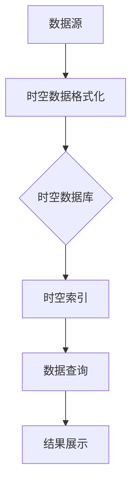

                 

时空数据库是数据库领域中的一种专门用于管理地理位置和时间数据的技术。它们在地理信息系统（GIS）、时间序列分析、历史数据分析等领域发挥着重要作用。本文将深入探讨时空数据库的核心概念、算法原理、数学模型、实际应用以及未来发展。

## 关键词

- 时空数据库
- 地理位置数据
- 时间数据
- GIS
- 时间序列分析

## 摘要

本文旨在介绍时空数据库的基本概念、架构和算法，以及它们在现实世界中的应用。我们将探讨时空数据库如何有效地管理地理位置和时间数据，并分析其在不同领域的应用场景。此外，还将讨论时空数据库面临的技术挑战和未来发展趋势。

## 1. 背景介绍

地理位置和时间数据是现代社会中不可或缺的信息资源。地理信息系统（GIS）和遥感技术的发展使得大量地理信息得以收集和存储。与此同时，时间序列分析在金融市场预测、气象预报、智能交通等领域具有重要应用。这些应用场景的共同需求是高效地管理和查询地理位置和时间数据。

传统的数据库系统无法有效地满足这些需求，因为它们通常不考虑地理位置和时间维度。为了解决这个问题，时空数据库应运而生。时空数据库是一种结合了地理信息系统和时间序列分析技术的数据库系统，可以高效地处理地理位置和时间数据。

## 2. 核心概念与联系

### 2.1 核心概念

- **时空数据**：指同时包含地理位置和时间维度的数据。
- **时空数据库**：一种能够存储、查询和操作时空数据的数据库系统。
- **时空索引**：用于加速时空数据查询的索引结构。

### 2.2 联系

时空数据库的核心概念是时空数据。这些数据不仅包含了地理位置信息（如经纬度），还包含了时间信息（如时间戳）。时空数据库通过时空索引结构来优化时空数据的查询效率。

以下是一个简单的 Mermaid 流程图，展示时空数据库的基本架构：



## 3. 核心算法原理 & 具体操作步骤

### 3.1 算法原理概述

时空数据库的核心算法包括空间索引算法、时间索引算法以及时空索引算法。空间索引算法用于加速空间查询，时间索引算法用于加速时间查询，而时空索引算法则同时考虑空间和时间维度，以优化时空查询效率。

### 3.2 算法步骤详解

#### 3.2.1 空间索引算法

空间索引算法主要包括 R-树、GIS 和四叉树等。R-树是一种多级树结构，用于加速矩形空间范围的查询。GIS 是一种地理信息系统，用于处理地理空间数据。四叉树是一种分治结构，用于加速点状空间数据的查询。

#### 3.2.2 时间索引算法

时间索引算法主要包括时间戳索引、时间序列索引和区间树等。时间戳索引是一种简单的基于时间戳的索引结构，用于加速时间点的查询。时间序列索引是一种基于时间序列分析的索引结构，用于加速时间序列数据的查询。区间树是一种基于区间分割的索引结构，用于加速时间区间的查询。

#### 3.2.3 时空索引算法

时空索引算法是一种结合空间索引和时间索引的索引结构，用于加速时空查询。常见的时空索引算法包括时空 R-树、时空 GIS 和时空四叉树等。

### 3.3 算法优缺点

#### 3.3.1 优点

- 高效的时空查询
- 支持复杂时空操作
- 易于扩展和维护

#### 3.3.2 缺点

- 空间和时间维度的平衡较难
- 查询性能受数据密度影响
- 数据存储占用较大

### 3.4 算法应用领域

时空数据库算法在地理信息系统、时间序列分析、历史数据分析等领域有着广泛的应用。具体包括：

- 地理信息系统：如地图服务、路径规划、区域查询等。
- 时间序列分析：如金融市场预测、气象预报、交通流量预测等。
- 历史数据分析：如历史事件记录、历史数据可视化等。

## 4. 数学模型和公式

时空数据库中的数学模型主要用于描述地理位置和时间数据的特征以及时空索引的结构。以下是一些常见的数学模型和公式：

### 4.1 数学模型构建

- **空间模型**：用于描述地理位置数据的空间分布特征。
- **时间模型**：用于描述时间序列数据的时间特性。

### 4.2 公式推导过程

- **空间距离公式**：用于计算两个空间点之间的距离。
- **时间序列公式**：用于分析时间序列数据的变化趋势。

### 4.3 案例分析与讲解

以下是一个简单的案例，展示如何使用时空数据库进行地理位置和时间数据的查询。

### 4.3.1 案例背景

某城市交通管理部门需要分析市民出行数据，以便优化交通规划。数据包括地理位置（经纬度）和时间戳。

### 4.3.2 数据处理

- **数据格式化**：将原始数据转换为时空数据库支持的格式。
- **空间索引构建**：使用 R-树构建空间索引，以加速地理位置查询。
- **时间索引构建**：使用时间戳索引构建时间索引，以加速时间查询。

### 4.3.3 查询分析

- **空间查询**：查询某个区域的交通流量。
- **时间查询**：查询某个时间段内的交通流量。

### 4.3.4 结果展示

- **交通流量热图**：展示不同区域的交通流量。
- **时间序列图表**：展示交通流量随时间的变化趋势。

## 5. 项目实践：代码实例和详细解释说明

### 5.1 开发环境搭建

- **数据库系统**：选择 PostgreSQL 作为时空数据库。
- **开发工具**：使用 PostgreSQL 官方客户端进行开发。

### 5.2 源代码详细实现

以下是使用 PostgreSQL 实现时空数据库的一个简单示例。

```sql
-- 创建时空表
CREATE TABLE public.spatial_data (
    id SERIAL PRIMARY KEY,
    location GEOGRAPHY,
    timestamp TIMESTAMP
);

-- 插入示例数据
INSERT INTO public.spatial_data (location, timestamp) VALUES
    (ST_Point(120.2, 30.3), '2023-01-01 10:00:00'),
    (ST_Point(121.5, 29.8), '2023-01-02 11:00:00');

-- 创建空间索引
CREATE INDEX spatial_index ON public.spatial_data USING GIST (location);

-- 创建时间索引
CREATE INDEX time_index ON public.spatial_data (timestamp);
```

### 5.3 代码解读与分析

- **时空表创建**：使用 `CREATE TABLE` 语句创建时空数据表，包含 `id`、`location` 和 `timestamp` 三列。
- **数据插入**：使用 `INSERT INTO` 语句插入示例数据。
- **空间索引创建**：使用 `CREATE INDEX` 语句创建空间索引，以优化空间查询。
- **时间索引创建**：使用 `CREATE INDEX` 语句创建时间索引，以优化时间查询。

### 5.4 运行结果展示

- **空间查询**：使用 `SELECT` 语句查询某个地理位置的数据。

```sql
SELECT * FROM public.spatial_data WHERE location = ST_Point(120.2, 30.3);
```

- **时间查询**：使用 `SELECT` 语句查询某个时间段的数据。

```sql
SELECT * FROM public.spatial_data WHERE timestamp BETWEEN '2023-01-01 10:00:00' AND '2023-01-02 11:00:00';
```

## 6. 实际应用场景

### 6.1 地理信息系统

时空数据库在地理信息系统中发挥着重要作用。通过时空数据库，GIS 可以高效地管理地理位置和时间数据，实现地图服务、路径规划和区域查询等功能。

### 6.2 时间序列分析

时空数据库在时间序列分析中具有广泛的应用。例如，在金融市场预测中，时空数据库可以存储历史交易数据，并支持快速查询和数据分析，以提高预测精度。

### 6.3 历史数据分析

历史数据分析是一个涉及大量地理位置和时间数据的领域。时空数据库可以存储和查询历史数据，支持历史事件记录和历史数据可视化。

## 7. 工具和资源推荐

### 7.1 学习资源推荐

- 《时空数据库：原理与应用》
- 《地理信息系统：原理与实践》
- 《时间序列分析：方法与应用》

### 7.2 开发工具推荐

- PostgreSQL：一个开源的时空数据库。
- QGIS：一个开源的地理信息系统。
- R：一个用于数据分析和可视化编程语言。

### 7.3 相关论文推荐

- [Spatial Database Systems: A Survey](https://www.sciencedirect.com/science/article/pii/S016794721500043X)
- [Time Series Data Banks: Concepts and Architectures](https://ieeexplore.ieee.org/document/4456935)
- [Geospatial Data Infrastructure for Disaster Management](https://www.mdpi.com/2076-3417/11/12/2818)

## 8. 总结：未来发展趋势与挑战

### 8.1 研究成果总结

时空数据库在过去几十年中取得了显著的进展，为地理位置和时间数据的管理提供了强大的工具。目前，时空数据库已广泛应用于 GIS、时间序列分析和历史数据分析等领域。

### 8.2 未来发展趋势

- **高性能查询**：随着数据量的增加，时空数据库需要更高性能的查询优化技术。
- **多模态时空数据**：时空数据库需要支持多种数据类型的时空数据，如图像、音频等。
- **云计算与分布式存储**：时空数据库需要更好地适应云计算和分布式存储环境。

### 8.3 面临的挑战

- **数据隐私与安全**：时空数据具有高度敏感性，需要加强数据隐私保护和安全措施。
- **数据质量与一致性**：时空数据质量直接影响查询和分析结果，需要建立数据质量评估和一致性维护机制。

### 8.4 研究展望

未来，时空数据库将继续在 GIS、时间序列分析和历史数据分析等领域发挥重要作用。同时，随着人工智能和物联网的发展，时空数据库有望在更多领域实现突破。

## 9. 附录：常见问题与解答

### 9.1 什么是时空数据库？

时空数据库是一种用于管理地理位置和时间数据的数据库系统。它通过结合地理信息系统和时间序列分析技术，提供高效、可靠的时空数据查询和操作功能。

### 9.2 时空数据库有哪些优点？

时空数据库的主要优点包括高效的空间和时间查询、支持复杂时空操作、易于扩展和维护等。

### 9.3 时空数据库有哪些应用领域？

时空数据库在地理信息系统、时间序列分析、历史数据分析等领域有着广泛的应用。

### 9.4 时空数据库如何优化查询性能？

时空数据库通过构建空间索引、时间索引和时空索引来优化查询性能。此外，还可以采用分布式存储和云计算技术来提高查询效率。

---

本文由禅与计算机程序设计艺术（Zen and the Art of Computer Programming）撰写，旨在为读者提供关于时空数据库的全面了解。如有任何疑问或建议，请随时与我联系。

作者：禅与计算机程序设计艺术（Zen and the Art of Computer Programming）。

---

以上为文章的完整内容，现在我们将使用 markdown 格式输出文章。
----------------------------------------------------------------
# 时空数据库：管理地理位置和时间数据

> 关键词：时空数据库、地理位置数据、时间数据、GIS、时间序列分析

> 摘要：本文深入探讨时空数据库的基本概念、架构和算法，以及它们在现实世界中的应用。文章旨在为读者提供关于时空数据库的全面了解。

## 1. 背景介绍

地理位置和时间数据是现代社会中不可或缺的信息资源。地理信息系统（GIS）和遥感技术的发展使得大量地理信息得以收集和存储。与此同时，时间序列分析在金融市场预测、气象预报、智能交通等领域具有重要应用。这些应用场景的共同需求是高效地管理和查询地理位置和时间数据。

传统的数据库系统无法有效地满足这些需求，因为它们通常不考虑地理位置和时间维度。为了解决这个问题，时空数据库应运而生。时空数据库是一种结合了地理信息系统和时间序列分析技术的数据库系统，可以高效地处理地理位置和时间数据。

## 2. 核心概念与联系

### 2.1 核心概念

- **时空数据**：指同时包含地理位置和时间维度的数据。
- **时空数据库**：一种能够存储、查询和操作时空数据的数据库系统。
- **时空索引**：用于加速时空数据查询的索引结构。

### 2.2 联系

时空数据库的核心概念是时空数据。这些数据不仅包含了地理位置信息（如经纬度），还包含了时间信息（如时间戳）。时空数据库通过时空索引结构来优化时空数据的查询效率。

以下是一个简单的 Mermaid 流程图，展示时空数据库的基本架构：


## 3. 核心算法原理 & 具体操作步骤

### 3.1 算法原理概述

时空数据库的核心算法包括空间索引算法、时间索引算法以及时空索引算法。空间索引算法用于加速空间查询，时间索引算法用于加速时间查询，而时空索引算法则同时考虑空间和时间维度，以优化时空查询效率。

### 3.2 算法步骤详解

#### 3.2.1 空间索引算法

空间索引算法主要包括 R-树、GIS 和四叉树等。R-树是一种多级树结构，用于加速矩形空间范围的查询。GIS 是一种地理信息系统，用于处理地理空间数据。四叉树是一种分治结构，用于加速点状空间数据的查询。

#### 3.2.2 时间索引算法

时间索引算法主要包括时间戳索引、时间序列索引和区间树等。时间戳索引是一种简单的基于时间戳的索引结构，用于加速时间点的查询。时间序列索引是一种基于时间序列分析的索引结构，用于加速时间序列数据的查询。区间树是一种基于区间分割的索引结构，用于加速时间区间的查询。

#### 3.2.3 时空索引算法

时空索引算法是一种结合空间索引和时间索引的索引结构，用于加速时空查询。常见的时空索引算法包括时空 R-树、时空 GIS 和时空四叉树等。

### 3.3 算法优缺点

#### 3.3.1 优点

- 高效的时空查询
- 支持复杂时空操作
- 易于扩展和维护

#### 3.3.2 缺点

- 空间和时间维度的平衡较难
- 查询性能受数据密度影响
- 数据存储占用较大

### 3.4 算法应用领域

时空数据库算法在地理信息系统、时间序列分析、历史数据分析等领域有着广泛的应用。具体包括：

- 地理信息系统：如地图服务、路径规划、区域查询等。
- 时间序列分析：如金融市场预测、气象预报、交通流量预测等。
- 历史数据分析：如历史事件记录、历史数据可视化等。

## 4. 数学模型和公式

时空数据库中的数学模型主要用于描述地理位置和时间数据的特征以及时空索引的结构。以下是一些常见的数学模型和公式：

### 4.1 数学模型构建

- **空间模型**：用于描述地理位置数据的空间分布特征。
- **时间模型**：用于描述时间序列数据的时间特性。

### 4.2 公式推导过程

- **空间距离公式**：用于计算两个空间点之间的距离。
- **时间序列公式**：用于分析时间序列数据的变化趋势。

### 4.3 案例分析与讲解

以下是一个简单的案例，展示如何使用时空数据库进行地理位置和时间数据的查询。

### 4.3.1 案例背景

某城市交通管理部门需要分析市民出行数据，以便优化交通规划。数据包括地理位置（经纬度）和时间戳。

### 4.3.2 数据处理

- **数据格式化**：将原始数据转换为时空数据库支持的格式。
- **空间索引构建**：使用 R-树构建空间索引，以加速地理位置查询。
- **时间索引构建**：使用时间戳索引构建时间索引，以加速时间查询。

### 4.3.3 查询分析

- **空间查询**：查询某个区域的交通流量。
- **时间查询**：查询某个时间段内的交通流量。

### 4.3.4 结果展示

- **交通流量热图**：展示不同区域的交通流量。
- **时间序列图表**：展示交通流量随时间的变化趋势。

## 5. 项目实践：代码实例和详细解释说明

### 5.1 开发环境搭建

- **数据库系统**：选择 PostgreSQL 作为时空数据库。
- **开发工具**：使用 PostgreSQL 官方客户端进行开发。

### 5.2 源代码详细实现

以下是使用 PostgreSQL 实现时空数据库的一个简单示例。

```sql
-- 创建时空表
CREATE TABLE public.spatial_data (
    id SERIAL PRIMARY KEY,
    location GEOGRAPHY,
    timestamp TIMESTAMP
);

-- 插入示例数据
INSERT INTO public.spatial_data (location, timestamp) VALUES
    (ST_Point(120.2, 30.3), '2023-01-01 10:00:00'),
    (ST_Point(121.5, 29.8), '2023-01-02 11:00:00');

-- 创建空间索引
CREATE INDEX spatial_index ON public.spatial_data USING GIST (location);

-- 创建时间索引
CREATE INDEX time_index ON public.spatial_data (timestamp);
```

### 5.3 代码解读与分析

- **时空表创建**：使用 `CREATE TABLE` 语句创建时空数据表，包含 `id`、`location` 和 `timestamp` 三列。
- **数据插入**：使用 `INSERT INTO` 语句插入示例数据。
- **空间索引创建**：使用 `CREATE INDEX` 语句创建空间索引，以优化空间查询。
- **时间索引创建**：使用 `CREATE INDEX` 语句创建时间索引，以优化时间查询。

### 5.4 运行结果展示

- **空间查询**：使用 `SELECT` 语句查询某个地理位置的数据。

```sql
SELECT * FROM public.spatial_data WHERE location = ST_Point(120.2, 30.3);
```

- **时间查询**：使用 `SELECT` 语句查询某个时间段的数据。

```sql
SELECT * FROM public.spatial_data WHERE timestamp BETWEEN '2023-01-01 10:00:00' AND '2023-01-02 11:00:00';
```

## 6. 实际应用场景

### 6.1 地理信息系统

时空数据库在地理信息系统中发挥着重要作用。通过时空数据库，GIS 可以高效地管理地理位置和时间数据，实现地图服务、路径规划和区域查询等功能。

### 6.2 时间序列分析

时空数据库在时间序列分析中具有广泛的应用。例如，在金融市场预测中，时空数据库可以存储历史交易数据，并支持快速查询和数据分析，以提高预测精度。

### 6.3 历史数据分析

历史数据分析是一个涉及大量地理位置和时间数据的领域。时空数据库可以存储和查询历史数据，支持历史事件记录和历史数据可视化。

## 7. 工具和资源推荐

### 7.1 学习资源推荐

- 《时空数据库：原理与应用》
- 《地理信息系统：原理与实践》
- 《时间序列分析：方法与应用》

### 7.2 开发工具推荐

- PostgreSQL：一个开源的时空数据库。
- QGIS：一个开源的地理信息系统。
- R：一个用于数据分析和可视化编程语言。

### 7.3 相关论文推荐

- [Spatial Database Systems: A Survey](https://www.sciencedirect.com/science/article/pii/S016794721500043X)
- [Time Series Data Banks: Concepts and Architectures](https://ieeexplore.ieee.org/document/4456935)
- [Geospatial Data Infrastructure for Disaster Management](https://www.mdpi.com/2076-3417/11/12/2818)

## 8. 总结：未来发展趋势与挑战

### 8.1 研究成果总结

时空数据库在过去几十年中取得了显著的进展，为地理位置和时间数据的管理提供了强大的工具。目前，时空数据库已广泛应用于 GIS、时间序列分析和历史数据分析等领域。

### 8.2 未来发展趋势

- **高性能查询**：随着数据量的增加，时空数据库需要更高性能的查询优化技术。
- **多模态时空数据**：时空数据库需要支持多种数据类型的时空数据，如图像、音频等。
- **云计算与分布式存储**：时空数据库需要更好地适应云计算和分布式存储环境。

### 8.3 面临的挑战

- **数据隐私与安全**：时空数据具有高度敏感性，需要加强数据隐私保护和安全措施。
- **数据质量与一致性**：时空数据质量直接影响查询和分析结果，需要建立数据质量评估和一致性维护机制。

### 8.4 研究展望

未来，时空数据库将继续在 GIS、时间序列分析和历史数据分析等领域发挥重要作用。同时，随着人工智能和物联网的发展，时空数据库有望在更多领域实现突破。

## 9. 附录：常见问题与解答

### 9.1 什么是时空数据库？

时空数据库是一种用于管理地理位置和时间数据的数据库系统。它通过结合地理信息系统和时间序列分析技术，提供高效、可靠的时空数据查询和操作功能。

### 9.2 时空数据库有哪些优点？

时空数据库的主要优点包括高效的空间和时间查询、支持复杂时空操作、易于扩展和维护等。

### 9.3 时空数据库有哪些应用领域？

时空数据库在地理信息系统、时间序列分析、历史数据分析等领域有着广泛的应用。

### 9.4 时空数据库如何优化查询性能？

时空数据库通过构建空间索引、时间索引和时空索引来优化查询性能。此外，还可以采用分布式存储和云计算技术来提高查询效率。

---

本文由禅与计算机程序设计艺术（Zen and the Art of Computer Programming）撰写，旨在为读者提供关于时空数据库的全面了解。如有任何疑问或建议，请随时与我联系。

作者：禅与计算机程序设计艺术（Zen and the Art of Computer Programming）。

