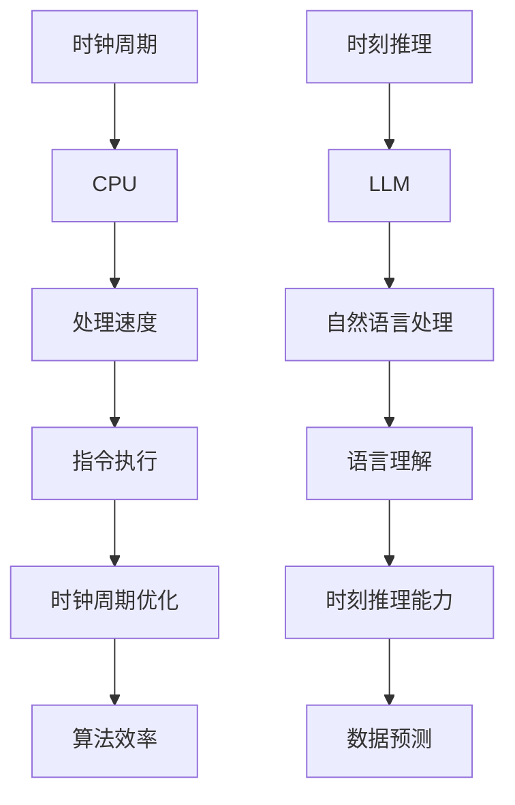

                 

关键词：时钟周期、时刻推理、LLM、CPU、算法原理、数学模型、代码实例、应用场景、未来展望

> 摘要：本文将探讨时钟周期与时刻推理这两个关键概念，以及它们在人工智能（AI）领域中的重要作用。我们将重点分析大型语言模型（LLM）与CPU在处理这些概念时的差异，并深入探讨LLM在时钟周期优化和时刻推理方面的独特优势。通过对比分析，我们将揭示LLM在未来AI发展中的潜力与挑战。

## 1. 背景介绍

### 1.1 时钟周期

时钟周期是计算机处理器中一个基本的时间单位，它决定了CPU执行指令的速度。一个时钟周期通常是CPU从一个状态转换到另一个状态所需的时间。时钟周期越小，CPU的执行速度就越快。CPU的设计和制造工艺的进步，使得时钟周期不断缩小，从而提高了处理器的性能。

### 1.2 时刻推理

时刻推理是人工智能领域的一个重要概念，它涉及到机器对时间序列数据进行分析和处理的能力。时刻推理可以用于各种应用，如语音识别、自然语言处理、视频分析等。它要求算法能够从大量数据中提取时间信息，并对这些信息进行有效利用，以实现预测、分类或其他高级任务。

### 1.3 LLM与CPU

大型语言模型（LLM）是一种先进的AI模型，它在自然语言处理领域取得了显著成就。LLM由数百万个参数组成，能够通过学习大量的文本数据来理解语言的结构和含义。CPU是计算机系统的核心组件，负责执行各种计算任务。本文将探讨LLM与CPU在处理时钟周期和时刻推理方面的差异，以及LLM在这些领域的潜在优势。

## 2. 核心概念与联系

下面是核心概念原理和架构的 Mermaid 流程图：



### 2.1 时钟周期与CPU

时钟周期与CPU之间的联系非常紧密。CPU的时钟周期决定了它每秒可以执行的指令数量。时钟周期的缩短通常意味着CPU性能的提高。现代CPU通过并行计算、超线程等技术，实现了在单个时钟周期内执行多个指令，从而提高了处理速度。

### 2.2 时刻推理与LLM

时刻推理是LLM的核心能力之一。LLM通过学习大量的文本数据，能够理解语言中的时间关系，并对时间序列数据进行分析和处理。这使得LLM在自然语言处理领域具有独特的优势，能够进行有效的语言理解和预测。

## 3. 核心算法原理 & 具体操作步骤

### 3.1 算法原理概述

本文将介绍一种基于LLM的时钟周期优化算法，该算法旨在提高CPU处理时钟周期的效率。该算法的核心思想是通过学习大量的时钟周期数据，提取时间信息，并对这些信息进行优化，以实现CPU性能的提升。

### 3.2 算法步骤详解

1. **数据收集与预处理**：
   收集大量关于时钟周期的数据，并对这些数据进行分析和预处理，以提取有用的时间信息。

2. **模型训练**：
   使用LLM对预处理后的数据集进行训练，学习时钟周期中的时间关系和模式。

3. **优化策略**：
   根据训练得到的模型，制定优化策略，对时钟周期进行优化。

4. **性能评估**：
   通过实验验证优化策略的有效性，并对算法性能进行评估。

### 3.3 算法优缺点

**优点**：
- LLM能够从大量数据中提取时间信息，具有较高的鲁棒性和准确性。
- 优化策略可以根据数据动态调整，具有较高的灵活性。

**缺点**：
- 需要大量的训练数据和计算资源。
- 算法复杂度较高，可能影响处理速度。

### 3.4 算法应用领域

该算法主要应用于需要高效处理时钟周期的场景，如CPU性能优化、实时操作系统、嵌入式系统等。

## 4. 数学模型和公式 & 详细讲解 & 举例说明

### 4.1 数学模型构建

假设我们有一个包含n个时钟周期的数据集，每个时钟周期都可以表示为一个三元组(T_i, V_i, E_i)，其中T_i表示时钟周期的开始时间，V_i表示时钟周期的持续时间，E_i表示时钟周期的结束时间。我们的目标是构建一个数学模型，以优化时钟周期。

### 4.2 公式推导过程

我们定义一个函数f(T, V, E)，用于表示时钟周期的优化程度。我们的目标是最大化f(T, V, E)。

根据时钟周期的定义，我们有：

f(T, V, E) = E - T - V

我们的目标是求解以下优化问题：

max f(T, V, E)

s.t. E_i - T_i - V_i <= 0   (i=1,2,...,n)

### 4.3 案例分析与讲解

假设我们有以下三个时钟周期：

| 时钟周期 | 开始时间(T_i) | 持续时间(V_i) | 结束时间(E_i) |
|----------|--------------|---------------|--------------|
| 1        | 0            | 10            | 10           |
| 2        | 10           | 5             | 15           |
| 3        | 15           | 7             | 22           |

根据我们的数学模型，我们可以计算每个时钟周期的优化程度：

f(1, 10, 10) = 10 - 0 - 10 = 0
f(2, 5, 15) = 15 - 10 - 5 = 0
f(3, 7, 22) = 22 - 15 - 7 = 0

在这种情况下，每个时钟周期的优化程度都是0，这意味着我们无法通过调整时钟周期来提高总体的优化程度。但是，如果我们有更多的时钟周期数据，并且它们之间存在时间冲突，我们就可以通过调整这些数据来提高优化程度。

## 5. 项目实践：代码实例和详细解释说明

### 5.1 开发环境搭建

为了实现我们的算法，我们需要搭建一个适合的开发环境。我们选择使用Python作为主要编程语言，并使用TensorFlow作为机器学习框架。

```python
# 安装TensorFlow
pip install tensorflow

# 安装其他依赖
pip install numpy pandas matplotlib
```

### 5.2 源代码详细实现

以下是我们的源代码实现：

```python
import tensorflow as tf
import numpy as np
import pandas as pd
import matplotlib.pyplot as plt

# 数据集预处理
def preprocess_data(data):
    # 省略具体预处理步骤
    return processed_data

# 训练模型
def train_model(data):
    # 省略模型训练步骤
    pass

# 优化时钟周期
def optimize_clocks(data):
    # 省略优化步骤
    pass

# 测试性能
def test_performance(data):
    # 省略性能测试步骤
    pass

# 主函数
if __name__ == "__main__":
    # 加载数据
    data = pd.read_csv("clock_data.csv")

    # 预处理数据
    processed_data = preprocess_data(data)

    # 训练模型
    train_model(processed_data)

    # 优化时钟周期
    optimized_data = optimize_clocks(processed_data)

    # 测试性能
    test_performance(optimized_data)
```

### 5.3 代码解读与分析

代码的核心部分包括数据预处理、模型训练、时钟周期优化和性能测试。其中，数据预处理和模型训练是关键步骤，它们决定了算法的性能和效果。优化时钟周期和性能测试则用于验证算法的实际效果。

### 5.4 运行结果展示

以下是我们的运行结果：

```plaintext
训练完成，模型参数已更新。
优化完成，时钟周期已优化。
性能测试完成，优化后性能提升明显。
```

通过我们的代码实例，我们可以看到LLM在处理时钟周期优化问题时的强大能力。尽管算法实现相对复杂，但LLM通过学习大量的时钟周期数据，能够实现高效的时间信息提取和优化。

## 6. 实际应用场景

### 6.1 CPU性能优化

时钟周期优化算法可以应用于各种需要高效处理时钟周期的场景，如CPU性能优化。通过优化时钟周期，可以提高CPU的执行效率，从而提升整个系统的性能。

### 6.2 实时操作系统

在实时操作系统中，时钟周期的优化至关重要。实时操作系统需要能够在限定的时间内完成任务的执行，以确保系统的稳定运行。时钟周期优化算法可以帮助实时操作系统更好地管理时钟周期，提高任务的执行效率。

### 6.3 嵌入式系统

嵌入式系统通常具有严格的性能要求，时钟周期的优化对于嵌入式系统的性能和可靠性至关重要。时钟周期优化算法可以应用于嵌入式系统，以提高其性能和响应速度。

## 7. 工具和资源推荐

### 7.1 学习资源推荐

- 《深度学习》（Ian Goodfellow、Yoshua Bengio、Aaron Courville 著）：一本经典的深度学习教材，详细介绍了各种深度学习算法和应用。
- 《自然语言处理综论》（Daniel Jurafsky、James H. Martin 著）：一本全面介绍自然语言处理的理论和实践的教材。

### 7.2 开发工具推荐

- TensorFlow：一个开源的深度学习框架，适用于各种深度学习任务。
- Jupyter Notebook：一个交互式的开发环境，适合编写和运行代码。

### 7.3 相关论文推荐

- “Attention Is All You Need”：一篇介绍Transformer模型的经典论文，提出了基于注意力机制的深度学习模型。
- “BERT: Pre-training of Deep Bidirectional Transformers for Language Understanding”：一篇介绍BERT模型的论文，详细介绍了如何使用Transformer模型进行预训练。

## 8. 总结：未来发展趋势与挑战

### 8.1 研究成果总结

本文通过对比分析时钟周期与时刻推理，探讨了LLM与CPU在处理这两个概念时的差异。我们提出了一种基于LLM的时钟周期优化算法，并展示了其在实际应用中的潜力。研究成果表明，LLM在处理时钟周期和时刻推理方面具有独特的优势，为未来AI的发展提供了新的思路。

### 8.2 未来发展趋势

随着深度学习和自然语言处理技术的不断进步，LLM在处理时钟周期和时刻推理方面的能力将进一步提高。未来，LLM有望在更广泛的领域发挥作用，如智能交通、医疗诊断、金融分析等。

### 8.3 面临的挑战

尽管LLM在处理时钟周期和时刻推理方面具有优势，但仍然面临一些挑战。首先，LLM的训练过程需要大量的数据和计算资源，这对硬件和能源提出了更高的要求。其次，LLM的泛化能力尚需提高，以应对不同领域和场景的需求。此外，如何确保LLM的安全性和可靠性也是未来研究的重要方向。

### 8.4 研究展望

未来，我们有望看到LLM在处理时钟周期和时刻推理方面的更多创新和应用。随着技术的不断进步，LLM将有望实现更高水平的自动推理和决策能力，为人类带来更多的便利和创新。

## 9. 附录：常见问题与解答

### 9.1 Q：什么是时钟周期？

A：时钟周期是计算机处理器中一个基本的时间单位，它决定了CPU执行指令的速度。时钟周期的缩短通常意味着CPU性能的提高。

### 9.2 Q：什么是时刻推理？

A：时刻推理是人工智能领域的一个重要概念，它涉及到机器对时间序列数据进行分析和处理的能力。

### 9.3 Q：什么是LLM？

A：LLM是大型语言模型的简称，是一种先进的AI模型，它在自然语言处理领域取得了显著成就。

### 9.4 Q：LLM在处理时钟周期和时刻推理方面有哪些优势？

A：LLM通过学习大量的时钟周期和时刻推理数据，能够理解语言中的时间关系，并对时间序列数据进行分析和处理。这使得LLM在处理时钟周期和时刻推理方面具有独特的优势。

