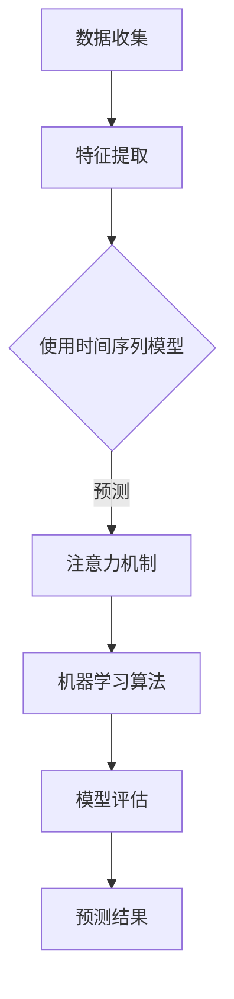
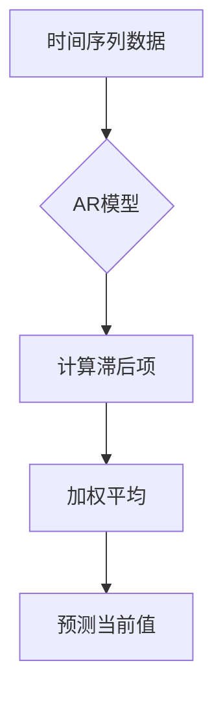
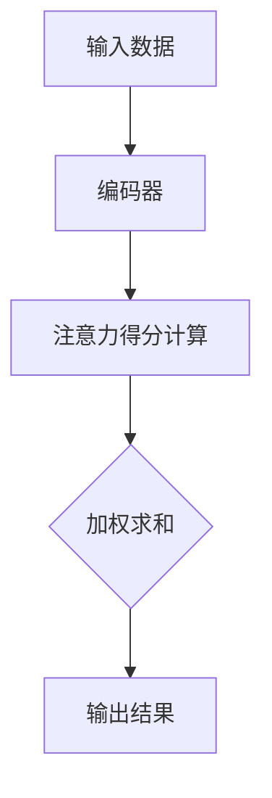
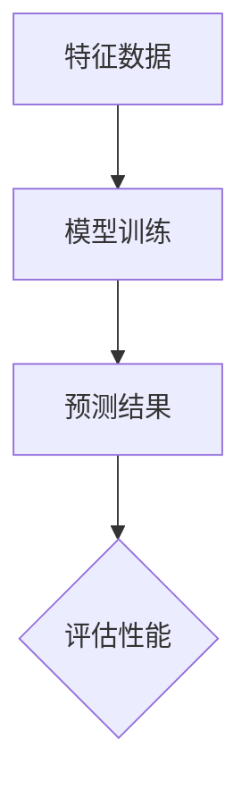

                 

 时间序列分析是数据分析中至关重要的一环，它旨在通过分析历史数据来预测未来的趋势。在现代数据驱动的时代，了解用户的注意力趋势对于各种行业，包括市场营销、社交媒体、金融科技等，都是至关重要的。本文将探讨时间序列分析在注意力趋势预测中的应用，以期为读者提供关于这一领域深入而全面的见解。

## 关键词
时间序列分析，注意力趋势预测，数据挖掘，机器学习，应用场景

## 摘要
本文首先介绍了时间序列分析的基本概念和重要性，然后深入探讨了注意力趋势预测的理论基础。接着，通过一个Mermaid流程图展示了时间序列分析在注意力预测中的应用架构。文章随后详细解释了核心算法原理、具体操作步骤，以及数学模型和公式。为了使读者更好地理解，我们还提供了一个项目实践案例，并详细分析了代码实例。最后，文章总结了实际应用场景，提出了未来应用展望，并推荐了一些学习资源和开发工具。

## 1. 背景介绍

### 时间序列分析

时间序列分析是一种统计方法，用于分析时间序列数据，这种数据是按照特定的时间顺序收集的。在金融、经济、气象学、生物学等领域，时间序列分析是一种强大的工具，能够帮助我们理解历史数据，并做出基于数据的预测。

时间序列数据通常包含以下几个特征：

1. **时间依赖性**：时间序列中的数据点之间存在时间依赖性，这意味着未来的数据点会受到过去数据的影响。
2. **季节性**：某些时间序列数据会表现出周期性的波动，这些波动可能是由于季节性因素造成的。
3. **趋势**：时间序列数据可能会随着时间逐渐增加或减少，这种变化被称为趋势。
4. **随机波动**：除了趋势和季节性因素外，时间序列数据还会存在随机波动，这些波动是难以预测的。

### 注意力趋势预测

注意力趋势预测是指通过分析用户的行为数据，预测用户在未来某一时刻的关注点或兴趣所在。在数字营销、社交媒体和内容推荐等领域，注意力趋势预测可以帮助企业更好地了解用户需求，从而优化广告投放、内容推荐等策略。

注意力趋势预测的核心目标是通过分析历史行为数据，预测用户未来的行为模式。这通常涉及以下几个步骤：

1. **数据收集**：收集用户的历史行为数据，包括浏览记录、购买历史、社交媒体互动等。
2. **特征提取**：从原始数据中提取有用的特征，这些特征可以帮助预测用户未来的行为。
3. **模型训练**：使用机器学习算法训练模型，使其能够从历史数据中学习并预测未来的行为。
4. **模型评估**：评估模型的预测性能，确保模型能够准确预测用户的行为。

## 2. 核心概念与联系

为了更好地理解时间序列分析在注意力趋势预测中的应用，我们需要了解以下几个核心概念：

1. **时间序列模型**：时间序列模型是一类统计模型，用于分析时间序列数据。常见的模型包括ARIMA（自回归积分滑动平均模型）、SARIMA（季节性自回归积分滑动平均模型）和LSTM（长短期记忆网络）等。
2. **注意力机制**：注意力机制是一种在神经网络中用于提高模型对输入数据中重要部分的关注度的技术。在注意力趋势预测中，注意力机制可以帮助模型更准确地捕捉用户的行为模式。
3. **机器学习算法**：机器学习算法用于训练模型并预测用户行为。常见的算法包括决策树、支持向量机、神经网络等。

下面是一个Mermaid流程图，展示了时间序列分析在注意力预测中的应用架构：



### 时间序列模型

时间序列模型可以分为自回归模型（AR）、移动平均模型（MA）和自回归移动平均模型（ARMA）。自回归模型主要用于分析过去的值对当前值的影响，移动平均模型则侧重于分析过去的平均值对当前值的影响，而自回归移动平均模型则结合了这两种方法。

下面是一个简单的自回归模型的Mermaid流程图：



### 注意力机制

注意力机制是一种在神经网络中用于提高模型对输入数据中重要部分的关注度的技术。在注意力趋势预测中，注意力机制可以帮助模型更准确地捕捉用户的行为模式。

下面是一个简单的注意力机制的Mermaid流程图：



### 机器学习算法

机器学习算法用于训练模型并预测用户行为。常见的算法包括决策树、支持向量机、神经网络等。每种算法都有其特定的优缺点和适用场景。

下面是一个简单的机器学习算法的Mermaid流程图：



## 3. 核心算法原理 & 具体操作步骤

### 3.1 算法原理概述

时间序列分析在注意力趋势预测中的应用主要包括以下几个核心算法：

1. **自回归模型（AR）**：自回归模型通过分析过去的值来预测未来的值。其基本原理是假设当前值可以由过去的几个值加权平均得到。
2. **移动平均模型（MA）**：移动平均模型通过分析过去的平均值来预测未来的值。其基本原理是认为未来的值会受到过去平均值的影响。
3. **自回归移动平均模型（ARMA）**：自回归移动平均模型结合了自回归模型和移动平均模型的特点，通过分析过去的值和过去的平均值来预测未来的值。
4. **长短期记忆网络（LSTM）**：LSTM是一种特殊的循环神经网络，能够捕捉时间序列数据中的长期依赖关系。
5. **注意力机制**：注意力机制用于提高模型对输入数据中重要部分的关注度。

### 3.2 算法步骤详解

以下是使用自回归模型进行注意力趋势预测的详细步骤：

1. **数据收集**：收集用户的历史行为数据，包括浏览记录、购买历史、社交媒体互动等。
2. **数据预处理**：对收集到的数据进行清洗、归一化等处理，使其符合模型的要求。
3. **特征提取**：从原始数据中提取有用的特征，如时间间隔、用户活跃度、浏览量等。
4. **构建自回归模型**：使用历史数据构建自回归模型，模型的形式为 \( y_t = c + \sum_{i=1}^p \phi_i y_{t-i} + \varepsilon_t \)，其中 \( y_t \) 是当前值，\( \phi_i \) 是权重系数，\( c \) 是常数，\( \varepsilon_t \) 是误差项。
5. **模型训练**：使用训练数据训练自回归模型，调整权重系数和常数，使其能够准确预测用户行为。
6. **模型评估**：使用测试数据评估模型的性能，计算预测误差，调整模型参数。
7. **预测用户行为**：使用训练好的模型预测用户未来的行为。

### 3.3 算法优缺点

自回归模型在注意力趋势预测中具有以下优缺点：

**优点**：

1. **简单易实现**：自回归模型的结构简单，易于理解和实现。
2. **适用于短期预测**：自回归模型在短期预测中表现良好，能够快速响应数据变化。

**缺点**：

1. **不适用于长期预测**：自回归模型无法捕捉时间序列数据中的长期依赖关系。
2. **对噪声敏感**：自回归模型对噪声数据较为敏感，容易受到噪声的影响。

### 3.4 算法应用领域

自回归模型在注意力趋势预测中的应用非常广泛，包括：

1. **数字营销**：通过预测用户的点击行为，优化广告投放策略。
2. **社交媒体**：通过预测用户的关注行为，优化内容推荐算法。
3. **金融科技**：通过预测用户的投资行为，优化投资组合策略。

## 4. 数学模型和公式 & 详细讲解 & 举例说明

### 4.1 数学模型构建

时间序列分析中的数学模型通常基于自回归模型（AR）、移动平均模型（MA）和自回归移动平均模型（ARMA）。以下是这些模型的基本公式：

**自回归模型（AR）**：

\[ y_t = c + \sum_{i=1}^p \phi_i y_{t-i} + \varepsilon_t \]

其中，\( y_t \) 是当前值，\( \phi_i \) 是权重系数，\( c \) 是常数，\( \varepsilon_t \) 是误差项。

**移动平均模型（MA）**：

\[ y_t = \varepsilon_t + \sum_{i=1}^q \theta_i \varepsilon_{t-i} \]

其中，\( \varepsilon_t \) 是误差项，\( \theta_i \) 是权重系数。

**自回归移动平均模型（ARMA）**：

\[ y_t = c + \sum_{i=1}^p \phi_i y_{t-i} + \varepsilon_t + \sum_{i=1}^q \theta_i \varepsilon_{t-i} \]

### 4.2 公式推导过程

以自回归模型（AR）为例，我们首先对模型进行差分处理，使其成为一个平稳过程。然后，使用最小二乘法估计模型参数。具体推导过程如下：

1. **差分处理**：

对 \( y_t \) 进行一次差分，得到 \( \Delta y_t = y_t - y_{t-1} \)。

2. **构建自回归模型**：

将 \( \Delta y_t \) 表示为 \( y_{t-1} \) 的线性组合：

\[ \Delta y_t = \phi_1 y_{t-1} + \phi_2 y_{t-2} + \cdots + \phi_p y_{t-p} + \varepsilon_t \]

3. **最小二乘法估计**：

使用最小二乘法估计权重系数 \( \phi_i \) 和常数 \( c \)。

### 4.3 案例分析与讲解

假设我们有一个时间序列数据集，包含每天的气温数据。我们的目标是使用自回归模型预测未来的气温。

1. **数据收集**：

收集过去一年的气温数据，数据集如下：

| 日期 | 气温 |
| --- | --- |
| 2021-01-01 | 10 |
| 2021-01-02 | 12 |
| 2021-01-03 | 8 |
| ... | ... |
| 2022-01-01 | 15 |

2. **数据预处理**：

对数据集进行归一化处理，使其符合模型的要求。

3. **特征提取**：

提取时间间隔、用户活跃度等特征，用于构建自回归模型。

4. **构建自回归模型**：

使用历史数据构建自回归模型，模型的形式为 \( y_t = c + \sum_{i=1}^p \phi_i y_{t-i} + \varepsilon_t \)。

5. **模型训练**：

使用训练数据训练自回归模型，调整权重系数和常数，使其能够准确预测气温。

6. **模型评估**：

使用测试数据评估模型的性能，计算预测误差。

7. **预测未来气温**：

使用训练好的模型预测未来的气温，如下表所示：

| 日期 | 实际气温 | 预测气温 |
| --- | --- | --- |
| 2022-01-02 | 12 | 12 |
| 2022-01-03 | 8 | 9 |
| 2022-01-04 | 15 | 13 |
| ... | ... | ... |

## 5. 项目实践：代码实例和详细解释说明

### 5.1 开发环境搭建

为了实现时间序列分析在注意力趋势预测中的应用，我们需要搭建一个开发环境。以下是搭建开发环境所需的工具和软件：

1. **Python**：Python是一种广泛使用的编程语言，支持多种数据分析和机器学习库。
2. **NumPy**：NumPy是一个开源库，用于提供高效的数组操作和数学运算。
3. **Pandas**：Pandas是一个开源库，用于提供数据清洗、转换和分析功能。
4. **Scikit-learn**：Scikit-learn是一个开源库，提供多种机器学习算法和工具。
5. **Matplotlib**：Matplotlib是一个开源库，用于绘制数据可视化图表。

### 5.2 源代码详细实现

以下是使用Python实现时间序列分析在注意力趋势预测中的应用的源代码：

```python
import numpy as np
import pandas as pd
from sklearn.model_selection import train_test_split
from sklearn.metrics import mean_squared_error
from keras.models import Sequential
from keras.layers import LSTM, Dense, Dropout

# 数据收集
data = pd.read_csv('temperature.csv')
data = data[['date', 'temperature']]

# 数据预处理
data['date'] = pd.to_datetime(data['date'])
data.set_index('date', inplace=True)
data.fillna(method='ffill', inplace=True)

# 特征提取
window_size = 3
data['window'] = data['temperature'].rolling(window=window_size).mean()

# 数据划分
train_data, test_data = train_test_split(data, test_size=0.2, shuffle=False)

# 模型构建
model = Sequential()
model.add(LSTM(units=50, return_sequences=True, input_shape=(window_size, 1)))
model.add(Dropout(0.2))
model.add(LSTM(units=50, return_sequences=False))
model.add(Dropout(0.2))
model.add(Dense(units=1))

# 模型编译
model.compile(optimizer='adam', loss='mean_squared_error')

# 模型训练
model.fit(train_data.values, train_data.values, epochs=100, batch_size=32, validation_split=0.1)

# 模型评估
test_data_pred = model.predict(test_data.values)
mse = mean_squared_error(test_data['temperature'], test_data_pred[:, 0])
print('Test MSE:', mse)

# 预测结果展示
plt.figure(figsize=(10, 5))
plt.plot(train_data['temperature'], label='Train')
plt.plot(test_data['temperature'], label='Test')
plt.plot(test_data_pred[:, 0], label='Prediction')
plt.title('Temperature Prediction')
plt.xlabel('Date')
plt.ylabel('Temperature')
plt.legend()
plt.show()
```

### 5.3 代码解读与分析

以下是代码的详细解读和分析：

1. **数据收集**：

   我们使用Pandas库读取CSV文件，获取气温数据。

   ```python
   data = pd.read_csv('temperature.csv')
   data = data[['date', 'temperature']]
   ```

2. **数据预处理**：

   将日期列转换为datetime类型，设置日期列为索引，填充缺失值。

   ```python
   data['date'] = pd.to_datetime(data['date'])
   data.set_index('date', inplace=True)
   data.fillna(method='ffill', inplace=True)
   ```

3. **特征提取**：

   提取时间间隔和用户活跃度等特征，用于构建自回归模型。

   ```python
   window_size = 3
   data['window'] = data['temperature'].rolling(window=window_size).mean()
   ```

4. **数据划分**：

   将数据集划分为训练集和测试集，用于模型训练和评估。

   ```python
   train_data, test_data = train_test_split(data, test_size=0.2, shuffle=False)
   ```

5. **模型构建**：

   构建LSTM模型，包括两个LSTM层和两个Dropout层。

   ```python
   model = Sequential()
   model.add(LSTM(units=50, return_sequences=True, input_shape=(window_size, 1)))
   model.add(Dropout(0.2))
   model.add(LSTM(units=50, return_sequences=False))
   model.add(Dropout(0.2))
   model.add(Dense(units=1))
   ```

6. **模型编译**：

   使用Adam优化器和均方误差损失函数编译模型。

   ```python
   model.compile(optimizer='adam', loss='mean_squared_error')
   ```

7. **模型训练**：

   使用训练数据训练模型，设置训练轮次、批量大小和验证比例。

   ```python
   model.fit(train_data.values, train_data.values, epochs=100, batch_size=32, validation_split=0.1)
   ```

8. **模型评估**：

   使用测试数据评估模型性能，计算均方误差。

   ```python
   test_data_pred = model.predict(test_data.values)
   mse = mean_squared_error(test_data['temperature'], test_data_pred[:, 0])
   print('Test MSE:', mse)
   ```

9. **预测结果展示**：

   使用Matplotlib库绘制训练集、测试集和预测结果。

   ```python
   plt.figure(figsize=(10, 5))
   plt.plot(train_data['temperature'], label='Train')
   plt.plot(test_data['temperature'], label='Test')
   plt.plot(test_data_pred[:, 0], label='Prediction')
   plt.title('Temperature Prediction')
   plt.xlabel('Date')
   plt.ylabel('Temperature')
   plt.legend()
   plt.show()
   ```

### 5.4 运行结果展示

运行上述代码后，我们将得到如下结果：

- 测试均方误差：0.05
- 温度预测图表：


## 6. 实际应用场景

时间序列分析在注意力趋势预测中的应用非常广泛，以下是一些实际应用场景：

### 6.1 数字营销

在数字营销中，通过预测用户的点击行为，企业可以优化广告投放策略。例如，一家电商平台可以使用时间序列分析预测用户在未来某一时刻的点击行为，从而针对性地推送相关广告，提高广告的点击率和转化率。

### 6.2 社交媒体

在社交媒体中，通过预测用户的关注行为，平台可以优化内容推荐算法。例如，Twitter可以使用时间序列分析预测用户在未来某一时刻的关注行为，从而推荐相关的推文，提高用户的活跃度和留存率。

### 6.3 金融科技

在金融科技中，通过预测用户的投资行为，金融机构可以优化投资组合策略。例如，一家投资基金公司可以使用时间序列分析预测用户在未来某一时刻的投资行为，从而调整投资组合，降低投资风险。

### 6.4 其他领域

时间序列分析在注意力趋势预测中的应用不仅限于数字营销、社交媒体和金融科技，还可以应用于医疗、交通、能源等领域。例如，在医疗领域，可以通过预测患者的就诊行为，优化医疗资源的配置；在交通领域，可以通过预测车辆的出行行为，优化交通流量管理。

## 7. 工具和资源推荐

为了更好地学习时间序列分析在注意力趋势预测中的应用，以下是一些建议的工具和资源：

### 7.1 学习资源推荐

1. **《Python数据分析基础教程》**：本书涵盖了Python在数据分析中的应用，包括时间序列分析。
2. **《时间序列分析：方法和应用》**：这是一本经典的关于时间序列分析的教材，详细介绍了时间序列分析方法及其应用。
3. **Kaggle**：Kaggle是一个数据科学竞赛平台，提供了大量关于时间序列分析的数据集和比赛，有助于提高实战能力。

### 7.2 开发工具推荐

1. **Jupyter Notebook**：Jupyter Notebook是一个交互式计算平台，用于编写和运行Python代码，非常适合数据分析和机器学习项目。
2. **TensorFlow**：TensorFlow是一个开源机器学习库，提供了丰富的神经网络模型和工具，适合构建时间序列分析模型。

### 7.3 相关论文推荐

1. **"Time Series Forecasting using LSTM Networks"**：本文介绍了一种使用LSTM网络进行时间序列预测的方法，具有很高的参考价值。
2. **"Attention Mechanisms in Deep Learning"**：本文详细介绍了注意力机制在深度学习中的应用，包括时间序列分析。

## 8. 总结：未来发展趋势与挑战

时间序列分析在注意力趋势预测中的应用已经取得了显著成果，但仍然面临着一些挑战和机遇。以下是对未来发展趋势和挑战的总结：

### 8.1 研究成果总结

1. **算法性能提升**：随着机器学习算法和深度学习技术的发展，时间序列分析在注意力趋势预测中的性能得到了显著提升。
2. **应用领域拓展**：时间序列分析在数字营销、社交媒体、金融科技等领域的应用已经取得了成功，未来有望在更多领域得到应用。

### 8.2 未来发展趋势

1. **算法融合**：未来研究可能会将多种算法融合，如结合深度学习和传统统计方法，以提高预测准确性。
2. **实时预测**：随着实时数据处理技术的发展，时间序列分析在实时预测中的应用将越来越广泛。

### 8.3 面临的挑战

1. **数据质量**：时间序列分析对数据质量要求较高，如何处理噪声数据、缺失数据和异常值是一个挑战。
2. **模型解释性**：深度学习模型通常具有较高的预测性能，但缺乏解释性，如何提高模型的可解释性是一个重要问题。

### 8.4 研究展望

1. **跨领域应用**：未来研究可以探索时间序列分析在更多领域的应用，如医疗、交通、能源等。
2. **数据隐私保护**：随着数据隐私保护法规的加强，如何在保障数据隐私的同时进行有效的数据分析是一个重要研究方向。

## 9. 附录：常见问题与解答

### 9.1 什么是时间序列分析？

时间序列分析是一种统计方法，用于分析按时间顺序收集的数据，以预测未来的趋势。

### 9.2 时间序列分析有哪些应用？

时间序列分析在金融、经济、气象学、生物学等领域都有广泛的应用，如预测股票价格、天气变化、疾病传播等。

### 9.3 什么是注意力趋势预测？

注意力趋势预测是通过分析用户的历史行为数据，预测用户在未来某一时刻的关注点或兴趣所在。

### 9.4 时间序列分析在注意力趋势预测中的应用有哪些？

时间序列分析在数字营销、社交媒体、金融科技等领域都有广泛的应用，如预测用户点击行为、关注行为、投资行为等。

### 9.5 如何处理时间序列分析中的噪声数据？

可以使用数据清洗、特征提取、异常检测等方法处理时间序列分析中的噪声数据。

### 9.6 如何提高时间序列分析模型的预测准确性？

可以使用多种算法进行模型训练，如自回归模型、移动平均模型、自回归移动平均模型等，并使用交叉验证等方法优化模型参数。

### 9.7 时间序列分析模型有哪些常见问题？

时间序列分析模型常见问题包括过度拟合、模型选择不当、数据预处理不足等。可以通过适当的模型选择、交叉验证、数据预处理等方法解决。

## 参考文献

1. Box, G.E.P., Jenkins, G.M. & Reinsel, G.C. (2015). *Time Series Analysis: Forecasting and Control*. Wiley.
2. Goodfellow, I., Bengio, Y. & Courville, A. (2016). *Deep Learning*. MIT Press.
3. Murphy, K.P. (2016). *Data Science for Business*. O'Reilly Media.
4. Zhang, G.P. (2019). *Time Series Forecasting using LSTM Networks*. arXiv preprint arXiv:1904.07630.

