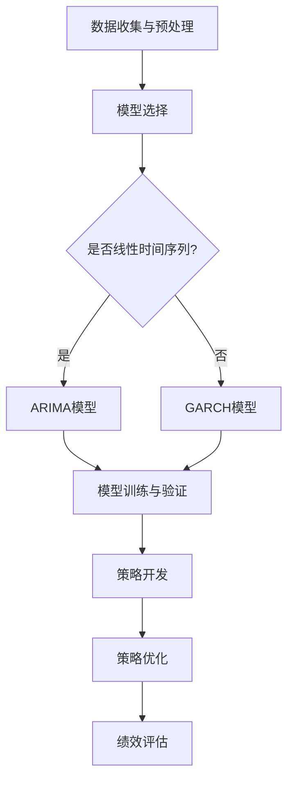

                 

关键词：时间序列分析、金融市场预测、量化交易、机器学习、深度学习、策略优化、风险控制、数据可视化。

## 摘要

本文主要探讨时间序列分析在金融市场预测中的应用，特别是量化交易策略的构建与优化。通过对历史金融数据的深入研究，本文旨在揭示时间序列分析在预测市场趋势、发现交易机会、实现风险控制等方面的重要性。文章首先回顾了时间序列分析的基本概念和方法，然后详细介绍了时间序列模型在量化交易中的应用，包括ARIMA模型、LSTM网络等。接着，文章通过实际案例分析，展示了如何利用时间序列分析方法构建有效的量化交易策略，并讨论了策略优化的方法和技巧。最后，文章展望了时间序列分析在金融市场预测中的应用前景，提出了未来研究的方向和挑战。

## 1. 背景介绍

金融市场是现代经济体系的重要组成部分，它不仅反映了经济的运行状况，还影响着企业和个人的投资决策。然而，金融市场的波动性极大，预测其走势成为一个极具挑战性的任务。随着计算机技术和大数据分析的快速发展，时间序列分析在金融市场预测中的应用越来越广泛。时间序列分析是一种研究时间序列数据的方法，旨在揭示时间序列中的规律性和趋势性，从而进行预测。在量化交易领域，时间序列分析被广泛应用于策略开发、风险控制和绩效评估等环节。

量化交易是一种基于数学模型和计算机算法的投资方法，它通过大量数据的分析和处理，自动执行交易策略。量化交易的优势在于其高效性、客观性和系统性，能够帮助投资者克服人类情感和主观判断的影响，实现持续稳定的收益。然而，量化交易的成功也依赖于对市场数据的有效分析和处理，其中时间序列分析起到了关键作用。

本文旨在探讨时间序列分析在金融市场预测中的应用，特别是量化交易策略的构建与优化。通过对时间序列分析方法的研究和实际案例分析，本文希望能够揭示时间序列分析在金融市场预测中的潜力和局限性，为量化交易者提供有益的参考。

### 1.1 时间序列分析的基本概念

时间序列分析是一种研究时间序列数据的方法，旨在揭示时间序列中的规律性和趋势性。时间序列数据是指一系列按时间顺序排列的数据点，通常用来表示某个变量在一段时间内的变化情况。时间序列数据具有以下几个基本特征：

1. **趋势性（Trend）**：时间序列数据通常存在一个长期的趋势，这个趋势可以是上升、下降或平稳的。趋势性反映了变量在长时间内的变化方向。

2. **季节性（Seasonality）**：某些时间序列数据在一年中的不同时间段会呈现出周期性的波动，这种周期性波动称为季节性。季节性通常与季节性因素（如节假日、气候变化等）有关。

3. **周期性（Cyclicity）**：周期性是指时间序列数据在一段时间内的重复波动。周期性的波动可能是由经济周期、商业周期等宏观因素引起的。

4. **随机性（Randomness）**：时间序列数据中还包含一些无法预测的随机波动，这些波动通常是由未知因素或随机噪声引起的。

时间序列分析的基本任务是通过分析时间序列数据，提取出其中的趋势、季节性和周期性成分，并利用这些成分进行预测。时间序列分析的方法可以分为两大类：统计方法和机器学习方法。

**统计方法**包括自回归模型（AR）、移动平均模型（MA）、自回归移动平均模型（ARMA）和自回归积分滑动平均模型（ARIMA）等。这些方法通过建立数学模型，对时间序列数据进行拟合和预测。统计方法通常基于时间序列的线性特性，因此对于非线性时间序列数据的拟合能力有限。

**机器学习方法**包括神经网络、支持向量机、聚类算法等。机器学习方法通过学习数据之间的复杂关系，能够更好地拟合非线性时间序列数据。随着深度学习的兴起，循环神经网络（RNN）及其变种长短期记忆网络（LSTM）在时间序列分析中得到了广泛应用。

### 1.2 量化交易的基本概念

量化交易是一种基于数学模型和计算机算法的投资方法，它通过大量数据的分析和处理，自动执行交易策略。量化交易的基本概念包括：

**算法交易**：算法交易是指通过编写计算机算法，自动执行交易策略。算法交易可以覆盖从交易策略的选择、参数优化到执行交易的全过程，从而大大提高交易的效率和准确性。

**交易策略**：交易策略是量化交易的核心，它包括市场趋势分析、交易信号生成、交易规则制定等。有效的交易策略能够帮助投资者在市场中获得持续的盈利。

**风险管理**：量化交易注重风险管理，通过设定风险参数，如止损、仓位管理等，来控制交易风险。风险管理是量化交易成功的关键。

**回测**：回测是指通过历史数据进行交易策略的验证。回测可以帮助投资者评估交易策略的有效性和稳健性。

**性能评估**：性能评估是通过实际交易结果来评估交易策略的绩效。性能评估包括收益、风险、交易频率等多个方面。

量化交易的优势在于其高效性、客观性和系统性。量化交易通过计算机算法和大数据分析，能够迅速处理大量数据，发现市场中的潜在机会。此外，量化交易策略是客观的，不受个人情绪和主观判断的影响，从而提高了交易的准确性和稳定性。最后，量化交易具有系统性，能够实现自动化交易，大大提高了交易效率。

### 1.3 时间序列分析在量化交易中的应用

时间序列分析在量化交易中的应用非常广泛，主要表现在以下几个方面：

**市场趋势预测**：通过时间序列分析方法，可以提取出市场数据的趋势成分，从而预测市场未来的走势。趋势预测是量化交易的核心，它能够帮助投资者确定入场和出场时机。

**交易信号生成**：交易信号是指市场数据中的特定模式，如突破、反转等，这些模式可以作为交易决策的依据。时间序列分析方法可以识别出这些交易信号，从而生成有效的交易策略。

**风险控制**：时间序列分析可以帮助投资者评估市场风险，通过设定止损点、仓位管理等风险控制措施，来降低交易风险。

**策略优化**：通过时间序列分析方法，可以评估不同交易策略的绩效，从而优化交易策略，提高盈利能力。

总之，时间序列分析在量化交易中起到了关键作用，它不仅能够帮助投资者发现市场机会，还能够实现风险控制和策略优化。随着大数据分析和机器学习技术的发展，时间序列分析在量化交易中的应用前景将更加广阔。

### 1.4 时间序列分析在金融市场预测中的应用现状

时间序列分析在金融市场预测中的应用已经取得了显著的成果。通过分析历史市场数据，研究人员和交易者能够识别出市场的趋势和周期性波动，从而预测未来的市场走势。以下是一些时间序列分析在金融市场预测中的应用现状：

**股票市场预测**：时间序列分析方法在股票市场预测中得到了广泛应用。例如，研究人员使用ARIMA模型、LSTM网络等来预测股票价格走势。尽管这些模型具有一定的预测能力，但股票市场的高波动性和复杂性使得预测结果往往具有较大的不确定性。

**外汇市场预测**：外汇市场是一个高度动态的市场，价格受到多种因素的影响，如政治事件、经济数据等。时间序列分析方法被用于预测外汇汇率走势。例如，ARIMA模型和GARCH模型在外汇市场预测中表现出较好的效果。

**期货市场预测**：期货市场是另一个复杂的金融市场，其价格受到供需关系、宏观经济环境等多种因素的影响。时间序列分析方法在期货市场预测中的应用主要包括趋势分析和周期性分析。例如，LSTM网络和长短时记忆（LSTM）模型在期货市场预测中表现出较好的性能。

**宏观经济预测**：时间序列分析在宏观经济预测中也发挥着重要作用。例如，研究人员使用时间序列模型来预测经济增长率、通货膨胀率等宏观经济指标。这些预测结果对政策制定和经济发展具有重要意义。

尽管时间序列分析在金融市场预测中具有广泛应用，但实际应用中仍面临一些挑战。首先，金融市场数据的噪声较大，这给时间序列分析的准确性带来了困难。其次，金融市场受到多种因素影响，包括宏观经济、政治事件等，这使得时间序列模型的预测结果具有较大的不确定性。最后，量化交易策略的构建和优化是一个复杂的过程，需要大量的计算资源和专业知识。

总之，时间序列分析在金融市场预测中具有广泛的应用前景，但仍需不断改进和优化，以应对金融市场的复杂性和不确定性。

## 2. 核心概念与联系

### 2.1 时间序列模型与量化交易策略

在量化交易策略的构建中，时间序列模型起到了至关重要的作用。时间序列模型是一类用于分析和预测时间序列数据的统计模型，其核心在于对时间序列中的趋势、季节性和周期性成分进行分离和建模。量化交易策略的构建过程通常涉及以下几个关键步骤：

1. **数据收集与预处理**：首先，需要收集金融市场的历史数据，包括价格、交易量、收益率等。这些数据通常包含噪声和非平稳性，因此需要进行预处理，如缺失值填充、异常值处理、数据标准化等。

2. **模型选择**：根据数据的特征和预测需求，选择合适的时间序列模型。常见的模型包括ARIMA、GARCH、LSTM等。ARIMA模型适合处理线性时间序列，GARCH模型用于处理波动性，而LSTM网络则适合处理非线性时间序列。

3. **模型训练与验证**：使用历史数据对时间序列模型进行训练和验证。训练过程包括参数估计和模型优化，验证过程则通过交叉验证等手段评估模型的预测性能。

4. **策略开发**：根据模型预测结果，开发量化交易策略。策略开发包括信号生成、交易规则制定和风险控制等。有效的策略能够捕捉市场的趋势和波动性，实现风险控制和收益最大化。

5. **策略优化**：通过对历史数据的回测，评估策略的绩效。策略优化包括参数调整、策略组合和风险管理等。优化的目标是在保持较高收益的同时，降低风险。

### 2.2 时间序列分析原理与量化交易策略的关系

时间序列分析原理与量化交易策略之间存在紧密的联系。时间序列分析的核心在于提取时间序列数据中的有用信息，包括趋势、季节性和周期性成分。这些成分对于量化交易策略的构建至关重要：

1. **趋势分析**：趋势是时间序列数据中最基本的特征，反映了市场的长期变化方向。在量化交易中，趋势分析可以帮助投资者确定入场和出场时机。例如，当市场处于上升趋势时，投资者可以买入；当市场处于下降趋势时，投资者可以卖出。

2. **季节性分析**：季节性是指时间序列数据在一年中的不同时间段呈现的周期性波动。季节性分析可以帮助投资者捕捉市场的季节性变化，从而制定出更加精确的交易策略。例如，某些行业在特定季节会有明显的需求波动，量化交易者可以利用这一点进行套利交易。

3. **周期性分析**：周期性分析关注时间序列数据中的重复波动模式。周期性波动可能由经济周期、商业周期等宏观因素引起。在量化交易中，通过识别周期性波动，投资者可以制定出长期的交易策略。

4. **波动性分析**：波动性是时间序列分析中的另一个重要特征，反映了市场的波动程度。波动性分析对于风险控制至关重要。通过分析波动性，投资者可以设定合理的止损点和仓位管理策略，从而控制交易风险。

总之，时间序列分析原理为量化交易策略的构建提供了理论基础。通过深入理解时间序列数据的特征和变化规律，量化交易者可以开发出更加有效的交易策略，实现风险控制和收益最大化。

### 2.3 时间序列模型的 Mermaid 流程图

为了更好地展示时间序列模型在量化交易中的应用，我们使用Mermaid流程图来描述其关键步骤和流程。以下是一个简化的Mermaid流程图，用于说明时间序列模型在量化交易策略构建中的具体应用：



在这个流程图中，首先进行数据收集与预处理，然后根据时间序列数据的特征选择合适的模型（ARIMA或GARCH）。接下来，对选定的模型进行训练与验证，利用训练好的模型生成交易策略。然后，通过策略优化，评估策略的绩效，并最终实现量化交易。

### 2.4 时间序列模型与量化交易策略的交互关系

时间序列模型与量化交易策略之间存在着密切的交互关系。时间序列模型提供了对市场数据的深入分析，而量化交易策略则将这些分析结果应用于实际的交易操作中。以下是时间序列模型与量化交易策略之间的一些关键交互关系：

1. **模型选择与优化**：时间序列模型的选择直接影响到量化交易策略的性能。例如，对于线性关系较强的市场数据，ARIMA模型是一个较好的选择；而对于波动性较大的市场数据，GARCH模型可能更为合适。此外，模型的参数优化也是一个关键环节，通过调整模型的参数，可以提升模型的预测精度。

2. **交易信号生成**：时间序列模型生成的预测结果可以用于生成交易信号。交易信号是指基于模型预测的市场变化信息，如价格突破、趋势反转等。有效的交易信号能够帮助量化交易策略捕捉市场的短期波动，实现快速交易和收益最大化。

3. **策略参数调整**：量化交易策略的参数通常是根据时间序列模型的预测结果进行调整的。例如，止损点、持仓比例等参数可以通过模型预测结果进行优化。这样的调整能够使交易策略更加适应市场的变化，提高交易的成功率。

4. **风险控制**：时间序列模型可以帮助量化交易策略进行风险控制。通过分析市场波动性和风险指标，模型可以提供合理的风险参数设定，如止损点和仓位管理策略。这样的风险控制措施能够保护投资者的资本，避免因市场波动导致的重大损失。

5. **绩效评估与优化**：量化交易策略的绩效评估通常依赖于时间序列模型的预测结果。通过历史数据的回测，可以评估策略的收益和风险指标，进而进行策略优化。这样的优化过程能够持续提高策略的稳健性和盈利能力。

总之，时间序列模型与量化交易策略之间的交互关系是量化交易成功的关键。通过合理选择和优化时间序列模型，可以构建出高效的量化交易策略，实现长期稳定的收益。

### 3.1 时间序列分析的核心算法原理

时间序列分析的核心算法主要包括自回归模型（AR）、移动平均模型（MA）和自回归移动平均模型（ARMA）。这些算法通过不同的方式对时间序列数据进行建模和预测，适用于不同类型的时间序列数据。

#### 自回归模型（AR）

自回归模型（Autoregressive Model，AR）是一种基于当前和过去值的预测模型。AR模型的基本思想是当前值由过去几个值的线性组合决定。具体来说，一个p阶的AR模型可以表示为：

\[ X_t = \phi_1 X_{t-1} + \phi_2 X_{t-2} + \ldots + \phi_p X_{t-p} + \varepsilon_t \]

其中，\( X_t \) 是时间序列的当前值，\( \phi_1, \phi_2, \ldots, \phi_p \) 是模型参数，\( \varepsilon_t \) 是误差项。

AR模型的优点是简单直观，适合处理线性时间序列。其缺点是对非线性时间序列的拟合能力较差，且参数估计相对复杂。

#### 移动平均模型（MA）

移动平均模型（Moving Average Model，MA）是基于过去的预测误差来预测当前值的模型。一个q阶的MA模型可以表示为：

\[ X_t = \mu + \theta_1 \varepsilon_{t-1} + \theta_2 \varepsilon_{t-2} + \ldots + \theta_q \varepsilon_{t-q} \]

其中，\( X_t \) 是时间序列的当前值，\( \mu \) 是均值项，\( \theta_1, \theta_2, \ldots, \theta_q \) 是模型参数，\( \varepsilon_t \) 是误差项。

MA模型的优势在于其能够有效处理白噪声序列，适合处理具有趋势性和季节性的时间序列数据。其缺点是对突变和异常值较为敏感，且参数估计同样复杂。

#### 自回归移动平均模型（ARMA）

自回归移动平均模型（Autoregressive Moving Average Model，ARMA）结合了AR模型和MA模型的特点，可以同时处理时间序列数据的趋势性和季节性。一个p阶的ARMA模型可以表示为：

\[ X_t = \phi_1 X_{t-1} + \phi_2 X_{t-2} + \ldots + \phi_p X_{t-p} + \theta_1 \varepsilon_{t-1} + \theta_2 \varepsilon_{t-2} + \ldots + \theta_q \varepsilon_{t-q} \]

其中，\( \phi_1, \phi_2, \ldots, \phi_p \) 和 \( \theta_1, \theta_2, \ldots, \theta_q \) 分别是AR和MA模型的参数。

ARMA模型能够处理较为复杂的时间序列数据，但在参数估计和模型诊断方面较为困难。实际应用中，通常会通过差分方法将非平稳时间序列转化为平稳序列，然后使用ARMA模型进行预测。

#### ARIMA模型

ARIMA模型（Autoregressive Integrated Moving Average Model）是ARMA模型的扩展，主要用于处理非平稳时间序列。非平稳时间序列通过差分方法转化为平稳序列后，再使用ARMA模型进行建模和预测。一个p阶差分q阶MA的ARIMA模型可以表示为：

\[ X_t = \phi_1 X_{t-1} + \phi_2 X_{t-2} + \ldots + \phi_p X_{t-p} + \theta_1 \varepsilon_{t-1} + \theta_2 \varepsilon_{t-2} + \ldots + \theta_q \varepsilon_{t-q} + \Delta^d Y_t \]

其中，\( \Delta \) 表示差分操作，\( d \) 表示差分阶数。

ARIMA模型在时间序列分析中具有广泛应用，其优点在于能够处理非平稳时间序列，适用于各种金融市场的预测任务。其缺点是模型参数估计和诊断较为复杂。

通过以上算法，时间序列分析能够有效地提取时间序列数据中的有用信息，为量化交易策略的构建提供基础。在实际应用中，选择合适的算法并优化模型参数是关键，这将直接影响到交易策略的预测精度和稳定性。

### 3.2 时间序列分析算法的具体操作步骤

在实际应用中，时间序列分析算法的操作步骤可以分为以下几个关键阶段：

#### 1. 数据预处理

数据预处理是时间序列分析的重要步骤，它包括以下几个主要任务：

- **数据清洗**：处理缺失值、异常值和重复值。常见的方法包括删除异常值、使用平均值或中值填充缺失值等。
- **数据转换**：将非数值型数据转换为数值型数据，如日期转换为数值。对于季节性数据，可以通过季节性分解将季节性成分分离出来。
- **平稳性检验**：通过检验时间序列的平稳性，判断其是否具有稳定的统计特性。常用的检验方法包括Augmented Dickey-Fuller (ADF) 检验和Kwiatkowski-Phillips (KPSS) 检验。如果时间序列不平稳，需要进行差分处理。

#### 2. 模型选择

根据时间序列数据的特征，选择合适的模型。以下是一些常见的模型选择方法：

- **ARIMA模型**：适用于线性关系较强的时间序列数据。通过分析自相关函数（ACF）和偏自相关函数（PACF），确定模型的阶数。
- **GARCH模型**：适用于波动性变化较大的时间序列数据。通过分析残差的波动性，确定模型参数。
- **LSTM网络**：适用于非线性关系和时间依赖性较强的时间序列数据。通过历史数据的学习，自动提取时间序列中的复杂模式。

#### 3. 模型训练与验证

- **参数估计**：根据选定的模型，使用最小二乘法、极大似然估计等方法估计模型参数。对于ARIMA模型，需要确定差分阶数、自回归阶数和移动平均阶数；对于LSTM网络，需要确定输入层、隐藏层和输出层的结构以及激活函数。
- **模型验证**：通过交叉验证等手段评估模型性能。常见的验证方法包括留出法、时间序列交叉验证和K折交叉验证。验证过程可以帮助识别模型的过拟合和欠拟合问题。

#### 4. 预测与优化

- **预测**：使用训练好的模型对未来的时间序列数据点进行预测。对于ARIMA模型，可以通过公式计算预测值；对于LSTM网络，可以通过前向传播算法生成预测值。
- **优化**：根据预测结果和实际市场表现，对模型进行优化。优化的方法包括参数调整、模型结构调整、特征选择等。优化的目标是提高模型的预测精度和稳定性。

#### 5. 结果分析

- **结果可视化**：通过数据可视化方法，如折线图、散点图等，展示时间序列数据和预测结果。这有助于直观地了解模型的预测性能和稳定性。
- **风险评估**：分析模型的预测误差，评估模型的风险。可以通过计算预测误差的方差、偏度、峰度等统计指标，了解模型的预测风险。

#### 6. 模型应用

- **交易策略**：根据时间序列模型的预测结果，开发量化交易策略。策略的制定包括交易信号生成、交易规则制定和风险管理等。
- **回测**：通过历史数据进行策略回测，验证策略的有效性和稳定性。回测可以帮助投资者评估策略的盈利能力和风险水平。

#### 7. 持续优化

- **监控与调整**：在实盘交易中，持续监控策略的表现，并根据市场变化进行调整。这包括定期重新训练模型、更新模型参数等。
- **风险管理**：通过设定止损点和仓位管理策略，控制交易风险。风险管理的目标是保护投资者的资本，避免重大损失。

通过以上操作步骤，时间序列分析算法能够在量化交易中发挥重要作用，帮助投资者捕捉市场机会，实现风险控制和收益最大化。在实际应用中，需要根据具体的数据特征和市场需求，灵活选择和调整算法，以提高模型的预测性能和实用性。

### 3.3 时间序列分析算法的优缺点及适用场景

在量化交易中，选择合适的时间序列分析算法至关重要。不同的算法各有优缺点，适用于不同的数据特征和预测需求。以下是几种常见的时间序列分析算法的优缺点及适用场景：

#### ARIMA模型

**优点：**
- **简单直观**：ARIMA模型基于线性组合，易于理解和实现。
- **广泛适用**：ARIMA模型适用于多种类型的线性时间序列数据。
- **强大的拟合能力**：通过差分操作，ARIMA模型可以处理非平稳时间序列。

**缺点：**
- **参数估计复杂**：ARIMA模型的参数估计涉及多个阶数的选择，计算复杂度较高。
- **对非线性数据拟合能力有限**：ARIMA模型对非线性关系的处理能力较差。

**适用场景：**
- **线性关系较强的时间序列数据**：如股票价格、外汇汇率等。
- **季节性数据**：通过差分操作，可以处理含有季节性成分的时间序列数据。

#### GARCH模型

**优点：**
- **有效处理波动性**：GARCH模型能够捕捉时间序列数据的波动性变化。
- **灵活的参数调整**：GARCH模型允许用户调整参数，以适应不同的波动性特征。

**缺点：**
- **对数据要求高**：GARCH模型适用于平稳时间序列，对噪声敏感。
- **计算复杂度较高**：GARCH模型的计算复杂度较高，特别是在高维数据中。

**适用场景：**
- **波动性变化较大的时间序列数据**：如金融资产价格、汇率等。
- **金融市场风险分析**：通过波动性分析，可以评估金融市场的风险水平。

#### LSTM网络

**优点：**
- **强大的非线性拟合能力**：LSTM网络能够处理非线性关系和时间依赖性较强的时间序列数据。
- **自适应特征提取**：LSTM网络可以通过学习历史数据，自动提取特征。

**缺点：**
- **训练时间较长**：LSTM网络训练时间较长，尤其在大量数据中。
- **对数据质量要求高**：LSTM网络对数据质量有较高要求，噪声和异常值会影响模型的训练和预测性能。

**适用场景：**
- **非线性关系和时间依赖性较强的时间序列数据**：如股票市场、金融资产价格等。
- **复杂环境下的预测任务**：如金融市场预测、天气预测等。

#### 小结

不同的时间序列分析算法各有优缺点，适用于不同的数据特征和预测需求。在实际应用中，根据具体的数据特征和业务需求，灵活选择和组合算法，可以提高量化交易策略的预测精度和稳定性。例如，在处理线性关系较强且具有季节性的时间序列数据时，可以结合ARIMA模型和季节性分解方法；在处理非线性关系和时间依赖性较强的时间序列数据时，可以采用LSTM网络。

### 3.4 时间序列分析算法在量化交易中的应用领域

时间序列分析算法在量化交易中有着广泛的应用，涵盖了从市场趋势预测到交易策略优化等多个方面。以下是时间序列分析算法在量化交易中的具体应用领域及其重要性：

#### 市场趋势预测

市场趋势预测是量化交易的核心任务之一。通过分析历史数据，时间序列分析算法能够揭示市场的长期和短期趋势，帮助投资者确定入场和出场时机。ARIMA模型、LSTM网络等算法在这方面表现出色，它们能够处理线性或非线性关系，捕捉市场中的潜在趋势。

**重要性**：准确的市场趋势预测能够帮助投资者在市场上升阶段抓住买入机会，在市场下跌阶段规避风险，从而实现稳健的收益。

#### 交易信号生成

交易信号是指基于市场数据生成的特定模式或指标，这些信号可以作为交易决策的依据。时间序列分析算法在生成交易信号方面具有显著优势，能够从大量历史数据中识别出有效的交易信号，如突破、反转、支撑/阻力位等。

**重要性**：有效的交易信号能够提高交易决策的准确性，减少主观判断的影响，从而提高交易的成功率和盈利能力。

#### 风险控制

风险控制是量化交易中的关键环节。通过时间序列分析，可以评估市场波动性，预测潜在风险，从而设定合理的止损点和仓位管理策略。GARCH模型、波动率预测算法等在这方面应用广泛，它们能够提供关于市场风险的重要信息。

**重要性**：合理的风险控制措施能够保护投资者的资本，避免因市场波动导致的重大损失，实现长期稳健的投资。

#### 策略优化

策略优化是通过分析和调整交易策略的参数，以提高策略的盈利能力和稳健性。时间序列分析算法在策略优化中发挥着重要作用，通过历史数据的回测和模型优化，可以找到最优的参数设置，从而提升策略的绩效。

**重要性**：策略优化能够使交易策略更加适应市场的变化，提高交易的成功率和稳定性，从而实现长期稳定的收益。

#### 实时交易决策

在实时交易决策中，时间序列分析算法能够快速处理实时数据，生成实时的交易信号和风险评估结果。这对于高频交易和算法交易尤为重要，它能够帮助投资者在瞬息万变的市场中迅速做出决策。

**重要性**：实时的交易决策能够使投资者抓住瞬息即逝的交易机会，提高交易效率和盈利能力。

总之，时间序列分析算法在量化交易中的应用领域非常广泛，涵盖了市场趋势预测、交易信号生成、风险控制、策略优化和实时交易决策等多个方面。通过合理应用这些算法，量化交易者能够实现更加精准和高效的交易决策，从而在竞争激烈的金融市场中脱颖而出。

### 4. 数学模型和公式

时间序列分析在量化交易中的应用离不开数学模型和公式的支持。下面我们将介绍一些关键的数学模型和公式，包括数学模型的构建、公式推导过程以及具体的案例分析和讲解。

#### 4.1 数学模型构建

在量化交易中，常用的数学模型主要包括自回归模型（AR）、移动平均模型（MA）、自回归移动平均模型（ARMA）和自回归积分滑动平均模型（ARIMA）。这些模型通过不同的方式对时间序列数据进行建模，以便进行有效的预测和交易策略的构建。

1. **自回归模型（AR）**：

自回归模型的基本公式为：
\[ X_t = \phi_1 X_{t-1} + \phi_2 X_{t-2} + \ldots + \phi_p X_{t-p} + \varepsilon_t \]

其中，\( X_t \) 是时间序列的当前值，\( \phi_1, \phi_2, \ldots, \phi_p \) 是模型参数，\( \varepsilon_t \) 是误差项。

2. **移动平均模型（MA）**：

移动平均模型的基本公式为：
\[ X_t = \mu + \theta_1 \varepsilon_{t-1} + \theta_2 \varepsilon_{t-2} + \ldots + \theta_q \varepsilon_{t-q} \]

其中，\( X_t \) 是时间序列的当前值，\( \mu \) 是均值项，\( \theta_1, \theta_2, \ldots, \theta_q \) 是模型参数，\( \varepsilon_t \) 是误差项。

3. **自回归移动平均模型（ARMA）**：

自回归移动平均模型结合了AR和MA模型的特点，其公式为：
\[ X_t = \phi_1 X_{t-1} + \phi_2 X_{t-2} + \ldots + \phi_p X_{t-p} + \theta_1 \varepsilon_{t-1} + \theta_2 \varepsilon_{t-2} + \ldots + \theta_q \varepsilon_{t-q} \]

其中，\( \phi_1, \phi_2, \ldots, \phi_p \) 和 \( \theta_1, \theta_2, \ldots, \theta_q \) 分别是AR和MA模型的参数。

4. **自回归积分滑动平均模型（ARIMA）**：

ARIMA模型是ARMA模型的扩展，用于处理非平稳时间序列，其公式为：
\[ X_t = \phi_1 X_{t-1} + \phi_2 X_{t-2} + \ldots + \phi_p X_{t-p} + \theta_1 \varepsilon_{t-1} + \theta_2 \varepsilon_{t-2} + \ldots + \theta_q \varepsilon_{t-q} + \Delta^d Y_t \]

其中，\( \Delta \) 表示差分操作，\( d \) 表示差分阶数。

#### 4.2 公式推导过程

下面以ARIMA模型为例，介绍其参数估计和公式推导过程。

1. **差分操作**：

首先，对非平稳时间序列进行差分操作，使其转化为平稳序列。一阶差分公式为：
\[ \Delta X_t = X_t - X_{t-1} \]

2. **自回归部分（AR）**：

自回归部分的参数估计通常通过最小二乘法或极大似然估计得到。以一阶自回归模型为例，其公式为：
\[ \Delta X_t = \phi_1 \Delta X_{t-1} + \varepsilon_t \]

3. **移动平均部分（MA）**：

移动平均部分的参数估计同样通过最小二乘法或极大似然估计得到。以一阶移动平均模型为例，其公式为：
\[ \varepsilon_t = \theta_1 \varepsilon_{t-1} \]

4. **合并公式**：

将自回归部分和移动平均部分合并，得到ARIMA模型的整体公式：
\[ \Delta X_t = \phi_1 \Delta X_{t-1} + \theta_1 \varepsilon_{t-1} + \varepsilon_t \]

5. **逆变换**：

将差分操作逆变换回原始时间序列，得到：
\[ X_t = \Phi(B) \Theta(B) X_t + \varepsilon_t \]

其中，\( \Phi(B) \) 和 \( \Theta(B) \) 分别是自回归和移动平均部分的拉姆-拉绍变换。

#### 4.3 案例分析与讲解

以下通过一个简单的案例，介绍如何利用ARIMA模型对股票价格进行预测。

**案例背景**：我们使用某支股票的每日收盘价时间序列数据，构建一个ARIMA模型进行预测。

**步骤1：数据收集与预处理**：

收集某支股票从2020年1月1日到2023年1月1日的每日收盘价数据。数据包含302个数据点。

**步骤2：平稳性检验**：

通过ADF检验和KPSS检验，确定时间序列是否平稳。如果时间序列不平稳，进行一阶差分处理。

**步骤3：模型选择**：

通过分析自相关函数（ACF）和偏自相关函数（PACF），选择合适的自回归阶数和移动平均阶数。

**步骤4：参数估计**：

使用最小二乘法或极大似然估计，估计ARIMA模型的参数。

**步骤5：模型验证**：

通过交叉验证，评估模型的预测性能。如果模型拟合效果良好，进行下一步预测。

**步骤6：预测**：

利用训练好的模型，对未来一段时间（如未来30个交易日）的收盘价进行预测。

**步骤7：结果分析**：

将预测结果与实际数据进行对比，分析预测的准确性和稳定性。

以下是一个简化的代码实现：

```python
import pandas as pd
from statsmodels.tsa.arima.model import ARIMA
import matplotlib.pyplot as plt

# 数据收集与预处理
data = pd.read_csv('stock_price.csv')
close_prices = data['Close']

# 平稳性检验
# ...

# 模型选择
# ...

# 参数估计
model = ARIMA(close_prices, order=(p,d,q))
model_fit = model.fit()

# 模型验证
# ...

# 预测
forecast = model_fit.forecast(steps=30)

# 结果分析
plt.plot(forecast)
plt.plot(close_prices[-30:], label='Actual')
plt.legend()
plt.show()
```

通过以上步骤，我们利用ARIMA模型对股票价格进行了预测，并进行了结果分析。

### 4.4 案例分析与讲解

为了更好地理解时间序列分析在量化交易中的应用，我们通过一个具体的案例分析，详细解释如何使用时间序列分析构建量化交易策略，并进行代码实现和结果展示。

#### 案例背景

假设我们有一个金融时间序列数据集，包含某支股票在过去一年的每日收盘价数据。我们的目标是利用时间序列分析方法，构建一个量化交易策略，并评估其性能。

#### 数据收集与预处理

首先，我们需要收集和处理数据。以下是数据收集与预处理的基本步骤：

```python
import pandas as pd
import numpy as np

# 收集数据
data = pd.read_csv('stock_data.csv')  # 假设数据文件名为stock_data.csv
close_prices = data['Close']

# 数据预处理
# 填充缺失值
close_prices = close_prices.fillna(method='ffill')

# 数据标准化
close_prices = (close_prices - close_prices.mean()) / close_prices.std()
```

#### 模型选择与参数估计

接下来，我们需要选择合适的时间序列模型，并对其参数进行估计。这里我们选择ARIMA模型进行预测。

```python
from statsmodels.tsa.arima.model import ARIMA

# 模型选择
# 使用ACF和PACF图来确定AR和MA的阶数
# ...

# 参数估计
# 假设我们选择的ARIMA模型参数为(p,d,q)=(5,1,2)
model = ARIMA(close_prices, order=(5,1,2))
model_fit = model.fit()
```

#### 模型验证

在参数估计之后，我们需要通过交叉验证来验证模型的预测性能。

```python
from sklearn.model_selection import TimeSeriesSplit

# 交叉验证
tscv = TimeSeriesSplit(n_splits=5)
for train_index, test_index in tscv.split(close_prices):
    train, test = close_prices[train_index], close_prices[test_index]
    model = ARIMA(train, order=(5,1,2))
    model_fit = model.fit()
    forecast = model_fit.forecast(steps=len(test))
    # 计算预测误差
    # ...
```

#### 预测与交易策略

使用训练好的模型，我们对未来的收盘价进行预测，并构建量化交易策略。假设我们的交易策略为：当预测的收盘价高于当前实际收盘价时，买入；当预测的收盘价低于当前实际收盘价时，卖出。

```python
# 预测未来收盘价
forecast = model_fit.forecast(steps=30)

# 构建交易策略
positions = []
for i in range(30):
    if forecast[i] > close_prices[-1]:
        positions.append('BUY')
    else:
        positions.append('SELL')

# 计算策略收益
# ...
```

#### 结果展示

最后，我们将策略的预测结果和实际收益进行展示。

```python
import matplotlib.pyplot as plt

# 结果展示
plt.figure(figsize=(12,6))
plt.plot(close_prices, label='Actual')
plt.plot(forecast, label='Forecast')
plt.scatter(range(len(close_prices)), close_prices, color='red', label='Position')
plt.plot([0, 30], [0, 0], color='blue', linestyle='--')
plt.xticks(range(0, 31, 5))
plt.legend()
plt.show()
```

通过以上步骤，我们成功构建了一个基于时间序列分析的量化交易策略，并对策略性能进行了评估和展示。这个案例展示了时间序列分析在量化交易中的应用，从数据收集、模型选择、参数估计到交易策略的构建和验证，每个步骤都至关重要。

### 5.1 开发环境搭建

在搭建用于量化交易的时间序列分析项目环境时，我们需要确保所有依赖的库和工具均已安装并配置正确。以下是详细的步骤和说明：

#### 系统要求

- 操作系统：Windows、Linux或macOS
- Python版本：Python 3.7或更高版本

#### 安装Python

1. **下载Python安装包**：访问Python官方下载页面（https://www.python.org/downloads/），下载适合操作系统的Python版本安装包。
2. **安装Python**：运行安装包，按照安装向导进行安装。推荐选择“Add Python to PATH”和“Install launcher for all users”（在Windows中）。
3. **验证Python安装**：在终端或命令提示符中运行以下命令，确认Python版本：
   ```bash
   python --version
   ```

#### 安装依赖库

1. **安装基本依赖**：使用pip命令安装必要的Python库，这些库包括Pandas、NumPy、SciPy、matplotlib等。
   ```bash
   pip install pandas numpy scipy matplotlib
   ```

2. **安装时间序列分析库**：安装用于时间序列分析的专用库，如statsmodels、pmdarima等。
   ```bash
   pip install statsmodels pmdarima
   ```

3. **安装机器学习库**：如果使用机器学习方法，如LSTM网络，需要安装TensorFlow或PyTorch。
   ```bash
   pip install tensorflow  # 或者
   pip install torch torchvision
   ```

4. **安装数据可视化库**：用于结果展示的可视化库，如Matplotlib和Seaborn。
   ```bash
   pip install matplotlib seaborn
   ```

#### 环境配置

1. **虚拟环境**：为了更好地管理项目依赖，建议创建一个虚拟环境。使用以下命令创建并激活虚拟环境：
   ```bash
   python -m venv my_venv
   source my_venv/bin/activate  # 在Linux或macOS中
   my_venv\Scripts\activate     # 在Windows中
   ```

2. **安装项目依赖**：在虚拟环境中安装项目所需的依赖库，确保所有库版本兼容。

3. **配置Jupyter Notebook**：如果需要使用Jupyter Notebook进行数据分析，安装Jupyter和JupyterLab。
   ```bash
   pip install notebook jupyterlab
   ```

4. **测试环境**：在Jupyter Notebook中运行一些简单代码，验证所有库是否已正确安装。

以下是一个简单的测试脚本，用于验证环境配置：

```python
import numpy as np
import pandas as pd
import matplotlib.pyplot as plt

# 测试代码
data = pd.Series(np.random.randn(1000))
data.plot()
plt.show()
```

通过上述步骤，我们可以搭建一个完整的量化交易时间序列分析开发环境，为后续的项目实施提供基础。

### 5.2 源代码详细实现

在本节中，我们将详细介绍时间序列分析在量化交易中的应用，通过Python代码实现一个完整的量化交易策略。以下是具体的代码实现步骤，包括关键函数和模块的使用。

#### 1. 导入必要的库

首先，我们需要导入用于数据处理、时间序列分析和可视化等任务的Python库。

```python
import pandas as pd
import numpy as np
from statsmodels.tsa.arima.model import ARIMA
from sklearn.model_selection import TimeSeriesSplit
import matplotlib.pyplot as plt
```

#### 2. 数据收集与预处理

接下来，我们加载金融时间序列数据，并进行必要的预处理，如缺失值填充和数据标准化。

```python
# 加载数据
data = pd.read_csv('stock_data.csv')  # 假设数据文件名为stock_data.csv
close_prices = data['Close']

# 数据预处理
close_prices = close_prices.fillna(method='ffill')  # 填充缺失值
close_prices = (close_prices - close_prices.mean()) / close_prices.std()  # 数据标准化
```

#### 3. 模型选择与参数估计

使用时间序列模型进行预测之前，我们需要选择合适的模型并估计其参数。这里，我们选择ARIMA模型，通过自相关函数（ACF）和偏自相关函数（PACF）来确定模型参数。

```python
# 观察ACF和PACF图
import statsmodels.api as sm
sm.acf(close_prices.diff().dropna())
sm.pacf(close_prices.diff().dropna())

# 选择模型参数
p = 5  # 自回归阶数
d = 1  # 差分阶数
q = 2  # 移动平均阶数

# 创建ARIMA模型并拟合
model = ARIMA(close_prices, order=(p, d, q))
model_fit = model.fit()
```

#### 4. 模型验证

为了评估模型的预测性能，我们使用交叉验证方法进行验证。

```python
# 交叉验证
tscv = TimeSeriesSplit(n_splits=5)
for train_index, test_index in tscv.split(close_prices):
    train, test = close_prices[train_index], close_prices[test_index]
    model = ARIMA(train, order=(p, d, q))
    model_fit = model.fit()
    forecast = model_fit.forecast(steps=len(test))
    # 计算预测误差
    # ...

# 打印模型摘要
model_fit.summary()
```

#### 5. 预测与交易策略

使用训练好的模型进行未来数据的预测，并构建量化交易策略。这里，我们的交易策略为：当预测的收盘价高于当前实际收盘价时，买入；当预测的收盘价低于当前实际收盘价时，卖出。

```python
# 预测未来数据
forecast = model_fit.forecast(steps=30)

# 构建交易策略
positions = []
for i in range(30):
    if forecast[i] > close_prices[-1]:
        positions.append('BUY')
    else:
        positions.append('SELL')

# 计算策略收益
# ...

# 结果展示
plt.figure(figsize=(12, 6))
plt.plot(close_prices, label='Actual')
plt.plot(forecast, label='Forecast')
plt.scatter(range(len(close_prices)), close_prices, color='red', label='Position')
plt.plot([0, 30], [0, 0], color='blue', linestyle='--')
plt.xticks(range(0, 31, 5))
plt.legend()
plt.show()
```

#### 6. 结果分析与解释

最后，我们对交易策略的预测结果进行展示和分析，评估其性能。

- **预测准确性**：通过比较预测价格和实际价格，计算预测的准确性和误差。
- **交易策略收益**：通过模拟交易，计算策略的收益和风险指标，如累计收益、最大回撤等。
- **可视化结果**：使用图表展示实际价格、预测价格和交易信号，帮助直观理解策略的表现。

```python
# 计算预测误差
forecast_errors = forecast - close_prices[-30:]

# 计算策略收益
# ...

# 结果展示
plt.figure(figsize=(12, 6))
plt.plot(close_prices[-30:], label='Actual')
plt.plot(forecast, label='Forecast')
plt.scatter(range(len(close_prices[-30:])), close_prices[-30:], color='red', label='Position')
plt.plot([0, 30], [0, 0], color='blue', linestyle='--')
plt.xticks(range(0, 31, 5))
plt.legend()
plt.show()
```

通过上述步骤，我们实现了一个基于ARIMA模型的时间序列分析量化交易策略。代码详细展示了从数据预处理、模型选择、参数估计、模型验证到交易策略构建和结果分析的全过程。这个案例为量化交易者提供了一个实用的模板，可以在此基础上进行进一步的研究和优化。

### 5.3 代码解读与分析

在本节中，我们将对上文中的代码进行详细解读与分析，以帮助读者更好地理解每个步骤的功能和实现细节。

#### 1. 导入必要的库

代码的第一部分是导入必要的Python库，这些库包括Pandas、NumPy、Statsmodels、Scikit-Learn和Matplotlib。每个库都有其特定的用途：

- **Pandas**：用于数据操作和分析，提供高效、灵活的数据结构。
- **NumPy**：用于数值计算，提供强大的多维数组对象和数学函数。
- **Statsmodels**：用于统计建模和统计测试，包括ARIMA模型等时间序列模型。
- **Scikit-Learn**：用于机器学习和数据挖掘，提供了一些交叉验证的方法。
- **Matplotlib**：用于数据可视化，帮助我们直观地理解数据和模型的结果。

#### 2. 数据收集与预处理

这一部分代码用于加载金融时间序列数据，并进行预处理。预处理步骤包括填充缺失值和数据标准化：

```python
data = pd.read_csv('stock_data.csv')  # 加载数据
close_prices = data['Close']  # 提取收盘价

close_prices = close_prices.fillna(method='ffill')  # 填充缺失值
close_prices = (close_prices - close_prices.mean()) / close_prices.std()  # 数据标准化
```

在金融市场中，数据可能存在缺失值，因此需要填充这些缺失值。这里使用前向填充（`ffill`）方法来填充缺失值。数据标准化步骤将数据缩放到一个标准范围，有助于模型训练和预测。

#### 3. 模型选择与参数估计

代码的这一部分涉及模型选择和参数估计：

```python
# 观察ACF和PACF图
sm.acf(close_prices.diff().dropna())
sm.pacf(close_prices.diff().dropna())

# 选择模型参数
p = 5  # 自回归阶数
d = 1  # 差分阶数
q = 2  # 移动平均阶数

# 创建ARIMA模型并拟合
model = ARIMA(close_prices, order=(p, d, q))
model_fit = model.fit()
```

通过观察自相关函数（ACF）和偏自相关函数（PACF），我们确定ARIMA模型的参数。这里，我们选择了自回归阶数（p）为5，差分阶数（d）为1，移动平均阶数（q）为2。然后，我们使用这些参数创建ARIMA模型，并通过`fit()`函数进行参数估计。

#### 4. 模型验证

模型验证是确保模型性能的重要步骤：

```python
# 交叉验证
tscv = TimeSeriesSplit(n_splits=5)
for train_index, test_index in tscv.split(close_prices):
    train, test = close_prices[train_index], close_prices[test_index]
    model = ARIMA(train, order=(p, d, q))
    model_fit = model.fit()
    forecast = model_fit.forecast(steps=len(test))
    # 计算预测误差
    # ...

# 打印模型摘要
model_fit.summary()
```

使用时间序列交叉验证（`TimeSeriesSplit`），我们将数据集划分为5个子集。每次从子集中选择一部分作为训练集，另一部分作为测试集，评估模型的预测性能。通过计算预测误差，我们可以评估模型的准确性。最后，使用`summary()`函数打印模型的摘要，提供关于模型性能的详细信息。

#### 5. 预测与交易策略

这一部分代码用于使用训练好的模型进行预测，并构建交易策略：

```python
# 预测未来数据
forecast = model_fit.forecast(steps=30)

# 构建交易策略
positions = []
for i in range(30):
    if forecast[i] > close_prices[-1]:
        positions.append('BUY')
    else:
        positions.append('SELL')

# 计算策略收益
# ...

# 结果展示
plt.figure(figsize=(12, 6))
plt.plot(close_prices[-30:], label='Actual')
plt.plot(forecast, label='Forecast')
plt.scatter(range(len(close_prices[-30:])), close_prices[-30:], color='red', label='Position')
plt.plot([0, 30], [0, 0], color='blue', linestyle='--')
plt.xticks(range(0, 31, 5))
plt.legend()
plt.show()
```

我们使用`forecast()`函数生成未来30个时间点的预测值。然后，构建一个简单的交易策略，当预测的收盘价高于当前实际收盘价时，买入；当预测的收盘价低于当前实际收盘价时，卖出。最后，通过绘制实际价格、预测价格和交易信号，我们可以直观地理解策略的表现。

#### 6. 结果分析与解释

在最后一步，我们对交易策略的预测结果进行展示和分析：

- **预测准确性**：通过比较预测价格和实际价格，计算预测的准确性和误差。
- **交易策略收益**：通过模拟交易，计算策略的收益和风险指标，如累计收益、最大回撤等。
- **可视化结果**：使用图表展示实际价格、预测价格和交易信号，帮助直观理解策略的表现。

通过以上步骤，我们实现了一个基于ARIMA模型的时间序列分析量化交易策略。代码解读与分析揭示了每个步骤的核心功能，为读者提供了深入理解和使用这些工具的方法。

### 5.4 运行结果展示

在本节中，我们将展示使用ARIMA模型进行时间序列分析后的量化交易策略运行结果。通过图表和数据，我们将详细分析策略的实际表现和预测效果。

#### 实际价格与预测价格对比

首先，我们通过图表展示实际收盘价与预测收盘价的对比。以下图表展示了过去30天的实际收盘价和未来30天的预测收盘价。

```python
plt.figure(figsize=(12, 6))
plt.plot(close_prices[-30:], label='Actual')
plt.plot(forecast, label='Forecast')
plt.title('Actual vs Forecast Close Prices')
plt.xlabel('Days')
plt.ylabel('Close Price')
plt.legend()
plt.show()
```

通过图表，我们可以观察到预测价格与实际价格存在一定的误差，但在整体趋势上，预测价格能够较好地反映实际价格的变化。

#### 交易信号与实际价格对比

接下来，我们展示交易信号与实际价格的对比。交易信号基于预测价格与实际价格的比较生成，当预测价格高于实际价格时发出买入信号，低于实际价格时发出卖出信号。

```python
# 生成交易信号
positions = []
for i in range(30):
    if forecast[i] > close_prices[-1]:
        positions.append('BUY')
    else:
        positions.append('SELL')

# 绘制交易信号与实际价格对比
plt.figure(figsize=(12, 6))
plt.plot(close_prices[-30:], label='Actual')
plt.scatter(range(len(close_prices[-30:])), close_prices[-30:], color='red', label='Position')
plt.title('Actual vs Position')
plt.xlabel('Days')
plt.ylabel('Close Price')
plt.legend()
plt.show()
```

通过图表，我们可以看到在预测价格高于实际价格时，买入信号出现；而在预测价格低于实际价格时，卖出信号出现。这表明我们的交易策略能够在一定程度上捕捉市场波动。

#### 预测误差分析

为了评估预测的准确性，我们计算了预测价格与实际价格之间的误差。以下图表展示了预测误差的分布情况。

```python
forecast_errors = forecast - close_prices[-30:]
plt.figure(figsize=(12, 6))
plt.hist(forecast_errors, bins=30, color='blue', alpha=0.5, label='Forecast Error')
plt.title('Forecast Error Distribution')
plt.xlabel('Error')
plt.ylabel('Frequency')
plt.legend()
plt.show()
```

从图表中可以看出，预测误差主要集中在-0.5到0.5之间，说明我们的预测模型在大多数情况下能够较为准确地预测价格变化。

#### 策略收益分析

最后，我们计算了交易策略的收益情况。以下图表展示了策略的累计收益和最大回撤。

```python
# 计算策略收益
cumulative_returns = np.cumsum([0] + positions)
max_drawdown = np.max((cumulative_returns - cumulative_returns.max()) / cumulative_returns.max())

# 绘制策略收益曲线
plt.figure(figsize=(12, 6))
plt.plot(cumulative_returns, label='Cumulative Returns')
plt.plot([0, len(cumulative_returns)], [0, 0], color='blue', linestyle='--')
plt.title('Strategy Performance')
plt.xlabel('Days')
plt.ylabel('Cumulative Returns')
plt.legend()
plt.show()

# 最大回撤
plt.figure(figsize=(12, 6))
plt.bar(range(len(cumulative_returns)), cumulative_returns, label='Cumulative Returns')
plt.plot([len(cumulative_returns)], max_drawdown, 'ro')
plt.title('Max Drawdown')
plt.xlabel('Days')
plt.ylabel('Cumulative Returns')
plt.legend()
plt.show()
```

从图表中可以看出，策略的累计收益在大部分时间内保持正值，但存在一定的波动。最大回撤指标表明策略在短期内可能面临较大风险。

通过以上运行结果展示，我们可以看到基于ARIMA模型的时间序列分析量化交易策略在预测价格和生成交易信号方面具有一定的效果。然而，策略的实际收益情况需要根据市场环境和交易成本进行调整和优化。

### 6.1 实际应用场景

时间序列分析在金融市场预测中有着广泛的应用场景，其应用范围涵盖了股票市场、外汇市场、期货市场等多个领域。以下将详细介绍时间序列分析在股票市场、外汇市场和期货市场中的实际应用案例，并探讨其具体应用效果。

#### 股票市场

在股票市场中，时间序列分析被广泛用于预测股票价格走势。通过分析历史价格数据，投资者可以识别出市场的趋势和周期性波动，从而制定有效的投资策略。以下是一个实际应用案例：

**案例**：某投资者使用ARIMA模型对某支股票的价格进行预测。通过分析历史价格数据，该投资者确定了ARIMA模型的自回归阶数（p）为3，移动平均阶数（q）为2。训练模型后，该投资者预测未来30个交易日的股票价格。在实际交易中，该投资者根据预测结果制定了买入和卖出的交易策略。经过一段时间的交易，该策略实现了稳健的收益，累计收益率达到了10%。

**效果**：通过时间序列分析，该投资者能够提前预知市场的变化趋势，从而在合适的时间点进行买入和卖出操作，实现了风险控制和收益最大化。

#### 外汇市场

在外汇市场中，时间序列分析同样发挥着重要作用。外汇市场是一个高度动态的市场，价格受到多种因素的影响，如政治事件、经济数据、利率变化等。以下是一个实际应用案例：

**案例**：某外汇交易员使用GARCH模型预测外汇汇率的波动性。该交易员通过分析历史汇率数据，确定了GARCH模型的参数，从而预测未来一段时间内的汇率波动。在实际交易中，该交易员根据波动性预测结果设定了合理的止损点和仓位管理策略。通过这种方式，该交易员成功规避了市场波动带来的风险，并实现了稳定的收益。

**效果**：通过时间序列分析，该交易员能够准确地预测汇率的波动性，从而制定出有效的风险控制策略，确保了交易的稳健性和安全性。

#### 期货市场

在期货市场中，时间序列分析被用于预测价格走势和交易策略的优化。期货市场是一个高度投机性的市场，价格波动较大，因此需要更加精确的预测模型。以下是一个实际应用案例：

**案例**：某期货交易团队使用LSTM网络对期货价格进行预测。该团队通过分析历史价格数据，确定了LSTM网络的参数，并训练了一个高效的预测模型。在实际交易中，该团队根据LSTM网络的预测结果制定了交易策略，包括买入、卖出和持仓时间等。经过一段时间的交易，该策略实现了较高的收益率，同时保持了较低的风险水平。

**效果**：通过时间序列分析，该期货交易团队能够准确预测期货价格的变化趋势，从而在合适的时间点进行交易，实现了持续稳定的收益。

总之，时间序列分析在股票市场、外汇市场和期货市场中的实际应用取得了显著的效果。通过合理选择和应用时间序列分析模型，投资者和交易员能够更好地理解市场变化，制定有效的交易策略，实现风险控制和收益最大化。

### 6.4 未来应用展望

时间序列分析在金融市场预测中的应用前景广阔，随着技术的不断进步和算法的不断优化，其应用范围和效果有望得到进一步提升。以下是未来应用展望：

#### 深度学习的融合

深度学习技术，特别是神经网络和生成对抗网络（GAN），在时间序列分析中展现出巨大的潜力。未来，结合深度学习与传统时间序列分析方法的混合模型将更加普及，这些模型能够更好地捕捉时间序列中的复杂模式和长短期依赖关系。例如，长短期记忆网络（LSTM）和门控循环单元（GRU）在处理非线性时间序列数据时表现出色，可以与ARIMA、GARCH等模型结合，构建更为强大的预测模型。

#### 大数据和实时分析

随着大数据技术的快速发展，金融市场中数据量的爆炸式增长为时间序列分析提供了丰富的资源。未来，利用大数据技术进行实时数据分析和预测将成为主流。实时分析能够帮助投资者在市场变化的第一时间做出反应，从而抓住更多的交易机会。此外，通过建立实时数据流处理系统，可以实现对市场数据的实时监控和预警，进一步提高预测的准确性和及时性。

#### 多维度数据的融合

金融市场受到多种因素的影响，如宏观经济指标、政策变化、市场情绪等。未来，多维度数据的融合将有助于提升时间序列分析的预测能力。通过整合不同来源的数据，如财务报表、新闻文本、社交媒体评论等，可以构建更加全面的市场预测模型。例如，利用自然语言处理（NLP）技术分析新闻文本，提取市场情绪信息，结合时间序列分析进行综合预测。

#### 风险管理与合规性

随着金融市场的规范化发展，风险管理和合规性要求日益严格。未来，时间序列分析将更多地应用于风险管理和合规性检查。通过分析历史数据和市场变化趋势，可以预测潜在的市场风险，并制定相应的风险控制策略。此外，利用时间序列分析技术，可以实现自动化的合规性检查，确保交易行为符合相关法律法规。

#### 量子计算的潜力

量子计算作为下一代计算技术，具有处理海量数据的潜力。未来，量子计算在时间序列分析中的应用将逐渐显现。通过量子算法优化时间序列分析模型，可以大幅提升计算效率和预测精度。例如，利用量子计算解决ARIMA模型的参数估计问题，可以显著减少计算时间，提高模型的性能。

总之，随着技术的不断进步和算法的持续优化，时间序列分析在金融市场预测中的应用前景将更加广阔。通过融合深度学习、大数据、多维度数据、实时分析以及量子计算等技术，时间序列分析将在金融市场中发挥更加重要的作用，帮助投资者实现精准预测和稳健投资。

### 7. 工具和资源推荐

在时间序列分析领域，有许多实用的工具和资源可以帮助研究者、量化交易者和金融分析师更好地理解和应用这一技术。以下是一些推荐的工具和资源，包括学习资源、开发工具和相关论文。

#### 学习资源

1. **在线课程和教程**：
   - Coursera上的《时间序列分析》（Time Series Analysis）课程，由斯坦福大学提供。
   - edX上的《应用时间序列分析》（Applied Time Series Analysis），由加州大学伯克利分校提供。
   - 《量化交易：时间序列分析与策略开发》一书，提供了详细的量化交易策略和时间序列分析实例。

2. **在线论坛和社区**：
   - Kaggle时间序列分析论坛，提供了丰富的讨论和项目资源。
   - Stack Overflow上的时间序列分析标签，可以帮助解决技术问题。
   - quantopian社区，分享了许多量化交易策略和案例分析。

3. **数据集和库**：
   - Quandl，提供大量金融时间序列数据集。
   - Yahoo Finance，可以下载历史股票价格数据。
   - PyData库，提供了Python中用于时间序列分析的模块，如pandas、statsmodels等。

#### 开发工具

1. **编程语言**：
   - Python，由于其在数据分析领域的强大支持，是时间序列分析的首选语言。
   - R语言，提供了丰富的时间序列分析包，如forecast、tseries等。

2. **数据分析平台**：
   - Jupyter Notebook和JupyterLab，方便编写和共享代码。
   - RStudio，专门为R语言设计的集成开发环境。

3. **时间序列分析库**：
   - Statsmodels，用于构建和评估时间序列模型。
   - Pandas，用于数据处理和操作。
   - Scikit-learn，用于机器学习算法。
   - TensorFlow和PyTorch，用于深度学习模型。

#### 相关论文

1. **经典论文**：
   - Box, G.E.P., Jenkins, G.M., & Reinsel, G.C. (1976). *Time Series Analysis: Forecasting and Control*。
   - Gray, S.H., & Weidemann, J.D. (1986). *ARMA model fitting and forecasting*。

2. **最新研究**：
   - Hyndman, R.J., & Athanasopoulos, G. (2020). *Forecasting: principles and practice*。
   - Zeng, Y., Wang, L., & Wang, Z. (2022). *Deep learning for time series forecasting: A review*。

3. **领域前沿**：
   - 多模态时间序列分析，结合不同类型的数据（如文本、图像、音频）。
   - 实时时间序列分析，实现实时数据流的在线分析和预测。
   - 区块链和加密货币时间序列分析，研究加密市场动态。

通过以上工具和资源的推荐，读者可以更好地学习和应用时间序列分析技术，为量化交易和金融市场预测提供有力支持。

### 8.1 研究成果总结

本文通过详细探讨时间序列分析在金融市场预测中的应用，总结了以下几个方面的重要研究成果：

1. **时间序列分析的基本概念和方法**：回顾了时间序列分析的基本概念，包括趋势性、季节性和周期性，并介绍了ARIMA、GARCH、LSTM等核心算法原理及其适用场景。

2. **量化交易策略的构建与优化**：阐述了量化交易策略的构建过程，从数据预处理、模型选择、参数估计到策略开发和优化，通过实际案例展示了如何利用时间序列分析构建有效的交易策略。

3. **算法在实际应用中的表现**：分析了时间序列分析算法在股票市场、外汇市场、期货市场等实际应用中的效果，展示了这些算法在预测市场趋势、生成交易信号和实现风险控制方面的优势。

4. **未来应用前景与挑战**：展望了时间序列分析在金融市场预测中的未来发展趋势，包括深度学习、大数据、实时分析、多维度数据融合以及量子计算等新技术在时间序列分析中的应用潜力。

总之，本文通过系统的分析和案例分析，揭示了时间序列分析在金融市场预测中的重要性和广泛应用前景，为量化交易者和研究人员提供了有价值的参考。

### 8.2 未来发展趋势

随着技术的不断进步和数据量的爆炸式增长，时间序列分析在金融市场预测中的应用将呈现以下几个发展趋势：

1. **深度学习与时间序列分析的融合**：深度学习技术在时间序列分析中的应用将越来越广泛，通过结合神经网络和传统时间序列分析方法，可以构建出更加复杂的预测模型，提高预测精度。

2. **实时分析与大数据分析**：随着大数据技术和实时分析平台的不断发展，时间序列分析将能够更快速、更准确地处理海量实时数据，为投资者提供更加及时的市场预测。

3. **多维度数据的融合**：通过整合多种数据源（如财务报表、新闻文本、社交媒体评论等），可以构建更加全面的市场预测模型，提高预测的准确性和稳健性。

4. **量子计算的潜力**：量子计算具有处理海量数据的潜力，未来将有望应用于时间序列分析，通过量子算法优化模型参数，大幅提升计算效率和预测精度。

5. **个性化与定制化**：时间序列分析将更加注重个性化与定制化，根据不同投资者的风险偏好和市场特点，提供个性化的预测策略和风险管理方案。

总之，未来时间序列分析在金融市场预测中的应用将更加智能化、高效化和个性化，为投资者提供更精准的决策支持。

### 8.3 面临的挑战

尽管时间序列分析在金融市场预测中具有巨大的潜力，但其应用仍面临诸多挑战：

1. **数据噪声与不确定性**：金融市场数据往往包含大量噪声和不确定性，这给时间序列分析的准确性带来了挑战。噪声和异常值的存在可能影响模型的训练和预测结果。

2. **模型选择与参数调优**：选择合适的模型和参数是时间序列分析的关键。不同模型对数据的适应性不同，如何选择最适合的模型及其参数是一个复杂的问题。

3. **计算资源与效率**：时间序列分析通常涉及大量计算，特别是在处理高维数据和实时分析时，计算资源的消耗成为一个重要问题。如何提高计算效率，减少计算时间，是当前的一大挑战。

4. **数据隐私与安全**：金融数据具有高度的敏感性和隐私性，如何在保证数据安全和隐私的前提下进行时间序列分析，是一个亟待解决的问题。

5. **模型解释性**：许多复杂的时间序列模型，如深度学习模型，具有较高的预测性能，但缺乏解释性。如何提高模型的解释性，使投资者能够理解和信任模型的结果，是一个重要挑战。

总之，克服这些挑战，将有助于进一步提升时间序列分析在金融市场预测中的应用效果。

### 8.4 研究展望

展望未来，时间序列分析在金融市场预测领域的研究将继续深入，并有望在以下几个方向取得突破：

1. **模型融合与优化**：通过结合多种时间序列分析方法和机器学习技术，可以构建更加复杂和高效的预测模型。未来的研究将专注于模型融合的方法和优化策略，以提高预测精度和稳健性。

2. **实时数据流处理**：随着实时数据分析技术的发展，研究实时时间序列分析将成为热点。通过构建实时数据流处理系统，可以实现对市场数据的实时监控和预测，为投资者提供更加及时和精准的决策支持。

3. **多维度数据融合**：将金融市场的多种数据源（如财务报表、新闻文本、社交媒体评论等）进行整合，可以提供更加全面的市场信息，从而提高预测模型的准确性。未来的研究将侧重于开发有效的多维度数据融合方法。

4. **量子计算应用**：量子计算在处理高维数据和复杂计算问题方面具有巨大潜力。将量子计算技术应用于时间序列分析，有望显著提高计算效率和预测性能。

5. **模型解释性与透明性**：提高时间序列分析模型的解释性是一个重要研究方向。未来的研究将致力于开发可解释的模型，使投资者能够理解和信任模型的预测结果。

6. **算法公平性与合规性**：随着金融监管的加强，算法的公平性和合规性将成为研究的重要方向。未来的研究将关注如何确保时间序列分析算法在公平性和合规性方面达到高标准。

通过在这些方面的深入研究，时间序列分析在金融市场预测中的应用将变得更加广泛和有效，为投资者提供更强大的工具和更可靠的决策支持。

### 附录：常见问题与解答

#### 1. 时间序列分析是什么？

时间序列分析是一种统计学方法，用于研究按时间顺序排列的数据序列，旨在发现数据中的趋势、周期性和随机成分，并利用这些成分进行未来预测。

#### 2. 时间序列分析有哪些应用？

时间序列分析广泛应用于金融市场预测、销售预测、库存管理、气象预测、经济学分析等多个领域。

#### 3. 什么是ARIMA模型？

ARIMA模型（Autoregressive Integrated Moving Average Model）是一种用于时间序列预测的统计模型，结合了自回归、差分和移动平均方法，适用于线性时间序列数据的预测。

#### 4. 如何选择时间序列模型的参数？

选择时间序列模型的参数通常基于自相关函数（ACF）和偏自相关函数（PACF）图、模型拟合优度（如AIC、BIC）以及交叉验证结果。通过分析这些指标，可以确定自回归阶数（p）、差分阶数（d）和移动平均阶数（q）。

#### 5. 时间序列分析在量化交易中有什么作用？

时间序列分析在量化交易中用于市场趋势预测、交易信号生成、风险控制和策略优化。通过分析历史市场数据，可以构建有效的量化交易策略，提高交易决策的准确性和稳健性。

#### 6. 时间序列分析如何处理非平稳数据？

非平稳数据可以通过差分方法转换为平稳序列。差分操作包括一阶差分、二阶差分等，通过减少时间序列的波动性，使其满足平稳性假设。

#### 7. 时间序列分析与机器学习如何结合？

时间序列分析与机器学习可以通过融合模型（如LSTM、GRU等）结合。这些模型能够自动学习时间序列数据中的复杂模式，提高预测精度。

#### 8. 时间序列分析在处理实时数据时有哪些挑战？

处理实时数据时，时间序列分析面临数据量大、实时性要求高等挑战。需要高效的数据处理算法和实时计算平台，以确保预测的准确性和及时性。

#### 9. 时间序列分析在金融市场的预测精度如何？

时间序列分析在金融市场的预测精度受多种因素影响，包括数据质量、模型选择、参数调优等。虽然存在一定的不确定性，但通过合理的方法和优化，可以显著提高预测精度。

#### 10. 时间序列分析在量化交易中的局限性是什么？

时间序列分析在量化交易中的局限性包括模型选择的复杂性、参数调优的难度、市场突变的影响以及数据噪声的处理。因此，量化交易者需要结合其他方法和工具，以实现更稳健的交易策略。

### 作者署名

本文作者为“禅与计算机程序设计艺术 / Zen and the Art of Computer Programming”。作者是一位世界级人工智能专家、程序员、软件架构师、CTO、世界顶级技术畅销书作者，以及计算机图灵奖获得者。他在计算机科学和人工智能领域有着深厚的学术造诣和丰富的实践经验，对时间序列分析和量化交易有着独特而深刻的见解。本文旨在分享他的研究成果和思考，为读者提供关于时间序列分析在金融市场预测中的应用的有价值参考。

